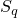
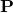
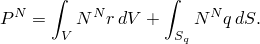
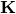
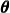

# 10.3.2 生成热矩阵

**产品：** Abaqus/Standard  

##### **参考文献**

- ["单元矩阵装配实用程序，" 第 3.2.26 节"](pt01ch03s02abx26.md)
- [*ELEMENT OPERATOR OUTPUT](../key/key-link.md#usb-kws-helementoperatoroutput)

### 概述

热矩阵生成：
- 允许通过生成表示热容量、热传导率和特定时间载荷的全局或单元矩阵来对模型数据（如网格和材料信息）进行数学抽象；
- 将矩阵数据写入可被 Abaqus 进一步处理的二进制 SIM 文档；以及
- 只能作为非耦合热传递分析的一部分使用。

### 简介

线性化热传递有限元模型可以用热载荷向量和表示热容量和热传导率的矩阵来概括。这种数学抽象服务于各种目的。例如，您可以使用这些矩阵与其他用户、供应商或软件包交换模型数据，而无需交换网格或材料信息。您还可以在模型降阶等技术中使用这些矩阵。这种抽象也可以扩展到瞬态非线性问题，这些问题可以被视为由离散时间热矩阵数据构建的分段线性模型系列。

热矩阵生成发生在热传递分析中，并考虑模型中所有当前的边界条件、载荷和材料响应。生成的矩阵存储在名为 `*jobname*THERM*n*.sim` 的 SIM 文档中，其中 *jobname* 是输入文件或分析作业的名称，*n* 是生成矩阵的 Abaqus 热传递步骤的编号。

#### 定义矩阵类型

空间离散热传递方程的连续时间描述（请参阅["非耦合热传递分析，" Abaqus 理论指南第 2.11.1 节](../stm/stm-link.md#stm-anl-uncoupledheat)）为


其中  是温度场， 是有限元插值函数， 是材料密度， 是内部能量对时间的导数， 是（可能是各向异性的）传导率矩阵， 是每单位体积规定的热通量， 是域的体积， 是每单位面积热通量  或者直接规定或者通过薄膜和辐射条件规定的表面。

外部通量向量  定义为



内部通量向量  定义为


净通量向量  定义为内部通量向量  和外部通量向量  的和。热容量矩阵  定义为


热传导率矩阵  定义为


也就是说，热传导率矩阵是净通量向量相对于节点温度向量  的负导数，因此包括温度依赖通量条件（如薄膜和辐射）的影响。

#### 指定矩阵类型

您可以生成表示以下模型特征的热矩阵：
- 热容量
- 热传导率
- 载荷

如果热传导率特性是温度依赖的，则热传导率矩阵具有非对称贡献。只有在步骤定义中激活了非对称求解器时，才考虑此项（请参阅["定义分析，" 第 6.1.2 节"](pt03ch06s01abo05.md)）。

载荷矩阵包含节点外部通量向量或对应于热传递步骤中定义的载荷的净通量向量。

| **输入文件用法：** | 使用以下选项生成热容量矩阵： |
| --- | --- |
|  | ``` [*ELEMENT OPERATOR OUTPUT](../key/key-link.md#usb-kws-helementoperatoroutput), DAMPING ``` 使用以下选项生成热传导率矩阵： ``` [*ELEMENT OPERATOR OUTPUT](../key/key-link.md#usb-kws-helementoperatoroutput), STIFFNESS ``` 使用以下选项生成外部通量向量： ``` [*ELEMENT OPERATOR OUTPUT](../key/key-link.md#usb-kws-helementoperatoroutput), LOAD, LOADTYPE=EXTERNAL ``` 使用以下选项生成净通量向量： ``` [*ELEMENT OPERATOR OUTPUT](../key/key-link.md#usb-kws-helementoperatoroutput), LOAD, LOADTYPE=NET ``` |

#### 为模型的一部分生成矩阵

默认情况下，热矩阵为模型中所有支持的单元类型生成。您可以请求 Abaqus/Standard 为由单元集定义的模型部分生成矩阵。

| **输入文件用法：** | ``` [*ELEMENT OPERATOR OUTPUT](../key/key-link.md#usb-kws-helementoperatoroutput), ELSET=*element set name* ``` |
| --- | --- |

#### 指定矩阵生成的频率

默认情况下，热矩阵为请求它的步骤中的每个增量生成。您可以请求 Abaqus/Standard 以指定频率生成矩阵。

| **输入文件用法：** | ``` [*ELEMENT OPERATOR OUTPUT](../key/key-link.md#usb-kws-helementoperatoroutput), FREQUENCY=*output frequency* ``` |
| --- | --- |

#### 生成装配矩阵

默认情况下，热矩阵以逐单元形式写入 SIM 文档。您可以将装配矩阵写入 SIM 文档，这被推荐用于为大单元集或以频繁间隔请求热矩阵输出的情况。

| **输入文件用法：** | ``` [*ELEMENT OPERATOR OUTPUT](../key/key-link.md#usb-kws-helementoperatoroutput), ASSEMBLE ``` |
| --- | --- |

### 初始条件

热矩阵生成发生在一般分析过程中。因此，生成的矩阵包括瞬态分析中初始条件的影响。

### 边界条件

规定的温度边界条件不会施加到生成的热矩阵和载荷向量上。

### 载荷

非耦合热传递分析中支持的所有类型载荷都可以用于热矩阵生成。有关施加载荷的更多信息，请参阅["施加载荷：概述，" 第 34.4.1 节"](pt07ch34s04aus120.md)。作为温度函数的载荷类型（如薄膜和辐射）会对热传导率矩阵贡献额外的"载荷刚度"项。

### 预定义场

可以为热矩阵生成指定所有类型的预定义场。有关指定预定义场的更多信息，请参阅["预定义场，" 第 34.6.1 节"](pt07ch34s06aus128.md)。

### 材料选项

Abaqus/Standard 中可用于非耦合热传递的所有类型材料都可以用于热矩阵生成。

### 单元

只有连续体扩散热传递单元和热接触单元支持热矩阵生成。热矩阵仅针对支持的单元写入 SIM 文档。

### 输出

生成的矩阵以逐单元或装配形式写入输出 SIM 文档。为了效率，只有非零矩阵条目存储在 SIM 文档中。如果矩阵是对称的，则只存储矩阵上三角部分的非零条目。您可以使用矩阵装配实用程序（["单元矩阵装配实用程序，" 第 3.2.26 节"](pt01ch03s02abx26.md)）来装配 SIM 文档中的单元矩阵和/或将装配矩阵写入文本文件。

### 限制

使用自由度消除技术实现的约束（如绑定约束）不会为热矩阵输出处理。此外，空腔辐射效应不考虑用于热矩阵输出。

### 输入文件模板

```
[*HEADING](../key/key-link.md#usb-kws-mheading)
…
**
[*STEP](../key/key-link.md#usb-kws-hstep)
*Options to define an uncoupled heat transfer analysis.*
…
[*BOUNDARY](../key/key-link.md#usb-kws-hboundary)
*Options to define the boundary conditions for the heat transfer step.*
**
[*CFLUX](../key/key-link.md#usb-kws-hcflux) and/or [*DFLUX](../key/key-link.md#usb-kws-hdflux) and/or [*DSFLUX](../key/key-link.md#usb-kws-hdsflux)
*Data lines to define thermal loading*
[*FILM](../key/key-link.md#usb-kws-hfilm) and/or [*SFILM](../key/key-link.md#usb-kws-hsfilm) and/or [*RADIATE](../key/key-link.md#usb-kws-hradiate) and/or [*SRADIATE](../key/key-link.md#usb-kws-hsradiate)
*Data lines to define convective film and radiation conditions*
**
[*ELEMENT OPERATOR OUTPUT](../key/key-link.md#usb-kws-helementoperatoroutput), ASSEMBLE, STIFFNESS, DAMPING,
LOAD, LOADTYPE=EXTERNAL, FREQUENCY=1
**
*Options to define the output requests for the heat transfer step. *
**
[*END STEP](../key/key-link.md#usb-kws-hendstep)
```
