# 10.4.3 展示循环对称性的模型分析

**产品：** Abaqus/Standard  Abaqus/CAE  

##### **参考文献**

- ["自然频率提取，" 第 6.3.5 节"](pt03ch06s03at10.md)
- ["基于模态的稳态动力学分析，" 第 6.3.8 节"](pt03ch06s03at13.md)
- [*CYCLIC SYMMETRY MODEL](../key/key-link.md#usb-kws-mcycsymmodel)
- [*SELECT CYCLIC SYMMETRY MODES](../key/key-link.md#usb-kws-hselectcycsymmodes)
- [*SURFACE](../key/key-link.md#usb-kws-msurface)
- [*TIE](../key/key-link.md#usb-kws-mtie)
- [Abaqus/CAE 用户指南第 15.13.19 节，"定义循环对称性"](../usi/usi-link.md#usi-itn-help-cyclicsymmetry)

### 概述

Abaqus/Standard 中的循环对称分析技术：
- 可以基于重复扇区模型分析具有循环对称性的 360 结构的行为；
- 可以确定循环对称载荷在静态、准静态和热传递分析中的响应；
- 可以使用块 Lanczos 特征频率提取过程计算 360 结构的所有特征频率和特征模态；
- 可以确定基于模态的稳态动力学分析中对应于给定循环对称模式的响应；以及
- 不要求在对称表面上使用匹配的网格。

### 简介

展示循环对称性的结构为分析师提供了通过仅分析模型的单个重复扇区来以相当低的计算成本分析整个 360 结构的机会。通常，这是可以识别的最小扇区，尽管这不是必需的。例如，如果结构由 16 个重复扇区组成，则可以使用包含两个重复扇区的 45 模型。扇区沿循环对称轴以逆时针方向编号（如下所述）。当然，这比使用包含一个扇区的 22.5 模型效率低。重复扇区的两个对称表面上的网格没有任何匹配限制。

在这种分析中必须考虑两种基本情况：具有循环对称初始状态和循环对称响应的模型，以及具有循环对称初始状态但非对称响应的模型。Abaqus/Standard 中的循环对称能力提供循环对称结构的线性和非线性分析，循环对称响应。结构循环对称的条件在整个分析过程中保持成立，因此在载荷步骤中，在任何时候都不可能在结构中出现任何非对称变形。因此，对于这种情况，只能施加循环对称载荷。

展示非对称响应的循环对称结构的分析需要额外考虑。这种分析只能在线性扰动步骤中执行，因为非对称变形会使一般非线性分析中任何后续步骤的循环对称"基础状态"假设失效。整个循环对称结构的完整响应（例如图 10.4.3-1 中所示的结构）可以表示为几个独立基本响应的线性组合，每个响应对应于某个 *k* 倍循环对称模式。

**图 10.4.3-1** 循环对称结构。

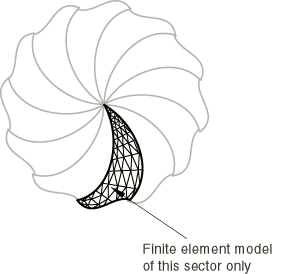

循环对称模式编号（有时也称为"节点直径"）表示基本响应中沿圆周的波数。图 10.4.3-2、图 10.4.3-3 和图 10.4.3-4 说明了包含四个重复扇区的循环对称结构中对应于 0、1 和 2 倍模式（节点直径 0、1 和 2）的基本响应。可以通过对对称单个扇区求解一系列相应的线性分析来执行完整的线性扰动分析。单个扇区上的循环对称边界条件（与各种循环对称模式相关联）产生 Hermitian 刚度矩阵和质量矩阵（具有对称实部和反对称虚部的复矩阵）。序列中的第 *k* 个线性分析使用与结构响应 *k* 倍循环对称模式对应的对称条件执行。对于展示 *N* 倍循环对称的结构，只需要 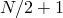（*N* 偶数）或 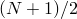（*N* 奇数）个此类分析。这以相对较低的计算成本获得了整个结构的响应解。

**图 10.4.3-2** 对应于 0 倍循环对称模式的响应。


**图 10.4.3-3** 对应于 1 倍循环对称模式的响应。

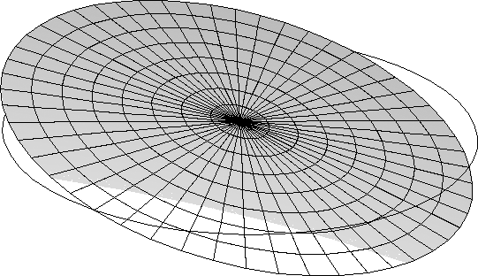

**图 10.4.3-4** 对应于 2 倍循环对称模式的响应。


要执行循环对称结构的一般线性分析，外部力应表示为基本载荷的线性组合，每个基本载荷对应一个对称模式并激发对应于相同模式的结构响应。在静态分析中，尚未实现在 0 倍模式以外的任何模式上定义载荷的能力。由于 0 倍模式的响应保持循环对称，此类结构的分析可以在一般非线性步骤中执行，也可以在线性扰动步骤中执行（如上所述）。出于同样的原因，此类步骤可以用作循环对称线性扰动步骤的预载步骤。

循环对称结构的非对称响应提取目前仅适用于使用块 Lanczos 方法的特征频率提取分析（["自然频率提取，" 第 6.3.5 节"](pt03ch06s03at10.md)）和频域、基于模态的稳态动力学分析（["基于模态的稳态动力学分析，" 第 6.3.8 节"](pt03ch06s03at13.md)）。可以为特定循环对称模式、一组循环对称模式或所有循环对称模式提取对应于对称和非对称特征模态的自然频率。它们可以在后续稳态动力学分析中使用。解被投影到的特征模态的选择如["基于模态的稳态动力学分析"第 6.3.8 节"](pt03ch06s03at13.md#usb-anl-asteadystdyn-selecteigen-damping)中的"选择模态和指定阻尼"所述。

在基于模态的稳态动力学分析中，集中载荷、分布载荷和表面载荷可以定义为投影到特定循环对称模式上。在同一稳态动力学步骤内，所有施加的载荷必须作为投影到相同循环对称模式上给出。此限制意味着在给定稳态动力学步骤内所有载荷的指定循环对称模式必须相同。

### 定义循环对称模型

定义模型的单个扇区（称为"基准扇区"）的网格。指定 360 模型中的扇区数 *n*。通过指定位于轴上的两个点的坐标（全局坐标系中）来定义对称轴。轴方向从第一个点到第二个点，扇区沿轴以逆时针方向编号，基准扇区为扇区编号 1。对于二维模型，只需在轴上给出一个点。轴方向假定为正 *z* 方向；因此，扇区在 *x*–*y* 平面中以逆时针方向编号。

| **输入文件用法：** | ``` [*CYCLIC SYMMETRY MODEL](../key/key-link.md#usb-kws-mcycsymmodel), N=*n* ``` |
| --- | --- |
|  | 对于定义为部件实例装配的模型，[*CYCLIC SYMMETRY MODEL](../key/key-link.md#usb-kws-mcycsymmodel) 选项必须出现在模型定义中（请参阅["定义装配，" 第 2.10.1 节"](pt01ch02s10aus28.md)）。 |

| **Abaqus/CAE 用法：** | 相互作用模块：****相互作用****创建****：**循环对称**：**扇区总数**：*n* |
| --- | --- |

#### 应用循环对称约束

要应用循环对称约束，您必须定义基准扇区每一侧上的一对或多对对应表面（请参阅["表面：概述，" 第 2.3.1 节"](pt01ch02s03aus16.md)）。然后，您可以使用循环对称基于表面的绑定约束在每对对应表面之间应用循环对称约束（请参阅["在 Abaqus/Standard 中定义绑定接触，" 第 36.3.7 节"](pt09ch36s03aus151.md)）。绑定约束定义中指定的每对中的第一个表面是从表面表面上节点的所有自由度将通过内部生成的多点约束被消除。每对的第二个表面是主表面。如果定义了多对从/主表面，则从表面到主表面的旋转方向必须对所有对相同（即顺时针或逆时针）。

| **输入文件用法：** | 使用以下选项在两个表面之间应用循环对称约束： |
| --- | --- |
|  | ``` [*SURFACE](../key/key-link.md#usb-kws-msurface), NAME=*master* [*SURFACE](../key/key-link.md#usb-kws-msurface), NAME=*slave* [*TIE](../key/key-link.md#usb-kws-mtie), CYCLIC SYMMETRY, NAME=*cyclic* *slave, master* ``` |

| **Abaqus/CAE 用法：** | 相互作用模块：****相互作用****创建****：**循环对称**：在提示区域点击**表面** |
| --- | --- |

##### 使用不匹配的表面网格

对于不匹配的表面网格，如图 10.4.3-5 所示，较细的网格通常应该是从表面。不匹配的网格可能在应力场中引起一些局部不准确。不准确的程度取决于网格之间不匹配的程度以及所使用的单元类型：对于二阶（修正）四面体单元，不准确通常最为明显。因此，如果使用不匹配的表面网格，建议在局部应力场精度不重要的区域选择扇区边界。

**图 10.4.3-5** 具有不匹配节点的循环对称表面。

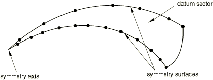

对于壳，循环对称条件必须应用于壳单元边缘上的节点。目前不支持在壳边缘上定义的基于单元的表面的循环对称。因此，如果壳单元使用不匹配的网格，则应在与形成主表面的边缘相邻的壳单元的顶部或底部上定义基于单元的表面。可以在形成从表面的边缘上定义基于节点的表面。

##### 应用节点到节点循环对称约束

对于匹配的网格，任一表面都可以选作从表面。如果表面具有匹配的网格，如图 10.4.3-6 所示，则可以使用基于节点的主表面来获得节点到节点循环对称约束。这样做的优点是 Abaqus/Standard 将调整从表面上节点的位置，使它们与主表面上的节点位置精确匹配。这产生最准确的结果并最小化计算成本。在这种情况下，从表面通常也将被选择为基于节点的表面，尽管从计算上讲这并不重要，因为无论哪种情况都会应用严格的节点到节点约束。

**图 10.4.3-6** 具有节点到节点匹配的循环对称表面。

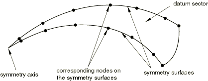

对于离散构件（如桁架或梁），只能使用基于节点的表面来强制执行循环对称条件。

| **输入文件用法：** | 使用以下选项在两个基于节点的表面之间应用循环对称约束： |
| --- | --- |
|  | ``` [*SURFACE](../key/key-link.md#usb-kws-msurface), TYPE=NODE, NAME=*master* [*SURFACE](../key/key-link.md#usb-kws-msurface), TYPE=NODE, NAME=*slave* [*TIE](../key/key-link.md#usb-kws-mtie), CYCLIC SYMMETRY, NAME=*cyclic* *slave, master* ``` |

| **Abaqus/CAE 用法：** | 相互作用模块：****相互作用****创建****：**循环对称**：在提示区域点击**节点区域** |
| --- | --- |

#### 在对称轴上应用循环对称条件

如果节点位于对称轴上，则必须为 0 倍和 1 倍循环对称模式应用特殊的循环对称约束；而对于其他循环对称模式，必须约束所有自由度。对于 0 倍循环对称模式，垂直于对称轴的平面中的自由度被约束；对于 1 倍循环对称模式，沿对称轴的自由度被约束。只要节点包含在从表面、主表面或从表面和主表面的定义中，Abaqus/Standard 将自动创建这些约束。

### 获取循环对称结构的所有特征频率

可以使用具有 Lanczos 特征求解器的特征频率提取过程来提取循环对称结构的自然频率和相应特征模态（请参阅["自然频率提取，" 第 6.3.5 节"](pt03ch06s03at10.md)）。特征频率提取过程不需要其他信息。所有自然频率以常规（升序）排序。对于每个自然频率，报告循环对称模式编号。

特征模态以与数据（`.dat`）、结果（`.fil`）和输出数据库（`.odb`）文件中仅针对用户指定的基准扇区写入的自然频率对应的顺序写入。这些模态可以根据循环对称模式编号在 Abaqus/CAE 中扩展到整个结构。

有两种不同类型的特征模态：单个和配对。0 倍循环对称的特征模态始终是单个的。对于偶数 *N*， 倍循环对称的特征模态也是单个的。其余 （偶数 *N*）或 （奇数 *N*）循环对称模式的特征模态是配对的。配对特征模态对应的自然频率相等，并且总是在数据文件中的自然频率表中一起出现。将具有 *k* 倍循环对称性的特征模态 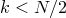 扩展到扇区 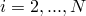 可以通过以下方式进行：


其中


这里 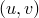 和 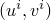 分别是第一（基准）扇区和第 *i* 扇区上双自然频率对应的配对特征模态；以及 。

从上面的表达式可以清楚地看出，具有 0 倍循环对称性的特征模态始终是对称的；即 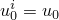。类似地，对于偶数 *N*，具有  倍循环对称性的特征模态是单个的，因为 。

### 选择循环对称模式

您可以通过指定分析中使用的最低循环对称模式 *nmin* 和最高循环对称模式 *nmax* 来选择将为其执行特征频率分析的循环对称模式。默认情况下，*nmin* 为 0。默认情况下，*nmax* 为 （偶数 *N*）或 （奇数 *N*）。*nmin* 的值不能大于 *nmax* 的值，并且 *nmax* 的值不能大于默认值。如果不选择循环对称模式，则分析中会考虑所有可能的循环对称模式。您可以选择仅使用偶数循环对称模式。

| **输入文件用法：** | 使用以下选项指定循环对称模式： |
| --- | --- |
|  | ``` [*SELECT CYCLIC SYMMETRY MODES](../key/key-link.md#usb-kws-hselectcycsymmodes), NMIN=*nmin*, NMAX=*nmax* ``` 使用以下选项仅请求偶数循环对称模式： ``` [*SELECT CYCLIC SYMMETRY MODES](../key/key-link.md#usb-kws-hselectcycsymmodes), EVEN ``` |

| **Abaqus/CAE 用法：** | 使用以下选项指定循环对称模式： |
| --- | --- |
|  | 相互作用模块：****相互作用****创建****：**循环对称**：切换**指定范围**并指定**最低节点直径**和**最高节点直径** 您无法在 Abaqus/CAE 中仅请求偶数循环对称模式。 |

#### 为稳态动力学步骤选择循环对称模式

在稳态动力学步骤中只能激发单个循环模式。您在载荷定义中指定与载荷关联的循环对称模式。

| **输入文件用法：** | 使用以下选项之一： |
| --- | --- |
|  | ``` [*CLOAD](../key/key-link.md#usb-kws-hcload), CYCLIC MODE=*k*, REAL or IMAGINARY [*DLOAD](../key/key-link.md#usb-kws-hdload), CYCLIC MODE=*k*, REAL or IMAGINARY [*DSLOAD](../key/key-link.md#usb-kws-hdsload), CYCLIC MODE=*k*, REAL or IMAGINARY ``` |

| **Abaqus/CAE 用法：** | 相互作用模块：****相互作用****创建****：**循环对称**：**激发的节点直径** |
| --- | --- |

### 循环对称分析技术与 MPC 类型 CYCLSYM 的比较

MPC 类型 CYCLSYM（["一般多点约束，" 第 35.2.2 节"](pt08ch35s02aus130.md)）提供了循环对称分析能力提供的功能的子集。对于特征值分析，MPC 类型 CYCLSYM 仅允许提取对称（0 倍）模式。循环对称分析能力允许使用表面（["表面：概述，" 第 2.3.1 节"](pt01ch02s03aus16.md)）来定义模型的对称表面，这使得可以在对称表面上使用不匹配的网格，而 MPC 类型 CYCLSYM 只能基于节点到节点应用。

### 限制

存在以下限制：
- 循环对称特征值提取过程不可用继续功能。每个特征值提取步骤都不会重用先前特征值提取步骤中获得的任何特征模态。
- 在给定稳态动力学步骤内定义的所有载荷的指定循环对称模式必须相同。
- 基底运动未在循环对称模型中实现。
- 循环对称条件应用于应力/位移分析中的机械自由度和热传递分析中的温度自由度。循环对称条件不应用于声压、孔隙压力和电自由度。
- 空腔辐射不能用于循环对称模型。

### 初始条件

所有应用的初始条件必须是循环对称的。

### 边界条件

只能应用循环对称边界条件。不能将对界条件应用于从循环对称表面上的节点。

### 载荷

在静态分析中只能应用循环对称载荷。不可施加 Coriolis 载荷，并且在频率分析中不考虑 Coriolis 载荷刚度的影响。

在基于模态的稳态动力学分析中，载荷为特定循环对称模式在基准扇区上定义，这在载荷定义中指明。对于 *k* 倍循环对称模式 ，扇区  上的复载荷 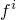 和 （分别对应于实部和虚部分量）通过以下方式获得：

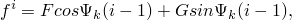


其中  和 *F* 和 *G* 分别是，为基准扇区指定的载荷的实部和虚部分量。对于 0 倍循环对称模式（），这种类型的载荷对应于循环对称载荷模式，其中 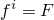 和 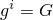。对于 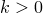，当空间恒定载荷模式施加到旋转结构时（或当恒定载荷模式围绕结构旋转时）会产生这种类型的载荷。对于  倍模式，扇区 *i* 上的复载荷为： 和 。

### 预定义场

只能应用循环对称预定义场。因此，预定义场应在基准扇区的每一侧具有相同的值。

### 材料选项

一般过程的循环对称模型对材料模型没有特定限制。对于频率分析过程，请参阅["自然频率提取，" 第 6.3.5 节"](pt03ch06s03at10.md)中的说明。

### 单元

轴对称单元不应在循环对称模型中使用。

### 输出

节点位移和元素输出变量（如应力、应变和截面力）仅适用于基准扇区。数据文件中列出的质量是为整个模型计算的。

在特征值提取过程中，以下特殊条件适用：
- 如果选择位移特征向量归一化（默认），则基准扇区上每个特征向量中的最大位移条目为单位 1。如果选择质量特征向量归一化，则对特征向量进行归一化，使基准扇区上计算的广义质量为单位 1。详情请参阅["自然频率提取，" 第 6.3.5 节"](pt03ch06s03at10.md)。
- 特征值编号、循环对称模式编号以及相应频率（以弧度/时间和周期/时间为单位）与广义质量、复合模态阻尼因子、参与因子和模态有效质量一起列在数据文件中。广义质量在基准扇区上计算；复合模态阻尼因子、参与因子和模态有效质量为整个模型计算。
- 您可以通过选择需要输出的模式来限制对结果和数据文件的输出（请参阅["输出到数据和结果文件，" 第 4.1.2 节"](pt02ch04s01aus39.md)）。
- 使用 Abaqus/CAE 可以为任何扇区显示静态位移和特征模态。稳态、基于模态的动态分析的结果也可以为任意数量的扇区（包括整个模型）进行动画处理。

### 输入文件模板

```
[*HEADING](../key/key-link.md#usb-kws-mheading)
…
**
[*CYCLIC SYMMETRY MODEL](../key/key-link.md#usb-kws-mcycsymmodel), N=*integer*
*N denotes the number of sectors in the entire 360 model.*
…
**
[*SURFACE](../key/key-link.md#usb-kws-msurface), NAME=*name*, TYPE=ELEMENT
[*SURFACE](../key/key-link.md#usb-kws-msurface), NAME=*name*, TYPE=NODE
*Surface description for the slave and master nodes that will be referenced in the [*TIE](../key/key-link.md#usb-kws-mtie) option.*
…
**
[*TIE](../key/key-link.md#usb-kws-mtie), CYCLIC SYMMETRY
*Indicates the internal MPCs that tie the master and slave surfaces
using the cyclic symmetry condition in the cyclic symmetry models only.*
*Data lines to specify surface names that will be tied with this option.*
…
**
[*STEP](../key/key-link.md#usb-kws-hstep) (,NLGEOM)
*If NLGEOM is used, initial stress and preload stiffness effects
will be included in subsequent linear perturbation steps, including the
frequency extraction step*
[*STATIC](../key/key-link.md#usb-kws-hstatic)
...
[*DLOAD](../key/key-link.md#usb-kws-hdload)
*Data lines to specify element or element set, load type, value, (direction).*
...
**
[*END STEP](../key/key-link.md#usb-kws-hendstep)
[*STEP](../key/key-link.md#usb-kws-hstep)
[*FREQUENCY](../key/key-link.md#usb-kws-hfrequency), EIGENSOLVER=LANCZOS
…
[*SELECT CYCLIC SYMMETRY MODES](../key/key-link.md#usb-kws-hselectcycsymmodes), NMAX=*integer*, NMIN=*integer*, EVEN
…
**
[*END STEP](../key/key-link.md#usb-kws-hendstep)
[*STEP](../key/key-link.md#usb-kws-hstep)
[*STEADY STATE DYNAMICS](../key/key-link.md#usb-kws-hsteadystdyn)
…
[*SELECT EIGENMODES](../key/key-link.md#usb-kws-hselecteigenmodes)
*Use this option to specify the list of eigenmodes used in the response.*
[*MODAL DAMPING](../key/key-link.md#usb-kws-hmodaldamp)
*Data lines to specify damping coefficients associated with eigenmodes.*
…
[*CLOAD](../key/key-link.md#usb-kws-hcload), CYCLIC MODE=*integer*, REAL or IMAGINARY
*Data lines to specify node or node set, degree of freedom, value*
[*DLOAD](../key/key-link.md#usb-kws-hdload), CYCLIC MODE=*integer*, REAL or IMAGINARY
*Data lines to specify element or element set, load type, value, (direction)*
…
[*DSLOAD](../key/key-link.md#usb-kws-hdsload), CYCLIC MODE=*integer*, REAL or IMAGINARY
*Data lines to specify element or element set, load type, value, (direction)*
…
**
[*END STEP](../key/key-link.md#usb-kws-hendstep)
```
