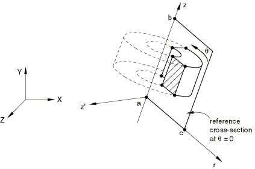
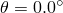

# 10.4.1 对称模型生成

**产品：** Abaqus/Standard  

##### **参考文献**

- [*SYMMETRIC MODEL GENERATION](../key/key-link.md#usb-kws-maximodelgen)

### 概述

在 Abaqus/Standard 中可以通过以下方式创建三维模型：
- 绕其旋转轴旋转轴对称模型；
- 绕其对称轴旋转单个三维扇区；或
- 组合对称三维模型的两个部分，其中一个部分是原始模型，另一部分是通过对称线或对称平面对原始模型进行反射获得的。

Abaqus/Standard 还提供将原始分析获得的解传递到新模型的功能（请参阅["从对称网格或部分三维网格传递结果到完整三维网格，" 第 10.4.2 节"](pt04ch10s04aus64.md)）。

只能使用应力/位移、热传递、耦合温度-位移和声学单元来生成新模型。

### 模型生成

对称模型生成功能可用于通过绕其旋转轴旋转轴对称模型来创建三维模型，通过绕其对称轴旋转单个三维扇区，或通过组合对称模型的两个部分来创建三维模型，其中一个部分是原始模型，另一部分是原始模型通过线或平面对称反射得到的。原始模型必须已保存到重启文件。对于定义为部件实例装配的模型，对称模型生成功能不可用。因此，不支持包含引号的单元集名称或节点集名称。

整个三维模型——包括节点、单元、截面定义、材料和方向定义、钢筋以及接触对定义——是从原始模型生成的。不允许从具有一般接触的模型进行对称模型生成。您必须重新定义大多数类型的运动约束（["运动约束：概述，" 第 35.1.1 节"](pt08ch35s01abo32.md)）。但是，原始模型中定义的基于表面的约束（["网格绑定约束，" 第 35.3.1 节"](pt08ch35s03aus132.md)）和嵌入单元约束（["嵌入单元，" 第 35.4.1 节"](pt08ch35s04aus136.md)）将在新三维模型中自动生成。作为历史数据一部分对模型进行的更改——单元或接触对移除/重新激活（["单元和接触对移除和重新激活，" 第 11.2.1 节"](pt04ch11s02aus66.md)）或摩擦特性更改（["在 Abaqus/Standard 分析期间更改摩擦特性"中的"摩擦行为，" 第 37.1.5 节"](pt09ch37s01aus169.md#usb-cni-afriction-change-std)）——不会传递到新模型此类更改将需要在 new 模型的历史数据中重新定义。原始模型中定义的所有单元集和节点集将在新模型中使用。这些集合将包含源自原始集合的所有新单元和节点。

还可以定义附加节点、单元、接触表面等，以创建原始模型中未指定的模型部分。您必须确保这些节点和单元的编号与对称模型生成功能使用的编号不冲突。您可以控制新模型中的节点和单元编号（如以下针对每种旋转模型类型所述），以便您可以定义模型的附加部分，而不会面临单元和节点标签冲突的风险。在定义新模型附加部分时应使用的最小节点/单元编号应大于对称模型生成功能生成的最大节点/单元编号。

#### 消除重复节点

在某些情况下会生成重复节点。可以消除此类节点以确保网格正确连接。可以在旋转模型的旋转轴上、周期模型扇区之间的连接平面上以及反射模型两部分之间的连接平面上生成重复节点。您可以指定用于搜索重复节点的容差距离 *d*。默认距离是平均单元尺寸的 1.0%。在某些情况下，如果周期模型原始扇区中一个连接平面上两个节点之间的距离小于默认容差距离，则需要指定小于默认值的容差距离。模型中其他位置（如界面表面之间或使用任何其他模型定义选项生成的模型部分上）的间距紧密的节点不会被消除。

| **输入文件用法：** | 使用以下选项之一指定用于搜索重复节点的容差： |
| --- | --- |
|  | ``` [*SYMMETRIC MODEL GENERATION](../key/key-link.md#usb-kws-maximodelgen), PERIODIC, TOLERANCE=*d* [*SYMMETRIC MODEL GENERATION](../key/key-link.md#usb-kws-maximodelgen), REVOLVE, TOLERANCE=*d* [*SYMMETRIC MODEL GENERATION](../key/key-link.md#usb-kws-maximodelgen), REFLECT, TOLERANCE=*d* ``` |

#### 将新模型定义写入外部文件

您可以指定外部文件的名称（不带扩展名），新模型定义的数据将写入该文件。扩展名 `.axi` 将添加到提供的文件名。可以编辑该文件以修改或扩展由 Abaqus/Standard 生成的模型。

| **输入文件用法：** | 使用以下选项之一： |
| --- | --- |
|  | ``` [*SYMMETRIC MODEL GENERATION](../key/key-link.md#usb-kws-maximodelgen), PERIODIC, FILE NAME=*name* [*SYMMETRIC MODEL GENERATION](../key/key-link.md#usb-kws-maximodelgen), REVOLVE, FILE NAME=*name* [*SYMMETRIC MODEL GENERATION](../key/key-link.md#usb-kws-maximodelgen), REFLECT, FILE NAME=*name* ``` |

#### 识别重启文件

对称模型生成功能使用旧模型的重启（`.res`）、分析数据库（`.stt` 和 `.mdl`）以及部件（`.prt`）文件来生成新模型。必须在运行 Abaqus 的命令中使用 **oldjob** 参数或在命令过程发出的请求中回答时指定旧模型的重启文件名称（请参阅["Abaqus/Standard、Abaqus/Explicit 和 Abaqus/CFD 执行，" 第 3.2.2 节"](pt01ch03s02abx02.md)）。

#### 验证新模型

建议在执行分析之前仔细验证新模型。对称模型生成功能仅需要数据检查运行期间存储在重启文件中的信息来生成新模型，这允许您在执行原始模型的分析之前验证新模型。数据检查分析通过在运行 Abaqus 的命令中使用 **datacheck** 参数来执行（请参阅["Abaqus/Standard、Abaqus/Explicit 和 Abaqus/CFD 执行，" 第 3.2.2 节"](pt01ch03s02abx02.md)）。

### 旋转轴对称横截面

您可以通过绕从规定参考平面  开始的平面对二维轴对称模型的横截面进行旋转来创建三维模型（见图 10.4.1-1）。新三维模型的对称轴和参考平面可以相对于全局坐标系以任意方向定向。可以在周向指定非均匀离散化。

**图 10.4.1-1** 旋转轴对称横截面。



指定图 10.4.1-1 中所示点 *a*、*b* 和 *c* 的坐标，然后是定义周向离散化的列表，其中包含段角度、每段单元数以及段的偏置比。可以使用多个段角度（每个具有不同的单元细分数量和不同的偏置比）来定义旋转模型整个圆周的完整离散化。无论为重复节点容差指定什么值，通过 360.0 旋转的横截面的端点将始终连接到旋转原点 。

| **输入文件用法：** | ``` [*SYMMETRIC MODEL GENERATION](../key/key-link.md#usb-kws-maximodelgen), REVOLVE ``` |
| --- | --- |

#### 局部方向系统

局部圆柱坐标系始终用于应力、应变等的单元输出。如果原始轴对称模型中的材料不包含方向定义，则提供默认局部方向定义。此默认方向定义为系统的极轴沿旋转轴，并额外绕局部 1 方向旋转 90.0，因此局部轴为 1=径向、2=轴向、3=周向。如果使用壳或膜，则将局部 2 和 3 轴投影到壳或膜表面上作为表面上的局部方向。即使在原始轴对称模型中指定了方向，此方向系统始终被提供。但是，如果将轴对称分析的结果映射到新三维模型（请参阅["从对称网格或部分三维网格传递结果到完整三维网格，" 第 10.4.2 节"](pt04ch10s04aus64.md)），并且方向定义与原始模型中的材料相关联，则绕对称轴旋转的原始方向将替换此默认方向定义。

#### 控制新节点和单元编号

您可以定义三维模型周围每个节点和单元之间的编号增量。编号从参考横截面  开始。参考横截面使用与原始轴对称模型相同的编号。默认值是原始轴对称模型中使用的最大节点和单元编号。对编号的控制允许您定义模型的附加部分，而不会面临单元和节点标签冲突的风险。每个偏移值应分别大于或等于原始模型中使用的最大节点或单元标签。指定偏移值时，必须注意生成的节点或单元不超过允许的最大值 999,999,999。

| **输入文件用法：** | ``` [*SYMMETRIC MODEL GENERATION](../key/key-link.md#usb-kws-maximodelgen), REVOLVE, NODE OFFSET=*offset*, ELEMENT OFFSET=*offset* ``` |
| --- | --- |

#### 轴对称单元与三维单元之间的对应关系

原始二维模型中使用的单元类型决定了新三维模型中的单元类型。您可以指定新单元是一般三维单元还是圆柱单元。通用和圆柱单元可以在同一模型中使用。

| **输入文件用法：** | ``` [*SYMMETRIC MODEL GENERATION](../key/key-link.md#usb-kws-maximodelgen), REVOLVE *points a and b 的坐标* *point c 的坐标* *segment angle, number of elements per segment, bias ratio*, CYLINDRICAL or GENERAL ``` |
| --- | --- |
|  | 例如，以下输入指定在 300 段中 4 个圆柱单元，在 60 段中 10 个一般单元： ``` [*SYMMETRIC MODEL GENERATION](../key/key-link.md#usb-kws-maximodelgen), REVOLVE *ax, ay, az, bx, by, bz* *cx, cy, cz* 300.0, 4, 1.0, CYLINDRICAL 60.0, 10, 1.0, GENERAL ``` |

规则轴对称单元（CAX）、具有扭曲的轴对称单元（CGAX）、壳单元、膜单元、刚性单元和表面单元可用于二维模型；但是，不能使用非线性轴对称单元（CAXA）。包含不协调模式单元、一阶减缩积分连续体单元、壳单元或刚性单元的二维模型不能用于生成圆柱单元。轴对称单元类型与等效三维单元类型（通用或圆柱）之间的对应关系如表 10.4.1-1 所示。

**表 10.4.1-1** 轴对称与三维（通用和圆柱）单元类型之间的对应关系。
| 轴对称单元 | 通用三维单元 | 圆柱单元 |
| --- | --- | --- |
| ACAX3 | AC3D6 |  |
| CAX3 | C3D6 | CCL9 |
| CAX3H | C3D6H | CCL9H |
| CGAX3 | C3D6 | CCL9 |
| CGAX3H | C3D6H | CCL9H |
| CGAX3T | C3D6T |  |
| DCAX3 | DC3D6 |  |
| ACAX4 | AC3D8 |  |
| CAX4 | C3D8 | CCL12 |
| CAX4H | C3D8H | CCL12H |
| CAX4I | C3D8I |  |
| CAX4R | C3D8R |  |
| CAX4RH | C3D8RH |  |
| CGAX4 | C3D8 | CCL12 |
| CGAX4H | C3D8H | CCL12H |
| CGAX4R | C3D8R |  |
| CGAX4RH | C3D8RH |  |
| CAX4T | C3D8T |  |
| CAX4RT | C3D8RT |  |
| CAX4HT | C3D8HT |  |
| CAX4RHT | C3D8RHT |  |
| CGAX4T | C3D8T |  |
| CGAX4RT | C3D8RT |  |
| CGAX4HT | C3D8HT |  |
| CGAX4RHT | C3D8RHT |  |
| DCAX4 | DC3D8 |  |
| DCCAX4 | DCC3D8 |  |
| DCCAX4D | DCC3D8D |  |
| ACAX6 | AC3D15 |  |
| CAX6 | C3D15 | CCL18 |
| CAX6H | C3D15H | CCL18H |
| CGAX6 | C3D15 | CCL18 |
| CGAX6H | C3D15H | CCL18H |
| DCAX6 | DC3D15 |  |
| ACAX8 | AC3D20 |  |
| CAX8 | C3D20 | CCL24 |
| CAX8H | C3D20H | CCL24H |
| CAX8R | C3D20R | CCL24R |
| CAX8RH | C3D20RH | CCL24RH |
| CGAX8 | C3D20 | CCL24 |
| CGAX8H | C3D20H | CCL24H |
| CGAX8R | C3D20R | CCL24R |
| CGAX8RH | C3D20RH | CCL24RH |
| CAX8T | C3D20T |  |
| CAX8RT | C3D20RT |  |
| CAX8HT | C3D20HT |  |
| CAX8RHT | C3D20RHT |  |
| CGAX8T | C3D20T |  |
| CGAX8RT | C3D20RT |  |
| CGAX8HT | C3D20HT |  |
| CGAX8RHT | C3D20RHT |  |
| DCAX8 | DC3D20 |  |
| SAX1 | S4R |  |
| DSAX1 | DS4 |  |
| SAX2 | S8R |  |
| DSAX2 | DS8 |  |
| MAX1 | M3D4R | MCL6 |
| MGAX1 | M3D4R | MCL6 |
| MAX2 | M3D8R | MCL9 |
| MGAX2 | M3D8R | MCL9 |
| RAX2 | R3D4 |  |
| SFMAX1 | SFM3D4R | SFMCL6 |
| SFMGAX1 | SFM3D4R | SFMCL6 |
| SFMAX2 | SFM3D8R | SFMCL9 |
| SFMGAX2 | SFM3D8R | SFMCL9 |

#### 限制

- 一阶和二阶单元不能一起用于轴对称模型。
- 弹簧、阻尼器、梁和桁架等非轴对称单元将在模型生成中被忽略。
- 只能旋转基于表面的接触对。使用一般接触的模型不能被旋转。使用接触单元建模的接触条件将在模型生成中被忽略。
- 包含不协调模式单元、一阶减缩积分连续体单元、壳单元或刚性单元的二维模型不能用于生成圆柱单元。
- 径向方向钢筋间距不均匀的轴对称单元不能被旋转。
- 大多数类型的运动约束不能被旋转。但是，原始模型中定义的基于表面的约束（["网格绑定约束，" 第 35.3.1 节"](pt08ch35s03aus132.md)）和嵌入单元约束（["嵌入单元，" 第 35.4.1 节"](pt08ch35s04aus136.md)）将在新三维模型中自动生成。
- 只能旋转应力/位移、热传递、耦合温度-位移和声学单元。

### 旋转三维扇区以创建周期模型

您可以通过绕对称轴旋转单个三维扇区来创建三维周期模型。周期模型中每个生成的扇区可以在周向跨越相同的角度（如通风盘），或者可以具有可变角度（如带胎面的轮胎）。在这两种情况下，每个扇区始终具有相同的几何形状和网格。对称轴和原始三维扇区都可以相对于全局坐标系以任意方向定向（见图 10.4.1-2）。扇区之间可以使用不匹配的表面网格。可以生成开放（结构有边缘）或闭合回路周期结构。如果需要创建闭合回路周期结构，则所有扇区的段角度之和必须等于 360。

**图 10.4.1-2** 旋转三维扇区以形成周期模型。


#### 定义具有恒定角度的周期模型

要定义具有恒定角度的周期模型，必须指定图 10.4.1-2 中所示点 *a* 和 *b* 的坐标以定义对称轴。然后定义原始扇区的段角度 （度）和生成的周期模型中包括原始扇区在内的三维重复扇区数 *N*。

| **输入文件用法：** | ``` [*SYMMETRIC MODEL GENERATION](../key/key-link.md#usb-kws-maximodelgen), PERIODIC=CONSTANT *points a and b 的坐标* *θ, N* ``` |
| --- | --- |

#### 定义具有可变角度的周期模型

要定义具有可变角度的周期模型，原始扇区两侧的表面必须完全平面。您指定图 10.4.1-2 中所示点 *a* 和 *b* 的坐标以定义对称轴。然后定义原始扇区的段角度 （度）和生成的周期模型中包括原始扇区在内的三维重复扇区数 *N*。接下来，您指定要生成的附加三维扇区数 *M*，以及相对于原始扇区应用于这些附加扇区的周向角度缩放因子 *f*。您可以根据需要定义附加扇区对和缩放因子。

| **输入文件用法：** | ``` [*SYMMETRIC MODEL GENERATION](../key/key-link.md#usb-kws-maximodelgen), PERIODIC=VARIABLE *points a and b 的坐标* *θ, N* *M1, f1* *M2, f2* *等* ``` |
| --- | --- |
|  | 例如，以下输入创建具有 7 个扇区的 210 三维模型，角度分别为 20、20、30、30、30、40 和 40： ``` [*SYMMETRIC MODEL GENERATION](../key/key-link.md#usb-kws-maximodelgen), PERIODIC=VARIABLE *ax, ay, az, bx, by, bz* 20.0,2 3,1.5 2,2.0 ``` |

#### 对具有不匹配网格的对称表面应用约束

如果原始扇区中的对称表面具有精确匹配的网格，如图 10.4.1-3 所示，则当绕对称轴旋转原始扇区以创建周期模型时，任何生成的重复节点都将自动消除，以确保相邻扇区之间的网格正确连接。

**图 10.4.1-3** 原始扇区上具有精确匹配网格的表面。


在所有其他情况下，您必须在原始模型中的原始扇区每一侧上定义一对或多对对应表面（请参阅["表面：概述，" 第 2.3.1 节"](pt01ch02s03aus16.md)），并在对称模型生成定义中指定对应表面对。

或者，您还可以指定容差距离，在该距离内，一个扇区表面上的节点必须位于相邻扇区对应表面的范围内才能被约束。距离对应表面比此容差更远的扇区表面上的节点不会被约束。容差距离的默认值是原始扇区表面典型单元尺寸的 5% 或 10%，具体取决于分别使用节点到表面还是表面对表面类型的约束。

您还可以指定是使用表面对表面（默认）还是节点到表面约束。然后，当绕对称轴旋转原始扇区以创建周期模型时，将使用自动生成的基于表面的绑定约束（["网格绑定约束，" 第 35.3.1 节"](pt08ch35s03aus132.md)）在自动生成的相邻对应表面对之间应用约束。每个指定对中的第一个表面是从表面表面上节点的所有自由度将通过内部生成的多点约束被消除。

| **输入文件用法：** | 在原始模型中使用以下选项： |
| --- | --- |
|  | ``` [*SURFACE](../key/key-link.md#usb-kws-msurface), NAME=*master* [*SURFACE](../key/key-link.md#usb-kws-msurface), NAME=*slave* ``` 在每个扇区具有恒定角度的新模型中使用以下选项： ``` [*SYMMETRIC MODEL GENERATION](../key/key-link.md#usb-kws-maximodelgen), PERIODIC=CONSTANT *ax, ay, az, bx, by, bz* *θ, N* *slave, master, tolerance distance,* SURFACE or NODE ``` 在每个扇区具有可变角度的新模型中使用以下选项： ``` [*SYMMETRIC MODEL GENERATION](../key/key-link.md#usb-kws-maximodelgen), PERIODIC=VARIABLE *ax, ay, az, bx, by, bz* *θ, N* *M, f* *slave, master, tolerance distance,* SURFACE or NODE ``` |

#### 局部方向系统

局部圆柱坐标系始终用于应力、应变等的单元输出。如果在原始三维扇区中指定了方向（请参阅["方向，" 第 2.2.5 节"](pt01ch02s02aus15.md)），则新模型中的方向系统通过绕对称轴旋转原始方向系统来定义。如果使用壳或膜，则将局部 2 和 3 轴投影到壳或膜表面上作为表面上的局部方向。如果原始三维扇区中的材料不包含方向定义，则提供默认局部方向定义。此默认方向通过绕新模型中的对称轴旋转原始模型中的全局坐标系来定义。

#### 控制新节点和单元编号

您可以定义三维模型周围每个节点和单元之间的编号增量。编号从原始三维重复扇区开始。原始三维重复扇区使用与原始模型相同的编号。默认值是原始模型中使用的最大节点和单元编号。对编号的控制允许您定义模型的附加部分，而不会面临单元和节点标签冲突的风险。每个偏移值应分别大于或等于原始模型中使用的最大节点或单元标签。指定偏移值时，必须注意生成的节点或单元不超过允许的最大值 999,999,999。

| **输入文件用法：** | ``` [*SYMMETRIC MODEL GENERATION](../key/key-link.md#usb-kws-maximodelgen), PERIODIC, NODE OFFSET=*offset*, ELEMENT OFFSET=*offset* ``` |
| --- | --- |

#### 限制

- 只能旋转基于表面的接触对。使用一般接触的模型不能被旋转。使用接触单元建模的接触条件将在模型生成中被忽略。
- 大多数类型的运动约束不能被旋转。但是，原始模型中定义的基于表面的约束（["网格绑定约束，" 第 35.3.1 节"](pt08ch35s03aus132.md)）和嵌入单元约束（["嵌入单元，" 第 35.4.1 节"](pt08ch35s04aus136.md)）将在新三维模型中自动生成。一个例外是，用于强制执行循环对称约束的基于表面的绑定不会被旋转。
- 基于表面的分布式耦合约束——例如，耦合（["耦合约束，" 第 35.3.2 节"](pt08ch35s03aus133.md)）、壳到实体耦合（["壳到实体耦合，" 第 35.3.3 节"](pt08ch35s03aus134.md)）和紧固件（["独立于网格的紧固件，" 第 35.3.4 节"](pt08ch35s03aus135.md)）——不能被旋转，必须重新定义。
- 只能旋转应力/位移、热传递、耦合温度-位移和声学单元。梁和框架单元不能被旋转。

### 反射部分三维模型

您可以通过组合对称三维模型的两个部分来创建三维模型。其中一个部分是原始模型，另一部分是通过对称线（见图 10.4.1-4）或对称平面（见图 10.4.1-5）对原始模型进行反射获得的。

指定图 10.4.1-4 和图 10.4.1-5 中所示点 *a*、*b* 和（如果需要）*c* 的坐标。

**图 10.4.1-4** 通过线  反射三维模型，节点偏移 *n*。


**图 10.4.1-5** 通过平面  反射三维模型，节点偏移 *n*。


| **输入文件用法：** | 使用以下选项之一： |
| --- | --- |
|  | ``` [*SYMMETRIC MODEL GENERATION](../key/key-link.md#usb-kws-maximodelgen), REFLECT=LINE [*SYMMETRIC MODEL GENERATION](../key/key-link.md#usb-kws-maximodelgen), REFLECT=PLANE ``` |

#### 控制新节点和单元编号

您可以指定必须添加到原始节点和单元编号的常量，以对三维模型的反光部分进行编号。默认值是原始模型中使用的最大节点和单元编号。对编号的控制允许您定义模型的附加部分，而不会面临单元和节点标签冲突的风险。

| **输入文件用法：** | ``` [*SYMMETRIC MODEL GENERATION](../key/key-link.md#usb-kws-maximodelgen), REFLECT, NODE OFFSET=*offset*, ELEMENT OFFSET=*offset* ``` |
| --- | --- |

#### 限制

- 只能反射基于表面的接触对。使用一般接触的模型不能被反射。使用接触单元建模的接触条件将在模型生成中被忽略。
- 您必须确保主表面在反射后保持连续。当原始模型中的表面不与对称结构两部分之间的连接平面相交时，会创建不连续的表面。
- 刚性表面不能被反射。原始模型的刚性表面定义在新模型中简单地重复。因此，您必须在原始模型中指定完整的刚性表面。
- 大多数类型的运动约束不能被反射。但是，原始模型中定义的基于表面的约束（["网格绑定约束，" 第 35.3.1 节"](pt08ch35s03aus132.md)）和嵌入单元约束（["嵌入单元，" 第 35.4.1 节"](pt08ch35s04aus136.md)）将在新三维模型中自动生成。
- 只能反射应力/位移、热传递、耦合温度-位移和声学单元。
- 弹簧、阻尼器、梁和桁架等非轴对称单元不能被反射。
