# 10.6.1 网格化梁横截面

**产品：** Abaqus/Standard  Abaqus/Explicit  

##### **参考文献**

- [*BEAM GENERAL SECTION](../key/key-link.md#usb-kws-mbeamgensect)
- [*BEAM SECTION GENERATE](../key/key-link.md#usb-kws-hbeamsectiongen)
- [*SECTION ORIGIN](../key/key-link.md#usb-kws-hsectionorigin)
- [*SECTION POINTS](../key/key-link.md#usb-kws-msectionpoints)

### 概述

网格化横截面：
- 允许描述包括多种材料和复杂几何形状的梁横截面；
- 在 Abaqus/Standard 中使用具有面外翘曲位移作为唯一自由度的二维翘曲单元进行网格化；
- 生成可在后续 Abaqus/Standard 或 Abaqus/Explicit 梁单元分析中使用的梁横截面特性；
- 仅允许各向同性线弹性材料行为（["定义各向同性弹性"中的"线弹性行为，" 第 22.2.1 节"](pt05ch22s02abm02.md#usb-mat-clinearelastic-isotropic)）或翘曲单元的正交各向异性线弹性材料行为（["为翘曲单元定义正交各向异性弹性"中的"线弹性行为，" 第 22.2.1 节"](pt05ch22s02abm02.md#usb-mat-clinearelastic-orthowarp)）；以及
- 允许在梁单元模型或二维翘曲单元模型上进行应力和应变后处理。

### 简介

某些结构的响应类似于梁，但梁横截面几何或横截面的多材料构成不允许使用预定义库梁横截面。在这些情况下，可以使用网格化横截面来建模梁横截面并生成适合在后续 Timoshenko 梁分析中使用的梁横截面特性。生成梁特性时假定为具有无约束面外翘曲的厚壁（实体）横截面，因此开截面梁单元不能使用从网格化截面生成的梁横截面特性（请参阅["梁建模：概述，" 第 29.3.1 节"](pt06ch29s03abo26.md)）。生成的梁横截面特性包括轴向、弯曲、扭转和横向剪切刚度；质量、转动惯量和阻尼特性；以及横截面的质心和剪切中心。此外，等效梁横截面特性包括应力恢复信息，如翘曲函数及其导数。

需要网格化横截面的结构的一个典型示例是用于拍击分析的船体，其中船体具有多腔和多材料结构。其他示例包括翼形转子叶片或机翼、分层复合 I 形梁（纤维沿梁轴长度或垂直于轴的方向排列）等。

### 建模方法

如图 10.6.1-1 所示，网格化横截面允许对梁横截面进行复杂描述：可以包括任意形状、多种材料、多个腔体和非结构质量。基本思想是创建梁横截面的二维有限元模型。网格化横截面在 Abaqus/Standard 中用于数值计算在后续梁单元分析中表征横截面结构响应所需的特性。二维 Abaqus/Standard 分析将横截面特性写入输入文件就绪的文本文件（`jobname.bsp`）。在后续 Abaqus/Standard 或 Abaqus/Explicit 梁单元分析中，需要网格化横截面特性的梁单元将文本文件 `jobname.bsp` 作为通用梁截面数据包含。一旦梁单元分析完成，Abaqus/CAE 的可视化模块用于可视化沿梁长度预选点的结果，或检查直接显示在二维网格化横截面上的详细应力和应变结果。

**图 10.6.1-1** 网格化截面轮廓的示例。


总之，使用网格化横截面分析和后处理梁分析的过程如下：

1. 对梁横截面的二维 Abaqus/Standard 模型进行网格化并分析。
2. 在 Abaqus/Standard 或 Abaqus/Explicit 梁分析中使用生成的横截面特性。
3. 使用梁分析结果，从梁模型或二维横截面模型进行后处理。

#### 对梁横截面进行网格化并分析二维模型

横截面使用专用二维单元进行网格化：WARP2D3（3 节点三角形）和 WARP2D4（4 节点四边形）。这些单元每个节点有一个自由度，表示面外翘曲函数的值（请参阅["翘曲单元库，" 第 28.4.2 节"](pt06ch28s04ael09.md)），并使用实体截面定义；不需要截面数据。横截面网格中相邻单元必须共享公共节点；不允许使用多点约束进行网格细化。

横截面网格中的每个单元可以引用不同的弹性材料，使用各向同性线弹性材料行为（请参阅["定义各向同性弹性"中的"线弹性行为，" 第 22.2.1 节"](pt05ch22s02abm02.md#usb-mat-clinearelastic-isotropic)）或翘曲单元的正交各向异性线弹性材料行为（请参阅["为翘曲单元定义正交各向异性弹性"中的"线弹性行为，" 第 22.2.1 节"](pt05ch22s02abm02.md#usb-mat-clinearelastic-orthowarp)）。或者，密度（["密度，" 第 21.2.1 节"](pt05ch21s02abm01.md)）可以是指定的唯一材料特性，这对于建模非结构质量（如罐中的燃料）很有用。

然后，通过在步骤定义中使用梁截面特性生成过程来分析模型。此横截面分析将数值计算截面的几何、刚度和惯性特性，包括翘曲函数和剪切中心（请参阅["网格化梁横截面，" Abaqus 理论指南第 3.5.6 节](../stm/stm-link.md#stm-elm-meshedsections)），并将计算的特性写入 `jobname.bsp` 文本文件。此文本文件的内容（可用于后续 Abaqus/Standard 或 Abaqus/Explicit 梁分析）在下面详细描述。

| **输入文件用法：** | 使用以下选项为网格化横截面生成梁截面特性： |
| --- | --- |
|  | ``` [*BEAM SECTION GENERATE](../key/key-link.md#usb-kws-hbeamsectiongen) ``` |

##### 定义横截面的原点

默认情况下，横截面的原点是用于定义网格的坐标系的原点。您可以覆盖此默认值，直接输入原点的坐标，或指定原点与横截面的质心或剪切中心重合。当实际分析中将使用的梁节点与二维坐标系的原点不重合时，非默认原点特别有用。

| **输入文件用法：** | 使用以下两个选项直接输入原点的坐标： |
| --- | --- |
|  | ``` [*BEAM SECTION GENERATE](../key/key-link.md#usb-kws-hbeamsectiongen) [*SECTION ORIGIN](../key/key-link.md#usb-kws-hsectionorigin) ``` 使用以下两个选项将原点定位在质心或剪切中心： ``` [*BEAM SECTION GENERATE](../key/key-link.md#usb-kws-hbeamsectiongen) [*SECTION ORIGIN](../key/key-link.md#usb-kws-hsectionorigin), ORIGIN=CENTROID or SHEAR CENTER ``` |

##### 请求在特定积分点输出

在横截面上特定积分点的实际分析期间，可以恢复对输出数据库的输出。请求在大量横截面点输出可能会降低性能。

| **输入文件用法：** | 使用以下两个选项请求在特定积分点输出： |
| --- | --- |
|  | ``` [*BEAM SECTION GENERATE](../key/key-link.md#usb-kws-hbeamsectiongen) [*SECTION POINTS](../key/key-link.md#usb-kws-msectionpoints) ``` |

##### `*jobname*.bsp` 文本文件的内容

在生成横截面特性的分析完成后，`*jobname*.bsp` 文本文件包含以下数据行：

```
, , 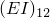, , 
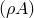, 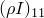, 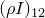, 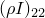, 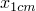, 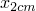
[*TRANSVERSE SHEAR STIFFNESS](../key/key-link.md#usb-kws-mtransshearstiff)
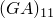, , 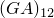
[*CENTROID](../key/key-link.md#usb-kws-mcentroid)
, 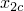
[*SHEAR CENTER](../key/key-link.md#usb-kws-mshearcenter)
,
[*DAMPING](../key/key-link.md#usb-kws-mdamping), ALPHA=, BETA=, COMPOSITE=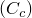
```

`*jobname*.bsp` 文本文件中的前两行数据对应于用翘曲单元网格化的任意形状实体通用梁横截面的截面特性数据（请参阅["为网格化横截面定义线性截面行为"中的"使用通用梁截面定义截面行为，" 第 29.3.7 节"](pt06ch29s03alm12.md#usb-elm-eusingbeamgensect-meshed)）。

如果您在二维横截面模型生成期间请求在特定积分点输出，则 `*jobname*.bsp` 文本文件包含以下附加行：

```
[*SECTION POINTS](../key/key-link.md#usb-kws-msectionpoints)
*section point label*, *2D element number*, *integration point number*
*E*, , , , , , 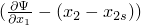, 
...
```

其中，对于请求的每个截面点，重复两组数据行。

写入 `*jobname*.bsp` 文本文件的横截面特性信息将作为通用梁截面定义读入后续梁分析中，如下所述。

#### 在梁分析中使用生成的横截面特性

如上所述，计算并存储在 `jobname.bsp` 文本文件中的截面特性可用于实际梁分析中为梁单元定义横截面。存储在 `jobname.bsp` 中的数据对应于用翘曲单元网格化的任意形状实体通用梁横截面的截面特性数据（请参阅["为网格化横截面定义线性截面行为"中的"使用通用梁截面定义截面行为，" 第 29.3.7 节"](pt06ch29s03alm12.md#usb-elm-eusingbeamgensect-meshed)）。因此，插入这些数据的一种简单方法是将 `jobname.bsp` 文本文件包含在梁分析中。

| **输入文件用法：** | 使用以下选项在梁分析中生成截面特性： |
| --- | --- |
|  | ``` [*BEAM GENERAL SECTION](../key/key-link.md#usb-kws-mbeamgensect), SECTION=MESHED , ,  (*的方向余弦* ) [*INCLUDE](../key/key-link.md#usb-kws-minclude), INPUT=`*jobname*.bsp` ``` |

#### 从梁模型或二维横截面模型后处理

刻度轮廓图可用于可视化沿梁模型长度的应力和应变输出。将提供为二维横截面模型生成请求的所有应力和应变分量。二维横截面上的应力和应变轮廓图也可用。截面几何形状从横截面分析生成的输出数据库读取，而广义截面结果从梁分析生成的输出数据库读取。

### 初始条件

生成梁截面特性时初始条件没有意义，将被忽略。

### 边界条件

生成梁截面特性时边界条件没有意义，将被忽略。

### 载荷

生成梁截面特性时载荷没有意义，将被忽略。

### 预定义场

网格化截面不允许温度和场变量。

### 材料选项

网格化截面仅允许以下材料行为：
- 各向同性线弹性（["定义各向同性弹性"中的"线弹性行为，" 第 22.2.1 节"](pt05ch22s02abm02.md#usb-mat-clinearelastic-isotropic)）
- 翘曲单元的正交各向异性线弹性（["为翘曲单元定义正交各向异性弹性"中的"线弹性行为，" 第 22.2.1 节"](pt05ch22s02abm02.md#usb-mat-clinearelastic-orthowarp)）
- 密度（["密度，" 第 21.2.1 节"](pt05ch21s02abm01.md)）

### 单元

必须使用翘曲单元对二维横截面进行网格化。详情请参阅["翘曲单元，" 第 28.4.1 节"](pt06ch28s04alm04.md)。

### 输出

在实际梁分析期间，在横截面上选定的积分点计算单元输出。特性生成分析的输出仅在输出数据库上可用。Abaqus/CAE 的可视化模块可用于在横截面上生成单元输出的轮廓图，这需要截面特性生成分析（横截面模型）和实际梁分析两个分析的输出数据库。更多信息，请参阅["查看网格化梁横截面的分析，" Abaqus 脚本用户指南第 9.10.10 节](../cmd/cmd-link.md#cmd-odb-intro-exa-beamanalysis-pyc)中的示例 Python 脚本。

### 输入文件模板

#### 在 Abaqus/Standard 分析中生成横截面特性

```
[*HEADING](../key/key-link.md#usb-kws-mheading)
Meshed cross section
...
[*NODE](../key/key-link.md#usb-kws-mnode), NSET=ALL
...
[*ELEMENT](../key/key-link.md#usb-kws-melement), TYPE=WARP2D3, ELSET=TRI
...
[*ELEMENT](../key/key-link.md#usb-kws-melement), TYPE=WARP2D4, ELSET=QUAD
...
[*SOLID SECTION](../key/key-link.md#usb-kws-msolidsection), MATERIAL=COMPOSITE, ELSET=TRI
[*MATERIAL](../key/key-link.md#usb-kws-mmaterial),NAME=COMPOSITE
[*ELASTIC](../key/key-link.md#usb-kws-melastic), TYPE=TRACTION
E, G1, G2
[*DENSITY](../key/key-link.md#usb-kws-mdensity)
...
[*SOLID SECTION](../key/key-link.md#usb-kws-msolidsection), MATERIAL=MASS_ONLY, ELSET=QUAD
[*MATERIAL](../key/key-link.md#usb-kws-mmaterial), NAME=MASS_ONLY
[*DENSITY](../key/key-link.md#usb-kws-mdensity)
...
[*STEP](../key/key-link.md#usb-kws-hstep)
[*BEAM SECTION GENERATE](../key/key-link.md#usb-kws-hbeamsectiongen)
[*SECTION ORIGIN](../key/key-link.md#usb-kws-hsectionorigin)
X, Y
[*SECTION POINTS](../key/key-link.md#usb-kws-msectionpoints)
*section point label*, *element number*, *integration point number*
[*END STEP](../key/key-link.md#usb-kws-hendstep)
```

#### 在后续 Abaqus/Standard 或 Abaqus/Explicit 梁分析中使用生成的横截面特性

```
[*HEADING](../key/key-link.md#usb-kws-mheading)
	Beam analysis
...
[*NODE](../key/key-link.md#usb-kws-mnode), NSET=NALL
...
[*ELEMENT](../key/key-link.md#usb-kws-melement), TYPE=B31, ELSET=BEAM1
...
[*BEAM GENERAL SECTION](../key/key-link.md#usb-kws-mbeamgensect), SECTION=MESHED
, ,  (*的方向余弦* )
[*INCLUDE](../key/key-link.md#usb-kws-minclude), INPUT=*jobname*.bsp
...
[*STEP](../key/key-link.md#usb-kws-hstep)
[*DYNAMIC](../key/key-link.md#usb-kws-hdynamic)
...
[*BOUNDARY](../key/key-link.md#usb-kws-hboundary)
...
[*CLOAD](../key/key-link.md#usb-kws-hcload)
...
[*OUTPUT](../key/key-link.md#usb-kws-houtput)
[*ELEMENT OUTPUT](../key/key-link.md#usb-kws-helementoutput)
...
[*END STEP](../key/key-link.md#usb-kws-hendstep)
```
