# 10.7.1 使用扩展有限元方法将不连续性建模为富集特征

**产品：** Abaqus/Standard  Abaqus/CAE  Abaqus/Viewer  

##### **参考文献**

- [*ENRICHMENT](../key/key-link.md#usb-kws-menrichment)
- [*ENRICHMENT ACTIVATION](../key/key-link.md#usb-kws-henrichmentactivation)
- ["使用扩展有限元方法对断裂力学进行建模，" Abaqus/CAE 用户指南第 31.3 章](../usi/usi-link.md#usi-eng-xfem)

### 概述

将不连续性（如裂纹）建模为富集特征：
- 通常称为扩展有限元方法（XFEM）；
- 是基于unity划分概念的常规有限元方法的扩展；
- 允许通过用特殊位移函数富集自由度来在单元内存在不连续性；
- 能够对流体压力场中的不连续性以及裂纹单元表面内的流体流动进行建模，如水力驱动断裂；
- 不需要网格与不连续性的几何形状匹配；
- 是一种非常吸引人且有效的模拟离散裂纹沿任意解相关路径扩展的方法，无需在主体材料中重新网格划分；
- 可以同时使用基于表面的内聚行为方法（请参阅["基于表面的内聚行为，" 第 37.1.10 节"](pt09ch37s01alm63.md)）或虚拟裂纹闭合技术（请参阅["裂纹扩展分析，" 第 11.4.3 节"](pt04ch11s04aus69.md)），这些方法最适合建模界面分层；
- 可以使用静态过程（请参阅["静态应力分析，" 第 6.2.2 节"](pt03ch06s02at01.md)）、隐式动态过程（请参阅["使用直接积分的隐式动态分析，" 第 6.3.2 节"](pt03ch06s03at07.md)）、使用直接循环方法的低循环疲劳分析（请参阅["使用直接循环方法的低循环疲劳分析，" 第 6.2.7 节"](pt03ch06s02at06.md)）、地静应力场过程（请参阅["地静应力状态，" 第 6.8.2 节"](pt03ch06s08at27.md)）或耦合孔隙流体扩散/应力分析（请参阅["耦合孔隙流体扩散和应力分析，" 第 6.8.1 节"](pt03ch06s08at26.md)）执行；
- 还可用于对任意固定表面裂纹进行轮廓积分评估，无需在裂纹尖端周围细化网格；
- 允许基于小滑动公式的裂纹单元表面接触相互作用；
- 允许将分布压力载荷施加到裂纹单元表面；
- 允许在裂纹单元表面上输出某些表面变量；
- 允许材料和几何非线性；以及
- 仅适用于一阶应力/位移实体连续体单元、一阶位移/孔隙压力实体连续体单元和二阶应力/位移四面体单元。

### 建模方法

用常规有限元方法建模固定不连续性（如裂纹）需要网格符合几何不连续性。因此，需要在裂纹尖端附近进行相当大的网格细化以充分捕获奇异渐近场。建模增长中的裂纹更加麻烦，因为随着裂纹的进展，网格必须不断更新以匹配不连续性的几何形状。

扩展有限元方法（XFEM）减轻了与裂纹表面网格划分相关的缺点。扩展有限元方法首先由 [Belytschko 和 Black（1999）](pt04ch10s07at36.md#aenrichment-belytschko1999) 引入。它是基于 [Melenk 和 Babuska（1996）](pt04ch10s07at36.md#aenrichment-melenk1996) 的 unity 划分概念的常规有限元方法的扩展，允许将局部富集函数轻松纳入有限元近似。不连续性的存在由特殊的富集函数与附加自由度共同保证。然而，有限元框架及其特性（如稀疏性和对称性）被保留。

#### 引入节点富集函数

为了断裂分析的目的，富集函数通常由捕获裂纹尖端附近奇异性的近尖端渐近函数和表示裂纹表面之间位移跳跃的不连续函数组成。带有 unity 划分富集的位移向量函数  的近似为

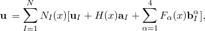

其中 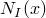 是通常的节点形函数；上述方程右边第一项  是与有限元解连续部分相关联的通常节点位移向量；第二项是节点富集自由度向量  与裂纹表面之间相关不连续跳跃函数  的乘积；第三项是节点富集自由度向量  与相关弹性渐近裂纹尖端函数 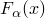 的乘积。右边第一项适用于模型中的所有节点；第二项适用于其形函数支撑被裂纹内部切割的节点；第三项仅用于其形函数支撑被裂纹尖端切割的节点。

**图 10.7.1-1** 光滑裂纹的法向和切向坐标说明。


[图 10.7.1-1](pt04ch10s07at36.md#anl-aenrichment-crack) 说明了裂纹表面之间的不连续跳跃函数 ，给定为

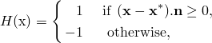

其中  是高斯（采样）点， 是  上最接近裂纹的点， 是  处裂纹的单位外法线。

[图 10.7.1-1](pt04ch10s07at36.md#anl-aenrichment-crack) 说明了各向同性弹性材料中的渐近裂纹尖端函数 ，给定为

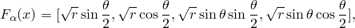

其中  是以裂纹尖端为原点的极坐标系， 是尖端处裂纹的切线。

这些函数跨越弹静力学的渐近裂纹尖端函数，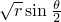 考虑了裂纹面之间的不连续性。渐近裂纹尖端函数的使用不限于各向同性弹性材料中的裂纹建模。相同的方法可用于表示沿双材料界面的裂纹、撞击双材料界面的裂纹或弹塑性幂律硬化材料中的裂纹。但是，在这三种情况下，需要不同形式的渐近裂纹尖端函数，具体取决于裂纹位置和非弹性材料变形的程度。渐近裂纹尖端函数的不同形式分别在 [Sukumar（2004）](pt04ch10s07at36.md#aenrichment-sukumar2004)、[Sukumar 和 Prevost（2003）](pt04ch10s07at36.md#aenrichment-sukumar2003) 和 [Elguedj（2006）](pt04ch10s07at36.md#aenrichment-elguedj2006) 的著作中讨论。

准确建模裂纹尖端奇异性需要不断跟踪裂纹扩展的位置，这是麻烦的，因为裂纹奇异性程度取决于裂纹在非各向同性材料中的位置。因此，我们仅在 Abaqus/Standard 中建模固定裂纹时考虑渐近奇异函数。移动裂纹使用下面描述的两种替代方法之一建模。

#### 使用内聚段方法和虚拟节点建模移动裂纹

XFEM 框架内的一种替代方法是基于牵引-分离内聚行为的方法。此方法在 Abaqus/Standard 中用于模拟裂纹萌生和扩展。这是一种非常通用的相互作用建模能力，可用于建模脆性或延性断裂。Abaqus/Standard 中可用的其他裂纹萌生和扩展能力基于内聚单元（["使用牵引-分离描述定义内聚单元的 constitutive 响应，" 第 32.5.6 节"](pt06ch32s05alm45.md)）或基于表面的内聚行为（["基于表面的内聚行为，" 第 37.1.10 节"](pt09ch37s01alm63.md)）。与这些方法不同，它们需要内聚表面与单元边界对齐且裂纹沿预定义路径集合扩展，而基于 XFEM 的内聚段方法可用于模拟沿主体材料中任意解相关路径的裂纹萌生和扩展，因为裂纹扩展不与网格中的单元边界绑定。在这种情况下，不需要近尖端渐近奇异性，只考虑裂纹单元上的位移跳跃。因此，裂纹必须一次传播整个单元以避免需要建模应力奇异性。

引入叠加在原始真实节点上的虚拟节点来表示裂纹单元的不连续性，如图 10.7.1-2 所示。当单元完整时，每个虚拟节点完全约束到其对应的真实节点。当裂纹穿过单元时，裂纹单元分成两部分。每部分由一些真实节点和虚拟节点的组合形成，取决于裂纹的方向。每个虚拟节点及其对应的真实节点不再绑在一起，可以分开。

**图 10.7.1-2** 虚拟节点方法原理。

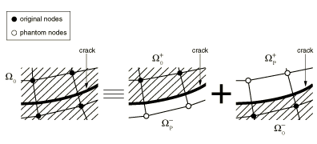

分离的大小由内聚定律控制，直到裂纹单元的内聚强度为零，之后虚拟节点和真实节点独立移动。为了获得一组完整的插值基，裂纹单元的属于真实域的部分  扩展到虚拟域 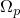。然后，真实域中的位移  可以使用虚拟域中节点的自由度进行插值。位移场的跳跃通过仅从真实节点侧到裂纹的面积进行积分来实现，即 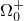 和 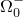。该方法提供了一种有效且有吸引力的工程方法，已被 [Song（2006）](pt04ch10s07at36.md#aenrichment-song2006) 和 [Remmers（2008）](pt04ch10s07at36.md#aenrichment-remmers2008) 用于模拟固体中多个裂纹的萌生和生长。如果网格足够细化，已证明该方法几乎没有网格依赖性。

##### 建模水力驱动断裂

上面讨论的内聚段方法与虚拟节点结合也可扩展到建模水力驱动断裂。在这种情况下，在每个富集单元的边缘上引入具有孔隙压力自由度的附加虚拟节点，以与叠加在原始真实节点上以表示裂纹单元中位移和流体压力不连续性的虚拟节点结合，对裂纹单元表面内的流体流动进行建模。每个单元边缘上的虚拟节点在该边缘被裂纹相交之前不被激活。裂纹单元中的孔隙流体流动模式如图 10.7.1-3 所示。流体被认为是不可压缩的。保持流体流动连续性，包括裂纹单元表面内外和法向流动以及裂纹单元表面开口速率。裂纹单元表面上的流体压力有助于富集单元中内聚段的牵引-分离行为，这使得建模水力驱动断裂成为可能。

**图 10.7.1-3** 裂纹单元内的流动。


#### 基于线弹性断裂力学（LEFM）原理和虚拟节点建模移动裂纹

在 XFEM 框架内建模移动裂纹的另一种替代方法是基于线弹性断裂力学（LEFM）原理。因此，它更适合于发生脆性裂纹扩展的问题。与上述基于 XFEM 的内聚段方法类似，不考虑近尖端渐近奇异性，只考虑裂纹单元上的位移跳跃。因此，裂纹必须一次传播整个单元以避免需要建模应力奇异性。裂纹尖端的应变能释放率基于改进的虚拟裂纹闭合技术（VCCT）计算，该技术已用于建模沿已知和部分粘合表面的分层（请参阅["裂纹扩展分析，" 第 11.4.3 节"](pt04ch11s04aus69.md)）。但是，与该方法不同，基于 XFEM 的 LEFM 方法可用于模拟沿主体材料中任意解相关路径的裂纹扩展，无需模型中预先存在的裂纹。

该建模技术与上述基于 XFEM 的内聚段方法非常相似，其中引入虚拟节点来表示当满足断裂准则时裂纹单元的不连续性。当富集单元裂纹尖点的等效应变能释放率超过临界应变能释放率时，真实节点和相应虚拟节点将分离。牵引力最初作为相等且相反的力承载在裂纹单元的两个表面上。牵引力随着两个表面之间分离的增大而线性减小，消耗的应变能等于引发分离所需的临界应变能或传播裂纹所需的临界应变能，取决于指定的是 VCCT 还是增强 VCCT 准则。

##### 基于 LEFM 原理建模低循环疲劳裂纹扩展

基于 XFEM 的 LEFM 方法也可用于模拟在低循环疲劳分析中使用直接循环方法（["使用直接循环方法的低循环疲劳分析，" 第 6.2.7 节"](pt03ch06s02at06.md)）承受亚临界循环载荷的离散裂纹增长。富集单元中裂纹尖端的断裂能释放率基于上述改进的 VCCT 技术计算。萌生和裂纹增长由 Paris 定律表征，该定律将相对断裂能释放率与裂纹增长速率联系起来，如图 10.7.1-4 所示。该方法已用于模拟沿已知和部分粘合表面（请参阅["裂纹扩展分析"中的"低循环疲劳准则，" 第 11.4.3 节"](pt04ch11s04aus69.md#usb-anl-acrackpropagation-fatigue)）在亚临界循环载荷下的渐进分层。但是，与该方法不同，基于 XFEM 的 LEFM 方法可用于模拟沿主体材料中任意解相关路径的疲劳裂纹扩展。

**图 10.7.1-4** 受 Paris 定律控制的疲劳裂纹增长。


#### 使用水平集方法描述不连续几何形状

促进扩展有限元分析中裂纹处理的关键开发是裂纹几何形状的描述，因为不需要网格符合裂纹几何形状。水平集方法是一种用于分析和计算界面运动的强大数值技术，与扩展有限元方法自然契合，使得无需重新网格化即可建模任意裂纹增长成为可能。裂纹几何形状由两个近似正交的有符号距离函数描述，如图 10.7.1-5 所示。第一个  描述裂纹表面，第二个 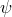 用于构建正交表面，使得两个表面的交点给出裂纹前缘。  表示裂纹表面的正法线；  表示裂纹前缘的正法线。不需要边界或界面的显式表示，因为它们完全由节点数据描述。每个节点通常需要两个有符号距离函数来描述裂纹几何形状。

**图 10.7.1-5** 用两个有符号距离函数  和  表示的三维非平面裂纹。


### 定义富集特征及其属性

您必须指定富集特征及其属性。一个或多个预先存在的裂纹可以与富集特征相关联。此外，在分析期间，一个或多个裂纹可以在富集特征中萌生，而不需要任何初始缺陷。但是，只有当同一时间增量中多个单元满足损伤萌生准则时，多个裂纹才能在单个富集特征中成核。否则，在给定富集特征的边界内所有预先存在的裂纹传播完成之前，不会萌生附加裂纹。如果预计在分析期间不同位置顺序发生多次裂纹萌生，则可以在模型中指定多个富集特征。只有当单元被裂纹相交时，富集自由度才被激活。只能将应力/位移实体连续体单元与富集特征相关联。

| **输入文件用法：** | ``` [*ENRICHMENT](../key/key-link.md#usb-kws-menrichment) ``` |
| --- | --- |

| **Abaqus/CAE 用法：** | 相互作用模块：****特殊****裂纹****创建****XFEM**** |
| --- | --- |

#### 定义富集类型

您可以选择对任意固定裂纹或沿任意解相关路径的离散裂纹扩展进行建模。前者需要用渐近函数富集裂纹尖端周围的单元以捕获奇异性，并用裂纹表面之间的跳跃函数富集被裂纹内部切割的单元。后者意味着裂纹扩展使用内聚段方法或与虚拟节点结合的线弹性断裂力学方法进行建模。但是，这些选项是互斥的，不能在模型中同时指定。

| **输入文件用法：** | 使用以下选项指定裂纹扩展分析（默认）： |
| --- | --- |
|  | ``` [*ENRICHMENT](../key/key-link.md#usb-kws-menrichment), TYPE=PROPAGATION CRACK ``` 使用以下选项指定具有固定裂纹的分析： ``` [*ENRICHMENT](../key/key-link.md#usb-kws-menrichment), TYPE=STATIONARY CRACK ``` |

| **Abaqus/CAE 用法：** | 使用以下输入指定裂纹扩展分析： |
| --- | --- |
|  | 相互作用模块：裂纹编辑器：切换**允许裂纹增长** 使用以下输入指定具有固定裂纹的分析：相互作用模块：裂纹编辑器：切换**允许裂纹增长** |

#### 为富集特征分配名称

您必须为富集特征（如裂纹）分配名称。此名称可用于定义裂纹表面的初始位置、识别裂纹以进行轮廓积分输出、激活或停用裂纹扩展分析，以及生成裂纹单元表面。

| **输入文件用法：** | ``` [*ENRICHMENT](../key/key-link.md#usb-kws-menrichment), NAME=*name* ``` |
| --- | --- |

| **Abaqus/CAE 用法：** | 相互作用模块：****特殊****裂纹****创建****：**XFEM**：**名称**：*name* |
| --- | --- |

#### 识别富集区域

您必须将富集定义与模型的区域相关联。只有这些区域内单元中的自由度可能被富集函数富集。该区域应包含目前被裂纹切割的单元和可能随裂纹扩展而被切割的单元。

| **输入文件用法：** | ``` [*ENRICHMENT](../key/key-link.md#usb-kws-menrichment), ELSET=*element set name* ``` |
| --- | --- |

| **Abaqus/CAE 用法：** | 相互作用模块：****特殊****裂纹****创建********：**XFEM**：**选择裂纹域**：选择区域 |
| --- | --- |

#### 定义裂纹表面

当裂纹在模型中传播时，在分析期间被裂纹切割的那些富集单元上生成代表裂纹单元两个面的裂纹表面。您必须将富集特征的名称与表面相关联（请参阅上面的["为富集特征分配名称"](pt04ch10s07at36.md#usb-anl-aenrichment-name)）。

生成的裂纹表面仅支持分布压力载荷的施加和某些表面变量的输出。

| **输入文件用法：** | ``` [*SURFACE](../key/key-link.md#usb-kws-msurface), TYPE=XFEM ``` |
| --- | --- |

| **Abaqus/CAE 用法：** | Abaqus/CAE 中不支持基于 XFEM 的裂纹表面。 |
| --- | --- |

#### 使用小滑动公式定义裂纹单元表面的接触

当单元被裂纹切割时，必须考虑裂纹表面的压缩行为。控制行为的公式与用于基于表面的小滑动惩罚接触的公式非常相似（["机械接触属性：概述，" 第 37.1.1 节"](pt09ch37s01aus165.md)）。

对于被固定裂纹或具有线弹性断裂力学方法的移动裂纹切割的单元，假定裂纹单元的弹性内聚强度为零。因此，当裂纹表面接触时，压缩行为完全由上述选项定义。对于具有内聚段方法的移动裂纹，情况更复杂；牵引-分离内聚行为以及裂纹表面的压缩行为涉及裂纹单元。在接触法线方向上，控制表面之间压缩行为的压力-闭合关系不与内聚行为相互作用，因为它们各自描述不同接触状态下表面之间的相互作用。压力-闭合关系仅在裂纹"闭合"时控制行为；内聚行为仅在裂纹"开放"时（即不接触时）对接触法向应力做出贡献。

如果单元在剪切方向上的弹性内聚刚度未损坏，则假定内聚行为是活跃的。任何切向滑移都被假定为本质的纯弹性，并受到单元弹性内聚强度的抵抗，从而产生剪切力。如果已定义损伤，则内聚对剪切应力的贡献开始随损伤演化而退化。一旦达到最大退化，内聚对剪切应力的贡献为零。摩擦模型激活并开始对剪切应力做出贡献。

| **输入文件用法：** | 使用以下选项使用小滑动公式定义裂纹表面的接触： |
| --- | --- |
|  | ``` [*ENRICHMENT](../key/key-link.md#usb-kws-menrichment), INTERACTION=*interaction_property_name* [*SURFACE INTERACTION](../key/key-link.md#usb-kws-hsurfaceinteraction), NAME=*interaction_property_name* [*SURFACE BEHAVIOR](../key/key-link.md#usb-kws-hsurfacebehavior) ``` |

| **Abaqus/CAE 用法：** | 相互作用模块：裂纹编辑器：切换**指定接触属性** |
| --- | --- |

### 将内聚材料概念应用于基于 XFEM 的内聚行为

控制基于 XFEM 的内聚段进行裂纹扩展分析的公式和定律与具有牵引-分离本构行为的内聚单元（["使用牵引-分离描述定义内聚单元的 constitutive 响应，" 第 32.5.6 节"](pt06ch32s05alm45.md)）和用于基于表面的内聚行为（["基于表面的内聚行为，" 第 37.1.10 节"](pt09ch37s01alm63.md)）使用的公式和定律非常相似。相似之处延伸到线性弹性牵引-分离模型、损伤萌生准则和损伤演化定律。

#### 线性弹性牵引-分离行为

Abaqus 中可用的牵引-分离模型假定初始线性弹性行为，随后是损伤的萌生和演化。弹性行为以弹性本构矩阵编写，将裂纹单元的法向和剪切应力与法向和剪切分离相关联。

名义牵引应力向量  由以下分量组成：、 和（在三维问题中），它们分别表示法向和两个剪切牵引力。相应的分离表示为 、 和 。弹性行为可以写为


法向和切向刚度分量不会耦合：纯法向分离本身不会在剪切方向产生内聚力，纯剪切滑移且无法向分离不会在法向产生任何内聚力。

项 、 和  基于富集单元的弹性特性计算。为富集区域中的材料指定弹性特性足以定义弹性刚度和牵引-分离行为。

#### 损伤建模

损伤建模允许您模拟富集单元的退化并最终失效。失效机制由两个要素组成：损伤萌生准则和损伤演化定律。初始响应假定为如上节所述的线性响应。但是，一旦满足损伤萌生准则，损伤可以根据用户定义的损伤演化定律发生。图 10.7.1-6 显示了具有失效机制的典型线性和典型非线性牵引-分离响应。富集单元在纯压缩下不会发生损伤。

**图 10.7.1-6** 典型线性（a）和非线性（b）牵引-分离响应。

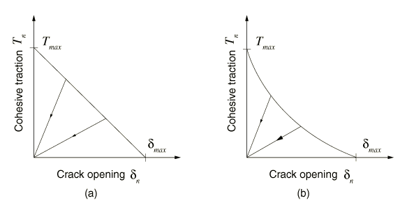

富集单元中内聚行为的牵引-分离响应的损伤在与常规材料相同的一般框架内定义（请参阅["渐进损伤和失效，" 第 24.1.1 节"](pt05ch24s01abo21.md)）。但是，与具有牵引-分离行为的内聚单元不同，您不必在富集单元中指定无损伤的牵引-分离行为。

#### 裂纹萌生和裂纹扩展方向

裂纹萌生指的是富集单元内聚响应降解的开始。当应力或应变满足指定的裂纹萌生准则时，降解过程开始。可用的裂纹萌生准则基于以下 Abaqus/Standard 内置模型：
- 最大主应力准则，
- 最大主应变准则，
- 最大名义应力准则，
- 最大名义应变准则，
- 二次牵引-交互准则，以及
- 二次分离-交互准则。

此外，可以在用户子程序 [`UDMGINI`](../sub/sub-link.md#sub-xsl-udmgini) 中指定用户定义的损伤萌生准则。

在平衡增量之后，当断裂准则 *f* 在给定容差内达到 1.0 时，会引入附加裂纹或扩展现有裂纹的长度：


您可以指定容差 。如果 ，则减少时间增量以满足裂纹萌生准则。 的默认值是 0.05。

| **输入文件用法：** | ``` [*DAMAGE INITIATION](../key/key-link.md#usb-kws-mdamageinitiation), TOLERANCE= ``` |
| --- | --- |

| **Abaqus/CAE 用法：** | 属性模块：材料编辑器：**Mechanical**：**Damage for Traction Separation Laws**：**Quade Damage**、**Maxe Damage**、**Quads Damage**、**Maxs Damage**、**Maxpe Damage** 或 **Maxps Damage**：**Tolerance**： |
| --- | --- |

##### 指定裂纹方向

当指定最大主应力或最大主应变准则时，当满足断裂准则时，新引入的裂纹始终垂直于最大主应力/应变方向。但是，当使用其他 Abaqus/Standard 内置裂纹萌生准则之一时，您必须指定当满足断裂准则时，新引入的裂纹是垂直于单元局部 1 方向还是垂直于单元局部 2 方向（请参阅["约定，" 第 1.2.2 节"](pt01ch01s02aus02.md)）。默认情况下，裂纹垂直于单元局部 1 方向。如果指定了用户定义的损伤萌生准则，则可以在用户子程序 [`UDMGINI`](../sub/sub-link.md#sub-xsl-udmgini) 中定义裂纹平面或裂纹线的法线方向。

| **输入文件用法：** | 当指定最大名义应力、最大名义应变、二次牵引-交互或二次分离-交互准则时，使用以下选项之一指定裂纹方向： |
| --- | --- |
|  | ``` [*DAMAGE INITIATION](../key/key-link.md#usb-kws-mdamageinitiation), NORMAL DIRECTION=1 (default) ``` ``` [*DAMAGE INITIATION](../key/key-link.md#usb-kws-mdamageinitiation), NORMAL DIRECTION=2 ``` |

| **Abaqus/CAE 用法：** | 属性模块：材料编辑器：****Mechanical****Damage for Traction Separation Laws****：**Quade Damage**、**Maxe Damage**、**Quads Damage** 或 **Maxs Damage**：**Direction relative to local 1-direction (for XFEM)**：**Normal** 或 **Parallel** |
| --- | --- |

##### 最大主应力准则

最大主应力准则可以表示为

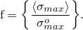

这里， 表示最大允许主应力。符号  表示 Macaulay 括号，具有通常的解释（即如果 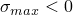 则 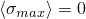，如果  则 ）。Macaulay 括号用于表示纯压缩应力状态不会萌生损伤。假定当最大主应力比（如上定义）达到 1 时损伤开始萌生。

| **输入文件用法：** | ``` [*DAMAGE INITIATION](../key/key-link.md#usb-kws-mdamageinitiation), CRITERION=MAXPS ``` |
| --- | --- |

| **Abaqus/CAE 用法：** | 属性模块：材料编辑器：**Mechanical**：**Damage for Traction Separation Laws**：**Maxps Damage** |
| --- | --- |

##### 最大主应变准则

最大主应变准则可以表示为

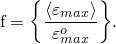

这里， 表示最大允许主应变，Macaulay 括号表示纯压缩应变不会萌生损伤。假定当最大主应变比（如上定义）达到 1 时损伤开始萌生。

| **输入文件用法：** | ``` [*DAMAGE INITIATION](../key/key-link.md#usb-kws-mdamageinitiation), CRITERION=MAXPE ``` |
| --- | --- |

| **Abaqus/CAE 用法：** | 属性模块：材料编辑器：**Mechanical**：**Damage for Traction Separation Laws**：**Maxpe Damage** |
| --- | --- |

##### 最大名义应力准则

最大名义应力准则可以表示为

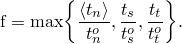

名义牵引应力向量  由三个分量组成（在二维问题中为两个）。 是垂直于可能裂纹表面的分量， 和  是可能裂纹表面上的两个剪切分量。根据您指定的内容（请参阅上面的["指定裂纹方向"](pt04ch10s07at36.md#usb-anl-aenrichment-crack-dir)），可能裂纹表面将垂直于单元局部 1 方向或垂直于单元局部 2 方向。这里，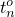、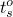 和  表示名义应力的峰值。符号  表示 Macaulay 括号，具有通常的解释。Macaulay 括号用于表示纯压缩应力状态不会萌生损伤。假定当最大名义应力比（如上定义）达到 1 时损伤开始萌生。

| **输入文件用法：** | ``` [*DAMAGE INITIATION](../key/key-link.md#usb-kws-mdamageinitiation), CRITERION=MAXS ``` |
| --- | --- |

| **Abaqus/CAE 用法：** | 属性模块：材料编辑器：**Mechanical**：**Damage for Traction Separation Laws**：**Maxs Damage** |
| --- | --- |

##### 最大名义应变准则

最大名义应变准则可以表示为

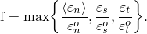

假定当最大名义应变比（如上定义）达到 1 时损伤开始萌生。

| **输入文件用法：** | ``` [*DAMAGE INITIATION](../key/key-link.md#usb-kws-mdamageinitiation), CRITERION=MAXE ``` |
| --- | --- |

| **Abaqus/CAE 用法：** | 属性模块：材料编辑器：**Mechanical**：**Damage for Traction Separation Laws**：**Maxe Damage** |
| --- | --- |

##### 二次名义应力准则

二次名义应力准则可以表示为


假定当涉及应力比的二次交互函数（如上定义）达到 1 时损伤开始萌生。

| **输入文件用法：** | ``` [*DAMAGE INITIATION](../key/key-link.md#usb-kws-mdamageinitiation), CRITERION=QUADS ``` |
| --- | --- |

| **Abaqus/CAE 用法：** | 属性模块：材料编辑器：**Mechanical**：**Damage for Traction Separation Laws**：**Quads Damage** |
| --- | --- |

##### 二次名义应变准则

二次名义应变准则可以表示为


假定当涉及名义应变比的二次交互函数（如上定义）达到 1 时损伤开始萌生。

| **输入文件用法：** | ``` [*DAMAGE INITIATION](../key/key-link.md#usb-kws-mdamageinitiation), CRITERION=QUADE ``` |
| --- | --- |

| **Abaqus/CAE 用法：** | 属性模块：材料编辑器：**Mechanical**：**Damage for Traction Separation Laws**：**Quade Damage** |
| --- | --- |

##### 用户定义的损伤萌生准则

用户子程序 [`UDMGINI`](../sub/sub-link.md#sub-xsl-udmgini) 提供了实现用户定义损伤萌生准则的通用能力。

您可以在用户子程序 [`UDMGINI`](../sub/sub-link.md#sub-xsl-udmgini) 中定义多种损伤萌生机制。您用断裂准则 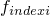 及其相关的裂纹平面或裂纹线法线方向表示每种损伤萌生机制。虽然您可以定义多种损伤萌生机制，但富集单元的实际损伤萌生由最严重的损伤萌生机制控制：


假定当上面定义的 f 达到 1 时损伤开始萌生。

您必须指定用户子程序 [`UDMGINI`](../sub/sub-link.md#sub-xsl-udmgini) 中所需的任何材料常数，作为用户定义的损伤萌生准则定义的一部分。

| **输入文件用法：** | 使用以下选项定义用户定义的损伤萌生准则： |
| --- | --- |
|  | ``` [*DAMAGE INITIATION](../key/key-link.md#usb-kws-mdamageinitiation), CRITERION=USER ``` 使用以下选项指定用户定义损伤萌生准则中的失效机制总数： ``` [*DAMAGE INITIATION](../key/key-link.md#usb-kws-mdamageinitiation), CRITERION=USER, FAILURE MECHANISMS= ``` 使用以下选项为用户定义的损伤萌生准则定义属性： ``` [*DAMAGE INITIATION](../key/key-link.md#usb-kws-mdamageinitiation), CRITERION=USER, PROPERTIES=*number_of_constants* ``` |

| **Abaqus/CAE 用法：** | 在 Abaqus/CAE 中不支持定义用户定义的损伤萌生准则。 |
| --- | --- |

#### 裂纹尖端前方应力场的局部计算

准确高效地评估裂纹尖端前方的应力/应变场对于评估裂纹萌生准则和计算裂纹扩展方向都很重要。Abaqus/Standard 提供了多种计算这些场的选项。

##### 质心应力/应变值

默认情况下，使用裂纹尖端前方单元质心计算的应力/应变来确定是否满足损伤萌生准则并确定裂纹扩展方向。参见图 10.7.1-7。

**图 10.7.1-7** 质心和裂纹尖端位置。


| **输入文件用法：** | ``` [*DAMAGE INITIATION](../key/key-link.md#usb-kws-mdamageinitiation), POSITION=CENTROID (default) ``` |
| --- | --- |

| **Abaqus/CAE 用法：** | 属性模块：材料编辑器：****Mechanical****Damage for Traction Separation Laws****：**Quade Damage**、**Maxe Damage**、**Quads Damage**、**Maxs Damage**、**Maxpe Damage** 或 **Maxps Damage**：****Position****Centroid**** |
| --- | --- |

##### 在裂纹尖端计算应力/应变场

通过足够细化的网格，质心近似是准确和经济的。但是，如果裂纹尖端附近有限元网格相对于应力/应变场的梯度较粗，则默认的质心近似可能不够。在这些情况下，您可以使用外推到裂纹尖端的应力/应变来确定是否满足损伤萌生准则并确定裂纹扩展方向。参见图 10.7.1-7。

| **输入文件用法：** | ``` [*DAMAGE INITIATION](../key/key-link.md#usb-kws-mdamageinitiation), POSITION=CRACKTIP ``` |
| --- | --- |

| **Abaqus/CAE 用法：** | 属性模块：材料编辑器：****Mechanical****Damage for Traction Separation Laws****：**Quade Damage**、**Maxe Damage**、**Quads Damage**、**Maxs Damage**、**Maxpe Damage** 或 **Maxps Damage**：****Position****Crack tip**** |
| --- | --- |

##### 结合裂纹尖端和质心计算

您也可以选择结合两种先前的替代方案：您可以使用外推到裂纹尖端的应力/应变值来确定是否满足损伤萌生准则，并使用单元质心处的应力/应变值来确定裂纹扩展方向。

| **输入文件用法：** | ``` [*DAMAGE INITIATION](../key/key-link.md#usb-kws-mdamageinitiation), POSITION=COMBINED ``` |
| --- | --- |

| **Abaqus/CAE 用法：** | 属性模块：材料编辑器：****Mechanical****Damage for Traction Separation Laws****：**Quade Damage**、**Maxe Damage**、**Quads Damage**、**Maxs Damage**、**Maxpe Damage** 或 **Maxps Damage**：****Position****Combined**** |
| --- | --- |

#### 非局部平均化应力/应变场以提高裂纹扩展方向的准确性

上面讨论的评估应力/应变场的三个选项是局部计算，因为评估的场是裂纹尖端前方单个单元的局部。在粗糙和/或非结构化网格的情况下，裂纹尖端前方应力/应变场的非局部平均化可以导致对这些场的更准确评估，这可以提高计算的扩展方向的准确性。参见图 10.7.1-8。

**图 10.7.1-8** 非局部平均区域。

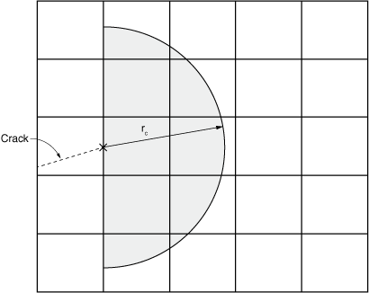

| **输入文件用法：** | ``` [*DAMAGE INITIATION](../key/key-link.md#usb-kws-mdamageinitiation), POSITION=NONLOCAL ``` |
| --- | --- |

| **Abaqus/CAE 用法：** | Abaqus/CAE 中不支持裂纹尖端前方应力/应变场的非局部平均化。 |
| --- | --- |

##### 指定用于非局部平均化的模型区域

为了控制裂纹方向计算中用于非局部平均化的单元范围，您可以指定一个半径 ，裂纹尖端前方的单元在该半径内被包括。默认半径是富集区域中典型单元特征长度的三倍。

| **输入文件用法：** | ``` [*DAMAGE INITIATION](../key/key-link.md#usb-kws-mdamageinitiation), R CRACK DIRECTION= ``` |
| --- | --- |

| **Abaqus/CAE 用法：** | Abaqus/CAE 中不支持指定用于非局部平均化的模型范围。 |
| --- | --- |

##### 平均前对应力/应变场进行平滑

为了进一步改善非局部平均化，您可以请求对裂纹前方应力/应变场进行初始平滑。在这种情况下，Abaqus/Standard 将场值平均到单元节点，然后将平滑后的场插值到积分点。平滑完成后，应用非局部平均化。默认情况下不应用平滑。

| **输入文件用法：** | 使用以下选项之一： |
| --- | --- |
|  | ``` [*DAMAGE INITIATION](../key/key-link.md#usb-kws-mdamageinitiation), SMOOTHING=NONE (default) [*DAMAGE INITIATION](../key/key-link.md#usb-kws-mdamageinitiation), SMOOTHING=NODAL ``` |

| **Abaqus/CAE 用法：** | Abaqus/CAE 中不支持平均前对应力/应变场进行平滑。 |
| --- | --- |

##### 非局部平均化的加权方案

Abaqus/Standard 提供了多种场平滑加权方案，以对非局部平均化提供额外控制。例如，您可能希望对靠近裂纹尖端的单元给予更高的权重。您可以指定权重函数 ，以基于从单元积分点到裂纹尖端的距离  计算平均应力/应变。默认情况下，对所有用于平均的单元应用均匀加权；或者，您可以使用高斯函数或三次样条函数。您也可以使用用户子程序定义权重函数。

高斯函数表示为：


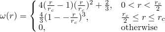

| **输入文件用法：** | 使用以下选项之一： |
| --- | --- |
|  | ``` [*DAMAGE INITIATION](../key/key-link.md#usb-kws-mdamageinitiation), WEIGHTING METHOD=UNIFORM (default) [*DAMAGE INITIATION](../key/key-link.md#usb-kws-mdamageinitiation), WEIGHTING METHOD=GAUSS [*DAMAGE INITIATION](../key/key-link.md#usb-kws-mdamageinitiation), WEIGHTING METHOD=CUBIC SPLINE [*DAMAGE INITIATION](../key/key-link.md#usb-kws-mdamageinitiation), WEIGHTING METHOD=USER ``` |

| **Abaqus/CAE 用法：** | Abaqus/CAE 中不支持为非局部平均化指定加权方案。 |
| --- | --- |

#### 损伤演化

损伤演化定律描述了一旦达到相应的萌生准则，内聚刚度退化的速率。描述损伤演化的一般框架在概念上与基于表面的内聚行为（["基于表面的内聚行为，" 第 37.1.10 节"](pt09ch37s01alm63.md)）中损伤演化使用的框架相似。

标量损伤变量 *D* 表示裂纹表面与裂纹单元边缘交叉处的整体平均损伤。它最初值为 0。如果建模损伤演化，则 *D* 在损伤萌生后进一步加载时单调从 0 演化到 1。法向和剪切应力分量根据以下公式受损伤影响：

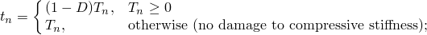


其中 、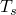 和 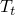 是由当前分离（无损伤）的弹性牵引-分离行为预测的法向和剪切应力分量。

为了描述跨界面法向和剪切分离组合下的损伤演化，定义有效分离为


| **输入文件用法：** | 使用以下选项指定损伤演化定律： |
| --- | --- |
|  | ``` [*DAMAGE EVOLUTION](../key/key-link.md#usb-kws-mdamageevolution) ``` |

| **Abaqus/CAE 用法：** | 属性模块：材料编辑器：****Mechanical****Damage for Traction Separation Laws****：**Maxpe Damage** 或 **Maxps Damage**：****Suboptions****Damage Evolution**** |
| --- | --- |

##### 与用户定义的损伤萌生准则结合使用

应该为用户子程序 [`UDMGINI`](../sub/sub-link.md#sub-xsl-udmgini) 中定义的每个损伤萌生准则指定单独的损伤演化定律。每种损伤萌生准则及其相应损伤演化定律的组合称为失效机制。损伤将仅在每个单元的一个失效机制中累积，对应于最先达到损伤萌生准则的机制。

| **输入文件用法：** | 使用以下选项为多个用户定义的损伤萌生准则指定损伤演化定律： |
| --- | --- |
|  | ``` [*DAMAGE INITIATION](../key/key-link.md#usb-kws-mdamageinitiation), CRITERION=USER, FAILURE MECHANISMS= [*DAMAGE EVOLUTION](../key/key-link.md#usb-kws-mdamageevolution), FAILURE INDEX=1 [*DAMAGE EVOLUTION](../key/key-link.md#usb-kws-mdamageevolution), FAILURE INDEX=2 ... [*DAMAGE EVOLUTION](../key/key-link.md#usb-kws-mdamageevolution), FAILURE INDEX= ``` |

| **Abaqus/CAE 用法：** | Abaqus/CAE 中不支持定义用户定义的损伤萌生准则。 |
| --- | --- |

#### Abaqus/Standard 中的粘性正则化

表现出各种软化行为和刚度退化形式的模型通常会在 Abaqus/Standard 中导致严重的收敛困难。富集单元中定义内聚行为的本构方程的粘性正则化可用于克服一些这些收敛困难。粘性正则化阻尼导致切线刚度矩阵在足够小的时间增量下保持正定。

整个模型与粘性正则化相关的大致能量可通过输出变量 ALLVD 获得。

| **输入文件用法：** | 使用以下选项指定粘性正则化： |
| --- | --- |
|  | ``` [*DAMAGE STABILIZATION](../key/key-link.md#usb-kws-mdamagestabilization) ``` |

| **Abaqus/CAE 用法：** | 属性模块：材料编辑器：****Mechanical****Damage for Traction Separation Laws****：**Quade Damage**、**Maxe Damage**、**Quads Damage**、**Maxs Damage**、**Maxpe Damage** 或 **Maxps Damage**：****Suboptions****Damage Stabilization Cohesive**** |
| --- | --- |

#### 定义裂纹单元表面内流体流动的本构响应

基于 XFEM 的裂纹单元表面内流体流动行为的控制公式和定律与内聚单元间隙内流体流动（["定义内聚单元间隙内流体的本构响应，" 第 32.5.7 节"](pt06ch32s05alm46.md)）使用的公式和定律非常相似。相似之处延伸到牵引-分离模型、损伤萌生准则、损伤演化定律和流体流动行为。流体本构响应包括富集单元内裂纹表面内的切向流动和由于结垢或污垢效应引起的穿过裂纹表面的法向流动。

##### 切向流动

裂纹单元表面内的切向流动可以用牛顿流体或幂律流体建模。默认情况下，裂纹单元表面内没有孔隙流体的切向流动。要允许切向流动，需结合孔隙流体材料定义定义间隙流动特性。

对于牛顿流体，体积流率密度向量由下式给出


其中  是切向渗透率（对流体流动的阻力）， 是沿裂纹单元表面的压力梯度， 是裂纹单元表面的开口。

Abaqus 根据 Reynolds 方程定义切向渗透率或流动阻力：


其中  是流体粘度， 是裂纹单元表面的开口。您还可以指定  值的上限。

对于幂律流体，本构关系定义为


其中  是剪切应力， 是剪切应变率， 是流体一致性， 是幂律系数。Abaqus 将切向体积流率密度定义为


其中  是裂纹单元表面的开口。

默认情况下，裂纹单元表面之间的间隙在牛顿流体和幂律流体中的初始开口为 0.002。但是，您可以直接指定此开口。

| **输入文件用法：** | 使用以下选项为牛顿流体定义切向流动： |
| --- | --- |
|  | ``` [*GAP FLOW](../key/key-link.md#usb-kws-mgapflow), TYPE=NEWTONIAN, KMAX ``` 使用以下选项为幂律流体定义切向流动： ``` [*GAP FLOW](../key/key-link.md#usb-kws-mgapflow), TYPE=POWER LAW ``` 使用以下选项直接定义初始间隙开口： ``` [*SECTION CONTROLS](../key/key-link.md#usb-kws-msectioncontrols), INITIAL GAP OPENING ``` |

| **Abaqus/CAE 用法：** | 使用以下选项为牛顿流体定义切向流动： |
| --- | --- |
|  | 属性模块：材料编辑器：****Other****Pore Fluid****Gap Flow****: Type: **Newtonian**：切换**Maximum Permeability** 并输入 **Pore Fluid****Gap Flow****: Type: **Power law** Abaqus/CAE 中不支持初始间隙开口。 |

##### 穿过裂纹单元表面的法向流动

您可以通过为孔隙流体材料定义流体泄漏系数来允许法向流动。该系数定义了位于裂纹单元边缘和裂纹单元表面的虚拟节点之间的压力-流动关系。流体泄漏系数可以解释为裂纹单元表面上有限材料层的渗透率，如图 10.7.1-9 所示。

**图 10.7.1-9** 作为渗透层的泄漏系数解释。


法向流动定义为


和


其中  和  分别是流入裂纹单元顶部和底部表面的流率； 是位于裂纹单元边缘的虚拟节点处的压力； 和  分别是裂纹单元顶部和底部表面上的孔隙压力。您可以选择将泄漏系数定义为温度和场变量的函数。

或者，您可以使用用户子程序 [`UFLUIDLEAKOFF`](../sub/sub-link.md#sub-xsl-ufluidleakoff) 来定义更复杂的泄漏行为，包括通过解相关状态变量定义时间累积阻力或污垢的能力。

| **输入文件用法：** | 使用以下选项定义泄漏系数： |
| --- | --- |
|  | ``` [*FLUID LEAKOFF](../key/key-link.md#usb-kws-mfluidleakoff) ``` 使用以下选项将泄漏系数定义为温度和场变量的函数： ``` [*FLUID LEAKOFF](../key/key-link.md#usb-kws-mfluidleakoff), DEPENDENCIES ``` 使用以下选项在用户子程序 [`UFLUIDLEAKOFF`](../sub/sub-link.md#sub-xsl-ufluidleakoff) 中定义更复杂的泄漏行为： ``` [*FLUID LEAKOFF](../key/key-link.md#usb-kws-mfluidleakoff), USER ``` |

| **Abaqus/CAE 用法：** | 使用以下选项定义泄漏系数： |
| --- | --- |
|  | 属性模块：材料编辑器：****Other****Pore Fluid****Fluid Leakoff****: Type: **Coefficients** 使用以下选项将泄漏系数定义为温度和场变量的函数：属性模块：材料编辑器：****Other****Pore Fluid****Fluid Leakoff****: Type: **Coefficients**：切换**Use temperature-dependent data** 并选择场变量数。使用以下选项在用户子程序 [`UFLUIDLEAKOFF`](../sub/sub-link.md#sub-xsl-ufluidleakoff) 中定义更复杂的泄漏行为：属性模块：材料编辑器：****Other****Pore Fluid****Fluid Leakoff****: Type: **User** |

### 将 VCCT 技术应用于基于 XFEM 的 LEFM 方法

控制基于 XFEM 的线弹性断裂力学方法进行裂纹扩展分析的公式和定律与用于沿已知和部分粘合表面建模分层的公式和定律（请参阅["裂纹扩展分析，" 第 11.4.3 节"](pt04ch11s04aus69.md)）非常相似，其中裂纹尖端的应变能释放率基于改进的虚拟裂纹闭合技术（VCCT）计算。但是，与该方法不同，基于 XFEM 的 LEFM 方法可用于模拟沿主体材料中任意解相关路径的裂纹扩展，有或无初始裂纹。您通过定义基于断裂的表面行为并指定富集单元中的断裂准则来完成裂纹扩展能力的定义。

#### 裂纹成核和裂纹扩展方向

顾名思义，基于 XFEM 的 LEFM 方法本质上要求模型中存在裂纹，因为它是基于线弹性断裂力学原理的。裂纹可以是预先存在的，也可以在分析期间成核。如果给定富集区域没有预先存在的裂纹，则基于 XFEM 的 LEFM 方法不会激活，直到裂纹成核。裂纹成核由六种内置基于应力或应变的裂纹萌生准则或上面 ["裂纹萌生和裂纹扩展方向"](pt04ch10s07at36.md#usb-anl-aenrichment-crack-init) 中讨论的用户定义裂纹萌生准则之一控制。在富集区域中裂纹成核后，裂纹的后续扩展由基于 XFEM 的 LEFM 准则控制。

| **输入文件用法：** | 当富集区域中没有预先存在的裂纹时，使用以下选项在材料定义中指定裂纹成核准则： |
| --- | --- |
|  | ``` [*DAMAGE INITIATION](../key/key-link.md#usb-kws-mdamageinitiation), TOLERANCE= ``` |

| **Abaqus/CAE 用法：** | 属性模块：材料编辑器：**Mechanical**：**Damage for Traction Separation Laws**：**Quade Damage**、**Maxe Damage**、**Quads Damage**、**Maxs Damage**、**Maxpe Damage** 或 **Maxps Damage**： |
| --- | --- |

##### 指定预先存在的裂纹何时扩展

如果富集区域中存在预先存在的裂纹，则在平衡增量之后，当断裂准则 *f* 在给定容差内达到 1.0 时，裂纹扩展：


您可以指定容差 ，则减少时间增量以满足裂纹扩展准则。 的默认值是 0.2。

| **输入文件用法：** | 同时使用以下两个选项： |
| --- | --- |
|  | ``` [*SURFACE BEHAVIOR](../key/key-link.md#usb-kws-hsurfacebehavior) [*FRACTURE CRITERION](../key/key-link.md#usb-kws-hfracturecriterion), TOLERANCE=, TYPE=VCCT ``` |

| **Abaqus/CAE 用法：** | 相互作用模块：****Interaction****Property****Create****，**Contact**，****Mechanical****Fracture Criterion****，**Tolerance**： |
| --- | --- |

##### 指定裂纹扩展方向

当满足断裂准则时，必须指定裂纹扩展方向。裂纹可以沿最大切向应力方向法线扩展，垂直于单元局部 1 方向（请参阅["约定，" 第 1.2.2 节"](pt01ch01s02aus02.md)），或垂直于单元局部 2 方向扩展。默认情况下，裂纹沿最大切向应力方向法线扩展。

| **输入文件用法：** | 当满足断裂准则时，使用以下选项之一指定裂纹方向： |
| --- | --- |
|  | ``` [*FRACTURE CRITERION](../key/key-link.md#usb-kws-hfracturecriterion), NORMAL DIRECTION=MTS (default) ``` ``` [*FRACTURE CRITERION](../key/key-link.md#usb-kws-hfracturecriterion), NORMAL DIRECTION=1 ``` ``` [*FRACTURE CRITERION](../key/key-link.md#usb-kws-hfracturecriterion), NORMAL DIRECTION=2 ``` |

| **Abaqus/CAE 用法：** | 相互作用模块：接触属性编辑器：****Mechanical****Fracture Criterion****：**Direction of crack growth relative to local 1-direction**：**Maximum tangential stress**、**Normal** 或 **Parallel** |
| --- | --- |

#### 混合模式行为

Abaqus 提供了三种常见的混合模式公式来计算等效断裂能释放率 ：BK 定律、幂律和 Reeder 定律模型。在任何给定分析中，模型选择并不总是明确的；通常凭经验选择合适的模型。

##### BK 定律

BK 定律模型在 Benzeggagh 和 Kenane（1996）中通过以下公式描述：


要定义此模型，您必须提供  和 。该模型提供了将 I 型、II 型和 III 型能量释放率合并为单一标量断裂准则的幂律关系。

| **输入文件用法：** | ``` [*FRACTURE CRITERION](../key/key-link.md#usb-kws-hfracturecriterion), TYPE=VCCT, MIXED MODE BEHAVIOR=BK ``` |
| --- | --- |

| **Abaqus/CAE 用法：** | 相互作用模块：接触属性编辑器：****Mechanical****Fracture Criterion****：**Mixed mode behavior**：**BK**，并在数据表中输入临界能量释放率 |
| --- | --- |

##### 幂律

幂律模型在 Wu 和 Reuter（1965）中通过以下公式描述：


要定义此模型，您必须提供  和 。

| **输入文件用法：** | ``` [*FRACTURE CRITERION](../key/key-link.md#usb-kws-hfracturecriterion), TYPE=VCCT, MIXED MODE BEHAVIOR=POWER ``` |
| --- | --- |

| **Abaqus/CAE 用法：** | 相互作用模块：接触属性编辑器：****Mechanical****Fracture Criterion****：**Mixed mode behavior**：**Power**，并在数据表中输入临界能量释放率 |
| --- | --- |

##### Reeder 定律

Reeder 定律模型在 Reeder 等人（2002）中通过以下公式描述：


要定义此模型，您必须提供  和 。Reeder 定律最适用于 ；当  时，Reeder 定律简化为 BK 定律。Reeder 定律仅适用于三维问题。

| **输入文件用法：** | ``` [*FRACTURE CRITERION](../key/key-link.md#usb-kws-hfracturecriterion), TYPE=VCCT, MIXED MODE BEHAVIOR=REEDER ``` |
| --- | --- |

| **Abaqus/CAE 用法：** | 相互作用模块：接触属性编辑器：****Mechanical****Fracture Criterion****：**Mixed mode behavior**：**Reeder**，并在数据表中输入临界能量释放率 |
| --- | --- |

##### 定义可变临界能量释放率

您可以通过在节点处指定临界能量释放率来定义具有可变能量释放率的 VCCT 准则。

如果您指出将指定节点临界能量速率，则忽略您指定的任何恒定临界能量释放率，并从节点插值临界能量释放率。必须在富集区域中的所有节点上定义临界能量释放率。

| **输入文件用法：** | 同时使用以下两个选项： |
| --- | --- |
|  | ``` [*FRACTURE CRITERION](../key/key-link.md#usb-kws-hfracturecriterion), TYPE=VCCT, NODAL ENERGY RATE [*NODAL ENERGY RATE](../key/key-link.md#usb-kws-mnodalenergyrate) ``` |

| **Abaqus/CAE 用法：** | Abaqus/CAE 中不支持定义具有可变能量释放率的 VCCT 准则。 |
| --- | --- |

#### 增强 VCCT 准则

控制增强 VCCT 准则行为的公式和定律与 VCCT 准则使用的非常相似。但是，与 VCCT 准则不同，裂纹的萌生和生长可以由两个不同的临界断裂能释放率控制： 和 。在涉及 I、II 和 III 型断裂的一般情况下，当满足断裂准则时；即

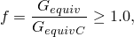

裂纹单元两个表面上的牵引力随着消耗的应变能等于传播裂纹所需的临界等效应变能 ）在分离上线性减小。计算  的公式与不同混合模式断裂准则的  公式相同。

| **输入文件用法：** | 同时使用以下两个选项： |
| --- | --- |
|  | ``` [*SURFACE BEHAVIOR](../key/key-link.md#usb-kws-hsurfacebehavior) [*FRACTURE CRITERION](../key/key-link.md#usb-kws-hfracturecriterion), TYPE=ENHANCED VCCT ``` |

| **Abaqus/CAE 用法：** | Abaqus/CAE 中不支持指定增强 VCCT 准则。 |
| --- | --- |

#### 基于 LEFM 原理的低循环疲劳准则

如果您指定低循环疲劳准则，则可以模拟承受亚临界循环载荷的富集单元的渐进裂纹增长。此准则只能在使用直接循环方法的低循环疲劳分析中（["使用直接循环方法的低循环疲劳分析，" 第 6.2.7 节"](pt03ch06s02at06.md)）。低循环疲劳步骤可以是唯一步骤，可以跟随一般静态步骤，或后接一般静态步骤。您可以在单一分析中包含多个低循环疲劳分析步骤。如果您在没有预先存在裂纹的模型中执行疲劳分析，则必须先用静态步骤引导疲劳步骤，如 ["裂纹成核和裂纹扩展方向"](pt04ch10s07at36.md#usb-anl-aenrichment-crack-nucleation) 中讨论的那样使裂纹成核。

萌生和疲劳裂纹增长由 Paris 定律表征，该定律将相对断裂能释放率与裂纹增长速率联系起来，如图 10.7.1-4 所示。富集单元中裂纹尖端的断裂能释放率基于上述 VCCT 技术计算。

Paris 区域以能量释放率阈值  为界，低于该阈值则不考虑疲劳裂纹萌生或增长；以能量释放率上限  为界，高于该值则疲劳裂纹将以加速速率增长。 是基于用户指定的混合模式准则和主体材料的断裂强度计算的临界等效应变能释放率。上面已经为不同的混合模式断裂准则提供了计算  的公式。您可以指定  与  的比值以及  的比值。默认值是  和 。

| **输入文件用法：** | 同时使用以下两个选项： |
| --- | --- |
|  | ``` [*SURFACE BEHAVIOR](../key/key-link.md#usb-kws-hsurfacebehavior) [*FRACTURE CRITERION](../key/key-link.md#usb-kws-hfracturecriterion), TYPE=FATIGUE ``` |

| **Abaqus/CAE 用法：** | Abaqus/CAE 中不支持指定低循环疲劳准则。 |
| --- | --- |

##### 疲劳裂纹增长萌生

疲劳裂纹增长萌生指的是富集单元中裂纹尖端疲劳裂纹增长的开始。在低循环疲劳分析中，疲劳裂纹增长萌生准则的特征是 ，这是结构在其最大值和最小值之间加载时的相对断裂能释放率。疲劳裂纹增长萌生准则定义为


其中  和  是材料常数， 是循环数。除非满足上述方程且对应于结构加载到其最大值时的循环能量释放率的最大断裂能释放率  大于 ，否则裂纹尖端前方的富集单元不会被断裂。

##### 使用 Paris 定律的疲劳裂纹增长

一旦在富集单元处满足疲劳裂纹增长萌生准则，裂纹增长速率  可以基于相对断裂能释放率  计算。如果 ，则每个循环的裂纹增长速率由 Paris 定律给出：


其中  和  是材料常数。

在循环  结束时，Abaqus/Standard 通过在裂纹尖端前方断裂至少一个富集单元，将裂纹长度  从当前循环向前扩展一个增量循环数  到 。给定材料常数  和 ，结合已知的单元长度和裂纹尖端前方富集单元的可能裂纹扩展方向 ，则裂纹尖端前方每个富集单元失效所需的循环数计算为 ，其中 *j* 表示  裂纹尖端的富集单元。分析设置在加载循环稳定后至少使一个富集单元断裂。识别具有最少循环数的单元被断裂，其  表示为裂纹增长等于其单元长度  所需的循环数。最关键的单元在稳定循环结束时完全断裂，约束和刚度为零。当富集单元断裂时，载荷重新分配，必须为下一次循环的裂纹尖端前方富集单元计算新的相对断裂能释放率。此能力允许在每个稳定循环后完全断裂裂纹尖端前方至少一个富集单元，并精确计算导致该长度疲劳裂纹增长所需的循环数。

如果 ，则裂纹尖端前方的富集单元将通过循环计数增加 1 来断裂。

#### 基于 XFEM 的 LEFM 方法的粘性正则化

具有不稳定传播裂纹的结构模拟是具有挑战性和困难的。不收敛行为可能时不时发生。局部阻尼通过使用粘性正则化技术包含在基于 XFEM 的 LEFM 方法中。粘性正则化阻尼导致软化材料的切线刚度矩阵在足够小的时间增量下保持正定。

| **输入文件用法：** | 使用以下选项之一 |
| --- | --- |
|  | ``` [*FRACTURE CRITERION](../key/key-link.md#usb-kws-hfracturecriterion), TYPE=VCCT, VISCOSITY= ``` ``` [*FRACTURE CRITERION](../key/key-link.md#usb-kws-hfracturecriterion), TYPE=ENHANCED VCCT, VISCOSITY= ``` |

| **Abaqus/CAE 用法：** | 相互作用模块：接触属性编辑器：****Mechanical****Fracture Criterion****：**Viscosity**： |
| --- | --- |

### 将分布压力载荷施加到裂纹单元表面

当单元在分析期间被裂纹切割时，会在分析期间生成基于 XFEM 的裂纹表面（请参阅上面的["定义裂纹表面"](pt04ch10s07at36.md#usb-anl-aenrichment-surf)）。可以将分布压力载荷施加到裂纹单元表面。

| **输入文件用法：** | 使用以下选项为裂纹表面定义分布压力载荷： |
| --- | --- |
|  | ``` [*DSLOAD](../key/key-link.md#usb-kws-hdsload) *surface name*, P or PNU, *magnitude* ``` |

| **Abaqus/CAE 用法：** | Abaqus/CAE 中不支持基于 XFEM 的裂纹表面。 |
| --- | --- |

### 指定富集特征的初始位置

由于不需要网格符合几何不连续性，必须在模型中指定预先存在的裂纹的初始位置。水平集方法用于此目的。每个节点通常需要两个有符号距离函数来描述裂纹几何形状。第一个描述裂纹表面，第二个用于构建正交表面，使得两个表面的交点给出裂纹前缘（请参阅["Abaqus/Standard 和 Abaqus/Explicit 中的初始条件，" 第 34.2.1 节"](pt07ch34s02aus116.md)）。

第一个有符号距离函数必须大于或小于零，不能等于零。如果必须在单元边界上定义初始裂纹，则必须为第一个有符号距离函数指定一个非常小的正值或负值。

| **输入文件用法：** | 使用以下选项指定富集特征的初始位置： |
| --- | --- |
|  | ``` [*INITIAL CONDITIONS](../key/key-link.md#usb-kws-minitialcond), TYPE=ENRICHMENT ``` |

| **Abaqus/CAE 用法：** | 相互作用模块：裂纹编辑器：**Crack location**：**Select**：选择区域 |
| --- | --- |

### 激活和停用富集特征

可以在步骤定义中激活或停用裂纹扩展能力。

| **输入文件用法：** | 使用以下选项在步骤定义中激活裂纹扩展能力： |
| --- | --- |
|  | ``` [*ENRICHMENT ACTIVATION](../key/key-link.md#usb-kws-henrichmentactivation), NAME=*name*, ACTIVATE=ON (default) ``` 使用以下选项在步骤定义中停用裂纹扩展能力： ``` [*ENRICHMENT ACTIVATION](../key/key-link.md#usb-kws-henrichmentactivation), NAME=*name*, ACTIVATE=OFF ``` 使用以下选项在步骤定义中一旦所有预先存在的裂纹（或者如果没有预先存在的裂纹，则所有允许的新成核裂纹）已在给定富集特征的边界内传播完成，便自动停用裂纹扩展能力： ``` [*ENRICHMENT ACTIVATION](../key/key-link.md#usb-kws-henrichmentactivation), NAME=*name*, ACTIVATE=AUTO OFF ``` |

| **Abaqus/CAE 用法：** | 要在步骤中修改裂纹扩展能力的状态，您必须首先创建 **XFEM crack growth** 相互作用： |
| --- | --- |
|  | 相互作用模块：**Create Interaction**：选择初始步骤：**XFEM Crack Growth**：选择裂纹：**Interaction manager**：在步骤中选择相互作用：**Edit**：切换**Allow crack growth in this step** |

### 轮廓积分

当您使用常规有限元方法（["轮廓积分评估，" 第 11.4.2 节"](pt04ch11s04aus68.md)）评估轮廓积分时，除了使网格符合裂纹几何形状外，还必须显式定义裂纹前缘并指定虚拟裂纹扩展方向。通常需要详细的聚焦网格，并且获得三维曲面裂纹的准确轮廓积分结果可能是麻烦的。扩展有限元与水平集方法结合减轻了这些缺点。适当的奇异渐近场和不连续性由特殊的富集函数与附加自由度共同保证。此外，裂纹前缘和虚拟裂纹扩展方向由水平集有符号距离函数自动确定。

| **输入文件用法：** | 使用以下选项获取基于扩展有限元方法的命名富集特征的轮廓积分： |
| --- | --- |
|  | ``` [*CONTOUR INTEGRAL](../key/key-link.md#usb-kws-hcontintegral), XFEM, CRACK NAME=*name* ``` |

| **Abaqus/CAE 用法：** | 步骤模块：历史输出请求编辑器：**Domain: Crack**：*crack name* |
| --- | --- |

#### 指定富集半径

尽管由于附加的渐近场，XFEM 减轻了裂纹前缘附近网格细化的相关缺点，但您必须在裂纹前缘周围生成足够数量的单元以获得路径无关的轮廓。从裂纹前缘小半径内的单元组被富集并参与轮廓积分计算。默认富集半径是富集区域中典型单元特征长度的三倍。您必须将富集半径内的单元包含在用于定义富集区域的单元集中。

| **输入文件用法：** | 使用以下选项指定富集半径： |
| --- | --- |
|  | ``` [*ENRICHMENT](../key/key-link.md#usb-kws-menrichment), ENRICHMENT RADIUS ``` |

| **Abaqus/CAE 用法：** | 相互作用模块：裂纹编辑器：**Enrichment radius**：**Analysis default** 或 **Specify** |
| --- | --- |

### 过程

可以将不连续性建模为富集特征，使用以下任一过程执行：
- 静态分析（请参阅["静态应力分析，" 第 6.2.2 节"](pt03ch06s02at01.md)）；
- 隐式动态分析（请参阅["使用直接积分的隐式动态分析，" 第 6.3.2 节"](pt03ch06s03at07.md)）；或
- 使用直接循环方法的低循环疲劳分析（["使用直接循环方法的低循环疲劳分析，" 第 6.2.7 节"](pt03ch06s02at06.md)）。
- 地静应力场分析（请参阅["地静应力状态，" 第 6.8.2 节"](pt03ch06s08at27.md)）；或
- 耦合孔隙流体扩散/应力分析（请参阅["耦合孔隙流体扩散和应力分析，" 第 6.8.1 节"](pt03ch06s08at26.md)）。

### 初始条件

可以指定识别富集特征的初始边界或界面的初始条件（请参阅["Abaqus/Standard 和 Abaqus/Explicit 中的初始条件，" 第 34.2.1 节"](pt07ch34s02aus116.md)）。

### 边界条件

可以将边界条件施加到位移或孔隙压力自由度（请参阅["Abaqus/Standard 和 Abaqus/Explicit 中的边界条件，" 第 34.3.1 节"](pt07ch34s03aus118.md)）。

### 载荷

在具有富集特征的模型中可以规定以下类型的载荷：
- 集中节点力可以施加到位移自由度（1-3）或孔隙压力自由度（8）；请参阅["集中载荷，" 第 34.4.2 节"](pt07ch34s04aus121.md)。
- 可以施加分布压力体力或体力；请参阅["分布载荷，" 第 34.4.3 节"](pt07ch34s04aus122.md)。特定单元可用的分布载荷类型在[第六部分，"单元"](pt06.md)中描述。

### 预定义场

可以在具有富集特征的模型中指定以下预定义场，如["预定义场，" 第 34.6.1 节"](pt07ch34s06aus128.md)中所述：
- 节点温度（尽管温度不是应力/位移单元中的自由度）。指定温度影响温度依赖性临界应力和应变失效准则。
- 用户定义场变量的值。指定的值影响场变量依赖性材料特性。

### 材料选项

Abaqus/Standard 中的任何机械本构模型，包括用户定义的材料（使用用户子程序["UMAT," Abaqus 用户子程序参考指南第 1.1.41 节](../sub/sub-link.md#sub-rtn-uumat)定义），都可用于建模裂纹扩展分析中富集单元的机械行为。请参阅[第五部分，"材料"](pt05.md)。材料点处的非弹性定义必须与线性弹性材料模型（["线弹性行为，" 第 22.2.1 节"](pt05ch22s02abm02.md)）或超弹性材料模型（["超弹性行为，" 第 22.4.1 节"](pt05ch22s04abm06.md)）结合使用。在评估固定裂纹的轮廓积分时，仅支持各向同性弹性材料。

### 单元

只有一阶实体连续体应力/位移单元、一阶位移/孔隙压力实体连续体单元和二阶应力/位移四面体单元可以与富集特征相关联。对于传播裂纹，这些包括双线性平面应变和平面应力单元、双线性轴对称单元、线性六面体单元、线性四面体单元和二阶四面体单元。对于固定裂纹，这些包括线性六面体单元、线性四面体单元和二阶四面体单元。

对于不协调模式单元，Abaqus/Standard 在单元在拉伸载荷下断裂后立即丢弃由于不协调变形模式引起的贡献。因此，即使这个裂纹单元完全卸载并且裂纹单元表面的接触重新建立，裂纹单元处的应力水平可能不会完全恢复到其原始卸载状态。

### 输出

除了 Abaqus 中可用的标准输出标识符（["Abaqus/Standard 输出变量标识符，" 第 4.2.1 节"](pt02ch04s02abv01.md)），以下节点、整体单元和表面变量对于具有富集特征的模型具有特殊含义。

节点变量：

| PHILSM | 描述裂纹表面的有符号距离函数。 |
| --- | --- |
| PSILSM | 描述初始裂纹前缘的有符号距离函数。 |
| --- | --- |

整体单元变量：

| STATUSXFEM | 富集单元的状态。（如果单元完全断裂则为 1.0，如果单元不含裂纹则为 0.0。如果单元部分断裂，STATUSXFEM 的值介于 1.0 和 0.0 之间。） |
| --- | --- |
| ENRRTXFEM | 使用扩展有限元方法的线弹性断裂力学时应变能释放率的所有分量。 |
| --- | --- |
| LOADSXFEM | 施加到裂纹表面的分布压力载荷。 |
| --- | --- |

以下整体单元输出变量仅在富集单元表面内启用流体流动时可用：

| GFVRXFEM | 富集单元的间隙流体体积率。 |
| --- | --- |
| PFOPENXFEM | 富集单元的断裂开口。 |
| --- | --- |
| PORPRES | 富集单元的流体压力。 |
| --- | --- |
| LEAKVRTXFEM | 富集单元顶部的泄漏流率。 |
| --- | --- |
| LEAKVRBXFEM | 富集单元底部的泄漏流率。 |
| --- | --- |
| ALEAKVRTXFEM | 富集单元顶部的累积泄漏体积。 |
| --- | --- |
| ALEAKVRBXFEM | 富集单元底部的累积泄漏体积。 |
| --- | --- |

表面变量：

| CRKDISP | 富集单元裂纹表面上的裂纹开口和相对切向运动。 |
| --- | --- |
| CSDMG | 富集单元裂纹表面上的损伤变量。 |
| --- | --- |

#### 使用非对称矩阵存储和求解

当在富集单元中激活孔隙压力自由度时，矩阵是非对称的；因此，可能需要非对称矩阵存储和求解来改善收敛（请参阅["Abaqus/Standard 中的矩阵存储和求解方案"中的"定义分析，" 第 6.1.2 节"](pt03ch06s01abo05.md#usb-anl-unsymm)）。

#### 可视化

裂纹可以通过有符号距离函数 PHILSM 的等值面进行可视化。

如果裂纹穿过富集单元的一个非常小的角落，在 Abaqus/CAE（Abaqus/Viewer）的可视化模块中显示轮廓时，富集单元中裂纹前缘沿线的位移可能在极少数情况下会失真。但是，在仅查看变形形状时不会出现失真。

当单元被裂纹切割时，裂纹单元分成两部分，每部分由真实域和虚拟域组成，如图 10.7.1-2 所示。裂纹单元的轮廓绘图积分点值考虑裂纹单元两部分中仅真实域的贡献。但是，当您探测裂纹单元时，仅报告包含真实域  和虚拟域 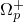 的那部分单元的贡献。

在评估固定裂纹中的轮廓积分时，会在具有奇异渐近裂纹尖端场的富集单元中内部引入附加积分站。但是，在 Abaqus/CAE（Abqqlq/Viewer）的可视化模块中不支持这些附加积分点处的单元输出变量可视化。

### 限制

富集特征存在以下限制：
- 富集单元不能被多个裂纹相交。
- 在分析期间，裂纹不允许在一个增量中转弯超过 90 度。
- 仅考虑固定裂纹的各向同性弹性材料中的渐近裂纹尖端场。
- 不支持自适应重新网格化。
- 不支持复合实体单元。

### 输入文件模板

以下是使用基于 XFEM 的内聚段方法建模裂纹扩展的示例：

```
[*HEADING](../key/key-link.md#usb-kws-mheading)
...
[*NODE](../key/key-link.md#usb-kws-mnode), NSET=ALL
...
[*ELEMENT](../key/key-link.md#usb-kws-melement), TYPE=C3D8, ELSET=REGULAR
[*ELEMENT](../key/key-link.md#usb-kws-melement), TYPE=C3D8, ELSET=ENRICHED
...
[*SOLID SECTION](../key/key-link.md#usb-kws-msolidsection), MATERIAL=STEEL1, ELSET=REGULAR
[*SOLID SECTION](../key/key-link.md#usb-kws-msolidsection), MATERIAL=STEEL12, ELSET=ENRICHED

[*ENRICHMENT](../key/key-link.md#usb-kws-menrichment), TYPE=PROPAGATION CRACK, ELSET=ENRICHED,
NAME=ENRICHMENT, INTERACTION=INTERACTION
[*SURFACE](../key/key-link.md#usb-kws-msurface), TYPE=XFEM, NAME=SURF_NAME
*Data lines to specify the names of enriched features*
[*MATERIAL](../key/key-link.md#usb-kws-mmaterial), NAME=STEEL1
...
[*MATERIAL](../key/key-link.md#usb-kws-mmaterial), NAME=STEEL2
[*DAMAGE INITIATION](../key/key-link.md#usb-kws-mdamageinitiation), CRITERION=MAXPS, TOLERANCE=0.05
[*DAMAGE EVOLUTION](../key/key-link.md#usb-kws-mdamageevolution), TYPE=ENERGY
*Data lines to specify the failure mechanism*
...
[*SURFACE INTERACTION](../key/key-link.md#usb-kws-hsurfaceinteraction), NAME=INTERACTION
[*SURFACE BEHAVIOR](../key/key-link.md#usb-kws-hsurfacebehavior)
*Data lines to specify the contact of cracked element surfaces*
...
[*STEP](../key/key-link.md#usb-kws-hstep)
[*STATIC](../key/key-link.md#usb-kws-hstatic)
...
[*END STEP](../key/key-link.md#usb-kws-hendstep)
[*STEP](../key/key-link.md#usb-kws-hstep)
[*STATIC](../key/key-link.md#usb-kws-hstatic)
...

[*ENRICHMENT ACTIVATION](../key/key-link.md#usb-kws-henrichmentactivation), TYPE=PROPAGATION CRACK,
NAME=ENRICHMENT, ACTIVATE=OFF
...
[*END STEP](../key/key-link.md#usb-kws-hendstep)
```

以下是使用基于 XFEM 的 LEFM 方法建模裂纹扩展的示例：

```
[*HEADING](../key/key-link.md#usb-kws-mheading)
...
[*NODE](../key/key-link.md#usb-kws-mnode), NSET=ALL
...
[*ELEMENT](../key/key-link.md#usb-kws-melement), TYPE=C3D8, ELSET=REGULAR
[*ELEMENT](../key/key-link.md#usb-kws-melement), TYPE=C3D8, ELSET=ENRICHED
...
[*SOLID SECTION](../key/key-link.md#usb-kws-msolidsection), MATERIAL=STEEL1, ELSET=REGULAR
[*SOLID SECTION](../key/key-link.md#usb-kws-msolidsection), MATERIAL=STEEL12, ELSET=ENRICHED

[*ENRICHMENT](../key/key-link.md#usb-kws-menrichment), TYPE=PROPAGATION CRACK, ELSET=ENRICHED,
NAME=ENRICHMENT, INTERACTION=INTERACTION
[*MATERIAL](../key/key-link.md#usb-kws-mmaterial), NAME=STEEL1
...
[*MATERIAL](../key/key-link.md#usb-kws-mmaterial), NAME=STEEL2
[*DAMAGE INITIATION](../key/key-link.md#usb-kws-mdamageinitiation), CRITERION=MAXPS, TOLERANCE=0.05
*Data lines to specify the crack nucleation mechanism*
...
[*SURFACE INTERACTION](../key/key-link.md#usb-kws-hsurfaceinteraction), NAME=INTERACTION
[*SURFACE BEHAVIOR](../key/key-link.md#usb-kws-hsurfacebehavior)
[*FRACTURE CRITERION](../key/key-link.md#usb-kws-hfracturecriterion), TYPE=VCCT, TOLERANCE=0.05,VISCOSITY=0.00001
*Data lines to specify the crack propagation criterion*
...
[*END STEP](../key/key-link.md#usb-kws-hendstep)
```

以下是使用扩展有限元方法计算固定裂纹中轮廓积分的示例：

```
[*HEADING](../key/key-link.md#usb-kws-mheading)
...
[*NODE](../key/key-link.md#usb-kws-mnode), NSET=ALL
...
[*ELEMENT](../key/key-link.md#usb-kws-melement), TYPE=C3D8, ELSET=REGULAR
[*ELEMENT](../key/key-link.md#usb-kws-melement), TYPE=C3D8, ELSET=ENRICHED
...
[*SOLID SECTION](../key/key-link.md#usb-kws-msolidsection), MATERIAL=STEEL1, ELSET=REGULAR
[*SOLID SECTION](../key/key-link.md#usb-kws-msolidsection), MATERIAL=STEEL12, ELSET=ENRICHED

[*ENRICHMENT](../key/key-link.md#usb-kws-menrichment), TYPE=STATIONARY CRACK, ELSET=ENRICHED,
NAME=ENRICHMENT, ENRICHMENT RADIUS
[*MATERIAL](../key/key-link.md#usb-kws-mmaterial), NAME=STEEL1
...
[*MATERIAL](../key/key-link.md#usb-kws-mmaterial), NAME=STEEL2
...
[*STEP](../key/key-link.md#usb-kws-hstep)
[*STATIC](../key/key-link.md#usb-kws-hstatic)
...
[*CONTOUR INTEGRAL](../key/key-link.md#usb-kws-hcontintegral), CRACK NAME=ENRICHMENT, XFEM
[*END STEP](../key/key-link.md#usb-kws-hendstep)

```

#### 其他参考文献

- Belytschko, T., and T. Black, "Elastic Crack Growth in Finite Elements with Minimal Remeshing," International Journal for Numerical Methods in Engineering, vol. 45, pp. 601--620, 1999.
- Benzeggagh, M., and M. Kenane, "Measurement of Mixed-Mode Delamination Fracture Toughness of Unidirectional Glass/Epoxy Composites with Mixed-Mode Bending Apparatus," Composite Science and Technology, vol. 56 439, 1996.
- Elguedj, T., A. Gravouil, and A. Combescure, "Appropriate Extended Functions for X-FEM Simulation of Plastic Fracture Mechanics," Computer Methods in Applied Mechanics and Engineering, vol. 195, pp. 501--515, 2006.
- Melenk, J., and I. Babuska, "The Partition of Unity Finite Element Method: Basic Theory and Applications," Computer Methods in Applied Mechanics and Engineering, vol. 39, pp. 289--314, 1996.
- Reeder, J., S. Kyongchan, P. B. Chunchu, and D. R.. Ambur, "Postbuckling and Growth of Delaminations in Composite Plates Subjected to Axial Compression"43rd AIAA/ASME/ASCE/AHS/ASC Structures, Structural Dynamics, and Materials Conference, Denver, Colorado, vol. 1746, p. 10, 2002.
- Remmers, J. J. C., R. de Borst, and A. Needleman, "The Simulation of Dynamic Crack Propagation using the Cohesive Segments Method," Journal of the Mechanics and Physics of Solids, vol. 56, pp. 70--92, 2008.
- Song, J. H., P. M. A. Areias, and T. Belytschko, "A Method for Dynamic Crack and Shear Band Propagation with Phantom Nodes," International Journal for Numerical Methods in Engineering, vol. 67, pp. 868--893, 2006.
- Sukumar, N., Z. Y. Huang, J.-H. Prevost, and Z. Suo, "Partition of Unity Enrichment for Bimaterial Interface Cracks," International Journal for Numerical Methods in Engineering, vol. 59, pp. 1075--1102, 2004.
- Sukumar, N., and J.-H. Prevost, "Modeling Quasi-Static Crack Growth with the Extended Finite Element Method Part I: Computer Implementation," International Journal for Solids and Structures, vol. 40, pp. 7513--7537, 2003.
- Wu, E. M., and R. C. Reuter Jr., "Crack Extension in Fiberglass Reinforced Plastics," T and M Report, University of Illinois, vol. 275, 1965.
