# 11.1.1 惯性 relief

**产品：** Abaqus/Standard  Abaqus/CAE

##### **参考文献**

- ["分布载荷," 第 34.4.3 节"](pt07ch34s04aus122.md)
- ["定义分析," 第 6.1.2 节"](pt03ch06s01abo05.md)
- [*INERTIA RELIEF](../key/key-link.md#usb-kws-hinertiareliefload)
- ["定义惯性 relief 载荷," Abaqus/CAE 用户指南第 16.9.16 节](../usi/usi-link.md#usi-lbi-loadeditors-inertia)

### 概述

惯性 relief：
- 涉及用源自恒定刚体加速度的载荷来平衡外部施加在自由或部分约束体上的力；
- 需要指定材料密度或质量和/或旋转惯性值，以计算惯性 relief 载荷；
- 可在 Abaqus/Standard 中进行静态、动态和屈曲分析；
- 在静态分析中，惯性 relief 载荷随外加载荷变化；
- 在动态分析中应用与静态预载相对应的惯性 relief 载荷；
- 可用于在屈曲分析中平衡施加的扰动载荷；
- 使用与指定边界条件一致的刚体加速度来计算惯性 relief 载荷；
- 可以是几何线性的或非线性的；
- 如果几何非线性分析中存在大的惯性 relief 力矩，可能需要使用非对称求解器；
- 当施加的载荷相对于物体的固有频率缓慢变化时，是进行完整动态自由体分析的廉价替代方案；以及
- 可用于多个载荷工况。

### 典型应用

惯性 relief 载荷可应用于静态（["静态应力分析," 第 6.2.2 节"](pt03ch06s02at01.md)）、动态（["使用直接积分的隐式动态分析," 第 6.3.2 节"](pt03ch06s03at07.md)）和特征值屈曲预测步骤（["特征值屈曲预测," 第 6.2.3 节"](pt03ch06s02at02.md)）。

在静态步骤中，惯性 relief 载荷随外部载荷变化。使用惯性 relief 载荷的一个例子是对火箭在发射过程中承受恒定或缓慢变化的加速度进行建模（即，承受恒定或缓慢变化的外部力的自由体），使用静态分析程序。物体受到的惯性力通过惯性 relief 载荷包含在静态解中，以平衡外部载荷。

在动态步骤中，惯性 relief 载荷基于静态预载计算，并在步骤中保持恒定。以下是在动态分析程序中使用惯性 relief 载荷的示例：考虑一个浸没在水中的自由体，受到爆炸冲击波载荷。需要动态分析来计算瞬态解。如果已知物体最初在重力和流体静水压力下处于静止状态，则重力载荷应与浮力完全平衡。然而，如果有限元模型没有包含物体中存在的所有质量（例如，压舱物），则如果没有附加载荷，物体将由于不平衡的外部力而加速。施加惯性 relief 载荷正好平衡这些不平衡的外部载荷，使物体处于静态平衡。然后，动态分析提供物体对冲击波载荷的瞬态响应，作为物体相对于其静态平衡位置的变形。

在屈曲分析中，惯性 relief 载荷可应用于静态预载步骤、特征值屈曲预测步骤，或两者兼施。在特征值屈曲预测步骤中，惯性 relief 载荷基于扰动载荷计算。考虑静态分析火箭示例。如果我们在火箭的屈曲分析中使用惯性 relief，并将火箭推力作为扰动载荷，则可以预测导致火箭屈曲的临界推力。

### 基本公式

在惯性 relief 中，物体的总响应，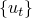，被写成参考点的刚体响应，，和相对响应，的组合：

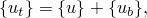

速度和加速度有相应的表达式。参考点是质心，除非您必须指定参考点。然后，有限元近似的动态平衡方程变为

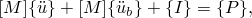

其中 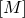 是质量矩阵， 是内力向量，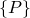 是外力向量。静态分析中涉及惯性 relief 时感兴趣的响应是对应于参考点动态运动的刚体响应和相对于刚体运动的静态响应。因此，相对加速度项 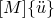 从平衡方程中消失。

刚体响应可以用参考点的加速度，，和刚体模态向量，、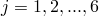（在三维中）表示：

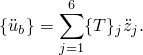

根据定义， 表示在参考点处沿 *j* 方向施加单位加速度（位移或旋转）对应的加速度向量。例如，在具有通常三个位移和三个旋转的节点处， 是


其中 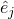 为 unity；所有其他  为零；*x*、*y* 和 *z* 是节点的坐标；、 和  表示作为旋转中心的参考点坐标。如果系统经历几何形状的有限变化， 和  都将是时间的函数。

将动态平衡方程投影到刚体模态上，我们有

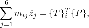

其中 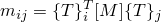 是"刚体惯性"， 是与刚体模态 *j* 关联的刚体加速度。实际刚体模态的数量在存在对称平面的情况以及二维和轴对称分析中将小于 6。因此，刚体响应可以直接从外部载荷评估。

物体的相对响应可以通过求解已知惯性项 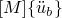 移到右侧的平衡方程来获得；即，作为体力施加。静态平衡方程变为


其中 。

在涉及惯性 relief 的动态分析中，刚体模态向量  在动态分析开始时的配置中计算，参考点加速度 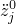 被计算以平衡此配置中的静态预载。相对加速度项不会被删除，因此动态平衡方程变为


其中 。在几何非线性分析中，刚体模态向量在使用当前配置进行重新计算，但参考点加速度保持恒定。这使得惯性 relief 载荷的总大小在分析过程中保持恒定，但允许载荷与空间质量分布成正比，后者随几何形状变化。

| **输入文件用法：** | ``` [*INERTIA RELIEF](../key/key-link.md#usb-kws-hinertiareliefload) ``` |
| --- | --- |

| **Abaqus/CAE 用法：** | 载荷模块：**创建载荷**：为**类别**选择**Mechanical**，为**所选步骤的类型**选择**Inertia relief** |
| --- | --- |

### 惯性 relief 载荷方向

默认情况下，模型中所有刚体运动方向都可以由惯性 relief 载荷加载（在此讨论中，我们使用"方向"一词来表示任何刚体平移或旋转）。在具有对称平面的模型或仅允许沿特定方向自由移动的模型中，可以指定应用惯性 relief 载荷的自由方向。例如，在具有一个对称平面的三维分析中，只存在三个自由方向——两个平移和一个旋转。添加一个附加对称平面后，只剩一个自由平移。圆柱-活塞 arrangement 是仅考虑沿气缸轴线运动的自由方向的例子。在这些情况下，您可以通过指示自由度来指定由惯性 relief 载荷加载的自由方向。

不允许两个自由旋转方向的情况。对于具有惯性 relief 的循环对称模型，在计算惯性 relief 载荷时，仅考虑 *Z* 方向的平移和绕 *Z* 方向的旋转。

| **输入文件用法：** | ``` [*INERTIA RELIEF](../key/key-link.md#usb-kws-hinertiareliefload) *整数列表，标识自由方向的全局自由度* ``` |
| --- | --- |
|  | 例如，列表 1, 3, 5 意味着 *X* 和 *Z* 方向的平移以及绕 *Y* 轴的旋转是自由方向。 |

| **Abaqus/CAE 用法：** | 载荷模块：**创建载荷**：为**类别**选择**Mechanical**，为**所选步骤的类型**选择**Inertia relief**：切换开启自由度以定义**自由方向**（显示的自由度取决于建模空间） |
| --- | --- |

#### 在局部坐标系中定义自由方向

如果自由方向不是全局方向，则可以使用方向来定义整数自由度标识符列表所指的局部坐标系。

| **输入文件用法：** | ``` [*INERTIA RELIEF](../key/key-link.md#usb-kws-hinertiareliefload), ORIENTATION=*orientation_name* *整数列表，标识自由方向的局部自由度* ``` |
| --- | --- |

| **Abaqus/CAE 用法：** | 载荷模块：**创建载荷**：为**类别**选择**Mechanical**，为**所选步骤的类型**选择**Inertia relief**：点击**编辑**，并选择局部**CSYS** |
| --- | --- |

#### 定义需要用户指定参考点的自由方向组合

并非所有用户选择的自由方向组合都允许无约束的刚体运动；也就是说，对于某些自由方向组合，需要一个附加点来定义刚体运动向量。例如，在三维中，选择 4, 5, 6 对应于绕固定点的自由旋转。必须给出固定点以定义刚体运动向量。在其他示例中，自由方向包括绕固定轴的旋转。考虑绕其轴线旋转的涡轮叶片，如图 11.1.1-1 所示。

要找到叶片在施加的力偶或力矩作用下旋转时的角加速度，您应指定叶片绕其旋转的轴上的点坐标。必须指定参考点的自由方向组合如表 11.1.1-1 所示。

| **输入文件用法：** | ``` [*INERTIA RELIEF](../key/key-link.md#usb-kws-hinertiareliefload), ORIENTATION=*orientation_name* *整数列表，标识自由方向的局部自由度* *定义刚体向量的参考点的 X, Y, Z 坐标* ``` |
| --- | --- |

| **Abaqus/CAE 用法：** | 载荷模块：**创建载荷**：为**类别**选择**Mechanical**，为**所选步骤的类型**选择**Inertia relief**：切换开启**参考点的全局位置**，并输入 **X**、**Y** 和（如果有）**Z** 坐标 |
| --- | --- |

**表 11.1.1-1** 需要参考点的自由方向组合。
| 定义自由方向的自由度标识符 | 参考点定义 |
| --- | --- |
| 固定旋转点 | 旋转轴上的点 | 对称线上的点 |
| 4, 5, 6 |  |  |
| 1, 4, 5, 6 |  |  |
| 2, 4, 5, 6 |  |  |
| 3, 4, 5, 6 |  |  |
| 1, 2, 4, 5, 6 |  |  |
| 1, 3, 4, 5, 6 |  |  |
| 2, 3, 4, 5, 6 |  |  |
| 4 |  |  |  |
| 5 |  |  |  |
| 6 |  |  |  |
| 2, 4 |  |  |  |
| 3, 4 |  |  |  |
| 1, 5 |  |  |  |
| 3, 5 |  |  |  |
| 1, 6 |  |  |  |
| 2, 6 |  |  |  |
| 1, 2, 4 |  |  |  |
| 1, 2, 5 |  |  |  |
| 1, 3, 4 |  |  |  |
| 1, 3, 6 |  |  |  |
| 2, 3, 5 |  |  |  |
| 2, 3, 6 |  |  |  |
| 1, 4 |  |  |  |
| 2, 5 |  |  |  |
| 3, 6 |  |  |  |

### 初始条件

可以以与没有惯性 relief 载荷的静态和动态分析相同的方式指定初始条件。如果在分析的第一个步骤中使用惯性 relief，这些初始条件构成物体的基础状态。参见 ["Abaqus/Standard 和 Abaqus/Explicit 中的初始条件," 第 34.2.1 节"](pt07ch34s02aus116.md)。

### 边界条件

边界条件的指定方式与没有惯性 relief 载荷的分析相同（参见 ["Abaqus/Standard 和 Abaqus/Explicit 中的边界条件," 第 34.3.1 节"](pt07ch34s03aus118.md)）。理论上，在静态步骤中使用惯性 relief 时需要静定约束集。我们所说的"静定"是指一组约束，它约束所有刚体模态但不约束变形模态。这样的集合提供唯一的位移解，并确保惯性 relief 载荷精确平衡用户指定的外部载荷：零反作用力，质心无刚体运动。表 11.1.1-2 总结了在各种情况下约束的要求。

**表 11.1.1-2** 必要且充分的静定约束。
| 问题维度 | 自由方向 | 所需约束数量 |
| --- | --- | --- |
| 2D | 2 个平移和 1 个旋转 | 3 |
| 轴对称 | 1 个平移 | 1 |
| 轴对称 with twist | 1 个平移和 1 个旋转 | 2 |
| 3D | 3 个平移和 3 个旋转 | 6 |

但是，用户不必明确指定边界条件（["Abaqus/Standard 和 Abaqus/Explicit 中的边界条件," 第 34.3.1 节"](pt07ch34s03aus118.md)），除了屈曲分析。如果没有指定边界条件或指定的边界条件不足，将发出警告消息，并在模型中对应于参考点原始位置处自动施加约束刚体模态所需的边界条件。另一方面，如果在某些方向上指定了太多边界条件，将发出警告消息以指示在具有过度指定边界条件的节点处反作用力可能不为零。如果在某些方向上存在不足的边界条件，而在其他方向上又太多，问题将被视为这些情况的组合。

如果模型没有边界条件或边界条件不足，在分析过程中每次平衡迭代可能会发出特定数量的数值奇异性警告。位移解经过后处理以移除无约束的刚体运动。但是，数值奇异性的数量不应超过无约束刚体模态的数量；任何额外的数值奇异性消息可能表明其他问题。

类似地，没有边界条件或边界条件不足的模型可能产生负特征值消息。如果在分析中每次平衡迭代的负特征值数量不超过与惯性 relief 边界条件相关的最大合理数值奇异性数量，则结果可以信赖，但额外的负特征值可能表明其他问题。

如果模型包含对称平面或被约束仅沿特定方向自由移动，则应仅在这些自由方向上施加惯性 relief 载荷。不应在自由方向上指定边界条件；但是，必须在其他方向上指定足够的边界条件。任何违反上述要求的边界条件都将被标记为错误。如果自由方向组合仅包含两个自由旋转，或者需要参考点但未指定，也将发出错误。

在屈曲分析中，正确的边界条件对于获得正确的模态形状很重要。在此类分析中施加惯性 relief 载荷时，必须指定足够的边界条件。有关在屈曲分析中如何施加边界条件的详细信息，请参见 ["特征值屈曲预测," 第 6.2.3 节"](pt03ch06s02at02.md)。

### 载荷

使用惯性 relief 的分析可以包括在位移自由度（1-6）处的集中节点力、分布压力载荷或体力，以及用户定义的载荷。

惯性 relief 载荷用于平衡外部载荷。它们在步骤定义中包含惯性 relief 时计算和施加。载荷定义在步骤之间传播的规则适用于惯性 relief 载荷。参见 ["应用载荷：概述," 第 34.4.1 节"](pt07ch34s04aus120.md)。惯性 relief 载荷不会传播到惯性 relief 对指定程序无效的步骤。

如果在几何非线性分析中存在大的惯性 relief 力矩，它们对刚度矩阵的贡献可能是不对称的。在这种情况下，非对称方程求解可以提高计算效率（参见 ["定义分析," 第 6.1.2 节"](pt03ch06s01abo05.md)）。

#### 计算惯性 relief 载荷

与惯性 relief 载荷对应的节点力向量计算如下。施加的载荷投影到刚体模态，。这些力和力矩分量（三维中六个分量）与"刚体惯性"一起用于求解刚体加速度，。只有与惯性 relief 载荷方向对应的刚体加速度分量非零。节点力向量使用组装的质点矩阵  计算为


##### 固定惯性 relief 载荷

您可以指定惯性 relief 载荷的大小和方向应固定为在上一步结束时计算的值。

| **输入文件用法：** | ``` [*INERTIA RELIEF](../key/key-link.md#usb-kws-hinertiareliefload), FIXED ``` |
| --- | --- |

| **Abaqus/CAE 用法：** | 载荷模块：**创建载荷**：为**类别**选择**Mechanical**，为**所选步骤的类型**选择**Inertia relief**：**方法：固定在当前载荷** |
| --- | --- |

##### 移除惯性 relief 载荷

您可以指定在当前步骤中应移除在上一步一般分析步骤中施加的惯性 relief 载荷。

| **输入文件用法：** | ``` [*INERTIA RELIEF](../key/key-link.md#usb-kws-hinertiareliefload), REMOVE ``` |
| --- | --- |

| **Abaqus/CAE 用法：** | 载荷模块：**载荷管理器**：**停用** |
| --- | --- |

### 预定义场

用户定义的场变量可以以与没有惯性 relief 载荷的静态和动态分析相同的方式指定。参见 ["预定义场," 第 34.6.1 节"](pt07ch34s06aus128.md)。

### 材料选项

Abaqus/Standard 中可用于静态、动态或屈曲分析的任何机械本构模型都可与惯性 relief 一起使用（有关 Abaqus/Standard 中可用的材料模型的详细信息，请参见第五部分，["材料"](pt05.md)）。由于惯性 relief 载荷是使用模型的惯性特性计算的，因此必须指定密度（参见 ["密度," 第 21.2.1 节"](pt05ch21s02abm01.md)）以定义模型的惯性特性。

### 单元

Abaqus/Standard 中可用于静态、动态和屈曲分析的大多数应力/位移单元（包括质量和旋转惯性单元以及用户单元）都可以使用。当模型包含没有相关质量或惯性的单元（例如，静水压力单元和孔隙压力单元）时，将发出警告。如果模型包含不允许有限边界的单元（例如，无限单元和弹性单元基础），将发出错误。尽管五自由度壳单元可用于具有惯性 relief 载荷的步骤，但如果模型没有边界条件或边界条件不足，它们可能会导致收敛困难。为了改善收敛，这些单元应替换为其他常规壳单元。

在子结构的情况下，必须为子结构生成缩减质量矩阵（参见 ["为子结构生成缩减结构阻尼矩阵"中的"定义子结构," 第 10.1.2 节"](pt04ch10s01aus59.md#usb-anl-asuperelementdef-genreducedmassmatrix)）。缩减质量矩阵包含在整个人模型的全局质量矩阵中，以计算刚体加速度和惯性 relief 载荷。惯性 relief 只能与几何线性分析中的子结构一起使用。如果在几何非线性分析中将惯性 relief 与子结构一起使用，则会发出错误消息。

### 输出

除了 Abaqus/Standard 中可用的常规输出变量（参见 ["Abaqus/Standard 输出变量标识符," 第 4.2.1 节"](pt02ch04s02abv01.md)）外，还特别为惯性 relief 提供以下变量：

整个模型的变量：

| IRX | 参考点的当前坐标。 |
| --- | --- |

| IRX*n* | 参考点的第 *n* 个坐标（）。 |
| --- | --- |

| IRA | 等效刚体加速度分量。 |
| --- | --- |

| IRA*n* | 等效刚体加速度的第 *n* 个分量（）。 |
| --- | --- |

| IRAR*n* | 相对于参考点的等效刚体角加速度的第 *n* 个分量（）。 |
| --- | --- |

| IRF | 与等效刚体加速度对应的惯性 relief 载荷。 |
| --- | --- |

| IRF*n* | 与等效刚体加速度对应的惯性 relief 载荷的第 *n* 个分量（）。 |
| --- | --- |

| IRM*n* | 与相对于参考点的等效刚体角加速度对应的惯性 relief 力矩的第 *n* 个分量（）。 |
| --- | --- |

| IRRI | 绕参考点的旋转惯性。 |
| --- | --- |

| IRRI*ij* | 绕参考点的旋转惯性的  分量（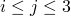）。 |
| --- | --- |

| IRMASS | 整个模型的质量。 |
| --- | --- |

在大多数情况下，惯性 relief 载荷对应于"刚体惯性"与等效刚体加速度向量的乘积。然而，当仅选择少数刚体方向作为惯性 relief 的自由方向时，惯性 relief 载荷在所有刚体方向上计算用于输出目的，但等效刚体加速度仅在自由方向上计算，等效刚体角加速度从"刚体惯性"的对角项计算。

### 限制

您需要注意在惯性 relief 载荷分析中可能遇到的限制。

#### 内部边界条件和几何线性和非线性分析的收敛

在包含产生不平衡内力或力矩的内部边界条件的模型中，例如某些单元（例如，SPRING1、DASHPOT1、SPRING2、DASHPOT2 或 GAPUNI 单元）或运动约束（例如，耦合约束、线性约束方程、多点约束或基于表面的绑定约束）所可能产生的情况，惯性 relief 载荷将不会平衡这些内力或力矩。如果模型包含足够的边界条件，这些内力或力矩将表现为非零反作用力或力矩。如果模型不包含足够的边界条件，这些内力或力矩将表现为几何线性和非线性分析的消息文件中未收敛的残余通量。模型应被视为具有内部边界条件，未收敛的残余代表施加内部边界条件所需的反作用力或力矩。理想情况下，应移除内部边界条件或向模型添加足够的边界条件。

#### 未连接区域和涉及接触的分析

不支持由多个未连接区域组成的模型的惯性 relief，即使它们之间定义了接触除外。如果在区域之间定义了绑定接触，则为例外。在这种情况下，用户有责任确保不同部件以不会在它们之间产生刚体运动的方式绑定。

此外，涉及接触和惯性 relief 载荷的模型在表面不接触或使用接触稳定时可能表现不佳或无法收敛。

#### 使用矩阵定义的质量和刚度

在使用惯性 relief 载荷的分析中，不能使用矩阵定义质量和刚度。

### 输入文件模板

```
[*HEADING](../key/key-link.md#usb-kws-mheading)
…
[*DENSITY](../key/key-link.md#usb-kws-mdensity)
*数据行指定材料密度*
[*BOUNDARY](../key/key-link.md#usb-kws-hboundary)
*数据行指定零值边界条件*
**
[*STEP](../key/key-link.md#usb-kws-hstep) (, NLGEOM) (, PERTURBATION)
*使用 NLGEOM 参数包含非线性几何效应；
它将在所有后续步骤中保持活动状态。*
[*STATIC](../key/key-link.md#usb-kws-hstatic) (*或* [*DYNAMIC](../key/key-link.md#usb-kws-hdynamic))
…
[*CLOAD](../key/key-link.md#usb-kws-hcload) 和/或 [*DLOAD](../key/key-link.md#usb-kws-hdload)
*数据行指定载荷*
[*INERTIA RELIEF](../key/key-link.md#usb-kws-hinertiareliefload), ORIENTATION=*orientation_name*
*数据行指定全局（或如果使用 ORIENTATION 参数，则为局部）定义自由方向的自由度，
并提供参考点的坐标*
[*END STEP](../key/key-link.md#usb-kws-hendstep)
**
[*STEP](../key/key-link.md#usb-kws-hstep)
[*STATIC](../key/key-link.md#usb-kws-hstatic)(*或* [*DYNAMIC](../key/key-link.md#usb-kws-hdynamic))
…
[*INERTIA RELIEF](../key/key-link.md#usb-kws-hinertiareliefload), FIXED or REMOVE
*包含 FIXED 参数将惯性 relief 载荷固定在其当前值；
包含 REMOVE 参数从步骤开始移除惯性 relief 载荷。*
[*END STEP](../key/key-link.md#usb-kws-hendstep)
```
