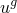
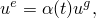
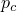

# 11.2.1 单元和接触对移除与重新激活

**产品：** Abaqus/Standard  Abaqus/CAE

##### **参考文献**

- ["移除和重新激活接触对"中的"在 Abaqus/Standard 中定义接触对," 第 36.3.1 节"](pt09ch36s03aus145.md#usb-cni-acontactmodelchange)
- [*MODEL CHANGE](../key/key-link.md#usb-kws-hmodelchange)
- ["定义模型更改交互," Abaqus/CAE 用户指南第 15.13.13 节](../usi/usi-link.md#usi-itn-help-model-change)

### 概述

单元和接触对移除/重新激活：
- 可用于模拟移除模型的一部分，无论是临时移除还是分析剩余时间内移除；
- 允许无应变或带应变重新激活单元；
- 可用于在不需要接触对时节省计算时间；
- 仅可用于一般分析步骤；以及
- 仅在原始分析中使用或激活过的情况下才能在重启分析中使用。

### 移除单元

您可以在一般分析步骤中从模型中移除指定的单元。就在移除步骤之前，Abaqus/Standard 会存储要移除的区域在其与模型其余部分之间的边界节点上施加的力/通量。这些力在移除步骤期间逐渐降至零；因此，移除区域对模型其余部分的影响仅在移除步骤结束时完全消失。力是逐渐降低的，以确保单元移除对模型的影响是平滑的。

从移除单元的步骤开始，不再对要移除的单元执行进一步的单元计算。移除的单元在后续步骤中保持非活动状态，除非您按如下所述重新激活它们。

| **输入文件用法：** | 使用以下选项从模型中移除单元： |
| --- | --- |
|  | ``` [*MODEL CHANGE](../key/key-link.md#usb-kws-hmodelchange), TYPE=ELEMENT, REMOVE ``` |

| **Abaqus/CAE 用法：** | 交互模块：**创建交互**：**模型更改**：**定义**：**区域**，**区域单元的激活状态**：**在此步骤中停用** |
| --- | --- |

#### 在瞬态过程中移除单元

在瞬态过程中移除单元时必须小心。移除的单元在与其余模型的边界处施加的节点通量在步骤中逐渐降低。在瞬态热传递、完全耦合温度-位移或完全耦合热-电-结构分析中，如果通量很高且步骤很长，这种逐渐降低可能会产生冷却或加热身体其余部分的效果。在动态分析中，如果力很大且步骤很长，动能可以被赋予模型的剩余部分。可以通过在分析之前在一个非常短的瞬态步骤中移除单元来避免此问题。此步骤可以在单个增量中完成。

### 重新激活应力/位移单元

为应力/位移单元（包括子结构）提供了两种不同类型的重新激活：无应变重新激活和带应变重新激活。无应变重新激活重置初始配置；带应变重新激活则不会。

虽然在分析中无法创建单元，但可以通过在模型定义中创建单元、在第一步中移除它们，然后重新激活它们来达到类似的效果。

#### 无应变重新激活

当应力/位移单元以无应变状态重新激活时，它们在重新激活时刻（重新激活的步骤开始）立即完全激活。它们在重新激活步骤开始时所处的配置中被重置为"退火"状态（零应力、应变、塑性应变等）。此配置取决于是否进行小位移或大位移分析。或者，可以指定以非原始状态重新激活，如下所述。

由于这些单元以原始状态（即零应力）重新激活，它们对模型的其余部分施加零节点力。这个结果允许立即进行重新激活，而不会对解的平滑性产生不利影响。

重新激活后，应变和变形梯度基于重新激活时刻之后的位移，而不是它们的总位移。因此，重新激活步骤开始时的当前配置成为单元的新初始配置。

这种重新激活通常用于对模型的未变形和无应变区域进行建模，该区域与另一个可能受应力、变形的区域共享边界。例如，在隧道开挖中，添加无应力隧道衬砌以衬砌已经变形的隧道壁（参见 ["无应力单元重新激活," Abaqus 示例问题指南第 1.1.11 节](../exa/exa-link.md#exa-sta-modelchangedemo)）。

| **输入文件用法：** | 使用以下选项以无应变状态重新激活单元： |
| --- | --- |
|  | ``` [*MODEL CHANGE](../key/key-link.md#usb-kws-hmodelchange), ADD=STRAIN FREE (default) ``` |

| **Abaqus/CAE 用法：** | 交互模块：**创建交互**：**模型更改**：**定义**：**区域**，**区域单元的激活状态**：**在此步骤中重新激活** |
| --- | --- |

##### 小位移分析

在小位移分析中，重新激活时的位移被认为是小的；因此，体积、质量、初始长度和方向不变。

##### 大位移分析

在大位移分析中，新配置可能与模型定义中指定的原始配置明显不同。配置的变化可能来自大变形或刚体运动。为了使重新激活单元的节点在重新激活时处于正确位置，这些节点必须由未移除的单元共享。否则，移除单元的节点保持在移除时占据的位置。对于重新激活封闭材料区域的情况，共享节点限制可能要求在移除的单元上定义一组不影响应力解的材料属性重复单元。这些重复单元提供了跟踪移除单元节点位置的方法。

重新激活时，单元的体积或质量可能明显不同，因此为单元重新形成质量矩阵。适用于单元的任何局部方向都在新配置上重新定义。然而，对于壳单元和膜单元，重新激活单元的厚度是分析开始时由单元的截面定义、节点厚度定义（["节点厚度," 第 2.1.3 节"](pt01ch02s01aus07.md)）或导入定义（["在 Abaqus 分析之间传输结果：概述," 第 9.2.1 节"](pt04ch09s02aus54.md)）指定的厚度。

结构单元在重新激活时刻的当前法线成为该单元的新初始法线。当前法线是单元的原始法线（如模型定义中所指定）按重新激活时刻的节点旋转旋转而得到的。该方案保持了重新激活单元的法线与共享节点的单元法线之间的角度。（通常，此角度应为零，法线应相同，例如当无应变层添加到已经变形的壳或梁时。这可以通过确保法线在模型定义中相同来实现。）如果重新激活的结构单元仅与非结构单元（不提供旋转自由度刚度的单元）共享节点，则需要重复结构单元，以便共享节点处的旋转自由度在重新激活之前跟随变形和刚体运动。

在大位移分析中，以无应变方式重新激活的单元会融入其节点在重新激活时刻给出的任何配置。您必须确保此配置是有意义的且没有严重变形。Abaqus/Standard 将对重新激活的单元应用几何检查；这些检查与分析输入文件处理器中完成的检查相同。如果单元看起来严重变形，则会在消息文件中打印警告；如果变形严重，则会给出错误消息，在这种情况下分析将停止。如果单元的几何检查产生警告或错误消息，其当前坐标和适用时的法线将被打印到消息文件中供您检查。可以通过请求单元移除/重新激活的详细输出来打印所有正在重新激活的单元的当前坐标，如 ["Abaqus/Standard 消息文件"中的"输出," 第 4.1.1 节"](pt02ch04s01aus38.md#usb-out-ooutput-message-std) 中所述。

##### 重新激活轴对称单元

如果轴对称单元在重新激活时具有非常小的负径向坐标（如果径向坐标的大小小于平均单元长度的 10^4 倍），Abaqus/Standard 不会停止分析。在这种情况下，会打印警告，并假定径向坐标为零。如果径向坐标为负且大小大于平均单元长度的 10^4 倍，分析将停止。

对于轴对称-非对称单元（SAXA 和 CAXA），即使在大位移分析中，重新激活时的位移也被认为是小的，因为这些单元需要轴对称原始配置，但这些单元节点在重新激活时给出的配置通常不会是轴对称的。因此，对于这些单元，假定原始配置不变。

##### 重新激活耦合温度-位移和耦合热-电-结构单元

在完全耦合温度-位移分析和完全耦合热-电-结构分析中，连续体单元在无应变重新激活时立即获得其完整的机械刚度；但是，为了确保解的平滑性，热导率在步骤中从零逐渐增加。

##### 重新激活弹簧单元和子结构

如果弹簧单元或子结构以"无应变"方式重新激活，重新激活时刻的配置代表单元的零位移状态；弹簧或子结构中的力基于重新激活时刻之后的相对位移。

#### 带应变重新激活

除非指定了以非原始状态重新激活（如下所述），否则带应变重新激活的单元以退火状态开始。

在重新激活步骤中，这些单元实现以下方案：设  表示此单元节点的位移，这些位移是模型其余部分共享的或由边界条件指定的位移。通常，这些位移在重新激活步骤中可能随时间变化。在重新激活步骤中的任何时刻，Abaqus/Standard 为单元强制执行位移 ：



其中  是一个参数，在步骤期间从 0 线性增加到 1。因此，在步骤期间，重新激活单元感受的位移逐渐增加到其实际值。为了产生一致的刚度矩阵，单元刚度也乘以 ；因此，模型的其余部分将重新激活的单元视为好像它们的刚度在步骤中逐渐增加。

这种位移的逐渐增加而不是单元力的直接逐渐增加确保了单元中的应变从零逐渐增加到由其节点位移给出的应变。这种应变的逐渐增加是可取的，因为可以逐渐积分与历史相关的材料的响应。

在重新激活步骤结束之后，重新激活单元中的应变对应于其节点相对于其初始配置的位移，而不是相对于重新激活时刻的位移。例如，这在核反应堆换料中是适当的，因为新燃料组件必须符合其旧邻居的变形。

这种重新激活方案不适用于每节点具有五个自由度的壳单元的旋转，因为在这些节点处不存储总旋转。因此，不允许这些单元带应变重新激活。

如果单元在之前无应变重新激活之后带应变重新激活，则应变基于单元无应变重新激活时的配置中的位移（因为这为单元定义了新初始配置）。在这种情况下，上面公式中的  应解释为节点相对于单元无应变重新激活位置处的位移。

| **输入文件用法：** | 使用以下选项带应变重新激活单元： |
| --- | --- |
|  | ``` [*MODEL CHANGE](../key/key-link.md#usb-kws-hmodelchange), ADD=WITH STRAIN ``` |

| **Abaqus/CAE 用法：** | 交互模块：**创建交互**：**模型更改**：**定义**：**区域**，**区域单元的激活状态**：**在此步骤中重新激活**；切换开启**带应变重新激活单元（如果适用）** |
| --- | --- |

#### 重新激活带钢筋的单元

钢筋的重新激活与定义钢筋的单元完全相同——无应变或带应变。重新激活时发生的退火也适用于模型中的钢筋。钢筋的重新激活也可以以非原始状态进行。

### 重新激活其他单元类型

在重新激活除应力/位移单元、子结构和接触单元之外的所有单元类型期间，由单元中的应力和分布载荷引起的节点力在重新激活步骤期间按从零到一的值进行缩放。（对于热传递单元，节点通量的缩放方式类似。）实际上，这种缩放在步骤期间将单元刚度从零逐渐增加；对于有质量或阻尼的单元，这种缩放也在步骤期间逐渐增加质量或阻尼。

在重新激活步骤期间，热传递单元的热导率和孔隙压力单元的渗透率在步骤中从零逐渐增加。

用户定义的单元可以移除和重新激活。在移除单元或已移除单元的步骤中不会调用用户子程序 [`UEL`](../sub/sub-link.md#sub-xsl-uel)。

| **输入文件用法：** | ``` [*MODEL CHANGE](../key/key-link.md#usb-kws-hmodelchange), ADD ``` |
| --- | --- |

| **Abaqus/CAE 用法：** | 交互模块：**创建交互**：**模型更改**：**定义**：**区域**，**区域单元的激活状态**：**在此步骤中重新激活** |
| --- | --- |

### 移除和重新激活接触对

您可以在一般分析步骤中从模型中移除指定的从面和主面。接触对移除和重新激活在 ["移除和重新激活接触对"中的"在 Abaqus/Standard 中定义接触对," 第 36.3.1 节"](pt09ch36s03aus145.md#usb-cni-acontactmodelchange) 中说明。

| **输入文件用法：** | ``` [*MODEL CHANGE](../key/key-link.md#usb-kws-hmodelchange), TYPE=CONTACT PAIR, REMOVE or ADD ``` |
| --- | --- |

| **Abaqus/CAE 用法：** | 使用以下选项移除接触对： |
| --- | --- |
|  | 交互模块：**创建交互**：**表面到表面接触 (Standard)** 或 **自接触 (Standard)**：切换关闭**在此步骤中活动** 使用以下选项重新激活接触对：交互模块：**创建交互**：**表面到表面接触 (Standard)** 或 **自接触 (Standard)**：切换开启**在此步骤中活动** |

### 移除和重新激活接触单元

接触单元的移除和重新激活方式与接触对相同，如 ["移除和重新激活接触对"中的"在 Abaqus/Standard 中定义接触对," 第 36.3.1 节"](pt09ch36s03aus145.md#usb-cni-acontactmodelchange) 中所述。

| **输入文件用法：** | ``` [*MODEL CHANGE](../key/key-link.md#usb-kws-hmodelchange), TYPE=ELEMENT, REMOVE or ADD ``` |
| --- | --- |

| **Abaqus/CAE 用法：** | 使用以下选项移除接触单元： |
| --- | --- |
|  | 交互模块：**创建交互**：**模型更改**：**定义**：**区域**，**区域单元的激活状态**：**在此步骤中停用** 使用以下选项重新激活接触单元：交互模块：**创建交互**：**模型更改**：**定义**：**区域**，**区域单元的激活状态**：**在此步骤中重新激活** |

### 建模问题

在某些情况下，单元移除/重新激活可能导致数值问题。可以使用以下准则来减少困难的可能性：
- 如果在静态应力分析中移除单元，并且此移除使模型的一个区域存在无约束刚体模式，则会出现求解器问题，分析很可能无法收敛。因此，确保模型的其余部分有足够的约束。
- 如果连接到接触对的单元被移除，也应移除该接触对以避免求解器问题。
- 如果连接到使用多点约束或线性约束方程约束的节点的所有单元都被移除，则该节点应是多点约束或线性约束方程的依赖节点。

在某些情况下，单元移除可能导致 Abaqus/Standard 在消息文件中报告额外的未连接区域。这些消息可以安全地忽略。

### 在重启分析中移除或重新激活单元和接触对

仅当原始分析中移除或重新激活了单元或接触对时，才能在重启分析中移除或重新激活它们（["重启分析," 第 9.1.1 节"](pt04ch09s01aus53.md)）。在预期需要在重启分析中添加或移除单元或接触对，但原始分析中不需要这种情况下，您必须在原始分析中激活单元或接触对移除/重新激活。激活此功能不会添加或移除任何单元或接触对；它只是准备 Abaqus/Standard 以允许在后续重启分析中进行这些更改。

| **输入文件用法：** | 使用以下选项激活单元或接触对移除/重新激活： |
| --- | --- |
|  | ``` [*MODEL CHANGE](../key/key-link.md#usb-kws-hmodelchange), ACTIVATE ``` |

| **Abaqus/CAE 用法：** | 交互模块：**创建交互**：**模型更改**：**定义**：**重启** |
| --- | --- |

### 过程

单元或接触对不能在线性扰动步骤中移除或重新激活（参见 ["一般和线性扰动过程," 第 6.1.3 节"](pt03ch06s01aus44.md)）或在静态 Riks 步骤中（参见 ["不稳定坍塌和后屈曲分析," 第 6.2.4 节"](pt03ch06s02at03.md)）。要使单元在这些步骤中不存在，它们必须在上一个一般分析（非扰动）步骤结束时处于非活动状态。

### 初始条件

当单元被添加回模型时，它们通常被认为是"退火"的；也就是说，它们在重新激活的步骤开始时具有零塑性应变、蠕变应变等和零应力。可以重新激活单元使其以非零应力、等效塑性应变以及相关的话（相关的话是）反向应力（非原始状态）开始。

#### 以非原始状态重新激活

要以非零应力重新激活单元，请定义初始应力条件（参见 ["Abaqus/Standard 和 Abaqus/Explicit 中的初始条件," 第 34.2.1 节"](pt07ch34s02aus116.md)）以在模型定义中指定所需的应力。然后必须在分析的第一步中移除这些单元。重新激活时，它们将具有指定的初始应力。重新激活是立即完成的，因此初始应力（在第一个增量中完全施加）必须是自平衡的，以避免收敛问题。

如果单元未在第一步中移除，或者在第一步之后再次移除，或者未为其指定初始条件，则重新激活时它们将具有零应力。

类似地，材料可以以非零初始等效塑性应变和相关的话反向应力重新激活。

当单元被重新激活时，任何施加的初始应力都不会显示在零增量帧中。

| **输入文件用法：** | 使用以下选项指定初始应力条件： |
| --- | --- |
|  | ``` [*INITIAL CONDITIONS](../key/key-link.md#usb-kws-minitialcond), TYPE=STRESS ``` 使用以下选项指定初始等效塑性应变和反向应力： ``` [*INITIAL CONDITIONS](../key/key-link.md#usb-kws-minitialcond), TYPE=HARDENING ``` |

| **Abaqus/CAE 用法：** | 使用以下选项指定初始应力条件： |
| --- | --- |
|  | 载荷模块：**创建预定义场**：**步骤**：**初始**，为**类别**选择**Mechanical**，为**所选步骤的类型**选择**Stress** 使用以下选项指定初始等效塑性应变和反向应力：载荷模块：**创建预定义场**：**步骤**：**初始**，为**类别**选择**Mechanical**，为**所选步骤的类型**选择**Hardening** |

### 边界条件

移除单元时，不会更改移除单元的节点变量。您可以在单元处于非活动状态时通过定义边界条件来重置这些变量（参见 ["Abaqus/Standard 和 Abaqus/Explicit 中的边界条件," 第 34.3.1 节"](pt07ch34s03aus118.md)）。

### 载荷

在移除或重新激活单元的区域中施加的分布载荷和集中载荷可能需要修改。

#### 分布载荷

为非活动单元指定的任何分布载荷、通量、流和基础也都是非活动的。但是，除非您明确移除它们，否则这些载荷的记录仍然保留，并在数据（`.dat`）文件中列出，就像单元仍然存在一样。载荷在步骤之间的延续不受移除的影响；在单元重新激活时，未移除的分布载荷也会被重新激活。

默认情况下，如果分布载荷施加给在步骤中重新激活的单元，则分布载荷大小在步骤中从零线性缩放到其步骤结束值。如果使用振幅参考施加这种载荷，则由振幅参考给出的幅值在整个步骤中再次按从零到一的比例进行缩放。该方案确保重新激活对解的影响是平滑的，即使在带有重新激活单元上振幅参考的分布载荷从前一个步骤延续的情况下也是如此。

#### 集中载荷

当周围单元被移除时，集中载荷或通量不会被移除；因此，您必须确保由移除的单元单独承担的集中载荷或通量也被移除。否则，将在移除步骤期间发生求解器问题（力施加到具有零刚度的自由度）。当随重新激活的单元重新引入集中载荷或通量时，应逐渐增加它们。

### 预定义场

移除单元时，不会直接更改移除单元的节点变量。您可以在单元处于非活动状态时通过定义温度或其他预定义场变量来重置这些变量（参见 ["预定义场," 第 34.6.1 节"](pt07ch34s06aus128.md)）。例如，在应力/位移分析中移除的单元可以通过在单元因移除而非活动状态时将其节点上的温度设置为所需值来以不同温度重新引入。

#### 温度

重新激活步骤开始时的温度成为重新激活单元的初始温度；热应变（从而还有热应力）基于重新激活时刻之后的温度变化（参见 ["热膨胀," 第 26.1.2 节"](pt05ch26s01abm52.md)）。

### 材料选项

在退火时，与压缩相关的量——如可压碎泡沫塑性（["可压碎泡沫塑性模型," 第 23.3.5 节"](pt05ch23s03abm34.md)）中静水压缩的屈服应力 ；帽塑性（["修正 Drucker-Prager/Cap 模型," 第 23.3.2 节"](pt05ch23s03abm31.md)）中静水压缩的屈服应力 ；以及多孔金属塑性（["多孔金属塑性," 第 23.2.9 节"](pt05ch23s02abm25.md)）中的孔隙体积分数 *f*——被重置为它们在分析开始时的值。

对于多孔材料，孔隙率 *n* 被重置为其初始值，饱和度 *s* 保留其移除时刻的值（参见 ["孔隙流体流动特性," 第 26.6.1 节"](pt05ch26s06abo24.md)）。

可以移除和重新激活具有用户定义材料类型的单元；在单元处于非活动状态时不会调用用户子程序 [`UMAT`](../sub/sub-link.md#sub-xsl-umat) 和 [`UMATHT`](../sub/sub-link.md#sub-xsl-umatht)。重新激活时，用户子程序 [`UMAT`](../sub/sub-link.md#sub-xsl-umat) 中的应力和应变被设置为零，用户子程序 [`UMATHT`](../sub/sub-link.md#sub-xsl-umatht) 中定义的电导率和热通量在重新激活步骤中从零逐渐增加。必须在用户子程序 [`UMAT`](../sub/sub-link.md#sub-xsl-umat)、[`UMATHT`](../sub/sub-link.md#sub-xsl-umatht) 或 [`SDVINI`](../sub/sub-link.md#sub-xsl-sdvini) 中重置解相关的状态变量，这些子程序将在重新激活时被调用。

### 单元

目前不支持移除刚性单元、内聚单元、垫片单元和压电单元。Abaqus/Standard 中的所有其他单元类型都可以移除和重新激活。参见 ["为分析类型选择适当的单元," 第 27.1.3 节"](pt06ch27s01aus112.md)。

### 输出

对于已移除的单元或接触表面，输出不可用。非活动单元和接触表面在 Abaqus/CAE 中可见。

### 输入文件模板

```
[*HEADING](../key/key-link.md#usb-kws-mheading)
…
[*STEP](../key/key-link.md#usb-kws-hstep)
[*STATIC](../key/key-link.md#usb-kws-hstatic)
…
** 移除单元集 SIDE 中的所有单元
[*MODEL CHANGE](../key/key-link.md#usb-kws-hmodelchange), REMOVE
 SIDE,
** 移除接触对 (SLAVE1, MASTER1)
[*MODEL CHANGE](../key/key-link.md#usb-kws-hmodelchange), TYPE=CONTACT PAIR, REMOVE
 SLAVE1, MASTER1
…
[*END STEP](../key/key-link.md#usb-kws-hendstep)
**
[*STEP](../key/key-link.md#usb-kws-hstep)
[*STATIC](../key/key-link.md#usb-kws-hstatic)
…
** 重新激活单元集 SIDE 中的单元
[*MODEL CHANGE](../key/key-link.md#usb-kws-hmodelchange), ADD=STRAIN FREE
 SIDE,
** 重新激活接触对 (SLAVE1, MASTER1)
[*MODEL CHANGE](../key/key-link.md#usb-kws-hmodelchange), TYPE=CONTACT PAIR, ADD
 SLAVE1, MASTER1
…
[*END STEP](../key/key-link.md#usb-kws-hendstep)
```
