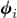

# 11.3.1 向模型引入几何缺陷

**产品：** Abaqus/Standard  Abaqus/Explicit

##### **参考文献**

- ["不稳定坍塌和后屈曲分析," 第 6.2.4 节"](pt03ch06s02at03.md)
- [*IMPERFECTION](../key/key-link.md#usb-kws-mimperfection)

### 概述

几何缺陷模式：
- 通常在模型中引入用于后屈曲载荷-位移分析；
- 可以定义为从之前使用 Abaqus/Standard 进行的特征值屈曲预测或特征频率提取分析获得的屈曲特征模态的线性叠加；
- 可以基于之前使用 Abaqus/Standard 进行的静态分析获得的结果；或者
- 可以直接指定。

### 一般后屈曲分析

在 Abaqus/Standard 中，Riks 方法（["不稳定坍塌和后屈曲分析," 第 6.2.4 节"](pt03ch06s02at03.md)）可用于求解后屈曲问题，包括稳定和不稳定的后屈曲行为。然而，由于在屈曲点处的不连续响应（分叉），通常无法直接分析精确的后屈曲问题。要分析后屈曲问题，必须将其转化为具有连续响应的问题而不是分叉，这可以通过在"完美"几何中引入几何缺陷模式来实现，以便在达到临界载荷之前在屈曲模态中有一些响应。

### 引入几何缺陷

缺陷通常通过几何扰动引入。Abaqus 提供了三种定义缺陷的方法：作为屈曲特征模态的线性叠加、从静态分析的位移，或直接指定节点号和缺陷值。只有平移自由度被修改。然后 Abaqus 将基于扰动坐标使用通常的算法计算法线。除非缺陷的精确形状已知，否则可以引入由多个叠加屈曲模态组成的缺陷（["特征值屈曲预测," 第 6.2.3 节"](pt03ch06s02at02.md)）。

通常的方法涉及使用相同模型定义的两次分析运行，使用 Abaqus/Standard 建立可能的坍塌模态，并使用 Abaqus/Standard 或 Abaqus/Explicit 进行后屈曲分析：

1. 在第一次分析运行中，使用 Abaqus/Standard 对"完美"结构进行特征值屈曲分析，以建立可能的坍塌模态并验证网格精确地离散化了这些模态。将特征模态以默认全局系统写入结果文件作为节点数据（["输出到数据和结果文件," 第 4.1.2 节"](pt02ch04s01aus39.md)）。
2. 在第二次分析运行中，使用 Abaqus/Standard 或 Abaqus/Explicit 通过将这些屈曲模态添加到"完美"几何中来引入几何缺陷。通常假设最低屈曲模态提供最关键的缺陷，因此通常将这些模态缩放并添加到完美几何中以创建扰动网格。因此，缺陷的形式为 ，其中  是  模态形状， 是相关的比例因子。您必须选择各种模态的比例因子；通常（如果结构对缺陷不敏感）最低屈曲模态应具有最大的因子。使用的扰动幅度通常是相对结构尺寸的几个百分点，例如梁截面或壳厚度。
3. 使用 Abaqus/Standard 或 Abaqus/Explicit 进行后屈曲分析。- 在 Abaqus/Standard 中，使用 Riks 方法对包含缺陷的结构进行几何非线性载荷-位移分析。通过这种方式，Riks 方法可用于对"刚性"结构进行后屈曲分析，如果完美的话，这些结构在屈曲之前表现出线性行为。通过执行载荷-位移分析，可以包括其他重要的非线性效应，如材料非弹性或接触。- 在 Abaqus/Explicit 中对扰动结构进行后屈曲分析。

Abaqus 通过用户节点标签导入缺陷数据。Abaqus 不检查两次分析运行之间的模型兼容性。原始模型和带缺陷模型的节点集定义可能不同。对于 Abaqus 生成附加节点的模型（例如，为 20 节点砖单元上的接触面生成的节点），必须小心。在这种情况下，您必须确保两次分析运行的模型相同，并且为生成节点写入结果文件。

如果模型是用部件实例的装配体定义的，则需要原始分析的部件（`.prt`）文件来从结果文件读取特征模态。原始模型和后续模型都必须用部件实例的装配体一致地定义。

#### 基于特征模态数据定义缺陷

要基于加权模态形状的叠加定义缺陷，请指定之前特征频率提取或特征值屈曲预测分析的结果文件和步骤。可选地，您可以为指定节点集导入特征模态数据。

| **输入文件用法：** | ``` [*IMPERFECTION](../key/key-link.md#usb-kws-mimperfection), FILE=*results_file*, STEP=*step*, NSET=*name* ``` |
| --- | --- |

#### 基于静态分析数据定义缺陷

要基于之前静态分析（["不稳定坍塌和后屈曲分析," 第 6.2.4 节"](pt03ch06s02at03.md)）的变形几何定义缺陷，请指定之前静态分析的结果文件、步骤和（可选）增量号。（如果未指定增量号，Abaqus 将从结果文件中指定步骤的最后一个可用增量读取数据。）可选地，您可以为指定节点集导入模态数据。

| **输入文件用法：** | ``` [*IMPERFECTION](../key/key-link.md#usb-kws-mimperfection), FILE=*results_file*, STEP=*step*, INC=*inc*, NSET=*name* ``` |
| --- | --- |

#### 直接定义缺陷

您可以直接在全局坐标系中或可选地在圆柱或球坐标系中将缺陷指定为节点号和坐标扰动表。或者，您可以从单独的输入文件读取缺陷数据。

| **输入文件用法：** | ``` [*IMPERFECTION](../key/key-link.md#usb-kws-mimperfection), SYSTEM=*name*, INPUT=*input file* ``` |
| --- | --- |
|  | 如果未指定输入文件，Abaqus 假定数据跟随在此选项之后。 |

### 缺陷敏感性

某些结构的响应很大程度上取决于原始几何中的缺陷，特别是如果屈曲模态在屈曲发生后相互作用的话。因此，基于单个屈曲模态的缺陷往往会产生非保守结果。通过调整各种屈曲模态的比例因子的大小，可以评估结构对缺陷的敏感性。通常，应进行多次分析以研究结构对缺陷的敏感性。具有许多紧密间隔特征模态的结构往往对缺陷敏感，而对应于最低特征值的特征模态形状的缺陷可能不会给出最坏情况。

如果缺陷较大，不完美的结构将更容易分析。如果缺陷很小，则在临界载荷之下变形将相当小（相对于缺陷）。响应将在临界载荷附近快速生长，引入行为的快速变化。

另一方面，如果缺陷很大，后屈曲响应将在达到临界载荷之前稳步增长。在这种情况下，过渡到后屈曲行为将是平滑的，相对容易分析。

### 输入文件模板

以下示例说明了对具有由屈曲特征模态线性叠加定义的缺陷的结构进行后屈曲分析，涉及使用相同模型定义的两次分析运行。

初始分析运行使用 Abaqus/Standard 进行特征值屈曲分析，以建立可能的坍塌模态并将其写入结果文件。

```
[*HEADING](../key/key-link.md#usb-kws-mheading)
*初始分析运行，将屈曲模态写入结果文件*
[*NODE](../key/key-link.md#usb-kws-mnode)
*数据行定义初始"完美"几何*
…
**
[*STEP](../key/key-link.md#usb-kws-hstep)
[*BUCKLE](../key/key-link.md#usb-kws-hbuckle)
*数据行定义屈曲特征模态数量*
[*CLOAD](../key/key-link.md#usb-kws-hcload) 和/或 [*DLOAD](../key/key-link.md#usb-kws-hdload) 和/或 [*DSLOAD](../key/key-link.md#usb-kws-hdsload) 和/或 [*TEMPERATURE](../key/key-link.md#usb-kws-htemperature)
*数据行指定参考载荷* 
[*NODE FILE](../key/key-link.md#usb-kws-hnodefile), GLOBAL=YES, LAST MODE=*n*
U
[*END STEP](../key/key-link.md#usb-kws-hendstep)
```

第二次分析运行引入缺陷并使用修正的 Riks 方法在 Abaqus/Standard 中进行后屈曲分析。

```
[*HEADING](../key/key-link.md#usb-kws-mheading)
*第二次分析运行，定义缺陷并进行后屈曲分析*
[*NODE](../key/key-link.md#usb-kws-mnode)
*数据行定义初始"完美"几何*
…
[*IMPERFECTION](../key/key-link.md#usb-kws-mimperfection), FILE=*results_file*, STEP=*step*
*数据行指定模态号及其相关比例因子*
…
**
[*STEP](../key/key-link.md#usb-kws-hstep), NLGEOM
[*STATIC](../key/key-link.md#usb-kws-hstatic), RIKS
*数据行定义增量化和停止标准*
[*CLOAD](../key/key-link.md#usb-kws-hcload) 和/或 [*DLOAD](../key/key-link.md#usb-kws-hdload) 和/或 [*DSLOAD](../key/key-link.md#usb-kws-hdsload) 和/或 [*TEMPERATURE](../key/key-link.md#usb-kws-htemperature)
*数据行指定参考载荷* 
[*END STEP](../key/key-link.md#usb-kws-hendstep)
```

替代的第二次分析运行引入缺陷并使用 Abaqus/Explicit 进行后屈曲分析。

```
[*HEADING](../key/key-link.md#usb-kws-mheading)
*第二次分析运行，定义缺陷并进行后屈曲分析*
[*NODE](../key/key-link.md#usb-kws-mnode)
*数据行定义初始"完美"几何*
…
[*IMPERFECTION](../key/key-link.md#usb-kws-mimperfection), FILE=*results_file*, STEP=*step*
*数据行指定模态号及其相关比例因子*
…
**
[*STEP](../key/key-link.md#usb-kws-hstep)
[*DYNAMIC](../key/key-link.md#usb-kws-hdynamic), EXPLICIT
*数据行定义步骤的时间周期。*
[*CLOAD](../key/key-link.md#usb-kws-hcload) 和/或 [*DLOAD](../key/key-link.md#usb-kws-hdload) 和/或 [*DSLOAD](../key/key-link.md#usb-kws-hdsload) 和/或 [*TEMPERATURE](../key/key-link.md#usb-kws-htemperature)
[*END STEP](../key/key-link.md#usb-kws-hendstep)
```
