# 11.4.2 轮廓积分评估

**产品：** Abaqus/Standard  Abaqus/CAE

##### **参考文献**

- ["断裂力学：概述," 第 11.4.1 节"](pt04ch11s04abo13.md)
- [*CONTOUR INTEGRAL](../key/key-link.md#usb-kws-hcontintegral)
- ["使用轮廓积分对断裂力学建模," Abaqus/CAE 用户指南第 31.2 节](../usi/usi-link.md#usi-eng-crack)

### 概述

Abaqus/Standard 提供基于常规有限元方法或扩展有限元方法（XFEM，参见 ["使用扩展有限元方法将不连续性建模为富集特征," 第 10.7.1 节"](pt04ch10s07at36.md)）进行断裂力学研究的多种参数评估：
- *J* 积分，被广泛接受为准静态断裂力学参数，用于线性材料响应，对于非线性材料响应有局限性；
- 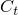 积分，在准静态步骤（["准静态分析," 第 6.2.5 节"](pt03ch06s02at04.md)）中与时间相关蠕变行为（["率相关塑性：蠕变和肿胀," 第 23.2.4 节"](pt05ch23s02abm20.md)）背景下与 *J* 积分具有等价作用；
- 应力强度因子，用于线性弹性断裂力学中测量局部裂纹尖端场的强度；
- 裂纹扩展方向——即预存裂纹将扩展的角度；以及
- *T* 应力，表示平行于裂纹面的应力，用作衡量 *J* 积分等参数对裂纹周围变形场描述有用程度的指标。

轮廓积分：
- 是输出量——它们不影响结果；
- 仅可在一般分析步骤中请求；
- 与常规有限元方法一起使用时，仅可用于二维四边形单元或三维砖单元；
- 与 XFEM 一起使用时，无需在裂纹尖端周围进行详细细化网格即可评估；以及
- 与 XFEM 一起使用时，目前仅适用于各向同性弹性材料的一阶或二阶四面体和一阶砖单元。

### 轮廓积分评估

Abaqus/Standard 提供两种不同的轮廓积分评估方法。第一种方法基于常规有限元方法，通常需要您使网格符合裂纹几何形状，明确界定裂纹前缘，并指定虚拟裂纹扩展方向。通常需要详细的集中网格，对于三维曲面上裂纹获得准确的轮廓积分结果可能相当麻烦。扩展有限元方法（XFEM）减轻了这些缺点。XFEM 不需要网格与裂纹几何形状匹配。裂纹的存在通过特殊的富集函数与附加自由度结合来确保。这种方法还取消了在评估轮廓积分时明确界定裂纹前缘或指定虚拟裂纹扩展方向的要求。轮廓积分所需的数据根据单元中节点的符号距离函数自动确定（参见 ["使用扩展有限元方法将不连续性建模为富集特征," 第 10.7.1 节"](pt04ch10s07at36.md)）。

可以在裂纹沿线的每个位置进行多次轮廓积分评估。在有限元模型中，每次评估都可以被认为是围绕裂纹尖端（二维）或围绕裂纹线上每个节点（三维）的材料块的虚拟运动。每个块由轮廓定义，其中每个轮廓是围绕裂纹尖端或从裂纹的一个面到相对裂纹面的裂纹线上节点的元素环。这些元素环被递归定义以围绕所有先前的轮廓。

Abaqus/Standard 自动从定义为裂纹尖端或裂纹线的区域中找到形成每个环的元素。每个轮廓提供轮廓积分的一次评估。可能的评估数量是此类元素环的数量。您必须指定用于计算轮廓积分的轮廓数。此外，您必须指定要计算的轮廓积分类型，如下所述。默认情况下，Abaqus/Standard 计算 *J* 积分。

您可以为裂纹指定一个名称，用于在数据文件和输出数据库文件中识别轮廓积分值。该名称也被 Abaqus/CAE 用于请求轮廓积分输出。如果您使用常规有限元方法且未指定裂纹名称，则默认情况下 Abaqus/Standard 生成遵循裂纹定义顺序的裂纹编号。如果您使用 XFEM，则必须将裂纹名称设置为分配给富集特征的名称。

| **输入文件用法：** | 使用以下选项通过常规有限元方法评估轮廓积分： |
| --- | --- |
|  | ``` [*CONTOUR INTEGRAL](../key/key-link.md#usb-kws-hcontintegral), CRACK NAME=*crack name*, CONTOURS=*n*, TYPE=*integral_type* ``` 使用以下选项通过 XFEM 评估轮廓积分： ``` [*CONTOUR INTEGRAL](../key/key-link.md#usb-kws-hcontintegral), CRACK NAME=*crack name*, XFEM, CONTOURS=*n*, TYPE=*integral_type* ``` |

| **Abaqus/CAE 用法：** | 交互模块：****Special****Crack****Create****: **Name:** *crack name*, **Type:** **Contour integral** 或 **XFEM**步骤模块：历史输出请求编辑器：**Domain: Crack**: *crack name*, **Number of contours:** *n*, **Type:** *integral_type* |
| --- | --- |

#### 域积分方法

利用散度定理，轮廓积分可以在围绕裂纹的有限域上扩展为二维中的面积积分或三维中的体积积分。域积分方法用于在 Abaqus/Standard 中评估轮廓积分。该方法非常稳健，因为即使使用相当粗糙的网格，通常也能获得准确的轮廓积分估计。该方法是稳健的，因为积分是在围绕裂纹的元素域上进行的，局部解参数的误差对 *J*、、应力强度因子和 *T* 应力等评估量的影响较小。

#### 请求多个轮廓积分

可以通过在步骤定义中根据需要重复轮廓积分请求来评估二维中多个不同裂纹尖端或三维中多个不同裂纹线上的轮廓积分。当您使用常规有限元方法时，必须为每个裂纹尖端或裂纹线指定裂纹前缘和虚拟裂纹扩展方向（或如果法线恒定，则为裂纹平面的法线），如下所述。当您使用 XFEM 时，您不需要指定裂纹前缘或虚拟裂纹扩展方向，因为它们将由 Abaqus/Standard 确定。但是，您必须将每个裂纹名称设置为对应的富集特征，每个富集特征只包含一条裂纹。此外，无论您是使用常规有限元方法还是 XFEM，您都必须为每个积分指定要计算的轮廓数。

### *J* 积分

*J* 积分通常用于与速率无关的准静态断裂分析，以表征与裂纹扩展相关的能量释放。如果材料响应是线性的，它可以与应力强度因子相关。

*J* 积分根据与裂纹扩展相关的能量释放率定义。对于三维裂纹平面中的虚拟裂纹扩展 ，能量释放率由下式给出


其中  是沿围绕裂纹尖端或裂纹线的微小管状表面的面积元素， 是  的向外法线， 是虚拟裂纹扩展的局部方向。 由下式给出


对于弹性材料行为，*W* 是弹性应变能；对于弹塑性或弹粘塑性材料行为，*W* 定义为弹性应变能密度加上塑性耗散，从而表示"等效弹性材料"中的应变能。因此计算的 *J* 积分仅适用于弹塑性材料的单调加载。

| **输入文件用法：** | ``` [*CONTOUR INTEGRAL](../key/key-link.md#usb-kws-hcontintegral), CONTOURS=*n*, TYPE=J ``` |
| --- | --- |

| **Abaqus/CAE 用法：** | 步骤模块：历史输出请求编辑器：**Domain: Crack**: *crack name*, **Number of contours:** *n*, **Type: J-integral** |
| --- | --- |

#### 域依赖性

*J* 积分应该与所使用的域无关，前提是裂纹面彼此平行，但来自不同环的 *J* 积分估计可能因有限元解的近似性质而不同。这些估计值的强烈变化（通常称为域依赖性或轮廓依赖性）通常表示轮廓积分定义中存在错误。这些估计值的逐渐变化可能表示需要更细的网格，或者如果包括塑性，则轮廓积分域未完全包含塑性区。如果"等效弹性材料"不是弹塑性材料的良好表示，则轮廓积分仅在完全包含塑性区时才是域无关的。由于在三维中并不总是能够将塑性区包含在内，更细的网格可能是唯一的解决方案。

如果第一个轮廓积分是通过指定裂纹尖端的节点定义的，则前几个轮廓可能不准确。要检查这些轮廓的准确性，您可以请求更多轮廓，并确定轮廓积分的值，该值在从一个轮廓到下一个轮廓时近似恒定。不近似等于此常数的轮廓积分值应被丢弃。在线性弹性问题中，第一和第二个轮廓通常应作为不准确而忽略。

对于某些具有开放裂纹前缘的三维模型，*J* 积分估计可能在裂纹前缘末端的节点集（或对于 XFEM 的情况为单元）处不准确。最外层元素的偏斜加剧了分辨率困难。这种精度损失仅局限于前缘末端的轮廓积分，对沿裂纹前缘相邻节点集（或对于 XFEM 的情况为单元）的轮廓积分值的准确性没有影响。

#### 在 *J* 积分评估中包括残余应力场的影响

残余应力场经常发生在结构中；例如，作为产生塑性的服务载荷、在没有退火处理的情况下进行金属成型工艺、热效应或肿胀效应的结果。当残余应力显著时，上述 *J* 积分的标准定义可能导致路径相关值。为确保其路径无关性，*J* 积分评估必须包括一个考虑残余应力场的附加项。在 Abaqus/Standard 中，具有残余应力场的问题被作为初始应变问题处理。如果总应变写成机械应变 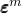 和初始应变  的和；即

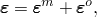

在残余应力场存在的情况下，路径无关的能量释放率由下式给出


其中 *V* 是围绕裂纹尖端或裂纹线的域体积，*W* 仅定义为机械应变能密度，


 在整个变形过程中保持恒定。

残余应力场可以通过从先前的分析步骤读取应力数据来指定，也可以通过定义初始条件来指定（参见 ["定义初始应力"中的"Abaqus/Standard 和 Abaqus/Explicit 中的初始条件," 第 34.2.1 节"](pt07ch34s02aus116.md#usb-prc-pinitialcond-stress)）。您指定步骤号，从该步骤的最后一个可用增量中的应力数据将被视为残余应力。如果步骤号设置为零（默认），则残余应力场由初始条件定义。使用 XFEM 时，残余应力场只能通过初始条件定义。

| **输入文件用法：** | ``` [*CONTOUR INTEGRAL](../key/key-link.md#usb-kws-hcontintegral), RESIDUAL STRESS STEP=*n*, TYPE=J ``` |
| --- | --- |

| **Abaqus/CAE 用法：** | 步骤模块：历史输出请求编辑器：**Domain: Crack**: *crack name*, **Number of contours:** *n*, **Step for residual stress initialization values:** *step*, **Type: J-integral** |
| --- | --- |

### *Ct* 积分

*Ct* 积分支持常规有限元方法；但不支持 XFEM。

 积分可用于与时间相关的蠕变行为，其中它表征特定蠕变条件下蠕变裂纹变形，包括瞬态裂纹扩展。例如， 与小规模蠕变条件下静止裂纹的裂纹尖端/裂纹线蠕变区扩展速率成正比。在稳态蠕变条件下，当蠕变主导整个标本时， 变得路径无关，被称为 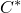。 积分仅应在准静态步骤中请求。

 积分是通过在 *J* 积分展开中将位移替换为速度，将应变能密度替换为应变能率密度而获得的。应变能率密度定义为

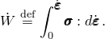

如果多个变形机制对应变率有贡献，则  不是唯一定义的。然而，蠕变机制将在围绕裂纹尖端或裂纹线的区域内占主导地位，因此  的弹性和塑性贡献可以忽略。该区域的大小取决于蠕变松弛的程度：该区域最初很小，但最终在达到稳态蠕变时覆盖整个标本。Abaqus/Standard 仅在  的计算中考虑蠕变。忽略弹性和塑性应变率，Abaqus/Standard 中具有时间硬化形式的幂律蠕变模型的应变能密度为


其中 *n* 是幂律指数，*q* 是等效 Mises 应力，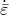 是等效单轴应变率。

对于双曲正弦定律， 的解析表达式不可用。对于这个定律， 通过数值积分获得；五点高斯求积方案在现实蠕变应变率范围内给出合理的精度。

域积分方法用于  积分，如上所述用于 *J* 积分。

对于用户定义的蠕变定律，应变能率密度必须在用户子程序 [`CREEP`](../sub/sub-link.md#sub-xsl-creep) 中定义。

| **输入文件用法：** | ``` [*CONTOUR INTEGRAL](../key/key-link.md#usb-kws-hcontintegral), CONTOURS=*n*, TYPE=C ``` |
| --- | --- |

| **Abaqus/CAE 用法：** | 步骤模块：历史输出请求编辑器：**Domain: Crack**: *crack name*, **Number of contours:** *n*, **Type: Ct-integral** |
| --- | --- |

#### 域依赖性

在稳态之前， 积分估计将表现出域依赖性，即使有限元网格足够细化，这是由于域内蠕变主导的假设。这些  估计应外推到零半径，以获得对应于收缩到裂纹尖端或裂纹线的轮廓的改进  估计（参见 ["*Ct* 积分评估," Abaqus 基准指南第 1.16.6 节](../bmk/bmk-link.md#bmk-anl-ctintegral)）。

#### 在  积分评估中包括残余应力场的影响

在计算  积分时，包括一个附加项来考虑残余应力场，如 ["在 *J* 积分评估中包括残余应力场的影响"](pt04ch11s04aus68.md#usb-anl-acontintegral-jintegral-stressfield) 中所述。

| **输入文件用法：** | ``` [*CONTOUR INTEGRAL](../key/key-link.md#usb-kws-hcontintegral), RESIDUAL STRESS STEP=*n*, TYPE=C ``` |
| --- | --- |

| **Abaqus/CAE 用法：** | 步骤模块：历史输出请求编辑器：**Domain: Crack**: *crack name*, **Number of contours:** *n*, **Step for residual stress initialization values:** *step*, **Type: Ct-integral** |
| --- | --- |

### 应力强度因子

应力强度因子 、 和  通常用于线性弹性断裂力学，以表征局部裂纹尖端/裂纹线应力场和位移场。它们通过以下方式与能量释放率（*J* 积分）相关


其中  是应力强度因子， 称为前对数能量因子矩阵。对于均匀、各向同性材料， 是对角的，上述方程简化为


其中平面应力为 ，平面应变、轴对称和三维为 。对于两种不同各向同性材料之间的界面裂纹，

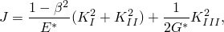

其中


 用于平面应变、轴对称和三维；平面应力为 。与均匀材料中的类似物不同， 和  不再是界面裂纹的纯 Mode I 和 Mode II 应力强度因子。它们只是复应力强度因子的实部和虚部。

虽然在 Abaqus/Standard 中直接计算能量释放率，但从已知 *J* 积分计算混合模式问题的应力强度因子通常并不简单。Abaqus/Standard 提供交互积分方法，直接计算混合模式加载下裂纹的应力强度因子。此功能可用于线性各向同性和各向异性材料。该理论在 ["应力强度因子提取," Abaqus 理论指南第 2.16.2 节](../stm/stm-link.md#stm-anl-stressintfact) 中有详细描述。

在这种情况下，从应力强度因子计算的 *J* 积分也将输出。由于用于计算的不同算法，这些 *J* 积分值可能与通过直接请求 *J* 积分估计的值略有不同。

| **输入文件用法：** | ``` [*CONTOUR INTEGRAL](../key/key-link.md#usb-kws-hcontintegral), CONTOURS=*n*, TYPE=K FACTORS ``` |
| --- | --- |

| **Abaqus/CAE 用法：** | 步骤模块：历史输出请求编辑器：**Domain: Crack**: *crack name*, **Number of contours:** *n*, **Type: Stress intensity factors** |
| --- | --- |

#### 域依赖性

应力强度因子与 *J* 积分具有相同的域依赖性特征。

#### 在应力强度因子评估中包括残余应力场的影响

在计算应力强度因子时，包括一个附加项来考虑残余应力场，如 ["在 *J* 积分评估中包括残余应力场的影响"](pt04ch11s04aus68.md#usb-anl-acontintegral-jintegral-stressfield) 中所述。

| **输入文件用法：** | ``` [*CONTOUR INTEGRAL](../key/key-link.md#usb-kws-hcontintegral), RESIDUAL STRESS STEP=*n*, TYPE=K FACTORS ``` |
| --- | --- |

| **Abaqus/CAE 用法：** | 步骤模块：历史输出请求编辑器：**Domain: Crack**: *crack name*, **Number of contours:** *n*, **Step for residual stress initialization values:** *step*, **Type: Stress intensity factors** |
| --- | --- |

#### 裂纹扩展方向

对于均匀、各向同性弹性材料，开裂方向可以使用以下三个准则之一计算：最大切向应力准则、最大能量释放率准则或 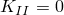 准则。 不在任何这些准则中考虑。

##### 最大切向应力准则

使用条件 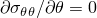 或 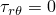（其中 *r* 和 是以裂纹尖端为中心并垂直于裂纹线的平面中的极坐标），我们可以得到


其中裂纹扩展角  是相对于裂纹平面测量的，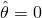 表示"直向前"方向中的裂纹扩展。如果 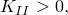 则 ，而如果  则 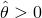。裂纹扩展角从  到  测量；即，它是从  在图 11.4.2-1 中围绕方向 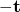 或从  逆时针测量。

裂纹扩展角  将被输出。

| **输入文件用法：** | ``` [*CONTOUR INTEGRAL](../key/key-link.md#usb-kws-hcontintegral), CONTOURS=*n*, TYPE=K FACTORS, DIRECTION=MTS ``` |
| --- | --- |

| **Abaqus/CAE 用法：** | 步骤模块：历史输出请求编辑器：**Domain: Crack**: *crack name*, **Number of contours:** *n*, **Type: Stress intensity factors**, **Crack initiation criterion: Maximum tangential stress** |
| --- | --- |

##### 最大能量释放率准则

该准则假定裂纹最初沿最大化能量释放率的方向扩展。

裂纹扩展角  将被输出。

| **输入文件用法：** | ``` [*CONTOUR INTEGRAL](../key/key-link.md#usb-kws-hcontintegral), CONTOURS=*n*, TYPE=K FACTORS, DIRECTION=MERR ``` |
| --- | --- |

| **Abaqus/CAE 用法：** | 步骤模块：历史输出请求编辑器：**Domain: Crack**: *crack name*, **Number of contours:** *n*, **Type: Stress intensity factors**, **Crack initiation criterion: Maximum energy release rate** |
| --- | --- |

##### *KII = 0* 准则

该准则假定裂纹最初沿使  的方向扩展。

裂纹扩展角  将被输出。

| **输入文件用法：** | ``` [*CONTOUR INTEGRAL](../key/key-link.md#usb-kws-hcontintegral), CONTOURS=*n*, TYPE=K FACTORS, DIRECTION=KII0 ``` |
| --- | --- |

| **Abaqus/CAE 用法：** | 步骤模块：历史输出请求编辑器：**Domain: Crack**: *crack name*, **Number of contours:** *n*, **Type: Stress intensity factors**, **Crack initiation criterion: K11=0** |
| --- | --- |

### *T* 应力

*T* 应力分量表示裂纹尖端处平行于裂纹面的应力。其大小不仅会改变塑性区的大小和形状，还会改变裂纹前方应力三轴度。因此，它是衡量裂纹尖端奇异性强度（如 *J* 积分或应力强度因子）在特定加载下描述裂纹是否有用的有用指标。在线性弹性分析中，*T* 应力应使用等于弹塑性分析中载荷的载荷计算。有关详细信息，请参见 ["*T* 应力提取," Abaqus 理论指南第 2.16.3 节](../stm/stm-link.md#stm-anl-tstress)。

| **输入文件用法：** | ``` [*CONTOUR INTEGRAL](../key/key-link.md#usb-kws-hcontintegral), CONTOURS=*n*, TYPE=T-STRESS ``` |
| --- | --- |

| **Abaqus/CAE 用法：** | 步骤模块：历史输出请求编辑器：**Domain: Crack**: *crack name*, **Number of contours:** *n*, **Type: T-stress** |
| --- | --- |

#### 域依赖性

一般来说，*T* 应力比 *J* 积分和应力强度因子具有更大的域依赖性或轮廓依赖性。数值测试表明，来自裂纹尖端或裂纹线邻接的前两个元素环的估计通常不能提供准确的结果。应选择从裂纹尖端或裂纹线延伸的足够多的轮廓，以便可以确定 *T* 应力在工程精度内与轮廓数量无关。特别是对于轴对称模型，裂纹尖端越接近对称轴，为实现轮廓积分的路径无关，域中的网格就应该越细化。

#### 在 *T* 应力评估中包括残余应力场的影响

在计算 *T* 应力时，包括一个附加项来考虑残余应力场，如 ["在 *J* 积分评估中包括残余应力场的影响"](pt04ch11s04aus68.md#usb-anl-acontintegral-jintegral-stressfield) 中所述。

| **输入文件用法：** | ``` [*CONTOUR INTEGRAL](../key/key-link.md#usb-kws-hcontintegral), RESIDUAL STRESS STEP=*n*, TYPE=T-STRESS ``` |
| --- | --- |

| **Abaqus/CAE 用法：** | 步骤模块：历史输出请求编辑器：**Domain: Crack**: *crack name*, **Number of contours:** *n*, **Step for residual stress initialization values:** *step*, **Type: T-stress** |
| --- | --- |

### 使用常规有限元方法定义轮廓积分所需的数据

要使用常规有限元方法请求轮廓积分输出，您必须定义裂纹前缘并指定虚拟裂纹扩展方向。

#### 定义裂纹前缘

您必须指定裂纹前缘；即定义第一个轮廓的区域。Abaqus/Standard 使用此区域和围绕它的一层元素来计算第一个轮廓积分。使用附加元素层来计算每个后续轮廓。

裂纹前缘可以等同于二维中的裂纹尖端或三维中的裂纹线；或者可以是围绕裂纹尖端或裂纹线的更大区域，在这种情况下，它必须包括裂纹尖端或裂纹线。

如果建模了钝化裂纹尖端，裂纹前缘应包括从裂纹面到裂纹尖端（如果钝化尖端的半径减小到零）的所有节点，这些节点将塌缩到裂纹尖端。否则，轮廓积分值将取决于路径，直到轮廓区域到达平行裂纹面。

| **输入文件用法：** | ``` [*CONTOUR INTEGRAL](../key/key-link.md#usb-kws-hcontintegral), CONTOURS=*n* *在数据行上指定裂纹前缘节点集名称；格式取决于用于指定虚拟裂纹扩展方向的方法。* ``` |
| --- | --- |
|  | 对于二维情况，只需指定一个裂纹前缘节点集（裂纹尖端的裂纹前缘）。对于三维情况，您必须重复数据行以按顺序指定从裂纹一端到另一端的裂纹线上每个节点（或聚焦节点簇）的裂纹前缘，包括二阶单元的边中节点；不允许跳过裂纹线上的节点。 |

| **Abaqus/CAE 用法：** | 交互模块：****Special****Crack****Create****: 选择裂纹前缘 |
| --- | --- |

##### 定义裂纹尖端或裂纹线

默认情况下，Abaqus/Standard 将第一个指定的节点定义为裂纹尖端，将第一个指定的节点序列定义为裂纹线。第一个节点是节点号最小的节点，除非节点集生成为未排序。或者，您可以直接指定裂纹尖端节点或裂纹线节点。此规范对于具有钝化裂纹尖端的三维裂纹至关重要。

Abaqus/CAE 无法根据指定的裂纹前缘自动确定裂纹尖端或裂纹线。但是，如果在二维中选择一个点来定义裂纹前缘，则同一个点定义裂纹尖端；同样，如果在三维中选择边来定义裂纹前缘，则相同的边定义裂纹线。对于所有其他情况，您必须直接定义裂纹尖端或裂纹线。

| **输入文件用法：** | 使用以下选项直接指定裂纹尖端节点： |
| --- | --- |
|  | ``` [*CONTOUR INTEGRAL](../key/key-link.md#usb-kws-hcontintegral), CONTOURS=*n*, CRACK TIP NODES *在数据行上指定裂纹前缘节点集名称和裂纹尖端节点号或节点集名称；格式取决于用于指定虚拟裂纹扩展方向的方法。* ``` 对于三维情况重复数据行。 |

| **Abaqus/CAE 用法：** | 交互模块：****Special****Crack****Create****: 选择裂纹前缘，然后选择裂纹尖端（二维）或裂纹线（三维） |
| --- | --- |

##### 定义闭合回路裂纹线

有时裂纹线可能形成闭合回路（例如，在不调用对称条件的情况下对全 penny 形裂纹建模时）。在这种情况下，可以有或没有缝隙创建裂纹尖端区域的有限元网格；即，可以使用或不使用线性约束方程（["线性约束方程," 第 35.2.1 节"](pt08ch35s02aus129.md)）或多点约束（["一般多点约束," 第 35.2.2 节"](pt08ch35s02aus130.md)）将两层节点绑定在一起。

如果裂纹线形成闭合回路，则裂纹前缘的起始节点集可以任意选择，其他定义裂纹前缘的节点集必须按顺序围绕裂纹前缘。定义裂纹前缘的最后一个节点集必须与第一个节点集相同。如果通过创建重合节点然后通过线性约束方程和多点约束绑定在一起来形成闭合回路，则必须从约束方程或多点约束涉及的节点集之一开始按顺序指定节点集，并以另一个节点集终止。

#### 指定虚拟裂纹扩展方向

您必须通过指定裂纹平面的法线  或虚拟裂纹扩展方向  和法线 ；对于二维裂纹，我们有  和 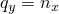。指定法线意味着裂纹平面是平的，因为每个轮廓积分只能给出一个  值。

**图 11.4.2-1** 断裂力学评估的典型集中网格。


| **输入文件用法：** | ``` [*CONTOUR INTEGRAL](../key/key-link.md#usb-kws-hcontintegral), CONTOURS=*n*, NORMAL *-方向余弦（或 ），-方向余弦（或 ），-方向余弦（或 blank）* *裂纹前缘节点集名称（二维）或名称（三维）* ``` |
| --- | --- |

| **Abaqus/CAE 用法：** | 交互模块：****Special****Crack****Create****: 选择裂纹前缘：**Specify crack extension direction using: Normal to crack plane** |
| --- | --- |

##### 指定虚拟裂纹扩展方向

或者，可以直接指定虚拟裂纹扩展方向 , CONTOURS=*n* *裂纹前缘节点集名称，-方向余弦（或 ），-方向余弦（或 ），-方向余弦（或 blank）* ``` |
| --- | --- |
|  | 对于三维情况重复数据行，以指定裂纹线上每个节点（或聚焦节点簇）的裂纹前缘和虚拟裂纹扩展向量。 |

| **Abaqus/CAE 用法：** | 交互模块：****Special****Crack****Create****: 选择裂纹前缘：**Specify crack extension direction using: q vectors** |
| --- | --- |

##### 定义表面法线

在裂纹前缘与三维实体的外表面相交、模型中存在材料不连续表面或裂纹位于弯曲壳中的情况下，虚拟裂纹扩展方向  和 ["带部分穿透裂纹的板：弹性线弹簧建模," Abaqus 示例问题指南第 1.4.1 节](../exa/exa-link.md#exa-sta-crackplate)），或使用节点坐标（第四至第六坐标）。如果未为裂纹表面和裂纹线末端的外部表面上的节点指定表面法线，Abaqus/Standard 将自动为这些节点计算法线，以纠正任何不充分的虚拟裂纹扩展方向 , CONTOURS=*n*, SYMM ``` |

| **Abaqus/CAE 用法：** | 交互模块：****Special****Crack****Create****: 选择裂纹前缘和裂纹尖端或裂纹线，并指定裂纹扩展方向：**General**: 切换开启 **On symmetry plane (half-crack model)** |
| --- | --- |

### 使用常规有限元方法为小应变分析构建断裂力学网格

锐裂纹（裂纹面在未变形配置中彼此重叠）通常使用小应变假设建模。如图 11.4.2-1 所示，通常应使用集中网格进行小应变断裂力学评估。然而，对于锐裂纹，应变场在裂纹尖端变得奇异。这个结果显然是对物理的近似；然而，大应变区非常局部化，大多数断裂力学问题可以仅使用小应变分析令人满意地解决。

裂纹尖端应变奇异性取决于所使用的材料模型。线性弹性、理想塑性和幂律硬化通常用于断裂力学分析。幂律硬化的形式为


其中  是等效总应变，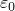 是参考应变， 是 Mises 应力，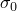 是初始屈服应力，*n* 是幂律硬化指数（通常在 3 到 8 范围内；对于大 ， 非常接近理想塑性）， 是材料常数（通常在 0.5 到 1.0 范围内）。

纯幂律非线性弹性材料在牵引载荷下的结果与载荷的某个幂成正比。因此，一个特定几何形状在某载荷下的断裂参数可以缩放到相同分布但不同大小的任何其他载荷。

如果加载是成比例的（应力空间中应力增加的方向近似恒定）且单调增加，幂律硬化变形塑性和增量塑性基本等价。然而，变形塑性是一种非线性弹性材料，有更多可用的解析结果。Abaqus 使用变形塑性的 Ramberg-Osgood 形式（参见 ["变形塑性," 第 23.2.13 节"](pt05ch23s02abm29.md)）；该模型不是纯幂律模型，必须考虑。

#### 创建奇异性

在大多数情况下，应考虑小应变分析中的裂纹尖端奇异性（当忽略几何非线性时）。包括奇异性通常会提高 *J* 积分、应力强度因子以及应力和应变计算的准确性，因为裂纹尖端附近区域的应力和应变更准确。如果 *r* 是距裂纹尖端的距离，则小应变分析中的应变奇异性为


#### 在二维中建模裂纹尖端奇异性

平方根和  奇异性可以使用标准单元构建到有限元网格中。裂纹尖端用一圈塌缩的四边形单元建模，如图 11.4.2-2 所示。

**图 11.4.2-2** 塌缩的二维单元。


为获得网格奇异性，通常使用二阶单元，元素塌缩如下：

1. 塌缩 8 节点等参数单元（例如 CPE8R）的一侧，使所有三个节点——*a*、*b* 和 *c*——具有相同的几何位置（在裂纹尖端）。
2. 将连接到裂纹尖端的边上的边中节点移动到最接近裂纹尖端的 1/4 点。当您为网格区域生成节点时，您可以使用二阶等参数单元创建"四分之一节点"间距；参见 ["创建四分之一节点间距"中的"节点定义," 第 2.1.1 节"](pt01ch02s01aus05.md#usb-int-inode-nfill-quarterpoint)。

此过程将创建应变奇异性

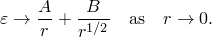

 奇异性无法使用 Abaqus 单元创建，但  和  项的组合可以为  提供合理的近似。

如果使用 4 节点等参数单元（例如 CPE4R），则单元的一侧塌缩，两个重合节点可以独立位移，创建  奇异性。

如果裂纹区域用线性单元网格划分，则忽略为边中节点指定的位置。

##### 创建平方根奇异性

如果节点 *a*、*b* 和 *c* 被约束一起移动，，应变和应力是平方根奇异的（适用于线性弹性）。

| **输入文件用法：** | ``` [*NFILL](../key/key-link.md#usb-kws-mnfill), SINGULAR ``` |
| --- | --- |
|  | 通过在形成单元的节点列表中指定相同的节点号，或使用线性约束方程或多点约束将塌缩节点绑定在一起，约束它们一起移动。 |

| **Abaqus/CAE 用法：** | 交互模块：****Special****Crack****Create****: 选择裂纹前缘和裂纹尖端，并指定裂纹扩展方向：**Singularity**: **Midside node parameter:** 0.25, **Collapsed element side, single node** |
| --- | --- |

##### 创建 *1/r* 奇异性

如果边中节点保持在边中点而不是移动到 1/4 点，并且节点 *a*、*b* 和 *c* 被允许独立移动，则仅创建应变中的  奇异性（适用于理想塑性）。

| **输入文件用法：** | ``` [*NFILL](../key/key-link.md#usb-kws-mnfill) ``` |
| --- | --- |

| **Abaqus/CAE 用法：** | 交互模块：****Special****Crack****Create****: 选择裂纹前缘和裂纹尖端，并指定裂纹扩展方向：**Singularity**: **Midside node parameter:** 0.5, **Collapsed element side, duplicate nodes** |
| --- | --- |

##### 创建组合平方根和 *1/r* 奇异性

如果将边中节点移动到 1/4 点，但允许节点 *a*、*b* 和 *c* 独立移动，则创建的奇异性是平方根和  奇异性的组合。这种组合通常最适合幂律硬化材料。然而，由于  奇异性占主导，将边中节点移动到 1/4 点只会比将节点留在边中点获得稍好的结果。由于创建将边中节点移动到四分之一节点的网格可能很困难，因此通常最好只使用  奇异性。

| **输入文件用法：** | ``` [*NFILL](../key/key-link.md#usb-kws-mnfill), SINGULAR ``` |
| --- | --- |

| **Abaqus/CAE 用法：** | 交互模块：****Special****Crack****Create****: 选择裂纹前缘和裂纹尖端，并指定裂纹扩展方向：**Singularity**: **Midside node parameter:** 0.25, **Collapsed element side, duplicate nodes** |
| --- | --- |

#### 在三维中建模裂纹尖端奇异性

为创建奇异场，20 节点砖和 27 节点砖可用于塌缩面（参见图 11.4.2-3）。

**图 11.4.2-3** 塌缩的三维单元。

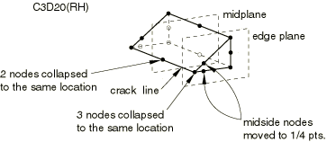

垂直于裂纹线的三维单元平面应为平面，以获得最佳精度。如果它们不是平面的，则当将边中节点移动到 1/4 点时，单元雅可比行列式可能在某些积分点变为负。为纠正此问题，将边中节点从 1/4 点稍微移向中点位置（移动的距离不关键）。

有关在 Abaqus/CAE 中创建三维断裂力学网格的信息，请参见 ["网格划分裂纹区域和分配单元," Abaqus/CAE 用户指南第 31.2.7 节](../usi/usi-link.md#usi-eng-conc-crack-meshing)。

##### 创建平方根奇异性

要获得平方根奇异性，约束塌缩面边缘平面上的节点一起移动，并将节点移动到 1/4 点。

如果塌缩 20 节点砖的中平面上的节点被约束一起移动，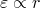；因此，中平面上的奇异性与边缘平面上的奇异性不相同。这种差异导致解在沿裂纹线的裂纹尖端周围产生局部振荡，尽管通常振荡不显著。

如果 27 节点砖包括所有面中节点和中心节点，并且边中和面中节点移动到最接近裂纹线的 1/4 点，则可以减少局部应力和应变场的振荡。

| **输入文件用法：** | ``` [*NFILL](../key/key-link.md#usb-kws-mnfill), SINGULAR ``` |
| --- | --- |
|  | 通过在形成单元的节点列表中指定相同的节点号，或使用线性约束方程或多点约束将塌缩节点绑定在一起，约束它们一起移动。 |

| **Abaqus/CAE 用法：** | 交互模块：****Special****Crack****Create****: 选择裂纹前缘和裂纹线，并指定裂纹扩展方向：**Singularity**: **Midside node parameter:** 0.25, **Collapsed element side, single node** |
| --- | --- |

##### 创建 *1/r* 奇异性

要获得  奇异性，允许塌缩面上的三个节点独立位移，并保持边中节点在中间点。

| **输入文件用法：** | ``` [*NFILL](../key/key-link.md#usb-kws-mnfill) ``` |
| --- | --- |

| **Abaqus/CAE 用法：** | 交互模块：****Special****Crack****Create****: 选择裂纹前缘和裂纹线，并指定裂纹扩展方向：**Singularity**: **Midside node parameter:** 0.5, **Collapsed element side, duplicate nodes** |
| --- | --- |

##### 创建组合平方根和 *1/r* 奇异性

要获得组合平方根和  奇异性，允许塌缩面上的节点独立位移，并将边中节点移动到 1/4 点。与二维情况一样，如果难以创建将节点移动到 1/4 点的网格，只需使用  奇异性。

| **输入文件用法：** | ``` [*NFILL](../key/key-link.md#usb-kws-mnfill), SINGULAR ``` |
| --- | --- |

| **Abaqus/CAE 用法：** | 交互模块：****Special****Crack****Create****: 选择裂纹前缘和裂纹线，并指定裂纹扩展方向：**Singularity**: **Midside node parameter:** 0.25, **Collapsed element side, duplicate nodes** |
| --- | --- |

#### 网格细化

裂纹尖端单元的尺寸影响解的准确性：距离裂纹尖端的单元径向尺寸越小，应力、应变等结果越好，因此轮廓积分计算越好。

角应变依赖性没有用奇异单元建模。如果裂纹尖端周围的典型单元所对的角在 10（准确）到 22.5（中等准确）范围内，则可以获得合理的结果。

由于裂纹尖端导致应力集中，当接近裂纹尖端时，应力和应变梯度很大。*J* 积分评估中的路径依赖性可能表示网格细化不够，但路径无关性不能证明网格收敛。必须在裂纹附近细化有限元网格以获得准确的应力和应变；然而，即使使用相对粗糙的网格，通常也可以获得准确的 *J* 积分结果。

在许多情况下，如果使用足够细的网格，即使不使用奇异单元也可以获得准确的轮廓积分值。

#### 在壳中建模裂纹尖端区域

可以使用集中网格，但 Abaqus/Standard 中的所有三维壳单元都不能塌缩。S8R 和 S8RT 单元不能退化为三角形；S4、S4R、S4R5、S8R5 和 S9R5 单元可以。

四分之一节点技术（将边中节点移动到四分之一点，以产生弹性断裂力学应用的  奇异性）可用于 S8R5 和 S9R5 单元，但不可用于 S8R(T) 单元。当将四分之一节点技术与 S9R5 单元一起使用时，面中节点应与两个边中节点一起移动到四分之一节点位置。

如果使用 S8R(T) 单元，应在裂纹尖端引入键孔。

位于壳厚度平面内的缺陷可以使用线弹簧单元建模；参见 ["用于建模壳中部分穿透裂纹的线弹簧单元," 第 32.9.1 节"](pt06ch32s09alm54.md)。在许多情况下，线弹簧单元提供准确的 *J* 积分和应力强度值，但这些单元仅限于建模小应变和旋转。线弹簧也允许有限的塑性建模。

### 使用常规有限元方法为大应变分析构建断裂力学网格

在大应变分析中（当包括几何非线性时），通常不应使用奇异单元。如果需要该区域的细节，网格必须足够细化以建模裂纹尖端周围非常高的应变梯度。即使只需要 *J* 积分，裂纹尖端周围的变形可能会主导解，并且必须用足够的细节对裂纹尖端区域进行建模以避免数值问题。

从物理上讲，裂纹尖端不是完全尖锐的。因此，它通常被建模为半径为  的钝化切口，其中  是裂纹尖端前方塑性区的特征尺寸。切口必须足够小，以至于在感兴趣的载荷下，切口的变形形状不再取决于原始几何形状。通常，切口必须钝化到其原始半径的四倍以上，变形形状才能独立于原始几何形状。切口周围单元的尺寸应为切口尖端半径的约 1/10，以获得准确的结果。

如果将裂纹建模为尖锐的，裂纹尖端附近的有限元可能无法近似高梯度，导致收敛问题。即使实现收敛，裂纹尖端周围的应力和应变结果可能也不准确。然而，如果解收敛，轮廓积分结果应该相当准确。在三维中，收敛困难可能比二维更大。

在涉及有限旋转但小应变的情况下，例如细长结构的弯曲，应在裂纹尖端周围建模一个小"键孔"。如果孔很小，结果不会受到显著影响，并且可以避免处理裂纹尖端的奇异应变问题。

### 使用常规有限元方法的约束

除非约束中涉及的节点位于同一点，否则不应在计算轮廓积分的网格区域中的节点上使用一般多点约束和线性约束方程（["运动约束：概述," 第 35.1.1 节"](pt08ch35s01abo32.md)）。集中网格裂纹尖端的节点可以使用多点约束绑定在一起，而不会对轮廓积分计算产生不利影响。绑定这些节点将改变裂纹尖端的奇异性，但将保持轮廓积分的路径无关性。此外，如果使用 MPC 类型 TIE 或线性约束方程将模型的两个面连接在一起，并且两个面的所有节点都重合，则轮廓积分的路径无关性不会受到影响。如果使用多点约束在轮廓积分区域内进行网格细化或应用对称/反对称边界条件，将导致轮廓积分的路径依赖性。如果违反此规则，不会提供任何警告或错误消息。

### 过程

您可以在使用以下过程建模的断裂力学问题中请求轮廓积分：
- 静态（["静态应力分析," 第 6.2.2 节"](pt03ch06s02at01.md)），XFEM 和常规有限元方法均可；
- 准静态（["准静态分析," 第 6.2.5 节"](pt03ch06s02at04.md)），仅限常规有限元方法；
- 稳态传输（["稳态传输分析," 第 6.4.1 节"](pt03ch06s04at17.md)），仅限常规有限元方法；
- 耦合热应力过程（["完全耦合热应力分析," 第 6.5.3 节"](pt03ch06s05at19.md)），仅限常规有限元方法；和
- 裂纹扩展（["裂纹扩展分析," 第 11.4.3 节"](pt04ch11s04aus69.md)），仅限常规有限元方法。

轮廓积分只能在一般分析步骤中请求：它们不在线性扰动分析中计算（["一般和线性扰动过程," 第 6.1.3 节"](pt03ch06s01aus44.md)）。

如果在步骤中包括几何非线性，则在裂纹表面施加压力的裂纹分析可能给出不准确的轮廓积分值。

### 载荷

轮廓积分计算包括以下分布载荷类型：
- 热载荷；
- 分布载荷，包括裂纹面压力和连续体单元上的牵引载荷，以及使用用户子程序 [`DLOAD`](../sub/sub-link.md#sub-xsl-dload) 和 [`UTRACLOAD`](../sub/sub-link.md#sub-xsl-utracload) 施加的载荷；
- 分布载荷，包括壳单元上的表面牵引载荷和裂纹面边缘载荷，以及使用用户子程序 [`UTRACLOAD`](../sub/sub-link.md#sub-xsl-utracload) 施加的载荷；
- 均匀和非均匀体力；和
- 连续体和壳单元上的离心载荷。

域中集中载荷对轮廓积分的贡献不包括在内；相反，必须修改网格以包括一个小单元，并必须将分布载荷施加到此单元。

接触力的贡献不包括在内。

### 材料选项

*J* 积分计算对线性弹性、非线性弹性和弹塑性材料有效。塑性行为可以建模为非线性弹性（["变形塑性," 第 23.2.13 节"](pt05ch23s02abm29.md)），但如果材料通过增量塑性建模并受到比例、单调牵引载荷，结果通常最好。

如果在裂纹尖端周围的塑性区发生了卸载，*J* 积分将无效，除非在非常有限的情况下。

 积分对涉及蠕变的问题有效（["率相关塑性：蠕变和肿胀," 第 23.2.4 节"](pt05ch23s02abm20.md)）。

应力强度因子计算对均匀线性弹性材料中的裂纹有效。它对两种不同各向同性线性弹性材料之间的界面裂纹也有效。它对任何其他类型的材料（包括用户定义的材料）无效。

裂纹扩展方向仅对均匀、各向同性线性弹性材料有效。

*T* 应力仅对均匀、各向同性线性弹性材料有效。虽然 *T* 应力使用带裂纹体的线性弹性材料属性计算，但它通常与使用带裂纹体弹塑性材料属性计算的 *J* 积分一起使用（参见 ["*T* 应力提取," Abaqus 理论指南第 2.16.3 节](../stm/stm-link.md#stm-anl-tstress)）。

如果有材料不连续，则必须为将位于轮廓积分域中的材料不连续线上的所有节点指定垂直于材料不连续线的法线。法线可以通过为不连续两侧的元素定义用户指定法线（参见 ["节点处的法线定义," 第 2.1.4 节"](pt01ch02s01aus08.md)），或使用不连续处节点的节点法线坐标来指定。对于具有穿过其尖端的材料不连续线的裂纹（两种不同材料之间的界面裂纹除外），无法执行轮廓积分计算。因此，在为裂纹尖端处的节点指定不垂直于虚拟裂纹扩展方向  的法线时，您应小心。

### 单元

当与 XFEM 一起使用时，轮廓积分只能在一次或二次四面体和一次砖单元中评估。以下段落仅适用于常规有限元方法。

Abaqus/Standard 中的轮廓积分评估能力假定用于计算的域中的元素在二维或壳模型中是四边形，在连续体三维模型中是砖块。三维中不应使用三角形、四面体或楔形单元在包含在轮廓积分区域中的网格中。当在 Abaqus/CAE 中生成裂纹尖端周围的元素时，二维中的三角形元素（或三维中的楔形元素）将转换为塌缩的四边形或六面体元素。轮廓域内的元素应为相同类型。

在壳结构中，Abaqus/Standard 计算的轮廓积分仅在裂纹尖端周围的变形模式主要是膜时才是轮廓无关的。如果域中存在显著的弯曲或横向剪切效应，轮廓积分可能不是轮廓无关的，应直接从位移和/或应力获取轮廓积分值。

广义平面应变单元、带扭曲的广义轴对称单元、非对称-轴对称单元、膜单元和圆柱单元不应在轮廓积分区域中使用。

钢筋的贡献仅在壳单元的 *J* 积分和  积分计算中包括，这些壳单元使用在分析期间集成的壳截面定义（参见 ["使用在分析期间集成的壳截面来定义截面行为," 第 29.6.5 节"](pt06ch29s06alm19.md)）。

### 输出

与每个轮廓关联的域是自动计算的。属于每个域的节点可以打印在数据文件中；参见 ["控制写入数据文件的分析输入文件处理器信息量"中的"输出," 第 4.1.1 节"](pt02ch04s01aus38.md#usb-out-ooutput-data-control)。如果您使用常规轮廓积分方法，对于每个域，Abaqus/Standard 会在输出数据库中创建一个新节点集以包含这些节点；您可以在 Abaqus/CAE 中查看这些节点集。此外，会在输出数据库中为裂纹表面上的节点和由 Abaqus/CAE 计算节点法线的自由表面上的节点创建新的节点集。

轮廓积分不能按照 ["输出," 第 4.1.1 节"](pt02ch04s01aus38.md) 中所述从重启文件恢复。

您不应请求二阶单元（其在二维中有一侧塌缩或在三维中有一面塌缩）的节点外推单元输出（["输出到数据和结果文件," 第 4.1.2 节"](pt02ch04s01aus39.md#usb-out-oprintfile-elementoutput)）。

#### 默认轮廓积分输出

默认情况下，轮廓积分值将写入数据文件和输出数据库文件。用于写入输出数据库的轮廓积分的命名约定如下：

```
*integral-type*: *abbrev-integral-type* at *history-output-request-name*_*crack-name*_*internal-crack-tip-node-set-name*__Contour_*contour-number*
```

其中 *integral-type* 可以是 - `Crack propagation direction (Cpd)`
- `J-integral (J)`
- `J-integral estimated from Ks (JKs)`
- `Stress intensity factor K1 (K1)`
- `Stress intensity factor K2 (K2)`
- `T-stress (T)`

例如，
```
J-integral: J at JINT_CRACK_CRACKTIP-1__Contour_1
```

#### 将轮廓积分写入结果文件

您可以选择将轮廓积分值写入结果文件以及数据文件。

| **输入文件用法：** | 使用以下选项将轮廓积分写入结果文件而不是数据文件： |
| --- | --- |
|  | ``` [*CONTOUR INTEGRAL](../key/key-link.md#usb-kws-hcontintegral), CONTOURS=*n*, OUTPUT=FILE ``` 使用以下选项将轮廓积分写入结果文件以及数据文件： ``` [*CONTOUR INTEGRAL](../key/key-link.md#usb-kws-hcontintegral), CONTOURS=*n*, OUTPUT=BOTH ``` |

| **Abaqus/CAE 用法：** | 您不能从 Abaqus/CAE 将轮廓积分写入结果文件。 |
| --- | --- |

#### 控制输出频率

您可以控制轮廓积分的输出频率（以增量为单位）。默认情况下，裂纹尖端位置和相关量将每增量打印一次。指定输出频率为 0 以禁止轮廓积分输出。

轮廓积分对输出数据库的历史输出频率由为输出数据库的历史输出指定的频率值（参见 ["输出到输出数据库," 第 4.1.3 节"](pt02ch04s01aus40.md)）和轮廓积分输出中的较大者控制。如果为输出数据库的历史输出指定输出频率为 0，则轮廓积分值将不会写入输出数据库。

| **输入文件用法：** | ``` [*CONTOUR INTEGRAL](../key/key-link.md#usb-kws-hcontintegral), CRACK NAME=*crack name*, CONTOURS=*n*, FREQUENCY=*f* ``` |
| --- | --- |

| **Abaqus/CAE 用法：** | 步骤模块：历史输出请求编辑器：**Domain: Crack**: *crack name*, **Number of contours:** *n*, **Save output at** |
| --- | --- |
