# 11.4.3 裂纹扩展分析

**产品：** Abaqus/Standard  Abaqus/Explicit  Abaqus/CAE

##### **参考文献**

- ["定义分析," 第 6.1.2 节"](pt03ch06s01abo05.md)
- ["断裂力学：概述," 第 11.4.1 节"](pt04ch11s04abo13.md)
- ["使用直接循环方法进行低周疲劳分析," 第 6.2.7 节"](pt03ch06s02at06.md)
- ["基于表面的内聚行为," 第 37.1.10 节"](pt09ch37s01alm63.md)
- [*COHESIVE BEHAVIOR](../key/key-link.md#usb-kws-mcohesivebehavior)
- [*CONTACT CLEARANCE](../key/key-link.md#usb-kws-hcontactclearance)
- [*DEBOND](../key/key-link.md#usb-kws-hdebond)
- [*DIRECT CYCLIC](../key/key-link.md#usb-kws-hdirectcyclic)
- [*FRACTURE CRITERION](../key/key-link.md#usb-kws-hfracturecriterion)
- [*NODAL ENERGY RATE](../key/key-link.md#usb-kws-mnodalenergyrate)
- ["在 Abaqus/Standard 分析中定义表面到表面接触"中的"定义表面到表面接触," Abaqus/CAE 用户指南第 15.13.7 节](../usi/usi-link.md#usi-itn-help-surftosurf-std)

### 概述

裂纹扩展分析：
- 在 Abaqus/Standard 中允许六种断裂准则——裂纹尖端前方一定距离处的临界应力、临界裂纹张开位移、裂纹长度与时间的关系、VCCT（虚拟裂纹闭合技术）、增强 VCCT 和基于 Paris 定律的低周疲劳准则；
- 在 Abaqus/Explicit 中允许 VCCT 断裂准则；
- 在 Abaqus/Standard 中对所有类型断裂准则进行二维（平面和轴对称）准静态裂纹扩展建模，对 VCCT、增强 VCCT 和低周疲劳准则进行三维（实体、壳和连续体壳）建模；和
- 在 Abaqus/Explicit 中对 VCCT 准则进行三维（实体、壳和连续体壳）裂纹扩展建模；和
- 要求您定义两条不同的初始绑定接触表面，裂纹将在它们之间扩展。

### 在 Abaqus/Standard 中定义初始绑定裂纹表面

潜在裂纹表面建模为从属和主接触表面（参见 ["在 Abaqus/Standard 中定义接触对," 第 36.3.1 节"](pt09ch36s03aus145.md)）。可以使用除有限滑动、表面到表面公式之外的任何接触公式。预定义裂纹表面假定为初始部分绑定，以便裂纹尖端可由 Abaqus/Standard 明确识别。初始绑定裂纹表面不能与自接触一起使用。

定义初始条件以识别裂纹的哪一部分是初始绑定的。您指定从属表面、主表面和一个节点集，该节点集标识从属表面上初始绑定的部分。从属表面的未绑定部分将表现为常规接触表面。必须指定从属表面或主表面；如果仅给出主表面，则与该主表面关联且在节点集中有节点的所有从属表面将在这些节点处绑定。

如果未指定节点集，初始接触条件将适用于整个接触对；在这种情况下，无法识别裂纹尖端，绑定表面无法分离。

如果指定了节点集，初始条件仅适用于节点集中的从属节点。Abaqus/Standard 检查以确保定义的节点集仅包括属于指定接触对的从属节点。

默认情况下，节点集中的节点被认为是全方向初始绑定的。

| **输入文件用法：** | ``` [*INITIAL CONDITIONS](../key/key-link.md#usb-kws-minitialcond), TYPE=CONTACT ``` |
| --- | --- |

| **Abaqus/CAE 用法：** | 交互模块：**创建交互**：**表面到表面接触 (Standard)** |
| --- | --- |

#### 仅在法向绑定

对于基于临界应力、临界裂纹张开位移或裂纹长度与时间关系的断裂准则，可以仅在法向上绑定节点集（或如果未定义节点集，则为接触对）中的节点。在这种情况下，允许节点沿接触表面切向自由移动。如果节点仅在法向上绑定，则不能指定摩擦（["摩擦行为," 第 37.1.5 节"](pt09ch37s01aus169.md)）。

仅在法向上绑定通常用于在 Mode I 裂纹问题中建模绑定接触条件，其中沿裂纹平面的裂纹前方剪切应力为零。

| **输入文件用法：** | ``` [*INITIAL CONDITIONS](../key/key-link.md#usb-kws-minitialcond), TYPE=CONTACT, NORMAL ``` |
| --- | --- |

| **Abaqus/CAE 用法：** | Abaqus/CAE 中不支持仅在法向上绑定。 |
| --- | --- |

### 在 Abaqus/Standard 中激活裂纹扩展能力

必须在步骤定义中激活裂纹扩展能力，以指定裂纹扩展可能在初始部分绑定的两个表面之间发生。您指定裂纹扩展所沿的表面。

如果未对部分绑定表面激活裂纹扩展能力，表面将不会分离；在这种情况下，指定的初始接触条件将产生与绑定接触能力相同的效果，绑定接触能力在整个人分析过程中在两个表面之间产生永久绑定（参见 ["在 Abaqus/Standard 中定义绑定接触," 第 36.3.7 节"](pt09ch36s03aus151.md)）。

| **输入文件用法：** | ``` [*DEBOND](../key/key-link.md#usb-kws-hdebond), SLAVE=*slave_surface_name*, MASTER=*master_surface_name* ``` |
| --- | --- |

| **Abaqus/CAE 用法：** | 交互模块：**创建交互**：**表面到表面接触 (Standard)**，选择主表面和从属表面 |
| --- | --- |

#### 多条裂纹的扩展

裂纹可以从单个裂纹尖端或多个裂纹尖端扩展。Abaqus/Standard 中的裂纹扩展能力要求表面初始部分绑定，以便可以识别裂纹尖端。一个接触对可以有多条裂纹从多个裂纹尖端扩展。但是，对于给定的接触对，只允许一种裂纹扩展准则。可以通过指定多个裂纹扩展定义来建模沿多个接触对的裂纹扩展。

### 在 Abaqus/Explicit 中定义和激活裂纹扩展

在 Abaqus/Explicit 中，潜在裂纹表面在基于表面内聚行为的背景下（参见 ["基于表面的内聚行为," 第 37.1.10 节"](pt09ch37s01alm63.md)）建模为绑定一般接触表面（参见 ["在 Abaqus/Explicit 中定义一般接触相互作用," 第 36.4.1 节"](pt09ch36s04aus155.md)）。因此，该功能仅在三维分析中可用，并使用纯主-从公式实现。与 Abaqus/Standard 中的情况一样，预定义裂纹表面假定为初始部分绑定，以便裂纹尖端可由 Abaqus/Standard 明确识别。

要识别哪对表面决定裂纹以及裂纹的哪一部分是初始绑定的，您必须定义和分配接触间隙（参见 ["在 Abaqus/Explicit 中控制一般接触的初始接触状态," 第 36.4.4 节"](pt09ch36s04aus158.md)）。您首先定义一个接触间隙以指定初始绑定的节点集，然后将此接触间隙分配给定义裂纹的一对单面表面。未绑定部分表现为常规接触表面。节点集中的节点被认为是全方向初始绑定的。

裂纹尖端仅从指定的两个表面和节点集识别。不会尝试从一般接触域中包含的所有表面确定裂纹尖端。因此，为了能够识别裂纹尖端，包含指定节点集的表面必须延伸到节点集之外。否则，表面将不会脱粘，裂纹无法扩展。

您通过定义基于断裂的内聚行为表面交互来完成裂纹扩展能力的定义。您通过将其分配给初始部分绑定的表面对来激活裂纹扩展。如果满足断裂准则，裂纹扩展发生在这两个表面之间。内聚行为也用于指定绑定的弹性行为（参见 ["基于表面的内聚行为," 第 37.1.10 节"](pt09ch37s01alm63.md)）。

如果未将基于断裂的表面交互分配给表面对，则裂纹定义不完整。与 Abaqus/Standard 不同，在 Abaqus/Standard 中，如果未激活裂纹，识别的节点将保持绑定，而在 Abaqus/Explicit 中，由接触间隙定义识别的节点将在不产生任何界面应力的情况下分离。

与 Abaqus/Standard 类似，对于同一对表面，裂纹可以从单个或多个裂纹尖端扩展。

| **输入文件用法：** | 使用以下选项： |
| --- | --- |
|  | ``` [*CONTACT CLEARANCE](../key/key-link.md#usb-kws-hcontactclearance), NAME=*clearance_name*, SEARCH NSET=*bonded_nset_name* ** [*SURFACE INTERACTION](../key/key-link.md#usb-kws-hsurfaceinteraction), NAME=*interaction_name* [*COHESIVE BEHAVIOR](../key/key-link.md#usb-kws-mcohesivebehavior) [*FRACTURE CRITERION](../key/key-link.md#usb-kws-hfracturecriterion) ..** [*CONTACT](../key/key-link.md#usb-kws-hcontact) [*CONTACT CLEARANCE ASSIGNMENT](../key/key-link.md#usb-kws-hcontclearassign) *slave_surface*, *master_surface*, *clearance_name* [*CONTACT PROPERTY ASSIGNMENT](../key/key-link.md#usb-kws-hcontpropassign) *slave_surface*, *master_surface*, *interaction_name* ``` |

| **Abaqus/CAE 用法：** | Abaqus/CAE 中不支持在 Abaqus/Explicit 中定义和激活裂纹扩展。 |
| --- | --- |

### 指定断裂准则

您可以指定裂纹扩展准则，如下所述。表 11.4.3-1 显示了 Abaqus/Standard 和 Abaqus/Explicit 支持哪些准则。即使存在多条裂纹，每个接触对也只允许一种裂纹扩展准则。

**表 11.4.3-1**
| 裂纹扩展准则 | Abaqus/Standard | Abaqus/Explicit |
| --- | --- | --- |
| 临界应力 | 是 | 否 |
| 临界裂纹张开位移 | 是 | 否 |
| 裂纹长度与时间 | 是 | 否 |
| VCCT | 是 | 是 |
| 增强 VCCT | 是 | 否 |
| 低周疲劳 | 是 | 否 |

裂纹扩展分析以节点为基础进行。当断裂准则 *f* 在给定容差内达到 1.0 时，裂纹尖端节点脱粘：

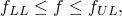

其中对于 VCCT、增强 VCCT 和低周疲劳准则， 和 ，或其他断裂准则为 。您可以指定容差 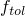。在 Abaqus/Standard 中，如果 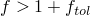，则时间增量被缩减，使得断裂准则得到满足，除非在不稳定裂纹扩展问题中，允许在单个增量中不缩减增量大小的情况下，多个节点在裂纹尖端处及前方脱粘。对于临界应力、临界裂纹张开位移和裂纹长度与时间准则， 的默认值是 0.1；对于 VCCT、增强 VCCT 和低周疲劳准则，默认值是 0.2。

| **输入文件用法：** | ``` [*FRACTURE CRITERION](../key/key-link.md#usb-kws-hfracturecriterion), TOLERANCE=, TYPE=*type* ``` |
| --- | --- |

| **Abaqus/CAE 用法：** | 交互模块：**创建交互属性**：**接触**，****Mechanical****Fracture Criterion****，**类型**：**VCCT** 或 **增强 VCCT**，**容差** |
| --- | --- |

#### 临界应力准则

此准则仅在 Abaqus/Standard 中可用。

如果您在裂纹尖端前方一定距离处指定临界应力准则，则当裂纹尖端前方指定距离处界面上的局部应力达到临界值时，裂纹尖端节点脱粘。

此准则通常用于脆性材料中的裂纹扩展。临界应力准则定义为

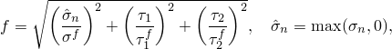

其中 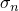 是在指定距离处跨界面携带的法向应力分量；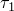 和  是界面上的剪切应力分量； 和  是您必须指定的法向和剪切失效应力。剪切失效应力的第二个分量  在二维分析中不相关；因此， 的值不必指定。当断裂准则 *f* 达到 1.0 时，裂纹尖端节点脱粘。

如果未给出  的值或指定为零，则将其视为非常大的数字，因此剪切应力对断裂准则没有影响。

裂纹尖端前方的距离沿从属表面测量，如图 11.4.3-1 所示。裂纹尖端前方指定距离处的应力通过插值相邻节点的值获得。插值取决于用于定义从属表面的是一阶还是二阶单元。

**图 11.4.3-1** 临界应力准则的距离规范。


| **输入文件用法：** | ``` [*FRACTURE CRITERION](../key/key-link.md#usb-kws-hfracturecriterion), TYPE=CRITICAL STRESS, DISTANCE=*n* ``` |
| --- | --- |

| **Abaqus/CAE 用法：** | Abaqus/CAE 中不支持临界应力准则。 |
| --- | --- |

#### 临界裂纹张开位移准则

此准则仅在 Abaqus/Standard 中可用。

如果您基于裂纹张开位移准则进行裂纹扩展分析，则当裂纹尖端后方指定距离处的裂纹张开位移达到临界值时，裂纹尖端节点脱粘。此准则通常用于延性材料中的裂纹扩展。

裂纹张开位移准则定义为

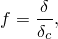

其中 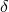 是裂纹张开位移的测量值， 是裂纹张开位移的临界值（用户指定）。当断裂准则达到 1.0 时，裂纹尖端节点脱粘。

您必须提供裂纹张开位移与累积裂纹长度的数据。在 Abaqus/Standard 中，累积裂纹长度定义为初始裂纹尖端与当前裂纹尖端之间沿当前配置中从属表面测量的距离。裂纹张开位移定义为在给定距离处分离裂纹两个面的法向距离。

您指定裂纹尖端后方计算临界裂纹张开位移的位置 *n*。此位置的值必须指定为连接当前裂纹尖端与从属表面和主表面上各点的直线长度（图 11.4.3-2）。

**图 11.4.3-2** 临界裂纹张开位移准则的距离规范。

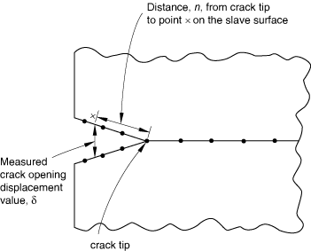

Abaqus/Standard 通过插值相邻节点的值来计算该点处的裂纹张开位移。插值取决于用于定义从属表面的是一阶还是二阶单元。如果 *n* 的值不在接触对的端点内，将发出错误消息。

| **输入文件用法：** | ``` [*FRACTURE CRITERION](../key/key-link.md#usb-kws-hfracturecriterion), TYPE=COD, DISTANCE=*n* ``` |
| --- | --- |

| **Abaqus/CAE 用法：** | Abaqus/CAE 中不支持临界裂纹张开位移准则。 |
| --- | --- |

##### 建模对称性

在脱粘表面位于对称平面上的问题中，您可以指定 Abaqus/Standard 仅考虑用户指定的裂纹张开位移值的一半。在这种情况下，初始绑定必须仅在法向上（参见上述 ["仅在法向上绑定"](pt04ch11s04aus69.md#usb-anl-acrackpropagation-initcond-normal)）。

| **输入文件用法：** | ``` [*FRACTURE CRITERION](../key/key-link.md#usb-kws-hfracturecriterion), TYPE=COD, DISTANCE=*n*, SYMMETRY ``` |
| --- | --- |

| **Abaqus/CAE 用法：** | Abaqus/CAE 中不支持建模对称性。 |
| --- | --- |

#### 裂纹长度与时间准则

此准则仅在 Abaqus/Standard 中可用。

要将裂纹扩展明确指定为总时间的函数，您必须提供裂纹长度与时间关系以及测量裂纹长度所依据的参考点。此参考点通过指定节点集来定义。Abaqus/Standard 找到集中节点当前位置的平均值以定义参考点。在裂纹扩展期间，裂纹长度沿变形配置中的从属表面从用户指定的参考点测量。指定的时间必须是总时间，而不是步骤时间。

断裂准则 *f* 根据用户指定的裂纹长度和当前裂纹尖端长度给出。当前裂纹尖端从参考点到裂纹尖端的长度测量为初始裂纹尖端从参考点的直线距离与初始裂纹尖端到当前裂纹尖端沿从属表面测量距离之和。

参考图 11.4.3-3，令节点 1 为裂纹尖端的初始位置，节点 3 为裂纹尖端的当前位置。位于节点 3 处的当前裂纹尖端距离由下式给出

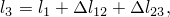

其中  是连接节点 1 和参考点的直线长度， 是节点 1 和 2 之间的距离，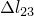 是沿从属表面测量的节点 2 和 3 之间的距离。

**图 11.4.3-3** 作为时间函数的裂纹扩展。

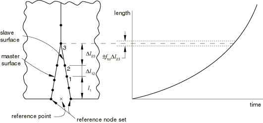

断裂准则 *f* 由下式给出

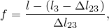

其中 *l* 是从用户指定的裂纹长度与时间曲线获得的当前时间的长度。当失效函数 *f* 达到 1.0（在用户定义的容差内）时，裂纹尖端节点 3 将脱粘。

如果在步骤中考虑了几何非线性（["定义分析," 第 6.1.2 节"](pt03ch06s01abo05.md)），参考点可能随着物体变形而移动；您必须确保此移动不会使裂纹长度与时间准则无效。

Abaqus/Standard 不会外推您的裂纹数据的端点之外。因此，如果指定的第一个裂纹长度大于从裂纹参考点到第一个绑定节点的距离，则第一个绑定节点永远不会脱粘，裂纹不会扩展。在这种情况下，Abaqus/Standard 将在消息（`.msg`）文件中打印警告消息。

| **输入文件用法：** | ``` [*FRACTURE CRITERION](../key/key-link.md#usb-kws-hfracturecriterion), TYPE=CRACK LENGTH, NSET=*name* ``` |
| --- | --- |

| **Abaqus/CAE 用法：** | Abaqus/CAE 中不支持裂纹长度与时间准则。 |
| --- | --- |

#### VCCT 准则

此准则在 Abaqus/Standard 和 Abaqus/Explicit 中均可用。

虚拟裂纹闭合技术（VCCT）准则使用线性弹性断裂力学（LEFM）原理，因此适用于沿预定义表面发生脆性裂纹扩展的问题。

VCCT 基于以下假设：当裂纹扩展一定量时释放的应变能与闭合相同量裂纹所需的能量相同。例如，图 11.4.3-4 说明了从 *i* 到 *j* 的裂纹扩展与在 *j* 处闭合裂纹之间的相似性。

**图 11.4.3-4** Mode I：当裂纹扩展一定量时释放的能量与闭合裂纹所需的能量相同。


在图 11.4.3-5 中，当


时，节点 2 和 5 将开始释放

其中 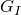 是 Mode I 能量释放率，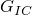 是临界 Mode I 能量释放率，*b* 是宽度，*d* 是裂纹前缘单元的长度，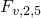 是节点 2 和 5 之间的垂直力， 是节点 1 和 6 之间的垂直位移。假设裂纹闭合由线性弹性行为控制，闭合裂纹（从而打开裂纹）的能量从上一个方程计算。可以在二维中对 Mode II 以及包括 Mode III 的三维裂纹表面写出类似的论证和方程。

**图 11.4.3-5** 纯 Mode I 修改。


在涉及 Mode I、II 和 III 的一般情况中，断裂准则定义为


其中 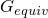 是在节点计算的等效应变能量释放率，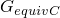 是根据用户指定的模式混合准则和界面结合强度计算的临界等效应变能量释放率。当断裂准则达到 1.0 时，裂纹尖端节点将脱粘。

Abaqus 提供了三种常见的模式混合公式用于计算 ：BK 定律、幂定律和 Reeder 定律模型。在任何给定分析中，模型的选择并不总是明确的；通常最好凭经验选择合适的模型。

##### BK 定律

BK 定律模型由以下公式描述（Benzeggagh，1996）：


要定义此模型，您必须提供 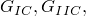 和 。该模型提供了一种幂律关系，将 Mode I、Mode II 和 Mode III 中的能量释放率组合成单个标量断裂准则。

| **输入文件用法：** | ``` [*FRACTURE CRITERION](../key/key-link.md#usb-kws-hfracturecriterion), TYPE=VCCT, MIXED MODE BEHAVIOR=BK ``` |
| --- | --- |

| **Abaqus/CAE 用法：** | 交互模块：**创建交互属性**：**接触**，****Mechanical****Fracture Criterion****，**类型**：**VCCT**，**混合模式行为**：**BK** |
| --- | --- |

##### 幂定律

幂定律模型由以下公式描述（Wu，1965）：


要定义此模型，您必须提供 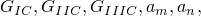 和 。

| **输入文件用法：** | ``` [*FRACTURE CRITERION](../key/key-link.md#usb-kws-hfracturecriterion), TYPE=VCCT, MIXED MODE BEHAVIOR=POWER ``` |
| --- | --- |

| **Abaqus/CAE 用法：** | 交互模块：**创建交互属性**：**接触**，****Mechanical****Fracture Criterion****，**类型**：**VCCT**，**混合模式行为**：**Power** |
| --- | --- |

##### Reeder 定律

Reeder 定律模型由以下公式描述（Reeder，2002）：

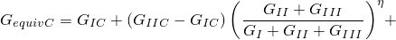


要定义此模型，您必须提供 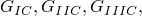 和 。Reeder 定律最适合应用于 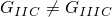 时。当  时，Reeder 定律简化为 BK 定律。Reeder 定律仅适用于三维问题。

| **输入文件用法：** | ``` [*FRACTURE CRITERION](../key/key-link.md#usb-kws-hfracturecriterion), TYPE=VCCT, MIXED MODE BEHAVIOR=REEDER ``` |
| --- | --- |

| **Abaqus/CAE 用法：** | 交互模块：**创建交互属性**：**接触**，****Mechanical****Fracture Criterion****，**类型**：**VCCT**，**混合模式行为**：**Reeder** |
| --- | --- |

##### 在 Abaqus/Standard 中在一个增量中释放多个节点

对于不稳定的裂纹扩展问题，有时更有效的方法是允许在 VCCT 断裂准则满足时，在不缩减增量大小的情况下，在单个增量中允许裂纹尖端处及前方的多个节点脱粘。如果您指定不稳定增长容差 ，则此能力自动激活。在这种情况下，如果断裂准则 *f* 在给定的不稳定增长容差内：

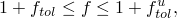

其中  是本节前面描述的容差，则不是缩减增量大小，而是允许裂纹尖端处及前方的更多节点在一个增量中脱粘，直到对于裂纹尖端前方的所有节点 。这些脱粘节点上的力在接下来的增量中立即完全释放。如果未指定不稳定增长容差的值，则默认值是无穷大。在这种情况下，不稳定裂纹扩展的断裂准则 *f* 不受上述方程中任何上限值的限制。

| **输入文件用法：** | ``` [*FRACTURE CRITERION](../key/key-link.md#usb-kws-hfracturecriterion), TYPE=VCCT,UNSTABLE GROWTH TOLERANCE= ``` |
| --- | --- |

| **Abaqus/CAE 用法：** | 交互模块：**创建交互属性**：**接触**，****Mechanical****Fracture Criterion****，**类型**：**VCCT**，切换开启**指定不稳定裂纹扩展容差**：*指定值* |
| --- | --- |

##### 定义可变临界能量释放率

您可以通过在节点处指定临界能量释放率来定义具有可变能量释放率的 VCCT 准则。

如果您指示将指定节点临界能量率，则您指定的任何恒定临界能量释放率都将被忽略，临界能量释放率从节点插值。临界能量释放率必须在从属表面上的所有节点处定义。

| **输入文件用法：** | 使用以下两个选项： |
| --- | --- |
|  | ``` [*FRACTURE CRITERION](../key/key-link.md#usb-kws-hfracturecriterion), TYPE=VCCT, NODAL ENERGY RATE [*NODAL ENERGY RATE](../key/key-link.md#usb-kws-mnodalenergyrate) ``` |

| **Abaqus/CAE 用法：** | Abaqus/CAE 中不支持定义可变临界能量释放率。 |
| --- | --- |

#### 增强 VCCT 准则

此准则仅在 Abaqus/Standard 中可用。

增强 VCCT 准则与上述原始 VCCT 准则非常相似。与原始 VCCT 准则一样，涉及 Mode I、II 和 III 的一般情况中的断裂准则定义为

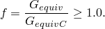

当断裂准则达到 1.0 时，裂纹尖端节点脱粘。然而，与原始 VCCT 准则不同，您可以指定两个不同的临界断裂能量释放率：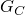 用于裂纹起始， 用于裂纹扩展。当在涉及 Mode I、II 和 III 断裂的一般情况下使用增强 VCCT 准则时，与脱粘力释放相关的能量耗散由传播裂纹所需的临界等效应变能量释放率  控制，而不是由裂纹起始所需的临界等效应变能量释放率  控制。计算  的公式与不同混合模式断裂准则用于  的公式相同。

| **输入文件用法：** | ``` [*FRACTURE CRITERION](../key/key-link.md#usb-kws-hfracturecriterion), TYPE=ENHANCED VCCT ``` |
| --- | --- |

| **Abaqus/CAE 用法：** | 交互模块：**创建交互属性**：**接触**，****Mechanical****Fracture Criterion****，**类型**：**增强 VCCT** |
| --- | --- |

#### 低周疲劳准则

此准则仅在 Abaqus/Standard 中可用。

如果您指定低周疲劳准则，则可以模拟在亚临界循环载荷下层合复合材料中界面的渐进分层扩展。此准则只能在使用直接循环方法（["使用直接循环方法进行低周疲劳分析," 第 6.2.7 节"](pt03ch06s02at06.md)）的低周疲劳分析中使用。分层起始和增长通过使用 Paris 定律来表征，该定律将相对断裂能量释放率与裂纹扩展速率联系起来，如图 11.4.3-6 所示。界面元素处裂纹尖端的断裂能量释放率基于上述 VCCT 技术计算。

Paris 区域由能量释放率阈值  界定，低于该阈值则不考虑疲劳裂纹起始或扩展，以及能量释放率上限 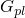，高于该上限则疲劳裂纹将以加速速率扩展。 是根据用户指定的模式混合准则和界面结合强度计算的临界等效应变能量释放率。计算  的公式已在上面针对不同的混合模式断裂准则提供。您可以指定  与  的比值以及  与  的比值。默认值是 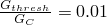 和 。

**图 11.4.3-6** Paris 定律控制的疲劳裂纹扩展。

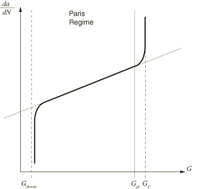

| **输入文件用法：** | ``` [*FRACTURE CRITERION](../key/key-link.md#usb-kws-hfracturecriterion), TYPE=FATIGUE ``` |
| --- | --- |

| **Abaqus/CAE 用法：** | Abaqus/CAE 中不支持低周疲劳准则。 |
| --- | --- |

##### 分层扩展起始

分层扩展起始是指裂纹尖端沿界面开始疲劳裂纹扩展。在低周疲劳分析中，疲劳裂纹扩展起始准则由  表征，这是结构在其最大值和最小值之间加载时的相对断裂能量释放率。疲劳裂纹扩展起始准则定义为


其中  和  是材料常数， 是循环数。除非满足上述方程且对应于结构加载到其最大值时的循环能量释放率的 maximum 断裂能量释放率  大于 ，否则界面元素在裂纹尖端处不会释放。

##### 使用 Paris 定律的疲劳分层扩展

一旦界面处的分层扩展起始准则得到满足，分层扩展速率 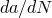 可以基于相对断裂能量释放率  计算。如果 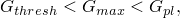，则每循环的分层扩展速率由 Paris 定律给出

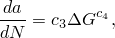

其中  和  是材料常数。

在循环  结束时，Abaqus/Standard 通过在界面处释放至少一个元素，将裂纹长度  从当前循环向前扩展一个增量循环数 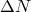 到 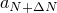。给定材料常数  和 ，结合裂纹尖端处界面元素上已知的节点间距 ，可以计算裂纹尖端处每个界面元素失效所需的循环数 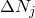，其中 *j* 表示 *j*th 裂纹尖端的节点。分析被设置为在加载循环稳定后释放至少一个界面元素。识别具有最少循环数的元素被释放，其  表示为使裂纹扩展等于其元素长度 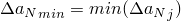 所需的循环数。最关键的元素在稳定循环结束时以零约束和零刚度完全释放。当界面元素被释放时，载荷被重新分配，必须为下一个循环的裂纹尖端处的界面元素计算新的相对断裂能量释放率。此能力允许在每个稳定循环后在裂纹尖端处释放至少一个界面元素，并精确计算导致该长度疲劳裂纹扩展所需的循环数。

如果 ，则裂纹尖端处的界面元素将通过仅将循环计数  增加一来释放。

### 在 Abaqus/Standard 中指定满足断裂准则后脱粘力的释放方式

脱粘后，两个表面之间的牵引力最初作为从属节点和主表面上对应点处的大小相等方向相反的力携带。脱粘力随着裂纹张开和扩展而释放。一旦在某点发生完全脱粘，绑定表面就像具有相关界面特性的标准接触表面一样表现。根据您指定的断裂准则，有两种不同的释放脱粘力的方式。

#### 指定脱粘振幅曲线

当您使用临界应力、临界裂纹张开位移或裂纹长度与时间断裂准则时，您可以定义在该节点开始脱粘后，如何将此力随时间减到零。您指定相对振幅 *a* 作为节点开始脱粘后时间的函数。因此，假设当节点 *N* 开始脱粘时（发生在时间 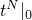），表面之间在从属节点 *N* 传递的力为 。那么，对于任何时间 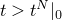，节点 *N* 处表面之间传递的力为 。相对振幅在相对时间 0.0 必须为 1.0，在给出的最后一个相对时间点必须降至 0.0。

振幅曲线的最佳选择取决于材料属性、指定载荷和裂纹扩展准则。如果应力去除太快，裂纹尖端附近应变的大变化可能导致收敛困难。对于大应变问题，也可能发生严重的网格扭曲。对于与速率无关的材料问题，线性振幅曲线通常就足够了。对于与速率相关的材料问题，应在脱粘开始时更慢地降低应力，以避免收敛和网格扭曲困难。为减少收敛和网格扭曲困难的可能性，您可以在 50% 的脱粘时间内将脱粘应力值降低 25%。解不应强烈受卸载过程细节的影响；如果是这样，通常表示需要细化脱粘区域中的网格。

| **输入文件用法：** | ``` [*DEBOND](../key/key-link.md#usb-kws-hdebond), SLAVE=*slave*, MASTER=*master* *数据行定义脱粘振幅曲线* ``` |
| --- | --- |

| **Abaqus/CAE 用法：** | Abaqus/CAE 中不支持指定脱粘振幅曲线。 |
| --- | --- |

#### 对 VCCT 和增强 VCCT 准则的脱粘力进行渐变

对于 VCCT 和增强 VCCT 准则，当能量释放率超过裂纹尖端的临界值时，您可以立即在接下来的增量中释放裂纹尖端处两个表面之间的牵引力，或者在后续增量中根据临界断裂能量释放率控制脱粘力大小的减少而逐渐释放牵引力。后一种方法有时被推荐使用，以避免裂纹尖端前进时突然失去稳定性。增强 VCCT 准则仅在与后一种方法结合使用时才有意义。当使用前一种方法时，使用增强 VCCT 准则获得的结果与使用原始 VCCT 准则获得的结果相同。

| **输入文件用法：** | 使用以下选项立即释放牵引力： |
| --- | --- |
|  | ``` [*DEBOND](../key/key-link.md#usb-kws-hdebond), SLAVE=*slave*, MASTER=*master*, DEBONDING FORCE=STEP ``` 使用以下选项逐渐释放牵引力： ``` [*DEBOND](../key/key-link.md#usb-kws-hdebond), SLAVE=*slave*, MASTER=*master*, DEBONDING FORCE=RAMP ``` |

| **Abaqus/CAE 用法：** | 交互模块：****Special****Crack****Create****：**名称：** *crack name*，**类型**：**使用 VCCT 脱粘**，选择步骤和表面到表面 (Standard) 交互，**脱粘力**：**Step** 或 **Ramp** |
| --- | --- |

### 过程

可以使用以下过程对静态或动态过载进行裂纹扩展分析：
- ["静态应力分析," 第 6.2.2 节"](pt03ch06s02at01.md)
- ["准静态分析," 第 6.2.5 节"](pt03ch06s02at04.md)
- ["使用直接积分的隐式动态分析," 第 6.3.2 节"](pt03ch06s03at07.md)
- ["显式动态分析," 第 6.3.3 节"](pt03ch06s03at08.md)
- ["完全耦合热应力分析," 第 6.5.3 节"](pt03ch06s05at19.md)

也可以使用以下过程对亚临界循环疲劳载荷进行此分析：
- ["使用直接循环方法进行低周疲劳分析," 第 6.2.7 节"](pt03ch06s02at06.md)

#### 在 Abaqus/Standard 中控制脱粘期间的时间增量

当对 VCCT、增强 VCCT 或低周疲劳以外的任何准则使用自动增量时，您可以指定脱粘开始后使用的时间增量大小。默认情况下，时间增量等于最后指定的相对时间。然而，如果在一个增量开始时满足断裂准则，则脱粘开始后使用的时间增量大小将设置为该步骤中允许的最小时间增量。

对于固定时间增量，如果 Abaqus/Standard 发现需要比固定时间增量大小更小的时间增量，则将使用指定的时间增量值作为脱粘开始后的时间增量大小。时间增量大小将根据需要进行调整，直到脱粘完成。

| **输入文件用法：** | ``` [*DEBOND](../key/key-link.md#usb-kws-hdebond), SLAVE=*slave*, MASTER=*master*, TIME INCREMENT=*t* ``` |
| --- | --- |

| **Abaqus/CAE 用法：** | Abaqus/CAE 中不支持在脱粘期间控制时间增量。 |
| --- | --- |

#### Abaqus/Standard 中 VCCT 的粘性正则化

具有不稳定扩展裂纹的结构模拟是具有挑战性和困难的。可能不时发生不收敛行为。虽然通常的稳定技术（如接触对稳定和静态稳定）可用于克服一些收敛困难，但通过使用粘性正则化技术为 VCCT 或增强 VCCT 包含了局部阻尼。粘性正则化阻尼使软化材料的切线刚度矩阵在足够小的时间增量下为正。

| **输入文件用法：** | 使用以下选项之一： |
| --- | --- |
|  | ``` [*FRACTURE CRITERION](../key/key-link.md#usb-kws-hfracturecriterion), TYPE=VCCT, VISCOSITY= ``` ``` [*FRACTURE CRITERION](../key/key-link.md#usb-kws-hfracturecriterion), TYPE=ENHANCED VCCT, VISCOSITY= ``` |

| **Abaqus/CAE 用法：** | 交互模块：**创建交互属性**：**接触**，****Mechanical****Fracture Criterion****，**类型**：**VCCT** 或 **增强 VCCT**，**粘性** |
| --- | --- |

#### Abaqus/Standard 中 VCCT 加速收敛的线性缩放

对于使用 VCCT 或增强 VCCT 准则的大多数裂纹扩展模拟，变形在裂纹扩展起始点之前可能几乎是线性的；过去这个点后，分析变得非常非线性。在这种情况下，可以使用线性缩放方法来有效减少达到裂纹扩展起始点所需的求解时间。

假设增量 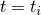 处的施加"试验"载荷只是裂纹扩展起始时间 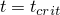 临界载荷的一小部分。以下算法在 Abaqus/Standard 中用于快速收敛到临界载荷状态：


其中最初  将根据非线性程度设置在 0.7 和 0.9 之间（默认值是 0.9）。当  变得小于 0.5%（表明载荷在其临界值的 0.5% 以内）时，下一个  自动设置为 1.0，以使最关键的裂纹尖端节点在下一个增量中精确达到临界值。在第一个裂纹尖端节点释放后，线性缩放计算不再有效，时间增量设置为默认值。然后允许缩减。

| **输入文件用法：** | ``` [*CONTROLS](../key/key-link.md#usb-kws-hcontrols), TYPE=VCCT LINEAR SCALING ``` |
| --- | --- |

| **Abaqus/CAE 用法：** | 步骤模块：****Other****General Solution Controls****Edit****：*step name*，**VCCT 线性缩放** |
| --- | --- |

#### 在 Abaqus/Standard 中使用 VCCT 或增强 VCCT 准则的提示

使用 VCCT 或增强 VCCT 准则的裂纹扩展问题在数值上具有挑战性。以下提示将帮助您创建成功的 Abaqus/Standard 模型：
- 使用 VCCT 或增强 VCCT 准则的分析需要小时间增量。当使用 VCCT 或增强 VCCT 准则时，Abaqus/Standard 会逐节点追踪活动裂纹尖端的位置。因此，在任何单个增量中，裂纹前缘只允许向前推进单个节点（尽管在三维问题中，这种推进可能沿整个裂纹前缘发生）。因为使用 VCCT 或增强 VCCT 准则的分析提供了裂纹扩展的详细结果，您将需要小时间增量，特别是在网格高度细化的情况下。
- 三种不同类型的阻尼可用于帮助使用 VCCT 或增强 VCCT 准则的模型收敛：接触稳定、自动或静态稳定以及粘性正则化。接触和自动稳定不是 VCCT 特有的；它们内置于 Abaqus/Standard 中，与 VCCT 兼容。设置阻尼参数的值通常是一个迭代过程。如果您的 VCCT 模型因不稳定裂纹扩展而无法收敛，请将阻尼参数设置为相对较高的值并重新运行分析。如果参数足够高，应该会返回稳定增量。然而，阻尼力可能会改变裂纹扩展行为，可能在物理上不正确。要监控粘性阻尼吸收的能量，请绘制阻尼能量并将结果与模型中的总应变能（ALLSE）进行比较。如果设置正确，阻尼能量的值应该是一个很小的总能量分数。监控阻尼能量以确保 VCCT 模拟的结果在存在阻尼的情况下是合理的。当您使用接触或自动稳定时，Abaqus 将阻尼能量写入输出数据库（`.odb`）文件中的变量 ALLSD。当您使用粘性正则化时，Abaqus 将阻尼能量写入变量 ALLVD。
- 为最大化脱粘模拟的准确性，尝试在对脱粘接触对的从属和主表面之间使用匹配的网格。
- 如果您确实使用不匹配的网格，您可以通过为接触对使用小滑动、表面到表面公式来最大化模拟的准确性（参见 ["Abaqus/Standard 中的接触公式," 第 38.1.1 节"](pt09ch38s01aus177.md)）。
- 将接触约束信息打印到数据（`.dat`）文件中允许您查看分析开始时脱粘接触对的状态。通过将详细接触条件打印到消息（`.msg`）文件中，您可以追踪分析过程中前进的裂纹前缘的增量行为。有关这些输出请求的更多信息，请参见 ["输出," 第 4.1.1 节"](pt02ch04s01aus38.md)。
- 您可以向脱粘接触对的初始未绑定部分添加小间隙（["在 Abaqus/Standard 接触对中调整初始表面位置和指定初始间隙," 第 36.3.5 节"](pt09ch36s03aus149.md)）。小间隙将有助于消除裂纹开始进展时不必要的严重不连续迭代。
- 不要对脱粘接触对中的从属表面使用绑定 MPC（["一般多点约束," 第 35.2.2 节"](pt08ch35s02aus130.md)）。Abaqus 无法解析 MPC 和脱粘接触状态引起的过度约束。
- 您必须具有连续的主脱粘表面。
- 您可以通过添加几何非线性来帮助分析收敛（即使对脱粘接触对使用小滑动）。有关更多信息，请参见 ["一般和线性扰动过程," 第 6.1.3 节中的"几何非线性"](pt03ch06s01aus44.md#usb-anl-alinearnonlinear-nlgeom)。
- 对于涉及高阶基础元素的接触对的二维模型，初始未绑定部分必须跨越完整的面单元延伸。换句话说，二维高阶模型中的裂纹尖端必须从二次从属表面的角节点开始。裂纹尖端不能从边中节点开始。

#### 在 Abaqus/Explicit 中使用 VCCT 准则的提示

在 Abaqus/Explicit 中使用 VCCT 准则分析的裂纹扩展问题受益于显式时间积分器中一般接触算法的稳健性。然而，与 Abaqus/Standard 中的情况一样，鉴于断裂现象的不连续性质，这些分析仍然具有挑战性。以下提示将帮助您创建成功的 Abaqus/Explicit 模型：
- 在评估使用 VCCT 准则的脱粘分析结果时，动力学效应最为重要。在大多数情况下，准静态环境中可获得实验和/或理论数据。您必须确保 Abaqus/Explicit 分析产生的动能与内能比值较低（1% 或更低）。实际上，这一要求通常意味着避免在模型中使用质量缩放。使用平滑振幅来驱动加载，以帮助减少模型中的动能。在大多数情况下，延长分析时间无济于事，因为结合断裂是一个固有的快速和局部化的过程。
- 如果合适，在与脱粘板相关的材料中使用类似阻尼的行为来减少动态振动。与 Abaqus/Standard 不同，在 Abaqus/Standard 中，在收敛增量结束时实现纯静态平衡，在 Abaqus/Explicit 中，给定位置处的结合断裂与超过静态平衡位置的动态超调相关。如果振动显著（动能明显可观察），裂纹尖端后方的节点处的动态超调可能导致裂纹尖端过早脱粘。
- 为最大化脱粘模拟的准确性，在脱粘表面的从属和主表面之间使用四边形网格。避免使用长宽比大于 2 的单元。在大多数情况下，网格细化将有助于获得现实的结果。
- 模式之间的高度不匹配临界能量值往往会以可能不稳定和不现实的方式引起裂纹沿不断变化的方向扩展，特别是对于 Mode II 和 Mode III。除非实验数据表明，否则不要使用此类值。
- 使用频繁的场输出请求来评估分析进展过程中的脱粘演变。在某些情况下，这可以指出难以从简单数据检查中识别的重大建模缺陷。
- 避免使用涉及脱粘界面两侧节点的其他约束，因为内聚接触力将与约束力竞争以实现整体平衡。在这些情况下，结合断裂可能难以解释。

#### 比较 VCCT 和内聚单元

使用 VCCT 解决分层问题与在 Abaqus 中使用内聚单元非常相似。表 11.4.3-2 描述了两种方法的优点和缺点。

有关内聚单元使用的示例，请参见 ["层合复合材料的分层分析," Abaqus 基准指南第 2.7.1 节](../bmk/bmk-link.md#bmk-elm-alfanodelamination)。此示例还显示了粘性正则化对预测力-位移响应的影响。

**表 11.4.3-2** 比较 VCCT 和内聚单元。
| VCCT | 内聚单元 |
| --- | --- |
| 沿已知裂纹表面由模拟（力学）驱动的裂纹扩展。 | 沿已知裂纹表面由模拟（力学）驱动的裂纹扩展。但是，内聚单元也可以放置在元素面之间，作为允许单个元素分离的机制。 |
| 仅使用 LEFM 建模脆性断裂。 | 为 LEFM 或 EPFM 建模脆性或延性断裂。可能实现非常一般的相互作用建模能力。 |
| 使用基于表面的框架。不需要额外单元。 | 需要定义内聚单元与结构其余部分的连接性和互连性。为准确性，内聚单元的网格可能需要小于周围结构网格和相关的"内聚区"。因此，内聚单元可能更昂贵。 |
| 在裂纹表面开始时需要预先存在的缺陷。无法对尚未裂纹的表面上的裂纹起始进行建模。 | 可以对初始未裂纹表面上的裂纹起始进行建模。当内聚牵引应力超过临界值时，裂纹起始。 |
| 当应变能量释放率超过断裂韧性时裂纹扩展。 | 根据内聚损伤模型裂纹扩展，通常进行校准，使得裂纹完全张开时释放的能量等于临界应变能量释放率。 |
| 可以包括多个裂纹前缘/表面。 | 可以包括多个裂纹前缘/表面。 |
| 在 Abaqus/Standard 中，裂纹表面在未裂纹时刚性绑定。 | 在 Abaqus/Standard 中，裂纹表面在未裂纹时弹性连接。 |
| 需要用户指定的结合断裂韧性。 | 需要用户指定的临界牵引值和结合断裂韧性，以及结合表面的弹性。 |

#### 为 VCCT 测量临界应变能量释放特性

您必须获取 VCCT 结合表面的临界应变能量释放特性。获取临界应变能量释放特性的过程超出了本指南的范围；但是，您可以参考以下 ASTM 测试规范作为指导：
- ASTM D 5528-94a，"单向纤维增强聚合物基复合材料 Mode I 层间断裂韧性的标准测试方法"
- ASTM D 6671-01，"单向纤维增强聚合物基复合材料 Mixed Mode I-Mode II 层间断裂韧性的标准测试方法"
- ASTM D 6115-97，"单向纤维增强聚合物基复合材料 Mode I 疲劳分层扩展起始的标准测试方法"

这些测试规范可在 ASTM 标准年鉴，美国材料与试验协会，第 15.03 卷，2000 年中找到。

### 初始条件

如前所述，初始接触条件用于识别从属表面的哪一部分是初始绑定的。

### 边界条件

边界条件不应施加到主或从属裂纹表面的任何节点上，但它们可用于加载结构并导致裂纹扩展。边界条件可以施加到裂纹扩展分析中的任何位移自由度（["Abaqus/Standard 和 Abaqus/Explicit 中的边界条件," 第 34.3.1 节"](pt07ch34s03aus118.md)）。在低周疲劳分析中，规定的边界条件必须具有在步骤上循环的振幅定义：起始值必须等于结束值（参见 ["振幅曲线," 第 34.1.2 节"](pt07ch34s01aus115.md)）。

### 载荷

可以在裂纹扩展分析中规定以下类型的载荷：
- 集中节点力可以施加到位移自由度（1-6）上；参见 ["集中载荷," 第 34.4.2 节"](pt07ch34s04aus121.md)。
- 可以施加分布压力载荷或体力；参见 ["分布载荷," 第 34.4.3 节"](pt07ch34s04aus122.md)。特定单元可用的分布载荷类型在 [第六部分，"单元"](pt06.md) 中描述。

对于低周疲劳分析，每个载荷必须具有在步骤上循环的振幅定义：起始值必须等于结束值（参见 ["振幅曲线," 第 34.1.2 节"](pt07ch34s01aus115.md)）。

### 预定义场

可以在裂纹扩展分析中指定以下预定义场，如 ["预定义场," 第 34.6.1 节"](pt07ch34s06aus128.md) 中所述：
- 虽然温度不是应力/位移单元中的自由度，但可以将节点温度指定为预定义场。指定温度影响温度依赖性临界应力和裂纹张开位移失效准则（如果指定）。
- 可以指定用户定义场变量的值。这些值影响场变量依赖性临界应力和裂纹张开位移失效准则（如果指定）。

对从属和主表面上的温度和用户定义场变量进行平均，以确定临界应力和裂纹张开位移。

在低周疲劳分析中，指定的温度值必须在步骤上循环：起始值必须等于结束值（参见 ["振幅曲线," 第 34.1.2 节"](pt07ch34s01aus115.md)）。如果从结果文件读取温度，您应指定等于步骤结束时温度值的初始温度条件（参见 ["Abaqus/Standard 和 Abaqus/Explicit 中的初始条件," 第 34.2.1 节"](pt07ch34s02aus116.md)）。或者，您可以将温度渐变回其初始条件值，如 ["预定义场," 第 34.6.1 节"](pt07ch34s06aus128.md) 中所述。

### 材料选项

Abaqus/Standard 中的任何机械本构模型都可用于对开裂材料的机械行为进行建模。参见 [第五部分，"材料"](pt05.md)。

### 单元

规则矩形网格在裂纹扩展分析中给出最佳结果。非线性材料的结果比小应变线性弹性的结果对网格更敏感。

一阶单元通常最适合裂纹扩展分析。

线弹簧单元不能用于裂纹扩展分析。

VCCT、增强 VCCT 和低周疲劳准则不仅支持二维模型（平面和轴对称），还支持涉及一阶基础单元（实体、壳和连续体壳）的接触对的三维模型。在 Abaqus/Standard 中，在涉及高阶基础单元的接触对的二维模型中使用 VCCT 或增强 VCCT 准则仅限于与高阶单元面的角节点对齐的裂纹前缘。不支持将低周疲劳准则与涉及高阶基础单元的接触对一起使用。

### 输出

除非另有说明，否则本节中的以下讨论仅适用于临界应力、临界裂纹张开位移和裂纹长度与时间准则。

在分析开始时，Abaqus/Standard 将扫描部分绑定表面并识别模型中存在的所有裂纹尖端。所有从属表面节点的初始接触状态将打印在数据（`.dat`）文件中。在此阶段，Abaqus/Standard 将明确识别所有裂纹尖端并将其标记为裂纹 1、裂纹 2 等。与这些裂纹关联的从属和主表面也被识别。

对于 VCCT、增强 VCCT 和低周疲劳准则，所有从属表面节点的初始接触状态也打印在数据（`.dat`）文件中。

#### 将裂纹扩展信息打印到数据文件

默认情况下，裂纹扩展信息将在分析期间打印到数据文件。对于每个被识别的裂纹，Abaqus/Standard 将打印初始和当前裂纹尖端节点号、累积增量裂纹长度（从初始裂纹尖端到当前裂纹尖端沿从属表面测量的距离）以及使用的用户指定断裂准则的当前值。裂纹扩展信息不能打印到 Abaqus/Explicit 中的数据文件。

| **输入文件用法：** | ``` [*DEBOND](../key/key-link.md#usb-kws-hdebond), SLAVE=*slave*, MASTER=*master* ``` |
| --- | --- |

| **Abaqus/CAE 用法：** | 交互模块：****Special****Crack****Create****：**类型**：**使用 VCCT 脱粘**，**每** *n* **增量写入输出到 DAT 文件** |
| --- | --- |

例如，如果使用裂纹张开位移准则，则在分析期间打印到数据文件的输出将如下所示：

```
     CRACK TIP LOCATION AND ASSOCIATED QUANTITIES
CRACK  SLAVE   MASTER  INITIAL  CURRENT  CUMULATIVE  CRITICAL
NUMBER SURFACE SURFACE CRACKTIP CRACKTIP INCREMENTAL COD
                       NODE #   NODE #   LENGTH
                                                
```

#### 将裂纹扩展信息写入结果文件

在 Abaqus/Standard 中，您可以选择将裂纹扩展信息写入结果（`.fil`）文件。

| **输入文件用法：** | ``` [*DEBOND](../key/key-link.md#usb-kws-hdebond), SLAVE=*slave*, MASTER=*master*, OUTPUT=FILE ``` |
| --- | --- |

| **Abaqus/CAE 用法：** | Abaqus/CAE 中不支持将裂纹扩展信息写入结果文件。 |
| --- | --- |

#### 将裂纹扩展信息同时写入数据文件和结果文件

在 Abaqus/Standard 中，您可以将裂纹扩展信息同时写入数据和结果文件。

| **输入文件用法：** | ``` [*DEBOND](../key/key-link.md#usb-kws-hdebond), SLAVE=*slave*, MASTER=*master*, OUTPUT=BOTH ``` |
| --- | --- |

| **Abaqus/CAE 用法：** | Abaqus/CAE 中不支持将裂纹扩展信息同时写入数据文件和结果文件。 |
| --- | --- |

#### 控制输出频率

在 Abaqus/Standard 中，您可以控制输出频率（以增量为单位）。默认情况下，裂纹尖端位置和相关量将每增量打印一次。指定输出频率为 0 以禁止裂纹扩展输出。

| **输入文件用法：** | ``` [*DEBOND](../key/key-link.md#usb-kws-hdebond), SLAVE=*slave*, MASTER=*master*, FREQUENCY=*f* ``` |
| --- | --- |

| **Abaqus/CAE 用法：** | 交互模块：****Special****Crack****Create****：**类型**：**使用 VCCT 脱粘**，**每** *n* **增量写入输出到 DAT 文件** |
| --- | --- |

#### 输出变量

可以将以下结合失效量请求为表面输出（参见 ["输出到数据和结果文件," 第 4.1.2 节"](pt02ch04s01aus39.md)；["Abaqus/Standard 输出变量标识符," 第 4.2.1 节"](pt02ch04s02abv01.md)；和 ["Abaqus/Explicit 输出变量标识符," 第 4.2.2 节"](pt02ch04s02xbv01.md)）用于所有断裂准则：

| DBT | 结合失效发生的时间。对于 VCCT、增强 VCCT 和低周疲劳准则，这是脱粘开始的时间。 |
| --- | --- |

| DBSF | 失效时仍保留的应力分数。 |
| --- | --- |

| DBS | 失效结合中剩余的所有应力分量。 |
| --- | --- |

| DBS1*i* | 剩余的失效结合中应力的 1*i* 分量（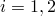）。 |
| --- | --- |

对于 VCCT、增强 VCCT 和低周疲劳准则，以下附加变量也可以作为表面输出请求（参见 ["输出到数据和结果文件," 第 4.1.2 节"](pt02ch04s01aus39.md)）：

| CSDMG | 标量损伤变量的总体值。 |
| --- | --- |

| BDSTAT | 结合状态。结合状态在 1.0（完全绑定）和 0.0（完全未绑定）之间变化。 |
| --- | --- |

| OPENBC | 当满足断裂准则时，裂纹后方的相对位移。 |
| --- | --- |

| CRSTS | 失效时所有临界应力分量 |
| --- | --- |

| CRSTS1*i* | 失效时临界应力的 1*i* 分量（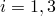）。 |
| --- | --- |

| ENRRT | 所有应变能量释放率分量。 |
| --- | --- |

| ENRRT1*i* | 应变能量释放率的 1*i* 分量（）。 |
| --- | --- |

| EFENRRTR | 有效能量释放率比值，。 |
| --- | --- |

表面输出请求除了上述量外还提供常规接触变量的输出。必须明确请求结合失效量；否则，只给出接触的默认输出。

Abaqus/CAE 提供对写入输出数据库的变量的时间历史图和 *X*–*Y* 图可视化的支持。

#### 轮廓积分

可以对使用临界应力、临界裂纹张开位移或裂纹长度与时间断裂准则执行的二维裂纹扩展分析请求轮廓积分。如果选择的轮廓使裂纹尖端穿过轮廓，则轮廓值将变为零（正如它应该的那样）。因此，在裂纹扩展分析中，应在距裂纹尖端足够远的地方请求轮廓积分，以便裂纹尖端不会穿过轮廓，这很容易通过将沿结合表面在裂纹尖端节点集中指定的所有节点包括在内来完成。有关轮廓积分输出的详细信息，请参见 ["轮廓积分评估," 第 11.4.2 节"](pt04ch11s04aus68.md)。

### 输入文件模板

#### Abaqus/Standard 分析

```
[*HEADING](../key/key-link.md#usb-kws-mheading)
…
[*BOUNDARY](../key/key-link.md#usb-kws-hboundary)
*数据行指定零值边界条件*
[*INITIAL CONDITIONS](../key/key-link.md#usb-kws-minitialcond), TYPE=CONTACT (, NORMAL)
*数据行指定初始条件*
[*SURFACE](../key/key-link.md#usb-kws-msurface), NAME=*slave*
*数据行定义从属表面*
[*SURFACE](../key/key-link.md#usb-kws-msurface), NAME=*master*
*数据行定义主表面*
**
[*CONTACT PAIR](../key/key-link.md#usb-kws-hcontactpair)
*slave, master*
** 
[*STEP](../key/key-link.md#usb-kws-hstep) (, NLGEOM)
[*STATIC](../key/key-link.md#usb-kws-hstatic) *或* [*VISCO](../key/key-link.md#usb-kws-hvisco) *或* [*COUPLED TEMPERATURE-DISPLACEMENT](../key/key-link.md#usb-kws-hcouptempdisp)
[*DEBOND](../key/key-link.md#usb-kws-hdebond), SLAVE=*slave*, MASTER=*master*
*数据行定义脱粘振幅曲线*
[*FRACTURE CRITERION](../key/key-link.md#usb-kws-hfracturecriterion), TYPE=*type*, DISTANCE *或* NSET
*数据行定义断裂准则*
[*BOUNDARY](../key/key-link.md#usb-kws-hboundary)
*数据行定义零值或非零边界条件*
[*CLOAD](../key/key-link.md#usb-kws-hcload) 和/或 [*DLOAD](../key/key-link.md#usb-kws-hdload) 和/或 [*TEMPERATURE](../key/key-link.md#usb-kws-htemperature) 和/或 [*FIELD](../key/key-link.md#usb-kws-hfield)
*数据行定义载荷*
**
[*CONTOUR INTEGRAL](../key/key-link.md#usb-kws-hcontintegral), CONTOURS=*n*, TYPE=*type*
***可以在二维裂纹扩展分析中请求轮廓积分*
[*CONTACT PRINT](../key/key-link.md#usb-kws-hcontactprint)
DBT, DBSF, DBS
[*EL PRINT](../key/key-link.md#usb-kws-helprint)
JK,
[*END STEP](../key/key-link.md#usb-kws-hendstep)
**
[*STEP](../key/key-link.md#usb-kws-hstep) 
[*DIRECT CYCLIC](../key/key-link.md#usb-kws-hdirectcyclic), FATIGUE
[*DEBOND](../key/key-link.md#usb-kws-hdebond), SLAVE=*slave*, MASTER=*master*
[*FRACTURE CRITERION](../key/key-link.md#usb-kws-hfracturecriterion), TYPE=FATIGUE
*数据行定义 Paris 定律中使用的材料常数和断裂准则*
[*BOUNDARY](../key/key-link.md#usb-kws-hboundary)
*数据行定义零值或非零循环边界条件*
[*CLOAD](../key/key-link.md#usb-kws-hcload) 和/或 [*DLOAD](../key/key-link.md#usb-kws-hdload) 和/或 [*TEMPERATURE](../key/key-link.md#usb-kws-htemperature) 和/或 [*FIELD](../key/key-link.md#usb-kws-hfield)
*数据行定义循环载荷*
**
[*END STEP](../key/key-link.md#usb-kws-hendstep)
**
```

#### Abaqus/Explicit 分析

```
[*HEADING](../key/key-link.md#usb-kws-mheading)
…
[*BOUNDARY](../key/key-link.md#usb-kws-hboundary)
*数据行指定零值边界条件*
[*SURFACE](../key/key-link.md#usb-kws-msurface), NAME=*slave*
*数据行定义从属表面*
[*SURFACE](../key/key-link.md#usb-kws-msurface), NAME=*master*
*数据行定义主表面*
**
[*CONTACT CLEARANCE](../key/key-link.md#usb-kws-hcontactclearance), NAME=*clearance_name*,
SEARCH NSET=*initially_bonded_nodeset_name*
[*SURFACE INTERACTION](../key/key-link.md#usb-kws-hsurfaceinteraction), NAME=*interaction_name*
[*COHESIVE BEHAVIOR](../key/key-link.md#usb-kws-mcohesivebehavior)
*数据行指定弹性行为*
[*FRACTURE CRITERION](../key/key-link.md#usb-kws-hfracturecriterion), TYPE=VCCT, MIXED MODE BEHAVIOR=BK 
**
[*STEP](../key/key-link.md#usb-kws-hstep)
[*DYNAMIC](../key/key-link.md#usb-kws-hdynamic), EXPLICIT
[*CONTACT](../key/key-link.md#usb-kws-hcontact)
[*CONTACT CLEARANCE ASSIGNMENT](../key/key-link.md#usb-kws-hcontclearassign)
*数据行将间隙名称分配给表面对*
[*CONTACT PROPERTY ASSIGNMENT](../key/key-link.md#usb-kws-hcontpropassign)
*数据行将表面交互分配给表面对*
[*END STEP](../key/key-link.md#usb-kws-hendstep)
**
```

#### 附加参考文献

- Benzeggagh, M., and M. Kenane, "Measurement of Mixed-Mode Delamination Fracture Toughness of Unidirectional Glass/Epoxy Composites with Mixed-Mode Bending Apparatus," Composite Science and Technology, vol. 56 439, 1996.
- Reeder, J., S. Kyongchan, P. B. Chunchu, and D. R.. Ambur, "Postbuckling and Growth of Delaminations in Composite Plates Subjected to Axial Compression"43rd AIAA/ASME/ASCE/AHS/ASC Structures, Structural Dynamics, and Materials Conference, Denver, Colorado, vol. 1746, p. 10, 2002.
- Wu, E. M., and R. C. Reuter Jr., "Crack Extension in Fiberglass Reinforced Plastics," T and M Report, University of Illinois, vol. 275, 1965.
