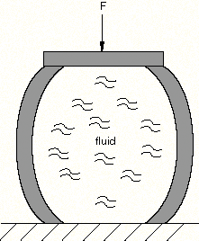
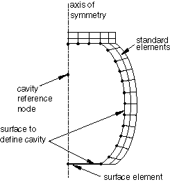
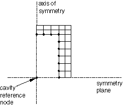

# 11.5.1 基于表面的流体空腔：概述

**产品：** Abaqus/Standard  Abaqus/Explicit

##### **参考文献**

- ["流体空腔定义," 第 11.5.2 节"](pt04ch11s05aus71.md)
- ["流体交换定义," 第 11.5.3 节"](pt04ch11s05aus72.md)
- ["充气机定义," 第 11.5.4 节"](pt04ch11s05aus73.md)

### 概述

基于表面的流体填充空腔通过以下方式建模：
- 使用标准有限元对流体填充结构进行建模；
- 使用表面定义来提供流体填充结构的变形与内部流体对结构空腔边界施加的压力之间的耦合；
- 定义流体行为；
- 使用流体交换定义来模拟流体在空腔与环境之间或多个空腔之间的传递；和
- 使用充气机定义将气体混合物注入流体空腔，以模拟汽车气囊的充气。

基于表面的流体空腔能力可用于对液体或气体填充结构进行建模。它在功能上取代了基于单元的静水流体空腔能力，不需要用户定义流体或流体链接单元。

### 简介

在某些应用中，可能需要预测液体填充或气体填充结构的机械响应。例子包括压力容器、液压或气动驱动机构以及汽车气囊。解决此类应用的主要困难在于结构变形与内部流体对结构施加的压力之间的耦合。响应不仅取决于外部载荷，还取决于流体施加的压力，而压力又受结构变形的影响。图 11.5.1-1 展示了一个承受外部载荷系统的流体填充结构的简单例子。表面流体空腔能力提供了分析所需耦合，以分析可以假定空腔被具有均匀属性和状态的流体完全填充的情况。具有显著空间变化的空腔应用无法使用此功能建模。例如，考虑涉及晃动和通过流体波传播的应用中的流体-结构相互作用和耦合欧拉-拉格朗日能力（参见 ["欧拉分析," 第 14.1.1 节"](pt04ch14s01aus90.md)；["流体-结构相互作用"中的"共仿真：概述," 第 17.1.1 节"](pt04ch17s01abo17.md#usb-anl-fluidstructureinteraction)；和 ["流体到结构及共轭热传递共仿真," 第 17.3.2 节"](pt04ch17s03aus100.md)）。

**图 11.5.1-1** 流体填充结构。



### 离散化流体空腔

流体空腔的边界由基于单元的表面定义，法线指向空腔内部。基础元素可以是标准实体或结构元素，也可以是表面元素。表面元素可用于对结构中的孔进行建模，或填充不存在刚性或其他承重单元的刚性区域（参见 ["表面元素," 第 32.7.1 节"](pt06ch32s07alm52.md)）。使用表面元素时必须小心，以确保仅被表面元素完全包围的节点具有适当的边界条件。

考虑图 11.5.1-1 中所示的示例。实体单元在空腔的顶部和侧面定义，如图 11.5.1-2 所示。在不存在标准单元的空腔底部刚性边界上定义表面单元。位于对称轴与空腔下方刚性边界交点处的节点必须在 *r* 和 *z* 方向上约束，因为它仅连接到表面单元。定义空腔的表面基于底层实体和表面单元。

**图 11.5.1-2** 流体填充结构的轴对称模型。



可以将额外的用户定义体积添加到空腔的实际或几何体积中。如果空腔边界不是由基于单元的表面定义的，则假定流体空腔具有等于添加体积的固定体积。

#### 定义空腔参考节点的位置

与流体空腔关联的单个节点（称为空腔参考节点）具有表示流体空腔内部压力的单个自由度。空腔参考节点也用于计算空腔体积。

如果空腔不是由对称平面界定的，则定义空腔的表面必须完全封闭空腔以确保正确计算其体积。在这种情况下，空腔参考节点的位置是任意的，不必位于空腔内部。

如果由于对称性，只有一部分空腔边界用标准单元建模，则空腔参考节点必须位于对称平面或轴上（图 11.5.1-2）。如果存在多个对称平面，则空腔参考节点必须位于对称平面的交点处（图 11.5.1-3）。对于轴对称分析，空腔参考节点必须位于对称轴上。这些要求是因为流体空腔未被定义空腔的表面完全包围。

**图 11.5.1-3** 具有附加对称平面的轴对称模型。



#### 有限元计算

基于表面的空腔的有限元计算使用体积单元执行，如 ["静水流体计算," Abaqus 理论指南第 3.8.1 节](../stm/stm-link.md#stm-elm-fluidelem) 中所述。空腔的体积单元由 Abaqus 使用您定义的表面小面几何和空腔参考节点在内部创建。在 Abaqus/Standard 中，表面小面用以下单元类型表示：FAX2 和 F2D2（分别是线性 2 节点轴对称和平面单元）和 F3D3 和 F3D4（分别是线性 3 节点和 4 节点三维单元）。Abaqus 中的二阶小面进一步细分为多个线性小面或单元。

### 流体空腔行为

流体填充空腔内流体的行为可以基于液压或气动模型。液压模型可以模拟近不可压缩流体行为和在 Abaqus/Standard 中的完全不可压缩行为。可压缩性通过定义体积模量引入。气动模型基于理想气体。在 Abaqus/Explicit 中，气体可以由多种物质定义，您可以指定气体温度或根据绝热行为假设进行计算。具有绝热温度更新的多种物质理想气体是汽车气囊的适当模型。

### 模拟流入或流出空腔的流动

在 Abaqus 中有多种方法可以模拟流体流入或流出空腔的传递。流动可以指定为规定的质量或体积通量历史，也可以模拟由压力差引起的物理机制，如通过排气孔排气或通过多孔织物的泄漏。流体交换定义用于此目的，可以模拟流体在空腔与环境之间或两个空腔之间的流动（详见 ["流体交换定义," 第 11.5.3 节"](pt04ch11s05aus72.md)）。此外，Abaqus/Explicit 具有对用于汽车气囊部署的充气机进行建模的能力。可以直接指定充气机处的条件，或可以使用罐测试数据（详见 ["充气机定义," 第 11.5.4 节"](pt04ch11s05aus73.md)）。

### 建模多个腔室

许多流体填充系统（如气囊）具有通过孔或织物泄漏在腔室之间流动的多个腔室。在其他情况下，将单个物理腔室划分为具有虚拟壁的多个腔室以模拟整个物理腔室上的压力梯度是有利的。可以定义一些通过腔室间壁的虚拟泄漏机制以获得合理的行为。当模拟气囊的复杂展开时，这可能是一种有用的建模技术。要对多个腔室进行建模，请为每个腔室定义一个流体空腔，并使用适当的流体交换定义将流体空腔链接在一起。如果请求，可以输出多腔室模型的平均属性（详见 ["流体空腔定义," 第 11.5.2 节"](pt04ch11s05aus71.md)）。

### 在动态过程中定义流体惯性

流体腔内部或腔室之间交换的流体的惯性不会自动考虑。要添加惯性的影响，请在空腔边界上使用 MASS 单元。您应确保添加的总质量对应于空腔中流体的质量，并且 MASS 单元的分布对于结构所承受的载荷类型是分布式流体质量的合理表示。只能对流体惯性的整体效应进行建模；空腔中均匀压力假设使得不可能对任何压力梯度驱动的流体运动进行建模。因此，该方法假定激励的时间尺度与流体的典型响应时间相比非常长。

### 建模涉及空腔边界的接触

如果从空腔中移除了大量流体或围绕空腔的材料非常灵活，空腔可能部分坍塌，空腔壁的部分可能彼此接触。空腔壁的自接触和与周围结构的接触可以通过使用 Abaqus 中可用的标准接触建模技术有效地处理。Abaqus/Explicit 还可以考虑由于接触表面导致的空腔外流阻塞（参见 ["考虑接触边界表面导致的阻塞"中的"流体交换定义," 第 11.5.3 节"](pt04ch11s05aus72.md#usb-anl-afluidcavityexchange-blockage)）。

### 解释负特征值消息

在 Abaqus/Standard 中的一些应用中，在求解过程中可能遇到负特征值。这些负特征值不一定表示超过了分叉或屈曲载荷。如果预测的响应在其他方面看起来是合理的，则可以忽略这些消息。["静水流体计算," Abaqus 理论指南第 3.8.1 节](../stm/stm-link.md#stm-elm-fluidelem) 中提供了有关在静水流体单元问题求解过程中如何产生负特征值的详细描述。

### 过程

基于表面的流体空腔能力可用于除耦合孔隙流体扩散/应力分析之外的所有过程（参见 ["耦合孔隙流体扩散和应力分析," 第 6.8.1 节"](pt03ch06s08at26.md)）。

### 初始条件

可以指定初始流体压力和温度（参见 ["Abaqus/Standard 和 Abaqus/Explicit 中的初始条件," 第 34.2.1 节"](pt07ch34s02aus116.md)）。对于理想气体，初始压力表示高于环境压力的表压。初始温度应以使用的温度标度给出。绝对零度在该温度标度中为理想气体单独指定（参见 ["流体空腔定义," 第 11.5.2 节"](pt04ch11s05aus71.md)）。

如果膜单元被用作流体空腔的基础单元，则也可以指定参考网格（初始度量）（参见 ["Abaqus/Standard 和 Abaqus/Explicit 中的初始条件," 第 34.2.1 节"](pt07ch34s02aus116.md)）。

### 边界条件

空腔参考节点处的压力自由度（自由度编号 8）是问题中的主变量。因此，可以通过定义边界条件来规定它（参见 ["Abaqus/Standard 和 Abaqus/Explicit 中的边界条件," 第 34.3.1 节"](pt07ch34s03aus118.md)），类似于可以规定结构节点位移的方式。规定空腔参考节点处的压力等同于使用分布载荷定义对空腔边界施加均匀压力（参见 ["分布载荷," 第 34.4.3 节"](pt07ch34s04aus122.md)）。

如果用边界条件规定了压力，则流体体积会自动调整以填充空腔（即，假定流体根据需要进入和离开空腔以维持规定的压力）。此行为在空腔在引入流体效应之前变形的情况下很有用。在后续步骤中，您可以移除压力自由度上的边界条件（参见 ["移除边界条件"中的"Abaqus/CFD 中的边界条件," 第 34.3.2 节"](pt07ch34s03aus119.md#usb-prc-pboundary-remove)），从而用当前流体体积"密封"空腔。

### 载荷

可以如 ["集中载荷," 第 34.4.2 节"](pt07ch34s04aus121.md) 和 ["分布载荷," 第 34.4.3 节"](pt07ch34s04aus122.md) 中所述，对流体填充结构施加分布压力和体力，以及集中节点力。

### 预定义场

可以为流体填充结构和封闭流体定义预定义温度场和用户定义场变量，如 ["预定义场," 第 34.6.1 节"](pt07ch34s06aus128.md) 中所述。

#### 温度

除非规定绝热过程或使用耦合温度-位移过程，否则可以将流体温度指定为所有空腔参考节点上的预定义场（参见 ["预定义场"中的"预定义温度," 第 34.6.1 节"](pt07ch34s06aus128.md#usb-prc-pfields-temp)）。施加温度与初始温度之间的任何差异将对气动流体以及如果给出热膨胀系数的液压流体引起热膨胀。规定的温度场也可以影响流体填充结构和封闭流体的温度依赖性材料属性（如果存在）。

#### 场变量

可以在所有空腔参考节点上指定用户定义场变量的值（参见 ["预定义场"中的"预定义场变量," 第 34.6.1 节"](pt07ch34s06aus128.md#usb-prc-pfields-fieldvariables)）。这些值将影响封闭流体的场变量依赖性材料属性。

### 输出

空腔内部的状态可用于使用节点输出变量 PCAV 和 CVOL 进行历史输出，它们分别表示表压流体压力和空腔体积。在稳态动态过程中，流体压力的大小和相位角可以作为节点变量 PPOR 获得。

Abaqus/Explicit 还提供空腔温度、空腔表面积和流体质量的输出（分别为节点输出变量 CTEMP、CSAREA 和 CMASS）。输出变量 CTEMP 仅在绝热条件下使用理想气体模型时可用。如果请求输出的节点集包含多个流体空腔，则这些空腔的平均流体压力、总体积、平均流体温度、所有外部空腔表面积之和以及总质量的时程也将分别通过节点输出变量 APCAV、TCVOL、ACTEMP、TCSAREA 和 TCMASS 输出。

在 Abaqus/Explicit 中，当模型包含流体交换定义时，使用节点输出变量 CMFL 和 CMFLT 可获得流出空腔的总质量流量和总累积质量流量的历史输出，使用 CEFL 和 CEFLT 可获得流出空腔的总热能流量和总累积热能流量的历史输出。如果为空腔定义了多个流体交换，则还将输出每个流体交换的流出 cavity 的质量或热能流量和累积质量或热能流量的时程。

如果流体空腔由混合理想气体建模，则可以通过使用节点输出变量 CMF 获得流体空腔内每种流体物质的分子质量分数的时程。

如果使用了充气机，则使用节点输出变量 MINFL、MINFLT 和 TINFL 获取每个充气机定义的流量、累积质量和充气机温度的时程（参见 ["Abaqus/Explicit 输出变量标识符," 第 4.2.2 节"](pt02ch04s02xbv01.md)）。

### 输入文件模板

#### 静水流体分析：

```
[*HEADING](../key/key-link.md#usb-kws-mheading)
…
[*FLUID CAVITY](../key/key-link.md#usb-kws-mfluidcavity), NAME=*cavity_name*, BEHAVIOR=*behavior_name*,
REF NODE=*cavity_reference_node*, SURFACE=*surface_name*
[*FLUID BEHAVIOR](../key/key-link.md#usb-kws-mfluidbehavior), NAME=*behavior_name* 
[*FLUID DENSITY](../key/key-link.md#usb-kws-mfluiddensity)
*数据行定义密度*
[*FLUID BULK MODULUS](../key/key-link.md#usb-kws-mfluidbulk)
*数据行定义体积模量*
[*FLUID EXPANSION](../key/key-link.md#usb-kws-mfluidexpansion)
*数据行定义热膨胀*
**
[*FLUID EXCHANGE](../key/key-link.md#usb-kws-mfluidexchange), NAME=*exchange_name*, PROPERTY=*exchange_property_name*
*cavity_reference_node*
[*FLUID EXCHANGE PROPERTY](../key/key-link.md#usb-kws-mfluidexchangeprop), NAME=*exchange_property_name*, TYPE=MASS FLUX 
*数据行定义单位面积质量流量*
**
[*INITIAL CONDITIONS](../key/key-link.md#usb-kws-minitialcond), TYPE=TEMPERATURE
*数据行定义初始温度*
[*INITIAL CONDITIONS](../key/key-link.md#usb-kws-minitialcond), TYPE=FLUID PRESSURE
*数据行定义初始压力*
**
[*STEP](../key/key-link.md#usb-kws-hstep)
**
[*TEMPERATURE](../key/key-link.md#usb-kws-htemperature)
*数据行定义温度*
[*FLUID EXCHANGE ACTIVATION](../key/key-link.md#usb-kws-hfluidexchangeinte)
*exchange_name*
**
[*END STEP](../key/key-link.md#usb-kws-hendstep)
```

#### 使用混合理想气体的气囊分析：

```
[*HEADING](../key/key-link.md#usb-kws-mheading)
…
[*FLUID CAVITY](../key/key-link.md#usb-kws-mfluidcavity), NAME=*chamber_1*, MIXTURE=MOLAR FRACTION, ADIABATIC,
REF NODE=*chamber_1_reference_node*, SURFACE=*surface_name_1*
*空白行*
*Oxygen,  0.2*
*Nitrogen,  0.75*
*Carbon_dioxide,  0.05*
**
[*FLUID CAVITY](../key/key-link.md#usb-kws-mfluidcavity), NAME=*chamber_2*, BEHAVIOR=*Air*, ADIABATIC, 
REF NODE=*chamber_2_reference_node*, SURFACE=*surface_name_2*
*空白行*
**
[*FLUID BEHAVIOR](../key/key-link.md#usb-kws-mfluidbehavior), NAME=*Air*
[*CAPACITY](../key/key-link.md#usb-kws-mcapacity), TYPE=POLYNOMIAL
*数据行定义热容系数*
[*MOLECULAR WEIGHT](../key/key-link.md#usb-kws-mmolecularweight)
*数据行定义分子量*
**
[*FLUID BEHAVIOR](../key/key-link.md#usb-kws-mfluidbehavior), NAME=*Oxygen*
[*CAPACITY](../key/key-link.md#usb-kws-mcapacity), TYPE=POLYNOMIAL
*数据行定义热容系数*
[*MOLECULAR WEIGHT](../key/key-link.md#usb-kws-mmolecularweight)
*数据行定义分子量*
**
[*FLUID BEHAVIOR](../key/key-link.md#usb-kws-mfluidbehavior), NAME=*Nitrogen*
[*CAPACITY](../key/key-link.md#usb-kws-mcapacity), TYPE=POLYNOMIAL
*数据行定义热容系数*
[*MOLECULAR WEIGHT](../key/key-link.md#usb-kws-mmolecularweight)
*数据行定义分子量*
**
[*FLUID BEHAVIOR](../key/key-link.md#usb-kws-mfluidbehavior), NAME=*Carbon_dioxide*
[*CAPACITY](../key/key-link.md#usb-kws-mcapacity), TYPE=POLYNOMIAL
*数据行定义热容系数*
[*MOLECULAR WEIGHT](../key/key-link.md#usb-kws-mmolecularweight)
*数据行定义分子量*
**
[*FLUID INFLATOR](../key/key-link.md#usb-kws-mfluidinflator), NAME=*inflator*, PROPERTY=*inflator_property* 
*chamber_1_reference_node*
[*FLUID INFLATOR PROPERTY](../key/key-link.md#usb-kws-mfluidinflatorproperty), NAME=*inflator_property*,
TYPE=TEMPERATURE AND MASS
*数据行定义质量流量和气体温度*
[*FLUID INFLATOR MIXTURE](../key/key-link.md#usb-kws-mfluidinflatormixture), TYPE=MOLAR FRACTION, NUMBER SPECIES=*2* 
*Carbon_dioxide, Nitrogen*
*表定义分子质量分数*
**
[*FLUID EXCHANGE](../key/key-link.md#usb-kws-mfluidexchange), NAME=*exhaust*, PROPERTY=*exhaust_behavior* 
*chamber_1_reference_node*
[*FLUID EXCHANGE PROPERTY](../key/key-link.md#usb-kws-mfluidexchangeprop), NAME=*exhaust_behavior*, TYPE=ORIFICE 
*数据行指定孔口行为*
[*FLUID EXCHANGE](../key/key-link.md#usb-kws-mfluidexchange), NAME=*leakage_1*, PROPERTY=*fabric_behavior*
*chamber_1_reference_node*
[*FLUID EXCHANGE](../key/key-link.md#usb-kws-mfluidexchange), NAME=*leakage_2*, PROPERTY=*fabric_behavior*
*chamber_2_reference_node*
[*FLUID EXCHANGE PROPERTY](../key/key-link.md#usb-kws-mfluidexchangeprop), NAME=*fabric_behavior*, TYPE=FABRIC LEAKAGE 
*数据行指定织物泄漏行为*
**
[*FLUID EXCHANGE](../key/key-link.md#usb-kws-mfluidexchange), NAME=*chamber_wall*, PROPERTY=*wall_behavior*, 
EFFECTIVE AREA=
*chamber_1_reference_node, chamber_2_reference_node*
[*FLUID EXCHANGE PROPERTY](../key/key-link.md#usb-kws-mfluidexchangeprop), NAME=*wall_behavior*, TYPE=ORIFICE 
*数据行指定孔口行为*
**
[*AMPLITUDE](../key/key-link.md#usb-kws-mamplitude), NAME=*amplitude_name* 
*数据行定义振幅变化*
[*PHYSICAL CONSTANTS](../key/key-link.md#usb-kws-mphysicalconsts), UNIVERSAL GAS CONSTANT=
**
[*INITIAL CONDITIONS](../key/key-link.md#usb-kws-minitialcond), TYPE=FLUID PRESSURE
*数据行定义初始压力*
[*INITIAL CONDITIONS](../key/key-link.md#usb-kws-minitialcond), TYPE=TEMPERATURE
*数据行定义初始温度*
**
[*STEP](../key/key-link.md#usb-kws-hstep)
**
[*FLUID EXCHANGE ACTIVATION](../key/key-link.md#usb-kws-hfluidexchangeinte)
*exhaust, leakage_1, leakage_2,  chamber_wall*
[*FLUID INFLATOR ACTIVATION](../key/key-link.md#usb-kws-hfluidinflatorinte), INFLATION TIME AMPLITUDE=*amplitude_name*
*inflator*
**
[*END STEP](../key/key-link.md#usb-kws-hendstep)
```
