# 11.5.2 流体空腔定义

**产品：** Abaqus/Standard  Abaqus/Explicit  Abaqus/CAE

##### **参考文献**

- ["基于表面的流体空腔：概述," 第 11.5.1 节"](pt04ch11s05aus70.md)
- ["流体交换定义," 第 11.5.3 节"](pt04ch11s05aus72.md)
- [*CAPACITY](../key/key-link.md#usb-kws-mcapacity)
- [*FLUID BEHAVIOR](../key/key-link.md#usb-kws-mfluidbehavior)
- [*FLUID BULK MODULUS](../key/key-link.md#usb-kws-mfluidbulk)
- [*FLUID CAVITY](../key/key-link.md#usb-kws-mfluidcavity)
- [*FLUID DENSITY](../key/key-link.md#usb-kws-mfluiddensity)
- [*MOLECULAR WEIGHT](../key/key-link.md#usb-kws-mmolecularweight)
- ["定义流体空腔相互作用," Abaqus/CAE 用户指南第 15.13.11 节](../usi/usi-link.md#usi-itn-help-fluid-cavity)
- ["定义流体空腔相互作用属性," Abaqus/CAE 用户指南第 15.14.4 节](../usi/usi-link.md#usi-itn-help-prop-fluid-cavity)

### 概述

基于表面的流体空腔：
- 可用于对液体填充或气体填充结构进行建模；
- 与称为空腔参考节点的节点相关联；
- 通过指定完全包围空腔的表面来定义；
- 仅适用于在特定空腔中流体的压力和温度在任何时候都均匀的情况；
- 可使用绝热条件下理想气体混合物的假设对气囊进行建模；以及
- 具有可用于识别与空腔关联的历史输出的名称。

### 定义流体空腔

必须为每个流体空腔关联一个名称。

| **输入文件用法：** | ``` [*FLUID CAVITY](../key/key-link.md#usb-kws-mfluidcavity), NAME=*name* ``` |
| --- | --- |

| **Abaqus/CAE 用法：** | 相互作用模块：**Create Interaction**：**Fluid cavity**，**Name**：*name* |
| --- | --- |

#### 指定空腔参考节点

每个流体空腔必须有一个关联的空腔参考节点。除了流体空腔名称外，参考节点还用于识别流体空腔。此外，它可以被流体交换和充气机定义引用。参考节点不应连接到模型中的任何单元。

| **输入文件用法：** | ``` [*FLUID CAVITY](../key/key-link.md#usb-kws-mfluidcavity), REF NODE=*n* ``` |
| --- | --- |

| **Abaqus/CAE 用法：** | 相互作用模块：**Create Interaction**：**Fluid cavity**：选择流体空腔参考节点 |
| --- | --- |

#### 指定流体空腔的边界

除非建模了对称平面（参见 ["基于表面的流体空腔：概述," 第 11.5.1 节"](pt04ch11s05aus70.md)），否则流体空腔必须完全由有限单元包围。表面单元可用于空腔表面中非结构的部分。空腔边界使用覆盖围绕空腔的单元的基于单元的表面指定，表面法线指向空腔内部。默认情况下，如果表面的底层单元不具有一致的法线，则会发出错误消息。或者，您可以跳过对表面法线的一致性检查。

| **输入文件用法：** | 使用以下选项定义具有一致法线检查的表面： |
| --- | --- |
|  | ``` [*FLUID CAVITY](../key/key-link.md#usb-kws-mfluidcavity), SURFACE=*surface_name*, CHECK NORMALS=YES ``` 使用以下选项定义不带一致法线检查的表面： ``` [*FLUID CAVITY](../key/key-link.md#usb-kws-mfluidcavity), SURFACE=*surface_name*, CHECK NORMALS=NO ``` |

| **Abaqus/CAE 用法：** | 相互作用模块：**Create Interaction**：**Fluid cavity**：选择流体空腔边界表面；切换打开或关闭 **Check surface normals** |
| --- | --- |

#### 指定流体空腔中的附加体积

可以为流体空腔指定附加体积。当空腔边界由指定表面定义时，附加体积将添加到实际体积中。如果未指定形成流体空腔边界的表面，则假定流体空腔具有等于添加体积的固定体积。

| **输入文件用法：** | ``` [*FLUID CAVITY](../key/key-link.md#usb-kws-mfluidcavity), ADDED VOLUME=*r* ``` |
| --- | --- |

| **Abaqus/CAE 用法：** | 在 Abaqus/CAE 中不支持指定附加体积。 |
| --- | --- |

#### 指定最小体积

当流体空腔的体积非常小时，显式动态过程中的瞬态可能导致体积变为零甚至为负，从而导致有效的空腔刚度值趋于无穷大。为了避免数值问题，您可以为 Abaqus/Explicit 中的流体指定最小体积。如果空腔体积（等于实际体积加上附加体积）降至最小值以下，则使用最小值来评估流体压力。

您可以直接指定最小体积，也可以将其指定为流体空腔的初始体积。如果使用后一种方法且流体空腔的初始体积为负值，则最小体积设置为零。

| **输入文件用法：** | 使用以下选项直接指定最小体积： |
| --- | --- |
|  | ``` [*FLUID CAVITY](../key/key-link.md#usb-kws-mfluidcavity), MINIMUM VOLUME=*minimum volume* ``` 使用以下选项指定最小体积等于初始体积： ``` [*FLUID CAVITY](../key/key-link.md#usb-kws-mfluidcavity), MINIMUM VOLUME=INITIAL VOLUME ``` |

| **Abaqus/CAE 用法：** | 在 Abaqus/CAE 中不支持指定最小体积。 |
| --- | --- |

### 定义流体空腔行为

流体空腔行为控制着空腔压力、体积和温度之间的关系。Abaqus/Standard 中的流体空腔只能包含单一流体。在 Abaqus/Explicit 中，空腔可以包含单一流体或理想气体混合物。

#### 均质流体的流体行为

要定义由单一流体组成的流体空腔行为，请指定单一流体行为来定义流体属性。您必须将流体行为与一个名称关联。然后可以使用此名称将特定行为与流体空腔定义相关联。

| **输入文件用法：** | 使用以下选项： |
| --- | --- |
|  | ``` [*FLUID CAVITY](../key/key-link.md#usb-kws-mfluidcavity), NAME=*fluid_cavity_name*, BEHAVIOR=*behavior_name* [*FLUID BEHAVIOR](../key/key-link.md#usb-kws-mfluidbehavior), NAME=*behavior_name* ``` |

| **Abaqus/CAE 用法：** | 相互作用模块：**Create Interaction Property**：**Fluid cavity**，**Name**：*behavior_name* |
| --- | --- |

#### Abaqus/Explicit 中理想气体混合物的流体行为

在 Abaqus/Explicit 中，您可以定义由多种气体物种组成的流体空腔行为。要定义由多种气体物种组成的流体空腔行为，请指定多个流体行为来定义流体属性。指定流体行为的名称以及定义混合物的初始质量分数或摩尔分数，以将特定组的行为与流体空腔定义相关联。

| **输入文件用法：** | 使用以下选项根据初始质量分数定义流体空腔混合物： |
| --- | --- |
|  | ``` [*FLUID BEHAVIOR](../key/key-link.md#usb-kws-mfluidbehavior), NAME=*behavior_name* [*FLUID CAVITY](../key/key-link.md#usb-kws-mfluidcavity), NAME=*fluid_cavity_name*, MIXTURE=MASS FRACTION *out-of-plane surface thickness (if required; otherwise, blank)* *behavior_name*, *initial mass fraction* ... ``` 使用以下选项根据初始摩尔分数定义流体空腔混合物： ``` [*FLUID BEHAVIOR](../key/key-link.md#usb-kws-mfluidbehavior), NAME=*behavior_name* [*FLUID CAVITY](../key/key-link.md#usb-kws-mfluidcavity), NAME=*fluid_cavity_name*, MIXTURE=MOLAR FRACTION *out-of-plane surface thickness (if required; otherwise, blank)* *behavior_name*, *initial molar fraction* ... ``` |

| **Abaqus/CAE 用法：** | 在 Abaqus/CAE 中不支持指定理想气体混合物。 |
| --- | --- |

#### Abaqus/Standard 中的用户定义流体行为

在 Abaqus/Standard 中，流体行为可以在用户子程序 [`UFLUID`](../sub/sub-link.md#sub-xsl-ufluid) 中定义。

| **输入文件用法：** | ``` [*FLUID BEHAVIOR](../key/key-link.md#usb-kws-mfluidbehavior), USER ``` |
| --- | --- |

| **Abaqus/CAE 用法：** | 在 Abaqus/CAE 中不支持用户子程序 [`UFLUID`](../sub/sub-link.md#sub-xsl-ufluid)。 |
| --- | --- |

### 定义流体空腔的环境压力

对于气动流体，平衡问题通常用流体空腔中的"表压"表示（即环境大气压力不会对系统的固体和结构部分产生载荷）。您可以选择将表压转换为在本构定律中使用的绝对压力 。对于液压流体，您可以定义环境压力，可用于计算流体空腔与其环境之间流体交换的压力差。作为自由度编号 8 在空腔参考节点处给出的压力值是表压的值。如果未指定环境压力 ，则假定为零。

| **输入文件用法：** | ``` [*FLUID CAVITY](../key/key-link.md#usb-kws-mfluidcavity), AMBIENT PRESSURE= ``` |
| --- | --- |

| **Abaqus/CAE 用法：** | 相互作用模块：**Create Interaction**：**Fluid cavity**：切换打开 **Specify ambient pressure**： |
| --- | --- |

#### 等温过程

对于长时间问题的液压流体和气动流体，假设温度恒定或为空腔周围环境的已知函数是合理的。在这种情况下，可以通过在空腔参考节点上指定初始条件（参见 ["在 Abaqus/Standard 和 Abaqus/Explicit 中定义初始温度," 第 34.2.1 节"](pt07ch34s02aus116.md#usb-prc-pinitialcond-temp)）和预定义温度场（参见 ["预定义场," 第 34.6.1 节中的"预定义温度"](pt07ch34s06aus128.md#usb-prc-pfields-temp)）来定义流体温度。对于气动流体，气体的压力和密度根据理想气体定律、质量守恒和预定义的温度场计算。

### 定义流体空腔的环境温度

对于具有绝热行为的气动流体，当在单一空腔与其环境之间定义热能流量且流量定义基于分析条件时，需要环境温度。如果未指定环境温度 ，则假定为零。

| **输入文件用法：** | ``` [*FLUID CAVITY](../key/key-link.md#usb-kws-mfluidcavity), AMBIENT TEMPERATURE= ``` |
| --- | --- |

| **Abaqus/CAE 用法：** | 在 Abaqus/CAE 中不支持指定环境温度。 |
| --- | --- |

### 液压流体

液压流体模型用于在 Abaqus/Standard 中对近不可压缩流体行为和完全不可压缩流体行为进行建模。可压缩性通过假设线性压力-体积关系引入。可压缩行为所需的参数是体积模量和参考密度。您可以忽略体积模量以在 Abaqus/Standard 中指定完全不可压缩行为。密度对温度的依赖性可以建模为流体的热膨胀。

| **输入文件用法：** | ``` [*FLUID CAVITY](../key/key-link.md#usb-kws-mfluidcavity), BEHAVIOR=*behavior_name* ``` |
| --- | --- |

| **Abaqus/CAE 用法：** | 相互作用模块：**Create Interaction Property**：**Fluid cavity**：**Definition**：**Hydraulic** |
| --- | --- |

#### 定义参考流体密度

参考流体密度 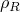 在零压力和初始温度  下指定：


| **输入文件用法：** | ``` [*FLUID DENSITY](../key/key-link.md#usb-kws-mfluiddensity) ``` |
| --- | --- |

| **Abaqus/CAE 用法：** | 相互作用模块：**Create Interaction Property**：**Fluid cavity**：**Definition**：**Hydraulic**：**Fluid density**：*density* |
| --- | --- |

#### 定义可压缩性的流体体积模量

可压缩性由流体的体积模量描述：


其中

*p*

是当前压力，


是当前温度，

*K*

是流体体积模量，


是当前流体体积，

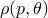

是当前压力和温度下的密度，

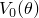

是零压力和当前温度下的流体体积，


是零压力和初始温度下的流体体积，以及

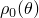

是零压力和当前温度下的密度。

假定体积模量与流体密度变化无关。但是，可以将体积模量指定为温度或预定义场变量的函数。

| **输入文件用法：** | ``` [*FLUID BULK MODULUS](../key/key-link.md#usb-kws-mfluidbulk) ``` |
| --- | --- |

| **Abaqus/CAE 用法：** | 相互作用模块：**Create Interaction Property**：**Fluid cavity**：**Definition**：**Hydraulic**：**Fluid Bulk Modulus** 选项卡页面：切换打开 **Specify fluid bulk modulus**，并在表格中输入模量值 |
|  | 使用以下选项包含温度和场变量依赖性：切换打开 **Use temperature-dependent data**，**Number of field variables**：*n* |

#### 定义流体膨胀

热膨胀系数被解释为从参考温度的总膨胀系数，可以指定为温度或预定义场变量的函数。由于热膨胀引起的流体体积变化如下确定：

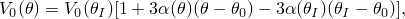

其中  是热膨胀系数的参考温度，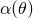 是平均（割线）热膨胀系数。

如果热膨胀系数不是温度或场变量的函数，则不需要  的值。

热膨胀也可以用流体密度表示：


| **输入文件用法：** | ``` [*FLUID EXPANSION](../key/key-link.md#usb-kws-mfluidexpansion), ZERO= ``` |
| --- | --- |

| **Abaqus/CAE 用法：** | 相互作用模块：**Create Interaction Property**：**Fluid cavity**：**Definition**：**Hydraulic**：**Fluid Expansion** 选项卡页面：切换打开 **Specify fluid thermal expansion coefficients**，并在表格中输入平均热膨胀系数 |
|  | 使用以下选项包含温度和场变量依赖性：切换打开 **Use temperature-dependent data**，**Reference temperature**：，**Number of field variables**：*n* |

### 气动流体

可压缩或气动流体建模为理想气体（参见 ["状态方程," 第 25.2.1 节"](pt05ch25s02abm50.md)）。理想气体（或理想气体定律）的状态方程给出为


其中绝对（或总）压力 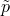 定义为


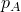 是环境压力，*p* 是表压，*R* 是气体常数， 是当前温度， 是所用温标上的绝对零度。气体常数 *R* 也可以从通用气体常数  和分子量  确定，如下所示：

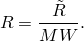

质量守恒给出流体空腔中质量的变化为

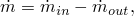

其中 *m* 是流体的质量， 是流入流体空腔的质量流率，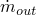 是流出流体空腔的质量流率。

#### 定义分子量

必须指定理想气体的分子量  的值。

| **输入文件用法：** | ``` [*MOLECULAR WEIGHT](../key/key-link.md#usb-kws-mmolecularweight)  ``` |
| --- | --- |

| **Abaqus/CAE 用法：** | 相互作用模块：**Create Interaction Property**：**Fluid cavity**：**Definition**：**Pneumatic**，**Ideal gas molecular weight**： |
| --- | --- |

#### 指定通用气体常数的值

您可以指定通用气体常数  的值。

| **输入文件用法：** | ``` [*PHYSICAL CONSTANTS](../key/key-link.md#usb-kws-mphysicalconsts), UNIVERSAL GAS CONSTANT= ``` |
| --- | --- |

| **Abaqus/CAE 用法：** | 所有模块：**Model****Edit attributes****model name****：Physical Constants**：切换打开 **Universal gas constant**： |
| --- | --- |

#### 指定绝对零度的值

您可以指定绝对零温度  的值。

| **输入文件用法：** | ``` [*PHYSICAL CONSTANTS](../key/key-link.md#usb-kws-mphysicalconsts), ABSOLUTE ZERO= ``` |
| --- | --- |

| **Abaqus/CAE 用法：** | 所有模块：**Model****Edit attributes****model name****：Physical Constants**：切换打开 **Absolute zero temperature**： |
| --- | --- |

#### 绝热过程

默认情况下，流体温度由空腔参考节点上的预定义温度场定义。然而，对于快速事件，在 Abaqus/Explicit 中可以根据绝热过程中假设的能量守恒来确定流体温度。有了这个假设，除了通过流体交换定义或充气机进行传输外，没有热量从空腔中添加或移除。绝热过程通常非常适合对气囊部署进行建模。在部署过程中，气体从充气机以高压喷出，并在大气压下膨胀时冷却。膨胀非常迅速，以至于没有显著的热量可以从空腔中扩散出去。

能量方程可以从热力学第一定律获得。通过忽略动能和势能，流体空腔的能量方程给出为


其中流体空腔膨胀所做的功给出为

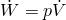

是由于通过流体空腔表面的热传递导致的热能流率。 的正值将从主流体空腔中产生热能流出。比能给出为

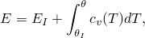

其中  是初始温度  下的初始比能， 是定容比热（或定容热容），对于理想气体仅取决于温度，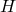 是比焓，*V* 是气体占有的体积。根据定义，比焓为

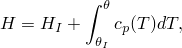

其中  是初始（或参考）温度  下的初始比焓，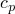 是定压比热，对于理想气体仅取决于温度。通过求解理想气体定律、能量平衡和质量守恒可以获得气体的压力、温度和密度。

如果使用绝热或耦合过程，将始终对流体空腔使用绝热行为。

| **输入文件用法：** | ``` [*FLUID CAVITY](../key/key-link.md#usb-kws-mfluidcavity), ADIABATIC ``` |
| --- | --- |

| **Abaqus/CAE 用法：** | 相互作用模块：**Create Interaction**：**Fluid cavity**：**Property definition**：**Pneumatic**，切换打开 **Use adiabatic behavior** |
| --- | --- |

#### 定义定压热容

在模拟理想气体的绝热过程时，必须指定定压热容。它可以用多项式形式或表格形式定义。多项式形式基于美国国家标准与技术研究院的舒马特方程。定压摩尔热容可以表示为

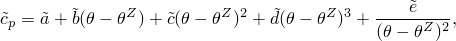

其中系数 、、、 和 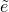 是气体常数。这些气体常数与分子量一起列于 [表 11.5.2-1](pt04ch11s05aus71.md#table-gasproperties) 中，用于一些常用于气囊模拟的气体。然后可以通过以下方式获得定压热容


定容热容  可以通过以下方式确定

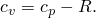

**表 11.5.2-1** 一些常用气体的属性（SI 单位）。
| 气体 | MW |  |  |  |  |  |  |
| --- | --- | --- | --- | --- | --- | --- | --- |
| ( 103) | ( 106) | ( 109) | ( 106) | (kelvin) |
| Air | 0.0289 | 28.110 | 1.967 | 4.802 | 1.966 | 0.0 | 273-1800 |
| Nitrogen | 0.028 | 26.092 | 8.218 | -1.976 | 0.1592 | 0.0444 | 298-6000 |
| Oxygen | 0.032 | 29.659 | 6.137 | -1.186 | 0.0957 | -0.219 | 298-6000 |
| Hydrogen | 0.00202 | 33.066 | 11.36 | 11.432 | -2.772 | -0.158 | 273-1000 |
| Carbon monoxide | 0.028 | 25.567 | 6.096 | 4.054 | 2.671 | 0.131 | 298-1300 |
| Carbon dioxide | 0.044 | 24.997 | 55.186 | 33.691 | 7.948 | -0.136 | 298-1200 |
| Water vapor | 0.0180 | 32.240 | 1.923 | 0.105 | 3.595 | 0.0 | 273-1800 |

您可以使用多项式形式指定定压热容，在这种情况下，您可以输入系数 、、、 和 。或者，您可以定义定压热容相对于温度和任何预定义场变量的表格。

| **输入文件用法：** | 使用以下选项以多项式形式指定热容： |
| --- | --- |
|  | ``` [*CAPACITY](../key/key-link.md#usb-kws-mcapacity), TYPE=POLYNOMIAL , , , ,  ``` 使用以下选项以表格形式指定热容： ``` [*CAPACITY](../key/key-link.md#usb-kws-mcapacity), TYPE=TABULAR, DEPENDENCIES=*n* , *temperature, field_variable_1, etc...* *...* ``` |

| **Abaqus/CAE 用法：** | 使用以下选项以多项式形式指定热容： |
| --- | --- |
|  | 相互作用模块：**Create Interaction Property**：**Fluid cavity**：**Definition**：**Pneumatic**，切换打开 **Specify molar heat capacity**：**Polynomial**，**Polynomial Coefficients**：, , , ,  使用以下选项以表格形式指定热容：相互作用模块：**Create Interaction Property**：**Fluid cavity**：**Definition**：**Pneumatic**：切换打开 **Specify molar heat capacity**：**Tabular**：输入摩尔热容 使用以下选项在表格中包含温度和场变量依赖性：切换打开 **Use temperature-dependent data**，**Number of field variables**：*n* |

### 理想气体混合物

Abaqus/Explicit 可以在流体空腔中建模理想气体混合物。对于理想气体混合物，使用阿马加特-勒杜克偏体积规则来获得摩尔平均热属性的估计（Van Wylen and Sonntag, 1985）。让每个物种具有定压和定容热容 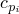 和 ；分子量 ；和质量分数 。则混合气体的定压和定容热容由下式给出

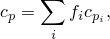

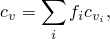

分子量由下式给出

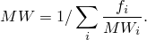

混合气体的比能和比焓由下式给出


进入流体空腔的能量流给出为


流出流体空腔的能量流给出为


使用上述理想气体混合物的属性，可以从理想气体定律和能量方程获得压力和温度。

### 多流体空腔的平均属性

如果为包含多个流体空腔的节点集请求空腔内部状态的输出，则多流体空腔的平均属性也将自动输出。平均压力通过体积加权空腔压力贡献计算。对于绝热理想气体，平均温度通过质量加权空腔温度贡献获得。让每个流体空腔具有压力 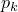、温度 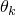、体积 、气体常数  和质量 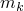。则流体空腔簇的平均压力定义为


平均温度为


#### 附加参考文献

- Van Wylen, G. J., and R. E. Sonntag, *Fundamentals of Classical Thermodynamics, *Wiley, New York, 1985.
