# 11.5.3 流体交换定义

**产品：** Abaqus/Standard  Abaqus/Explicit  Abaqus/CAE

##### **参考文献**

- ["基于表面的流体空腔：概述," 第 11.5.1 节"](pt04ch11s05aus70.md)
- ["流体空腔定义," 第 11.5.2 节"](pt04ch11s05aus71.md)
- [*FLUID EXCHANGE](../key/key-link.md#usb-kws-mfluidexchange)
- [*FLUID EXCHANGE PROPERTY](../key/key-link.md#usb-kws-mfluidexchangeprop)
- [*FLUID EXCHANGE ACTIVATION](../key/key-link.md#usb-kws-hfluidexchangeinte)
- ["VUFLUIDEXCH," Abaqus 用户子程序参考指南第 1.2.15 节](../sub/sub-link.md#sub-rtn-uexpfluexch)
- ["VUFLUIDEXCHEFFAREA," Abaqus 用户子程序参考指南第 1.2.16 节](../sub/sub-link.md#sub-rtn-uexpfluexcheffarea)
- ["定义流体交换相互作用," Abaqus/CAE 用户指南第 15.13.12 节](../usi/usi-link.md#usi-itn-help-fluid-exchange)
- ["定义流体交换相互作用属性," Abaqus/CAE 用户指南第 15.14.5 节](../usi/usi-link.md#usi-itn-help-prop-fluid-exchange)

### 概述

流体交换定义：
- 可用于模拟单一流体空腔与其环境之间的流动，或两个流体空腔之间的流动；
- 可用于规定流入或流出空腔的基于质量或体积的通量；
- 可模拟通过排气孔口的空腔排气；
- 可模拟通过空腔壁的流动，例如通过多孔织物的泄漏；
- 可用于规定由于热传递而通过空腔表面的热损失；
- 可考虑局部材料状态；
- 可考虑由接触边界表面导致的阻塞；以及
- 具有可用于识别空腔质量流率历史输出的名称。

### 定义流体交换

流体交换功能非常通用，可用于将流入或流出空腔的流动定义为规定函数或基于分析条件产生的压力差。Abaqus/Standard 中的流动行为基于质量流体流动，Abaqus/Explicit 中的行为可基于质量流体流动或热能流动。您必须将流体交换定义与一个名称关联。

| **输入文件用法：** | ``` [*FLUID EXCHANGE](../key/key-link.md#usb-kws-mfluidexchange), NAME=*name* ``` |
| --- | --- |

| **Abaqus/CAE 用法：** | 相互作用模块：**Create Interaction**：**Fluid exchange**，**Name**：*name* |
| --- | --- |

#### 单一空腔与其环境之间的流动

要定义流体空腔与其环境之间的流动，请指定与流体空腔关联的单个参考节点。在接下来的讨论中，这个流体空腔称为主空腔。当流动被定义为规定函数时，流动可以流入或流出主空腔。如果流动是流入空腔，则流入材料的属性假定为流入瞬间空腔中材料的属性。当流动行为基于分析条件时，质量流动只能流出主空腔，但热能流动可以流入或流出主空腔。对于质量流动的情况，Abaqus 将使用流体空腔压力和指定的恒定环境压力来计算用于确定质量流率的压力差。对于热能流动的情况，Abaqus/Explicit 将使用流体空腔温度和指定的恒定环境温度来计算用于确定热能流率的温度差。

| **输入文件用法：** | 使用以下选项： |
| --- | --- |
|  | ``` [*FLUID CAVITY](../key/key-link.md#usb-kws-mfluidcavity), NAME=*primary_cavity_name*, REF NODE=*primary_cavity_reference_node* [*FLUID EXCHANGE](../key/key-link.md#usb-kws-mfluidexchange), NAME=*fluid_exchange_name* *primary_cavity_reference_node* ``` |

| **Abaqus/CAE 用法：** | 相互作用模块：**Create Interaction**：**Fluid exchange**：**Definition**：**To environment**，**Fluid cavity interaction**：*name*，**Fluid exchange property**：*name* |
| --- | --- |

#### 两个流体空腔之间的流动

要定义两个流体空腔之间的流动，请指定主流体空腔和次流体空腔关联的参考节点。当流动基于分析条件时，流体将从高压或上游空腔流向低压或下游空腔，热能将从高温流向低温。

| **输入文件用法：** | 使用以下选项： |
| --- | --- |
|  | ``` [*FLUID CAVITY](../key/key-link.md#usb-kws-mfluidcavity), NAME=*primary_cavity_name*, REF NODE=*primary_cavity_reference_node* [*FLUID CAVITY](../key/key-link.md#usb-kws-mfluidcavity), NAME=*secondary_cavity_name*, REF NODE=*secondary_cavity_reference_node* [*FLUID EXCHANGE](../key/key-link.md#usb-kws-mfluidexchange), NAME=*fluid_exchange_name* *primary_cavity_reference_node, secondary_cavity_reference_node* ``` |

| **Abaqus/CAE 用法：** | 相互作用模块：**Create Interaction**：**Fluid exchange**：**Definition**：**Between cavities**，**Fluid cavity interaction 1**：*name*，**Fluid cavity interaction 2**：*name*，**Fluid exchange property**：*name* |
| --- | --- |

#### 在 Abaqus/Explicit 分析中指定有效面积

任何流体交换属性的主空腔的流率与有效泄漏面积成正比。泄漏面积可能代表排气孔口的大小、包围空腔的多孔织物的面积，或空腔之间管道的大小。

在 Abaqus/Explicit 分析中，您可以直接指定有效泄漏面积的值。或者，您可以通过指定包围主流体空腔边界上的表面名称来定义代表泄漏面积的表面。流体交换的有效面积基于表面的面积，除非您直接指定面积或使用用户子程序 [`VUFLUIDEXCHEFFAREA`](../sub/sub-link.md#sub-xsl-vufluidexcheffarea) 定义有效面积。如果同时指定了有效面积和表面，则表面的面积仅用于确定阻塞；参见下文 ["考虑接触边界表面导致的阻塞"](pt04ch11s05aus72.md#usb-anl-afluidcavityexchange-blockage)。如果未指定面积，则有效面积默认为 1.0。

如果需要将泄漏建模为指定表面底层单元材料状态的函数，您也可以使用用户子程序 [`VUFLUIDEXCHEFFAREA`](../sub/sub-link.md#sub-xsl-vufluidexcheffarea) 定义有效泄漏面积（参见 ["VUFLUIDEXCHEFFAREA," Abaqus 用户子程序参考指南第 1.2.16 节](../sub/sub-link.md#sub-rtn-uexpfluexcheffarea)）。例如，此子程序可用于在单元级别定义泄漏面积，以对未涂覆气囊中的织物渗透性进行建模，其中泄漏可以根据纱线方向的应变和织物纱线之间的角度局部变化。仅膜单元支持与 [`VUFLUIDEXCHEFFAREA`](../sub/sub-link.md#sub-xsl-vufluidexcheffarea) 一起使用。

| **输入文件用法：** | 使用以下选项直接指定有效泄漏面积并指定代表泄漏面积的表面： |
| --- | --- |
|  | ``` [*FLUID EXCHANGE](../key/key-link.md#usb-kws-mfluidexchange), EFFECTIVE AREA=*effective_area*, SURFACE=*surface_name* ``` 使用以下选项使用用户子程序定义有效泄漏面积： ``` [*FLUID EXCHANGE](../key/key-link.md#usb-kws-mfluidexchange), EFFECTIVE AREA=USER, SURFACE=*surface_name* ``` |

| **Abaqus/CAE 用法：** | 相互作用模块：**Create Interaction**：**Fluid exchange**：**Effective exchange area**：*effective_area* |
| --- | --- |
|  | 在 Abaqus/CAE 中不支持用户子程序 [`VUFLUIDEXCHEFFAREA`](../sub/sub-link.md#sub-xsl-vufluidexcheffarea)。 |

#### 流体空腔压力在流体交换表面上的应用

您可以控制空腔压力对流体交换表面的影响如何在 Abaqus/Explicit 中计算。默认情况下，空腔压力在所有流体交换表面节点上产生力，使用与其他流体空腔部分相同的方法。可选地，流体交换表面上的空腔压力的合力可以仅分布在位于流体交换表面周线上的节点上（例如，对于 [图 11.5.3-1](pt04ch11s05aus72.md#usb-anl-afluidcavityexchange-initial-nls) 中所示的流体交换表面上的节点，仅位置 A 和 B 的节点位于周线上）。此选项可用于避免通气表面的局部鼓出，否则会导致泄漏面积计算不准确。[图 11.5.3-2](pt04ch11s05aus72.md#usb-anl-afluidcavityexchange-deformed-nls) 显示了当空腔压力力分布在通气表面所有节点上时发生鼓出的示例。

**图 11.5.3-1** 流体交换表面的初始构型。


**图 11.5.3-2** 流体交换表面的变形构型。

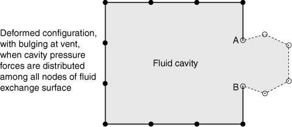

| **输入文件用法：** | 使用以下选项（默认）指示流体压力应在流体交换表面的所有节点上产生力： |
| --- | --- |
|  | ``` [*FLUID EXCHANGE](../key/key-link.md#usb-kws-mfluidexchange), CAVITY PRESSURE=SURFACE, SURFACE=*surface_name* ``` 使用以下选项指示流体压力应仅在流体交换的周线节点上产生力： ``` [*FLUID EXCHANGE](../key/key-link.md#usb-kws-mfluidexchange), CAVITY PRESSURE=PERIMETER, SURFACE=*surface_name* ``` |

| **Abaqus/CAE 用法：** | 您无法在 Abaqus/CAE 中更改默认压力应用。压力始终应用于所有流体交换表面节点。 |
| --- | --- |

### 定义流体交换属性

Abaqus 中有多种不同的流体交换属性可用于定义从流体空腔到环境或两个空腔之间的流动率。流体交换属性可以像直接规定质量或体积流率一样简单。更复杂的泄漏机制（例如汽车气囊上发现的那些）可以通过将质量或体积泄漏率定义为压力差 、绝对压力  和温度  的函数来建模。在 Abaqus/Explicit 中，由于通过空腔表面的热传递导致的热损失可以通过直接规定热能流率或将热能流率定义为温度差 、绝对压力  和温度  的函数来建模。或者，在 Abaqus/Explicit 中，质量流率和/或热能流率可以在用户子程序 [`VUFLUIDEXCH`](../sub/sub-link.md#sub-xsl-vufluidexch) 中指定。

为了评估两个空腔之间的质量流率，绝对压力和温度取自高压或上游空腔。质量流动始终从高压空腔流向低压或下游空腔，热能流动始终从高温空腔流向低温空腔。空腔绝对压力和温度始终用于计算空腔与环境之间以及空腔之间的流动。

您必须将流体交换属性与一个名称关联。然后可以使用此名称将特定属性与流体交换定义相关联。

| **输入文件用法：** | 使用以下选项： |
| --- | --- |
|  | ``` [*FLUID EXCHANGE](../key/key-link.md#usb-kws-mfluidexchange), NAME=*fluid_exchange_name*, PROPERTY=*property_name* [*FLUID EXCHANGE PROPERTY](../key/key-link.md#usb-kws-mfluidexchangeprop), NAME=*property_name* ``` |

| **Abaqus/CAE 用法：** | 相互作用模块：**Create Interaction Property**：**Fluid exchange**，**Name**：*property_name* |
| --- | --- |

#### 规定质量或体积通量

流入或流出主流体空腔的流体通量可以通过规定单位面积质量流率  直接定义。质量流率为


其中 *A* 是有效面积。

流体通量也可以通过规定单位面积体积流率  来定义。质量流率为

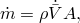

其中  是密度。

 或  的负值将产生流入主流体空腔的通量。当未定义第二个流体空腔时，假定流入主空腔的流体状态与主空腔中已存在的流体状态相同。

| **输入文件用法：** | 基于质量流率规定通量： |
| --- | --- |
|  | ``` [*FLUID EXCHANGE PROPERTY](../key/key-link.md#usb-kws-mfluidexchangeprop), TYPE=MASS FLUX ``` 基于体积流率规定通量： ``` [*FLUID EXCHANGE PROPERTY](../key/key-link.md#usb-kws-mfluidexchangeprop), TYPE=VOLUME FLUX ``` |

| **Abaqus/CAE 用法：** | 相互作用模块：**Create Interaction Property**：**Fluid exchange**：**Definition**：**Mass flux** 或 **Volume flux** |
| --- | --- |

#### 使用粘性和 hydrodynamic 阻力系数规定流率

质量流率  可以通过粘性和 hydrodynamic 阻力系数与压力差相关，如


其中  是压力差，*A* 是有效面积， 是粘性阻力系数， 是 hydrodynamic 阻力系数。阻力系数可以是平均绝对压力、平均温度和任何用户定义场变量平均值的函数。 的正值对应于从第一个空腔流出的流动。

| **输入文件用法：** | ``` [*FLUID EXCHANGE PROPERTY](../key/key-link.md#usb-kws-mfluidexchangeprop), TYPE=BULK VISCOSITY, DEPENDENCIES=*n* *viscous resistance coefficient (), hydrodynamic resistance coefficient ()* ``` |
| --- | --- |

| **Abaqus/CAE 用法：** | 相互作用模块：**Create Interaction Property**：**Fluid exchange**：**Definition**：**Bulk viscosity**：**Viscous coefficient**：：**Hydrodynamic coefficient**： |
| --- | --- |
|  | 使用以下选项包含压力、温度和场变量依赖性：切换打开 **Use pressure-dependent data**，切换打开 **Use temperature-dependent data**，**Number of field variables**：*n* |

#### 规定通过通风或排气孔口的流率

通过可近似为一维、准稳态和等熵流动的通风或排气孔口的质量流率给出为（Bird, Stewart and Lightfoot, 2002）


其中 *C* 是无量纲流量系数，*A* 是通风或排气孔口面积， 是上游流体空腔中的温度， 是所用温标上的绝对零度，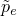 是上游流体空腔中的绝对压力。压力比 *q* 定义为

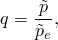

其中  是孔口内的绝对压力。发生壅塞或声速流动的临界压力  定义为

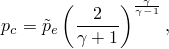

其中  是定压热容  与定容热容  的比值：

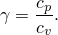

然后孔口压力  由下式给出

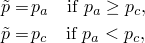

其中  对于从单一流体空腔流出等于环境压力，对于两个流体空腔之间的流动等于下游空腔压力。

流量系数的值可以是绝对上游压力、上游温度和任何用户定义场变量的函数。通过通风或排气孔口的流体交换仅对气动流体有效，仅在 Abaqus/Explicit 中可用。

| **输入文件用法：** | ``` [*FLUID EXCHANGE PROPERTY](../key/key-link.md#usb-kws-mfluidexchangeprop), TYPE=ORIFICE, DEPENDENCIES=*n* *discharge coefficient* ``` |
| --- | --- |

| **Abaqus/CAE 用法：** | 在 Abaqus/CAE 中不支持通过通风或孔口的流体交换。 |
| --- | --- |

#### 规定由于织物泄漏的流率

由于通过织物泄漏的质量流率可以表示为

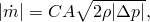

其中 *C* 是无量纲织物泄漏或流量系数，*A* 是有效织物泄漏面积。

流量系数的值可以是绝对上游压力、上游温度和任何用户定义场变量的函数。

| **输入文件用法：** | ``` [*FLUID EXCHANGE PROPERTY](../key/key-link.md#usb-kws-mfluidexchangeprop), TYPE=FABRIC LEAKAGE, DEPENDENCIES=*n* *discharge coefficient* ``` |
| --- | --- |

| **Abaqus/CAE 用法：** | 在 Abaqus/CAE 中不支持定义由于织物泄漏的流体交换。 |
| --- | --- |

#### 规定质量流率与压力差的关系表

总质量流率可以从规定的单位面积质量流率  通过以下公式计算

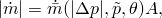

其中 *A* 是有效面积。

在这种情况下，您可以定义单位面积质量流率表，取决于压力差的绝对值，以及可选地取决于平均绝对压力、平均温度和任何用户定义场变量的平均值。 和  的值必须为正并从零开始。

| **输入文件用法：** | ``` [*FLUID EXCHANGE PROPERTY](../key/key-link.md#usb-kws-mfluidexchangeprop), TYPE=MASS RATE LEAKAGE, DEPENDENCIES=*n* 0, 0 ,  ... ``` |
| --- | --- |

| **Abaqus/CAE 用法：** | 相互作用模块：**Create Interaction Property**：**Fluid exchange**：**Definition**：**Mass rate leakage**：**Mass Flow Rate**：，**Pressure Difference**： |
| --- | --- |
|  | 使用以下选项包含压力、温度和场变量依赖性：切换打开 **Use pressure-dependent data**，切换打开 **Use temperature-dependent data**，**Number of field variables**：*n* |

#### 规定体积流率与压力差的关系表

总质量流率可以从规定的单位面积体积流率  通过以下公式计算


其中 *A* 是有效面积， 是密度。

在这种情况下，您可以定义单位面积体积流率表，取决于压力差的绝对值，以及可选地取决于平均绝对压力、平均温度和任何用户定义场变量的平均值。 和 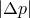 的值必须为正并从零开始。

| **输入文件用法：** | ``` [*FLUID EXCHANGE PROPERTY](../key/key-link.md#usb-kws-mfluidexchangeprop), TYPE=VOLUME RATE LEAKAGE, DEPENDENCIES=*n* 0, 0 ,  ... ``` |
| --- | --- |

| **Abaqus/CAE 用法：** | 相互作用模块：**Create Interaction Property**：**Fluid exchange**：**Definition**：**Volume rate leakage**：**Volumetric Flow Rate**：，**Pressure Difference**： |
| --- | --- |
|  | 使用以下选项包含压力、温度和场变量依赖性：切换打开 **Use pressure-dependent data**，切换打开 **Use temperature-dependent data**，**Number of field variables**：*n* |

#### 规定热能通量

在 Abaqus/Explicit 中，流入或流出主流体空腔的热能通量可以通过规定单位面积热能流率 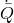 直接定义。热能流率为

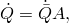

其中 *A* 是有效面积。 的正值从主流体空腔产生热通量。

| **输入文件用法：** | ``` [*FLUID EXCHANGE PROPERTY](../key/key-link.md#usb-kws-mfluidexchangeprop), TYPE=ENERGY FLUX ``` |
| --- | --- |

| **Abaqus/CAE 用法：** | 在 Abaqus/CAE 中不支持通过规定热能流率来定义流体交换。 |
| --- | --- |

#### 规定热能流率与温度差的关系表

总热能流率可以从规定的单位面积热能流率  通过以下公式计算


其中 *A* 是有效面积。

在这种情况下，在 Abaqus/Explicit 中，您可以定义单位面积热能流率表，取决于温度差的绝对值，以及可选地取决于平均绝对压力、平均温度和任何用户定义场变量的平均值。 和  的值必须为正并从零开始。

| **输入文件用法：** | ``` [*FLUID EXCHANGE PROPERTY](../key/key-link.md#usb-kws-mfluidexchangeprop), TYPE=ENERGY RATE LEAKAGE, DEPENDENCIES=*n* 0, 0 ,  ... ``` |
| --- | --- |

| **Abaqus/CAE 用法：** | 在 Abaqus/CAE 中不支持通过将热能流率定义为温度差和压力的函数来定义流体交换。 |
| --- | --- |

#### 使用用户子程序规定质量流率和/或热能流率

在 Abaqus/Explicit 中，质量流率  或总热能流率  可以使用用户子程序 [`VUFLUIDEXCH`](../sub/sub-link.md#sub-xsl-vufluidexch) 定义（参见 ["VUFLUIDEXCH," Abaqus 用户子程序参考指南第 1.2.15 节](../sub/sub-link.md#sub-rtn-uexpfluexch)）。

| **输入文件用法：** | ``` [*FLUID EXCHANGE PROPERTY](../key/key-link.md#usb-kws-mfluidexchangeprop), TYPE=USER ``` |
| --- | --- |

| **Abaqus/CAE 用法：** | 在 Abaqus/CAE 中不支持用户子程序 [`VUFLUIDEXCH`](../sub/sub-link.md#sub-xsl-vufluidexch)。 |
| --- | --- |

### 在 Abaqus/Explicit 中激活流体交换定义

在分析步骤中激活流体交换定义之前，Abaqus/Explicit 中不会发生流体交换。

| **输入文件用法：** | 使用以下选项激活给定分析步骤的流体交换： |
| --- | --- |
|  | ``` [*FLUID EXCHANGE](../key/key-link.md#usb-kws-mfluidexchange), NAME=*fluid_exchange_name* [*FLUID EXCHANGE ACTIVATION](../key/key-link.md#usb-kws-hfluidexchangeinte) *fluid_exchange_name* ``` |

| **Abaqus/CAE 用法：** | 在 Abaqus/CAE 中，流体交换对 Abaqus/Explicit 步骤自动激活。 |
| --- | --- |

#### 改变流动幅度

默认情况下，流动幅度基于指定的流动行为。可以通过振幅曲线引入步骤中流动幅度的时间变化。基于指定流动行为的幅度值乘以振幅值，以获得实际的质量或热能流率。例如，可以定义规定质量或体积通量的时间变化。

振幅曲线可用于在步骤中间触发流体交换事件。例如，气囊可能在步骤中的某个预定时间展开，并且可能需要关闭所有排气孔口直到实际展开。可以使用从零开始并在展开时间跃升的步骤振幅曲线来实现此目的。

| **输入文件用法：** | 使用以下选项： |
| --- | --- |
|  | ``` [*AMPLITUDE](../key/key-link.md#usb-kws-mamplitude), NAME=*amplitude_name* [*FLUID EXCHANGE ACTIVATION](../key/key-link.md#usb-kws-hfluidexchangeinte), AMPLITUDE=*amplitude_name* ``` |

| **Abaqus/CAE 用法：** | 在 Abaqus/CAE 中不支持使用振幅来激活流体交换。 |
| --- | --- |

#### 考虑接触边界表面导致的阻塞

Abaqus/Explicit 可以考虑由于接触表面导致的阻塞而从空腔流出。例如，从排气孔口流出可能被另一个接触表面覆盖而完全或部分阻塞。

阻塞可以为任何流体交换属性考虑。但是，必须在流体空腔边界上定义要检查接触阻塞的表面。Abaqus/Explicit 将计算未被接触表面阻塞的表面的面积分数，并将此分数应用于从空腔流出的质量或能量流率。您可以控制可能导致阻塞的表面组合。除非您指定它们可能造成阻塞，否则 Abaqus/Explicit 不会考虑接触表面导致阻塞（参见 ["接触阻塞," 第 37.1.4 节"](pt09ch37s01aus168.md)）。

| **输入文件用法：** | ``` [*FLUID EXCHANGE ACTIVATION](../key/key-link.md#usb-kws-hfluidexchangeinte), BLOCKAGE=YES ``` |
| --- | --- |

| **Abaqus/CAE 用法：** | 在 Abaqus/CAE 中不支持考虑接触边界表面导致的阻塞。 |
| --- | --- |

#### 限制流动方向

默认情况下，当流体交换定义中包含第二个节点时，流动可以双向流入和流出主流体空腔。此外，当在单一空腔与其环境之间定义流动时，热能流动可以双向发生。在这些情况下，您可以在 Abaqus/Explicit 中限制流动方向，使得流体或热能仅从主流体空腔流出。此方法仅适用于基于分析条件的流体交换定义，而非基于规定质量、体积或热能通量。

| **输入文件用法：** | ``` [*FLUID EXCHANGE ACTIVATION](../key/key-link.md#usb-kws-hfluidexchangeinte), OUTFLOW ONLY ``` |
| --- | --- |

| **Abaqus/CAE 用法：** | Abaqus/CAE 不支持限制流动方向。 |
| --- | --- |

#### 基于泄漏面积变化激活流体交换

在 Abaqus/Explicit 中，可以基于定义有效面积的表面面积变化来激活空腔之间的流动。您需要指定实际表面积与初始有效面积的比值，这代表触发流体交换的阈值。用于空腔之间（或空腔与环境之间）流体交换的有效面积是实际面积与初始面积之间的面积差。

| **输入文件用法：** | 使用以下选项： |
| --- | --- |
|  | ``` [*FLUID EXCHANGE](../key/key-link.md#usb-kws-mfluidexchange), SURFACE=*surface_name* [*FLUID EXCHANGE ACTIVATION](../key/key-link.md#usb-kws-hfluidexchangeinte), DELTA LEAKAGE AREA=*surface_ratio* ``` |

| **Abaqus/CAE 用法：** | Abaqus/CAE 不支持基于泄漏面积变化激活流体交换。 |
| --- | --- |

#### 多步骤中的激活

默认情况下，当您修改流体交换定义的激活或激活新的流体交换定义时，步骤中所有现有的流体交换激活保持不变。当修改现有激活时，所有适用数据必须重新指定。

激活的流体交换定义在后续步骤中保持激活状态，除非停用。您可以选择停用模型中的所有流体交换定义，并可选择重新激活新的流体交换定义。如果您在步骤中停用任何流体交换定义，则必须重新指定所有流体交换定义。

| **输入文件用法：** | 使用以下选项修改现有流体交换激活或指定附加流体交换激活（默认）： |
| --- | --- |
|  | ``` [*FLUID EXCHANGE ACTIVATION](../key/key-link.md#usb-kws-hfluidexchangeinte), OP=MOD ``` 使用以下选项停用模型中的所有流体交换定义并可选择重新激活新的： ``` [*FLUID EXCHANGE ACTIVATION](../key/key-link.md#usb-kws-hfluidexchangeinte), OP=NEW ``` |

| **Abaqus/CAE 用法：** | 在 Abaqus/CAE 中，所有步骤中的所有流体交换交互的流体交换激活是自动的。不允许修改或添加。 |
| --- | --- |

### 在 Abaqus/Standard 中规定质量通量

在 Abaqus/Standard 中，可以在步骤中改变空腔中的流体量。振幅曲线可用于定义特定步骤中的质量流率。

| **输入文件用法：** | 使用以下选项： |
| --- | --- |
|  | ``` [*AMPLITUDE](../key/key-link.md#usb-kws-mamplitude), NAME=*amplitude_name* [*FLUID FLUX](../key/key-link.md#usb-kws-hfluidflux), AMPLITUDE=*amplitude_name* ``` 使用以下选项修改现有流体通量或向空腔指定附加流体通量（默认）： ``` [*FLUID FLUX](../key/key-link.md#usb-kws-hfluidflux), OP=MOD ``` 使用以下选项停用模型中的所有流体通量定义并可选择重新激活新的： ``` [*FLUID FLUX](../key/key-link.md#usb-kws-hfluidflux), OP=NEW ``` |

| **Abaqus/CAE 用法：** | 在 Abaqus/CAE 中不支持使用流体通量修改质量流率。 |
| --- | --- |

#### 附加参考文献

- Bird, R. B., W. E. Stewart, and E. N. Lightfoot, *Transport Phenomena, *Wiley, New York, 2002.
