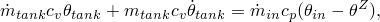
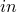
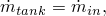
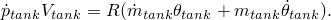
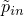
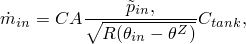
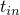
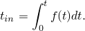

# 11.5.4 充气机定义

**产品：** Abaqus/Explicit

##### **参考文献**

- ["基于表面的流体空腔：概述," 第 11.5.1 节"](pt04ch11s05aus70.md)
- ["流体空腔定义," 第 11.5.2 节"](pt04ch11s05aus71.md)
- ["流体交换定义," 第 11.5.3 节"](pt04ch11s05aus72.md)
- [*FLUID INFLATOR](../key/key-link.md#usb-kws-mfluidinflator)
- [*FLUID INFLATOR PROPERTY](../key/key-link.md#usb-kws-mfluidinflatorproperty)
- [*FLUID INFLATOR ACTIVATION](../key/key-link.md#usb-kws-hfluidinflatorinte)

### 概述

充气机定义：
- 可用于充气流体空腔，以模拟用于气囊辅助约束系统的实际充气机；
- 可用与流体空腔中存在的不同的理想气体混合物充气流体空腔；
- 可直接指定或通过定义罐测试数据来指定；
- 具有可用于识别质量流率历史输出的名称；以及
- 可以在分析过程中的任何时间激活。

### 定义充气机

Abaqus/Explicit 中的充气机功能适合对用于气囊系统的充气机的流动特性进行建模。您必须将充气机定义与一个名称关联。您指定充气机将充满气体的流体空腔的参考节点。单个流体空腔可以有任意数量的充气机。

| **输入文件用法：** | ``` [*FLUID INFLATOR](../key/key-link.md#usb-kws-mfluidinflator), NAME=*name* *fluid_cavity_reference_node* ``` |
| --- | --- |

### 定义充气机属性

充气机属性将质量流率和温度定义为充气时间的函数，可以直接指定或通过输入罐测试数据来定义。它还定义了进入流体空腔的气体混合物。您必须将充气机属性与一个名称关联。然后可以使用此名称将特定属性与充气机定义相关联。

| **输入文件用法：** | 使用以下选项： |
| --- | --- |
|  | ``` [*FLUID INFLATOR](../key/key-link.md#usb-kws-mfluidinflator), NAME=*fluid_inflator_name*, PROPERTY=*property_name* [*FLUID INFLATOR PROPERTY](../key/key-link.md#usb-kws-mfluidinflatorproperty), NAME=*property_name* ``` |

#### 直接指定气体温度和质量流率

进入流体空腔的气体的温度和质量流率可以作为充气时间的函数直接给出。输入质量流率和温度与充气时间的关系表。

| **输入文件用法：** | ``` [*FLUID INFLATOR PROPERTY](../key/key-link.md#usb-kws-mfluidinflatorproperty), TYPE=TEMPERATURE AND MASS *inflation time, inflator gas temperature, inflator mass flow rate* ... ``` |
| --- | --- |

#### 使用罐测试数据

进入流体空腔的气体的质量流率和温度可以由罐测试的结果确定。在测试中，充气机排放到封闭的固定体积罐中，并测量罐中压力的时间历史。然后可以使用气体动力学方程从压力历史计算充气机质量流率。对于理想气体，绝热过程的能量守恒给出为



其中  是温度， 是所用温标上的绝对零度，下标  和  分别指充气机和刚性罐中的量。使用质量平衡



以及恒容理想气体的状态方程给出



可以通过组合上述方程找到质量流率


其中  是定压热容  与定容热容  的比值：


要使用罐测试的结果计算质量流率，请输入罐压力和充气机温度与充气时间的关系表，并指定罐的体积。

| **输入文件用法：** | ``` [*FLUID INFLATOR PROPERTY](../key/key-link.md#usb-kws-mfluidinflatorproperty), TYPE=TANK TEST, TANK VOLUME= *inflation time, inflator gas temperature, tank pressure* ... ``` |
| --- | --- |

#### 使用双压力法

如果在罐测试期间可以测量充气机压力  和罐压力  的时间历史曲线，则可以使用等熵流动假设计算充气机质量流率和温度（Wang and Nefske, 1988）。通过充气机孔口的质量流率可以描述为



其中 *C* 是流量系数，*A* 是有效面积，系数  通过假设壅塞或声速流动确定为


将刚性罐中获得的充气机质量流率表达式与上述表达式进行比较，充气机温度给出为


充气机质量流率为


要使用双压力法计算充气机质量流率和温度，请输入罐压力和充气机压力与充气时间的关系表；并指定罐的体积、有效面积和流量系数。必须指定罐体积和有效面积。流量系数的默认值为 0.4。

| **输入文件用法：** | ``` [*FLUID INFLATOR PROPERTY](../key/key-link.md#usb-kws-mfluidinflatorproperty), TYPE=DUAL PRESSURE, TANK VOLUME=, EFFECTIVE AREA=*A*, DISCHARGE COEFFICIENT=*C* *inflation time, inflator pressure, tank pressure* ... ``` |
| --- | --- |

#### 直接指定充气机压力和质量流率

您可以输入质量流率和充气机压力与充气时间的关系表，并指定有效面积和流量系数。充气机中的气体温度将使用等熵流动假设计算。必须指定有效面积。流量系数的默认值为 0.4。

| **输入文件用法：** | ``` [*FLUID INFLATOR PROPERTY](../key/key-link.md#usb-kws-mfluidinflatorproperty), TYPE=PRESSURE AND MASS, EFFECTIVE AREA=*A*, DISCHARGE COEFFICIENT=*C* *inflation time, inflator pressure, inflator mass flow rate* ... ``` |
| --- | --- |

#### 指定气体混合物

要定义充气机气体混合物，请指定用于充气机的气体物种数量，并输入流体行为名称列表和物种的质量分数或摩尔分数表。物种的质量分数或摩尔分数可以是充气时间的函数。在任何给定时间，物种的质量分数或摩尔分数之和应等于一。

| **输入文件用法：** | 使用以下选项根据质量分数指定气体混合物： |
| --- | --- |
|  | ``` [*FLUID INFLATOR PROPERTY](../key/key-link.md#usb-kws-mfluidinflatorproperty) [*FLUID INFLATOR MIXTURE](../key/key-link.md#usb-kws-mfluidinflatormixture), NUMBER SPECIES=*k*, TYPE=MASS FRACTION *fluid_behavior_name_1, fluid_behavior_name_2, etc.* *inflation time, mass fraction 1, mass fraction 2, etc.* ... ``` 使用以下选项根据摩尔分数指定气体混合物： ``` [*FLUID INFLATOR PROPERTY](../key/key-link.md#usb-kws-mfluidinflatorproperty) [*FLUID INFLATOR MIXTURE](../key/key-link.md#usb-kws-mfluidinflatormixture), NUMBER SPECIES=*k*, TYPE=MOLAR FRACTION *fluid_behavior_name_1, fluid_behavior_name_2, etc.* *inflation time, molar fraction 1, molar fraction 2, etc.* ... ``` |

### 激活充气机定义

除非在分析步骤中激活充气机定义，否则不会发生充气。

| **输入文件用法：** | 使用以下选项激活给定分析步骤的流体充气机： |
| --- | --- |
|  | ``` [*FLUID INFLATOR](../key/key-link.md#usb-kws-mfluidinflator), NAME=*fluid_inflator_name* [*FLUID INFLATOR ACTIVATION](../key/key-link.md#usb-kws-hfluidinflatorinte) *fluid_inflator_name* ``` |

#### 将充气时间与分析时间关联

充气机属性定义包括指定气体变量与充气时间的关系表。在 Abaqus/Explicit 中，充气时间  与振幅曲线  的值通过以下方式关联



通常振幅变化是一个阶跃函数，在应该展开气囊的时间从零跃升为一。这种振幅变化具有将充气时间从分析时间中偏移的效果。

| **输入文件用法：** | 使用以下选项： |
| --- | --- |
|  | ``` [*AMPLITUDE](../key/key-link.md#usb-kws-mamplitude), NAME=*amplitude_name* [*FLUID INFLATOR ACTIVATION](../key/key-link.md#usb-kws-hfluidinflatorinte), INFLATION TIME AMPLITUDE=*amplitude_name* ``` |

#### 修改质量流率

如果质量流率在充气机属性定义中直接规定，您可以在步骤中通过指定振幅定义来修改它。但是，如果质量流率是通过使用罐测试数据或双压力法计算的，振幅定义将被忽略。

| **输入文件用法：** | 使用以下选项： |
| --- | --- |
|  | ``` [*AMPLITUDE](../key/key-link.md#usb-kws-mamplitude), NAME=*amplitude_name* [*FLUID INFLATOR ACTIVATION](../key/key-link.md#usb-kws-hfluidinflatorinte), MASS FLOW AMPLITUDE=*amplitude_name* ``` |

#### 多步骤中的激活

默认情况下，当您修改充气机定义的激活或激活新的充气机定义时，步骤中所有现有的充气机激活保持不变。当修改现有激活时，所有适用参数必须重新指定。

激活的充气机定义在后续步骤中保持激活状态，除非停用。您可以选择停用模型中的所有充气机定义，并可选择重新激活新的充气机定义。如果您在步骤中停用任何充气机定义，则必须重新指定所有充气机定义。

| **输入文件用法：** | 使用以下选项修改现有充气机激活或指定附加充气机激活（默认）： |
| --- | --- |
|  | ``` [*FLUID INFLATOR ACTIVATION](../key/key-link.md#usb-kws-hfluidinflatorinte), OP=MOD ``` 使用以下选项停用模型中的所有充气机定义并可选择重新激活新的： ``` [*FLUID INFLATOR ACTIVATION](../key/key-link.md#usb-kws-hfluidinflatorinte), OP=NEW ``` |

#### 附加参考文献

- Wang, J. T., and O. J. Nefske, "A New CAL3D Airbag Inflation Model," SAE paper 880654, 1988.
