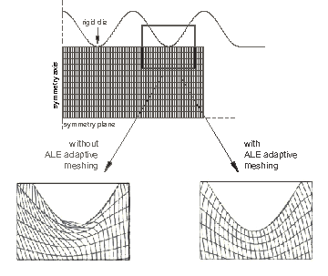
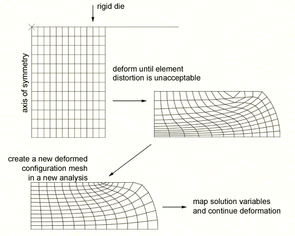

# 12.1.1 自适应技术

**产品：** Abaqus/Standard  Abaqus/Explicit  Abaqus/CAE  

##### **参考文献**

- ["ALE 自适应网格：概述，" 第 12.2.1 节"](pt04ch12s02abo14.md)
- ["自适应重新网格划分：概述，" 第 12.3.1 节"](pt04ch12s03abo15.md)
- ["网格到网格的解映射，" 第 12.4.1 节"](pt04ch12s04aus86.md)
- [*ADAPTIVE MESH](../key/key-link.md#usb-kws-hadaptivemesh)
- ["理解自适应重新网格划分，" Abaqus/CAE 用户指南第 17.13 节](../usi/usi-link.md#usi-mgn-conc-adaptivity)

### 概述

由次优网格划分产生的有限元离散化可能会限制您以合理的 CPU 成本获得足够分析结果的能力。本节概述了 Abaqus 中可用的自适应技术，帮助您优化网格，从而在控制分析成本的同时获得高质量的解决方案。"自适应"一词反映了 Abaqus 用来使网格适应您的分析目标的自适应或解相关过程。

### 选择自适应技术

Abaqus 中有三种自适应技术：任意拉格朗日-欧拉（ALE）自适应网格划分；变拓扑自适应重新网格划分；以及网格到网格的解映射，以实现重分区分析。[表 12.1.1-1](pt04ch12s01aus77.md#usb-anl-aadpchoicesover-adtech) 显示，自适应技术可根据以下方面进行分类：
- 它们实现特定目标（精度或网格畸变控制）的适用性；
- 它们对网格定义的影响，即通过平滑单个网格或通过生成多个不同的网格；以及
- 自适应相对于分析步骤发生的时间。

**表 12.1.1-1** 自适应技术的特征。
|  | 精度 | 畸变控制 | 单个网格 | 多个网格 | 自适应发生时间 |
| --- | --- | --- | --- | --- | --- |
| ALE 自适应网格 |  |  |  |  | 在整个步骤中 |
| 自适应重新网格划分 |  |  |  |  | 与分析步骤分开 |
| 网格到网格解映射 |  |  |  |  | 在分析步骤之间 |

#### ALE 自适应网格划分

任意拉格朗日-欧拉（ALE）自适应网格划分可控制网格畸变。ALE 自适应网格划分使用在分析步骤内逐步平滑的单个网格定义。ALE 自适应网格划分在 Abaqus/Standard 中适用于有限的应用，在 Abaqus/Explicit 中更普遍适用。术语 ALE 意味着广泛的分析方法范围，从纯拉格朗日分析（节点运动对应于材料运动）到纯欧拉分析（节点在空间中保持固定，材料"流动"通过单元）。通常 ALE 分析使用介于这两种极端之间的方法。ALE 功能不同于 Abaqus/Explicit 中的纯欧拉分析能力，具体描述见 ["欧拉分析，" 第 14.1.1 节"](pt04ch14s01aus90.md)。

您可以使用自适应网格划分来控制发生大变形或材料损失时的单元畸变。[图 12.1.1-1](pt04ch12s01aus77.md#aadaptivity-ale) 展示了一个案例，其中自适应网格划分限制了体积成形模拟中的网格畸变。

**图 12.1.1-1** 使用 ALE 自适应网格划分控制单元畸变。

与其他自适应技术不同，自适应网格划分对原始网格定义进行操作，因此仅在单个网格可以在整个模拟期间有效时才有用。网格通过网格节点的平滑进行自适应。这种平滑通常在分析步骤内频繁应用。ALE 自适应网格划分只需要一个分析作业。详见 ["ALE 自适应网格划分：概述，" 第 12.2.1 节"](pt04ch12s02abo14.md)。

#### 自适应重新网格划分（变拓扑自适应）

自适应重新网格划分通常用于精度控制，尽管在某些情况下也可用于畸变控制。自适应重新网格划分过程涉及迭代生成多个不同的网格，以确定在整个分析过程中使用的单个优化网格。自适应重新网格划分仅适用于从 Abaqus/CAE 提交的 Abaqus/Standard 分析。自适应重新网格划分的目标是获得满足您设置的网格离散误差指标目标的解决方案，同时最小化单元数量，从而控制分析成本。您可以使用自适应重新网格划分来获得在求解成本和所需精度之间取得平衡的网格。[图 12.1.1-2](pt04ch12s01aus77.md#aadaptivity-remesh) 展示了一个案例，其中自适应重新网格划分通过有针对性的网格细化提高了圆角周围应力结果的质量。

**图 12.1.1-2** 使用自适应重新网格划分提高应力结果的质量。

自适应重新网格划分涉及一个迭代过程，以确定在整个分析过程中使用的单个优化网格。迭代过程和重新网格划分在 Abaqus/CAE 中控制。每个连续的分析作业覆盖相同的模拟历史时间段，但使用不同的网格。一旦自适应重新网格划分过程完成，单个网格和单个分析作业代表您的整个分析历史。详见 ["自适应重新网格划分：概述，" 第 12.3.1 节"](pt04ch12s03abo15.md)，以及 ["理解自适应重新网格划分，" Abaqus/CAE 用户指南第 17.13 节](../usi/usi-link.md#usi-mgn-conc-adaptivity)。

#### 网格到网格解映射

网格到网格解映射仅在 Abaqus/Standard 中可用。您可以使用此技术通过替换网格并继续分析来控制发生大变形时的单元畸变。[图 12.1.1-3](pt04ch12s01aus77.md#aadaptivity-rezone) 展示了一个案例，其中解映射与新网格结合使用来克服与单元畸变相关的困难。

**图 12.1.1-3** 使用网格到网格解映射作为重分区技术的组成部分。

网格替换（即重分区）涉及创建多个 Abaqus 作业，每个作业代表模型在模拟历史的独特顺序期间的配置。当单个网格无法在整个模拟期间有效时，您可以使用网格替换。初始配置之后的每个网格都反映模型的解相关变形配置。因此，使用网格替换的分析是顺序依赖的，Abaqus 使用网格到网格的解映射将解变量从一个分析传播到下一个分析。与自适应重新网格划分相比，每个网格替换作业代表整体分析历史的一个组成部分——没有单个网格和单个分析作业代表您的整个分析。详见 ["网格到网格的解映射，" 第 12.4.1 节"](pt04ch12s04aus86.md)。

