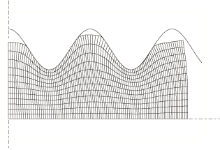
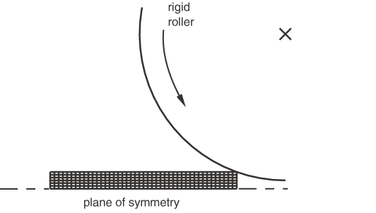
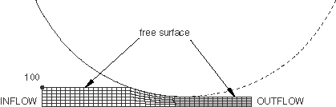

# 12.2.1 ALE 自适应网格划分：概述


Abaqus 中的自适应网格技术结合了纯拉格朗日分析和纯欧拉分析的特征。这种类型的自适应网格通常称为任意拉格朗日-欧拉（ALE）分析。Abaqus 文档通常将"ALE 自适应网格划分"简称为"自适应网格划分"。

ALE 自适应网格是一种工具，通过允许网格独立于材料移动，即使发生大变形或材料损失，也能保持整个分析过程中的高质量网格。ALE 自适应网格不会改变网格的拓扑结构（单元和连接），这意味着这种方法在极端变形时保持高质量网格的能力存在一些限制。请参阅 ["自适应技术，" 第 12.1.1 节"](pt04ch12s01aus77.md)，比较 ALE 自适应网格划分与其他 Abaqus 自适应方法。

ALE 自适应网格划分不同于 Abaqus/Explicit 中的纯欧拉分析能力。纯欧拉能力支持单个单元中的多种材料和空隙，这可以有效地处理涉及极端变形的分析（如流体流动）。相比之下，ALE 单元始终 100% 充满单一材料；虽然这种公式限制了模型中材料的变形为单元的变形，但它允许更精确地定义材料边界和更复杂的接触相互作用。有关纯欧拉分析的更多信息，请参阅 ["欧拉分析，" 第 14.1.1 节"](pt04ch14s01aus90.md)。

尽管自适应网格技术和用户界面在 Abaqus/Explicit 和 Abaqus/Standard 中相似，但用例和功能级别不同。Abaqus/Explicit 中的自适应网格适用于模拟大变形问题。它不会尝试最小化小变形分析中的离散误差。Abaqus/Standard 中的自适应网格适用于声学域和模拟材料烧蚀或磨损效应的建模。本节提供了 Abaqus/Explicit 和 Abaqus/Standard 中自适应重新网格划分功能的比较。

### ALE 自适应网格划分的特点

ALE 自适应网格划分：
- 通过允许网格独立于底层材料移动，通常可以在严重材料变形下保持高质量网格；和
- 在整个分析过程中保持拓扑相似的网格（即，不创建或销毁单元）。

在 Abaqus/Explicit ALE 自适应网格划分中：
- 可用于分析拉格朗日问题（没有材料离开网格）和欧拉问题（材料流过网格）；
- 可用作瞬态分析问题（经历大变形，如动态冲击、穿透和锻造问题）的连续自适应网格工具；
- 可用作模拟稳态过程（如挤压或轧制）的求解技术；和
- 可用于分析稳态过程中的瞬态阶段；和
- 可用于显式动力学（包括绝热热分析）和完全耦合的热-应力过程。

在 Abaqus/Standard ALE 自适应网格划分中：
- 可用于解决拉格朗日问题（没有材料离开网格）和模拟烧蚀或磨损效应（材料在边界处被侵蚀）；
- 可用于在结构预载导致声学域发生显著几何变化时更新声学网格；和
- 可用于几何非线性静态、稳态传输、耦合孔隙流体流动和应力以及耦合温度-位移过程。

### 激活 ALE 自适应网格划分

自适应网格可以应用于整个模型或模型的各个部分。将创建一个拉格朗日自适应网格域，以便整个域跟随最初位于其中的材料，这对于大多数结构分析来说是正确的物理解释。提供了用于控制网格的附加选项。在 Abaqus/Explicit 分析中，您可以定义欧拉边界以允许材料流入或流出所建模的域。

["ALE 自适应网格划分，" 第 12.2 节"](pt04ch12s02.md) 的后续部分描述了可与自适应网格配合使用的各种选项。尽管这些选项使您能够详细控制自适应网格，但对于许多拉格朗日问题来说并不必要。
- 要充分利用 Abaqus 中的所有自适应网格功能，重要的是要理解自适应网格域、边界区域、边界边、几何特征和网格约束的概念。这些概念在 ["在 Abaqus/Explicit 中定义 ALE 自适应网格域，" 第 12.2.2 节"](pt04ch12s02aus78.md) 和 ["在 Abaqus/Standard 中定义 ALE 自适应网格域，" 第 12.2.6 节"](pt04ch12s02aus82.md) 中进行了解释。这些部分还提供了关于向自适应网格边界施加边界条件、载荷和表面的说明。
- ["在 Abaqus/Explicit 中进行 ALE 自适应网格划分和重新映射，" 第 12.2.3 节"](pt04ch12s02aus79.md) 和 ["在 Abaqus/Standard 中进行 ALE 自适应网格划分和重新映射，" 第 12.2.7 节"](pt04ch12s02aus83.md) 概述了用于移动网格和将解变量重新映射到新网格的方法。这些部分还介绍了用于控制这些算法的选项。尽管默认方法已被选择为适用于各种问题，但您可能希望覆盖默认设置以平衡自适应网格的稳健性和效率，或将自适应网格的使用扩展到相对困难或不常见的应用。
- 提供了各种输出和诊断用于验证自适应网格域的形成和解释分析结果。这些选项在 ["在 Abaqus/Explicit 中进行 ALE 自适应网格划分的输出和诊断，" 第 12.2.5 节"](pt04ch12s02aus81.md) 中进行了解释。
- ["在 Abaqus/Explicit 中为欧拉自适应网格域建模技术，" 第 12.2.4 节"](pt04ch12s02aus80.md) 以示例和建模提示的形式提供了关于设置和解释使用自适应网格的 Abaqus/Explicit 中欧拉问题的建议。

| **输入文件用法：** | ``` [*ADAPTIVE MESH](../key/key-link.md#usb-kws-hadaptivemesh), ELSET=*elset_name* ``` |
| --- | --- |

| **Abaqus/CAE 用法：** | 步骤模块：****其他****ALE 自适应网格域****编辑**：切换开启**使用以下 ALE 自适应网格域**，然后点击**编辑**选择区域 |
| --- | --- |

### ALE 自适应网格划分的用途

自适应网格在各种问题中具有重要价值。Abaqus/Explicit 和 Abaqus/Standard 各自以提供最大价值的方式使用自适应网格在特定求解器中。

#### 在 Abaqus/Explicit 中的用途

在预期会发生大变形的问题中，自适应网格划分带来的网格质量改善可以防止分析因严重网格畸变而终止。在这些情况下，您可以使用自适应网格划分来获得比纯拉格朗日分析更快、更准确和更稳健的解决方案。

自适应网格划分对于金属成形工艺（如锻造、挤压和轧制）的模拟特别有效，因为这类问题通常涉及大量的不可恢复变形。由于产品的最终形状可能与原始形状截然不同，因此对于原始产品几何形状最佳的网格可能在过程后期变得不合适，因为大量的材料变形会导致严重的单元畸变和缠结。单元长宽比也可能在高应变集中区域下降。这些因素都可能导致精度损失、稳定时间增量减小，甚至问题终止。

#### 在 Abaqus/Standard 中的用途

您可以使用自适应网格划分使声学域网格跟随边界结构的大变形。在其他应用中，您可以使用自适应网格划分和自适应网格约束来模拟材料从域中任意大量的烧蚀或磨损。

声学区域的，自适应网格划分极大地扩展了声学分析程序的实用性。Abaqus 可用于模拟承受结构预载的耦合结构-声学系统的响应。默认情况下，结构-声学计算基于声学域的原始配置。只要流体和结构之间的边界在预载施加期间不经历大变形，这种近似就足够了。然而，当声学域的几何形状由于结构加载而发生显著变化时，必须更新原始声学配置。一个例子是承受充气、轮辋安装和胎面压力载荷的轮胎内部空腔。

Abaqus 中的声学单元没有力学行为，因此无法在结构经历大变形时模拟流体的变形。Abaqus/Standard 通过定期创建一个新的声学网格来解决问题，该网格使用与原始网格相同的拓扑结构，但节点位置已调整，使得结构-声学边界的变形不会导致声学单元的严重畸变。

然后在新声学网格相关的几何变化在后续耦合结构-声学分析中被考虑。然而，假设流体的材料属性（如密度）不会因网格平滑而改变。

自适应网格划分还可以通过允许您定义独立于底层材料运动的边界网格运动来模拟烧蚀或磨损效应。一个例子是轮胎在其使用寿命期间的磨损，这种效应会显著影响结构的性能。

### Abaqus/Explicit 和 Abaqus/Standard 中 ALE 自适应网格划分的比较

Abaqus/Explicit 中的自适应网格划分通常比 Abaqus/Standard 中的自适应网格划分更稳健，并提供更多用于控制网格的功能。

#### Abaqus/Explicit 中的 ALE 自适应网格划分

Abaqus/Explicit 中的自适应网格划分旨在处理各种问题类别，并采用多种平滑方法，您可以用来定制自适应以适应特定问题。Abaqus/Explicit 实现允许您执行以下操作：
- 创建完全欧拉化的模型；
- 在变形开始前改善初始网格质量；和
- 定义示踪粒子，用于跟踪和输出基于材料的结果量。

#### Abaqus/Standard 中的 ALE 自适应网格划分

Abaqus/Standard 中的自适应网格划分使用单一平滑算法，该算法适用于结构声学分析和烧蚀过程建模。Abaqus/Standard 中自适应网格划分的实现具有以下限制：
- 初始网格扫描不能用于改善初始网格定义的质量。
- 该方法不适用于大类的大变形问题，如体积成形。
- 诊断功能目前有限。

### 示例说明

为了说明自适应网格划分的价值，以下是瞬态和稳态成形应用的简单示例。为简单起见，展示二维案例。在每个案例中都使用 Abaqus/Explicit 进行模拟。

#### 轴对称锻造

在此示例中，一个润滑良好的刚性模具以正弦形状向下移动，以变形矩形横截面的坯料（见 [图 12.2.1-1](pt04ch12s02abo14.md#forging-odb-undef)）。

**图 12.2.1-1** 坯料和正弦模具。


压痕深度为原始坯料厚度的 80%。材料随着坯料被压印而向上和向外（径向）挤出。模具用解析刚性表面建模，坯料用规则网格配置中的轴对称连续体单元建模。假定坯料具有弹塑性材料属性。

对这个问题进行纯拉格朗日分析不会完成，因为几个单元过度畸变（见 [图 12.2.1-2](pt04ch12s02abo14.md#over-forge-noale)）。由于正弦刚性表面波谷处单元的严重畸变，不能正确处理接触表面。

**图 12.2.1-2** 最终，纯拉格朗日分析将因过度单元畸变而终止。


自适应网格划分允许问题完成分析。为整个坯料创建拉格朗日自适应网格域。Abaqus/Explicit 自动为自适应网格选择合适的默认值；因此，自适应网格方法只需要两个额外的输入行：

```
[*HEADING](../key/key-link.md#usb-kws-mheading)
 ...
[*ELSET](../key/key-link.md#usb-kws-melset), ELSET=BLANK
***************************
[*STEP](../key/key-link.md#usb-kws-hstep)
[*DYNAMIC](../key/key-link.md#usb-kws-hdynamic), EXPLICIT
 ...
[*ADAPTIVE MESH](../key/key-link.md#usb-kws-hadaptivemesh), ELSET=BLANK
 ...
[*END STEP](../key/key-link.md#usb-kws-hendstep)
```

[图 12.2.1-3](pt04ch12s02abo14.md#over-forge-partial) 和 [图 12.2.1-4](pt04ch12s02abo14.md#over-forge-final) 显示了成形分析各个阶段的变形网格配置。因为当材料径向流动时，网格细化保持在与模具波谷接触的从属表面的区域，所以整个分析过程中接触条件被正确处理。

**图 12.2.1-3** 分析中间阶段的变形配置。



**图 12.2.1-4** 分析完成时的变形配置。


#### 稳态轧制示例

此示例显示自适应网格划分如何用于稳态模拟，以允许材料流过问题域上的欧拉边界。钢板通过对称轧机架以将其高度减少 50%。此模拟运行至达到稳态条件。

[图 12.2.1-5](pt04ch12s02abo14.md#over-roll-lag-undef) 和 [图 12.2.1-6](pt04ch12s02abo14.md#over-roll-lag-final) 显示了该问题纯拉格朗日模型中的初始和最终（稳态）配置。

**图 12.2.1-5** 纯拉格朗日模型中轧辊和未变形坯料的初始配置。



**图 12.2.1-6** 纯拉格朗日模型中的最终稳态配置。


[图 12.2.1-7](pt04ch12s02abo14.md#over-roll-eul) 显示了使用欧拉自适应网格域对此问题进行建模的情况，其中材料流过网格。

**图 12.2.1-7** 初始欧拉自适应网格域。



只对轧辊附近区域进行建模。不需要知道自由表面的确切位置来设置问题：它被创建在可能的位置，最终稳态位置作为解决方案的一部分找到。虽然未显示，但可以使用聚焦网格来直接捕获轧辊正下方的陡峭应变梯度。欧拉域获得与拉格朗日方法相同的稳态解决方案。

欧拉自适应网格域通过在自适应网格域上定义流入和流出边界来创建。自适应网格约束垂直于这些边界施加，以便材料将流过网格（见 ["在 Abaqus/Explicit 中定义 ALE 自适应网格域，" 第 12.2.2 节"](pt04ch12s02aus78.md)）。轧辊和坯料之间的摩擦接触将材料拉动通过自适应网格域。

通过以下修改纯拉格朗日分析的输入文件来设置问题：

```
[*HEADING](../key/key-link.md#usb-kws-mheading)
 ...
[*ELSET](../key/key-link.md#usb-kws-melset), ELSET=BILLET
 ...
[*ELSET](../key/key-link.md#usb-kws-melset), ELSET=INFLOW
 ...
[*ELSET](../key/key-link.md#usb-kws-melset), ELSET=OUTFLOW
 ...
[*NSET](../key/key-link.md#usb-kws-mnset), NSET=INFLOW
 ...
[*NSET](../key/key-link.md#usb-kws-mnset), NSET=OUTFLOW
 ...
[*SURFACE](../key/key-link.md#usb-kws-msurface), NAME=INFLOW, REGION TYPE=EULERIAN
 INFLOW, S1
[*SURFACE](../key/key-link.md#usb-kws-msurface), NAME=OUTFLOW, REGION TYPE=EULERIAN
 OUTFLOW, S2
***************************
[*STEP](../key/key-link.md#usb-kws-hstep)
[*DYNAMIC](../key/key-link.md#usb-kws-hdynamic), EXPLICIT
*指定步骤时间周期的数据行*
 ...
[*ADAPTIVE MESH](../key/key-link.md#usb-kws-hadaptivemesh), ELSET=BILLET, CONTROLS=ADAPT
[*ADAPTIVE MESH CONTROLS](../key/key-link.md#usb-kws-hadaptivemeshcontrols), NAME=ADAPT
[*ADAPTIVE MESH CONSTRAINT](../key/key-link.md#usb-kws-hadaptivemeshconstraint), TYPE=DISPLACEMENT
 INFLOW, 1, 1, 0.0
 100, 2, 2, 0.0
 OUTFLOW, 1, 1, 0.0
 ...
[*END STEP](../key/key-link.md#usb-kws-hendstep)
```

自适应网格控制不需要来解决此问题；它们被包括用于说明目的（见 ["在 Abaqus/Explicit 中进行 ALE 自适应网格划分和重新映射，" 第 12.2.3 节"](pt04ch12s02aus79.md)，了解详细信息）。


