# 12.2.2 在 Abaqus/Explicit 中定义 ALE 自适应网格域


**产品：** Abaqus/Explicit  Abaqus/CAE  

##### **参考文献**

- ["ALE 自适应网格：概述，" 第 12.2.1 节"](pt04ch12s02abo14.md)
- ["在 Abaqus/Explicit 中进行 ALE 自适应网格和重新映射，" 第 12.2.3 节"](pt04ch12s02aus79.md)
- [*ADAPTIVE MESH](../key/key-link.md#usb-kws-hadaptivemesh)
- ["理解 ALE 自适应网格，" Abaqus/CAE 用户指南第 14.6 节](../usi/usi-link.md#usi-sim-conc-other-adaptmesh)

### 概述

任意拉格朗日-欧拉（ALE）自适应网格域：
- 定义有限元模型中网格运动独立于材料变形的部分；
- 可用于分析拉格朗日或欧拉问题；
- 只能包含一阶、减缩积分实体单元（4 节点四边形、3 节点三角形、8 节点六面体、6 节点楔形和 4 节点四面体）；
- 可用于平面、轴对称和三维几何；
- 具有可定义载荷、边界条件和表面的边界区域；以及
- 仅对几何非线性步骤有效。

### 定义 ALE 自适应网格域

ALE 自适应网格在自适应网格域中执行，可以是拉格朗日型或欧拉型。在任一类型的自适应网格域内，网格将独立于材料运动。在拉格朗日自适应网格域的边界上，网格将沿边界法线方向跟随材料运动，使网格始终覆盖相同的材料域。欧拉自适应网格域通常用于分析涉及材料流动的稳态过程。在欧拉域的某些用户定义边界上，材料可以流入或流出网格。默认情况下，网格在这些边界上不在空间上固定；必须应用网格约束以防止网格随材料移动，如 ["网格约束](pt04ch12s02aus78.md#usb-anl-aaledomains-mesh-const)" 中所述。绝不能存在任何"空"单元；域中的所有单元必须始终完全填充材料。

您必须指定将受自适应网格影响原始网格的区域。

| **输入文件用法：** | ``` [*ADAPTIVE MESH](../key/key-link.md#usb-kws-hadaptivemesh), ELSET=*name* ``` |
| --- | --- |
|  | 可以在一个步骤中通过重用 [*ADAPTIVE MESH](../key/key-link.md#usb-kws-hadaptivemesh) 选项来定义多个自适应网格域（例如，防止材料从一个域流向另一个域，或将自适应网格应用于未连接域）。用于创建自适应网格域的单元集不能重叠。 |

| **Abaqus/CAE 用法：** | 步骤模块：****其他****ALE 自适应网格域****编辑**：切换开启**使用以下 ALE 自适应网格域**，然后点击**编辑**选择区域 |
| --- | --- |
|  | 对于任何特定步骤，在 Abaqus/CAE 中只能定义一个自适应网格域。 |

#### 修改 ALE 自适应网格域

默认情况下，在前一个分析步骤中定义的所有自适应网格域在后续步骤中保持不变。您可以相对于现有的自适应网格域定义给定步骤的有效自适应网格域。在每个新步骤中，可以修改现有的自适应网格域，并可以指定额外的自适应网格域（除了在 Abaqus/CAE 中，一个给定步骤只能有一个自适应网格域有效）。

| **输入文件用法：** | 使用以下任一选项修改现有的自适应网格域或指定额外的自适应网格域： |
| --- | --- |
|  | ``` [*ADAPTIVE MESH](../key/key-link.md#usb-kws-hadaptivemesh), ELSET=*name* [*ADAPTIVE MESH](../key/key-link.md#usb-kws-hadaptivemesh), ELSET=*name*, OP=MOD ``` |

| **Abaqus/CAE 用法：** | 步骤模块：****其他****ALE 自适应网格域****编辑** |
| --- | --- |

#### 移除 ALE 自适应网格域

如果您选择在某个步骤中移除任何自适应网格域，则不会从上一个步骤传播自适应网格域。因此，必须重新指定在此步骤期间有效的所有自适应网格域。

| **输入文件用法：** | 使用以下选项移除所有先前定义的自适应网格域并指定新的自适应网格域： |
| --- | --- |
|  | ``` [*ADAPTIVE MESH](../key/key-link.md#usb-kws-hadaptivemesh), ELSET=*name*, OP=NEW ``` 如果在任何 [*ADAPTIVE MESH](../key/key-link.md#usb-kws-hadaptivemesh) 选项上使用 OP=NEW 参数，则必须对该步骤中的所有 [*ADAPTIVE MESH](../key/key-link.md#usb-kws-hadaptivemesh) 选项使用此参数。 |

| **Abaqus/CAE 用法：** | 步骤模块：****其他****ALE 自适应网格域****编辑**：切换开启**此步骤无自适应网格域** |
| --- | --- |

#### 分割 ALE 自适应网格域

Abaqus/Explicit 会检查用户定义的自适应网格域。如果域满足以下条件，则用户定义的域将使用单个自适应网格进行建模：
- 由单一单元类型组成；
- 由单一连通区域组成；
- 由单一材料组成；
- 受均匀体力（包括零体力）约束；以及
- 具有相同的截面控制。

如果域满足以下条件，则用户定义的域将分割为多个自适应网格域，由边界区域分隔：
- 由多种单元类型组成；
- 跨越部件实例；
- 由多个区域组成（包括由小于单个单元面的区域连接的区域、仅由接触条件连接的区域、或仅由连接器（如 MPC）连接的区域）；
- 由多种材料组成；
- 受多个体力定义约束；或者
- 受多个截面控制定义约束。

在本文档中，"自适应网格域"一词指的是 Abaqus/Explicit 自动分割后的单一域。在极少数情况下，在自动分割之前引用自适应网格域时，称其为"用户定义的自适应网格域"。由于自适应网格域按单元类型分割，因此对于包含三角形和四边形（或四面体和六面体）的混合域，应使用退化单元。例如，当使用四边形和三角形单元定义混合平面应变域时，应使用 CPE4 单元类型来定义四边形和退化四边形。使用 CPE3 单元将导致域分割，这通常是不可取的。

### ALE 自适应网格边界区域

每个 ALE 自适应网格域都有一个边界，由一个或多个区域组成。（在此上下文中，区域在三维模型中是曲面，在二维或轴对称模型中是线条。）边界区域可以是拉格朗日型、滑移型或欧拉型。某些边界区域由 Abaqus/Explicit 自动创建；其他则可以通过定义边界条件、载荷和表面来创建。自适应网格边界区域在三维中由边分隔，在二维中由角分隔。在整个文档中，边和角统称为"边界区域边"。

#### 边界区域边类型

存在两种类型的边界区域边：拉格朗日型和滑移型。拉格朗日边始终与材料线关联。材料永远不能流过拉格朗日边，节点只能沿拉格朗日边移动（如线上的珠子）。滑移边仅与网格关联。材料可以流过滑移边（即，滑移边可以自由地在底层材料上滑动）。

可以在 Abaqus/CAE 中查看拉格朗日边；请参阅 ["在 Abaqus/Explicit 中进行 ALE 自适应网格的输出和诊断，" 第 12.2.5 节"](pt04ch12s02aus81.md)。

#### 拉格朗日边界区域

拉格朗日边界区域是结构有限元分析中最常见的边界区域；因此，除接触表面外，它们始终是 Abaqus/Explicit 中的默认值。拉格朗日边界区域具有所有边界区域类型中最多的约束。网格被约束沿边界区域表面的法线方向以及垂直于边界区域边的方向随材料运动。

拉格朗日边界区域具有拉格朗日边：边跟随材料。在拉格朗日边界区域的内部，网格可以在边界区域的表面内独立于材料运动。因此，拉格朗日边界区域可以看作跟随材料的"网格片"。节点可以在片内和沿片边自由移动，但不能离开片。

##### 拉格朗日角

拉格朗日角由两条拉格朗日边相交形成。拉格朗日角处的节点在所有方向上都被约束随材料运动；它是非自适应的。

#### 滑移边界区域

滑移边界区域与拉格朗日边界区域相同，只是具有滑移边。当您在自适应网格域的边界上定义表面时，默认情况下会创建滑移边界区域（请参阅 ["表面：概述，" 第 2.3.1 节"](pt01ch02s03aus16.md)）。

网格被约束沿边界区域法线方向随材料运动，但在垂直于边界区域的切线方向上完全不受约束。因此，滑移边界区域可以看作独立于底层材料运动的"网格片"。

滑移边界区域可以通过在自适应网格域的边界上定义表面、边界条件或载荷来创建（如此节后面所述）。由于网格在滑移边界区域的切线方向上完全不受约束，因此随着网格在材料上移动，所施加的边界条件或载荷的位置可能不具有物理意义。因此，为了保持所施加的边界条件或载荷的空间意义，通常在滑移边界区域的切线方向上应用空间网格约束（如 ["网格约束](pt04ch12s02aus78.md#usb-anl-aaledomains-mesh-const)" 中所述）。

#### 欧拉边界区域

欧拉边界区域可以定义在模型的外表面上，在物理上有意义的地方允许材料流过边界（例如，在稳态挤压或轧制问题的入口和出口处）。这种跨边界的流动将欧拉边界区域与拉格朗日或滑移边界区域区分开来。

欧拉边界区域具有滑移边，必须完全位于模型的外表面上。不允许材料流从内表面产生，这在物理上是没有意义的。您必须明确定义欧拉边界区域，因为默认情况下，Abaqus/Explicit 假定没有材料流入或流出自适应网格域。

欧拉边界区域通过在自适应网格域的边界上定义表面、边界条件或载荷来创建。在欧拉边界区域上，网格运动通常应在垂直于材料运动的方向上受到约束；因此，应使用空间网格约束（如 ["网格约束](pt04ch12s02aus78.md#usb-anl-aaledomains-mesh-const)" 中所述）将表面网格固定在空间中。在垂直于欧拉边界区域的方向上应用这些约束，允许材料流入或流出网格（如流体流动问题中），同时允许表面上的自适应网格以最大化网格质量。

假定流入欧拉边界区域的材料具有与自适应网格域内材料相同的属性。

在 ["在 Abaqus/Explicit 中为欧拉自适应网格域建模技术，" 第 12.2.4 节"](pt04ch12s02aus80.md) 中提供了欧拉域的建模技术。

#### 边界区域的创建

Abaqus/Explicit 会在以下位置自动创建自适应网格边界区域：
- 模型的外表面；
- 不同自适应网格域之间的边界；或
- 自适应网格域与非自适应域之间的边界。

默认情况下，模型外表面上的边界区域将是拉格朗日型，因此边界区域跟随材料，载荷、边界条件等将保持其拉格朗日解释。不同自适应网格域之间的边界区域始终是拉格朗日型：材料不能流过此类边界区域。当模型包含多个并行域时，会应用附加约束（请参阅 ["在 Abaqus/Explicit 中的并行执行，" 第 3.5.3 节"](pt01ch03s05aus34.md)）。在这种情况下，边界区域是非自适应的：材料不能流过边界区域，边界上的节点在所有方向上都被精确约束随底层材料运动。自适应网格域与非自适应域之间的边界区域始终是非自适应的。唯一的例外是当在自适应网格域与非自适应域之间的边界上定义欧拉边界区域时，该非自适应域由基于位移的无限单元组成。在这种情况下，边界上的节点的行为与欧拉边界区域相同（请参阅前面关于 ["欧拉边界区域](pt04ch12s02aus78.md#usb-anl-aaledomains-eulerianbr)" 的描述），边界节点处的网格运动可以使用空间网格约束进行约束。

两种不同材料之间的边界永远不能"流过"网格；这种物理边界始终与拉格朗日边界区域或非自适应网格边界关联。

[图 12.2.2-1](pt04ch12s02aus78.md#aaledomains-bdry-regions) 显示了将由 Abaqus/Explicit 自动创建的一些边界区域。在此图中，Abaqus/Explicit 将用户定义的自适应网格域分割为两个自适应网格域，因为原始域由两种不同的材料组成。

**图 12.2.2-1** 网格域的自动分割和边界区域的创建。


除了由 Abaqus/Explicit 自动创建的边界区域外，还可以通过如此节后面所述定义表面、边界条件和载荷来创建拉格朗日、滑移和欧拉边界区域。

### 几何特征

许多模型包含以几何边或角形式存在的明显几何拐点。除非这些几何特征变平，否则在这些几何特征上执行自适应网格通常是不可取的。一旦几何特征变平，通常最好停用它，以便自适应网格可以跨越它发生。当自适应网格域承受大变形时，尤其如此。

Abaqus/Explicit 中的自适应网格算法将尊重拉格朗日和滑移边界上的几何特征。在三维中，几何特征由边和角组成（请参阅 [图 12.2.2-2](pt04ch12s02aus78.md#aaledomains-geom-feat)），而在二维中，它们仅由角组成。如果几何边与拉格朗日边界区域的边重合，则几何特征的存在对边的处理没有影响：材料不能垂直于拉格朗日边流动。

**图 12.2.2-2** 在带有裂纹的实心块上形成几何特征。

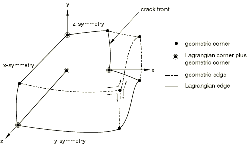

不会在欧拉边界区域上检测或跟踪几何特征，因为它们通常没有物理意义。

提供了用于查看几何边和角形成的输出选项——请参阅 ["在 Abaqus/Explicit 中进行 ALE 自适应网格的输出和诊断，" 第 12.2.5 节"](pt04ch12s02aus81.md)。

#### 控制几何边和角的检测

几何特征最初被识别为边界区域上的边，其中相邻单元面上的法线之间的角度大于初始几何特征角度， ()。请参阅 [图 12.2.2-3](pt04ch12s02aus78.md#aaledomains-geom-corner)。初始几何特征角度的默认值为 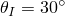。

**图 12.2.2-3** 几何特征的检测和停用。


您可以更改用于识别几何特征的角度值。设置 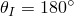 将确保不在自适应网格域的边界上形成任何几何边或角。

| **输入文件用法：** | ``` [*ADAPTIVE MESH CONTROLS](../key/key-link.md#usb-kws-hadaptivemeshcontrols), NAME=*name*, INITIAL FEATURE ANGLE= ``` |
| --- | --- |

| **Abaqus/CAE 用法：** | 步骤模块：****其他****ALE 自适应网格控制****创建**：**名称**：*name*，**初始特征角度**： |
| --- | --- |

#### 控制几何边和角的停用

几何特征仅影响拉格朗日和滑移边界区域，在那里它们充当临时拉格朗日边。在自适应网格增量的每个网格扫描期间，沿几何边的节点通过应用基本平滑方法进行定位（请参阅 ["在 Abaqus/Explicit 中进行 ALE 自适应网格和重新映射，" 第 12.2.3 节"](pt04ch12s02aus79.md)）。节点被约束位于离散几何边上，除非形成几何边的角度变得小于过渡几何特征角度，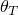 ()。过渡几何特征角度的默认值为 。如果跨几何边的角度变得小于 ，则边界表面被视为已充分变平，可以停用该特征，并且允许网格在材料上自由滑动（不受停用的几何边约束）。几何角可以类似地变平。这种逻辑允许在保持模型几何特征的同时实现网格自适应的极大灵活性。

您可以更改过渡特征角度。设置 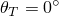 将确保永远不会停用任何几何边或角。

| **输入文件用法：** | ``` [*ADAPTIVE MESH CONTROLS](../key/key-link.md#usb-kws-hadaptivemeshcontrols), NAME=*name*, TRANSITION FEATURE ANGLE= ``` |
| --- | --- |

| **Abaqus/CAE 用法：** | 步骤模块：****其他****ALE 自适应网格控制****创建**：**名称**：*name*，**过渡特征角度**： |
| --- | --- |

### 网格约束

在大多数自适应网格问题中，网格中节点的运动由网格算法确定，并施加由域边界和边界区域边带来的约束。然而，在某些情况下，您必须明确控制节点的运动。如前所述，欧拉和滑移边界区域通常需要网格约束才能具有物理意义。在某些问题中，您可能希望保持某些节点固定，沿特定方向移动节点，或强制某些节点随材料运动。在其他问题中，您可能希望节点或特定节点集跟随材料运动。自适应网格约束允许完全控制网格运动，并独立于底层材料上施加的任何边界条件或载荷。

#### 应用空间网格约束

使用空间网格约束（默认）来规定独立于材料运动的 пространственный 网格运动。您指定应用约束的节点、规定运动的方向以及规定运动的幅度。您可以为空间网格运动规定位移或速度。

| **输入文件用法：** | 使用以下选项明确设置网格约束： |
| --- | --- |
|  | ``` [*ADAPTIVE MESH CONSTRAINT](../key/key-link.md#usb-kws-hadaptivemeshconstraint), CONSTRAINT TYPE=SPATIAL, TYPE=DISPLACEMENT or VELOCITY ``` |

| **Abaqus/CAE 用法：** | 明确设置网格约束： |
| --- | --- |
|  | 步骤模块：****其他****ALE 自适应网格约束****创建**：**所选步骤的类型**：**位移/旋转**或**速度/角速度**：选择区域：**运动**：**独立于底层材料** |

##### 应用空间网格约束的规则

空间网格约束可以无限制地应用于欧拉边界区域或自适应网格域内部的节点。

在二维和三维中，拉格朗日边和活动几何角处的节点被完全约束随底层材料运动。不能在此类角处应用网格约束。

自适应网格约束不得与拉格朗日和滑移边界区域固有的其他网格约束冲突；因此，自适应网格约束只能切向应用于拉格朗日或滑移边界区域。此限制意味着自适应网格约束在三维边界区域中只能沿两个方向施加，在二维边界区域中只能沿一个方向施加，或在拉格朗日边或活动几何边上沿一个方向施加。并非总是能够遵守此规则，特别是当边界承受有限旋转时。因此，如果边界区域的法线在节点处不垂直于规定的网格约束，则它始终沿当前边界区域表面移动，使得约束方向上网格运动的投影正确（请参阅 [图 12.2.2-4](pt04ch12s02aus78.md#aaledomains-mesh-constraint)）。

**图 12.2.2-4** 强制执行空间网格约束。

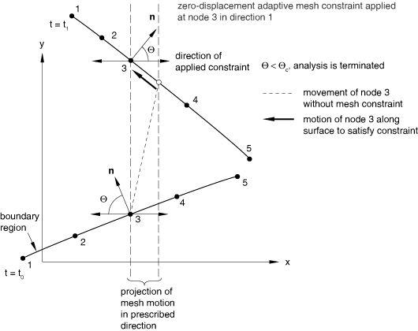

如果边界区域的法线接近所施加网格约束的方向，将需要大的网格运动来满足约束。默认情况下，如果边界区域的法线与规定约束方向之间的角度变得小于 ，则分析终止。此截止角度称为网格约束角度，其默认值为 60。

网格约束角度  也在沿拉格朗日边或活动几何边施加自适应网格约束的节点使用。由于不能规定垂直于这些边的独立网格运动，因此如果规定约束与垂直于边的平面之间的角度小于指定的网格约束角度，分析将终止。

您可以更改网格约束角度的值 (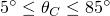)。不建议设置 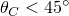，因为它可能导致确定自由表面几何形状时出错，特别是对于曲面。

| **输入文件用法：** | ``` [*ADAPTIVE MESH CONTROLS](../key/key-link.md#usb-kws-hadaptivemeshcontrols), MESH CONSTRAINT ANGLE= ``` |
| --- | --- |

| **Abaqus/CAE 用法：** | 步骤模块：****其他****ALE 自适应网格控制****创建**：**网格约束角度**： |
| --- | --- |

##### 定义随时间变化的网格约束

非零网格约束的规定幅度可以在步骤期间根据幅值定义随时间变化（请参阅 ["幅值曲线，" 第 34.1.2 节"](pt07ch34s01aus115.md)）。

| **输入文件用法：** | 同时使用以下两个选项： |
| --- | --- |
|  | ``` [*AMPLITUDE](../key/key-link.md#usb-kws-mamplitude), NAME=*name* [*ADAPTIVE MESH CONSTRAINT](../key/key-link.md#usb-kws-hadaptivemeshconstraint), AMPLITUDE=*name* ``` |

| **Abaqus/CAE 用法：** | 步骤模块：****其他****ALE 自适应网格约束****创建**：**所选步骤的类型**：**位移/旋转**或**速度/角速度**：选择区域：**运动**：**独立于底层材料**：**幅值**：*amplitude* |
| --- | --- |

#### 在局部方向上应用空间网格约束

如果在线节点处定义了局部坐标系（请参阅 ["变换坐标系，" 第 2.1.5 节"](pt01ch02s01aus09.md)），则空间网格约束在局部方向上应用；否则，在全局方向上应用。

#### 应用拉格朗日网格约束

节点上的拉格朗日网格约束用于指示不应应用网格平滑；即，节点必须跟随材料。

| **输入文件用法：** | ``` [*ADAPTIVE MESH CONSTRAINT](../key/key-link.md#usb-kws-hadaptivemeshconstraint), CONSTRAINT TYPE=LAGRANGIAN ``` |
| --- | --- |

| **Abaqus/CAE 用法：** | 步骤模块：****其他****ALE 自适应网格约束****创建**：**所选步骤的类型**：**位移/旋转**或**速度/角速度**：选择区域：**运动**：****跟随底层材料** |
| --- | --- |

#### 修改 ALE 自适应网格约束

默认情况下，在前一个分析步骤中定义的所有自适应网格约束在后续步骤中保持不变。您可以相对于现有的自适应网格约束定义给定步骤的有效自适应网格约束。在每个新步骤中，可以修改现有的自适应网格约束，并可以指定额外的自适应网格约束。

| **输入文件用法：** | 使用以下任一选项修改现有的自适应网格约束或指定额外的自适应网格约束： |
| --- | --- |
|  | ``` [*ADAPTIVE MESH CONSTRAINT](../key/key-link.md#usb-kws-hadaptivemeshconstraint), [*ADAPTIVE MESH CONSTRAINT](../key/key-link.md#usb-kws-hadaptivemeshconstraint), OP=MOD ``` |

| **Abaqus/CAE 用法：** | 步骤模块：****其他****ALE 自适应网格约束****管理器**：选择所需的步骤和网格约束：**编辑** |
| --- | --- |

#### 移除 ALE 自适应网格约束

如果您选择在某个步骤中移除任何自适应网格约束，则不会从上一个步骤传播自适应网格约束。因此，必须重新指定在此步骤期间有效的所有自适应网格约束。

| **输入文件用法：** | 使用以下选项移除所有先前定义的自适应网格约束并指定新的自适应网格约束： |
| --- | --- |
|  | ``` [*ADAPTIVE MESH CONSTRAINT](../key/key-link.md#usb-kws-hadaptivemeshconstraint), OP=NEW ``` 如果在任何 [*ADAPTIVE MESH CONSTRAINT](../key/key-link.md#usb-kws-hadaptivemeshconstraint) 选项上使用 OP=NEW 参数，则必须对该步骤中的所有 [*ADAPTIVE MESH CONSTRAINT](../key/key-link.md#usb-kws-hadaptivemeshconstraint) 选项使用此参数。 |

| **Abaqus/CAE 用法：** | 步骤模块：****其他****ALE 自适应网格约束****管理器**：选择所需的步骤和网格约束：**停用** |
| --- | --- |

### 初始条件

没有专门针对自适应网格的初始条件；初始条件的定义方式与非自适应问题相同。如果执行初始网格扫描以在步骤开始时平滑网格（请参阅 ["在 Abaqus/Explicit 中进行 ALE 自适应网格和重新映射，" 第 12.2.3 节"](pt04ch12s02aus79.md)），则所有初始条件（温度和场变量除外，这些在 ["预定义场](pt04ch12s02aus78.md#usb-anl-aaledomains-predef-fields)" 中讨论）将重新映射到新网格。在绝热分析的自适应网格期间，初始温度会重新映射。

在流入欧拉边界区域附近规定的初始条件将影响整个分析过程中流入域的材料状态。请参阅 ["在 Abaqus/Explicit 中为欧拉自适应网格域建模技术，" 第 12.2.4 节"](pt04ch12s02aus80.md)，了解有关入口边界正确处理的讨论。

### 在 ALE 自适应网格边界上定义表面

当您在自适应网格域的边界上定义表面时（请参阅 ["表面：概述，" 第 2.3.1 节"](pt01ch02s03aus16.md)），Abaqus 会创建与表面重合的边界区域。默认情况下，会创建滑移边界区域。您可以选择创建拉格朗日或欧拉边界区域。

在自适应网格域内部定义的表面将独立于材料运动（除非受网格约束）。

#### 使用表面定义滑移边界区域

默认情况下，由表面定义创建的边界区域将是滑移的（表面边可以在材料上自由滑动）。

| **输入文件用法：** | ``` [*SURFACE](../key/key-link.md#usb-kws-msurface), REGION TYPE=SLIDING ``` |
| --- | --- |

| **Abaqus/CAE 用法：** | 不支持在 Abaqus/CAE 中使用表面定义边界区域。 |
| --- | --- |

#### 使用表面定义拉格朗日边界区域

要强制表面边跟随材料，请创建拉格朗日边界区域。

| **输入文件用法：** | ``` [*SURFACE](../key/key-link.md#usb-kws-msurface), REGION TYPE=LAGRANGIAN ``` |
| --- | --- |

| **Abaqus/CAE 用法：** | 不支持在 Abaqus/CAE 中使用表面定义边界区域。 |
| --- | --- |

#### 使用表面定义欧拉边界区域

要将表面与材料运动解耦，请创建欧拉边界区域，并在垂直于表面的方向上应用空间网格约束。如果未应用网格约束，则表面将像滑移边界区域一样行为（材料不会流过表面）。

例如，通常假定在欧拉域的出口边界处材料中没有正或剪应力。可以通过使用表面定义欧拉边界区域并在垂直于表面的方向上应用空间网格约束来对此条件建模，[图 12.2.2-5](pt04ch12s02aus78.md#aaledomains-eulerian-surf) 中所示。

| **输入文件用法：** | ``` [*SURFACE](../key/key-link.md#usb-kws-msurface), REGION TYPE=EULERIAN ``` |
| --- | --- |

| **Abaqus/CAE 用法：** | 不支持在 Abaqus/CAE 中使用表面定义边界区域。 |
| --- | --- |

**图 12.2.2-5** 建模欧拉自适应网格域的出口边界。

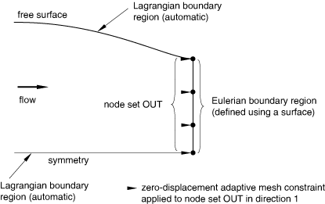

#### 接触

使用表面创建的拉格朗日和滑移边界区域可用于接触对；它们具有与非自适应区域上定义的表面相同的含义。由于接触通常涉及身体之间的相对滑动，滑移边界区域通常适用于接触表面。

在欧拉边界区域上定义的表面不能用于接触对。

如果接触对使用了小滑动公式，则两个表面上的所有节点都是非自适应的（请参阅 ["在 Abaqus/Explicit 中定义接触对，" 第 36.5.1 节"](pt09ch36s05aus160.md)，以及 ["在 Abaqus/Explicit 中接触对的接触公式，" 第 38.2.2 节"](pt09ch38s02aus181.md)）。基于单元的表面在不分离开接触对中的节点是非自适应的（请参阅 ["接触压力-闭合关系，" 第 37.1.2 节"](pt09ch37s01aus166.md)）。一般接触域中的所有节点都是非自适应的（请参阅 ["在 Abaqus/Explicit 中定义一般接触相互作用，" 第 36.4.1 节"](pt09ch36s04aus155.md)）。类似地，定义点焊的节点是非自适应的（请参阅 ["可断裂粘结，" 第 37.1.9 节"](pt09ch37s01aus173.md)）。

### 分布载荷

当分布压力载荷施加到自适应网格域的边界时，Abaqus/Explicit 会创建与载荷施加区域重合的边界区域。以这种方式创建的边界区域的特征与通过定义表面创建的边界区域的特征相同。如果将压力载荷施加到自适应网格域内部的表面，则表面上的节点将在所有方向上随材料运动（即，它们将是非自适应的）。

不同压力载荷创建的边界区域可能重叠。如果将相同大小和幅值定义的载荷施加到相邻区域，则这些区域将合并为单个边界区域，以最小化形成的拉格朗日边和角的数量（请参阅 [图 12.2.2-6](pt04ch12s02aus78.md#aaledomains-overlap-dloads)）。

**图 12.2.2-6** 将分布压力载荷施加到自适应网格域。

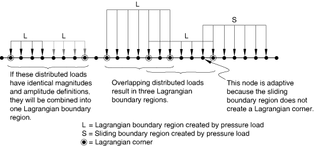

如果施加非均匀压力（例如，在表面上线性变化的压力），或者如果压力载荷在用户子程序 [`VDLOAD`](../sub/sub-link.md#sub-xsl-vdload) 中定义，则每个单元面或边成为单独的拉格朗日边界区域。由于在拉格朗日边相交的角处形成拉格朗日角，所有节点将在所有方向上跟随材料，每个区域变成非自适应的。同样，如果将非均匀体力施加到自适应网格域，则域被分割为多个域，每个域具有均匀的体力。如果这种分割导致单单元域，则该区域变成非自适应的。

#### 使用压力载荷定义拉格朗日边界区域

默认情况下，为与压力载荷重合而创建的边界区域将是拉格朗日型。施加到拉格朗日区域的载荷与施加到非自适应区域的载荷相同，只是网格可以在边界区域内移动。

| **输入文件用法：** | ``` [*DLOAD](../key/key-link.md#usb-kws-hdload), REGION TYPE=LAGRANGIAN ``` |
| --- | --- |

| **Abaqus/CAE 用法：** | 不支持在 Abaqus/CAE 中使用压力载荷定义边界区域。 |
| --- | --- |

#### 使用压力载荷定义滑移边界区域

可以将压力载荷施加到滑移边界区域，以模拟固定在空间中而材料流过它的载荷（请参阅 [图 12.2.2-7](pt04ch12s02aus78.md#aaledomains-sliding-dload)）。滑移边在边界区域的切线方向上不受约束；因此，除非施加自适应网格约束，否则载荷施加区域将根据自适应网格算法移动，这可能没有物理意义。

允许压力载荷在材料上滑动，请创建滑移边界区域。

| **输入文件用法：** | ``` [*DLOAD](../key/key-link.md#usb-kws-hdload), REGION TYPE=SLIDING ``` |
| --- | --- |

| **Abaqus/CAE 用法：** | 不支持在 Abaqus/CAE 中使用压力载荷定义边界区域。 |
| --- | --- |

**图 12.2.2-7** 将分布滑动压力载荷施加到自适应网格域。


#### 使用压力载荷定义欧拉边界区域

要将压力施加区域与材料运动解耦，请创建欧拉边界区域，并在垂直于表面的方向上应用空间网格约束。如果未应用网格约束，则网格将像滑移边界区域一样行为（材料不会流过表面）。

例如，通常假定在欧拉域的出口边界处存在均匀的环境压力。可以通过使用分布载荷在欧拉边界区域定义压力，并垂直于表面应用空间网格约束来对此条件建模，如 [图 12.2.2-8](pt04ch12s02aus78.md#aaledomains-eulerian-dload) 所示。

| **输入文件用法：** | ``` [*DLOAD](../key/key-link.md#usb-kws-hdload), REGION TYPE=EULERIAN ``` |
| --- | --- |

| **Abaqus/CAE 用法：** | 不支持在 Abaqus/CAE 中使用压力载荷定义边界区域。 |
| --- | --- |

**图 12.2.2-8** 在欧拉自适应网格域的出口边界处建模环境压力。


### 分布表面通量和热条件

在耦合热应力分析中，Abaqus/Explicit 还为分布表面通量、对流膜条件和辐射条件创建边界区域。这些载荷的边界区域规则与分布载荷的讨论相同。指定边界区域类型的能力也是相同的。

### 集中载荷

当集中载荷施加到自适应网格域的边界时，Abaqus/Explicit 会创建与载荷重合的边界区域。施加集中载荷的每个节点将被视为自己的边界区域，因为不可能识别与集中载荷关联的表面积。但是，您可以控制每个单节点区域的行为。

如果将集中载荷施加到自适应网格域内部的节点，则这些节点将在所有方向上随材料运动（即，它们将是非自适应的）。

#### 使用集中载荷定义拉格朗日边界区域

默认情况下，由集中载荷创建的边界区域将是拉格朗日型。每个单节点拉格朗日边界区域将在所有方向上跟随材料（节点将是非自适应的）。

| **输入文件用法：** | ``` [*CLOAD](../key/key-link.md#usb-kws-hcload), REGION TYPE=LAGRANGIAN ``` |
| --- | --- |

| **Abaqus/CAE 用法：** | 不支持在 Abaqus/CAE 中使用集中载荷定义边界区域。 |
| --- | --- |

#### 使用集中载荷定义滑移边界区域

可以将集中载荷施加到滑移边界区域，以模拟固定在空间中而材料流过它的载荷（请参阅 [图 12.2.2-9](pt04ch12s02aus78.md#aaledomains-sliding-cload)）。

**图 12.2.2-9** 将集中滑动载荷施加到自适应网格域。


滑移节点在边界区域的切线方向上不受约束；因此，除非施加自适应网格约束，否则载荷施加点将根据自适应网格算法移动，这可能没有物理意义。

允许集中载荷在材料上自由滑动，请创建滑移边界区域。

| **输入文件用法：** | ``` [*CLOAD](../key/key-link.md#usb-kws-hcload), REGION TYPE=SLIDING ``` |
| --- | --- |

| **Abaqus/CAE 用法：** | 不支持在 Abaqus/CAE 中使用集中载荷定义边界区域。 |
| --- | --- |

#### 使用集中载荷定义欧拉边界区域

要将集中载荷与材料运动解耦，请创建欧拉边界区域，并在垂直于表面的方向上应用空间网格约束。如果未应用网格约束，则每个单节点边界区域将像滑移边界区域一样行为。

| **输入文件用法：** | ``` [*CLOAD](../key/key-link.md#usb-kws-hcload), REGION TYPE=EULERIAN ``` |
| --- | --- |

| **Abaqus/CAE 用法：** | 不支持在 Abaqus/CAE 中使用集中载荷定义边界区域。 |
| --- | --- |

### 集中通量和热条件

在耦合热应力分析中，Abaqus/Explicit 还为集中热通量、膜条件和辐射条件创建边界区域。这些载荷的边界区域规则与集中载荷的讨论相同。指定边界区域类型的能力也是相同的。

### 边界条件

可以通过在自适应网格域的边界上施加运动约束来创建拉格朗日、滑移和欧拉边界区域。如果将运动边界条件施加到自适应网格域内部的节点，则无论指定的边界区域类型如何，这些节点将在所有方向上随材料运动（即，它们将是非自适应的）。

#### 使用边界条件定义拉格朗日边界区域

默认情况下，由运动边界条件创建的边界区域将是拉格朗日型。Abaqus/Explicit 将自动识别表面型和点或边约束，并为每种类型创建适当的拉格朗日边界区域，如以下小节所述。

| **输入文件用法：** | ``` [*BOUNDARY](../key/key-link.md#usb-kws-hboundary), REGION TYPE=LAGRANGIAN ``` |
| --- | --- |

| **Abaqus/CAE 用法：** | 不支持在 Abaqus/CAE 中使用边界条件定义边界区域。 |
| --- | --- |

##### 使用边界条件施加的表面型约束

尽管边界条件始终在 Abaqus/Explicit 中施加到各个节点，但它们通常代表表面上的物理约束。例如，对称条件（节点被约束在平面内运动）实际上是表面约束。沿边界的完全夹紧（ENCASTRE）条件也可以视为表面约束。（在自适应网格期间，允许节点沿完全夹紧边移动是有意义的。）

Abaqus/Explicit 将检查自适应网格边界并尝试创建与所施加边界条件重合的区域。目前，Abaqus/Explicit 可以为以下表面型约束创建边界区域：
- 对称平面；
- 完全夹紧平面；和
- 规定均匀运动的平面。

[图 12.2.2-2](pt04ch12s02aus78.md#aaledomains-geom-feat) 显示了通过施加表面型边界条件创建边界区域的示例。此图显示了一块带有裂纹的材料和三个对称平面（因此，三个拉格朗日边界区域）。材料不会流过任何对称平面，但可以在每个拉格朗日边界区域内执行自适应网格。这种灵活性在承受大变形的 问题中通常很有帮助。

##### 使用边界条件施加的点或边约束

某些边界条件代表点或边约束。例如，可以在节点处规定位移。与此类节点关联的边界区域与由集中载荷创建的边界区域完全相同。

#### 使用边界条件定义滑移边界区域

与边界条件关联的滑移边界区域可以根据自适应网格算法移动。由于这种行为可能没有物理意义，因此通常在滑移边界区域的边的切线方向上使用自适应网格约束来固定边。例如，这可用于模拟刚性冲头与变形体之间的无摩擦接触，如 [图 12.2.2-10](pt04ch12s02aus78.md#aaledomains-contact-sim) 所示。

**图 12.2.2-10** 使用滑移边界区域模拟接触。

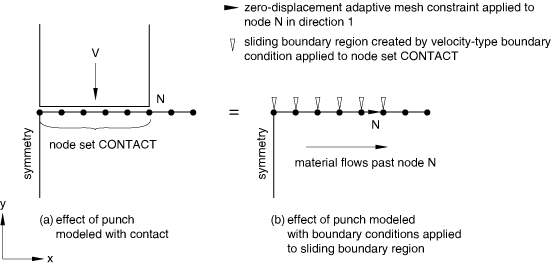

在此示例中，冲头被具有恒定速度边界条件的滑移边界区域替换，该边界条件施加在"接触"区域。在节点 N 的边界区域的边上施加切向网格约束（另一条边由自动在对称平面上创建的拉格朗日边界区域约束）。此问题定义允许材料在"冲头"下方径向流动，同时保持"接触"区域的原始大小和位置。

对于滑移边界区域，Abaqus/Explicit 对表面型约束和点或边约束没有区别。

允许边界条件在材料上自由滑动，请创建滑移边界区域。

| **输入文件用法：** | ``` [*BOUNDARY](../key/key-link.md#usb-kws-hboundary), REGION TYPE=SLIDING ``` |
| --- | --- |

| **Abaqus/CAE 用法：** | 不支持在 Abaqus/CAE 中使用边界条件定义边界区域。 |
| --- | --- |

#### 使用边界条件定义欧拉边界区域

要将边界区域与材料运动解耦，请创建欧拉边界区域，并在垂直于表面的方向上应用空间网格约束。如果未应用网格约束，则网格将像滑移边界区域一样行为（材料不会流过表面）。

例如，可以通过使用边界条件定义欧拉边界区域来规定欧拉入口边界的质量流率。

对于欧拉边界区域，Abaqus/Explicit 对表面型约束和点或边约束没有区别。

| **输入文件用法：** | ``` [*BOUNDARY](../key/key-link.md#usb-kws-hboundary), REGION TYPE=EULERIAN ``` |
| --- | --- |

| **Abaqus/CAE 用法：** | 不支持在 Abaqus/CAE 中使用边界条件定义边界区域。 |
| --- | --- |

### 重叠边界区域

拉格朗日边界区域可以与任意数量的其他拉格朗日或滑移边界区域重叠（请参阅 [图 12.2.2-11](pt04ch12s02aus78.md#aaledomains-overlap-regions)）。如果两个边界区域部分重叠，则形成三个区域：重叠区域和两个初始区域减去重叠区域。当拉格朗日和滑移边界区域重叠时，会形成滑移边界区域。

**图 12.2.2-11** 重叠边界区域。


欧拉边界区域永远不能与拉格朗日或滑移边界区域重叠。此外，欧拉边界区域永远不能与非自适应区域共享边界或重叠。由于无限单元是非自适应的，后者限制意味着无限单元不能用于模拟出口边界处的环境条件。

#### 重合边

由不同类型的边界区域共享的边遵循以下规则：
- 拉格朗日和滑移边界区域之间的边将是拉格朗日型。
- 拉格朗日和欧拉边界区域之间的边将是滑移型。
- 拉格朗日和非自适应边界区域之间的边将是非自适应型。
- 滑移和非自适应边界区域之间的边将是非自适应型。
- 欧拉边界区域的边永远不能与非自适应区域的边重合。

### 预定义场

在自适应网格域中施加规定的温度或场变量没有限制，但这些节点值在进行自适应网格时不会重新映射。因此，非空间均匀的预定义场可能在自适应网格域内没有意义。（时间变化、空间均匀的预定义场是可以接受的，因为自适应网格在离散时间点应用。）但是，如果从空间参考框架收集温度或场变量数据，则对于网格不移动的欧拉域应用空间变化场可能有物理意义。Abaqus/Explicit 不会对自适应网格进行任何检查或计算预定义场；您必须确保预定义场是有意义的。

### 材料

除脆性开裂（["混凝土开裂模型，" 第 23.6.2 节"](pt05ch23s06abm38.md)）、织物（["织物材料行为，" 第 23.4.1 节"](pt05ch23s04abm35.md)）和低密度泡沫（["低密度泡沫，" 第 22.9.1 节"](pt05ch22s09abm16.md)）材料外，所有材料模型和行为都可用于自适应网格域。

对于使用超弹性或超泡沫材料建模的域，自适应网格的实用性有限。推荐的增强沙漏方法（["截面控制，" 第 27.1.4 节"](pt06ch27s01aus113.md)），它在卸载时通常会预测这些材料返回原始配置的更好的结果，不能用于自适应网格域。因此，对于超弹性或超泡沫材料，建议在不使用自适应网格但使用增强沙漏控制的情况下运行分析。

如果在使用剪切失效模型（["在 Abaqus/Explicit 中的失效准则"中的"多孔金属塑性，" 第 23.2.9 节"](pt05ch23s02abm25.md#usb-mat-cpormetalplas-failure)）、剪切失效模型（["动态失效模型"中的"剪切失效模型，" 第 23.2.8 节"](pt05ch23s02ab24.md#usb-mat-cfailuremodels-shear)）、拉伸失效模型（["动态失效模型"中的"拉伸失效模型，" 第 23.2.8 节"](pt05ch23s02ab24.md#usb-mat-cfailuremodels-tensile)）或渐进损伤模型（[第 24 章，"渐进损伤和失效](pt05ch24.md)"）的自适应网格域中指定，Abaqus/Explicit 将在执行自适应网格时持续监控单元状态。当域中的单元失效时，失效和未失效单元界面处的节点将变成非自适应的。这会产生失效和未失效区域之间的材料边界。

当在使用剪切失效、张拉失效或渐进损伤模型（无单元删除）的单元中发生失效时，失效区域中的单元不会被删除；它们可以承受某种应力状态。自适应网格将发生在失效区域内，但不会沿与未失效材料的界面发生。

### 单元

自适应网格域只能包含一阶、减缩积分实体单元。自适应网格域内的所有单元必须具有相同的几何形状（所有二维、三维、轴对称或平面应变等）。由于自适应网格域按单元类型分割，因此对于同时包含三角形和四边形（或四面体和六面体）的混合域，应使用退化单元。除一阶、减缩积分、实体单元外的所有单元（包括质量、旋转惯性和无限单元）都是非自适应的。这些单元可以连接到自适应网格域，但它们的节点是非自适应的。刚体上的所有节点和单元都是非自适应的。自适应网格域中不支持钢筋。

### 多点约束和方程

与边界条件一样，多点约束（["一般多点约束，" 第 35.2.2 节"](pt08ch35s02aus130.md)）和方程（["线性约束方程，" 第 35.2.1 节"](pt08ch35s02aus129.md)）始终施加到节点，但有时代表表面上的约束。Abaqus/Explicit 会在满足以下条件时识别表面型约束：
- 方程、PIN MPC 或 TIE MPC 将节点集绑定到单个节点；并且
- MPC 或方程中涉及的所有节点共面并位于边界区域内。

如果满足这些条件，则边界区域将与 MPC 或方程中的节点集关联。如果 MPC 施加在拉格朗日或滑移边界区域内，则将创建拉格朗日边。如果 MPC 施加在欧拉边界区域内，则不会创建边。如果不满足上述条件，则连接到 MPC 或方程的所有节点都是非自适应的。

例如，可以施加约束以强制平面截面在拉格朗日自适应网格域中保持平面，如 [图 12.2.2-12(a)](pt04ch12s02aus78.md#aaledomains-adapt-mesh-mpc) 所示。在这种情况下，所有节点被约束在分析过程中保持在同一平面内，但允许网格在平面内自适应。

**图 12.2.2-12** 将方程与自适应网格结合使用。

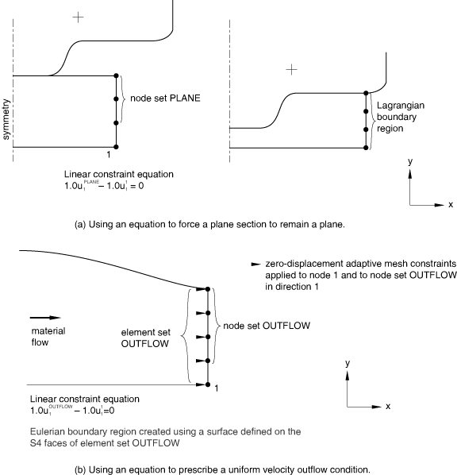

另一个示例，考虑欧拉域的出口边界，如 [图 12.2.2-12(b)](pt04ch12s02aus78.md#aaledomains-adapt-mesh-mpc) 所示。欧拉域的出口边界通常假定足够远，使得速度是均匀的但未知。为了对此条件建模，使用表面在出口边界创建欧拉边界区域。自适应网格约束用于在垂直于边界的方向上固定网格，并且平面上的所有节点被约束通过方程具有垂直于平面的相同速度。

对于基于表面的绑定约束（请参阅 ["网格绑定约束，" 第 35.3.1 节"](pt08ch35s03aus132.md)），绑定表面上的所有节点都将是非自适应的。

### 过程

在绝热分析期间，温度将在自适应网格域中正确重新映射。在退火过程或几何线性分析期间不使用自适应网格。

自适应网格域、边界区域、网格约束和控制的定义（如 ["在 Abaqus/Explicit 中进行 ALE 自适应网格和重新映射，" 第 12.2.3 节"](pt04ch12s02aus79.md) 中所述）将从步骤到步骤传播。

### 用户子程序

当执行自适应网格时，在用户子程序 [`VUMAT`](../sub/sub-link.md#sub-xsl-vumat) 中定义的可解状态变量将重新映射到新网格。

当执行自适应网格时，在用户子程序 [`VFRIC`](../sub/sub-link.md#sub-xsl-vfric)、[`VUINTER`](../sub/sub-link.md#sub-xsl-vuinter)、[`VFRICTION`](../sub/sub-link.md#sub-xsl-vfriction) 和 [`VUINTERACTION`](../sub/sub-link.md#sub-xsl-vuinteraction) 中的从表面上定义的可解状态变量不会重新映射到新网格。因此，为了确保物理有意义的结果，对于在这些用户子程序中定义接触约束的从表面上的节点，应使用拉格朗日自适应网格约束。

### 输出

由于在进行自适应网格时网格不再约束到材料，因此单元和节点处的输出必须与纯拉格朗日问题中的解释不同。请参阅 ["在 Abaqus/Explicit 中进行 ALE 自适应网格的输出和诊断，" 第 12.2.5 节"](pt04ch12s02aus81.md)，了解详细信息。

### 输入文件模板

创建拉格朗日自适应网格域：

```
[*HEADING](../key/key-link.md#usb-kws-mheading)
 …
[*ELSET](../key/key-link.md#usb-kws-melset), ELSET=ADAPT
*************************
[*STEP](../key/key-link.md#usb-kws-hstep)
[*DYNAMIC](../key/key-link.md#usb-kws-hdynamic), EXPLICIT
*指定步骤时间周期的数据行*
[*ADAPTIVE MESH](../key/key-link.md#usb-kws-hadaptivemesh), ELSET=ADAPT
...
[*END STEP](../key/key-link.md#usb-kws-hendstep)
```

创建具有规定速度入口条件和规定压力出口条件的欧拉自适应网格域（均在全局 *x* 方向）：

```
[*HEADING](../key/key-link.md#usb-kws-mheading)...
[*ELSET](../key/key-link.md#usb-kws-melset), ELSET=ADAPT
...
[*ELSET](../key/key-link.md#usb-kws-melset), ELSET=OUT
...
[*NSET](../key/key-link.md#usb-kws-mnset), NSET=INFLOW
...
[*NSET](../key/key-link.md#usb-kws-mnset), NSET=OUTFLOW
...
[*SURFACE](../key/key-link.md#usb-kws-msurface), NAME=INSURF, REGION TYPE=EULERIAN
*定义表面的数据行*
[*SURFACE](../key/key-link.md#usb-kws-msurface), NAME=OUTSURF, REGION TYPE=EULERIAN
*定义表面的数据行*
...
[*EQUATION](../key/key-link.md#usb-kws-mequation)
*在入口处规定均匀速度的数据行*
*************************
[*STEP](../key/key-link.md#usb-kws-hstep)
[*DYNAMIC](../key/key-link.md#usb-kws-hdynamic), EXPLICIT
*指定步骤时间周期的数据行*
[*ADAPTIVE MESH](../key/key-link.md#usb-kws-hadaptivemesh), ELSET=ADAPT
[*ADAPTIVE MESH CONSTRAINT](../key/key-link.md#usb-kws-hadaptivemeshconstraint)
 INFLOW,  1, 1, 0
 OUTFLOW, 1, 1, 0
[*BOUNDARY](../key/key-link.md#usb-kws-hboundary), TYPE=VELOCITY, REGION TYPE=EULERIAN
 INFLOW, 1, 1, 10.0
[*DLOAD](../key/key-link.md#usb-kws-hdload), REGION TYPE=EULERIAN
 OUT, P2, 15.0
...
[*END STEP](../key/key-link.md#usb-kws-hendstep)
```
