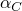
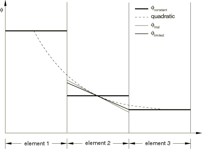

# 12.2.3 Abaqus/Explicit 中的 ALE 自适应网格划分和重新映射


**产品：** Abaqus/Explicit  Abaqus/CAE  

##### **参考文献**

- ["ALE 自适应网格划分：概述，" 第 12.2.1 节](pt04ch12s02abo14.md)
- ["在 Abaqus/Explicit 中定义 ALE 自适应网格域，" 第 12.2.2 节](pt04ch12s02aus78.md)
- ["Abaqus/Explicit 中 ALE 自适应网格划分的输出和诊断，" 第 12.2.5 节](pt04ch12s02aus81.md)
- [*ADAPTIVE MESH](../key/key-link.md#usb-kws-hadaptivemesh)
- [*ADAPTIVE MESH CONSTRAINT](../key/key-link.md#usb-kws-hadaptivemeshconstraint)
- [*ADAPTIVE MESH CONTROLS](../key/key-link.md#usb-kws-hadaptivemeshcontrols)
- ["自定义 ALE 自适应网格划分，" Abaqus/CAE 用户手册第 14.14 节](../usi/usi-link.md#usi-sim-other-adaptmesh)

### 概述

ALE 自适应网格划分包括两个基本任务：
- 创建新网格，以及
- 使用称为平流的过程将解变量从旧网格重新映射到新网格。

自适应网格划分技术的成功取决于为每个任务选择的方法。创建新网格和重新映射解变量的默认方法经过仔细选择，可适用于各种问题。但是，您可能希望覆盖默认选择以平衡自适应网格划分的稳健性和效率，或将自适应网格划分扩展到更困难或异常的应用。

### 网格划分

新网格：
- 为每个自适应域以指定频率创建；
- 通过在自适应网格域上迭代扫描并移动节点以平滑网格来找到；和
- 可以保持原始网格的初始渐变。

### 重新映射

用于将解变量平流到新网格的方法：
- 是一致的、单调的，并且（默认）二阶精确；和
- 保持质量、动量和能量。

### 控制 ALE 自适应网格划分的频率

在大多数情况下，自适应网格划分的频率是影响自适应网格划分网格质量和计算效率的参数。没有欧拉边界的典型自适应网格划分应用需要每 5–100 个增量进行一次自适应网格划分。相比之下，使用欧拉边界的稳态过程模拟通常应更频繁地进行自适应网格划分。因此，如果自适应网格域上定义了空间自适应网格约束或欧拉边界区域，则默认频率为 1；否则，默认频率为 10。

| **输入文件用法：** | 使用以下选项更改自适应网格划分的频率： |
| --- | --- |
|  | ``` [*ADAPTIVE MESH](../key/key-link.md#usb-kws-hadaptivemesh), FREQUENCY=*number of increments* ``` |

| **Abaqus/CAE 用法：** | 步骤模块：****其他****ALE 自适应网格域****编辑****：切换打开**使用下面的 ALE 自适应网格域**，**频率：** *增量数* |
| --- | --- |

### 控制 ALE 自适应网格划分的强度

在每个自适应网格划分增量中，通过执行一次或多次网格扫描然后将解变量平流到新网格来创建新网格。

#### 网格扫描

在自适应网格划分增量中，通过在自适应网格域上迭代扫描来创建新的、更平滑的网格。在每次网格扫描中，节点在域中被重新定位——基于相邻节点和元素的当前位置——以减少元素扭曲。在典型扫描中，节点移动围绕该节点的任何元素特征长度的一小部分。增加扫描次数会增加每个自适应网格划分增量中自适应网格划分的强度。默认网格扫描次数为一。

| **输入文件用法：** | 使用以下选项更改每个自适应网格划分增量中执行的网格扫描次数： |
| --- | --- |
|  | ``` [*ADAPTIVE MESH](../key/key-link.md#usb-kws-hadaptivemesh), MESH SWEEPS=*number of sweeps* ``` |

| **Abaqus/CAE 用法：** | 步骤模块：****其他****ALE 自适应网格域****编辑****：切换打开**使用下面的 ALE 自适应网格域**，**每个增量的重网格扫描：** *扫描次数* |
| --- | --- |

#### 平流扫描

将解变量从旧网格映射到新网格的过程称为平流扫描。至少在每个自适应网格划分增量中执行一次平流扫描。理想情况下，平流扫描应该只执行一次，在增量的所有网格扫描完成后执行。但是，只有当旧网格和新网格之间的差异很小时，平流扫描的数值稳定性才能保持。因此，如果在网格扫描后域中任何节点的累积总移动大于任何相邻元素特征长度的 50%，则执行平流扫描以将解变量从旧网格重新映射到中间网格。网格扫描将继续，直到达到指定数量，或者直到任何节点的移动再次超过 50% 阈值。此时，再次执行平流扫描以将变量从最后一个中间网格映射到新的中间网格。循环将继续，直到达到网格扫描的指定数量。

每个自适应网格域每个自适应网格划分增量所需的平流扫描次数由 Abaqus/Explicit 自动确定；您不能覆盖此自动计算。平流扫描次数默认打印到消息（`.msg`）文件（请参阅 ["Abaqus/Explicit 中 ALE 自适应网格划分的输出和诊断，" 第 12.2.5 节](pt04ch12s02aus81.md)）。

### ALE 自适应网格划分的计算成本

自适应网格划分的成本取决于重新网格划分的频率、执行网格和平流扫描的次数以及自适应网格域的大小。与纯拉格朗日分析相比，仅在自适应网格划分增量中产生额外的计算成本。

一般来说，一次平流扫描的成本是网格扫描成本的数倍。当自适应网格划分执行得太不频繁和/或指定了高数量的网格扫描时，会触发多次平流扫描。更频繁地执行自适应网格划分并在每个自适应网格划分增量中执行 1–5 次网格扫描通常只会产生一次平流扫描，从而将计算成本降至最低。

自适应网格划分产生的相对平滑的网格和改进的元素长宽比可能会增加稳定时间增量，与类似的纯拉格朗日分析相比。在某些情况下，这种增加可以完全抵消自适应网格划分的成本。

尽管计算成本可能因应用类型而有很大差异，但在每个增量中对整个问题域执行自适应网格划分通常会将分析成本提高到类似拉格朗日分析的 3–5 倍。定义仅覆盖整个问题域一部分的自适应网格域将按比例降低成本。将频率更改为每 10–25 个增量一次将导致 CPU 时间仅略高于纯拉格朗日分析。

### 控制 ALE 自适应网格划分频率和强度的指南

尽管默认值适用于许多问题，但困难的分析可能需要更频繁的自适应网格划分频率或更高强度的网格划分。

#### 瞬态分析指南

对于没有空间自适应网格约束或欧拉边界区域的问题，自适应网格划分的默认频率为 10，默认网格扫描次数为 1。默认值通常适用于低至中等速率的动态问题和经历中等变形的准静态过程模拟。如果频率或网格扫描次数太低，过度的元素扭曲可能导致分析在网格适应之前终止；或者，如果可以获得解，它可能不如使用更高质量网格获得的解准确。然而，实际上，在任何频率下执行自适应网格划分都会减少元素的扭曲（从而提高解的质量），与纯拉格朗日分析相比。

对于经历大量变形的高速冲击问题，可能需要增加自适应网格划分的频率或网格扫描次数。通常在增加频率之前稍微增加网格扫描次数是较便宜的，只要平流扫描次数保持较小。

对于仅在数百个增量内发生的爆炸问题，通常需要在每个增量进行自适应网格划分。对于涉及每个增量大量流动的准静态过程模拟，可能还需要增加自适应网格划分的频率。

对于每个增量变形很小的问题，可以通过每 25–100 个增量仅执行一次自适应网格划分来保持高质量网格。对于这些问题，自适应网格划分的额外成本可以忽略不计。

#### 稳态分析指南

当自适应网格域包含欧拉边界区域或具有空间自适应网格约束时，自适应网格划分的默认频率为 1。此默认频率是保守的，主要选择是因为空间网格约束仅在自适应网格划分增量期间应用。因此，在自适应网格划分增量之间，网格可能会从其指定位置漂移，这可能会影响解。但是，来自自适应网格约束的漂移将在下一个自适应网格划分增量中被消除：它不会累积。

对于变形速度或元素间材料流动速度远低于材料波速的问题，频率通常可以增加到 5 或更高。这类问题包括大多数稳态过程模拟，其中网格从指定位置的漂移在几个增量中可以忽略不计。通过减少自适应网格划行的频率，稳态模拟变得与其对应的瞬态模拟相当。对于变形或材料流动速度高的欧拉域（如动态冲击问题），应使用默认频率 1。

### 网格平滑方法

Abaqus/Explicit 中新网格的确定基于四个方面。您可以通过定义自适应网格控制来控制每个方面。默认选择使得整体算法适用于大多数问题。

首先，Abaqus/Explicit中新网格的计算基于三种基本平滑方法的某种组合：体积平滑、拉普拉斯平滑和等势平滑。平滑方法应用于自适应网格域中的每个节点，以基于周围节点或元素的位置确定节点的新位置。尽管所有平滑方法都倾向于平滑网格和减少元素扭曲，但根据所使用的方法，生成的网格会有所不同。

其次，如果需要，可以保持初始元素渐变但会牺牲元素扭曲。第三，在应用基本平滑方法之前对节点进行最佳定位可以提高网格质量并减少所需的自适应网格划分频率。

最后，使用解相关网格划分来集中网格细化靠近演化边界曲率的区域。这抵消了基本平滑方法在解精度重要的凹边界附近减少网格细化的趋势。

#### 体积平滑

体积平滑通过计算围绕节点的元素中心的体积加权平均值来重新定位节点。在 [图 12.2.3--1](pt04ch12s02aus79.md#aaleremesh-smooth-method) 中，节点 M 的新位置由四个周围元素中心 C 位置的体积加权平均值确定。体积加权倾向于将节点从元素中心 C1 推开，朝向元素中心 C3，从而减少元素扭曲。

**图 12.2.3–1** 网格扫描期间节点的重新定位。


体积平滑非常稳健，是 Abaqus/Explicit 中的默认方法。它适用于结构化和高度非结构化的域。（结构化域是包含退化元素且每个节点在二维中被四个元素包围或在三维中被八个元素包围的域。）

#### 拉普拉斯平滑

拉普拉斯平滑通过计算与所讨论节点由元素边连接的每个相邻节点位置的平均值来重新定位节点。在 [图 12.2.3--1](pt04ch12s02aus79.md#aaleremesh-smooth-method) 中，节点 M 的新位置由连接到 M 的四个节点 L 位置的平均值确定。节点 L2 和 L3 的位置将把节点 M 向上和向右拉以减少元素扭曲。

拉普拉斯平滑是最便宜的平滑算法，常用于网格预处理。对于低至中等扭曲的网格域，拉普拉斯平滑的结果与体积平滑相似。对于具有复杂曲率边界的域，体积平滑通常会产生更平衡的网格。

#### 等势平滑

等势平滑是一种更高阶的方法，通过计算节点在二维中八个最近邻节点（或三维中十八个最近邻节点）位置的更高阶加权平均值来重新定位节点。在 [图 12.2.3--1](pt04ch12s02aus79.md#aaleremesh-smooth-method) 中，节点 M 的新位置基于所有周围节点 L 和 E 的位置。

等势平滑的加权平均相当复杂，基于 Laplace 方程的求解。等势平滑倾向于最小化跨多个元素的网格线的局部曲率。尽管这种趋势对于缓变域可能是可取的，但它可能抑制等势平滑在高度变形和局部弯曲域中减少元素扭曲的能力。

等势平滑仅能对被局部结构化网格包围的节点执行。当等势平滑被选择时，被非结构化网格包围的节点将使用等效的体积平滑进行移动。

#### 组合平滑方法

Abaqus/Explicit 中的默认平滑方法是体积平滑。要选择替代平滑方法或组合平滑方法，请为每种方法指定加权因子。当使用多种平滑方法时，通过计算每种选择方法预测位置的加权平均值来重新定位节点。所有权重必须为正数，它们的和通常应为 1.0。如果所选权重之和小于 1.0，则网格平滑算法在每个自适应网格划分增量中不那么积极。如果所选权重之和大于 1.0，则对其值进行归一化，使其和为 1.0。

| **输入文件用法：** | ``` [*ADAPTIVE MESH CONTROLS](../key/key-link.md#usb-kws-hadaptivemeshcontrols), NAME=*name* *volume smoothing weight, Laplacian smoothing weight, equipotential smoothing weight* ``` |
| --- | --- |
|  | 例如，可以使用以下选项定义体积和等势平滑的等比例混合，不使用拉普拉斯平滑： ``` [*ADAPTIVE MESH CONTROLS](../key/key-link.md#usb-kws-hadaptivemeshcontrols), NAME=*name* 0.5, 0.0, 0.5 ``` |

| **Abaqus/CAE 用法：** | 步骤模块：****其他****ALE 自适应网格控制****创建****：**名称**：*name*，**体积：** *体积平滑权重*，**拉普拉斯：** *拉普拉斯平滑权重*，**等势：** *等势平滑权重* |
| --- | --- |

#### 基本平滑方法的几何增强

基本平滑方法的传统形式在高度扭曲的域中表现不佳。为了确保自适应网格划分的稳健性，Abaqus/Explicit 默认使用几何增强形式的基本平滑算法。增强形式推荐用于所有自适应网格应用。但是，由于许多有限元预处理器使用基本平滑算法，因此提供其传统形式作为选项。

| **输入文件用法：** | 使用以下选项使用体积、拉普拉斯或等势平滑算法的传统形式： |
| --- | --- |
|  | ``` [*ADAPTIVE MESH CONTROLS](../key/key-link.md#usb-kws-hadaptivemeshcontrols), NAME=*name*, GEOMETRIC ENHANCEMENT=NO ``` |

| **Abaqus/CAE 用法：** | 步骤模块：****其他****ALE 自适应网格控制****创建****：**名称**：*name*，切换关闭**使用基于演化元素几何的增强算法** |
| --- | --- |

#### 指定均匀网格平滑目标

对于没有任何欧拉边界区域的自适应网格域，网格平滑方法的默认目标是牺牲扩散初始网格渐变来最小化网格扭曲同时改进元素长宽比。均匀网格平滑目标推荐用于中等到大整体变形的问题。

| **输入文件用法：** | 使用以下选项指定均匀网格平滑目标： |
| --- | --- |
|  | ``` [*ADAPTIVE MESH CONTROLS](../key/key-link.md#usb-kws-hadaptivemeshcontrols), NAME=*name*, SMOOTHING OBJECTIVE=UNIFORM ``` |

| **Abaqus/CAE 用法：** | 步骤模块：****其他****ALE 自适应网格控制****创建****：**名称**：*name*，**优先级：改进长宽比** |
| --- | --- |

#### 指定渐变网格平滑目标

或者，平滑方法可以尝试在分析演化时保持初始网格渐变同时减少元素扭曲。此目标是具有一个或多个欧拉边界区域的自适应网格域的默认设置。渐变网格平滑目标仅推荐用于具有合理结构化渐变网格且经历低至中等整体变形。自适应网格域。元素扭曲将被最小化，但相邻元素的长宽比将大致保持。网格渐变在整体变形很小且在特定区域使用集中网格来捕获高解梯度的稳态问题中特别有用。

| **输入文件用法：** | 使用以下选项指定渐变网格平滑目标： |
| --- | --- |
|  | ``` [*ADAPTIVE MESH CONTROLS](../key/key-link.md#usb-kws-hadaptivemeshcontrols), NAME=*name*, SMOOTHING OBJECTIVE=GRADED ``` |

| **Abaqus/CAE 用法：** | 步骤模块：****其他****ALE 自适应网格控制****创建****：**名称**：*name*，**优先级：保持初始网格渐变** |
| --- | --- |

#### 在拉格朗日域中定位节点

如果自适应网格域没有欧拉边界区域，则默认情况下，网格扫描基于当前节点位置，这些位置 account for 自上次自适应网格划分增量以来累积的材料运动。这种方法对于经历大整体变形的拉格朗日问题通常是最佳的。

| **输入文件用法：** | 使用以下选项请求使用节点的当前变形位置作为网格平滑的起始位置： |
| --- | --- |
|  | ``` [*ADAPTIVE MESH CONTROLS](../key/key-link.md#usb-kws-hadaptivemeshcontrols), NAME=*name*, MESHING PREDICTOR=CURRENT ``` |

| **Abaqus/CAE 用法：** | 步骤模块：****其他****ALE 自适应网格控制****创建****：**名称**：*name*，**网格预测器：当前变形位置** |
| --- | --- |

#### 在欧拉域中定位节点

网格扫描可以基于上一个自适应网格划分增量结束时的节点位置。推荐用于与整体变形相比材料流动显著的问题。因此，它是具有一个或多个欧拉边界区域的自适应网格域的默认设置。这种方法将产生几乎静止的网格。

| **输入文件用法：** | 使用以下选项使用上一个自适应网格划分增量结束时的节点位置作为网格平滑的起始位置： |
| --- | --- |
|  | ``` [*ADAPTIVE MESH CONTROLS](../key/key-link.md#usb-kws-hadaptivemeshcontrols), NAME=*name*, MESHING PREDICTOR=PREVIOUS ``` |

| **Abaqus/CAE 用法：** | 步骤模块：****其他****ALE 自适应网格控制****创建****：**名称**：*name*，**网格预测器：上一个自适应网格划分增量的位置** |
| --- | --- |

### 基于凹边界曲率的解相关网格划分

仅基于最小化元素扭曲的网格平滑算法往往会在凹曲率区域减少网格细化，特别是在曲率演化时。在高弯曲边界附近保持足够的网格细化通常对于对域的形状和体积进行建模都很重要。为了防止演化凹曲率区域网格细化的自然减少，Abaqus/Explicit 使用解相关网格划分来自动将这些区域的网格渐变集中。

尽管解相关网格划分可能会"拉"更多元素进入高曲率区域，但其主要目的是在这些区域保留名义细化。因此，当和在哪里预期高度弯曲的边界时，应始终使用细网格，并且解相关网格划分通常不应作为更多元素的直接替代品。

解相关网格划分的积极程度由曲率细化权重  控制。默认情况下，，对应于在各种问题上表现良好的积极级别。您可以更改曲率细化权重。零值表示没有因演化边界曲率导致的解依赖，大于一的值会从默认值增加积极程度。

| **输入文件用法：** | ``` [*ADAPTIVE MESH CONTROLS](../key/key-link.md#usb-kws-hadaptivemeshcontrols), NAME=*name*, CURVATURE REFINEMENT= ``` |
| --- | --- |

| **Abaqus/CAE 用法：** | 步骤模块：****其他****ALE 自适应网格控制****创建****：**名称**：*name*，**曲率细化：**  |
| --- | --- |

### 在步骤开始时平滑扭曲网格

当自适应网格域包含均匀密度的结构化网格时，网格将仅在域变形时独立于材料移动。如果网格最初不均匀，Abaqus/Explicit 中的网格算法将在没有变形或材料传输的情况下平滑网格。

当初始网格包含高度扭曲的元素时，通常在步骤开始前平滑网格是有用的，以便在整个步骤中使用尽可能最好的网格。使用均匀平滑目标时，默认在定义自适应网格域的第一个步骤开始时执行五次网格扫描。对于渐变平滑目标，默认情况下在步骤开始时执行两次网格扫描，不考虑渐变。后续所有网格扫描中用于渐变的纵横比基于此局部平滑网格。

当初始网格扫描执行时，初始条件会被平流到新网格。

| **输入文件用法：** | 使用以下选项更改在第一个自适应网格定义处于活动状态的步骤开始时执行的网格扫描次数： |
| --- | --- |
|  | ``` [*ADAPTIVE MESH](../key/key-link.md#usb-kws-hadaptivemesh), INITIAL MESH SWEEPS=*number of initial sweeps* ``` 例如，以下选项将在步骤开始时使用 15 次网格扫描平滑严重扭曲的网格，然后在整个步骤中每 20 个增量使用三次网格扫描执行自适应网格划分： ``` [*ADAPTIVE MESH](../key/key-link.md#usb-kws-hadaptivemesh), FREQUENCY=20, MESH SWEEPS=3, INITIAL MESH SWEEPS=15 ``` |

| **Abaqus/CAE 用法：** | 步骤模块：****其他****ALE 自适应网格域****编辑****：切换打开**使用下面的 ALE 自适应网格域**，**初始重网格扫描：值：** *初始扫描次数* |
| --- | --- |

### 边界区域上的网格划分

拉格朗日和滑动边界区域上的自适应网格划分受网格和材料必须在边界法线方向上一起移动的约束限制。边界内部的节点允许在边界区域内自由滑动过材料，这最大化可以进行网格平滑的量。在每次网格扫描中，通过在约束节点位于边界区域上的同时应用基本平滑方法来定位节点。在三维中，拉格朗口边界区域上的一些节点将在拉格朗日边上。在每次网格扫描中，通过在约束节点沿着离散拉格朗日边的同时应用基本平滑方法来定位这些节点。

对于在边界上元素到元素流动与变形相比很重要的问题，如果这些约束相对于上游和下游材料流动方向对称地应用，则边界网格可能会产生振荡。Abaqus/Explicit 使用 Petrov-Galerkin 加权来抑制任何振荡的自由边界约束。该算法是体积保形的，上游的程度是自动选择的。

### 将解变量平流到新网格

Abaqus/Explicit 中自适应网格划分的框架是任意拉格朗日-欧拉（ALE）方法，该方法将平流项引入动量平衡和质量守恒方程以考虑独立的网格和材料运动。求解这些修改方程有两种基本方法：直接求解非对称方程组，或使用算子分裂将拉格朗日（材料）运动与附加网格运动解耦。Abaqus/Explicit 使用算子分裂方法，因为其计算效率高。此外，这种技术在显式设置中是适当的，因为小时间增量限制了单个增量内的运动量。

在自适应网格划分增量中，元素公式、边界条件、外部载荷、接触条件等首先以与纯拉格朗日分析一致的方式处理。一旦更新了拉格朗日运动并执行了网格扫描以找到新网格，通过执行平流扫描重新映射解变量。平流扫描 account for 动量平衡和连续性方程中的平流项。

### 元素变量的平流方法

元素和材料状态变量必须在每次平流扫描中从旧网格传输到新网格。要平流的变量数量取决于材料模型和元素公式；然而，应力、历史变量、密度和内能始终是解变量。元素变量平流有两种方法可用：基于 Van Leer（Benson，1992）工作的默认二阶方法和基于供体单元差分的一阶方法。

两种平流方法都包含迎风的概念。当从旧网格映射到新网格时，它们在积分意义上保守元素变量（即，跨越域积分的任何解变量的值不会因自适应网格划分而改变）。使用保守算法平流元素密度和内能自动确保在没有欧拉边界区域的自适应网格域中质量和能量的守恒。

两种平流方法也都是单调的和一致的。如果元素量在旧网格的一部分上具有单调递增的空间分布，则方法在单调如果在旧网格的一部分上具有单调递增的空间分布的元素量在新区网格上保持如此。一致性是指当解变量被平流到与旧网格相同的新网格时，所有元素量保持不变。

#### 二阶平流

二阶平流默认用于所有自适应网格域。它推荐用于从准静态到瞬态动态冲击的所有问题。元素变量  通过首先确定在每个旧元素中变量的线性分布从旧网格重新映射到新网格，对于简单的一维网格如图 [图 12.2.3--2](pt04ch12s02aus79.md#aaleremesh-2ndord-advection) 所示。

**图 12.2.3–2** 二阶平流。



中间元素中  的线性分布取决于相邻两个元素中  的值。构建线性分布：

1. 从中间元素及其相邻元素的积分点处  的恒定值构造二次插值。
2. 通过对二次函数求导找到中间元素积分点处的斜率，找到试验线性分布 。
3. 中间元素中的试验线性分布通过将其斜率减小直到其最小值和最大值在相邻元素的原始恒定值范围内来限制。这个过程称为通量限制，对于确保平流是单调的至关重要。

一旦为旧网格中的所有元素确定了通量限制线性分布，这些分布在每个新元素上积分。变量的新值通过将每个积分的值除以新元素体积来找到。（有关此计算的一阶示例，请参见 [图 12.2.3--3](pt04ch12s02aus79.md#aaleremesh-1stord-advection)。）

**图 12.2.3–3** 一阶平流。


| **输入文件用法：** | 使用以下选项指定应使用二阶平流方法来重新映射元素变量： |
| --- | --- |
|  | ``` [*ADAPTIVE MESH CONTROLS](../key/key-link.md#usb-kws-hadaptivemeshcontrols), NAME=*name*, ADVECTION=SECOND ORDER ``` |

| **Abaqus/CAE 用法：** | 步骤模块：****其他****ALE 自适应网格控制****创建****：**名称**：*name*，切换打开**二阶** |
| --- | --- |

#### 一阶平流

一阶平流简单且计算效率高；但是，随着时间的推移，它往往会在尖锐梯度上扩散，特别是在瞬态动态分析或其他需要相当频繁自适应网格划分的问题中。因此，此技术应该仅用作准静态模拟的计算高效替代方案，这些模拟不需要频繁的自适应网格划分。

[图 12.2.3--3](pt04ch12s02aus79.md#aaleremesh-1stord-advection) 说明了一维网格一部分的一阶方法。元素变量  通过首先假设每个旧元素的变量为恒定值从旧网格重新映射到新网格。然后将这些值在新元素的每个元素上积分。变量的新值通过将每个积分的值除以新元素体积来找到。

| **输入文件用法：** | 使用以下选项指定应使用一阶平流方法来重新映射元素变量： |
| --- | --- |
|  | ``` [*ADAPTIVE MESH CONTROLS](../key/key-link.md#usb-kws-hadaptivemeshcontrols), NAME=*name*, ADVECTION=FIRST ORDER ``` |

| **Abaqus/CAE 用法：** | 步骤模块：****其他****ALE 自适应网格控制****创建****：**名称**：*name*，切换打开**一阶** |
| --- | --- |

### 动量平流

通过首先平流动量，然后使用新网格上的质量分布计算速度场来计算新网格上的节点速度。直接平流动量可确保在重新映射期间自适应网格域中动量被正确保持。动量平流有两种方法可用：默认的元素中心投影方法和半索引移位方法（Benson，1992）。两种方法都适用于所有自适应网格应用。

#### 元素中心投影方法

元素中心投影方法是平流动量的默认方法，需要最少的数值操作。首先基于元素节点的质量和速度计算旧网格的元素动量。然后使用与平流元素变量相同的二阶或一阶算法将元素动量从旧网格平流到新网格。最后，使用投影将新网格上的元素动量集合到节点。元素中心投影方法在二维或三维中仅需要平流两个或三个额外变量。

| **输入文件用法：** | 使用以下选项请求计算效率最高的动量平流方法： |
| --- | --- |
|  | ``` [*ADAPTIVE MESH CONTROLS](../key/key-link.md#usb-kws-hadaptivemeshcontrols), NAME=*name*, MOMENTUM ADVECTION=ELEMENT CENTER PROJECTION ``` |

| **Abaqus/CAE 用法：** | 步骤模块：****其他****ALE 自适应网格控制****创建****：**名称**：*name*，**动量平流：元素中心投影** |
| --- | --- |

#### 半索引移位方法

半索引移位方法比元素中心投影方法计算更密集，但对于某些问题可能会产生更少的波分散。此方法首先将每个节点动量变量从围绕元素的节点移动到元素中心。然后使用与平流元素变量相同的二阶或一阶算法将移位的动量变量从旧网格平流到新网格，在新元素的中心提供动量变量。最后，动量变量从新网格中的元素中心移回节点。半索引移位方法在二维或三维中分别需要平流 8 个或 24 个额外变量，这可能显著增加每次平流扫描的成本。

| **输入文件用法：** | 使用以下选项指定应使用半索引移位方法进行动量平流： |
| --- | --- |
|  | ``` [*ADAPTIVE MESH CONTROLS](../key/key-link.md#usb-kws-hadaptivemeshcontrols), NAME=*name*, MOMENTUM ADVECTION=HALF INDEX SHIFT ``` |

| **Abaqus/CAE 用法：** | 步骤模块：****其他****ALE 自适应网格控制****创建****：**名称**：*name*，**动量平流：半索引移位** |
| --- | --- |

#### 其他参考文献

- Benson, D. J., "Momentum Advection on a Staggered Mesh," Journal of Computational Physics, vol. 100, pp. 143--162, 1992.
- Van Leer, B., "Towards the Ultimate Conservative Difference Scheme III. Upstream-centered Finite-Difference Schemes for Ideal Compressible Flow," Journal of Computational Physics, vol. 23, pp. 263--275, 1977.
- Van Leer, B., "Towards the Ultimate Conservative Difference Scheme IV. A New Approach to Numerical Convection," Journal of Computational Physics, vol. 23, pp. 276--299, 1977.


