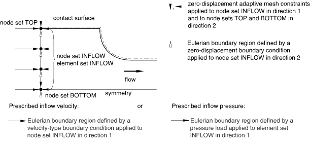
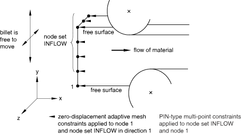

# 12.2.4 在 Abaqus/Explicit 中为欧拉自适应网格域建模技术

**产品：** Abaqus/Explicit  Abaqus/CAE  

##### **参考文献**

- ["ALE 自适应网格划分：概述，" 第 12.2.1 节"](pt04ch12s02abo14.md)
- ["在 Abaqus/Explicit 中定义 ALE 自适应网格域，" 第 12.2.2 节"](pt04ch12s02aus78.md)
- [*ADAPTIVE MESH CONSTRAINT](../key/key-link.md#usb-kws-hadaptivemeshconstraint)
- ["理解 ALE 自适应网格划分，" Abaqus/CAE 用户指南第 14.6 节](../usi/usi-link.md#usi-sim-conc-other-adaptmesh)

### 概述

欧拉自适应网格域：
- 用于模拟流过网格的材料；和
- 通常有两个欧拉边界区域，一个流入和一个流出，由拉格朗日和/或滑动边界区域连接。

施加到欧拉边界区域的网格约束和材料边界条件的正确组合取决于该区域是作为流入还是流出边界。分配给与欧拉边界区域连接的边界区域的类型和网格约束也必须选择为模拟正确的物理行为。

如果网格约束不足，Abaqus/Explicit 中的自适应网格技术是稳健的；本节中提供的建模技术旨在为正确定义欧拉模型提供指导。

### 欧拉边界上的 ALE 自适应网格约束

ALE 自适应网格约束应垂直于欧拉边界区域施加；否则，边界上网格运动的定义不明确。如果垂直于边界没有应用网格约束，Abaqus/Explicit 将把该区域视为滑动区域，网格将跟随边界法线方向的材料。

尽管对在欧拉边界区域节点上指定自适应网格约束没有限制，但在大多数情况下应遵循以下准则：
- 网格约束应应用于欧拉边界区域上的每个节点，包括角和边。
- 网格约束应仅垂直于欧拉边界区域或在所有方向上施加。不应仅在欧拉边界区域的切线方向上指定网格约束；这种约束是模糊的，可能导致边界上网格的不良运动。

欧拉边界上的载荷和边界条件作用于与表面上网格瞬间重合的材料。当与空间自适应网格约束结合使用时，可以定义物理意义上正确的欧拉流动条件。

### 定义流入欧拉边界

通过欧拉边界流入自适应网格域的材料将具有与紧邻边界的单元中材料相同的应力和材料状态。因此，重要的是将这些单元边界处的应力和材料状态保持为所需值（在许多情况下将为零，以模拟流入欧拉域的无应力材料）。为实现此目标：
- 将流入边界放置在远离高解梯度的上游足够距离，以确保流入边界的响应平滑，和
- 在边界处施加足够的网格和材料约束（如本节后面所述）。

为了具有物理意义，流入边界区域的大小和形状必须保持。例如，施加足够的约束对于稳态过程模拟至关重要，因为进入自适应网格域的工件的横截面是已知的，并影响下游的响应。适用于流入边界的约束类型取决于流入边界区域的确切位置是已知还是作为解决方案的一部分。

#### 已知流入边界位置

在许多问题中，流入边界的面积、形状和位置是先验已知的。例如，在正挤压稳态分析中，流入欧拉边界可用于模拟材料流入自适应网格域。流入边界的大小基于已知的坯料横截面，流入边界的位置是固定的，因为材料处于约束状态。

当流入边界的面积、形状和位置已知时，应同时施加材料和网格约束。[图 12.2.4-1](pt04ch12s02aus80.md#aaleeulertech-inflow-known) 显示了二维正挤压问题的典型模型设置，其中向已知流入边界施加了规定的质量流率或规定的均匀压力。在流入边界区域的所有节点上施加边界条件，以在边界表面切线方向上规定材料约束。防止材料沿流入边界切线方向运动有助于维持与欧拉边界相邻单元的应力和材料状态。

**图 12.2.4-1** 已知流入边界。

在流入边界的所有节点上沿法线方向施加自适应网格约束。此外，在围绕欧拉边界区域的边缘和角处沿所有切线方向施加网格约束。这些约束固定了流入边界处横截面的位置和大小。

如果在流入边界处向材料施加非均匀边界条件或载荷，或者如果与边界相邻单元中的初始材料状态在切线方向上不均匀，则将切线网格约束严格施加到欧拉边界区域内部的节点。

尽管沿流入欧拉边界的边缘和角施加切线和网格约束似乎是多余的，但它们实际上是独立的。例如，考虑具有可变横截面的长坯料，如 [图 12.2.4-2](pt04ch12s02aus80.md#aaleeulertech-variable) 所示。

**图 12.2.4-2** 模拟具有可变横截面的坯料。

自适应网格域及其流入和流出欧拉边界区域，假定代表坯料沿其长度的一部分。整个坯料沿其长度（x 方向）以刚体速度移动，使得材料从一个欧拉边界流入，从另一个流出。边界条件施加到流入边界处的材料上以维持该速度。网格约束垂直于流入和流出边界区域施加。在节点 N 处沿 y 方向施加的网格约束用于规定已知的变化入口材料横截面。该节点的运动不影响进入域的材料的速度场。

#### 未知流入边界位置

有时，流入边界区域的位置仅大致已知；其精确位置将从解决方案中确定。对于这些问题，仅沿垂直于欧拉边界区域的方向施加自适应网格约束。在欧拉边界区域的边缘和角处没有切线网格约束的情况下，Abaqus/Explicit 将随材料在切线方向移动这些边缘和角，但在法线方向上跟随网格约束。因此，应使用多点约束（见 ["一般多点约束，" 第 35.2.2 节"](pt08ch35s02aus130.md)）或线性约束方程（见 ["线性约束方程，" 第 35.2.1 节"](pt08ch35s02aus129.md)）施加材料约束，以保留流入边界的横截面积。

例如，考虑具有不对称配置的多辊稳态轧制模拟，如 [图 12.2.4-3](pt04ch12s02aus80.md#aaleeulertech-inflow-unknow) 所示。

**图 12.2.4-3** 未知流入边界位置。

将分析域扩展到上游的导轨可能不切实际，但在 y 和 z 方向上将流入边界空间固定在任意位置可能会导致工件在找到辊之间的平衡位置时产生不现实的应力。网格约束垂直于欧拉边界区域施加，以在 x 方向上相对于辊固定流入边界的位置。材料约束（使用 PIN MPC 施加）用于确保材料以均匀速度进入域，并且横截面不会旋转。材料约束将保持横截面的形状，同时允许其横向移动到正确的平衡位置。由于没有使用切线网格约束，网格将跟随材料沿欧拉边界区域的切线方向运动。

### 定义流出欧拉边界

通常，自适应网格约束应仅垂直于作为流出边界的欧拉边界区域上的表面施加。不应将切线网格约束施加到与作为自由表面的拉格朗日（或滑动）边界区域相邻的流出边界的边缘或角。与流入边界不同，邻接自由表面的流出边界的横截面由域中的解决方案决定。在欧拉边界区域与拉格朗日或滑动边界区域相交的边缘或角处，Abaqus/Explicit 将同时满足垂直于欧拉边界区域施加的网格约束和拉格朗日或滑动边界区域固有的垂直于边界的网格约束，从而正确处理流出边界相邻自由表面的演变。[图 12.2.4-4](pt04ch12s02aus80.md#aaleeulertech-free-surface) 显示了流出边界从  到  的演变，其中材料继续通过流出边界流出。

**图 12.2.4-4** Abaqus/Explicit 将在欧拉流出边界处尊重自由表面。

垂直于欧拉流出边界的网格约束通过沿材料自由表面移动节点 N 来施加，使得流出边界随材料从上游到达而"扩展"。虽然图中未显示，但网格平滑导致流出边界上的所有其他节点（对称平面上的节点除外）随着边界扩展而向上移动到节点 N。

流出欧拉边界处不需要特殊的材料边界条件。仅当与上游定义的相同（如，沿欧拉域长度延伸的对称平面）时，才建议沿流出边界切线的边界条件。然而，为了改善稳态过程模拟中向稳态解决方案的收敛，通常使用多点约束或线性约束方程将材料速度约束为垂直于流出边界均匀。

### 定义同时作为流入和流出边界的欧拉边界区域

尽管很少适用，但欧拉边界区域可以在同一分析步骤的不同时间同时作为流入和流出边界。此类边界处的自适应网格约束和材料边界条件应选择为对流入和流出情况都具有物理意义。

对于在欧拉边界区域的边缘和角上且没有切线于边界表面网格约束的每个节点，Abaus/Explicit 将在每个自适应网格增量中确定该节点处的边界是作为流入还是流出边界。如果检测到流入条件，节点将随材料在切线方向移动，但随网格约束在法线方向移动。如果检测到流出条件，节点的移动将同时跟随相邻的拉格朗日边界区域并满足垂直于欧拉边界区域的网格约束。

### 欧拉域上拉格朗日与滑动边界区域

许多使用欧拉自适应网格域的应用程序，包括稳态过程模拟，具有主要的材料流动方向，并使用控制体方法对过程区域进行建模。这些问题通常包括两个欧拉边界区域，代表流入边界和流出边界。欧拉边界之间的剩余表面可以是拉格朗日边界区域或滑动边界区域。确定在两个欧拉边界区域之间使用哪种类型的边界区域取决于所需的载荷或边界条件类型：
- 使用滑动边界区域来定义在控制体长度一部分的表面的空间位置处作用的边界条件或载荷。施加自适应网格约束以在流动方向（可能还有横向于流动的方向）上空间固定网格。例如，可以围绕控制体的圆周施加分布压力，如 [图 12.2.4-5](pt04ch12s02aus80.md#aaleeulertech-press-strip) 所示。**图 12.2.4-5** 在欧拉控制体长度一部分的表面上施加空间压力载荷。分布压力载荷使用滑动边界区域定义。网格约束施加以在流动方向上空间固定边界区域。类似地，集中载荷可以施加到特定空间位置，以模拟非常尖锐的物体以已知力在已知位置压入工件的效果。
- 使用滑动边界区域来定义在欧拉控制体的流入和流出边界之间的整个长度上作用的边界条件或载荷，并且在横向上以空间方式作用。如果载荷仅在横向的一部分表面上作用，则可能需要在横向于流动的方向上施加网格约束。例如，[图 12.2.4-6](pt04ch12s02aus80.md#aaleeulertech-knife-edge) 显示了沿域长度作用的边界条件。沿横向方向（如果施加线是弯曲的，则沿该线）施加网格约束，以使边界条件在空间上固定。**图 12.2.4-6** 在欧拉控制体的整个长度上施加边界条件。
- 使用拉格朗日边界区域（默认）来定义在欧拉控制体的流入和流出边界之间的整个表面上作用的边界条件或载荷，并且在横向上以拉格朗日方式作用。在三维中，对称条件通常应沿流动方向横向以拉格朗日方式作用。在许多情况下，几何边会阻止材料从对称平面向外流动到自由表面。然而，由于几何边可以在表面变平时停用，因此对于这类问题，应使用拉格朗日边界区域来定义对称平面。在 [图 12.2.4-5](pt04ch12s02aus80.md#aaleeulertech-press-strip) 中，假定四分之一对称，对称平面使用拉格朗日边界区域定义。结果是从一个欧拉边界延伸到另一个的拉格朗日边将对称平面与自由表面分开。
- 通常，不能为使用欧拉控制体的建模问题定义仅作用于流入和流出边界之间特定部分材料的边界条件或载荷。由于载荷或边界条件下的网格必须跟随材料，它最终将受到欧拉边界的限制。这种载荷和边界条件的处理通常与稳态模型不一致，不应出现在使用欧拉自适应网格域的实际模拟中。

