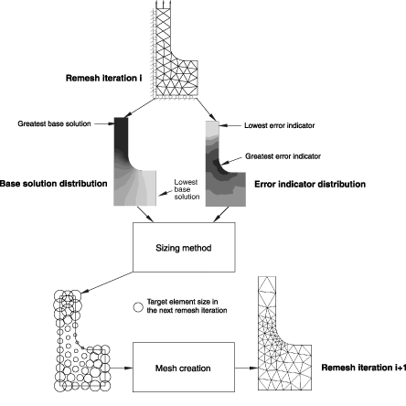
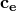
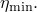
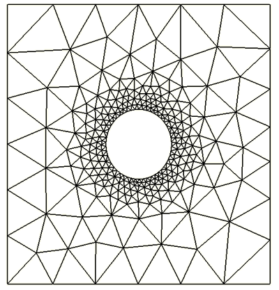

# 12.3.3 基于解的网格尺寸

**产品：** Abaqus/Standard  Abaqus/CAE  

##### **参考文献**

- ["自适应重新网格划分：概述，" 第 12.3.1 节"](pt04ch12s03abo15.md)
- ["影响自适应重新网格划分的误差指标选择，" 第 12.3.2 节"](pt04ch12s03aus84.md)
- ["理解 ALE 自适应网格划分，" Abaqus/CAE 用户指南第 14.6 节"](../usi/usi-link.md#usi-sim-conc-other-adaptmesh)
- ["高级网格技术，" Abaqus/CAE 用户指南第 17.14 节"](../usi/usi-link.md#usi-mgn-advanced-meshing)

### 概述

基于解的网格尺寸：
- 在 Abaqus/CAE 中执行；和
- 对误差指标输出变量和您的重新网格划分规则参数进行操作（见 ["创建重新网格划分规则，" Abaqus/CAE 用户指南第 17.21.1 节"](../usi/usi-link.md#usi-mgn-adaptivity-rule)）以确定网格的改进单元尺寸分布。

### 尺寸方法的基本操作

尺寸方法在自适应重新网格划分过程中计算新的单元尺寸。Abaqus/CAE 将尺寸方法应用于重新网格划分规则定义的区域上误差指标变量及其相应基本解变量的场。尺寸方法的输出是一组标量尺寸，位于重新网格划分规则定义的区域的节点处。[图 12.3.3-1](pt04ch12s03aus85.md#aadaptivity-sizingmethod) 说明了尺寸操作。[图 12.3.3-1](pt04ch12s03aus85.md#aadaptivity-sizingmethod) 显示了第一次重新网格迭代后的基本解和误差指标分布。尺寸方法确定应在误差指标最大的区域减小单元尺寸，并在误差指标最低的区域增大单元尺寸。展示了从这些目标单元尺寸生成的网格。

**图 12.3.3-1** 尺寸方法操作及其与网格划分的交互。

### 误差指标的特征

您选择的尺寸方法和参数设置对自适应重新网格划分如何改变模型中误差指标分布有显著影响。例如，您可能选择一种尺寸方法，仅在应力集中区域附近积极地降低误差指标。在其他情况下，当结构的整体响应比局部效应更重要时，您可能选择一种在整个区域尝试将误差指标降低到统一水平的尺寸方法。为了理解尺寸方法如何影响误差指标，您应该首先了解误差指标变量的典型特征。

[图 12.3.3-2](pt04ch12s03aus85.md#aadaptivity-errordistribution) 通过模型的一般切片说明了误差指标和相应基本解分布。

**图 12.3.3-2** 误差指标和基本解分布。

[图 12.3.3-2](pt04ch12s03aus85.md#aadaptivity-errordistribution) 说明了以下误差指标特征：
- 在基本解值较高的区域，如 [图 12.3.3-2](pt04ch12s03aus85.md#aadaptivity-errordistribution) 中的单元 "i"，误差指标值相对于基本解的局部值可能较低。在许多情况下，您可能希望使用网格细化来进一步降低这些误差指标。
- 在基本解较低的区域，如 [图 12.3.3-2](pt04ch12s03aus85.md#aadaptivity-errordistribution) 中的单元 "j"，误差指标值相对于基本解的局部值可能较高。在许多情况下，您可能对在这些区域获得准确解不感兴趣。

这些特征会影响您对尺寸方法的选择以及在尺寸方法中设置哪些参数的决定。

### 尺寸方法

尺寸方法利用误差目标的概念，，它以归一化百分比形式表示，定义了一般目标

其中  是误差指标的度量， 是基本解的度量。基于您在创建重新网格划分规则时对误差目标的定义，Abaqus/CAE 创建一个尺寸分布，尝试在使用重新网格化模型的后续分析作业中满足您的误差目标。误差目标的具体含义取决于您选择的尺寸方法。

Abaqus/CAE 提供两种基本尺寸方法：**最小/最大控制**和**均匀误差分布**。您还可以选择第三种方法**默认方法和参数**，这将导致 Abaqus/CAE 根据您的误差指标变量选择为您选择其中一种基本尺寸方法。

| **Abaqus/CAE 用法：** | 网格模块：**创建重新网格划分规则**：**尺寸方法** |
| --- | --- |

#### 最小/最大控制

最小/最大控制方法在重新网格划分模型方面提供了最大的灵活性。此方法具有以下特征：
- 两个用于控制尺寸的误差指标目标。 控制基本解（如应力）最高区域的尺寸， 控制基本解最低区域的尺寸。
- 在高和低基本解值区域之间误差目标连续变化，提供偏置因子参数来控制变化。
- 为避免在基本解较小的单元处过度细化，当单元基本解小于全局平均单元基本值时，选择全局平均单元基本值。
- 如果奇异性存在于重新网格划分规则区域，此方法将无法满足误差目标，因为发生在奇异性位置的最大基本解是无限的。

您可以允许 Abaqus 自动选择目标，也可以指定误差目标。类似地，您可以接受 Abaqus/CAE 显示的默认偏置因子，也可以指定定性偏置因子。

| **Abaqus/CAE 用法：** | 网格模块：**创建重新网格划分规则**：**尺寸方法**：**方法**：选择**最小/最大控制** |
| --- | --- |

##### 允许 Abaqus/CAE 选择误差目标

如果您指定最小/最大误差控制方法而未设置误差目标，Abaqus/CAE 自动选择误差目标  和 。两个目标都计算为前一次重新网格迭代分析中误差指标结果的一部分。自动误差目标降低是网格细化研究的良好选择，在这些研究中您没有特定的误差目标，但希望看到网格细化对结果的影响。

| **Abaqus/CAE 用法：** | 网格模块：**创建重新网格划分规则**：**尺寸方法**：**误差目标**；选择**自动误差目标降低** |
| --- | --- |

##### 指定误差目标

作为自动误差目标降低的替代方案，您可以指定两个误差目标， 和 。[图 12.3.3-2](pt04ch12s03aus85.md#aadaptivity-errordistribution) 说明了这两个位置。 应用于单元 ， 应用于单元 。

使用两个误差目标的值，Abaqus/CAE 应用一种尺寸方法，尝试在各自的位置同时满足  和 。

| **Abaqus/CAE 用法：** | 网格模块：**创建重新网格划分规则**：**尺寸方法**：**误差目标**；选择**固定误差目标**；输入最大基本解误差指标目标  和最小基本解误差指标目标  |
| --- | --- |

##### 偏置因子

您可以使用重新网格划分规则中的偏置因子定义进一步调整最大和最小基本解位置之间的尺寸分布。偏置因子定义了在重新网格区域中这两个极端之间尺寸分布的梯度，如 [图 12.3.3-3](pt04ch12s03aus85.md#aadapting-globallocal-targets) 所示。

**图 12.3.3-3** 偏置因子对单元尺寸分布的影响。

您可以将此因子设置在两个定性极端之间："弱"和"强"。在弱极端，单元尺寸在远离最大基本解的位置最快增加。在强极端，单元尺寸增加最慢。默认设置为偏向强极端。

| **Abaqus/CAE 用法：** | 网格模块：**创建重新网格划分规则**：**尺寸方法**：**网格偏置**；拖动滑块到**弱**和**强**之间的设置 |
| --- | --- |

#### 均匀误差分布

均匀误差分布方法为控制尺寸提供单一的误差指标目标 。Abaqus/CAE 应用一种尺寸方法，使得重新网格划分规则区域中的总误差均匀分布在所有单元上并满足给定的误差指标目标。此方法尝试为整个重新网格划分规则区域集体满足误差指标目标，但不是每个单元都满足。因此，奇异性不会阻止自适应过程实现误差目标。

| **Abaqus/CAE 用法：** | 网格模块：**创建重新网格划分规则**：**尺寸方法**：**方法**：选择**均匀误差分布** |
| --- | --- |

##### 允许 Abaqus/CAE 选择误差目标

如果您指定均匀误差分布方法而未设置误差目标，Abaqus/CAE 自动选择误差目标 。目标计算为前一次重新网格迭代分析中误差指标结果的一部分。自动误差目标降低是网格细化研究的良好选择，在这些研究中您没有特定的误差目标，但希望看到网格细化对结果的影响。

| **Abaqus/CAE 用法：** | 网格模块：**创建重新网格划分规则**：**尺寸方法**：**误差目标**；选择**自动误差目标降低** |
| --- | --- |

##### 指定误差目标

作为自动误差目标降低的替代方案，您可以指定单一误差目标 。当您使用均匀误差分布方法时，Abaqus/CAE 将误差目标与归一化形式误差指标的全局范数进行比较。这种方法确保区域内网格的全局收敛。

| **Abaqus/CAE 用法：** | 网格模块：**创建重新网格划分规则**：**尺寸方法**：**误差目标**：选择**固定误差目标**；输入误差指标目标  |
| --- | --- |

#### 默认尺寸方法和参数

此方法导致应用**最小/最大控制**或**均匀误差分布**方法的**自动误差目标降低**形式，并根据 [表 12.3.3-1](pt04ch12s03aus85.md#usb-anl-aadpsizing-table) 根据误差指标变量应用该方法。

**表 12.3.3-1** 每个误差指标的默认尺寸方法。
| 解的量 | 误差指标变量 | 默认尺寸方法 |
| --- | --- | --- |
| 单元能量密度 | ENDENERI | 均匀误差分布 |
| Mises 应力 | MISESERI | 最小/最大控制 |
| 等效塑性应变 | PEEQERI | 最小/最大控制 |
| 塑性应变 | PEERI | 最小/最大控制 |
| 蠕变应变 | CEERI | 最小/最大控制 |
| 热通量 | HFLERI | 均匀误差分布 |
| 电通量 | EFLERI | 最小/最大控制 |
| 电势梯度 | EPGERI | 最小/最大控制 |

当您的重新网格划分规则引用多个误差指标时，尺寸方法将独立应用于每个误差指标变量，生成的局部尺寸基于每个尺寸方法计算的最小尺寸。

| **Abaqus/CAE 用法：** | 网格模块：**创建重新网格划分规则**：**尺寸方法**：**方法**：选择**默认方法和参数** |
| --- | --- |

#### 示例：带圆形应力集中的板

最小/最大控制和均匀误差分布方法基本行为的差异通过一个简单示例说明。[图 12.3.3-4](pt04ch12s03aus85.md#aadaptivity-hole-iter0) 显示了带孔板在简单加载下的应力结果。

**图 12.3.3-4** 承受均匀水平边界牵引的平面应力带孔板的初始网格和 Mises 应力分布。

##### 最小/最大控制

[图 12.3.3-5](pt04ch12s03aus85.md#aadaptivity-hole-minmax1) 说明了当用户选择最小/最大控制方法并指定两个误差目标（ 和 ）时 Abaqus/CAE 生成的自适应网格。在此示例中 =5% 和 =1%，网格偏置设置为默认设置。这些设置导致网格紧密集中在孔附近（应力集中），同时平滑地过渡到远离孔的相对粗糙网格。

**图 12.3.3-5** 最小/最大控制尺寸方法产生的自适应重新网格。

##### 均匀误差分布

[图 12.3.3-6](pt04ch12s03aus85.md#aadaptivity-hole-uniform1) 说明了当用户选择均匀误差分布方法并指定单一均匀误差指标目标（）时 Abaqus/CAE 生成的自适应网格。在此示例中 =1%。此设置导致网格集中在孔（应力集中）周围，同时也在应力较低区域细化网格。

**图 12.3.3-6** 均匀误差分布尺寸方法产生的自适应重新网格。

### 其他重新网格划分规则设置的影响

您在创建重新网格划分规则时指定尺寸方法，尺寸方法在自适应重新网格划分过程中计算新的单元尺寸。但是，重新网格划分规则中的以下附加设置会影响 Abaqus/CAE 生成的网格，无论您选择的尺寸方法如何：
- 区域选择，
- 步骤和帧选择，
- 尺寸约束，
- 近似最大单元数量，和
- 细化和粗化速率因子。

#### 区域选择

尺寸方法在元素集上定义，对应于在 Abaqus/CAE 中应用重新网格划分规则的区域。在每个元素集中，Abaqus/CAE 将尺寸操作应用于重新网格划分规则中指定的误差指标变量。尺寸操作的结果基于整个单元计算到最近节点的外推，结果是基于节点的。

| **Abaqus/CAE 用法：** | 网格模块：**创建重新网格划分规则**：**编辑区域** |
| --- | --- |

#### 步骤和帧选择

Abaqus 将尺寸操作仅应用于指定步骤中最后一个可用帧的误差指标变量。见 ["误差指标特征" 在 "影响自适应重新网格划分的误差指标选择，" 第 12.3.2 节"](pt04ch12s03aus84.md#usb-anl-aadperrorindicators-choosing)，了解您的步骤、帧和误差指标选择如何影响您在瞬态分析中捕获响应的能力的讨论。

| **Abaqus/CAE 用法：** | 网格模块：**创建重新网格划分规则**：**步骤和指标**：**步骤**；选择应用规则的步骤 |
| --- | --- |
|  | 和网格模块：**创建重新网格划分规则**：**步骤和指标**：**输出频率**；选择**步骤的最后增量**或**步骤的所有增量** |

#### 尺寸约束

创建重新网格划分规则时，可以通过为您定义的重新网格规则区域指定大于或小于尺寸约束来约束尺寸操作。Abaqus/CAE 为这些约束提供默认设置。
- 默认最小单元尺寸约束是应用重新网格划分规则的部件实例的默认边界种子大小的 1%。
- 默认最大单元尺寸约束是应用重新网格划分规则的部件实例的默认边界种子大小的 10 倍。

| **Abaqus/CAE 用法：** | 网格模块：**创建重新网格划分规则**：**约束**：**单元尺寸** |
| --- | --- |

#### 近似最大单元数量

对于重新网格划分规则，您可以指定最大单元数量的近似限制。通过使用此约束，您可以控制分析成本并确保不会创建过大的网格。当定义此约束时，如果目标误差需要比指定限制更多的单元，Abaqus/CAE 将在内部降低目标误差，使得生成的单元大致满足指定的单元数量。使用此约束可能会阻止自适应过程实现误差目标。默认情况下，此约束未激活。

| **Abaqus/CAE 用法：** | 网格模块：**创建重新网格划分规则**：**约束**：**近似最大单元数量** |
| --- | --- |

#### 细化和粗化速率因子

您指定的细化和粗化因子根据迭代到迭代的网格变化定义了对网格尺寸的约束。这些因子调节尺寸方法的侵略性。细化因子控制网格的细化或较小单元的引入。粗化因子控制网格的粗化或较大单元的引入。Abaqus/CAE 为这些速率因子提供默认设置，这些设置旨在防止在单次重新网格迭代中过度粗化或代价过高的细化。

细化因子对自适应网格过程的收敛有显著影响。一旦您确定了适合您应用的尺寸方法参数，您可能能够通过增加细化因子来更快、更高效地实现网格收敛。然而，在您的自适应过程收敛不佳的情况下，增加细化因子可能导致重新网格迭代中单元的过度增加。

| **Abaqus/CAE 用法：** | 网格模块：**创建重新网格划分规则**：**约束**：**速率限制** |
| --- | --- |

### 协调重叠的重新网格划分规则

Abaqus/CAE 对与重新网格划分规则关联的区域或步骤没有限制。您可以同时将多个重新网格划分规则（因此也包括多个尺寸函数）应用于相同区域。类似地，您可以指定相互重叠的重新网格划分规则。当 Abaqus/CAE 生成新网格时，它会考虑所有位置的所有重新网格划分规则，并使用计算出的最小单元尺寸来驱动网格算法。

