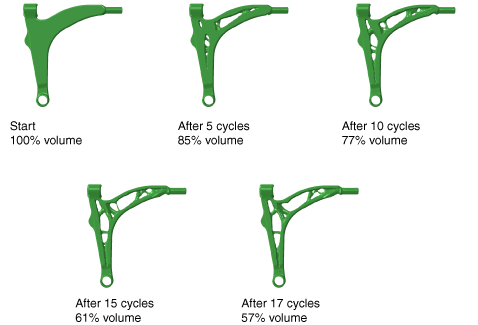
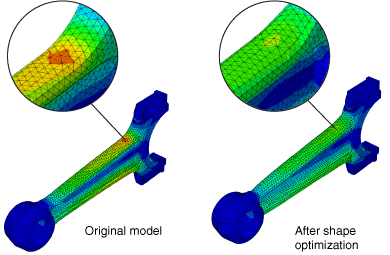

# 13.1.1 结构优化：概述

使用 Abaqus 进行结构优化是一个迭代过程，可帮助您完善设计。设计良好的结构优化的结果是获得轻量、刚性且耐用的组件。Abaqus 提供了三种结构优化方法——拓扑优化、形状优化和尺寸优化。拓扑优化从初始模型开始，通过修改选定元素区域的材料属性来确定最佳设计，有效地从分析中移除元素。形状优化和尺寸优化可进一步细化模型。形状优化通过移动表面节点来修改组件的表面，以减少局部应力集中。尺寸优化通过更改钣金组件的板厚来进行修改；通常是为了增加刚度或减少振动。拓扑优化、形状优化和尺寸优化都受一组目标和约束的支配。

优化是一种缩短开发过程的工具，通过自动化过程将价值添加到设计者的经验和直觉中。要优化模型，您需要知道要优化什么。仅说想要最小化应力或最大化特征值是不够的，您的表述必须更加具体。例如，您可能希望最小化两个载荷工况期间经历的最大节点应力。同样，您可能希望最大化前五个特征值之和。优化的目标称为目标函数。此外，您可以在优化期间强制执行某些值。例如，您可以指定给定节点的位移不得超过某个值。强制执行的值称为约束。

您使用 Abaqus/CAE 创建要优化的模型，并定义、配置和执行结构优化。有关更多信息，请参阅 ["优化模块，" Abaqus/CAE 用户手册第 18 章](../usi/usi-link.md#usi-opz)。

### 术语

结构优化有其自己的术语。以下术语在 Abaqus 文档和 Abaqus/CAE 用户界面中使用：

**设计区域**：设计区域是结构优化修改的模型区域。设计区域可以是整个模型，也可以是仅包含选定区域的模型子集。根据规定条件（如边界条件、载荷和制造约束）：
- 拓扑优化过程在设计区域内的元素中移除和添加材料，同时尝试达到最优设计，以及
- 形状优化通过移动表面节点来修改设计区域的表面，以及
- 尺寸优化通过更改壳元素的厚度来修改设计区域的厚度。

**设计变量**：对于优化问题，设计变量表示在优化期间要更改的参数。对于拓扑优化，设计区域中元素的密度是设计变量。优化模块在优化的每次迭代中更改密度，并将每个元素的刚度与密度耦合。实际上，优化通过赋予元素足够小的质量和刚度来从模型中移除元素，以确保它们不再参与结构的整体响应。然后，Abaqus 分析具有修订材料属性的模型。对于形状优化，设计区域中表面节点的位移是设计变量。在优化期间，优化模块要么将节点向外移动（增长）要么向内移动（收缩），要么保持位置不变（中性）。限制会影响表面节点可以移动的距离和方向。优化直接修改元素角节点的位置；优化模块从角节点的移动插值计算边中节点的位移。对于尺寸优化，设计区域中壳元素的厚度是设计变量。优化模块可以调整单个壳元素的厚度，或者您可以要求聚类——同时修改特定区域的壳厚度。

**设计循环**：优化是一个迭代设计过程，更新设计变量，执行修改模型的 Abaqus 分析，并审查结果以确定是否达到优化解决方案。每个优化迭代称为设计循环。

**优化任务**：优化任务包含您的优化定义，如设计响应、目标、约束和几何限制。要运行优化，您需要执行优化过程。优化过程引用优化任务。

**设计响应**：优化的输入称为设计响应。设计响应可以直接从 Abaqus 输出数据库（`.odb`）文件读取；例如刚度、应力、特征频率和位移。或者，优化模块可以从输出数据库文件读取数据并从模型计算设计响应；例如，其重量、质心或相对位移。设计响应与模型的某个区域相关联；但是，它由单个标量值组成，例如区域内最大应力或模型总体积。此外，设计响应可以与特定步骤或载荷工况相关联。

**目标函数**：目标函数定义优化的目标。目标函数是从设计响应中提取的单个标量值，例如最大位移或最大应力。目标函数可以从多个设计响应中制定。如果指定目标函数最小化或最大化设计响应，优化模块通过将设计响应确定的值相加来计算目标函数。此外，如果您有多个目标函数，可以使用加权因子来缩放它们对优化的影响。

**约束**：约束也是从设计响应中提取的单个标量值；但是，约束不能从设计响应的组合中得出。约束限制设计响应的值；例如，您可以指定体积必须减少 45%，或者区域内绝对位移不得超过 1 mm。您还可以应用独立于优化的制造和几何约束；例如，结构必须能够铸造或冲压，或者轴承表面的直径不能更改。

**停止条件**：全局停止条件定义优化可以执行的最大迭代次数。局部停止条件指定当达到局部最小值（或最大值）时优化应结束。

### 使用 Abaqus/CAE 进行结构优化

将结构优化纳入 Abaqus/CAE 模型需要以下步骤：
- 创建一个可以优化的 Abaqus 模型。例如，设计区域必须仅包含支持的元素和材料。请参阅 ["创建 Abaqus 优化模型，" 第 13.2.3 节](pt04ch13s02aus89.md)。
- 创建一个优化任务。请参阅 ["创建和配置优化任务，" Abaqus/CAE 用户手册第 18.6 节](../usi/usi-link.md#usi-opz-taskeditor)。
- 创建设计响应。请参阅 ["设计响应，" 第 13.2.1 节](pt04ch13s02aus87.md)。
- 使用设计响应创建目标函数和约束。请参阅 ["目标和约束，" 第 13.2.2 节](pt04ch13s02aus88.md)。
- 创建优化过程并提交分析。请参阅 ["什么是优化过程？，" Abaqus/CAE 用户手册第 19.5.1 节](../usi/usi-link.md#usi-ana-opt-whatis)。

根据优化任务和优化过程的定义，优化模块迭代：
- 准备设计变量（元素密度或表面节点位置）并更新 Abaqus 有限元模型，以及
- 执行 Abaqus/Standard 分析。

这些迭代或设计循环继续，直到：
- 达到最大设计循环次数，或
- 达到指定的停止条件。

[图 13.1.1--1](pt04ch13s01abo16.md#aoptimization-bigloop-nls) 显示了 Abaqus 和优化过程的交互。

**图 13.1.1–1** 优化过程中用户操作和自动化的 Abaqus/CAE 操作。

### 拓扑优化

拓扑优化从初始设计（原始设计区域）开始，其中也包含任何规定条件（如边界条件和载荷）。优化过程通过在继续满足优化约束的同时更改初始设计中元素的密度和刚度来确定新的材料分布，例如区域的最小体积或最大位移。

[图 13.1.1--2](pt04ch13s01abo16.md#aoptimization-progression) 显示了汽车控制臂在 17 个设计循环中拓扑优化的进展。优化中的目标函数试图最小化从臂中所有元素计算的最大应变能，实际上是最大化臂的结构刚度。约束迫使优化将体积从初始值减少 57%。在优化期间，臂中心元素的密度和刚度降低，从而有效地从分析中"移除"元素。但是，元素仍然存在，如果优化继续，它们的密度和刚度增加，它们可能会在分析中发挥作用。几何限制迫使优化创建一个可以铸造并从模具中取出的模型——优化模块不能创建型芯和倒扣。

**图 13.1.1–2** 拓扑优化的进展。

Abaqus 可以将以下目标应用于拓扑优化过程：
- 应变能（结构刚度的度量），
- 特征频率，
- 内力和反作用力，
- 重量和体积，
- 质心，以及
- 惯性矩。

您可以将相同的变量作为约束应用于拓扑优化过程。此外，您可以应用许多确保拟议设计可以使用标准生产工艺（如铸造和冲压）创建的生产约束。您还可以冻结选定区域并应用构件尺寸、对称性和耦合约束。

使用拓扑优化的示例在 ["汽车控制臂的拓扑优化，" Abaqus 例题手册第 11.1.1 节](../exa/exa-link.md#exa-opt-controlarm) 中提供。该示例包含一个 Python 脚本，您可以从 Abaqus/CAE 运行该脚本来创建模型和配置优化。

### 通用与基于条件的拓扑优化

拓扑优化支持两种算法——通用算法（更灵活，可应用于大多数问题）和基于条件的算法（更高效，但能力有限）。默认情况下，优化模块使用通用算法；但是，您可以在创建优化任务时选择使用哪种算法。每种算法都有不同的方法来确定优化解决方案。

#### 算法

通用拓扑优化使用一种算法，在尝试满足目标函数和约束的同时调整设计变量的密度和刚度。通用算法部分在 Bendse 和 Sigmund（2003）中描述。相比之下，基于条件的拓扑优化使用更高效的算法，该算法使用应变能和节点处的应力作为输入数据，不需要计算设计变量的局部刚度。基于条件的算法由德国卡尔斯鲁厄大学开发，在 Bakhtiary（1996）中描述。

#### 具有中间密度的元素

通用算法在最终设计中生成中间元素（其相对密度介于零和一之间）。相比之下，基于条件的优化算法在最终设计中生成的元素要么是空隙（其相对密度非常接近零），要么是固体（其相对密度等于一）。

#### 优化设计循环次数

通用优化算法使用的设计循环次数在优化开始前是未知的，但通常在 30 到 45 之间。基于条件的优化算法更高效，搜索解决方案直到达到最大优化设计循环次数（默认为 15）。

#### 分析类型

通用算法支持线性静力和线性特征频率有限元分析的响应。两种算法都支持几何非线性和接触，许多非线性材料也被支持。

此外，在静态拓扑优化中允许在 Abaqus 模型中使用预定义位移。但是，对于模态分析不允许预定义位移。您可以对使用复合材料的结构使用拓扑优化；但是，不能使用拓扑优化修改复合材料的各个层。例如，您不能更改纤维的方向。

#### 目标函数和约束

通用拓扑优化算法可以使用一个目标函数和多个约束，其中约束都是不等式约束。各种设计响应可用于定义目标和约束，如应变能、位移和转角、反作用力和内力、特征频率以及材料体积和重量。基于条件的拓扑优化算法更高效；但是，它不太灵活，仅支持应变能（刚度的度量）作为目标函数，材料体积作为等式约束。

### 形状优化

形状优化使用的算法与基于条件的拓扑优化算法相似。当组件的一般布局固定且仅允许通过在选定区域中重新定位表面节点进行微小更改时，您可以在设计过程结束时使用形状优化。形状优化从需要微小改进的有限元模型或拓扑优化生成的有限元模型开始。

通常，形状优化的目标是使用应力分析的结果来修改组件的表面几何，直到达到所需的应力水平，从而最小化应力集中。形状优化尝试定位选定区域的表面节点，直到整个区域的应力恒定（应力均匀化）。[图 13.1.1--3](pt04ch13s01abo16.md#aoptimization-shape-nls) 显示了连杆底部的区域，其中表面节点已被形状优化移动以减少应力集中的影响。

**图 13.1.1–3** 形状优化的效果。

您可以将以下目标应用于形状优化过程：
- 应力和接触应力，
- 选定的固有频率，以及
- 弹性、塑性和总应变及应变能密度。

您只能将体积约束应用于形状优化。此外，您可以应用许多确保拟议设计可以继续使用铸造或冲压工艺生产的制造几何限制。您还可以冻结选定区域并应用构件尺寸、对称性和耦合限制。

使用形状优化的示例在 ["连杆的形状优化，" Abaqus 例题手册第 11.2.1 节](../exa/exa-link.md#exa-opt-conrod) 中提供。该示例包含一个 Python 脚本，您可以从 Abaqus/CAE 运行该脚本来创建模型和配置优化。

#### 对形状优化应用网格平滑

在形状优化期间，优化模块修改模型的表面。如果优化模块仅修改表面节点而不调整内部节点，则表面元素层会变得扭曲。因此，Abaqus 分析的结果不再可靠，优化质量会受到影响。为了保持表面元素的质量，优化模块可以对选定区域应用网格平滑，这会根据表面节点的移动调整内部节点的位置。在开始形状优化之前，您必须具有良好的有限元网格，特别是在您期望形状发生变化的区域。

优化模块可以对标准连续元素（如三角形、四边形和四面体元素）应用网格平滑。其他元素类型在网格平滑期间被忽略。您可以指定平滑网格的相对质量，并且可以指定定义被视为良好质量的元素的角范围（四边形和三角形元素）或长宽比范围（四面体元素）。被评为较差的元素会获得质量评级。元素评级越差，在改善元素质量时将被给予更多考虑。

网格平滑可能计算成本很高。网格平滑算法是基于元素的；在具有许多元素和有限自由度（如具有小四面体元素的区域）的区域中，计算时间会增加。您应该仅对期望表面节点移动的区域应用网格平滑——将从网格平滑中受益的区域。在您对其应用网格平滑的区域中，节点必须能够自由移动。例如，您不应将网格平滑应用于固定节点或冻结区域。

您可以通过对选定区域应用最小和最大增长限制来限制网格平滑的结果。请参阅 ["创建生长限制" 在"形状优化中的几何限制，" Abaqus/CAE 用户手册第 18.10.3 节](../usi/usi-link.md#usi-opz-shape-growthrestrict)，获取更多信息。

网格平滑可以应用于包含在设计区域内和设计区域外的区域。特别是，您可以通过对设计区域和模型其余部分之间的过渡区域应用网格平滑来防止元素扭曲。但是，设计区域必须包含在您应用网格平滑的区域内。

自由表面节点定义为位于设计区域外且不包含在几何限制中的节点。默认情况下，优化模块固定所有自由表面节点的所有自由度，它们在网格平滑操作期间不会被修改。或者，您可以选择允许自由表面节点与设计区域中节点相邻的指定层数节点一起移动。（"一层"节点仅由角节点创建；不考虑边中节点。）

您应该允许与设计区域相邻的区域中的自由表面节点移动，以在优化和非优化区域之间创建平滑过渡。但是，在某些情况下，您会希望自由表面节点保持固定；例如，在对优化模型不起作用且必须保持平面的平面上。

默认情况下，使用约束拉普拉斯网格平滑算法。或者，如果您有一个相对较小的模型（网格平滑区域少于 1000 个节点），您可以选择局部梯度网格平滑算法。在每次迭代中，局部梯度网格平滑算法识别具有最差元素质量的元素，并通过移动节点来改善它们。局部梯度网格平滑通常生成具有最优形状的元素，其中最优定义为元素体积（壳元素为面积）与其直径相应幂的比值。对于较大的模型，局部梯度网格平滑算法往往会在达到最优网格质量之前停止，因为计算时间变得过多。当网格平滑过早结束时，仅会平滑具有最差元素质量的元素。

### 尺寸优化

与形状优化类似，当组件的一般布局固定且仅允许通过在选定区域中更改壳厚度进行微小更改时，您可以在设计过程结束时使用尺寸优化。尺寸优化从需要微小改进的有限元模型或拓扑优化生成的有限元模型开始。优化模块使用基于移动渐近线方法的通用算法来解决尺寸优化问题，该方法在 Svanberg（1985）中描述。

通常，尺寸优化的目标是在满足重量目标的同时最大化组件的刚度。

Abaqus 可以将以下目标应用于尺寸优化过程：
- 应变能（结构刚度的度量），
- 特征频率，
- 内力和反作用力，
- 动态位移、速度和加速度，
- 重量和体积，
- 质心，以及
- 惯性矩。

您可以将相同的变量作为约束应用于尺寸优化过程。此外，您可以应用冻结选定区域的几何限制，并应用构件尺寸和对称性约束。您还可以为壳元素厚度提供上下限，并将区域分组为具有相等壳厚度的"聚类"。您可以使用可视化模块查看尺寸优化后壳厚度的变化。

使用尺寸优化的示例在 ["换档控制器的尺寸优化，" Abaqus 例题手册第 11.3.1 节](../exa/exa-link.md#exa-opt-gearshift) 中提供。该示例包含一个 Python 脚本，您可以从 Abaqus/CAE 运行该脚本来创建模型和配置优化。

#### 在尺寸优化中应用聚类

配置尺寸优化时，您可以指定选定区域应包含相等厚度壳元素的"聚类"。您可以使用聚类在正在优化的钣金结构中生成加强筋或环，或定义相等厚度区域之间的边界。聚类区域可以使用恒定厚度的板材在制造中再现；例如，通过焊接和冲压单个钣金结构形成的汽车"白车身"。为了允许最大的设计灵活性，您应该首先在没有指定聚类的的情况下优化结构，并使用初始设计来决定在最终优化中要对哪些区域进行聚类。

[图 13.1.1--4](pt04ch13s01abo16.md#usb-aoptimization-sizing-thickness) 显示了一个钣金臂，该臂经过"自由"尺寸优化进行了优化，允许在设计区域中修改厚度，而不考虑相邻壳元素的厚度。[图 13.1.1--5](pt04ch13s01abo16.md#usb-aoptimization-sizing-clusterthickness) 显示了同一模型，其中在设计区域中具有相等厚度壳元素的聚类环。自由优化生成的零件比聚类优化生成的零件更刚性，但自由优化生成的零件在实际制造中不实用。

**图 13.1.1–4** 自由优化后壳厚度的绝对值。

**图 13.1.1–5** 带聚类优化后壳厚度的绝对值。

