# 13.2.1 设计响应

**产品：** Abaqus/CAE  

##### **参考文献**

- ["结构优化：概述，" 第 13.1.1 节"](pt04ch13s01abo16.md)
- ["配置设计响应，" Abaqus/CAE 用户指南第 18.7 节"](../usi/usi-link.md#usi-opz-designresponsedit)

### 概述

设计响应：
- 是单一标量值，如结构的体积；
- 由优化模块通过从输出数据库文件读取结果和模型数据来计算；
- 可以从目标函数和约束中引用（例如，您可以创建一个目标函数来最小化节点处的位移，或一个约束来强制结构的重量至少减少 50%）；和
- 仅适用于某些分析过程（例如，如果您选择试图最大化最低固有频率的设计响应，则必须执行特征值提取分析）。

### 设计响应运算符

您必须指定优化模块将用于得出设计响应的单一标量值的运算，尽管有一些限制适用。例如，体积设计响应只能使用设计区域内的体积和。对于计算 von Mises 应力的设计响应，必须使用区域内应力的最大值。（当优化模块计算动态频率设计响应时，这些运算符都不相关。）优化模块提供以下设计响应运算符：

**最小值或最大值**：所选区域内的最小值或最大值。对于应力、接触应力和应变设计响应，优化模块仅允许最大运算符。

**和**：所选区域内所有值的和。对于体积、重量、惯性矩和重力设计响应，优化模块仅允许和运算符。

### 基于条件的拓扑优化的设计响应

优化模块为基于条件的拓扑优化提供了应变能和体积设计响应。

#### 应变能

结构的柔度是其整体灵活性或刚度的度量，定义为所有单元的应变能之和，（对于线性模型），其中 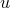 是位移向量， 是全局刚度矩阵。柔度是刚度的倒数，最小化柔度等同于最大化全局刚度。如果载荷情况由力或压力驱动，您应该选择最小化应变能以最大化全局刚度。然而，如果载荷情况由热场驱动，当优化修改结构使其更软时，应变能会降低。因此，您应该始终选择最大化应变能，因为试图最小化应变能可能导致刚性结构。此外，如果为模型施加了规定位移，您应该始终选择最大化应变能。

拓扑优化考虑所有单元的总应变能；因此，如果您选择应变能作为目标函数，则必须将目标应用于整个模型。您不能在优化中使用应变能作为约束。

| **Abaqus/CAE 用法：** | 优化模块：****任务*****基于条件的拓扑任务*******设计响应****创建**：**单项目**，**变量** **应变能** |
| --- | --- |

#### 体积

体积定义为设计区域中单元体积之和，，其中  是单元体积。在拓扑优化期间，单元按 Abaqus 模型中定义的当前相对密度进行缩放。对于大多数优化问题，您必须施加体积约束。例如，如果您试图最小化应变能（最大化刚度）并且不施加体积约束，优化模块只是用材料填充整个设计区域。

| **Abaqus/CAE 用法：** | 优化模块：****任务*****基于条件的拓扑任务*******设计响应****创建**：**单项目**，**变量：** **体积** |
| --- | --- |

### 一般和尺寸拓扑优化的设计响应

优化模块为一般和尺寸拓扑优化提供了质心、位移、旋转、固有频率、能量刚度、惯性矩、内部和反作用力及力矩、应变能、体积和重量设计响应。此外，优化模块为一般拓扑优化提供了应力设计响应。

#### 质心

您可以使用所选区域的质心作为优化中的设计响应。您可以选择三个主方向上的质心：

当优化模块计算质心时，单元按 Abaqus 模型中定义的当前相对密度进行缩放。

例如，您可能希望约束 Y 方向上的质心，使其在优化期间保持在最小和最大范围内。设计响应可以考虑整个模型或模型区域的质心。

如果您选择局部坐标系，优化模块使用轴的方向和原点的位置来重新计算质心。如果您没有选择局部坐标系，优化模块应用全局坐标系。

当优化模块计算质心时，它通过应用区域的厚度将壳单元和膜区域视为三维区域。优化模块仅使用拓扑优化支持的单元类型计算质心。因此，优化模块计算的质心可能与 Abaqus/Standard 或 Abaqus/Explicit 计算的质心不相同；例如，如果您的模型包含线区域。

| **Abaqus/CAE 用法：** | 优化模块：****任务*****一般拓扑或尺寸任务*******设计响应****创建**：**单项目**，**变量：** **质心** |
| --- | --- |

#### 位移和旋转

在大多数优化问题中，您将使用位移和/或旋转来定义目标函数或约束。例如，顶点的最大位移可以是优化的目标或约束。如果您仅将位移和旋转应用于顶点或小区域，则优化的性能会得到改善。此外，如果您分配用于定义位移或反作用的区域为冻结区域（优化模块在优化期间不会从冻结区域移除单元），则性能会得到改善。

[表 13.2.1-1](pt04ch13s02aus87.md#usb-anl-aoptdesignresponses-gentop-disp) 列出了可用的位移和旋转变量。

**表 13.2.1-1** 一般和尺寸拓扑优化的位移和旋转变量。
|  | 位移 | 旋转 |
| --- | --- | --- |
| i 方向 |  |  |
| 绝对值 |  |  |
| i 方向的绝对值 |  | 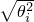 |

| **Abaqus/CAE 用法：** | 优化模块：****任务*****一般拓扑或尺寸任务*******设计响应****创建**：**单项目**，**变量：** **位移** |
| --- | --- |

#### 能量刚度度量

能量刚度是一种没有物理意义的度量，但可用作一般拓扑或尺寸优化中的目标函数或约束，以优化承受外部载荷和规定位移的结构的刚度。

要优化仅具有外部载荷的结构的刚度，应最小化应变能：

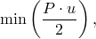

其中  是外部载荷， 是加载节点产生的挠度。如果只有外部载荷存在，能量刚度度量等于总应变能，也称为柔度。

相比之下，如果载荷情况由规定位移驱动，则柔度只会因结构变软而降低。要优化仅具有规定位移的结构，应最大化应变能：

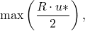

其中  是节点处的规定位移，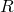 是位移节点处的反作用力。如果只有规定位移存在，能量刚度度量等于总应变能的负值。

外部载荷和规定位移两者的应变能为

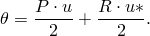

能量刚度度量仅用于优化（它没有物理意义），给出为

您不能在承受热载荷或质量相关载荷（如重力）的模型中将能量刚度度量用作设计响应。能量刚度设计响应必须应用于整个模型。当能量刚度用作目标函数时，无论是否向结构施加外部载荷和/或规定位移，您必须选择试图最小化设计响应与参考值之间加权差之和的目标。

| **Abaqus/CAE 用法：** | 优化模块：****任务*****一般拓扑或尺寸任务*******设计响应****创建**：**单项目**，**变量：** **能量刚度度量** |
| --- | --- |

#### 模态特征频率分析

模态特征值是结构分析中最简单的动态响应。拓扑优化期间特征频率分析数据的典型用途包括：
- 最大化最低固有频率，
- 最大化选定的固有频率，
- 将固有频率约束为高于或低于给定值，
- 在特定模式处最大化或最小化固有频率，和
- 执行频带优化，将模式从特定频率移开。

优化模块支持两种优化固有频率的方法：
- 模态分析的单固有频率和
- Kreisselmaier-Steinhauser 公式。

Kreisselmaier-Steinhauser 公式是两种方法中更高效的，应尽可能使用。优化单固有频率的唯一优势是您可以使用固有频率之和作为一般拓扑或尺寸优化中的约束，而 Kreisselmaier-Steinhauser 公式无法做到这一点。

当您试图最大化最低固有频率时，建议您不仅考虑第一固有频率，还要考虑至少接下来两个最高自然频率。在优化期间，各种自然频率按其与最低自然频率的距离加权——在优化期间自然频率越接近第一自然频率，其加权越重。如果您试图最大化最低固有频率，特别是如果您试图最大化多个最低固有频率，您应该使用 Kreisselmaier-Steinhauser 特征值公式。如果使用 Kreisselmaier-Steinhauser 公式最大化最低固有频率，则不需要使用模式跟踪，但对于更高模式应该使用模式跟踪，因为模式可能会切换。例如，在模型优化期间，第一模式的频率被最大化，第二特征模式可能成为具有最低频率的模式。

| **Abaqus/CAE 用法：** | 优化模块：****任务*****一般拓扑或尺寸任务*******设计响应****创建**：**单项目**，**变量：** **来自模态分析的固有频率**或**使用 Kreisselmaier-Steinhauser 公式计算的固有频率** |
| --- | --- |

#### 惯性矩

您可以在优化中使用惯性矩设计响应来最小化关于选定轴的旋转惯性。您可以使用整个模型或模型区域的惯性矩之和作为一般拓扑或尺寸优化中的目标函数或约束。

您可以选择三个主方向或三个主平面上的惯性矩：

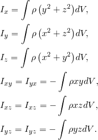

如果您选择局部坐标系，优化模块使用轴的方向来重新计算质心。如果您没有选择局部坐标系，优化模块应用全局坐标系。

当优化模块计算惯性矩时，它通过应用区域的厚度将壳单元和膜区域视为三维区域。优化模块仅使用拓扑优化支持的单元类型计算惯性矩。因此，优化模块计算的惯性矩可能与 Abaqus/Standard 或 Abaqus/Explicit 计算的惯性矩不相同；例如，如果您的模型包含梁或桁架单元（Abaqus/CAE 中的线区域）。

如果您选择任一轴作为对称轴，则关于任何两个正交轴的惯性矩为零。

| **Abaqus/CAE 用法：** | 优化模块：****任务*****一般拓扑或尺寸任务*******设计响应****创建**：**单项目**，**变量：** **惯性矩** |
| --- | --- |

#### 内部力和力矩

您可以使用整个模型或模型区域的节点内部力和力矩作为一般拓扑或尺寸优化中的目标函数或约束。

[表 13.2.1-2](pt04ch13s02aus87.md#usb-anl-aoptdesignresponses-gentop-iforce) 列出了可用的节点内部力和力矩变量。

**表 13.2.1-2** 连接到节点 i 的单元 e 的一般和尺寸拓扑优化的节点内部力和力矩变量。
|  | 节点内部力 | 节点内部力矩 |
| --- | --- | --- |
| i 方向 |  |  |
| 绝对值 | 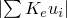 |  |
| i 方向的绝对值 |  |  |

您必须将全局坐标系与绝对内部力或绝对内部力矩一起使用。您的结构必须在优化中使用的力方向上具有刚度；否则，该方向上的内部力将为零。

| **Abaqus/CAE 用法：** | 优化模块：****任务*****一般拓扑或尺寸任务*******设计响应****创建**：**单项目**，**变量：** **内部力**或**内部力矩** |
| --- | --- |

#### 反作用力和力矩

节点反作用力和力矩只能作为一般和尺寸拓扑优化的设计响应。与位移一样，如果仅将反作用力或力矩应用于顶点或小区域，并将这些区域分配为冻结区域（优化模块在优化期间不会移除单元），则优化的性能会得到改善。

[表 13.2.1-3](pt04ch13s02aus87.md#usb-anl-aoptdesignresponses-gentop-rforce) 列出了可用的节点反作用力和力矩变量。

**表 13.2.1-3** 连接到节点 i 的单元 e 的一般和尺寸拓扑优化的节点反作用力和力矩变量。
|  | 节点反作用力 | 节点反作用力矩 |
| --- | --- | --- |
| i 方向 |  |  |
| 绝对值 |  |  |
| i 方向的绝对值 |  |  |

您不能将参考坐标系与绝对反作用力或绝对反作用力矩一起使用。您的结构必须在优化中使用的力方向上具有刚度；否则，该方向上的反作用力将为零。

| **Abaqus/CAE 用法：** | 优化模块：****任务*****一般拓扑和尺寸任务*******设计响应****创建**：**单项目**，**变量：** **反作用力**或**反作用力矩** |
| --- | --- |

#### 应变能

结构的柔度是其整体刚度的度量，定义为所有单元的应变能之和，（对于线性模型），其中  是位移向量， 是全局刚度矩阵。柔度是刚度的倒数，最小化柔度等同于最大化全局刚度。如果载荷情况由热场驱动，当结构变软时应变能会降低。因此，试图最小化应变能可能导致刚性结构。此外，如果为模型施加了规定位移，您应该始终选择最大化应变能。

拓扑优化考虑所有单元的总应变能；因此，如果您选择应变能作为目标函数，则必须将目标应用于整个模型。

| **Abaqus/CAE 用法：** | 优化模块：****任务*****一般拓扑或尺寸任务*******设计响应****创建**：**单项目**，**变量：** **应变能** |
| --- | --- |

#### 缩放质心 von Mises 应力

您可以使用整个模型或所选区域的缩放单元质心 von Mises 应力作为一般拓扑优化中的目标函数或约束。您必须避免因外部载荷或边界条件导致的应力奇异性区域。

缩放单元质心 von Mises 应力定义为

其中  是单元质心 von Mises 应力， 是参考应力，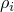 是用于插值因拓扑优化而减少当前相对密度的单元应力的因子。权重因子和插值对于优化期间的收敛是必需的。

von Mises 应力在单元质心处计算，以避免初始模型中可能存在或优化结构平滑之前可能出现的应力奇异性。您不能将缩放单元质心 von Mises 应力与 Abaqus 计算的 von Mises 应力进行比较。两种度量仅在单元为实体且相对密度为 1.0 时相等。

您可以在创建目标函数时提供参考应力，或者优化模块可以在初始优化迭代期间计算参考应力。如果您提供参考应力，则该值不应太低，否则将导致数值奇异性。参考应力给出为

您可以为缩放单元质心 von Mises 应力度量定义多个载荷情况。支持静态线性分析。静态非线性分析仅支持接触非线性。不支持非线性材料和几何非线性，如大变形。

| **Abaqus/CAE 用法：** | 优化模块：****任务*****一般拓扑任务*******设计响应****创建**：**单项目**，**变量：** **应力** |
| --- | --- |

#### 体积

体积定义为设计区域所有单元体积之和，，其中  是单元体积。对于大多数优化问题，您必须施加体积约束。例如，如果您试图最小化应变能（最大化刚度）并且不施加体积约束，优化模块只是用材料填充设计区域。

| **Abaqus/CAE 用法：** | 优化模块：****任务*****一般拓扑或尺寸任务*******设计响应****创建**：**单项目**，**变量：** **体积** |
| --- | --- |

#### 重量

重量定义为设计区域所有单元重量之和，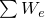，其中  是单元重量。优化模块使用当前相对密度对单元进行缩放。对于大多数优化问题，您必须施加体积或重量约束。使用重量而不是体积允许您将优化模型约束为指定的物理重量。优化模块在计算重量时仅使用支持的单元类型。

| **Abaqus/CAE 用法：** | 优化模块：****任务*****一般拓扑或尺寸任务*******设计响应****创建**：**单项目**，**变量：** **重量** |
| --- | --- |

### 形状优化的设计响应

优化模块为形状优化提供了固有频率、应力、接触应力、应变、节点应变能密度和体积设计响应。只有体积设计响应可用于定义约束；所有其他设计响应用于定义目标函数。

#### 来自 Kreisselmaier-Steinhauser 公式的固有频率

如果您试图最大化第一固有频率，特别是如果您试图最大化多个第一固有频率，则应将特征值的 Kreisselmaier-Steinhauser 公式用作形状优化中的目标函数。如果使用特征值的 Kreisselmaier-Steinhauser 公式，则不需要使用模式跟踪。

| **Abaqus/CAE 用法：** | 优化模块：****任务*****形状任务*******设计响应****创建**：**单项目**，**变量：** **使用 Kreisselmaier-Steinhauser 公式计算的固有频率** |
| --- | --- |

#### 应力和接触应力

等效应力是形状优化最常用的目标函数。优化模块计算的所有应力值（无论是节点、Gauss 点还是单元）都被插值到节点。例如，您可以尝试使用目标函数优化模型，该目标函数试图最小化具有应力集中的区域的最大 von Mises 应力，或最小化具有接触的区域的接触压力。优化模块仅考虑区域内等效应力的最大值。优化模块会为没有适当应力值的节点发出警告。例如，如果您选择接触应力目标响应，优化模块会发出关于未接触单元节点的警告。如果您的 Abaqus 模型包含多个载荷情况，设计响应通过求和每个载荷情况的应力值来评估。

您可以从以下等效应力中选择：
- von Mises
- 最大主应力和绝对最大主应力
- 最小主应力和绝对最小主应力
- 第二主应力
- Beltrami
- Drucker Prager
- Galilei
- Kuhn
- Mariotte
- Sandel
- Sauter
- Tresca

您可以从以下等效接触应力中选择：
- 接触应力压力
- 总剪切接触应力
- 1 方向的剪切接触应力
- 2 方向的剪切接触应力
- 总接触应力

您只能为形状优化创建使用应力或接触应力的设计响应，并且只能用作目标函数。

| **Abaqus/CAE 用法：** | 优化模块：****任务*****形状任务*******设计响应****创建**：**单项目**，**变量：** **应力**或**接触应力** |
| --- | --- |

#### 应变

如果您的模型正在经历大变形，应力度量并不总是模型响应的良好指标。例如，经历塑性变形的结构对于理想塑性材料将在塑性区域上承受大的恒定应力。在这种情况下，应变度量是模型响应的更可靠指标。您可以从以下等效应变中选择：
- 弹性
- 塑性
- 总（弹性和塑性之和）

您只能为形状优化创建使用应变的设计响应，并且只能用作目标函数。

| **Abaqus/CAE 用法：** | 优化模块：****任务*****形状任务*******设计响应****创建**：**单项目**，**变量：** **应变** |
| --- | --- |

#### 节点应变能密度

节点应变能密度，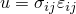，是一种局部点态应变能，可以为非线性材料提供比应力更好的失效表示。

| **Abaqus/CAE 用法：** | 优化模块：****任务*****形状任务*******设计响应****创建**：**单项目**，**变量：** **应变能密度** |
| --- | --- |

#### 体积

体积是形状优化唯一允许的约束。体积定义为设计区域所有单元体积之和，，其中  是单元体积。

对于大多数优化问题，您必须将体积约束应用于模型的区域。例如，如果您试图最小化应变能（最大化刚度）并且不施加体积约束，Abaqus 只是用材料填充设计区域。

| **Abaqus/CAE 用法：** | 优化模块：****任务*****形状任务*******设计响应****创建**：**单项目**，**变量：** **体积** |
| --- | --- |

### 设计响应的操作

您可以定义组合由多个设计响应生成的单个值的设计响应；例如，您可以添加值或找到几个值的最大值。您还可以定义作为对另一个设计响应的操作结果的设计响应；例如，不同节点处设计响应值之间的差异。

例如，您可以创建两个对应于两个所选顶点在 1 方向上位移的设计响应。或者，您可以创建一个表示两个所选顶点在 1 方向上位移之差的设计响应。然后，您可以定义一个约束，迫使设计响应接近零。实际上，约束迫使两个所选顶点在 1 方向上一起移动。

| **Abaqus/CAE 用法：** | 优化模块：****设计响应****创建**：**组合项目** |
| --- | --- |

#### 其他参考文献

- Bakhtiary, N., P. Allinger, M. Friedrich, F. Mulfinger, J. Sauter, O. Mller, and J. Puchinger, "A New Approach for Size, Shape and Topology Optimization," SAE International Congress and Exposition, Detroit, Michigan, USA, February 26--29, 1996.
- Bendse, M. P., E. Lund, N. Ohloff, and O. Sigmund, "Topology Optimization - Broadening the Areas of Application," Control and Cybernetics, vol. 34, pp. 7--35, 2005.
- Bendse, M. P., and O. Sigmund, *Topology Optimization: Theory, Methods and Applications, *Springer-Verlag, Berlin Heidelberg New York, 2003.
- Bendse, M. P., and O. Sigmund, "Material Interpolations in Topology Optimization," Archive of Applied Mechanics, vol. 69, pp. 635--654, 1999.
- Clausen, P. M., and C. B. W. Pedersen, Non-Parametric Large Scale Structural Optimization, ECCM 2006 III European Conference on Computational Mechanics, Lisbon, Portugal, June 5--9, 2006.
- Cook, R. D., D. S. Malkus, and M. E. Plesha, *Concepts and Applications of Finite Element Analysis, *John Wiley & Sons Inc., 1989.
- Hansen, L. V., "Topology Optimization of Free Vibrations of Fiber Laser Packages," Structural and Multidisciplinary Optimization, vol. 29(5), pp. 341--348, 2005.
- Olhoff, N., and J. Du, Topology Optimization of Vibrating Bi-Material Plate Structures with Respect to Sound Radiation, IUTUAM Symposium on Topological Design Optimization of Structures, Machines and Materials: Status and Perspectives, M. P. Bendse, N. Olhoff, and O. Sigmund, eds., pp. 147--156, Springer, 2006.
- Pedersen, C. B. W., and P. Allinger, Industrial Implementation and Applications of Topology Optimization and Future Needs, IUTUAM Symposium on Topological Design Optimization of Structures, Machines and Materials: Status and Perspectives, M. P. Bendse, N. Olhoff, and O. Sigmund, eds., pp. 147--156, Springer, 2006.
- Sigmund, O., and J. S. Jensen, "Systematic Design of Phononic Band Gap Materials and Structures by Topology Optimization," Philosophical Transactions of the Royal Society: Mathematical, Physical and Engineering Sciences, vol. 361, pp. 1001--1019, 2003.
- Stolpe, M., and K. Svanberg, "An Alternative Interpolation Scheme for Minimum Compliance Optimization," Structural and Multidisciplinary Optimization, vol. 22, pp. 116--124, 2001.
- Svanberg, K., "The Method of Moving Asymptotes---A New Method for Structural Optimization," International Journal for Numerical Methods in Engineering, vol. 24, pp. 359--373, 1987.

