# 13.2.2 目标和约束

**产品：** Abaqus/CAE  

##### **参考文献**

- ["结构优化：概述，" 第 13.1.1 节"](pt04ch13s01abo16.md)
- ["创建目标函数，" Abaqus/CAE 用户指南第 18.8 节"](../usi/usi-link.md#usi-opz-objectivefunctionedit)
- ["创建约束，" Abaqus/CAE 用户指南第 18.9 节"](../usi/usi-link.md#usi-opz-constraintedit)
- ["配置几何限制，" Abaqus/CAE 用户指南第 18.10 节"](../usi/usi-link.md#usi-opz-geomrestrictedit)
- ["创建局部停止条件，" Abaqus/CAE 用户指南第 18.11 节"](../usi/usi-link.md#usi-opz-stopconditionedit)

### 概述

对于优化问题：
- 目标函数定义优化的目标；
- 约束对优化施加限制并定义可行设计；
- 几何限制对优化可以生成的拓扑或形状结构施加限制；和
- 停止条件定义何时认为优化任务完成。

### 目标函数

目标函数定义优化的目标。目标函数是从一组设计响应制定的单一标量值。例如，如果设计响应是从区域内节点的应变能定义的，则目标函数可以最小化设计响应之和；即最小化应变能之和，有效地最大化该区域的刚度。

优化问题可以表述为：

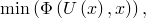

其中  是依赖于状态变量 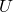 和设计变量  的目标函数。

试图最小化  设计响应的目标函数公式可以表述为：

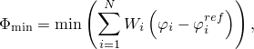

其中每个设计响应  被赋予权重  和参考值 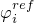。试图最大化  设计响应的目标函数公式可以表述为：

默认权重因子为 1.0。对于拓扑优化，默认参考值为 0.0；对于形状和尺寸优化，默认参考值由优化模块计算。对于大多数常见的优化问题，您不需要更改权重因子和参考值的默认值。但是，在某些情况下，您可能必须更改权重因子以平衡主导优化目标函数的影响。您应该知道更改权重因子可能会对最终设计产生重大影响。此外，在优化开始时占主导地位的设计响应可能在优化模块修改模型时影响减小。

试图最小化最大设计响应的目标函数是一种重要的优化公式。在每个设计周期中，优化模块首先确定加权设计响应的集合中哪个具有最大值，然后试图最小化该设计响应。在许多问题中，最小化最大设计响应提供了满意的解决方案，因为它减少了一些设计响应的最大值。例如，如果您的设计响应是从模型多个区域中的应力定义的，最小化最大设计响应试图最小化表现出最大应力的区域中的应力。公式可以表述为：

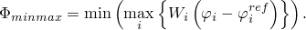

优化模块提供的设计响应列在 ["设计响应，" 第 13.2.1 节"](pt04ch13s02aus87.md) 中。

#### 定义目标函数的目标

目标函数的目标可以最小化或最大化。或者，目标函数的目标可以设置为最小化最大值，使得设计响应针对最大值，目标试图最小化该最大值。在所有情况下，都考虑了设计响应的权重和参考值。

| **Abaqus/CAE 用法：** | 优化模块：****目标函数****创建**：**目标** |
| --- | --- |

### 约束

如上一节所概述的，优化问题可以表述为：

其中  是依赖于状态变量  和设计变量  的目标函数。可以对优化问题施加约束 ，也可以对设计变量施加约束 ：

其中 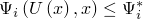 和 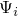 是被值 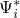 约束的设计响应。此外，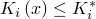，其中  是设计变量布局的表达式，如可制造性，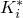 是对设计变量的约束。

优化模块可以得出优化目标函数的解决方案；但是，如果约束不满足，则优化的结果可能不是可行设计。约束基于设计响应，类似于设计响应，是从单一标量值制定的。大多数优化都有约束，防止优化得出平凡解。例如，如果您试图最大化结构的刚度，如果您不施加任何约束，优化模块将简单地填充整个设计区域。但是，如果您施加将重量限制在其初始值 50% 的重量约束，则优化模块被迫寻求同时优化刚度目标并满足重量约束的最优解决方案。您只能将体积约束应用于拓扑优化和形状优化；您不能使用体积作为目标函数。您不能将多个相同类型的约束（如体积）应用于整个模型或单个区域。

| **Abaqus/CAE 用法：** | 优化模块：****约束****创建** |
| --- | --- |

#### 对区域施加约束

您可以对模型的不同区域施加不同的约束。此外，这些区域可以具有不同的材料属性或材料属性可以在区域内变化。当优化模块计算设计响应时，它会考虑区域内变化的材料属性。您不能将多个体积约束应用于整个模型或单个区域。

### 几何限制

几何限制是直接应用于设计变量的约束。几何限制允许您对设计限制和制造限制进行建模。

#### 定义冻结区域

您可以通过冻结区域来指定优化区域内的区域被排除在优化之外。例如，您可以排除形成轴承表面的圆形轴或用于将结构附着到刚性表面的凸台。您必须冻结用于施加规定条件的区域。为简化此操作，您可以请求优化模块在创建优化过程时自动冻结用于施加规定条件和载荷的区域。

| **Abaqus/CAE 用法：** | 优化模块：****几何限制****创建**：**冻结区域** |
| --- | --- |

#### 指定最小和最大构件尺寸

在大多数情况下，您应该通过定义最小构件尺寸来避免结构中生成薄桁架。但是，优化模块不能确保优化后的结构不包含直径小于最小构件尺寸的区域。最小构件尺寸必须大于平均单元边缘长度。最大构件尺寸必须大于单元长度的两倍；否则，优化算法可能会遇到单元连接问题。如果您为粗网格和细网格指定相同的最小构件尺寸，则会导致拓扑等效结果的优化。优化模块不会在与结构施加规定条件的位置生成薄区域。从这些区域移除材料可能导致结构坍塌。

如果您的结构将被铸造，您可能希望通过指定具有最大构件尺寸的区域来避免生成过厚的零件。优化过程将通过生成几个较薄的区域来避免创建厚区域。您不需要同时指定最大和最小构件尺寸。优化模块假定您输入的最大构件尺寸值也适用于最小构件尺寸，并将生成指定尺寸的桁架。最大构件尺寸约束与施加拉动方向的约束（如可成型或可冲压制造约束）的组合仅允许用于一般拓扑优化。（"拉动方向"是模具两半分离的方向或冲压工具移动的方向。）

当您指定具有最小或最大构件尺寸的区域时，计算时间显著增加。因此，您应该仅将构件尺寸限制应用于必须避免薄或厚构件的区域。您应该运行没有构件尺寸限制的优化以识别此类区域。

| **Abaqus/CAE 用法：** | 优化模块：****几何限制****创建**：**构件尺寸** |
| --- | --- |

#### 应用制造限制

拓扑优化过程始终创建满足目标函数和约束的结构布局；但是，该设计可能无法使用标准制造技术（如铸造和锻造）创建。您可以施加几何限制，迫使拓扑优化过程仅考虑可以制造的设计。例如，当您使用拓扑优化时，您可以强制优化模块创建可从模具中提取的可铸形状或可用工具和模具创建的可冲压形状。

##### 保持可模具化结构

在施加弯曲和扭转载荷的情况下，拓扑优化可能生成具有无法制造的空腔或倒扣的模型。您可以通过指定以下内容来防止拓扑优化生成空腔和倒扣：
- 可从锻造模具中移除的可锻造结构，如 [图 13.2.2-1](pt04ch13s02aus88.md#aoptimization-geomrest-forge-nls) 所示。**图 13.2.2-1** 可锻造零件。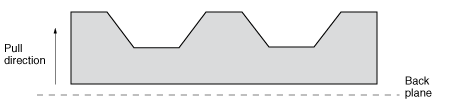
- 可从模具两半移除的可模具化结构，如 [图 13.2.2-2](pt04ch13s02aus88.md#aoptimization-geomrest-demold-nls) 所示。**图 13.2.2-2** 可模具化零件。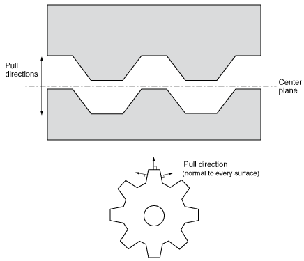 相比之下，[图 13.2.2-3](pt04ch13s02aus88.md#aoptimization-geomrest-nodemold-nls) 说明了具有空腔和倒扣的不可模具化的零件。**图 13.2.2-3** 空腔和倒扣防止零件可模具化。

| **Abaqus/CAE 用法：** | 优化模块：****几何限制****创建**：**脱模控制**；**脱模技术**，**带中心平面的脱模** |
| --- | --- |
|  | 优化模块：****几何限制****创建**：**脱模控制**；**脱模技术**，**区域表面脱模**优化模块：****几何限制****创建**：**脱模控制**；**脱模技术**，**锻造** |

##### 保持可冲压结构

您可以指定结构将通过冲压工艺制造。如果优化过程从结构中移除一个单元，它也会移除位于该单元后面或前面的所有单元（相对于拉动方向），如 [图 13.2.2-4](pt04ch13s02aus88.md#aoptimization-geomrest-stamp-nls) 所示。

**图 13.2.2-4** 可冲压结构。

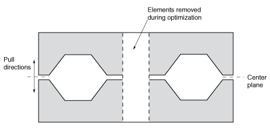

如果在基于条件的拓扑优化中激活了冲压限制，优化模块修改单元属性的速率不应设置得太高；否则，优化生成的支撑或桁架可能会与结构的其余部分分离。

| **Abaqus/CAE 用法：** | 使用以下选项在拓扑优化中创建冲压几何限制： |
| --- | --- |
|  | 优化模块：****几何限制****创建**：**脱模控制**；**脱模技术**，**冲压** 使用以下选项在形状优化中创建冲压几何限制：优化模块：****几何限制****创建**：**冲压控制** 使用以下选项指定优化模块修改单元属性的速率：优化模块：****任务****创建**：**高级**，**体积修改的增量大小** |

#### 指定壳厚度边界

在为尺寸优化配置时，您可以指定壳单元厚度的上限和下限。该值可以是绝对厚度或初始厚度的分数。

| **Abaqus/CAE 用法：** | 优化模块：****几何限制****创建**：**厚度控制** |
| --- | --- |

#### 指定对称结构

将对称约束引入模型可以显著提高优化模块计算优化结构的速度。您可以使用优化模块施加以下对称约束：
- 关于轴或平面的对称（反射对称）
- 关于点的对称
- 旋转对称
- 循环对称（以给定距离复制区域）

您可以将对称限制应用于拓扑优化中的非结构化网格或四面体网格。单元应该大致相同大小，因为结果对称性基于网格最粗部分的分辨率。此外，如果单元大小差异太大，优化模块可能无法创建对称条件。

要为形状优化定义对称，优化模块将大致对称的节点组装成对称组（通常每个对称组中有两个对称节点）。然后优化模块确定对称组的主节点，并以使客户端节点相对于主节点平面以对称方式移动的方式计算设计位移。

如果您正在执行拓扑优化，则网格化的 Abaqus 模型在优化开始前不必是对称的。相反，如果您正在执行形状优化，则网格化的 Abaqus 模型在优化开始前应该是对称的，以允许优化模块识别对称节点并在表面节点移动时保持其对称性。

| **Abaqus/CAE 用法：** | 优化模块：****几何限制****创建**：**平面对称**、**点对称**、**旋转对称**或**循环对称** |
| --- | --- |

#### 指定最小宽度

尺寸优化确定在用壳单元建模钣金结构时的最佳单元厚度。指定包含相同厚度单元区域的最小宽度可防止在尺寸优化后解决方案中出现具有相同厚度的窄条单元。指定最小宽度还可防止壳厚度振荡或单元厚度的"棋盘"图案。

如果为粗网格和细网格指定相同的最小宽度，则会导致相同的优化解决方案；因此，优化解决方案与网格分辨率无关。但是，在所有情况下，最小宽度必须大于单元边缘的平均长度。

| **Abaqus/CAE 用法：** | 优化模块：****几何限制****创建**：**厚度控制** |
| --- | --- |

#### 指定聚类

您可以指定所选区域在尺寸优化后包含相同厚度的壳单元簇。您可以使用聚类在正在优化的钣金结构中生成加强肋或环，或定义相同厚度区域之间的边界。聚类区域可以使用恒定厚度的钣金在制造中再现；例如，通过焊接和冲压单个钣金结构形成的汽车"白车身"。为允许最大的设计灵活性，您应该首先在没有指定聚类的的情况下优化结构，并使用初始设计来决定在最终优化中聚类哪些区域。

| **Abaqus/CAE 用法：** | 优化模块：****几何限制****创建**：**聚类区域** |
| --- | --- |

#### 在形状优化期间应用附加限制

形状优化确定每个表面节点的位移，以努力均匀化表面上的应力并满足目标函数和任何约束。优化模块不耦合相邻节点的位移；每个设计节点都可以独立于其他设计节点移动。例如，在优化期间，平面表面可以发展成非平面的自由形式表面。通过耦合设计节点，您可以强制优化保持平面的规律性。

耦合条件限制了系统的解决方案范围并降低了优化潜力。此外，定义适当的耦合条件可能非常耗时。为简化优化，您应该从尽可能少限制的优化开始，仅使用少量耦合条件，并且仅在需要时才引入附加耦合条件。

当优化模块在形状优化期间移动表面节点时，您可以施加附加限制：
- 优化后的形状可以通过沿指定方向切入模型的工具在车床上制造。
- 优化后的形状可以通过沿指定方向钻入模型的工具制造。工具创建的孔关于工具轴是对称的。此外，工具可以从孔中退出。
- 优化形状中所选面可以相互滑动和/或不能相互穿透。
- 节点被限制为移动：- 沿指定向量，- 向内或向外指定距离（收缩或生长），- 沿指定方向，- 仅沿选定的自由度，和- 仅沿施加载荷的方向。

| **Abaqus/CAE 用法：** | 优化模块：****几何限制****创建**：**车削控制**、**钻孔控制**、**穿透检查**、**滑动区域控制**或**向量** |
| --- | --- |

### 组合几何约束

您施加的每个几何约束都降低了 Abaqus 得出优化解决方案的可能性。此外，如果您施加太多几何限制，Abaqus 生成的解决方案可能不是可用的最优解决方案。因此，您应该首先允许 Abaqus 执行没有施加几何限制或仅有有限数量几何限制的优化。在研究了无限制或限制较少的优化结果后，您应该仅应用解决问题所需的限制。

您可以组合几何约束；但是，仅某些组合是允许的。Abaqus 按以下顺序处理几何约束：
- 最小构件尺寸
- 对称约束
- 制造约束
- 最大构件尺寸

施加一个约束可能会削弱另一个约束的效果。例如，您不能定义关于与不平行于对称轴或对称面的拉动方向的平面对称。

以下制造限制组合是允许的：
- 如果拉动方向垂直或平行于对称面，则可以将关于平面的对称与拉动方向组合。
- 如果拉动方向平行于旋转轴，则可以将旋转对称与拉动方向组合。
- 如果平面相互垂直，则可以将关于平面的两个对称组合。
- 当您首次运行基于条件的拓扑优化时，不应使用最大构件尺寸和拉动方向的组合，因为优化可能不会收敛，具体取决于有限元网格。当您确信优化会收敛时，您可以引入这种几何约束组合。
- 您可以指定大于最大构件尺寸的最小构件尺寸。Abaqus 首先处理最小构件尺寸要求并创建相对较厚的支撑。然后当 Abaqus 处理最大尺寸要求时，较厚的支撑被分成较小的平行构件。

### 停止条件

在每个设计周期后检查停止条件，并确定优化是否应该结束，因为已达到最大设计周期数或因为优化已收敛于最优解决方案。优化模块提供全局和局部停止条件；但是，局部停止条件很少需要。

#### 全局停止条件

全局收敛停止条件定义应执行的最大设计周期数。要限制设计周期数，您必须为每个优化任务定义全局停止条件。最大设计周期数的默认值取决于优化类型，如 [表 13.2.2-1](pt04ch13s02aus88.md#usb-anl-aoptobjectives-maxcycles) 所示。

**表 13.2.2-1** 默认最大设计周期数。
| 优化类型 | 默认最大设计周期数 |
| --- | --- |
| 基于条件的拓扑优化 | 15 |
| 一般拓扑优化 | 50 |
| 形状优化 | 10 |
| 尺寸优化 | 50 |

| **Abaqus/CAE 用法：** | 作业模块：****优化****创建**：**最大周期数** |
| --- | --- |

#### 局部停止条件

局部停止条件指示一般拓扑优化是否已收敛于最优解决方案。局部停止条件适用于模型区域内位移或应力，并定义何时达到优化目标。局部停止条件将位移或等效应力的单一标量值与参考值进行比较。单一标量值可以是区域上的最大值或最小值，或所有值的和。参考值可以取自上次迭代后或第一次迭代后的单一标量值。此外，您可以通过固定量或百分比修改参考值。例如，您可以指定局部停止条件，如果区域内的位移和小于第一次优化周期后位移和的 1%，则结束优化。您可以定义一个或两个局部停止条件，并且您可以指定优化模块结束优化时是必须满足其中一个还是两个（默认）局部停止条件。

局部停止条件的示例包括：
- 如果您指定应最小化（或最大化）位移或应力，如果位移或应力在优化周期后增加（或减少），则局部停止条件可以结束优化。
- 当优化接近最优解决方案时，您可以预期位移或应力的值仅发生微小变化。如果位移或应力在优化周期后相对变化低于容差限值，则局部停止条件可以结束优化。
- 当优化接近最优解决方案时，您可以预期位移和仅发生微小变化，因此，对模型的修改很小。如果位移和的变化在优化周期后低于容差限值，则局部停止条件可以结束优化。您可以将位移和用作有约束和无约束优化的停止条件。此外，此停止条件适用于各种目标函数，如应力或频率。

| **Abaqus/CAE 用法：** | 优化模块：****停止条件****创建** |
| --- | --- |

