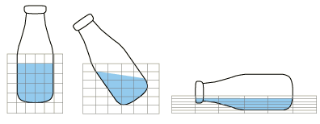

# 14.1.3 欧拉网格运动


**产品：** Abaqus/Explicit  Abaqus/CAE  

##### **参考文献**

- ["欧拉表面定义，" 第 2.3.5 节"](pt01ch02s03aus20.md)
- ["欧拉分析，" 第 14.1.1 节"](pt04ch14s01aus90.md)
- [*EULERIAN MESH MOTION](../key/key-link.md#usb-kws-heulmeshmotion)
- [*EULERIAN SECTION](../key/key-link.md#usb-kws-meulsection)
- [*SURFACE](../key/key-link.md#usb-kws-msurface)
- ["定义欧拉网格运动边界条件，" Abaqus/CAE 用户指南第 16.10.22 节"](../usi/usi-link.md#usi-lbi-bceditors-meshmotion)

### 概述

在传统欧拉分析中，材料流过固定在空间中的欧拉网格。由于它是静止的，欧拉网格必须足够大以包围整个感兴趣的轨迹。在某些模拟中，如翻滚的盛液瓶子，此轨迹可能很长，需要一个其单元大部分为空的大型欧拉网格。欧拉网格运动功能允许欧拉网格在空间中移动，跟随、扩展和收缩以包围目标对象。这可以大大减少网格大小，从而降低模拟成本。网格运动还可以通过确保整个感兴趣的轨迹（可能是不可预测的）确实被欧拉网格覆盖来简化建模。

### 激活网格运动

您可以独立地为模型中的每个欧拉截面激活网格运动。运动适用于截面中的所有单元。

| **输入文件用法：** | ``` [*EULERIAN MESH MOTION](../key/key-link.md#usb-kws-heulmeshmotion), ELSET=*name* ``` |
| --- | --- |

| **Abaqus/CAE 用法：** | 载荷模块：****边界条件****创建****，**类别：** **其他**，**所选步骤的类型：** **欧拉网格运动**：选择欧拉部件实例 |
| --- | --- |

### 计算网格运动

欧拉网格的运动使用包围整个欧拉截面的内部构造边界框计算。边界框有六个自由度：框中心的平移和三个框尺寸的缩放。

边界框在局部坐标系中构造。它的六个自由度也在此局部系统中定义。局部坐标方向在模拟期间在空间中保持固定。如果未指定局部坐标系，则局部系统与全局系统重合。

| **输入文件用法：** | ``` [*EULERIAN MESH MOTION](../key/key-link.md#usb-kws-heulmeshmotion), ORIENTATION=* name* ``` |
| --- | --- |

| **Abaqus/CAE 用法：** | 载荷模块：欧拉网格运动编辑器：**边界框 Csys**：**编辑**或**创建** |
| --- | --- |

### 定义目标对象

您使用表面来定义欧拉网格将跟随的目标对象。默认情况下，欧拉网格边界框（因此欧拉网格）移动以始终包围表面，受网格运动上指定的任何约束限制。如果表面类型是拉格朗日的，欧拉网格边界框移动以包围表面节点（见 [图 14.1.3-1](pt04ch14s01aus92.md#usb-mesh-motion-lag)）。如果表面类型是欧拉的，欧拉网格边界框移动以包围表面定义中命名的欧拉材料（见 [图 14.1.3-2](pt04ch14s01aus92.md#usb-mesh-motion-eul)）。

**图 14.1.3-1** 网格运动，其中目标对象是拉格朗日瓶子。


**图 14.1.3-2** 网格运动，其中目标对象是欧拉液体。



由于以下原因，欧拉网格可能无法完全包围目标对象：
- 边界框运动的约束；
- 边界框局部方向的对齐不当；
- 网格边界和边界框形状之间的不匹配（即欧拉网格不是矩形盒子）；或
- 初始欧拉网格的尺寸或位置不当。

| **输入文件用法：** | ``` [*EULERIAN MESH MOTION](../key/key-link.md#usb-kws-heulmeshmotion), SURFACE=*name* ``` |
| --- | --- |

| **Abaqus/CAE 用法：** | 载荷模块：欧拉网格运动编辑器：**要跟随的对象**：*name* |
| --- | --- |

### 约束欧拉网格运动

一旦计算了边界框的运动，平移和缩放因子就直接应用于欧拉网格。提供了多种类型的约束来限制这些运动。竞争约束之间的冲突按以下优先级顺序解决：

1. 约束网格边界框的中心和面，
2. 限制网格运动速率，
3. 关闭网格收缩，
4. 将网格边界框居中于目标对象的质心或边界框中心，
5. 防止网格扩展或收缩超出缩放因子限制，
6. 限制长宽比变化，和
7. 在网格和目标之间保持缓冲。

#### 约束网格扩展和收缩

默认情况下，欧拉网格可以在每个方向上根据需要扩展或收缩任意量以包含目标对象。这可能是不期望的：扩展创建近似欧拉对象形状的大型欧拉单元，而收缩导致稳定时间增量大小减小。

您可以通过指定边界框尺寸缩放因子的下限和/或上限来独立约束每个局部方向上的扩展和收缩。例如，最大缩放因子为 1.0 将约束框尺寸不大于初始框尺寸的 1.0 倍，有效禁止任何扩展，而最小缩放因子为 0.5 将约束框尺寸不小于其初始尺寸的一半。

| **输入文件用法：** | ``` [*EULERIAN MESH MOTION](../key/key-link.md#usb-kws-heulmeshmotion) *scaling factor limits* ``` |
| --- | --- |

| **Abaqus/CAE 用法：** | 载荷模块：欧拉网格运动编辑器：**轴 *n***：**扩展比**，**收缩比** |
| --- | --- |

#### 防止网格收缩

提供了额外的控制以防止增量收缩。如果指定，框尺寸可以增加，但在模拟期间任何时候都不能减小到其当前值以下。此选项防止在网格名义上扩展的模拟期间网格尺寸的振荡。

| **输入文件用法：** | ``` [*EULERIAN MESH MOTION](../key/key-link.md#usb-kws-heulmeshmotion), CONTRACT=NO ``` |
| --- | --- |

| **Abaqus/CAE 用法：** | 载荷模块：欧拉网格运动编辑器：**控制**：切换关闭**允许网格收缩** |
| --- | --- |

#### 约束网格平移

您可以指定边界框中心的运动在每个局部方向上是自由的（默认）或固定的。您还可以独立指定正负盒面在局部坐标方向上的自由（默认）或固定法向运动。

| **输入文件用法：** | ``` [*EULERIAN MESH MOTION](../key/key-link.md#usb-kws-heulmeshmotion) , *face constraints* *center constraints* ``` |
| --- | --- |

| **Abaqus/CAE 用法：** | 载荷模块：欧拉网格运动编辑器：**轴 *n***：**中心位置**，**正面位置**，**负面位置** |
| --- | --- |

#### 使网格边界框居中

如果网格边界框的运动不受约束，则边界框的中心与包围目标表面的框中心对齐。如果目标表面碎片化或"发射"低密度材料，则将边界框中心与目标质心对齐可能是有利的。

| **输入文件用法：** | 使用以下选项将网格边界框置于目标对象质心上： |
| --- | --- |
|  | ``` [*EULERIAN MESH MOTION](../key/key-link.md#usb-kws-heulmeshmotion), CENTER=MASS ``` 使用以下选项将网格边界框置于目标对象边界框的中心：``` [*EULERIAN MESH MOTION](../key/key-link.md#usb-kws-heulmeshmotion), CENTER=BOUNDING BOX ``` |

| **Abaqus/CAE 用法：** | 网格边界框的中心不能在 Abaqus/CAE 中更改；网格边界框的中心对应于目标对象边界框的中心。 |
| --- | --- |

#### 控制目标对象周围的网格缓冲

网格移动以在目标对象和边界框之间保持欧拉单元缓冲。默认情况下，此缓冲等于网格中最大欧拉单元尺寸的两倍。您可以将缓冲大小指定为最大欧拉单元尺寸的倍数。您还可以指定使用目标对象和网格之间的初始间距（在与网格初始延伸到的位置对应的位置设置为零）来计算缓冲大小。

| **输入文件用法：** | 使用以下选项使用等于目标对象和网格之间初始间距的缓冲： |
| --- | --- |
|  | ``` [*EULERIAN MESH MOTION](../key/key-link.md#usb-kws-heulmeshmotion), BUFFER=INITIAL ``` 使用以下选项将缓冲指定为最大欧拉单元尺寸的倍数：``` [*EULERIAN MESH MOTION](../key/key-link.md#usb-kws-heulmeshmotion), BUFFER=* value* ``` |

| **Abaqus/CAE 用法：** | 载荷模块：欧拉网格运动编辑器：**控制**：**缓冲大小：** **初始**或**指定** |
| --- | --- |

#### 限制长宽比变化

单个方向上的过度网格运动可能产生形状不佳的欧拉单元。提供了可选参数来限制边界框最大长宽比的变化。默认情况下，此限制为 10。当达到长宽比限制时，一个局部方向的运动将引起其他方向的运动以保持框的长宽比。此长宽比限制适用于边界框尺寸，而不是底层欧拉单元尺寸。

| **输入文件用法：** | ``` [*EULERIAN MESH MOTION](../key/key-link.md#usb-kws-heulmeshmotion), ASPECT RATIO MAX=* value* ``` |
| --- | --- |

| **Abaqus/CAE 用法：** | 载荷模块：欧拉网格运动编辑器：**控制**：**长宽比限制：** *value* |
| --- | --- |

#### 限制网格运动速率

欧拉网格不能允许突然移动。其运动的硬限制由对流 Courant 条件给出，这禁止大于材料波速的网格速度。此外，您可以将网格速度限制为目标对象最大速度的倍数。默认情况下，此限制设置为 1.01。

| **输入文件用法：** | ``` [*EULERIAN MESH MOTION](../key/key-link.md#usb-kws-heulmeshmotion), VMAX FACTOR=* value* ``` |
| --- | --- |

| **Abaqus/CAE 用法：** | 载荷模块：欧拉网格运动编辑器：**控制**：**网格速度因子：** *value* |
| --- | --- |

### 忽略欧拉材料碎片

当目标对象是欧拉材料时，微小碎片可能驱动过度的网格运动。您可以指定最小欧拉体积分数，低于该分数的欧拉材料在网格运动计算中被忽略。这对于冲击计算特别有用，在冲击计算中，允许冲击飞溅的微小碎片离开欧拉域。默认最小体积分数为 0.5。

| **输入文件用法：** | ``` [*EULERIAN MESH MOTION](../key/key-link.md#usb-kws-heulmeshmotion), VOLFRAC MIN=* value* ``` |
| --- | --- |

| **Abaqus/CAE 用法：** | 载荷模块：欧拉网格运动编辑器：**控制**：**体积分数阈值：** *value* |
| --- | --- |

### 限制

欧拉网格只能根据可用的欧拉网格运动选项移动。您不能将规定位移边界条件应用于欧拉节点。


