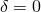
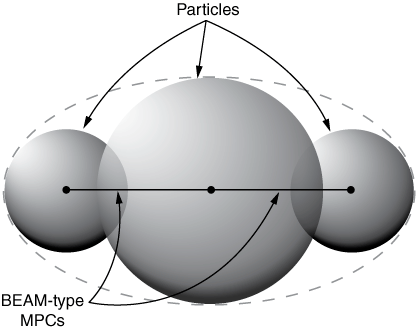
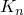
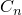

# 15.1.1 离散单元法


**产品：** Abaqus/Explicit  Abaqus/Viewer  

##### **参考文献**

- ["离散粒子单元，" 第 33.1.1 节](pt06ch33s01alm61.md)
- [*DISCRETE SECTION](../key/key-link.md#usb-kws-mdiscretesection)
- [*CONTACT](../key/key-link.md#usb-kws-hcontact)
- [*INITIAL CONDITIONS](../key/key-link.md#usb-kws-minitialcond)

### 概述

离散单元法（DEM）：
- 旨在模拟大量离散粒子相互接触的事件；
- 使用具有刚性球形形状的单节点元素对每个粒子进行建模，这可能代表单个颗粒、片剂、喷丸或其他简单物体；
- 是制药、化工、食品、陶瓷、冶金、采矿和其他行业中颗粒材料行为建模的多功能工具；以及
- 不用于建模连续体的变形，但 DEM 可以与有限元结合使用来建模与变形连续体或其他刚体相互作用的离散粒子。

### 引言

离散单元法（DEM）是一种直观的方法，在显式动态模拟中离散粒子相互碰撞并与其他表面碰撞。通常，每个 DEM 粒子代表一个单独的颗粒、片剂、喷丸等。DEM 不适用于单个粒子承受复杂变形的情况。因此，DEM 不同于且概念上比平滑粒子流体动力学（SPH）方法简单，在 SPH 方法中，粒子组共同建模连续体（请参阅 ["平滑粒子流体动力学，" 第 15.2.1 节](pt04ch15s02aus95.md)）。

例如，DEM 非常适合粒子混合应用，如图 [图 15.1.1--1](pt04ch15s01aus94.md#dem-augermixer) 所示。在此应用中，DEM 用于对最初分离的蓝色和白色粒子进行建模，刚性有限元用于对两个混合螺旋和盒形容器进行建模。[图 15.1.1--1](pt04ch15s01aus94.md#dem-augermixer) 中变形的序列图显示了螺旋转动时粒子的响应。此类模拟的 DEM 结果通常最适合通过动画查看。使用 DEM 进行混合应用的另一个示例在 ["鼓式混合器中颗粒媒体的混合，" Abaqus 例题手册第 13.1.1 节](../exa/exa-link.md#exa-dem-rollmillmixing) 中描述。

**图 15.1.1–1** DEM 粒子混合示例。


每个 DEM 粒子使用 PD3D 类型的单节点元素进行建模。这些元素是具有指定半径的刚性球体。PD3D 元素的节点具有位移和旋转自由度。当考虑摩擦时，DEM 粒子的旋转会显著影响接触相互作用。

通用接触定义易于扩展以包括 DEM 粒子之间的相互作用以及 DEM 粒子与基于有限元（或解析）表面之间的相互作用。粒子之间的大相对运动是 DEM 应用的典型特征。粒子间的相互作用可以涉及相同或不同的粒子。每个粒子可以同时参与许多接触相互作用。DEM 粒子相互作用使用有限接触刚度，这为粒子系统引入了一些柔度。例如，可以指定接触刚度以反映具有 DEM 的堆积颗粒材料模型的宏观刚度。

例如，考虑 [图 15.1.1--2](pt04ch15s01aus94.md#spheres-overlap) 中所示的两个球形粒子之间的相互作用。

**图 15.1.1–2** 球形粒子之间的相互作用。


这三种情况显示两个未变形球体刚刚接触，两个变形球体被推向彼此并严格执行接触，以及两个刚性球体被推向彼此并有一定穿透。球体中心之间的距离在 [图 15.1.1--2](pt04ch15s01aus94.md#spheres-overlap) 中间和右侧的情况中是相同的。物理行为对应于中间情况。右侧情况对应于 DEM 近似。如果变量  定义为


其中  和  是两个球体的半径，*d* 是球体中心之间的距离，当未变形球体刚刚接触时 ，如果球体中心之间的距离小于组合半径，则 。对于 DEM 近似， 对应于粒子之间的最大穿透距离。您可以通过调整 DEM 粒子的接触刚度关系（接触力 *F* 与穿透 ）来提高某些 DEM 应用的准确性，以反映 Hertz 接触解决方案（[图 15.1.1--2](pt04ch15s01aus94.md#spheres-overlap) 中的中间情况）。有关调整接触刚度的进一步讨论，请参阅 ["鼓式混合器中颗粒媒体的混合，" Abaqus 例题手册第 13.1.1 节](../exa/exa-link.md#exa-dem-rollmillmixing)。

### 应用

DEM 是制药、化工、食品、陶瓷、冶金、采矿和其他行业中颗粒材料行为建模的多功能工具。DEM 应用包括以下类别：

**粒子填充**：涉及倾倒或重力下沉积（如沙堆）、沉积后振动和压实等过程。

**粒子流动**：可能仅在重力下发生（如料斗的情况），或在外力和重力下发生（如混合器和研磨机）。

**粒子-流体相互作用**：发生在颗粒材料在流体流动中的传输、波动运动期间以及流化期间（其中流体向上流过颗粒床）。DEM 可以为许多难以用其他计算方法或物理实验研究的情况提供见解。

### 创建和初始化 DEM 模型的策略

颗粒介质通常由随机分布的不同大小的颗粒组成。生成 DEM 分析的初始网格可能具有挑战性。DEM 的常见策略是指定粒子的近似初始位置，它们之间有一些间隙，并允许粒子在第一步中在重力载荷下沉降到位。例如，此策略用于如图 [图 15.1.1--1](pt04ch15s01aus94.md#dem-augermixer) 所示的混合分析：在第一步中螺旋保持静止以允许粒子沉降，转动螺旋在第二步中研究混合行为（这是所示图的重点）。

### 减少解噪声的策略

可以通过施加少量质量比例阻尼来减少由大量开启和关闭接触条件产生的解噪声。有关更多信息，请参阅 ["离散粒子单元，" 第 33.1.1 节](pt06ch33s01alm61.md#usb-elm-ediscreteparticleelem-damping) 中的"Alpha 阻尼"。

### 时间增量考虑

DEM 使用显式动力学过程类型。在大多数情况下，Abaqus/Explicit 自动控制时间增量大小，如 ["显式动态分析，" 第 6.3.3 节](pt03ch06s03at08.md#usb-anl-aexpdynamic-automatic) 中的"自动时间增量"所述，基于模型的刚度和质量特性。最大稳定时间增量大小、质量和刚度特性之间的关系是复杂的。稳定时间增量大小往往与质量的平方根成正比，与刚度的平方根成反比。但是，无法为每个 PD3D 元素计算稳定时间增量，因为粒子是刚性的，因此对于纯 DEM 分析，您必须指定固定时间增量大小（请参阅 ["显式动态分析，" 第 6.3.3 节](pt03ch06s03at08.md#usb-anl-aexpdynamic-fixed) 中的"固定时间增量"）。您可以对具有常规变形有限元的 PD3D 元素的模型使用自动时间增量。

DEM 粒子之间的接触相互作用会影响适当的时间增量大小。没有紧密堆积粒子的 DEM 分析可能只需要足够大的接触刚度以避免显著穿透，而不是高度代表粒子物理刚度特性的接触刚度（每个粒子在 DEM 中被建模为刚性的）。如果您不指定接触刚度，Abaqus/Explicit 会根据时间增量大小和粒子的质量/转动惯性特性分配默认（惩罚）接触刚度。在这种情况下，您应确保时间增量大小足够小以产生足够大的惩罚刚度。

在许多情况下，仔细设置接触刚度很重要；例如，允许 DEM 结果匹配变形球体之间的 Hertz 接触行为。如果您指定了 DEM 接触刚度，则必须确保用于分析的时间增量足够小以避免数值不稳定。对于每个粒子同时接触许多粒子的密集三维颗粒堆积，数值稳定性考虑很复杂。一般准则是不应超过时间增量，其中 *m* 和 *k* 分别代表粒子质量和接触刚度。在某些应用中，甚至更小的时间增量（如 ）可能导致改进的解决方案。

如果粒子速度变得非常大，增量运动的大小会影响适当的时间增量大小。准确解析粒子运动有时需要指定比最大数值稳定性时间增量更小的时间增量。

### 初始条件

与机械分析相关的初始条件可用于离散单元法分析。显式动态分析可用的所有初始条件在 ["Abaqus/Standard 和 Abaqus/Explicit 中的初始条件，" 第 34.2.1 节](pt07ch34s02aus116.md) 中描述。

### 边界条件

边界条件按 ["Abaqus/Standard 和 Abaqus/Explicit 中的边界条件，" 第 34.3.1 节](pt07ch34s03aus118.md) 中所述定义。在 DEM 中很少对单个粒子施加边界条件。

### 载荷

显式动态分析可用的载荷类型在 ["施加载荷：概述，" 第 34.4.1 节](pt07ch34s04aus120.md) 中说明。对于 DEM 中的沉降和颗粒流动分析，重力载荷非常重要。很少对粒子施加集中载荷。

### 元素

离散单元法使用 PD3D 元素对单个粒子进行建模。这些 1 节点元素定义了颗粒介质的单个颗粒，是球形的，并被建模为刚性的（任何柔度都内置于接触模型中）。这些粒子元素使用现有的 Abaqus 功能来引用元素相关特征，如初始条件、分布式载荷和可视化。您可以像定义点质量或转动惯性一样定义这些元素。粒子的节点坐标对应于物理颗粒材料的中心位置。PD3D 元素被分配给离散截面定义，其中指定了粒子特性。有关更多信息，请参阅 ["离散粒子单元，" 第 33.1.1 节](pt06ch33s01alm61.md)。

| **输入文件用法：** | 使用以下选项定义离散单元介质： |
| --- | --- |
|  | ``` [*ELEMENT](../key/key-link.md#usb-kws-melement), TYPE=PD3D, ELSET=*particle_body* *element number*, *node number* ``` ``` [*DISCRETE SECTION](../key/key-link.md#usb-kws-mdiscretesection), ELSET=*element_set_name* ``` |

### 约束

由于 PD3D 元素是拉格朗日元素，它们的节点可以参与其他特征，如连接器或约束。尽管 PD3D 元素具有球形形状，但可以通过将粒子聚集在一起来建模复杂形状的颗粒，如图 [图 15.1.1--3](pt04ch15s01aus94.md#dem-rigid-cluster) 所示。簇是通过刚性或柔性连接保持在一起的一组粒子。

**图 15.1.1–3** 粒子刚性簇。



簇中的粒子可能相互重叠。除非为簇中的粒子指定了接触排除，否则推动分离重叠簇粒子的接触力将存在（请参阅 ["在 Abaqus/Explicit 中定义通用接触相互作用，" 第 36.4.1 节](pt09ch36s04aus155.md#usb-cni-acontactgeneral-specify-exclusions) 中的"指定接触排除"）。这些接触力对刚性连接在一起的粒子没有影响，但对具有柔性连接的簇是有问题的。

粒子簇方法可能无法复制实际颗粒的精确几何形状。例如，如图 [图 15.1.1--3](pt04ch15s01aus94.md#dem-rigid-cluster) 所示的簇可能近似于椭球形（如图中的虚线所示）。可以向簇中添加各种大小的更球形粒子，以获得对真实形状的更接近近似。

在粒子组之间定义 BEAM 型多点约束以创建刚性簇，或在粒子节点之间定义连接器元素以创建刚性或"变形"簇。可以为连接器元素定义适当的本构行为，以捕获簇内粒子连接的柔性行为。不涉及多点约束或连接器的重叠粒子簇可能表现出非物理行为。有关更多信息，请参阅 ["通用多点约束，" 第 35.2.2 节](pt08ch35s02aus130.md)，和 ["连接器：概述，" 第 31.1.1 节](pt06ch31s01abo28.md)。

### 相互作用

如上所述，接触是 DEM 分析的基本成分。通用接触用于定义涉及 DEM 粒子的接触。DEM 粒子可以同时参与多个接触相互作用，包括：
- 具有相同离散截面定义的另一个粒子；
- 具有不同离散截面定义的另一个粒子；
- 基于有限元的表面；和
- 解析刚性表面。

DEM 粒子之间的接触建模要求将粒子明确包含在通用接触中作为基于元素的表面（使用接触包含）（请参阅 ["基于元素的表面定义，" 第 2.3.2 节](pt01ch02s03aus17.md)）。请参阅 ["在 Abaqus/Explicit 中定义通用接触相互作用，" 第 36.4.1 节](pt09ch36s04aus155.md)，获取通用接触的讨论。默认情况下，粒子不是通用接触域的一部分，类似于其他 1 节点元素（如点质量）。

DEM 的接触刚度通常用于考虑粒子的物理刚度特性，因为 DEM 将每个粒子建模为刚性的；因此，DEM 相互作用的非默认接触属性分配很常见。

#### 法向和切向接触力

[图 15.1.1--4](pt04ch15s01aus94.md#dem-particle-interaction) 是两个粒子之间接触刚度和阻尼的示意图。弹簧刚度  在接触法线方向上起作用，可以表示简单的线性或非线性接触刚度。阻尼器  表示法向方向的接触阻尼。切向弹簧刚度  以及摩擦系数  表示粒子之间的摩擦。阻尼器  表示切向方向的接触阻尼。

**图 15.1.1–4** 两个离散元素之间的法向和切向接触相互作用。


[图 15.1.1--4](pt04ch15s01aus94.md#dem-particle-interaction) 显示作用于粒子表面的切向接触力在粒子中心引起力矩。涉及 DEM 粒子的相互作用 account for 界面上的动量传递。

### 输出

PD3D 元素没有元素输出。节点输出包括 Abaqus/Explicit 分析中通常可用的所有输出变量（请参阅 ["Abaqus/Explicit 输出变量标识符，" 第 4.2.2 节](pt02ch04s02xbv01.md)）。

### 限制

离散单元法分析受以下限制：
- 应力、应变和其他类似连续体元素的体积平均输出不适用于 DEM 分析。
- PD3D 元素仅支持球形形状。
- 无法在 PD3D 元素之间或 PD3D 元素与其他元素之间指定内聚或热接触。
- 在 PD3D 元素之间或 PD3D 元素与其他元素之间的接触中，滚动摩擦被忽略。
- 用户定义的表面相互作用不支持 PD3D 元素之间的接触。
- 尽管在 Abaqus/Viewer 中受支持，但在 Abaqus/CAE 中不受支持。您可以使用 Abaqus/CAE 中的现有功能生成质量元素，写入输入文件，然后手动编辑输入文件将质量元素转换为粒子。或者，您可以创建使用 C3D8R 元素的网格，写入输入文件，然后使用脚本将这些元素转换为粒子，如 Dassault Systèmes 知识库中"从实体网格生成粒子元素"所述，网址为 [www.3ds.com/support/knowledge-base](http://www.3ds.com/support/knowledge-base)。

DEM 计算分布在并行域中，除非定义了具有不同 alpha 阻尼参数的多个离散截面（这会降低并行可扩展性）。如果使用多个 CPU，DEM 分析受以下限制：
- 不支持 DEM 从节点的接触输出。
- 不支持除整个模型之外的能量历史输出。
- 无法激活动态负载平衡。
- 如果任何 DEM 粒子参与通用接触，则所有 DEM 粒子必须包含在通用接触定义中。
- 建议每个域至少 10,000 个 DEM 粒子以获得良好的可扩展性。
- 如果使用大量 CPU，可能需要显著增加内存使用量。

### 输入文件模板

以下示例说明了离散单元法分析：

```
[*HEADING](../key/key-link.md#usb-kws-mheading)
…
[*ELEMENT](../key/key-link.md#usb-kws-melement), TYPE=PD3D, ELSET=*name*
*Element number, node number*
…
[*DISCRETE SECTION](../key/key-link.md#usb-kws-mdiscretesection), ELSET=*name*
*Particle radius*
**
[*INITIAL CONDITIONS](../key/key-link.md#usb-kws-minitialcond), TYPE=VELOCITY
*Data lines to define velocity initial conditions*
[*NSET](../key/key-link.md#usb-kws-mnset), NSET=*name*, ELSET=*name*
[*SURFACE](../key/key-link.md#usb-kws-msurface), NAME=*name*
,
**
[*SURFACE INTERACTION](../key/key-link.md#usb-kws-hsurfaceinteraction)
**
[*STEP](../key/key-link.md#usb-kws-hstep)
[*DYNAMIC](../key/key-link.md#usb-kws-hdynamic), EXPLICIT
[*DLOAD](../key/key-link.md#usb-kws-hdload)
*Data lines to define gravity load*
**
[*CONTACT](../key/key-link.md#usb-kws-hcontact)
[*CONTACT INCLUSIONS](../key/key-link.md#usb-kws-hcontactinclusions)
[*CONTACT PROPERTY ASSIGNMENT](../key/key-link.md#usb-kws-hcontpropassign)
**
[*CONTACT CONTROLS ASSIGNMENT](../key/key-link.md#usb-kws-hcontcntrlassign)
[*OUTPUT](../key/key-link.md#usb-kws-houtput), FIELD
[*END STEP](../key/key-link.md#usb-kws-hendstep)
```

#### 其他参考文献

- Cundall, P. A., and O. D. Strack, "A Distinct Element Method for Granular Assemblies," Geotechnique, vol. 29, pp. 47--65, 1979.
- Munjiza, A., and K. R. F. Andrews, "NBS Contact Detection Algorithm for Bodies of Similar Size," International Journal for Numerical Methods in Engineering, vol. 43, pp. 131--149, 1998.
- O'Sullivan, C., and J. D. Bray, "Selecting a Suitable Time Step for Discrete Element Simulations that Use the Central Difference Time Integration Scheme," Engineering Computations, vol. 21(2/3/4), pp. 278--303, 2004.
- Zhu, H. P., Z. Y. Zhou, R. Y. Yang, and A. B. Yu, "Discrete Particle Simulation of Particulate Systems: A Review of Major Applications and Findings," Chemical Engineering Science, vol. 63, pp. 5728--5770, 2008.
- Zhu, H. P., Z. Y. Zhou, R. Y. Yang, and A. B. Yu, "Discrete Particle Simulation of Particulate Systems: Theoretical Developments," Chemical Engineering Science, vol. 62, pp. 3378--3396, 2007.


