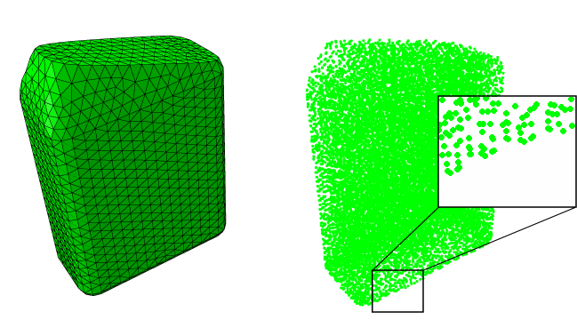

# 15.2.1 光滑粒子流体力学


**产品：** Abaqus/Explicit  

##### **参考文献**

- ["连续体粒子单元，" 第 33.2.1 节"](pt06ch33s02alm62.md)
- [*SOLID SECTION](../key/key-link.md#usb-kws-msolidsection)
- [*SECTION CONTROLS](../key/key-link.md#usb-kws-msectioncontrols)
- [*INITIAL CONDITIONS](../key/key-link.md#usb-kws-minitialcond)

### 概述

光滑粒子流体力学（SPH）是一种数值方法，属于更大类的无网格（或网格自由）方法。对于这些方法，您不像在有限元分析中通常定义节点和单元那样定义它们；相反，只需要一组点来表示给定物体。在光滑粒子流体力学中，这些节点通常称为粒子或伪粒子。

[图 15.2.1-1](pt04ch15s02aus95.md#sph-meshes) 中显示的示例对比了两种方法。两种离散表示都模型化了瓶内流体体的初始配置，如 ["盛水瓶的冲击，" Abaqus 例题指南第 2.3.2 节"](pta/exa/exa-link.md#exa-dyn-bottledrop) 中详细描述。左侧的模型是流体所占体积的传统四面体网格。右侧，相同体积由一组离散点表示。注意，在后一种情况下，没有连接这些点的边，因为这些点（伪粒子）不需要定义多节点单元连接性，如左侧传统有限元表示中的情况。直接定义粒子单元的替代方法是定义常规连续体有限元，并在分析开始时或分析期间自动将它们转换为粒子单元，如 ["有限元转换为 SPH 粒子，" 第 15.2.2 节"](pt04ch15s02aus96.md) 中讨论的。

**图 15.2.1-1** 有限元网格和 SPH 粒子分布。



光滑粒子流体力学是一种完全拉格朗日建模方案，允许通过直接在分布求解域上的离散点集内插属性来离散化一组规定的连续体方程，而无需定义空间网格。该方法的拉格朗日性质以及与固定网格的缺失是其主要优势。与流体流动和涉及大变形及自由表面结构问题相关的困难以相对自然的方式解决。

在其核心，该方法不是基于离散粒子（球体）相互压缩或如"粒子"这个词可能暗示的那样在拉伸中表现出类似内聚行为。恰恰相反，它只是连续体偏微分方程的一种巧妙离散化方法。在这方面，光滑粒子流体力学与有限元方法非常相似。SPH 使用进化插值方案来近似域中任意点处的场变量。感兴趣粒子处变量值可以通过从一组相邻粒子（用下标 *j* 表示）的贡献求和来近似，对于这些粒子，"核"函数 *W* 不为零


[图 15.2.1-2](pt04ch15s02aus95.md#sph-int-method-nls) 显示了一个示例核函数。平滑长度 *h* 决定了多少粒子影响特定点的插值。

**图 15.2.1-2** 核函数。


自成立以来，SPH 方法获得了大量理论支持（[Gingold 和 Monaghan，1977](pt04ch15s02aus95.md#asphanalysis-gingold1977)），与方法相关的出版物现在非常多。下面列出了许多参考文献。

该方法可以使用 Abaqus/Explicit 中任何可用的材料（包括用户材料）。您可以像对任何其他拉格朗日模型一样指定初始条件和边界条件。也允许与其他拉格朗日体的接触相互作用，从而扩大了该方法可以使用的应用范围。

当变形不太严重时，该方法通常不如拉格朗日有限元分析准确；在较高变形状态下，不如耦合欧拉-拉格朗日分析准确。如果模型中所有节点的很大百分比与光滑粒子流体力学相关，则使用多个 CPU 时分析可能无法良好扩展。

### 应用

光滑粒子流体力学分析在涉及极端变形的应用中非常有效。流体晃荡、波工程、弹道学、喷涂（如喷漆）、气体流动以及随后继发冲击的消灭和碎片化只是几个例子。有许多应用可以同时使用耦合欧拉-拉格朗日和光滑粒子流体力学方法。在许多耦合欧拉-拉格朗日分析中，材料与空隙比率很小，因此计算成本可能非常高。在这些情况下，首选光滑粒子流体力学方法。例如，通过大体积追踪来自初次冲击的碎片直到继发冲击发生，在耦合欧拉-拉格朗日分析中可能非常昂贵，但在光滑粒子流体力学分析中没有额外成本。

["盛水瓶的冲击，" Abaqus 例题指南第 2.3.2 节"](../exa/exa-link.md#exa-dyn-bottledrop)，包括使用光滑粒子流体力学方法模拟与冲击相关的剧烈晃荡的示例。

### 人工粘度

光滑粒子流体力学中的人工粘度与有限元的体积粘度具有相同的含义。与其他拉格朗日单元类似，粒子单元使用线性和二次粘性贡献来抑制计算响应中的高频噪声。在很少情况下默认值为不合适时，您可以控制包含在光滑粒子流体力学分析中的人工粘度量。

| **输入文件用法：** | 使用以下选项指定线性和二次人工粘度的比例因子： |
| --- | --- |
|  | ``` [*SECTION CONTROLS](../key/key-link.md#usb-kws-msectioncontrols) , , , *scale factor for linear artificial viscosity, scale factor for quadratic artificial viscosity* ``` |

### 初始条件

["Abaqus/Standard 和 Abaqus/Explicit 中的初始条件，" 第 34.2.1 节"](pt07ch34s02aus116.md) 描述了可用于显式动力学分析的所有初始条件。适用于力学分析的初始条件可用于光滑粒子流体力学分析。

### 边界条件

边界条件如 ["Abaqus/Standard 和 Abaqus/Explicit 中的边界条件，" 第 34.3.1 节"](pt07ch34s03aus118.md) 中所述定义。

### 载荷

["施加载荷：概述，" 第 34.4.1 节"](pt07ch34s04aus120.md) 解释了可用于显式动力学分析的载荷类型。集中节点载荷可以如常施加。重力载荷是光滑粒子流体力学分析中唯一允许的分布载荷。

### 材料选项

Abaqus/Explicit 中的任何材料模型都可以在光滑粒子流体力学分析中使用。

### 单元

光滑粒子流体力学方法通过与 PC3D 单元关联的公式实现。这些 1 节点单元只是定义空间中表示特定物体或多个物体的粒子的手段。这些粒子单元利用 Abaqus 中的现有功能来引用单元相关特征，如材料、初始条件、分布载荷和可视化。

您可以像定义点质量一样定义这些单元。这些点的坐标位于被建模体的表面或内部，类似于用砖单元网格化的体的节点。为了获得更准确的结果，您应该努力使这些粒子的节点坐标在所有方向上尽可能均匀地分布。

直接定义 PC3D 单元的替代方法是定义常规连续体有限元类型 C3D8R、C3D6 或 C3D4，并在分析开始时或分析期间自动将它们转换为粒子单元，如 ["有限元转换为 SPH 粒子，" 第 15.2.2 节"](pt04ch15s02aus96.md) 中讨论的。

Abaqus/Explicit 中实现的光滑粒子流体力学方法使用三次样条作为插值多项式，并基于下面参考文献中概述的经典光滑粒子流体力学理论。

光滑粒子流体力学方法未针对二维单元实现。轴对称可以使用楔形扇区和对称边界条件模拟。PC3D 单元没有相关的沙漏或畸变控制力。这些单元没有相关的面或边。

#### SPH 核插值器

默认情况下，Abaqus/Explicit 中实现的光滑粒子流体力学方法使用三次样条作为插值多项式。或者，您可以选择二次（[Johnson et al, 1996](pt04ch15s02aus95.md#asphanalysis-johnson)）或五次（[Wendland, 1995](pt04ch15s02aus95.md#asphanalysis-wendland)）插值器。

该实现基于下面参考文献中概述的经典光滑粒子流体力学理论。您还可以选择使用平均流修正配置更新，通常在文献中称为 XSPH 方法（见 [Monaghan, 1992](pt04ch15s02aus95.md#asphanalysis-monaghan)），以及 [Randles 和 Libersky, 1997](pt04ch15s02aus95.md#asphanalysis-randles) 的修正核，也称为归一化 SPH（NSPH）方法。

您可以控制这些设置，如 ["光滑粒子流体力学（SPH）的截面控制" 在"截面控制，" 第 27.1.4 节"](pt06ch27s01aus113.md#usb-elm-esectioncontrol-sph) 中讨论的。

#### 计算粒子体积

目前没有自动计算与这些粒子相关联的体积的功能。因此，您需要提供一个特征长度，用于计算粒子体积，进而用于计算与粒子相关联的质量。假定节点在空间中均匀分布，每个粒子与以该粒子为中心的小立方体相关联。当堆叠在一起时，这些立方体将用体上一些小的近似填充体的整体体积。特征长度是立方体边长的一半。从实际角度，一旦创建了节点，您可以使用两个节点之间距离的一半作为特征长度。或者，如果您知道零件的质量和密度，您可以计算零件的体积并将其除以零件中的粒子总数，以获得与每个粒子相关的小立方体的体积。这个小立方体体积的立方根的一半是这组粒子的合理特征长度。如果请求将模型定义数据打印到数据（`.dat`）文件，您可以检查模型中各个集的质量（见 ["输出中的模型和历史定义摘要，" 第 4.1.1 节"](pt02ch04s01aus38.md#usb-out-ooutput-modelhist-sum)）。

| **输入文件用法：** | 使用以下选项定义光滑粒子流体力学体： |
| --- | --- |
|  | ``` [*ELEMENT](../key/key-link.md#usb-kws-melement), TYPE=PC3D, ELSET=*particle_body* *element number*, *node number* ``` 根据需要重复数据行。``` [*SOLID SECTION](../key/key-link.md#usb-kws-msolidsection), ELSET=*particle_body*, MATERIAL=*material_name* *characteristic length associated with particle volume* ``` |

#### 平滑长度计算

尽管粒子单元在模型中每个单元定义一个节点，但光滑粒子流体力学方法根据影响球内的相邻粒子计算每个单元的贡献。这个影响球的半径在文献中称为平滑长度。平滑长度独立于上面讨论的特征长度，并控制方法的插值属性。默认情况下，平滑长度是自动计算的。随着变形进展，粒子相互移动，因此给定粒子的邻居可以（通常会）发生变化。每个增量，Abaqus/Explicit 在内部重新计算这个局部连接性，并基于以感兴趣粒子为中心的粒子云的贡献计算运动学量（如法向和剪切应变、变形梯度等）。然后以与减缩积分砖单元类似的方式计算应力，然后再基于光滑粒子流体力学公式用于计算粒子云中粒子的单元节点力。

默认情况下，Abaqus/Explicit 在分析开始时计算平滑长度，使得与单元相关联的粒子的平均数量大约在 30 到 50 之间。平滑长度在分析期间保持不变。因此，每个单元的平均粒子数可以根据模型中的平均行为是膨胀还是压缩而减少或增加。如果分析主要是压缩性的，则与给定单元相关联的粒子总数可能超过允许的最大值，分析将停止。默认情况下，允许与一个单元关联的最大粒子数为 140。

您可以控制这些设置，如 ["光滑粒子流体力学（SPH）的截面控制" 在"截面控制，" 第 27.1.4 节"](pt06ch27s01aus113.md#usb-elm-esectioncontrol-sph) 中讨论的。

#### 光滑粒子流体力学域

在分析开始时计算一个矩形区域，作为将追踪粒子的边界框。这个固定矩形盒子比整个模型的整体尺寸大 10%，并以模型的几何中心为中心。随着分析进展，如果粒子在此盒子外，它表现得像自由飞行点质量，不对光滑粒子流体力学计算做出贡献。如果粒子在后续阶段重新进入盒子，它将再次被包括在计算中。

您可以修改边界框的大小，如 ["光滑粒子流体力学（SPH）的截面控制" 在"截面控制，" 第 27.1.4 节"](pt06ch27s01aus113.md#usb-elm-esectioncontrol-sph) 中讨论的。

### 约束

由于 PC3D 单元是拉格朗日单元，它们的节点可以参与其他特征，如其他单元、连接器或约束。由于这些单元没有面或边，因此不能使用 PC3D 单元定义基于单元的表面。因此，不能为粒子定义需要基于单元的表面的约束（如紧固件）。

### 相互作用

用粒子模型的体可以通过接触与其他有限元网格化的体相互作用。接触相互作用与任何基于节点的表面（与粒子相关联）与基于单元的或解析表面之间的接触相互作用相同。可以使用一般接触和接触对。允许使用适用于涉及基于节点的表面的接触的所有相互作用类型和公式，包括内聚行为。可以通过常规选项分配不同的接触属性。默认情况下，粒子不是一般接触域的一部分，类似于其他 1 节点单元（如点质量）。粒子的默认接触厚度与截面定义上指定的特征长度相同；因此，为了接触目的，粒子表现得像球体，其半径等于与上述粒子体积相关的小立方体内切的球体半径。

您不应该为与 PC3D 单元关联的节点指定零接触厚度，否则接触可能无法稳健地解决。推荐的方法是使用默认值或指定合理的接触厚度。

允许不同体（都用 PC3D 单元建模）之间的相互作用。然而，这种相互作用仅在碰撞的光滑粒子流体力学体由相同类流体材料制成的情况下才有意义，如落入部分盛有水的桶中的水滴。在固体相关应用中，如模拟子弹穿透装甲板，其中一个体必须用常规有限元建模。

不能在粒子和欧拉区域之间定义接触相互作用。

| **输入文件用法：** | 使用以下选项定义网格化或解析表面与基于粒子的表面之间的接触： |
| --- | --- |
|  | ``` [*CONTACT](../key/key-link.md#usb-kws-hcontact) [*CONTACT INCLUSIONS](../key/key-link.md#usb-kws-hcontactinclusions) *node-based particle surface*, *element-based/analytical_surface* ``` |

### 输出

PC3D 单元可用的单元输出包括连续体单元的所有力学相关输出：应力；应变；能量；以及状态、场和用户定义变量的值。节点输出包括 Abaqus/Explicit 分析中通常可用的所有输出变量。

粒子可以通过圆盘在 Abaqus/CAE 中可视化。在等值线图中，场输出变量的值显示为彩色圆形斑块。符号图也可用。

### 限制

光滑粒子流体力学分析受以下限制：
- 当变形不太严重且单元没有畸变时，该方法通常不如拉格朗日有限元分析准确。在较高变形状态下，耦合欧拉-拉格朗日分析通常也更准确。光滑粒子动力学方法应主要用于常规有限元方法或耦合欧拉-拉格朗日方法已达到其固有局限或成本过高的情况。
- 当材料处于拉伸应力状态时，粒子运动可能变得不稳定，导致所谓的拉伸不稳定。这种不稳定，严格与标准光滑粒子动力学方法的插值技术相关，在模拟固体拉伸状态时特别明显。因此，粒子倾向于聚集在一起并表现出类似断裂的行为。
- 与用连续体单元（如 C3D8R 单元）定义的相同体的质量分布相比，用粒子单元定义的体中的质量分布有些不同。当使用粒子单元时，该体中所有粒子的体积相同。因此，该体中所有粒子关联的节点质量相同。如果节点不是以规则立方体排列放置，质量分布在某种程度上是不精确的，特别是在被建模体的自由表面上。
- 不能在 PC3D 单元上指定表面载荷。但是，可以将分布载荷（如压力）施加到其他有限元表面，这些表面可以通过接触相互作用将压力施加到粒子单元上。
- 使用未通过相同截面定义定义的粒子建模的体不会相互相互作用。因此，您不能使用光滑粒子流体力学来建模不同材料体的混合。
- 该功能在 Abaqus/CAE 中不直接支持。但是，您可以执行以下操作：- 您可以使用 Abaqus/CAE 中的现有功能生成质量单元，写入输入文件，然后手动编辑输入文件将质量单元转换为粒子。- 您可以使用有限元转换为 SPH 粒子（见 ["有限元转换为 SPH 粒子"中的"边界条件"，第 15.2.2 节"](pt04ch15s02aus96.md#usb-anl-ashpconv-bc)）在分析开始时（时间为零的基于时间的转换标准）。- 您可以使用 C3D8R 单元创建网格，写入输入文件，然后使用脚本将这些单元转换为粒子，如 Dassault Systèmes 知识库中的"从实体网格生成粒子单元"所述，网址为 [www.3ds.com/support/knowledge-base](http://www.3ds.com/support/knowledge-base)。
- 在通过一个实体截面定义定义的给定体（零件）内，不能有选择性地对由此定义引用的单元子集指定重力载荷和质量缩放。相反，这两个特征必须应用于与实体截面定义关联的元素集的所有单元。

光滑粒子流体力学计算在大多数情况下跨并行域分布；但是，对于具有以下任何特征的模型，它们全部由单个域（具有单个处理器）执行（这通常会显著降低并行可扩展性）：
- 在分析开始后进行有限元转换为 SPH 粒子（见 ["有限元转换为 SPH 粒子"中的"边界条件"，第 15.2.2 节"](pt04ch15s02aus96.md#usb-anl-ashpconv-bc)）。并行光滑粒子流体力学实现仅支持在分析开始时（时间等于零）转换为 SPH 粒子。
- PC3D 单元的多个实体截面
- 指定为截面控制的归一化核
- 材料属性的预定义场变量（包括温度）依赖性

如果使用多个 CPU，光滑粒子流体力学分析受以下限制：
- 不支持光滑粒子流体力学从属节点的接触输出。
- 不支持单元历史输出。
- 除了整个模型外不支持能量历史输出。
- 无法激活动态负载平衡。
- 如果任何 SPH 粒子参与一般接触，则所有 SPH 粒子都必须包括在一般接触定义中。
- 建议每个域至少 10,000 个粒子以获得良好的可扩展性。
- 使用大量 CPU 时可能需要大幅增加内存使用量。

### 输入文件模板

以下示例说明了装满流体的瓶子落在地板上的光滑粒子流体力学分析。塑料瓶和地板用常规壳单元建模。流体通过使用 PC3D 单元的光滑粒子流体力学建模。粒子的节点坐标定义为都位于瓶内。材料属性定义如常用于流体和瓶子。定义了光滑粒子流体力学粒子（表示水）与瓶内壁之间的接触相互作用（基于节点的表面），以及瓶外表与地板之间的接触（使用基于单元的表面，未显示）。请求输出流体中的应力（压力）和密度。

```
[*HEADING](../key/key-link.md#usb-kws-mheading)
…
[*ELEMENT](../key/key-link.md#usb-kws-melement), TYPE=PC3D, ELSET=Fluid_Inside_The_Bottle
*Element number, node number*
…
[*SOLID SECTION](../key/key-link.md#usb-kws-msolidsection), ELSET=Fluid_Inside_The_Bottle, MATERIAL=Water
*Element characteristic length associated with particle volume*
[*MATERIAL](../key/key-link.md#usb-kws-mmaterial), NAME=Water
*Material definition for water, such as an EOS material*
[*ELEMENT](../key/key-link.md#usb-kws-melement), TYPE=S4R, ELSET=Plastic_Bottle
*Element definitions for the shells*
**
[*INITIAL CONDITIONS](../key/key-link.md#usb-kws-minitialcond), TYPE=VELOCITY
*Data lines to define velocity initial conditions*
[*NSET](../key/key-link.md#usb-kws-mnset), NSET=Water_Nodes, ELSET=Fluid_Inside_The_Bottle
[*SURFACE](../key/key-link.md#usb-kws-msurface), NAME=Water_Surface, TYPE=NODE
Water_Nodes,
[*SURFACE](../key/key-link.md#usb-kws-msurface), NAME=Bottle_Interior
Plastic_Bottle, SNEG
**
[*STEP](../key/key-link.md#usb-kws-hstep)
[*DYNAMIC](../key/key-link.md#usb-kws-hdynamic), EXPLICIT
[*DLOAD](../key/key-link.md#usb-kws-hdload)
*Data lines to define gravity load*
**
[*CONTACT](../key/key-link.md#usb-kws-hcontact)
[*CONTACT INCLUSIONS](../key/key-link.md#usb-kws-hcontactinclusions)
Water_Surface, Bottle_Interior
**
[*OUTPUT](../key/key-link.md#usb-kws-houtput), FIELD
[*ELEMENT OUTPUT](../key/key-link.md#usb-kws-helementoutput), ELSET=Fluid_Inside_The_Bottle
S, DENSITY
[*END STEP](../key/key-link.md#usb-kws-hendstep)
```

#### 其他参考文献

- Gingold, R. A., and J. J. Monaghan, "Smoothed Particle Hydrodynamics: Theory and Application to Non-Spherical Stars," Royal Astronomical Society, Monthly Notices, vol. 181, pp. 375--389, 1977.
- Johnson, J., R. Stryk, and S. Beissel, "SPH for High Velocity Impact Calculations," Computer Methods in Applied Mechanics and Engineering, 1996.
- Libersky, L. D., and A. G. Petschek, "High Strain Lagrangian Hydrodynamics," Journal of Computational Physics, vol. 109, pp. 67--75, 1993.
- Monaghan, J., "Smoothed Particle Hydrodynamics," Annual Review of Astronomy and Astrophysics, 1992.
- Munjiza, A., and K. R. F. Andrews, "NBS Contact Detection Algorithm for Bodies of Similar Size," International Journal for Numerical Methods in Engineering, vol. 43, pp. 131--149, 1998.
- Randles, P. W., and L. D. Libersky, "Recent Improvements in SPH Modeling of Hypervelocity Impact," International Journal of Impact Engineering, 1997.
- Swegle, J. W., and S. W. Attaway, "An Analysis of Smoothed Particle Hydrodynamics," Sandia National Lab Report SAND93--2513, 1994.
- Wendland, H., "Piecewise Polynomial, Positive Definite and Compactly Supported Radial Functions of Minimal Degree," Advances in Computational Mathematics, 1995.


