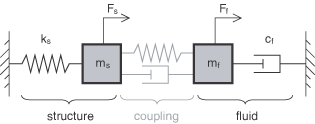

# 17.1.1 协同仿真：概述

协同仿真技术是一种用于运行时耦合 Abaqus 和其他分析程序的 capability。Abaqus 分析可以耦合到另一个 Abaqus 分析或耦合到第三方分析程序，以执行多物理场模拟和多域（多模型）耦合。

Abaqus 提供了内置程序来求解多物理场模拟，如 ["解决分析问题：概述，" 第 6.1.1 节中的"多物理场分析"](pt03ch06s01abo04.md#usb-anl-asolving-multiphysics) 所述。对于 Abaqus 没有提供内置求解程序或求解程序功能有限的多物理场问题，您可以使用协同仿真技术将 Abaqus 与第三方分析程序耦合；例如，与计算流体动力学（CFD）分析程序结合进行流固耦合（FSI）模拟。

Abaqus/Standard 与 Abaqus/Explicit 之间的协同仿真说明了一种多域分析方法，其中每个 Abaqus 分析在模型域的互补部分上运行，预计该部分将提供计算效率更高的求解。例如，Abaqus/Standard 为轻质和刚性组件提供更有效的求解，而 Abaqus/Explicit 在求解复杂接触相互作用方面更有效。

### Abaqus 协同仿真技术的特点

Abaqus 协同仿真技术：
- 可用于通过将 Abaqus 与 CFD 分析程序耦合来求解复杂流固相互作用，包括 Abaqus/CFD 瞬态分析（不支持与 Abaqus/CFD 稳态求解器的协同仿真）；
- 可用于通过将 Abaqus/Standard 与 CFD 分析程序耦合来求解共轭热传递问题，包括 Abaqus/CFD 瞬态分析；
- 可用于通过将 Abaqus 与电磁分析程序耦合来求解涉及电磁-热或电磁-机械相互作用的问题，包括 Abaqus/Standard 中的电磁分析程序；
- 可用于通过将 Abaqus 与第三方分析程序耦合来进行多物理场模拟；
- 可用于通过将 Abaqus/Standard 耦合到 Abaqus/Explicit 来更有效地求解复杂多域分析；
- 可用于通过将 Abaqus/Standard 或 Abaqus/Explicit 与 Dymola 耦合来进行结构-逻辑模拟；
- 可使用 SIMULIA Co-Simulation Engine 将 Abaqus 与内部代码耦合；
- 面向具有 Abaqus 和第三方分析程序深入知识的高级用户；
- 允许数据的单向和双向传输；
- 可用于具有线性或非线性结构响应的 Abaqus 模型；和
- 支持稳态、瞬态，以及电磁程序的时谐模拟。

### 使用不同分析程序建模的域之间的相互作用

在协同仿真中，域之间的相互作用通过公共物理接口区域进行，Abaqus 和耦合分析程序之间以同步方式在该区域上交换数据。

一个域可能通过以下一种或多种方式影响另一个域的响应：
- 本构行为，如定义为温度函数的屈服应力或定义为其他求解场（如热应变或压电效应）函数的应力；
- 表面牵引力/通量，如流体对结构施加的压力；
- 体力/通量，如耦合热电模拟中电流流动产生的热量；
- 接触力，如车辆与建模为独立域的乘员/行人之间的接触力；
- 运动学，如与合规结构接触的流体，其中界面运动影响流体流动；和
- 离散耦合，如传感器和驱动信息。

#### 使用 SIMULIA Co-Simulation Engine 耦合 Abaqus

SIMULIA Co-Simulation Engine 提供 Abaqus 分析之间或 Abaqus 与第三方分析程序之间的耦合。此耦合方法用于流固耦合、共轭热传递、电磁-结构、电磁-热和结构-逻辑模拟，以及在耦合隐式动态和显式动态域时将 Abaqus/Standard 耦合到 Abaqus/Explicit。

##### 流固耦合

您可以通过将 Abaqus/Standard 或 Abaqus/Explicit 耦合到计算流体动力学（CFD）分析程序来求解复杂的流固耦合（FSI）问题。Abaqus/Standard 和 Abaqus/Explicit 求解结构域，CFD 分析程序求解流体域。Abaqus/Standard 和 Abaqus/Explicit 可以与 Abaqus/CFD 以及多个第三方 CFD 分析程序耦合。

有关将 Abaqus/CFD 耦合到 Abaqus/Standard 或 Abaqus/Explicit 的详细信息，请参见 ["准备 Abaqus 分析进行协同仿真，" 第 17.2.1 节"](pt04ch17s02aus98.md) 和 ["流体-结构和共轭热传递协同仿真，" 第 17.3.2 节"](pt04ch17s03aus100.md)。有关合格合作伙伴产品的完整列表，请访问 [www.3ds.com/simulia](http://www.3ds.com/simulia) 上的 [协同仿真](http://www.3ds.com/support/certified-hardware/simulia-system-information/compatibility/co-simulation/) 页面。

##### 共轭热传递

您可以通过将 Abaqus/Standard 耦合到计算流体动力学（CFD）分析程序来求解涉及流体和结构的共轭热传递问题。Abaqus/Standard 对结构内部的热传递进行建模（参见 ["非耦合热传递分析，" 第 6.5.2 节"](pt03ch06s05at18.md) 和 ["完全耦合热应力分析，" 第 6.5.3 节"](pt03ch06s05at19.md)），CFD 分析程序对围绕结构的流体流动求解能量方程。Abaqus/Standard 可以与 Abaqus/CFD 以及多个第三方 CFD 分析程序耦合。

有关 Abaqus/CFD 到 Abaqus/Standard 协同仿真的示例，请参阅 ["元件安装电子电路板的共轭热传递分析，" Abaqus 例题指南第 6.1.1 节"](../exa/exa-link.md#exa-cfd-conjugateheattransfer)。有关将 Abaqus/CFD 耦合到 Abaqus/Standard 的详细信息，请参见 ["准备 Abaqus 分析进行协同仿真，" 第 17.2.1 节"](pt04ch17s02aus98.md) 和 ["流体-结构和共轭热传递协同仿真，" 第 17.3.2 节"](pt04ch17s03aus100.md)。有关合格合作伙伴产品的完整列表，请访问 [www.3ds.com/simulia](http://www.3ds.com/simulia) 上的 [协同仿真](http://www.3ds.com/support/certified-hardware/simulia-system-information/compatibility/co-simulation/) 页面。

##### 电磁-热或电磁-机械耦合

诸如感应加热之类的应用需要电磁场和热场之间的相互作用。您可以通过耦合两个 Abaqus/Standard 分析来求解这类问题，其中一个分析求解电磁域中的场，另一个求解热域中的场。Abaqus/Standard 可以与其自身以及多个第三方电磁分析程序耦合。

有关将 Abaqus/Standard 耦合到 Abaqus/Standard 的详细信息，请参见 ["准备 Abaqus 分析进行协同仿真，" 第 17.2.1 节"](pt04ch17s02aus98.md) 和 ["电磁-结构和电磁-热协同仿真，" 第 17.3.3 节"](pt04ch17s03aus101.md)。有关合格合作伙伴产品的完整列表，请访问 [www.3ds.com/simulia](http://www.3ds.com/simulia) 上的 [协同仿真](http://www.3ds.com/support/certified-hardware/simulia-system-information/compatibility/co-simulation/) 页面。

##### 通过逻辑-物理相互作用的系统级建模

系统级建模是指对可能同时包含物理（结构、热、声学等）和逻辑组件的系统进行建模。两种建模抽象之间的区别如下：
- 逻辑建模是指工程实践中经常遇到的一大类建模抽象。一般来说，当部件的大部分几何被移除时，您可以将系统的某部分指定为使用逻辑建模抽象。示例包括电子控制模块、电动机和气动或液压子系统，在许多情况下可以从功能角度进行建模，而无需尝试模拟电子流动、磁通量变化或管道中的空气/流体类型流动。Dymola 提供了多种逻辑建模选项。
- 物理建模是逻辑建模的互补建模抽象。Abaqus 大多数时候使用物理建模抽象；当元素变形时，它们精确知道其几何形状，从而试图在细粒度级别模拟现实世界。

在许多工程系统中，逻辑组件和物理组件之间的相互作用至关重要，如果您不完全分析其中一个，就无法完全分析另一个。使用 Abaqus 和 Dymola 进行协同仿真提供了分析此类系统的能力。

考虑轧机的例子： incoming slab，其厚度可能不是恒定的，可以在 Abaqus 中建模为由轧辊变形。由于 incoming 厚度不是恒定的，需要施加随变形而变化的压力补偿到轧辊上，以使出口厚度尽可能恒定。Abaqus 传感器可以导出关于系统机械状态的信息到 Dymola，Dymola 可以使用这些信息对必要的补偿器进行建模，以在任何给定时间计算所需的驱动载荷。Abaqus 可以导入驱动载荷并将其应用到轧辊上。

有关将 Abaqus/Standard 耦合到 Dymola 的详细信息，请参见 ["结构-逻辑协同仿真，" 第 17.4.1 节"](pt04ch17s04aus103.md)。有关合格合作伙伴产品的完整列表，请访问 [www.3ds.com/simulia](http://www.3ds.com/simulia) 上的 [协同仿真](http://www.3ds.com/support/certified-hardware/simulia-system-information/compatibility/co-simulation/) 页面。

##### 隐式瞬态分析和显式动力学分析之间的相互作用

在某些情况下，您可以通过划分模型并组合 Abaqus/Standard 和 Abaqus/Explicit 求解来显著节省计算成本，例如：
- 当模拟主要用于 Abaqus/Explicit，但模型某些部分可以使用 Abaqus/Standard 中的子结构进行理想化时，或
- 当模拟主要用于 Abaqus/Standard，但复杂接触条件可以由 Abaqus/Explicit 更有效地处理时。

有关 Abaqus/Standard 到 Abaqus/Explicit 协同仿真的示例，请参阅 ["滑板车与凸起物的动态撞击，" Abaqus 例题指南第 2.4.1 节"](../exa/exa-link.md#exa-dyn-scooterbump)。有关将 Abaqus/Standard 和 Abaqus/Explicit 耦合的详细信息，请参见 ["准备 Abaqus 分析进行协同仿真，" 第 17.2.1 节"](pt04ch17s02aus98.md) 和 ["结构-结构协同仿真，" 第 17.3.1 节"](pt04ch17s03aus99.md)。

#### 使用 MpCCI 接口耦合

MpCCI（由 Fraunhofer Institute for Algorithms and Scientific Computing（SCAI）开发和分发的多物理场代码耦合接口）提供了一种开放系统方法，用于 Abaqus 与支持 MpCCI 的任何第三方分析程序之间的通用多学科模拟。MpCCI 提供可扩展的通信基础设施和用于多个物理域的映射算法。在使用 MpCCI 的协同仿真中，Abaqus 与 MpCCI 耦合服务器实时通信，以与第三方分析程序交换场，而每个分析推进其模拟时间。

通过 MpCCI 的耦合可以发生在 Abaqus 与支持 MpCCI 接口的任何第三方分析程序之间。这包括嵌入 MpCCI 适配器的内部代码。SIMULIA 积极支持并认证 Abaqus 与 FLUENT 之间的流固耦合链接。有关使用 MpCCI 接口耦合的更多信息，请联系 [Fraunhofer SCAI](http://www.mpcci.de)。

#### 其他应用

协同仿真还有许多其他应用可用于合作伙伴产品。例如，使用 [Cosin Scientific Software](http://www.cosin.eu) 的 FTire 进行车辆行驶舒适性和耐久性模拟。有关合格合作伙伴产品的完整列表，请访问 [www.3ds.com/simulia](http://www.3ds.com/simulia) 上的 [协同仿真](http://www.3ds.com/support/certified-hardware/simulia-system-information/compatibility/co-simulation/) 页面。

### 物理耦合强度

当最复杂的物理发生在仅由一个分析程序（如 Abaqus 或 CFD 分析程序）处理的域中时，您通常会应用协同仿真技术。由于在协同仿真接口应用的数值技术比较简单，控制单独分析域（物理耦合强度）在接口处相互作用的物理必须相对较弱，协同仿真技术才能有效应用。

#### 与第三方分析程序的耦合

分析域使用交错方法耦合，使用全局显式方式或隐式迭代方式；即，每个域的方程分别求解，载荷和边界条件在公共接口交换。

在耦合足够弱的情况下，可能只需要在一个方向上进行耦合（例如，当电磁力场对结构响应有贡献时，但反向耦合对电磁场没有显著影响）。

在显式交错方法中（如高斯-赛德尔耦合方案），每个耦合步仅交换一次场。此耦合策略适用于表现出弱到中等物理耦合的问题（例如，气动弹性问题，其中空气与相对刚性的结构相互作用）。显式交错方法需要较小的耦合步长。

在隐式迭代方法中，在推进到下一个耦合步之前，场在每个耦合步内交换多次，直到达到整体平衡。隐式耦合每个耦合步的计算成本更高，通常可用于表现出中等至强物理耦合的问题。通常，与显式方案相比，可以使用更大的耦合步长。

[图 17.1.1-1](pt04ch17s01abo17.md#acosimulationover-impeadance) 用频域中的类比说明了耦合强度。考虑一个具有与响应频率  直接相关的耦合阻抗的集中参数动态系统。在交错求解方法中，每个域通过临时忽略 [图 17.1.1-1](pt04ch17s01abo17.md#acosimulationover-impeadance) 中灰色弹簧和阻尼器表示的耦合项来求解。

**图 17.1.1-1** 机械阻抗类比。

当响应频率和耦合阻抗较低时，交错方法可能提供足够的求解精度和性能。然而，当响应频率较高时，使得耦合阻抗相对较大（相对于结构或流体），您可能会在交错方法中遇到求解稳定性问题。

#### Abaqus/Standard 到 Abaqus/Explicit 协同仿真中的耦合

使用协同仿真技术时，Abaqus/Standard 到 Abaqus/Explicit 耦合中的物理耦合强度通常可以更强。通过"右手边"和"左手边"项的通信，Abaqus/Standard 到 Abaqus/Explicit 协同仿真在广泛的问题参数范围内提供了稳健的接口解。在许多情况下，您可以选择让 Abaqus/Standard 和 Abaqus/Explicit 各自根据其自己的自动时间步长方案推进求解，而不会对接口求解稳定性产生不利影响。

### 参考文献

有关运行 FSI 模拟和碰撞安全模拟的最新支持信息和提示，请参阅 [www.3ds.com/support/knowledge-base](http://www.3ds.com/support/knowledge-base) 上的 Dassault Systèmes 知识库。
