# 17.2.1 准备 Abaqus 分析进行协同仿真


**产品：** Abaqus/Standard  Abaqus/Explicit  Abaqus/CFD

##### **参考文献**

- ["协同仿真：概述，" 第 17.1.1 节"](pt04ch17s01abo17.md)
- ["结构-结构协同仿真，" 第 17.3.1 节"](pt04ch17s03aus99.md)
- ["流体-结构和共轭热传递协同仿真，" 第 17.3.2 节"](pt04ch17s03aus100.md)
- ["电磁-结构和电磁-热协同仿真，" 第 17.3.3 节"](pt04ch17s03aus101.md)
- [*CO-SIMULATION](../key/key-link.md#usb-kws-hcosimulation)
- [*CO-SIMULATION REGION](../key/key-link.md#usb-kws-hcosimulationregion)
- [*CO-SIMULATION CONTROLS](../key/key-link.md#usb-kws-hcosimulationcontrols)

### 概述

准备 Abaqus 分析进行协同仿真涉及以下内容：
- 为协同仿真分析识别 Abaqus 分析步骤；
- 在 Abaqus 模型中识别协同仿真接口区域；和
- 识别协同仿真期间交换的场。

本节概述了准备 Abaqus 分析进行协同仿真。本节中的讨论是通用的，可能不适用于每种产品配对。["Abaqus 求解器之间的协同仿真，" 第 17.3 节"](pt04ch17s03.md) 提供了 Abaqus 求解器之间协同仿真的设置、执行和限制详细信息。对于 Abaqus 与第三方分析程序之间的协同仿真，请参阅相应的用户指南。

### 为协同仿真分析识别 Abaqus 步骤

协同仿真事件不必从 Abaqus 分析的第一步开始。但是，它确实需要从分析步骤的开始开始，并在该分析步骤内结束。因此，您需要在 Abaqus 中定义步骤持续时间，使得协同仿真事件的开始落在 Abaqus 分析步骤的开始，并定义该特定步骤使得协同仿真事件在该步骤结束前结束。Abaqus 模型的常规载荷和边界条件照常指定。

当协同仿真事件开始时，与耦合分析的通信被启动；当达到协同仿真事件时间时，通信被终止。当在协同仿真事件时间之前达到分析步骤结束时，或者当分析无法继续时（例如由于收敛问题），Abaqus 可能终止协同仿真事件。在这种情况下，将向所有客户端发出警告消息，并终止协同仿真。

以下 Abaqus 程序支持协同仿真：
- ["静态应力分析，" 第 6.2.2 节"](pt03ch06s02at01.md)
- ["准静态分析，" 第 6.2.5 节"](pt03ch06s02at04.md)
- ["使用直接积分的隐式动态分析，" 第 6.3.2 节"](pt03ch06s03at07.md)
- ["显式动态分析，" 第 6.3.3 节"](pt03ch06s03at08.md)
- ["非耦合热传递分析，" 第 6.5.2 节"](pt03ch06s05at18.md)
- ["完全耦合热应力分析，" 第 6.5.3 节"](pt03ch06s05at19.md)
- ["不可压缩流体动力学分析，" 第 6.6.2 节"](pt03ch06s06aus48.md)
- ["压电分析，" 第 6.7.2 节"](pt03ch06s07at21.md)
- ["耦合热电分析，" 第 6.7.3 节"](pt03ch06s07at22.md)
- ["涡流分析，" 第 6.7.5 节"](pt03ch06s07at24.md)
- ["耦合孔隙流体扩散和应力分析，" 第 6.8.1 节"](pt03ch06s08at26.md)

| **输入文件用法：** | 在步骤定义中使用以下选项来指示协同仿真事件的开始： |
| --- | --- |
|  | ``` [*CO-SIMULATION](../key/key-link.md#usb-kws-hcosimulation), NAME=*name* ``` |

### 识别在协同仿真期间与 Abaqus 通信的分析程序

您可以使用 SIMULIA Co-Simulation Engine 将 Abaqus 与另一个 Abaqus 分析或某些第三方分析程序耦合。有关与第三方分析程序耦合的详细信息，请参阅相应的用户指南。

| **输入文件用法：** | 使用以下选项耦合 Abaqus 分析（不包括 Abaqus/Standard 到 Abaqus/Explicit）和 Abaqus 与第三方分析程序： |
| --- | --- |
|  | ``` [*CO-SIMULATION](../key/key-link.md#usb-kws-hcosimulation), NAME=*name*, PROGRAM=MULTIPHYSICS ``` 使用以下选项耦合 Abaqus/Standard 到 Abaqus/Explicit：``` [*CO-SIMULATION](../key/key-link.md#usb-kws-hcosimulation), NAME=*name*, PROGRAM=ABAQUS ``` |

### 识别协同仿真接口区域

两个 Abaqus 模型之间或 Abaqus 模型与第三方分析模型之间的相互作用通过称为协同仿真接口区域的公共接口区域进行。协同仿真接口区域可以是离散点集、表面区域或体积区域。您必须在接口区域定义中保持一致；如果在一个分析中定义了表面协同仿真区域，则必须在另一个分析中也定义表面协同仿真区域。此外，这些协同仿真区域需要共定位并具有相同的区域边界。

#### 通过离散点相互作用

相互作用可以通过一组离散点进行，其中仅节点位置信息（无元素拓扑信息，如从属面积）定义协同仿真接口区域。在这种情况下，空间映射仅限于点对点映射，您必须确保模型之间存在匹配的节点。

在 Abaqus 中，您可以使用节点集或基于节点的表面来定义由离散点组成的协同仿真接口区域。

| **输入文件用法：** | 使用以下选项在 Abaqus 模型中定义节点集作为协同仿真区域： |
| --- | --- |
|  | ``` [*CO-SIMULATION REGION](../key/key-link.md#usb-kws-hcosimulationregion), TYPE=NODE *nodeset_A* ``` 使用以下选项在 Abaqus 模型中定义基于节点的表面作为协同仿真区域：``` [*SURFACE](../key/key-link.md#usb-kws-msurface), TYPE=NODE *nodeset_A* [*CO-SIMULATION REGION](../key/key-link.md#usb-kws-hcosimulationregion), TYPE=SURFACE *node-based surface name* ``` |

#### 通过表面相互作用

不同域之间的相互作用通过公共接口表面进行。例如，当流体与固体相互作用而不穿透它时，流固界面通过表面定义。在这种情况下，节点位置和元素拓扑信息都定义协同仿真接口，并执行适当的空间映射以在不同表面网格之间保守地映射场。

| **输入文件用法：** | 使用以下选项在 Abaqus 模型中定义基于单元的表面作为协同仿真区域： |
| --- | --- |
|  | ``` [*CO-SIMULATION REGION](../key/key-link.md#usb-kws-hcosimulationregion), TYPE=SURFACE (default) *element-based surface name* ``` |

#### 通过体积相互作用

重叠域之间的相互作用通过体积进行。在这种情况下，节点位置和元素拓扑信息都定义协同仿真区域，并执行适当的空间映射以在不同体积网格之间保守地映射场。

接口区域由单元集定义。

| **输入文件用法：** | 使用以下选项在 Abaqus 模型中定义体积作为协同仿真区域： |
| --- | --- |
|  | ``` [*CO-SIMULATION REGION](../key/key-link.md#usb-kws-hcosimulationregion), TYPE=VOLUME *elset_A* ``` |

### 识别跨协同仿真接口交换的场

域模型的耦合可以通过在协同仿真接口处规定的载荷和/或边界条件进行。此外，质量、转动惯量和热容项也可以交换。基于物理和相互作用类型及其 enforcement，您必须在协同仿真期间指定在 Abaqus 分析中导入和/或导出的场。

协同仿真接口可以由离散点（节点）、表面区域或体积区域组成。并非所有场都可以跨所有区域类型交换。

本节概述了 Abaqus 中所有可用的场。有关在两个 Abaqus 求解器之间交换的场的详细信息，请参见 ["结构-结构协同仿真，" 第 17.3.1 节"](pt04ch17s03aus99.md) 和 ["流体-结构和共轭热传递协同仿真，" 第 17.3.2 节"](pt04ch17s03aus100.md)。有关 Abaqus 与第三方分析程序之间交换的场的详细信息，请参阅相应的用户指南。

| **输入文件用法：** | 使用以下选项将场数据导入 Abaqus 中的区域： |
| --- | --- |
|  | ``` [*CO-SIMULATION REGION](../key/key-link.md#usb-kws-hcosimulationregion), IMPORT *region_A*, *import_field_1* *region_A*, *import_field_2* ``` 使用以下选项从 Abaqus 导出数据：``` [*CO-SIMULATION REGION](../key/key-link.md#usb-kws-hcosimulationregion), EXPORT *region_A*, *export_field_1* *region_A*, *export_field_2* ``` |

#### 涉及力学自由度的程序

[表 17.2.1-1](pt04ch17s02aus98.md#acosimulationprep-mechdof) 列出了可以为支持力学自由度（自由度 1-6）的程序交换的场、其相关的场标识符、支持的协同仿真接口区域类型，以及哪些 Abaqus 求解器支持场的导入和导出。

**表 17.2.1-1** 为支持力学自由度的程序交换场。
| 场 ID | 场 | 接口类型1 | Abaqus 求解器2 | 单位 |
| --- | --- | --- | --- | --- |
| 导入 | 导出 |
| UT 或 U | 位移 | P、S、V | S、E、C | S、E | *L* |
| VT 或 V | 速度（瞬态程序） | P、S、V | S、E、C | S、E | 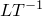 |
| AT 或 A | 加速度（瞬态程序） | P、S、V | S | S、E | 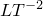 |
| UR | 旋转 | P、S | S、E | S、E | 弧度 |
| VR | 角速度（瞬态程序） | P、S | S、E | S、E | 弧度 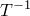 |
| AR | 角加速度（瞬态程序） | P、S | S | S、E | 弧度 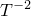 |
| COORD | 当前坐标 | P、S、V |  | S、E |  |
| CF | 集中力 | P、S、V | S、E | S、E | *F* |
| CM | 集中力矩 | P、S | S、E | S、E | 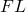 |
| TRSHR | 牵引力向量 | S |  | C | 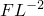 |
| PRESS | 垂直于单元表面的压力 | S | S |  |  |
| 1 P（点）、S（表面区域）、V（体积区域） |
| 2 S（Abaqus/Standard）、E（Abaqus/Explicit）、C（Abaqus/CFD） |

以下程序支持使用力学自由度进行协同仿真：- ["静态应力分析，" 第 6.2.2 节"](pt03ch06s02at01.md)
- ["准静态分析，" 第 6.2.5 节"](pt03ch06s02at04.md)
- ["使用直接积分的隐式动态分析，" 第 6.3.2 节"](pt03ch06s03at07.md)
- ["显式动态分析，" 第 6.3.3 节"](pt03ch06s03at08.md)
- ["完全耦合热应力分析，" 第 6.5.3 节"](pt03ch06s05at19.md)
- ["不可压缩流体动力学分析，" 第 6.6.2 节"](pt03ch06s06aus48.md)
- ["压电分析，" 第 6.7.2 节"](pt03ch06s07at21.md)
- ["耦合孔隙流体扩散和应力分析，" 第 6.8.1 节"](pt03ch06s08at26.md)

##### 位移

平动自由度的位移（场 ID UT 或 U）可以由 Abaqus/Standard 和 Abaqus/Explicit 导出。位移可以由 Abaqus/Standard、Abaqus/Explicit 和 Abaqus/CFD 导入。当导入时，位移从上一个交换时间点的值斜坡到下一个目标时间点的值。在隐式动态分析中，导入位移时必须导入速度和加速度。位移在全局坐标系中。

位移在 Abaqus/Standard 和 Abaqus/Explicit 中可用于点、表面区域和体积区域，在 Abaqus/CFD 中仅用于表面区域。

位移可以在 Abaqus/CAE 的可视化模块中查看。

##### 速度和加速度

平动自由度的速度（场 ID VT 或 V）和加速度（场 ID AT 或 A）可以为瞬态程序由 Abaqus/Standard 导入和导出，由 Abaqus/Explicit 导入和导出。在隐式动态分析中，当导入速度或加速度时，必须导入所有三个场——位移、速度和加速度。速度可以由 Abaqus/CFD 导入。速度和加速度在全局坐标系中。

速度和加速度在 Abaqus/Standard 和 Abaqus/Explicit 中可用于点、表面区域和体积区域，在 Abaqus/CFD 中仅用于表面区域。

##### 旋转

旋转（场 ID UR）可以由 Abaqus/Standard 和 Abaqus/Explicit 导入和导出。在隐式动态分析中，导入旋转时必须导入旋转速度和旋转加速度。旋转在全局坐标系中。

旋转在点和表面区域可用。

旋转可以在 Abaqus/CAE 的可视化模块中查看。

##### 旋转速度和旋转加速度

旋转速度（场 ID VR）和旋转加速度（场 ID AR）可以为瞬态程序由 Abaqus/Standard 导入和导出，由 Abaqus/Explicit 导入和导出。在隐式动态分析中，当导入旋转速度或旋转加速度时，必须导入所有三个场——旋转、旋转速度和旋转加速度。旋转速度和旋转加速度在全局坐标系中。

旋转速度和旋转加速度在点和表面区域可用。

##### 当前坐标

当前节点坐标（场 ID COORD）可以由 Abaqus/Standard 和 Abaqus/Explicit 导出。坐标是当前变形结构的坐标，无论执行的是小位移分析还是大位移分析。通常，当在不同接口区域之间映射结果时，首选导出位移（场 ID UT 或 U）而不是当前坐标。在合作伙伴客户端不保留原始坐标的情况下，可能需要发送当前坐标值而不是位移。

当前坐标在 Abaqus/Standard 和 Abaqus/Explicit 中可用于点、表面区域和体积区域。

##### 集中力

集中力（场 ID CF），如果导入，在 Abaqus/Standard 中从上一个交换时间点的值斜坡到下一个目标时间点的值，在 Abaqus/Explicit 中在整个交换间隔内保持不变。集中力在全局坐标系中。

当导出集中力时，Abaqus/Standard 传递在具有规定位移的接口节点处的反作用力。反作用力在全局坐标系中导出。

集中力在 Abaqus/Standard 和 Abaqus/Explicit 中可用于点、表面区域和体积区域。

集中法向力可以通过在 Abaqus/CAE 可视化模块中请求输出变量 CF 来查看 Abaqus/Standard 模拟的结果。

##### 集中力矩

集中力矩（场 ID CM），如果导入，在 Abaqus/Standard 中从上一个交换时间点的值斜坡到下一个目标时间点的值，在 Abaqus/Explicit 中在整个交换间隔内保持不变。集中力矩在全局坐标系中。

集中力矩在 Abaqus/Standard 和 Abaqus/Explicit 中可用于点和表面区域。

集中力矩可以通过在 Abaqus/CAE 可视化模块中请求输出变量 CM 来查看 Abaqus/Standard 模拟的结果。

##### 牵引力向量

牵引力向量（场 ID TRSHR），由 Abaqus/CFD 支持，导出界面表面上的流体总牵引力（法向和剪切分量）。通常，导出的牵引力向量在流固耦合模拟中导入到 Abaqus/Standard 或 Abaqus/Explicit 时被积分到集中力（场 ID CF）。

牵引力向量是全局笛卡尔坐标系中的力向量。

牵引力向量在 Abaqus/CFD 中仅可用于表面区域。

##### 法向压力

法向压力（场 ID PRESS），由 Abaqus/Standard 支持导入，是表面法向分量上的牵引力。当导入到 Abaqus/Standard 时，压力值从上一个交换时间点的值斜坡到下一个目标时间点的值。在大多数情况下，首选导入集中力（场 ID CF），因为这些力包含法向和剪切牵引分量。对于膜状结构，可能更适合导入压力。

法向压力可以通过在 Abaqus/CAE 可视化模块中请求输出变量 P 来查看 Abaqus/Standard 模拟的结果。

#### 涉及热自由度的程序

[表 17.2.1-2](pt04ch17s02aus98.md#acosimulationprep-thermdof) 列出了可用于协同仿真交换的热场、其相关的场标识符、支持的协同仿真接口区域类型，以及哪些 Abaqus 求解器支持场的导入和导出。

**表 17.2.1-2** 为支持热自由度的程序交换场。
| 场 ID | 场 | 接口类型1 | Abaqus 求解器2 | 单位 |
| --- | --- | --- | --- | --- |
| 导入 | 导出 |
| NT | 作为节点自由度的温度 | P、S、V | S、E | S、E |  |
| CFL | 节点处的集中热通量 | P、S、V | S、E |  | 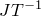 |
| HFL | 垂直于单元表面的热通量 | S | S | C | 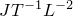 |
| CFILM | 薄膜属性 | S | S |  | 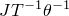 |
| FILM | 薄膜属性（仅 MpCCI） | S | S |  | 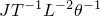 |
| TEMP | 作为节点自由度的温度 | P、S、V | C |  |  |
| LUMPEDHEATCAPACITANCE | 集中热容 | P、S、V | S、E | C | 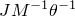 |
| 1 P（点）、S（表面区域）、V（体积区域） |
| 2 S（Abaqus/Standard）、E（Abaqus/Explicit）、C（Abaqus/CFD） |

以下程序支持使用热自由度进行协同仿真：- ["非耦合热传递分析，" 第 6.5.2 节"](pt03ch06s05at18.md)
- ["完全耦合热应力分析，" 第 6.5.3 节"](pt03ch06s05at19.md)
- ["不可压缩流体动力学分析，" 第 6.6.2 节"](pt03ch06s06aus48.md)
- ["耦合热电分析，" 第 6.7.3 节"](pt03ch06s07at22.md)

##### 节点温度

节点温度（场 ID NT）可以由 Abaqus/Standard 和 Abaqus/Explicit 导入和导出，由 Abaqus/CFD 导入（作为场 ID TEMP）。当导入到 Abaqus/Standard 和 Abaqus/CFD 时，温度值从上一个交换时间点的值斜坡到下一个目标时间点的值。

温度值可以在结构单元的顶面（SPOS）或底面（SNEG）上交换。温度不能在双面表面上交换。当在顶面和底面上交换温度时，定义两个不同的区域；一个在顶面交换温度，另一个在底面交换温度。对于体积区域，仅使用自由度 NT11，不应将其用于在由非热单元类型离散的体积上交换温度值。

节点温度值可以通过在 Abaqus/CAE 可视化模块中请求输出变量 NT 来查看 Abaqus/Standard 模拟的结果。

##### 热通量

在 Abaqus/Standard 和 Abaqus/Explicit 中，对进入节点的集中热通量使用集中热通量（场 ID CFL）。集中热通量可用于点、表面区域和体积区域。

热通量值可以在结构单元的顶面（SPOS）或底面（SNEG）上交换。热通量不能在双面表面上交换。当在顶面和底面上交换热通量时，定义两个不同的区域；一个在顶面交换热通量，另一个在底面交换热通量。

集中热通量值可以通过在 Abaqus/CAE 可视化模块中请求输出变量 CFL 来查看 Abaqus/Standard 模拟的结果。

对于进入表面的分布式热通量在 Abaqus/Standard 中使用表面热通量（场 ID HFL），或对于离开 Abaqus/CFD 中表面的分布式热通量使用。分布式热通量仅可用于表面区域。

##### 薄膜属性

使用表面薄膜属性（场 ID FILM）或集中（节点）薄膜属性（场 ID CFILM）来模拟由以下方程控制的平流：

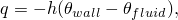

其中 *q* 是进入表面的热通量，*h* 是薄膜系数，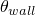 是壁面温度，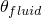 是流体或环境温度。薄膜系数由从计算流体动力学分析获得的热通量和流体温度以及从 Abaqus/Standard 分析在上一个交换间隔计算获得的壁面温度计算得出，根据：

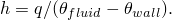

薄膜系数和流体温度都被传入 Abaqus/Standard，并在后续交换间隔内保持不变。当流体和壁面温度重合时，一个任意的小值被传入 Abaqus 作为热传递系数。为了在第一个交换间隔获得合理的薄膜属性，您应该确保在 Abaqus 中正确初始化壁面温度，并为初始流体温度提供良好的估计。

薄膜属性在 Abaqus/Standard 中仅可用于表面区域。

##### 热容

节点（集中）热容（场 ID LUMPEDHEATCAPACITANCE）可以从定义了热容的模型中由 Abaqus/CFD 导出。节点热容可以导入到 Abaqus/Standard 和 Abaqus/Explicit。

#### 涉及孔隙流体压力的程序

[表 17.2.1-3](pt04ch17s02aus98.md#acosimulationprep-poredof) 列出了可以为耦合孔隙流体扩散/应力分析交换的其他场、其相关的场标识符、支持的协同仿真接口区域类型，以及哪些 Abaqus 求解器支持场的导入和导出。

**表 17.2.1-3** 为耦合孔隙流体扩散/应力分析交换场。
| 场 ID | 场 | 接口类型1 | Abaqus 求解器2 | 单位 |
| --- | --- | --- | --- | --- |
| 导入 | 导出 |
| POR | 节点处的孔隙流体压力 | P、S、V | S | S |  |
| CFF | 节点处的集中流体流量 | P、S、V | S |  | 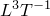 |
| RVF | 由于规定压力导致的流体体积流量反作用 | P、S、V |  | S |  |
| 1 P（点）、S（表面区域）、V（体积区域） |
| 2 S（Abaqus/Standard）、E（Abaqus/Explicit）、C（Abaqus/CFD） |

以下涉及孔隙流体压力的程序支持协同仿真：- ["耦合孔隙流体扩散和应力分析，" 第 6.8.1 节"](pt03ch06s08at26.md)

##### 孔隙压力

节点孔隙压力（场 ID POR）可以为点、表面区域和体积区域由 Abaqus/Standard 导入和导出。

节点孔隙压力值可以通过在 Abaqus/CAE 可视化模块中请求输出变量 POR 来查看 Abaqus/Standard 模拟的结果。

##### 集中流体流量

流体流量（场 ID CFF）定义节点处的渗流流量。集中流体流量可以为点、表面区域和体积区域由 Abaqus/Standard 导入。

集中流体流量值可以通过在 Abaqus/CAE 可视化模块中请求输出变量 CFF 来查看 Abaqus/Standard 模拟的结果。

##### 流体体积流量反作用

流体体积流量反作用（场 ID RVF）定义流体体积通过节点进入或离开模型以维持规定孔隙压力的速率。流体体积流量反作用可以为点、表面区域和体积区域由 Abaqus/Standard 导出。

#### 涉及电磁响应的程序

[表 17.2.1-4](pt04ch17s02aus98.md#acosimulationprep-emagdof) 列出了可以为电磁分析交换的其他场、其相关的场标识符、支持的协同仿真接口区域类型，以及哪些 Abaqus 求解器支持场的导入和导出。

**表 17.2.1-4** 为电磁分析交换场。
| 场 ID | 场 | 接口类型1 | Abaqus 求解器2 | 单位 |
| --- | --- | --- | --- | --- |
| 导入 | 导出 |
| EMJH | 电流流动产生的 Joule 热通量 | V |  | S | 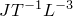 |
| EMBF | 电流流动产生的磁体力强度向量 | V |  | S | 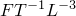 |
| 1 P（点）、S（表面区域）、V（体积区域） |
| 2 S（Abaqus/Standard）、E（Abaqus/Explicit）、C（Abaqus/CFD） |

以下涉及电磁的程序支持协同仿真：- ["涡流分析，" 第 6.7.5 节"](pt03ch06s07at24.md)

##### Joule 热通量

Joule 热通量（场 ID EMJH）可以为体积区域由 Abaqus/Standard 导出。它可以作为集中节点热通量（场 ID CFL）导入到下游热传递分析中。

Joule 热通量值可以通过在 Abaqus/CAE 可视化模块中请求输出变量 EMJH 来查看 Abaqus/Standard 模拟的结果。

##### 磁体力强度向量

磁体力强度向量（场 ID EMBF）可以为体积区域由 Abaqus/Standard 导出。它可以作为集中力（场 ID CF）导入到下游应力分析中。

磁体力强度向量值可以通过在 Abaqus/CAE 可视化模块中请求输出变量 EMBF 来查看 Abaqus/Standard 模拟的结果。

#### 温度和独立场变量

场变量是存在于模型空间域上的时间相关预定义场（参见 ["预定义场，" 第 34.6.1 节"](pt07ch34s06aus128.md)）。场变量与协同仿真技术结合，通过允许材料点依赖于由另一个应用程序定义的外部场来扩展多物理场的可能性。

场变量必须从一开始连续编号。场变量可以按以下方式定义：
- 直接输入数据，
- 读取 Abaqus 结果文件或输出数据库文件，
- 在 Abaqus/Standard 用户子程序中定义，和
- 通过协同仿真接口。

如果场变量通过多种方法定义，Abaqus 按上述顺序处理它们。当场变量与结构单元（如膜和壳）一起使用时，需要注意。在这种情况下，只有形成接口区域的顶面或底面接收一个值。

[表 17.2.1-5](pt04ch17s02aus98.md#acosimulationprep-fieldvar) 列出了可用于协同仿真交换的温度和独立场变量、其相关的场标识符、支持的协同仿真接口区域类型，以及哪些 Abaqus 求解器支持场的导入和导出。

**表 17.2.1-5** 交换温度和独立场变量。
| 场 ID | 场 | 接口类型1 | Abaqus 求解器2 | 单位 |
| --- | --- | --- | --- | --- |
| 导入 | 导出 |
| TEMP | 作为场变量的温度 | V | S |  |  |
| FV1 | 场变量 1 | V | S |  |  |
| FV2 | 场变量 2 | V | S |  |  |
| FV3 | 场变量 3 | V | S |  |  |
| 1 P（点）、S（表面区域）、V（体积区域） |
| 2 S（Abaqus/Standard）、E（Abaqus/Explicit）、C（Abaqus/CFD） |

以下 Abaqus/Standard 程序支持温度和独立场变量的导入：- ["静态应力分析，" 第 6.2.2 节"](pt03ch06s02at01.md)
- ["准静态分析，" 第 6.2.5 节"](pt03ch06s02at04.md)
- ["使用直接积分的隐式动态分析，" 第 6.3.2 节"](pt03ch06s03at07.md)
- ["完全耦合热应力分析，" 第 6.5.3 节"](pt03ch06s05at19.md)
- ["压电分析，" 第 6.7.2 节"](pt03ch06s07at21.md)
- ["涡流分析，" 第 6.7.5 节"](pt03ch06s07at24.md)
- ["耦合孔隙流体扩散和应力分析，" 第 6.8.1 节"](pt03ch06s08at26.md)

##### 温度

温度（场 ID TEMP）可以由 Abaqus/Standard 为允许材料属性定义为外部温度场函数的程序导入。导入时，温度值从上一个交换时间点的值斜坡到下一个目标时间点的值。使用场 ID NT 而不是场 ID TEMP 来为热程序（使用自由度 11、12 等的程序）导入温度值。

温度可以通过在 Abaqus/CAE 可视化模块中请求单元输出变量 TEMP 来查看 Abaqus/Standard 模拟的结果。

##### 独立场变量

独立场变量（场 ID FV1、FV2 和 FV3）可以由 Abaqus/Standard 导入，允许材料属性定义为外部场的函数。导入时，独立场变量值从上一个交换时间点的值斜坡到下一个目标时间点的值。

场变量可以通过在 Abaqus/CAE 可视化模块中请求输出变量 FV1、FV2 和/或 FV3 来查看 Abaqus/Standard 模拟的结果。

#### 其他场

[表 17.2.1-6](pt04ch17s02aus98.md#acosimulationprep-misc) 列出了可用于协同仿真交换的其他场、其相关的场标识符、支持的协同仿真接口区域类型，以及哪些 Abaqus 求解器支持场的导入和导出。

**表 17.2.1-6** 交换其他场。
| 场 ID | 场 | 接口类型1 | Abaqus 求解器2 | 单位 |
| --- | --- | --- | --- | --- |
| 导入 | 导出 |
| MASS 或 LUMPEDMASS | 质量 | P、S | S、E | S、E、C | *M* |
| RI | 转动惯量 | P、S | S | E | 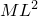 |
| 1 P（点）、S（表面区域）、V（体积区域） |
| 2 S（Abaqus/Standard）、E（Abaqus/Explicit）、C（Abaqus/CFD） |

##### 集中质量

节点处的集中质量值（场 ID MASS 或 LUMPEDMASS）可以由 Abaqus/Standard、Abaqus/Explicit 和 Abaqus/CFD 导出，可以由 Abaqus/Standard 和 Abaqus/Explicit 导入。

集中质量可用于点和表面区域。

##### 转动惯量

节点（集中）转动惯量（场 ID RI）可以由 Abaqus/Standard 导入，由 Abaqus/Explicit 为使用结构单元的模型导出，可用于点或表面区域。

### 定义耦合和会合方案

不同类型的分析具有不同的时间积分要求，这将影响或决定分析之间在协同仿真中进行交互的频率，以获得准确和稳健的求解。例如，考虑隐式和显式动态分析之间时间积分的差异。此外，Abaqus/Standard 可以自动调整增量大小，以获得瞬态问题的经济且准确的求解（参见 ["定义分析，" 第 6.1.2 节中的"增量"](pt03ch06s01abo05.md#usb-anl-aover-incrementation)）。例如，考虑对扩散过程建模的瞬态热传递分析；这里分析可能在求解梯度较高的开始阶段使用小时间增量，在接近稳态时使用大时间增量。

您用于控制这些协同仿真交换的参数取决于您使用的协同仿真接口。
- 您在协同仿真配置文件中定义协同仿真算法和相关交换参数。
- 对于使用 Abaqus/Standard 和 Abaqus/Explicit 的结构-结构协同仿真，您还必须在输入文件中提供协同仿真控制参数。

### 使用 SIMULIA Co-Simulation Engine 配置文件

SIMULIA Co-Simulation Engine 使用一个独立的软件组件，称为"主管"（director），该组件定义了协同仿真中分析程序之间交互的所有方面，并提供实现耦合和会合方案所需的必要指令。您通过协同仿真配置文件为主管提供与方案选择相关的参数。当您使用 Abaqus/CAE 执行协同仿真时，配置文件会自动为您创建。

配置文件必须采用可扩展标记语言（XML）格式，使用文件扩展名 `xml`。您可以通过预定义模板定义配置文件，也可以创建完全详细的配置文件。

#### 使用预定义配置模板

对于 ["Abaqus 求解器之间的协同仿真，" 第 17.3 节"](pt04ch17s03.md) 中描述的协同仿真分析用例，提供了定义常用耦合和会合方案的预定义模板。要使用其中一个预定义模板，您必须创建具有以下结构的配置文件。

```
<?xml version="1.0" encoding="utf-8"?>
*必需的 XML 声明行*
<CoupledMultiphysicsSimulation>
*必需的 XML 根元素；识别描述多物理场模拟的文件*
   <*template_name*>
      <*template_parameter_1*>*parameter_1_name*</*template_parameter_1*>
      <*template_parameter_2*>*parameter_2_name*</*template_parameter_2*>
      <*template_parameter_3*>*parameter_3_name*</*template_parameter_3*>
   </*template_name*>
   *模板元素的闭合*
</CoupledMultiphysicsSimulation>
*XML 根元素的闭合*
```

您输入模板名称和简短的参数设置列表，例如两个分析作业的名称和分析持续时间。预定义模板的详细信息在 ["结构-结构协同仿真，" 第 17.3.1 节"](pt04ch17s03aus99.md)；["流体-结构和共轭热传递协同仿真，" 第 17.3.2 节"](pt04ch17s03aus100.md)；和 ["电磁-结构和电磁-热协同仿真，" 第 17.3.3 节"](pt04ch17s03aus101.md) 中提供，以及如何获取每个模板的示例配置文件的信息，例如下面显示的流体-结构协同仿真示例。

```
<?xml version="1.0" encoding="utf-8"?>
<CoupledMultiphysicsSimulation>
   <template_std_cfd_fsi>
      <Standard_Job>*StandardJobName*</Standard_Job>
      <Cfd_Job>*CfdJobName*</Cfd_Job>
      <duration>*duration*</duration>
   </template_std_cfd_fsi>
</CoupledMultiphysicsSimulation>
```

#### 使用详细的配置文件

在运行时，SIMULIA Co-Simulation Engine 主管将您的参数设置应用到模板，创建详细的配置文件，然后将其用于协同仿真分析。详细配置文件被定义为提供所有配置细节的配置文件，无需引用模板。

在预定义模板不可用（如与内部或第三方代码耦合）或不足（例如，您想要在协同仿真接口区域交换更多变量或调整映射容差）的情况下，您必须创建详细的配置文件。有关使用详细配置文件的提示，请参阅 [www.3ds.com/support/knowledge-base](http://www.3ds.com/support/knowledge-base) 上的 Dassault Systèmes 知识库中的"SIMULIA Co-Simulation Engine 配置文件的高级用途"。有关详细配置文件的详细信息，请参阅 SIMULIA Co-Simulation Engine 应用程序接口（API）文档。

### 详细配置文件的耦合和会合方案

您在详细的配置文件中定义协同仿真耦合和会合方案。

#### 耦合方案

耦合方案定义了分析程序之间交换的序列，以及耦合模拟是否可以按串行、并行或隐式迭代方式运行。在决定耦合方案时，您应该考虑求解稳定性问题以及对计算资源利用的影响。

##### 并行显式耦合方案（Jacobi）

在并行显式耦合方案中，两个模拟同时执行，交换场以在下一个目标时间更新各自的解。并行耦合方案可能更有效地利用计算资源；但是，与顺序方案相比，它被认为不太稳定，仅应与使用小耦合步长的弱耦合物理模拟一起使用。协同仿真合作伙伴分析也必须指定 Jacobi 耦合算法。

##### 顺序显式耦合方案（Gauss-Seidel）

在顺序显式耦合方案中，模拟按顺序执行。一个分析领先，而另一个分析在协同仿真中滞后。协同仿真合作伙伴分析也必须指定 Gauss-Seidel 耦合算法。

顺序显式耦合方案仅应与使用小耦合步长的弱耦合物理模拟一起使用。

##### 迭代耦合方案

在迭代耦合方案中，模拟按顺序执行。一个分析领先，而另一个分析在协同仿真中滞后。执行多个交换，直到满足终止条件。

终止条件取决于协同仿真中的分析；有关 Abaqus 与第三方分析产品之间的协同仿真，请参阅相应的用户指南。

#### 耦合步长

耦合步是连续两次交换之间的时间段，因此定义了协同仿真中分析之间交换的频率。耦合步长在每个耦合步开始时确定，用于计算目标时间（下次同步交换发生的时间）。

Abaqus 中用于计算耦合步长的方法在以下章节中描述。有关协同仿真合作伙伴分析可用的方法，请参阅相应的第三方程序文档。

##### 恒定耦合步长

恒定用户定义耦合步长是定义耦合步长的最基本方法。两个分析根据以下条件在目标点交换数据：

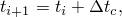

其中  是一个值，定义了整个耦合模拟中使用的耦合步长， 是目标时间， 是耦合步开始时的时间。

##### 最小耦合步长

此方法选择每个分析建议的耦合步长中的最小值。Abaqus 始终将其自动增量建议的下一个增量用作其建议的耦合步长。

##### 最大耦合步长

此方法选择每个分析建议的耦合步长中的最大值。Abaqus 始终将其自动增量建议的下一个增量用作其建议的耦合步长。

##### 导入耦合步长

Abaqus 可以导入协同仿真合作伙伴分析建议的耦合步长。

##### 导出耦合步长

Abaqus 可以将建议的耦合步长导出到协同仿真合作伙伴分析。

#### 时间增量方案

Abaqus 可能在每个耦合步中执行多个增量，或者您可以强制 Abaqus 在每个耦合步中使用单个增量。

通常，Abaqus 可能在耦合步期间执行几个增量（称为"子循环"）。在子循环期间，Abaqus/Standard 将载荷和边界条件（薄膜属性除外）从上一个耦合步结束时的值斜坡到目标时间的值，而在 Abaqus/Explicit 中，载荷在耦合步开始时施加，并在整个耦合步中保持不变。

子循环允许 Abaqus 使用自己的时间增量到达目标耦合时间；具体来说，它允许 Abaqus 在有需要减少增量大小的非线性事件时减少增量大小。

在某些情况下，您可以强制 Abaqus 使用由耦合步长决定的时间增量大小（即无子循环）。这允许两个求解器使用相同的时间增量并在耦合步期间避免量的插值。当以此"锁定步"方式继续时，Abaus 将无法减少时间增量来解析非线性事件，因此，在非线性事件需要减少增量大小的情况下，将终止模拟。

### 模型维数和坐标系

二维和三维 Abaqus 模型完全受支持。轴对称 Abaqus 模型仅支持 Abaqus/Standard 到 Abaqus/Explicit 协同仿真。对于不支持二维和轴对称模型的协同仿真，您可以将这些模型表示为具有适当边界条件施加的单位厚度（或楔形单元）三维切片。

向量量根据 Abaqus 约定定义；第一个分量表示沿 *x* 轴的量，第二个量表示沿 *y* 轴的量，第三个量表示沿  轴的量（对于三维模型）。对于 Abaqus 中的轴对称模型，旋转轴是关于 *y* 轴的。这些约定适用于导出的和导入的向量量。

所有导出的向量量都在 Abaqus 模型的全局坐标系中表示，忽略任何变换定义。同样，第三方程序必须以 Abaqus 模型全局坐标系的形式提供导入到 Abaqus 的向量量。

第三方分析程序可能使用不同的约定，有关更多建模细节和/或限制，请参阅相应的第三方程序文档。

### 单位系统

Abaqus 不要求以特定单位系统运行分析。通常，创建 Abaqus 模型使用的单位系统可能与第三方程序模型使用的单位系统不同。当两个单位系统不同时，在两个程序之间交换的场必须经过单位转换。有关更多建模细节，请参阅相应的第三方程序文档。

### 重启协同仿真

导入到 Abaqus/Standard、Abaqus/Explicit 或 Abaqus/CFD 的场不会保存到 Abaqus 重启数据库。因此，要重启协同仿真，耦合分析必须在重启分析开始时发送场。这些场必须与 Abaqus 分析计算的共轭场平衡，以维持平衡。您必须同步分析之间写入的重启信息，以确保模拟在相同的求解（步）时间重启。更多信息，请参见 ["重启分析，" 第 9.1.1 节中的"在协同仿真中同步写入的重启信息"](pt04ch09s01aus53.md#usb-anl-arestart-synch)。具体而言，Abaqus 重启的特定步/增量号的求解时间必须对应于耦合分析的求解。

### 限制

以下限制适用：
- Abaqus 模型中的步骤必须定义为使协同仿真完全位于单个 Abaqus 步骤内。此外，在一个 Abaqus 作业中只能有一个协同仿真。您可以使用重启功能对分析执行多个协同仿真（参见 ["重启分析，" 第 9.1.1 节"](pt04ch09s01aus53.md)）。
- 在梁、管和桁架单元上定义的协同仿真表面或体积，或在三维单元的边缘上定义的，不能用作接口区域。您应该使用离散点来传递载荷和边界条件。
- 在修正三角形单元或修正四面体单元上定义的协同仿真表面或体积不能用作接口区域。
- 二次耦合温度-位移单元不能用作使用耦合温度-位移程序的协同仿真中的接口区域。
- 执行协同仿真时，根据同步参数，可能无法在请求的时间满足指定时间的输出。

根据所使用的第三方分析程序，可能有进一步的限制。更多信息，请参阅相应的第三方程序文档。
