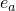
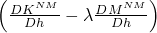
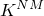
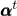
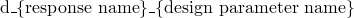

# 19.1.1 设计灵敏度分析


**产品：** Abaqus/Design  

##### **参考文献**

- ["参数化输入，" 第1.4.1节](pt01ch01s04aus04.md)
- ["参数化形状变化，" 第2.1.2节](pt01ch02s01aus06.md)
- [*STEP](../key/key-link.md#usb-kws-hstep)
- [*DESIGN PARAMETER](../key/key-link.md#usb-kws-mdesignparameter)
- [*DESIGN RESPONSE](../key/key-link.md#usb-kws-hdesignresponse)

### 概述

设计灵敏度分析（DSA）：
- 使用Abaqus/Design执行，这是Abaqus/Standard的附加选项；
- 提供响应相对于指定设计参数的灵敏度；
- 可用于仅包含应力/位移单元的模型的静态应力和频率分析；并且
- 可包括影响以下内容的设计参数：材料属性（弹性、超弹性和超泡沫模型）；截面属性；集中力和力矩；以及节点坐标（以及适用的梁和壳法线）。

### 设计灵敏度分析

设计灵敏度分析（DSA）功能提供某些输出变量相对于指定设计参数的导数。这些导数通常被称为"灵敏度"，因为它们提供输出变量对设计参数变化的敏感程度的一阶度量。计算灵敏度的输出变量被称为"设计响应"或简称为"响应"。设计参数从现有分析参数集中选择。例如，您可以选择获取应力相对于杨氏模量的导数；应力是响应，杨氏模量是设计参数。灵敏度基于与半解析计算技术结合使用的直接微分法计算。在半解析技术中，一些导数使用数值（有限）差分计算，因此需要设计参数的扰动。对于这些导数，默认情况下Abaqus/Design将使用中心差分方案，并根据启发式算法自动确定适当的扰动大小。您可以通过直接指定数值差分方法和扰动大小来覆盖这些默认值。DSA理论的完整讨论见["设计灵敏度分析，" Abaqus理论指南第2.18.1节](../stm/stm-link.md#stm-anl-dsa)。

### 激活DSA

您可以按步骤激活DSA。

| **输入文件用法：** | 使用以下选项在特定步骤中激活DSA： |
| --- | --- |
|  | ``` [*STEP](../key/key-link.md#usb-kws-hstep), DSA=YES ``` |

#### 在多个步骤中激活DSA

一旦在通用步骤中激活DSA，它将保持活动状态直到在后续通用步骤中停用它。一旦在扰动步骤中激活DSA，它将保持活动状态直到在后续连续扰动步骤中停用它。但是，如果在不支持DSA的步骤过程中激活DSA，DSA将被停用直到再次激活。

| **输入文件用法：** | 使用以下选项在特定步骤中停用DSA： |
| --- | --- |
|  | ``` [*STEP](../key/key-link.md#usb-kws-hstep), DSA=NO ``` |

### 指定设计参数

您可以定义多个参数来替代分析中的Abaqus输入量使用。您必须指明这些参数中的哪些将被视为设计参数。

| **输入文件用法：** | 使用以下选项定义分析参数： |
| --- | --- |
|  | ``` [*PARAMETER](../key/key-link.md#usb-kws-mparameter) *par1*=*x* *par2*=*y*  ``` 使用以下选项指定设计参数： ``` [*DESIGN PARAMETER](../key/key-link.md#usb-kws-mdesignparameter) *par1*, *par2*,  ``` |

#### 设计参数的约束

以下是设计参数的约束：
- 设计参数只能与浮点数据关联。以下分析组件可以包含依赖于设计的数据： - 分析过程中集成的梁截面（["使用分析过程中集成的梁截面定义截面行为，" 第29.3.6节](pt06ch29s03alm11.md)） - 集中载荷（["集中载荷，" 第34.4.2节](pt07ch34s04aus121.md)） - 弹性材料（["线弹性行为，" 第22.2.1节](pt05ch22s02abm02.md)） - 摩擦（["摩擦行为，" 第37.1.5节](pt09ch37s01aus169.md)） - 垫片截面（["垫片单元：概述，" 第32.6.1节](pt06ch32s06abo30.md)） - 超弹性材料（["橡胶类材料的超弹性行为，" 第22.5.1节](pt05ch22s05abm07.md)） - 超泡沫材料（["弹性泡沫中的超弹性行为，" 第22.5.2节](pt05ch22s05abm08.md)） - 膜截面（["膜单元，" 第29.1.1节](pt06ch29s01alm05.md)） - 局部方向（["方向，" 第2.2.5节](pt01ch02s02aus15.md)） - 分析过程中集成的壳截面（["使用分析过程中集成的壳截面定义截面行为，" 第29.6.5节](pt06ch29s06alm19.md)） - 实体截面（["实体（连续体）单元，" 第28.1.1节](pt06ch28s01alm01.md)） - 横切刚度（["选择梁单元，" 第29.3.3节](pt06ch29s03alm08.md)，或["壳截面行为，" 第29.6.4节](pt06ch29s06alm18.md)）
- 形状设计参数（即影响节点坐标和梁和/或壳法线的设计参数）只能与参数化形状变化结合使用（参见["参数化形状变化，" 第2.1.2节](pt01ch02s01aus06.md)）。
- 设计参数必须相互独立。
- 设计参数不能有表格依赖关系（参见["参数化输入，" 第1.4.1节](pt01ch01s04aus04.md)）。

### 指定响应

响应请求使用与向输出数据库指定输出请求类似的语法指定。除了特征值和固有频率外，没有默认响应——如果未请求响应，则不会输出响应灵敏度。如果DSA在频率步骤中处于活动状态，特征值和固有频率灵敏度将自动输出。指定响应将导致输出响应和响应灵敏度。

| **输入文件用法：** | 使用以下选项请求设计响应： |
| --- | --- |
|  | ``` [*DESIGN RESPONSE](../key/key-link.md#usb-kws-hdesignresponse), FREQUENCY=*interval*, MODE LIST [*CONTACT RESPONSE](../key/key-link.md#usb-kws-hcontactresponse), MASTER=*master name*, NSET=*nset name*, SLAVE=*slave name* [*ELEMENT RESPONSE](../key/key-link.md#usb-kws-helementresponse), ELSET=*elset name* [*NODE RESPONSE](../key/key-link.md#usb-kws-hnoderesponse), NSET=*nset name* ``` |

#### 在多个步骤中请求响应

除非重新指定，否则步骤中定义的响应请求根据以下规则传播到后续步骤：

1. 通用步骤中的请求传播到后续通用步骤。
2. 线性扰动步骤中的请求传播到后续连续线性扰动步骤。
3. 当非DSA步骤出现在DSA步骤之间时，响应必须在非DSA步骤之后的DSA步骤中重新指定。

#### 响应的约束

可用响应是现有输出变量的子集。以下描述了基于过程类型的有效响应。
- 对于静态步骤，有效响应为： - 节点响应：U和RF - 单元响应：S、SF、SINV、SP、E、SE、EP、EE、EEP、LE、LEP、NE、NEP、ENER、ELEN、EVOL和MASS - 接触响应：CSTRESS和CDISP
- 对于频率步骤，有效响应为： - 节点响应：无 - 单元响应：MASS - 接触响应：无 - 特征值（EIGVAL）和固有频率（EIGFREQ）灵敏度自动输出。

### 指定依赖于设计的数据的设计梯度

DSA计算需要依赖于设计的数据相对于设计参数的梯度。例如，如果泊松比，，依赖于设计参数，比如*h*，则需要梯度。相对于形状设计参数的设计梯度的指定方式不同于相对于其他设计参数的指定方式。

#### 指定相对于形状设计参数的设计梯度

相对于形状设计参数的梯度必须使用参数化形状变化定义来指定（参见["参数化形状变化，" 第2.1.2节](pt01ch02s01aus06.md)。出于DSA的目的，如果形状变化数据所指的参数是设计参数，则形状变化数据被解释为节点坐标相对于设计参数的梯度。如果为形状参数给定了非零值，Abaqus/Design也将扰动基础坐标。

| **输入文件用法：** | 使用以下选项为形状设计参数指定设计梯度： |
| --- | --- |
|  | ``` [*PARAMETER SHAPE VARIATION](../key/key-link.md#usb-kws-mparametershape), PARAMETER=*design parameter* ``` |

#### 为非形状设计参数指定梯度

对于非形状设计参数，默认情况下Abaqus/Design将使用数值微分根据您提供的信息计算设计梯度。但是，您可以通过使用Python表达式直接指定梯度来覆盖此默认行为（参见["参数化输入，" 第1.4.1节](pt01ch01s04aus04.md)）。您将设计参数指定为独立参数，以及依赖该设计参数的参数列表。对于每个设计梯度定义，只能给出一个独立（设计）参数。

| **输入文件用法：** | 使用以下选项为非形状设计参数指定设计梯度： |
| --- | --- |
|  | ``` [*DESIGN GRADIENT](../key/key-link.md#usb-kws-mdesigngradient), INDEPENDENT=*design parameter*, DEPENDENT=*(list of dependent parameters)* ``` |

### 多增量分析中的历史依赖性和公式类型

DSA实现了总量和增量两种公式。公式的选择取决于分析是否具有历史依赖性。以下是这些公式类型的简要描述。更详细的讨论见["设计灵敏度分析，" Abaqus理论指南第2.18.1节](../stm/stm-link.md#stm-anl-dsa)。默认情况下，使用增量DSA公式。您只能为整个模型指定DSA公式；如果将其作为步骤定义的一部分给出，则此规范将被忽略。

#### 增量DSA公式

在增量公式中，问题被假定为历史依赖的。Abaqus/Design求解增量位移灵敏度，并在增量结束时更新总位移灵敏度。由于历史依赖性，当前增量的增量位移灵敏度取决于增量开始时状态变量的灵敏度，与平衡分析的增量位移取决于增量开始时状态变量的方式相同。因此，Abaqus/Design还必须在每个增量中计算和更新状态变量灵敏度。因此，必须在直到最后一个DSA活动步骤的所有步骤中激活DSA，并且将在这些步骤的所有增量中完成DSA计算，无论是否为给定步骤请求了设计响应。如果为某个步骤请求了响应，则指定的响应频率将出于DSA计算目的而被忽略（输出写入的频率仍将由指定的响应频率控制）。

增量DSA公式的缺点是其成本，因为需要在最后一个DSA增量之前的每个增量中计算状态变量和增量位移灵敏度。如果问题是历史依赖的，则这种增加的成本是不可避免的；但如果问题是历史无关的，则是不必要的。因此，对于非历史依赖的问题，应选择总量DSA公式。

| **输入文件用法：** | ``` [*DSA CONTROLS](../key/key-link.md#usb-kws-mdsacontrols), FORMULATION=INCREMENTAL ``` |
| --- | --- |

#### 总量DSA公式

在总位移公式中，总位移灵敏度基于问题不是历史依赖的假设直接计算。换句话说，位移灵敏度不依赖于先前增量中计算的灵敏度结果。因此，总公式的优点是灵敏度计算只需在感兴趣的增量中完成。您可以通过仅对所需步骤激活DSA并为每个设计响应请求指定所需频率来控制何时进行DSA计算。

您可能选择在已知为历史依赖的问题中使用总量DSA公式。但是，在这种情况下，DSA解是近似的，并且近似程度随问题的历史依赖性增强而增加。为了评估使用总量DSA公式的有效性，建议对典型问题运行增量和总量灵敏度分析并比较结果。

| **输入文件用法：** | ``` [*DSA CONTROLS](../key/key-link.md#usb-kws-mdsacontrols), FORMULATION=TOTAL ``` |
| --- | --- |

### 线性扰动步骤中的DSA

可以在线性扰动步骤中计算扰动响应的灵敏度（参见["常规和线性扰动过程，" 第6.1.3节](pt03ch06s01aus44.md)）。如果考虑几何非线性，扰动响应将包括基础状态中应力和载荷刚化的影响。由于我们需要计算增量（扰动）响应的灵敏度，因此必须在基础步骤结束时知道应力和载荷刚化效果的灵敏度。因此，如果在基础步骤中考虑几何非线性，则无论公式类型（总量或增量）如何，DSA也必须在基础步骤中处于活动状态。

### 设计参数扰动大小的确定

半解析技术的基础是使用数值差分来获得某些单元向量和矩阵的导数（参见["设计灵敏度分析，" Abaqus理论指南第2.18.1节](../stm/stm-link.md#stm-anl-dsa)）。除非您直接指定，否则Abaqus/Design将自动确定用于半解析技术的适当扰动大小。Abaqus/Design使用基于与单元关联的标量*s*行为的启发式扰动大小算法确定扰动大小。默认情况下，扰动大小算法仅适用于DSA活动每个步骤的第一个增量（静态过程）或第一个模态（频率过程）。然后在DSA计算所在步骤的剩余增量或模态中重用扰动大小。

算法的目标是找到对数值差分最优的扰动大小。差分公式基于泰勒级数展开，要计算的导数的近似阶数反映在级数中被忽略的项中。近似导数的精度通常强烈依赖于差分公式中使用的扰动大小。选择太大的扰动大小会导致截断误差，当近似阶数不再有效时会发生这种误差（即由于截断泰勒级数中的高阶项）。太小的扰动大小将导致差分操作中的不准确，通常称为消除误差。

算法试图通过观察*s*的行为找到在消除误差和截断误差之间取得最佳折衷的扰动大小。对于每个设计参数，针对跨越多个数量级的扰动大小计算*s*。连续扰动大小之间*s*的误差计算为。产生可接受误差的扰动大小被选为最佳扰动大小。

该标量*s*的选择如下：
- 静态过程。对于静态步骤，*s*被选择为单元伪载荷的范数（单元残差相对于设计参数的偏导数）。
- 频率过程。对于频率步骤，*s*从涉及质量和刚度矩阵导数的矩阵的元素贡献计算得出（即，其中是刚度，是质量，*h*是设计参数，是特征值）。标量*s*被取为该矩阵到特征向量。

#### 控制数值差分行为

您可以控制数值差分操作的各个方面。这些方面在以下各节中有详细描述。您可以为整个模型和/或单个步骤指定DSA控制。为整个模型指定这些控制的效果是创建各种设置的新默认值。当您为单个步骤指定这些控制时，将强制执行以下传播规则：
- 一旦在非扰动步骤中指定DSA控制，它们将保持有效状态以用于所有后续非扰动步骤，除非重新指定或重置。
- 一旦在扰动步骤中指定DSA控制，它们将保持有效状态以用于所有后续连续扰动步骤，除非重新指定或重置。

#### 重置DSA控制

您只能为单个步骤重置DSA控制。如果为整个模型指定了DSA控制，则在特定步骤中重置它们会将数值差分行为重置为为整个模型指定的行为；否则，行为将重置为原始默认值。在行为重置后将应用任何指定的额外更改。

| **输入文件用法：** | 使用以下选项重置特定步骤的DSA控制： |
| --- | --- |
|  | ``` [*DSA CONTROLS](../key/key-link.md#usb-kws-mdsacontrols), RESET ``` |

#### 更改启发式扰动大小算法的默认值

以下两节描述了如何更改与扰动大小算法相关联的某些参数的默认值，以实现计算效率和准确性。

##### 更改默认容差

默认情况下，容差设置为1.0×10⁴。对于未达到此容差的单元，警告消息将写入消息文件。这些单元被收集在单元集合中，可以在Abaqus/CAE的可视化模块中查看。重要的是要理解，此容差控制着为获得最佳扰动大小而花费的努力；它不是数值微分精度的直接度量。

| **输入文件用法：** | 使用以下选项覆盖默认容差： |
| --- | --- |
|  | ``` [*DSA CONTROLS](../key/key-link.md#usb-kws-mdsacontrols), TOLERANCE=*tolerance* ``` |

##### 更改扰动大小算法使用的频率

使用启发式算法确定扰动大小在计算上非常密集。您可以指定重新计算扰动大小的频率。例如，指定大小频率*n*将导致Abaqus/Design每*n*个增量或特征模态确定新的扰动大小。扰动大小始终在DSA活动的每个步骤的第一个增量或特征模态重新计算，这等同于指定大小频率为0。由于扰动大小算法在计算上非常密集，因此应注意确保大小频率尽可能大（或为零）。

如上所述，扰动大小算法同时应用于与重特征值关联的所有模态。因此，基于大小频率"命中"的与重特征值关联的实际模态数无关紧要，只要至少为一个。

| **输入文件用法：** | 使用以下选项指定重新计算扰动大小的频率： |
| --- | --- |
|  | ``` [*DSA CONTROLS](../key/key-link.md#usb-kws-mdsacontrols), SIZING FREQUENCY=*frequency* ``` |

#### 覆盖默认的启发式扰动大小算法

如果已经知道特定设计参数的适当扰动大小（例如，从先前对类似问题的分析中），则可以直接应用此扰动大小而不是让Abaqus/Design自动找到扰动大小，从而获得经济性。您可以为每个设计参数直接指定前向差分或中心差分以及绝对扰动大小。如果您覆盖默认算法，则由您选择将导致准确灵敏度的扰动大小。

| **输入文件用法：** | 使用以下选项覆盖给定设计参数的默认启发式扰动大小算法： |
| --- | --- |
|  | ``` [*DSA CONTROLS](../key/key-link.md#usb-kws-mdsacontrols) *design parameter*, FD (forward differencing) or CD (central differencing), *absolute perturbation size* ``` 例如，要为设计参数`despar`指定绝对扰动大小0.001和前向差分，请使用以下输入： ``` [*DSA CONTROLS](../key/key-link.md#usb-kws-mdsacontrols) despar, FD, 0.001 ``` 此数据行针对每个要覆盖默认方案的设计参数指定。 |

### DSA解的准确性

可以从["设计灵敏度分析，" Abaqus理论指南第2.18.1节](../stm/stm-link.md#stm-anl-dsa)中看到，DSA解的准确性取决于数值计算导数的准确性，以及对于非线性静态分析，切线刚度矩阵的准确性。数值计算导数的准确性由半解析DSA算法控制；您可以通过指定DSA控制来控制它。在非线性静态分析中，DSA使用在最后一次平衡迭代中形成的切线刚度矩阵。实现精确平衡解所需的切线刚度矩阵的准确性可能不足以实现精确的DSA解。在这种情况下，您可以在平衡分析期间收紧收敛容差，以获得更准确的切线刚度矩阵（参见["常用控制参数，" 第7.2.2节](pt03ch07s02aus50.md)）。此外，当忽略切线刚度中的不对称项时，通常可以获得准确的平衡解（即，不使用不对称矩阵存储和求解方案；参见["定义分析，" 第6.1.2节](pt03ch06s01abo05.md)）。但是，即使忽略轻微不对称的刚度项，DSA解也可能不准确。因此，建议在对切线刚度矩阵已知为不对称的情况使用不对称求解方案进行DSA。

在某些情况下，某个时刻的响应可能相对于设计参数不连续。例如，在不连续点处，设计参数的变化可能导致节点进入接触、摩擦行为从粘附变为滑动，或材料点从弹性行为转变为非弹性行为。由于DSA计算利用数值差分，差分方案中使用的设计参数的扰动可能导致要差分的响应值位于不连续面的两侧。如果发生这种情况，则无法保证计算导数的准确性。从数学上讲，响应相对于设计参数的导数（灵敏度）在不连续点处不存在。实际上，在任何给定时刻，响应都不太可能恰好位于不连续面上。在响应接近不连续面的情况下，如果您选择使用默认扰动大小算法，该算法将尝试选择设计参数扰动大小，使扰动响应的值保持在不连续面的同一侧。此外，对于接触单元，DSA计算不在相关接触节点打开的增量中执行。通常，任何增量中的全局结果都不会受到模型中少数不连续点的影响。

### 设计依赖性和支持的功能

响应**显式**和**隐式**依赖于设计参数。隐式设计依赖是通过解变量对设计参数的依赖；因此，这种类型的依赖只能在获得DSA解后量化（回想一下，DSA解是总量公式的总位移灵敏度和增量公式的增量位移灵敏度）。所有其他设计依赖都是显式的，这意味着它们可以在不知道DSA解的情况下解析。可以通过查看响应（比如*r*）相对于设计参数（比如*h*）的灵敏度的形式来识别依赖类型。对于总量公式，此灵敏度表示为


对于增量公式表示为


其中是位移自由度，表示增量开始时的状态变量（参见["设计灵敏度分析，" Abaqus理论指南第2.18.1节](../stm/stm-link.md#stm-anl-dsa)，了解更多详情）。状态变量包括增量开始时的位移。在两种情况下，右边的最后一项都表示通过解变量的隐式设计依赖。

从上面的增量方程可以看出，显式设计依赖由两项组成。其中第一项

对于增量公式。这个示例是有效分析，因为弹性材料和桁架单元支持DSA。现在假设添加了一个框架单元，延长了结构的长度。如果框架单元使用相同的杨氏模量，分析变得无效，因为对设计参数*E*的依赖导致不支持的框架单元变得直接依赖于设计（即，需要计算项，则分析再次有效，因为框架不再直接依赖于设计参数*E*。

### 接触相互作用

在设计灵敏度分析中，支持可变形体与刚体表面之间具有小或有限滑动相对表面运动（包括摩擦）的基于表面的接触。在所有摩擦模型中，只有摩擦系数（无测试数据输入）可以依赖于设计。形状设计参数不适用于刚性表面。不支持可变形表面之间的接触。

### 重启设计灵敏度分析

可以重启设计灵敏度分析（参见["重启分析，" 第9.1.1节](pt04ch09s01aus53.md)）。但是，DSA必须在基础分析中处于活动状态，并且在重启运行中不能修改任何设计参数或梯度数据。重启的分析将遵循适用于常规分析的所有DSA传播规则。对于总量公式DSA，您可以选择在添加到重启运行的新步骤中激活或停用DSA。但是，对于增量公式DSA，必须在尝试重启的步骤中处于活动状态，您才能在重启的分析中继续进行DSA。

### 过程

DSA可用于以下分析过程：
- 频率分析
- 静态应力分析（包括几何非线性和接触）

以下分析过程和技术不支持：
- 使用Riks方法的静态应力分析
- 子结构
- 网格修改或替换
- 导入和传输结果
- 对称模型生成和结果传输
- 轮廓积分
- 频率过程中的循环对称

#### 子模型限制

设计灵敏度分析可以在全局模型和子模型中执行，但限制是DSA解不会从全局模型插值到子模型。这意味着，只有当插值到子模型边界上的全局解可以被视为独立于为子模型灵敏度分析选择的设计参数时，DSA在子模型中才有效。

### 材料选项

支持以下材料模型：
- 各向同性、正交和各向异性弹性
- 超弹性
- 超泡沫

在这些模型中，只有直接输入的材料系数（而非测试数据）可以依赖于设计。如果指定了测试数据，可以通过直接指定由Abaqus/Design计算的材料系数来替换该材料定义。支持和不支持的材料模型可以在同一分析中混合使用。

### 单元

支持实体、桁架、壳、梁、垫片和膜应力/位移单元。具有每节点五个自由度的壳单元不能用于总量DSA公式。支持和不支持的单元可以在同一分析中混合使用。

### 输出

响应和响应灵敏度（参见上文["指定响应](pt04ch19s01aus107.md#usb-anl-adsa-responses)"）仅输出到输出数据库（不支持灵敏度输出到数据文件和结果文件）。灵敏度的名称与响应的名称相关，如下所示：



例如，如果响应的名称是S，设计参数的名称是Young，则灵敏度的名称是d_S_Young。

### 输入文件模板

```
[*HEADING](../key/key-link.md#usb-kws-mheading)
…
[*PARAMETER](../key/key-link.md#usb-kws-mparameter)
*Python expressions defining parameters.*
[*DESIGN PARAMETER](../key/key-link.md#usb-kws-mdesignparameter)
*List of independent parameters to be considered as design parameters.*
…
[*NODE](../key/key-link.md#usb-kws-mnode), NSET=*nset*
*Data lines to define the nodes.*
[*PARAMETER SHAPE VARIATION](../key/key-link.md#usb-kws-mparametershape), PARAMETER=*parameter*
*Data lines to define the gradients of coordinates with respect to the parameter.*
…
[*ELEMENT](../key/key-link.md#usb-kws-melement), TYPE=*solid element type*, ELSET=*elset_elastic*
*Data lines to define the elements.*
[*ELEMENT](../key/key-link.md#usb-kws-melement), TYPE=*solid element type*, ELSET=*elset_hyper*
*Data lines to define the elements.*
[*SOLID SECTION](../key/key-link.md#usb-kws-msolidsection), ELSET=*elset_elastic*, MATERIAL=*elastic*
[*SOLID SECTION](../key/key-link.md#usb-kws-msolidsection), ELSET=*elset_hyper*, MATERIAL=*hyper*
[*MATERIAL](../key/key-link.md#usb-kws-mmaterial), NAME=*elastic*
[*ELASTIC](../key/key-link.md#usb-kws-melastic)
*Data lines to define the elastic properties.*
[*MATERIAL](../key/key-link.md#usb-kws-mmaterial), NAME=*hyper*
[*HYPERELASTIC](../key/key-link.md#usb-kws-mhyperelast)
*Data lines to define the hyperelastic properties.*
…
[*STEP](../key/key-link.md#usb-kws-hstep),DSA
[*STATIC](../key/key-link.md#usb-kws-hstatic)
…
[*DESIGN RESPONSE](../key/key-link.md#usb-kws-hdesignresponse), FREQUENCY=*interval*
[*ELEMENT RESPONSE](../key/key-link.md#usb-kws-helementresponse), ELSET=*elset*
*Data lines to specify the element response identifier keys.*
[*NODE RESPONSE](../key/key-link.md#usb-kws-hnoderesponse), NSET=*nset*
*Data lines to specify the nodal response identifier keys.*
[*END STEP](../key/key-link.md#usb-kws-hendstep)
```


