# 21.1.2 材料数据定义


**产品：** Abaqus/Standard  Abaqus/Explicit  Abaqus/CFD  Abaqus/CAE  

##### **参考文献**

- ["材料库：概述，" 第21.1.1节](pt05ch21s01abo18.md)
- ["组合材料行为，" 第21.1.3节](pt05ch21s01aus110.md)
- [*MATERIAL](../key/key-link.md#usb-kws-mmaterial)
- ["创建材料，" Abaqus/CAE用户指南第12.4.1节](../usi/usi-link.md#usi-prp-editor-material)

### 概述

Abaqus中的材料定义：
- 指定材料行为并提供所有相关属性数据；
- 可以包含多种材料行为；
- 被分配一个名称，用于引用由该材料制成的模型的那些部分；
- 可以具有温度和/或场变量依赖性；
- 在Abaqus/Standard中可以具有解变量依赖性；和
- 可以在局部坐标系中指定（["方向，" 第2.2.5节](pt01ch02s02aus15.md)），如果材料不是各向同性的则需要。

### 材料定义

在分析中可以定义任意数量的材料。每个材料定义可以根据需要包含任意数量的材料行为，以指定完整的材料行为。例如，在线性静态应力分析中可能只需要弹性材料行为，而在更复杂的分析中可能需要多种材料行为。

必须为每个材料定义分配一个名称。此名称允许从用于将该材料分配给模型区域的截面定义中引用该材料。

| **输入文件用法：** | ``` [*MATERIAL](../key/key-link.md#usb-kws-mmaterial), NAME=*name* ``` |
| --- | --- |
|  | 每个材料定义在由[*MATERIAL](../key/key-link.md#usb-kws-mmaterial)选项启动的数据块中指定。材料定义继续直到引入不定义材料行为的选项（例如另一个[*MATERIAL](../key/key-link.md#usb-kws-mmaterial)选项），此时材料定义被视为完整。材料行为选项的顺序不重要。数据块内的所有材料行为选项被视为定义相同的材料。 |

| **Abaqus/CAE用法：** | 属性模块：材料编辑器：**名称**使用**材料选项**列表下的菜单栏向材料添加行为。 |
| --- | --- |

### 大应变考虑

在为有限应变计算给出材料属性时，"应力"表示"真实"（Cauchy）应力（单位当前面积的力），"应变"表示对数应变。例如，除非另有说明，否则对于单轴行为

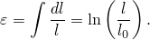

### 将材料数据指定为温度和独立场变量的函数

材料数据通常指定为温度等独立变量的函数。材料属性通过在几个不同的温度下指定使其具有温度依赖性。

在某些情况下，材料属性可以定义为Abaqus计算的变量的函数；例如，要定义加工硬化曲线，应力必须作为等效塑性应变的函数给出。

材料属性也可以依赖于"场变量"（用户定义的变量，可以表示任何独立量，并在节点处定义为时间的函数）。例如，材料模量可以是复合材料中的织物密度或合金中相分数的函数。详见["指定场变量依赖性"](pt05ch21s01aus109.md#usb-mat-cmaterialdata-fvdepen)。场变量的初始值作为初始条件给出（参见["Abaqus/Standard和Abaqus/Explicit中的初始条件，" 第34.2.1节](pt07ch34s02aus116.md)），并且可以在分析期间作为时间的函数进行修改（参见["预定义场，" 第34.6.1节](pt07ch34s06aus128.md)）。如果材料属性由于辐射或某些其他预计算的环境影响而随时间变化，则此功能很有用。

使用Abaqus/Standard中的分布定义的任何材料行为（质量密度、线性弹性行为和/或热膨胀）不能定义为具有温度和/或场依赖性。但是，使用分布定义的材料行为可以与其他具有温度和/或场依赖性的材料行为一起包含在材料定义中。参见["密度，" 第21.2.1节](pt05ch21s02abm01.md)；["线性弹性行为，" 第22.2.1节](pt05ch22s02abm02.md)；和["热膨胀，" 第26.1.2节](pt05ch26s01abm52.md)。

#### 材料数据的插值

在常数属性的最简单情况下，只输入常数值。当材料数据仅是一个变量的函数时，数据必须按独立变量递增顺序给出。然后Abaqus线性插值这些值之间的值。属性被假定为在给定的独立变量范围外恒定（对于织物材料除外，它使用最后指定数据点的斜率在指定范围外线性外推）。因此，您可以根据材料模型的需要给出尽可能多或尽可能少的输入值。如果材料数据相对于独立变量以强烈非线性方式依赖，您必须指定足够的数据点，以便线性插值能够准确捕捉非线性行为。

当材料属性依赖于多个变量时，必须在其他变量固定值下给出属性相对于第一个变量的变化，按第二个变量的递增顺序，然后是第三个变量，依此类推。数据必须始终按独立变量递增顺序给出。此过程确保材料属性在属性所依赖的任何独立变量值下被完整且唯一地定义。详见["输入语法规则，" 第1.2.1节](pt01ch01s02aus01.md)，了解进一步说明和示例。

##### 示例：温度依赖性线性各向同性弹性

[图21.1.2-1](pt05ch21s01aus109.md#cmaterialdata-exa)显示了一个简单的各向同性线性弹性材料，给出了杨氏模量和泊松比作为温度的函数。

**图21.1.2-1** 材料定义示例。


在这种情况下，使用六组值来指定材料描述，如下表所示：

| 弹性模量 | 泊松比 | 温度 |
| --- | --- | --- |
|  |  |  |
|  |  |  |
|  | 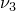 |  |
|  | 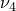 |  |
| 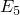 |  | 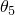 |
|  |  |  |

对于在和定义的范围之外的温度，Abaqus假定*E*和为常数值。图中的虚线表示将用于此模型的直线近似。在此示例中，只给出了一个热膨胀系数的值，，并且它不随温度变化。

##### 示例：弹塑性材料

[图21.1.2-2](pt05ch21s01aus109.md#cmaterialdata-2var-exa)显示了一个弹塑性材料，其屈服应力依赖于等效塑性应变和温度。

**图21.1.2-2** 具有两个独立变量的材料定义示例。


在这种情况下，第二个独立变量（温度）必须保持恒定，而屈服应力被描述为第一个独立变量（等效塑性应变）的函数。然后，选择较高的温度值，并在此温度下给出相对于等效塑性应变的依赖性。如以下表所示，此过程根据需要重复多次，以所需的细节程度描述属性变化：

| 屈服应力 | 等效塑性应变 | 温度 |
| --- | --- | --- |
|  |  |  |
|  |  |  |
| 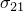 |  |  |
| 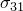 |  |  |
| 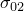 | 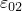 |  |
|  |  |  |
|  |  |  |
| 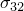 | 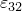 |  |

#### 指定场变量依赖性

您可以为许多材料行为指定用户定义的场变量依赖数量（参见["预定义场，" 第34.6.1节](pt07ch34s06aus128.md)）。如果您不为可以指定场依赖性的材料行为指定场变量依赖数量，则假定材料数据不依赖于场变量。

| **输入文件用法：** | ``` **MATERIAL BEHAVIOR OPTION*, DEPENDENCIES=*n* ``` |
| --- | --- |
|  | **MATERIAL BEHAVIOR OPTION* refers to any material behavior option for which field dependence can be specified. Each data line can hold up to eight data items. If more field variable dependencies are required than fit on a single data line, more data lines can be added. For example, a linear, isotropic elastic material can be defined as a function of temperature and seven field variables (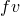) as follows: ``` [*ELASTIC](../key/key-link.md#usb-kws-melastic), TYPE=ISOTROPIC, DEPENDENCIES=7 *E*, , , , , , ,  ,  ``` This pair of data lines would be repeated as often as necessary to define the material as a function of the temperature and field variables. |

| **Abaqus/CAE用法：** | 属性模块：材料编辑器：*材料行为*：**场变量数量：** *n* |
| --- | --- |
|  | *材料行为* refers to any material behavior for which field dependence can be specified. |

### 将材料数据指定为解相关变量的函数

在Abaqus中，您可以通过用户子程序引入对解变量的依赖性。用户子程序[`USDFLD`](../sub/sub-link.md#sub-xsl-usdfld)（Abaqus/Standard）和[`VUSDFLD`](../sub/sub-link.md#sub-xsl-vusdfld)（Abaqus/Explicit）允许您在材料点将场变量定义为时间、材料方向和任何可用材料点量的函数：对于[`USDFLD`](../sub/sub-link.md#sub-xsl-usdfld)的情况，列出在["Abaqus/Standard输出变量标识符，" 第4.2.1节](pt02ch04s02abv01.md)中，对于[`VUSDFLD`](../sub/sub-link.md#sub-xsl-vusdfld)的情况，列出在["在Abaqus/Explicit分析中获取材料点信息，" Abaqus用户子程序参考指南第2.1.7节](../sub/sub-link.md#sub-utl-uvgetvrm-keys)中的["可用输出变量键"](..sub/sub-link.md#sub-utl-uvgetvrm-keys)中。因此，定义为这些场变量函数的材料属性可以依赖于解。

用户子程序[`USDFLD`](../sub/sub-link.md#sub-xsl-usdfld)和[`VUSDFLD`](../sub/sub-link.md#sub-xsl-vusdfld)在每个材料点被调用，材料定义包含对该用户子程序的引用。

对于通用分析步骤，用户子程序[`USDFLD`](../sub/sub-link.md#sub-xsl-usdfld)和[`VUSDFLD`](../sub/sub-link.md#sub-xsl-vusdfld)中提供的变量值对应于增量开始的值。因此，以这种方式引入的解依赖性是显式的：给定增量的材料属性不受增量期间获得的结果的影响。因此，结果的准确性通常取决于时间增量大小。在Abaqus/Explicit中，这通常不是问题，因为稳定时间增量通常足够小以确保良好的准确性。在Abaqus/Standard中，您可以从子程序`USDFLD`内部控制时间增量。对于线性扰动步骤，基础状态中的解变量可用。（参见["通用和线性扰动过程，" 第6.1.3节](pt03ch06s01aus44.md)，了解通用和线性扰动步骤的讨论。）

| **输入文件用法：** | ``` [*USER DEFINED FIELD](../key/key-link.md#usb-kws-muserdefinedfield) ``` |
| --- | --- |

| **Abaqus/CAE用法：** | 用户子程序[`USDFLD`](../sub/sub-link.md#sub-xsl-usdfld)和[`VUSDFLD`](../sub/sub-link.md#sub-xsl-vusdfld)在Abaqus/CAE中不受支持。 |
| --- | --- |

### 在Abaqus/Explicit中定义材料点的特征单元长度

特征单元长度用于Abaqus对表现出应变软化的模型进行正则化，或传递给在材料点被调用的用户子程序。默认情况下，Abaqus使用基于几何平均的定义计算特征单元长度。

一阶单元的默认值是穿过单元的线的典型长度，二阶单元的默认值是相同典型长度的一半。对于桁架，默认值是沿单元轴线的特征长度。对于膜和壳，默认值是参考表面中的特征长度。对于轴对称单元，默认值仅是r-z平面中的特征长度。

在Abaqus/Explicit中，您可以根据用户子程序[`VUCHARLENGTH`](../sub/sub-link.md#sub-xsl-vucharlength)中的单元拓扑和几何重新定义特征单元长度的值。

| **输入文件用法：** | 使用以下选项进行基于几何平均的特征单元长度定义（默认）： |
| --- | --- |
|  | ``` [*CHARACTERISTIC LENGTH](../key/key-link.md#usb-kws-mcharacteristiclength), DEFINITION=GEOMETRIC MEAN ``` 使用以下选项在用户子程序[`VUCHARLENGTH`](../sub/sub-link.md#sub-xsl-vucharlength)中指定特征单元长度： ``` [*CHARACTERISTIC LENGTH](../key/key-link.md#usb-kws-mcharacteristiclength), DEFINITION=USER, COMPONENT=*n*, PROPERTIES=*n* ``` |

| **Abaqus/CAE用法：** | 用户子程序[`VUCHARLENGTH`](../sub/sub-link.md#sub-xsl-vucharlength)在Abaqus/CAE中不受支持。 |
| --- | --- |

### 在Abaqus/Explicit和Abaqus/CFD中对用户定义数据进行正则化

将材料数据插值为独立变量的函数需要在分析期间进行材料数据值的表查找。表查找在Abaqus/Explicit和Abaqus/CFD中频繁发生，如果插值来自独立变量的规则间隔，则最为经济。例如，[图21.1.2-1](pt05ch21s01aus109.md#cmaterialdata-exa)中显示的数据不规则，因为相邻数据点之间温度（独立变量）的间隔不同。您不需要指定规则的材料数据。Abaqus/Explicit和Abaqus/CFD将自动正则化用户定义的数据。例如，[图21.1.2-1](pt05ch21s01aus109.md#cmaterialdata-exa)中的温度值可以定义为10、20、25、28、30和35°C。在这种情况下，Abaqus/Explicit和Abaqus/CFD可以通过在1°C的25个增量上定义数据来正则化数据，您的分段线性数据将被精确重现。此正则化需要将数据从6个温度点的值扩展到26个温度点的值。此示例是一个简单正则化可以精确重现数据的案例。

如果存在多个独立变量，规则数据的概念还要求在指定其他独立变量时，每个独立变量的最小值和最大值（范围）恒定。[图21.1.2-2](pt05ch21s01aus109.md#cmaterialdata-2var-exa)中的材料定义说明了一个材料数据不规则的案例，因为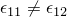、和。Abaqus/Explicit也将正则化涉及多个独立变量的数据，尽管提供的数据必须满足["输入语法规则，" 第1.2.1节](pt01ch01s02aus01.md)中指定的规则。

#### 正则化用户定义数据时使用的误差容差

将输入数据正则化以分段线性方式精确重现并不总是可取的。假设屈服应力在Abaqus/Explicit中定义为塑性应变的函数，如下所示：

| 屈服应力 | 塑性应变 |
| --- | --- |
| 50000 | .0 |
| 75000 | .001 |
| 80000 | .003 |
| 85000 | .010 |
| 86000 | 1.0 |

可以精确正则化数据但不太经济，因为它需要将数据细分为1000个规则间隔。如果定义的最小间隔与独立变量的范围相比很小，则正则化更加困难。

Abaqus/Explicit和Abaqus/CFD使用误差容差来正则化输入数据。每个独立变量范围内间隔的数量被选择为分段线性规则化数据与您定义的每个点之间的误差小于因变量范围的容差乘积。在某些情况下，间隔数量变得过多，Abaqus/Explicit或Abaqus/CFD无法使用合理数量的间隔来正则化数据。考虑的合理间隔数量取决于您定义的间隔数量。如果您定义了50个或更少的间隔，Abaqus/Explicit和Abaqus/CFD用于正则化的最大间隔数等于用户定义间隔数的100倍。如果您定义了超过50个间隔，用于正则化的最大间隔数等于5000加上超过50的用户定义间隔数的10倍。如果间隔数量变得过多，程序将在数据检查阶段停止并发出错误消息。您可以重新定义材料数据或更改容差值。默认容差为0.03。

上述示例中的屈服应力数据是可能发出此类错误消息的典型情况。在这种情况下，您可以简单地删除最后一个数据点，因为它对最终屈服值只产生很小的差异。

| **输入文件用法：** | ``` [*MATERIAL](../key/key-link.md#usb-kws-mmaterial), RTOL=*tolerance* ``` |
| --- | --- |

| **Abaqus/CAE用法：** | 属性模块：材料编辑器：****常规****正则化****：**Rtol：** *容差* |
| --- | --- |

#### 在Abaqus/Explicit中应变率依赖数据的正则化

由于数据的应变率依赖性通常以对数间隔测量，Abaqus/Explicit默认使用对数间隔而不是均匀间隔来正则化应变率数据。这通常会更好地匹配典型的应变率依赖曲线。您可以指定线性应变率正则化，以使用均匀间隔进行应变率数据的正则化。线性应变率正则化的使用仅影响应变率作为独立变量的正则化，并且仅在以下行为之一用于定义材料数据时相关：
- 低密度泡沫（["低密度泡沫，" 第22.9.1节](pt05ch22s09abm16.md)）
- 率相关金属塑性（["经典金属塑性，" 第23.2.1节](pt05ch23s02abm17.md)）
- 由屈服应力比定义的率相关黏塑性（["率相关屈服，" 第23.2.3节](pt05ch23s02abm19.md)）
- 使用直接表格数据定义的剪切失效（["动态失效模型，" 第23.2.8节](pt05ch23s02abm24.md)）
- 率相关Drucker-Prager硬化（["扩展Drucker-Prager模型，" 第23.3.1节](pt05ch23s03abm30.md)）
- 率相关混凝土损伤塑性（["混凝土损伤塑性，" 第23.6.3节](pt05ch23s06abm39.md)）
- 率相关损伤起始准则（["韧性金属的损伤起始，" 第24.2.2节](pt05ch24s02abm42.md)）

| **输入文件用法：** | 使用以下选项指定对数正则化（默认）： |
| --- | --- |
|  | ``` [*MATERIAL](../key/key-link.md#usb-kws-mmaterial), STRAIN RATE REGULARIZATION=LOGARITHMIC ``` 使用以下选项指定线性正则化： ``` [*MATERIAL](../key/key-link.md#usb-kws-mmaterial), STRAIN RATE REGULARIZATION=LINEAR ``` |

| **Abaqus/CAE用法：** | 属性模块：材料编辑器：****常规****正则化****：**应变率正则化**：**对数**或**线性** |
| --- | --- |

### 在Abaqus/Explicit中评估应变率依赖数据

率敏感材料本构行为可能在显式动态分析中引入非物理高频振荡。为了克服此问题，Abaqus/Explicit计算用于评估应变率依赖数据的等效塑性应变率，如下所示：

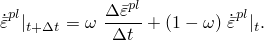

其中是时间增量期间等效塑性应变的增量变化，和分别是增量开始和结束时的应变率。因子（）便于过滤与应变率依赖材料行为相关的高频振荡。您可以直接指定应变率因子的值，。默认值为0.9。值为不提供所需的过滤效果，应避免使用。

| **输入文件用法：** | ``` [*MATERIAL](../key/key-link.md#usb-kws-mmaterial), SRATE FACTOR= ``` |
| --- | --- |

| **Abaqus/CAE用法：** | 您不能在Abaqus/CAE中指定应变率因子的值。 |
| --- | --- |


