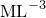

# 21.2.1 密度


**产品：** Abaqus/Standard  Abaqus/Explicit  Abaqus/CFD  Abaqus/CAE  

##### **参考文献**

- ["材料库：概述，" 第21.1.1节](pt05ch21s01abo18.md)
- [*DENSITY](../key/key-link.md#usb-kws-mdensity)
- ["指定材料质量密度，" Abaqus/CAE用户指南第12.8.1节](../usi/usi-link.md#usi-prp-general-density)

### 概述

材料的质量密度：
- 在Abaqus/Standard中必须在特征频率和瞬态动力学分析、瞬态热传递分析、绝热应力分析和声学分析中定义；
- 在Abaqus/Standard中必须在重力、离心和旋转加速度载荷下定义；
- 在Abaqus/Explicit中必须为除静水压流体外的所有材料定义；
- 在Abaqus/CFD中必须为所有流体定义；
- 可以指定为温度和预定义变量的函数；
- 可以使用非结构质量定义从非结构特征（如汽车钢板面板上的油漆）分布到底层单元；和
- 可以在Abaqus/Standard中为实体连续单元使用分布定义。

### 定义密度

密度可以定义为温度和场变量的函数。但是，对于Abaqus/Standard中除声学、热传递、耦合温度-位移和耦合热-电单元外的所有单元，密度是温度和场变量初始值的函数，仅随体积变化。如果温度和场变量在分析期间发生变化，它将不会被更新。对于Abaqus/Explicit，例外情况仅包括声学单元。对于Abaqus/CFD，密度对于不可压缩流动被视为常数。

对于Abaqus/Standard中的声学、热传递、耦合温度-位移和耦合热-电单元以及Abaqus/Explicit中的声学单元，密度将持续更新到与当前温度和场变量对应的值。

在Abaqus/Standard分析中，可以使用分布（["分布定义，" 第2.8.1节](pt01ch02s08aus26.md)）为均匀实体连续单元定义空间变化的质量密度。分布必须包括密度的默认值。如果使用分布，则不能定义密度对温度和/或场变量的依赖性。

| **输入文件用法：** | 使用以下任一选项： |
| --- | --- |
|  | ``` [*DENSITY](../key/key-link.md#usb-kws-mdensity) [*DENSITY](../key/key-link.md#usb-kws-mdensity), DEPENDENCIES=*n* ``` |

| **Abaqus/CAE用法：** | 属性模块：材料编辑器：****常规****密度**** |
| --- | --- |
|  | 您可以切换**使用温度依赖数据**以将密度定义为温度的函数，和/或选择**场变量数量**以将密度定义为场变量的函数。 |

### 单位

由于Abaqus没有内置维度，您必须确保以一致的单位给出密度。一致单位的使用，特别是密度的使用，在["约定，" 第1.2.2节](pt01ch01s02aus02.md)中讨论。如果使用美国或英国单位，您必须特别小心，确保使用的密度单位为，其中质量以为单位定义。

### 单元

本节描述的密度行为用于为所有单元指定质量密度，刚性单元除外。刚性单元的质量密度在刚性体定义中指定（参见["刚性单元，" 第30.3.1节](pt06ch30s03alm23.md)）。

在Abaqus/Explicit中，必须为不属于刚体的所有单元定义非零质量密度。

在Abaqus/Standard中，必须为热传递单元和声学单元定义密度；可以为应力/位移单元、耦合温度-位移单元和包含孔隙压力的单元定义质量密度。对于包含孔隙压力作为自由度的单元，应在耦合孔隙流体流/应力分析中为多孔介质给出干材料的密度。

如果您有复杂的声学介质密度，您应该在此处输入其实部，并将虚部转换为体积拖曳，如["声学介质，" 第26.3.1节](pt05ch26s03abm58.md)中所讨论。

可以从结构刚度可忽略的特征将质量贡献添加到模型中，方法是将质量涂抹在通常与非结构特征相邻的单元集上。非结构质量可以以总质量值、每单位体积质量、每单位面积质量或每单位长度质量的形式指定（参见["非结构质量定义，" 第2.7.1节](pt01ch02s07aus25.md)）。非结构质量定义为指定单元集贡献额外质量，不改变底层材料密度。


