# 22.2.1 线性弹性行为


**产品：** Abaqus/Standard  Abaqus/Explicit  Abaqus/CAE  

##### **参考文献**

- ["材料库：概述，" 第21.1.1节](pt05ch21s01abo18.md)
- ["弹性行为：概述，" 第22.1.1节](pt05ch22s01abo19.md)
- [*ELASTIC](../key/key-link.md#usb-kws-melastic)
- ["在线弹性材料模型"在"定义弹性，" Abaqus/CAE用户指南第12.9.1节](../usi/usi-link.md#usi-prp-mechanical-elastic-elastic)

### 概述

线性弹性材料模型：
- 适用于小弹性应变（通常小于5%）；
- 可以是各向同性、正交各向异性或完全各向异性的；
- 可以具有依赖于温度和/或其他场变量的属性；和
- 可以在Abaqus/Standard中为实体连续单元使用分布定义。

### 定义线性弹性材料行为

总应力由总弹性应变定义为

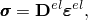

其中是总应力（有限应变问题中的"真实"或Cauchy应力），是四阶弹性张量，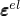是总弹性应变（有限应变问题中的对数应变）。当弹性应变可能变大时，不应使用线性弹性材料定义；应改用超弹性模型。即使在有限应变问题中，弹性应变仍应很小（小于5%）。

#### 为黏弹性材料定义线性弹性响应

黏弹性材料（["时域黏弹性，" 第22.7.1节](pt05ch22s07abm12.md)）的弹性响应可以通过定义材料的瞬时响应或长期响应来指定。要定义瞬时响应，必须在比材料特征松弛时间短得多的时间范围内进行确定弹性常数的实验。

| **输入文件用法：** | ``` [*ELASTIC](../key/key-link.md#usb-kws-melastic), MODULI=INSTANTANEOUS ``` |
| --- | --- |

| **Abaqus/CAE用法：** | 属性模块：材料编辑器：****机械****弹性****弹性****：**黏弹性模量时间尺度（用于黏弹性）**：**瞬时** |
| --- | --- |

另一方面，如果使用长期弹性响应，则必须在比黏弹性材料特征松弛时间长得多的时间范围内收集实验数据。长期弹性响应是默认的弹性材料行为。

| **输入文件用法：** | ``` [*ELASTIC](../key/key-link.md#usb-kws-melastic), MODULI=LONG TERM ``` |
| --- | --- |

| **Abaqus/CAE用法：** | 属性模块：材料编辑器：****机械****弹性****弹性****：**黏弹性模量时间尺度（用于黏弹性）**：**长期** |
| --- | --- |

### 线性弹性的方向依赖性

根据弹性属性的对称平面数量，材料可分为各向同性（通过每一点有无限多个对称平面）或各向异性（没有对称平面）。有些材料在通过每一点时只有有限数量的对称平面；例如，正交各向异性材料有两个正交对称平面。弹性张量的独立分量数量取决于此类对称属性。您可以定义各向异性级别和定义弹性属性的方法，如下所述。如果材料是各向异性的，必须使用局部方向（["方向，" 第2.2.5节](pt01ch02s02aus15.md)）来定义各向异性方向。

### 线性弹性材料的稳定性

线性弹性材料必须满足材料或Drucker稳定性条件（参见["类橡胶材料的超弹性行为，" 第22.5.1节](pt05ch22s05abm07.md)中关于材料稳定性的讨论）。稳定性要求张量是正定的，这导致对弹性常数值的某些限制。以下给出了几种不同材料对称类的应力-应变关系。还给出了由稳定性准则引起的弹性常数的适当限制。

### 定义各向同性弹性

线性弹性的最简单形式是各向同性情况，应力-应变关系为


弹性属性完全通过给出杨氏模量*E*和泊松比。如有必要，这些参数可以定义为温度和其他预定义场变量的函数。

在Abaqus/Standard中，可以通过使用分布（["分布定义，" 第2.8.1节](pt01ch02s08aus26.md)）为均匀实体连续单元定义空间变化的各向同性弹性行为。分布必须包括*E*和, TYPE=ISOTROPIC ``` |
| --- | --- |

| **Abaqus/CAE用法：** | 属性模块：材料编辑器：****机械****弹性****弹性****：**类型**：**各向同性** |
| --- | --- |

#### 稳定性

稳定性准则要求、和。泊松比值接近0.5会导致近乎不可压缩的行为。除平面应力情况（包括膜和壳）或梁和桁架外，此类值需要在Abaqus/Standard中使用"混合"单元，并在Abaqus/Explicit中产生高频噪声并导致过小的稳定时间增量。

在Abaqus/Standard中，建议对泊松比大于0.495的线性弹性材料（即, NONHYBRID INCOMPRESSIBLE=WARNING ``` |

### 通过指定工程常数定义正交各向异性弹性

正交各向异性材料中的线性弹性最容易通过给出"工程常数"来定义：三个模量、、；泊松比、、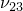；以及与材料主方向相关的剪切模量、和。这些模量根据以下公式定义弹性柔量

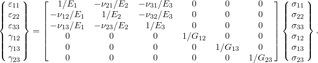

量具有物理意义，即当材料在*i*方向受压时，表征*j*方向横向应变的泊松比。通常，不等于：它们通过=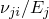关联。如有必要，工程常数也可以定义为温度和其他预定义场变量的函数。

在Abaqus/Standard中，可以通过使用分布（["分布定义，" 第2.8.1节](pt01ch02s08aus26.md)）为均匀实体连续单元定义空间变化的正交各向异性弹性行为。分布必须包括弹性模量和泊松比的默认值。如果使用分布，则不能定义弹性常数对温度和/或场变量的依赖性。

| **输入文件用法：** | ``` [*ELASTIC](../key/key-link.md#usb-kws-melastic), TYPE=ENGINEERING CONSTANTS ``` |
| --- | --- |

| **Abaqus/CAE用法：** | 属性模块：材料编辑器：****机械****弹性****弹性****：**类型**：**工程常数** |
| --- | --- |

#### 稳定性

材料稳定性要求

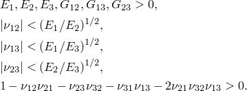

当不等式左边接近零时，材料表现出不可压缩行为。使用关系=，上述集合中的第二、第三和第四个限制也可以表示为

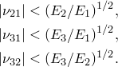

### 定义横向各向同性弹性

正交各向异性的一个特殊子类是横向各向同性，其特征在于材料中每一点都有一个各向同性平面。假设1-2平面是每一点的各向同性平面，横向各向同性要求==、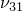=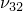=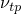、==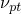和==，其中*p*和*t*分别代表"平面内"和"横向"。因此，当具有物理意义，表征由垂直于它的应力引起的各向同性平面中的应变时，表征由各向同性平面中的应力引起的垂直于各向同性平面的横向应变。通常，量和不相等，通过=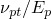关联。应力-应变定律简化为


其中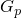=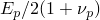，独立常数的总数仅为五个。

在Abaqus/Standard中，可以通过使用分布（["分布定义，" 第2.8.1节](pt01ch02s08aus26.md)）为均匀实体连续单元定义空间变化的横向各向同性弹性行为。分布必须包括弹性模量和泊松比的默认值。如果使用分布，则不能定义弹性常数对温度和/或场变量的依赖性。

| **输入文件用法：** | ``` [*ELASTIC](../key/key-link.md#usb-kws-melastic), TYPE=ENGINEERING CONSTANTS ``` |
| --- | --- |

| **Abaqus/CAE用法：** | 属性模块：材料编辑器：****机械****弹性****弹性****：**类型**：**工程常数** |
| --- | --- |

#### 稳定性

在横向各向同性情况下，正交各向异性弹性的稳定性关系简化为


### 在平面应力中定义正交各向异性弹性

在平面应力条件下（如壳单元），只需要、、、、和的值来定义正交各向异性材料。（在Abaqus的所有平面应力单元中，平面是平面应力面，因此平面应力条件为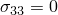。）包括剪切模量和，因为它们可能需要用于壳中的横向剪切建模。泊松比隐式给定为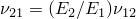。在这种情况下，应力和应变的面内分量的应力-应变关系为


在Abaqus/Standard中，可以通过使用分布（["分布定义，" 第2.8.1节](pt01ch02s08aus26.md)）为均匀实体连续单元定义空间变化的平面应力正交各向异性弹性行为。分布必须包括弹性模量和泊松比的默认值。如果使用分布，则不能定义弹性常数对温度和/或场变量的依赖性。

| **输入文件用法：** | ``` [*ELASTIC](../key/key-link.md#usb-kws-melastic), TYPE=LAMINA ``` |
| --- | --- |

| **Abaqus/CAE用法：** | 属性模块：材料编辑器：****机械****弹性****弹性****：**类型**：**层压板** |
| --- | --- |

#### 稳定性

平面应力的材料稳定性要求

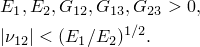

### 通过指定弹性刚度矩阵中的项定义正交各向异性弹性

正交各向异性材料中的线性弹性也可以通过给出九个独立弹性刚度参数来定义，如有必要，作为温度和其他预定义场变量的函数。在这种情况下，应力-应变关系为


对于正交各向异性材料，工程常数将

其中


当直接给出材料刚度参数（，以根据需要减少材料的刚度矩阵。

在Abaqus/Standard中，可以通过使用分布（["分布定义，" 第2.8.1节](pt01ch02s08aus26.md)）为均匀实体连续单元定义空间变化的正交各向异性弹性行为。分布必须包括弹性模量的默认值。如果使用分布，则不能定义弹性常数对温度和/或场变量的依赖性。

| **输入文件用法：** | ``` [*ELASTIC](../key/key-link.md#usb-kws-melastic), TYPE=ORTHOTROPIC ``` |
| --- | --- |

| **Abaqus/CAE用法：** | 属性模块：材料编辑器：****机械****弹性****弹性****：**类型**：**正交各向异性** |
| --- | --- |

#### 稳定性

由材料稳定性引起的弹性常数限制为

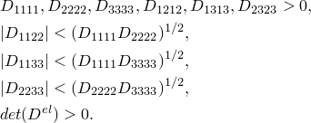

最后一个关系导致


这些关于弹性刚度参数的限制等价于关于"工程常数"的限制。当不等式左边接近零时，导致不可压缩行为。

### 定义完全各向异性弹性

对于完全各向异性弹性，需要21个独立弹性刚度参数。应力-应变关系如下：


当直接给出材料刚度参数（，以根据需要减少材料的刚度矩阵。

在Abaqus/Standard中，可以通过使用分布（["分布定义，" 第2.8.1节](pt01ch02s08aus26.md)）为均匀实体连续单元定义空间变化的各向异性弹性行为。分布必须包括弹性模量的默认值。如果使用分布，则不能定义弹性常数对温度和/或场变量的依赖性。

| **输入文件用法：** | ``` [*ELASTIC](../key/key-link.md#usb-kws-melastic), TYPE=ANISOTROPIC ``` |
| --- | --- |

| **Abaqus/CAE用法：** | 属性模块：材料编辑器：****机械****弹性****弹性****：**类型**：**各向异性** |
| --- | --- |

#### 稳定性

稳定性要求对弹性常数施加的限制太复杂，无法用简单方程表示。但是，要求是正定的需要弹性矩阵的所有特征值为正。

### 为翘曲单元定义正交各向异性弹性

对于用翘曲单元建模的实体截面的二维网格Timoshenko梁单元模型（参见["网格化梁截面，" 第10.6.1节](pt04ch10s06at35.md)），Abaqus提供了可以具有两个不同剪切模量的线性弹性材料定义，一个在用户指定材料方向。在用户指定方向上，应力-应变关系如下：


使用局部方向定义全局方向与用户指定材料方向之间的角度表示梁的轴向应力，和表示两个剪切应力。

| **输入文件用法：** | ``` [*ELASTIC](../key/key-link.md#usb-kws-melastic), TYPE=TRACTION ``` |
| --- | --- |

| **Abaqus/CAE用法：** | 属性模块：材料编辑器：****机械****弹性****弹性****：**类型**：**牵引** |
| --- | --- |

#### 稳定性

稳定性准则要求、和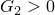。

### 为黏性单元定义以牵引力和分离表示的弹性

对于用于建模粘结界面的黏性单元（参见["使用牵引-分离描述定义黏性单元的本构响应，" 第32.5.6节](pt06ch32s05alm45.md)），Abaqus提供了可以直接用名义牵引力和名义应变表示的弹性定义。支持非耦合和耦合行为。对于非耦合行为，每个牵引力分量仅取决于其共轭名义应变，而对于耦合行为，响应更通用（如下所示）。在局部单元方向上，非耦合行为的应力-应变关系如下：

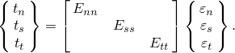

量、和分别表示法向和两个局部剪切方向上的名义牵引力；而量、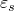和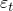表示相应的名义应变。对于耦合牵引分离行为，应力-应变关系如下：

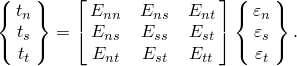

| **输入文件用法：** | 使用以下选项为黏性单元定义非耦合弹性行为： |
| --- | --- |
|  | ``` [*ELASTIC](../key/key-link.md#usb-kws-melastic), TYPE=TRACTION ``` 使用以下选项为黏性单元定义耦合弹性行为： ``` [*ELASTIC](../key/key-link.md#usb-kws-melastic), TYPE=COUPLED TRACTION ``` |

| **Abaqus/CAE用法：** | 使用以下选项为黏性单元定义非耦合弹性行为： |
| --- | --- |
|  | 属性模块：材料编辑器：****机械****弹性****弹性****：**类型**：**牵引** 使用以下选项为黏性单元定义耦合弹性行为：属性模块：材料编辑器：****机械****弹性****弹性****：**类型**：**耦合牵引** |

#### 稳定性

非耦合行为的稳定性准则要求、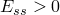和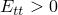。对于耦合行为，稳定性准则要求：

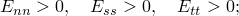

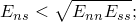


### 在Abaqus/Explicit中为状态方程定义各向同性剪切弹性

Abaqus/Explicit允许您定义各向同性剪切弹性来描述体积响应由状态方程（["状态方程中的弹性剪切行为"，第25.2.1节](pt05ch25s02abm50.md#usb-mat-ceos-deviatoricelastic)控制的材料的偏量响应。在这种情况下，偏量应力-应变关系为


其中是偏量应力，是偏量弹性应变。当定义弹性偏量行为时，必须提供弹性剪切模量, TYPE=SHEAR ``` |
| --- | --- |

| **Abaqus/CAE用法：** | 属性模块：材料编辑器：****机械****弹性****弹性****：**类型**：**剪切** |
| --- | --- |

### 单元

线性弹性可用于Abaqus中的任何应力/位移单元或耦合温度-位移单元。例外情况是：牵引弹性只能与翘曲单元和黏性单元一起使用；耦合牵引弹性只能与黏性单元一起使用；剪切弹性只能与实体（连续体）单元一起使用，不包括平面应力单元；而且，在Abaqus/Explicit中，不支持桁架、钢筋、管道和梁单元的各向异性弹性。

如果材料是（几乎）不可压缩的（对于各向同性弹性为泊松比），应在Abaqus/Standard中使用混合单元。不应将可压缩各向异性弹性与二阶混合连续单元一起使用：可能会出现不准确的结果和/或收敛问题。


