# 22.2.3 平面应力正交各向异性失效度量


**产品：** Abaqus/Standard  Abaqus/Explicit  Abaqus/CAE

##### **参考文献**

- ["材料库：概述，" 第21.1.1节](pt05ch21s01abo18.md)
- ["弹性行为：概述，" 第22.1.1节](pt05ch22s01abo19.md)
- ["线性弹性行为，" 第22.2.1节](pt05ch22s02abm02.md)
- [*FAIL STRAIN](../key/key-link.md#usb-kws-mefailstrain)
- [*FAIL STRESS](../key/key-link.md#usb-kws-mefailstress)
- [*ELASTIC](../key/key-link.md#usb-kws-melastic)
- ["为弹性模型定义基于应力的失效度量"在"定义弹性，" Abaqus/CAE用户指南第12.9.1节](../usi/usi-link.md#usi-prp-mechanical-elastic-elastic-stressfailure)
- ["为弹性模型定义基于应变的失效度量"在"定义弹性，" Abaqus/CAE用户指南第12.9.1节](../usi/usi-link.md#usi-prp-mechanical-elastic-elastic-strainfailure)

### 概述

正交各向异性平面应力失效度量：
- 是材料失效的指示（通常用于纤维增强复合材料；关于纤维增强复合材料的替代损伤和失效模型，参见["纤维增强复合材料的损伤和失效：概述，" 第24.3.1节](pt05ch24s03abm44.md)）；
- 只能与线性弹性材料模型结合使用（无论是否具有局部材料方向）；
- 可用于任何使用平面应力公式的单元；即平面应力连续单元、壳单元和膜单元；
- 是后处理输出请求，不会导致任何材料退化；和
- 取值大于或等于0.0，值大于或等于1.0意味着失效。

### 失效理论

提供了五种不同的失效理论：四种基于应力的理论和一种基于应变的理论。

我们用1和2表示正交各向异性材料方向，其中1-材料方向与纤维对齐，2-材料方向横向于纤维。为了使失效理论正确工作，用户定义的弹性材料常数的1和2方向必须分别与纤维和横向纤维方向对齐。对于纤维增强复合材料以外的应用，1和2-材料方向应分别表示强和弱正交各向异性材料方向。

在所有情况下，拉伸值必须为正，压缩值必须为负。

### 基于应力的失效理论

基于应力的失效理论的输入数据是1方向上的拉伸和压缩应力极限和；2方向上的拉伸和压缩应力极限和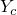；以及*X*–*Y*平面中的剪切强度（最大剪切应力）*S*。

所有四种基于应力的理论都在Abaqus中通过单一定义进行定义和使用；所需的输出通过本节末尾描述的输出变量来选择。

| **输入文件用法：** | ``` [*FAIL STRESS](../key/key-link.md#usb-kws-mefailstress) ``` |
| --- | --- |

| **Abaqus/CAE用法：** | 属性模块：材料编辑器：****机械****弹性****弹性****：**子选项****Fail Stress**** |
| --- | --- |

#### 最大应力理论

如果，则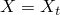；否则，。如果，则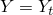；否则，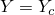。最大应力失效准则要求


#### Tsai-Hill理论

如果，则；否则，。如果，则；否则，。Tsai-Hill失效准则要求

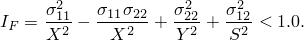

#### Tsai-Wu理论

Tsai-Wu失效准则要求

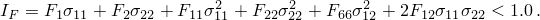

Tsai-Wu系数定义如下：


是失效时的等双轴应力。如果已知，则


否则，

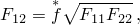

其中。的默认值为零。对于Tsai-Wu失效准则，必须将或之一作为输入数据给出。如果给出了，则系数将被忽略。

#### Azzi-Tsai-Hill理论

Azzi-Tsai-Hill失效理论与Tsai-Hill理论相同，只是取了交叉乘积项的绝对值：


这两种失效准则之间的差异仅在和具有相反符号时出现。

### 基于应力的失效度量——失效包络

为了说明四种基于应力的失效度量，图22.2.3-1、图22.2.3-2和图22.2.3-3显示了每个失效包络（即）在（–）应力空间中与给定平面内剪切应力值的Tsai-Hill包络的比较。在每种情况下，Tsai-Hill曲面是由以原点为中心的椭圆组成的分段连续曲面。图22.2.3-1中的平行四边形定义了最大应力曲面。在图22.2.3-2中，Tsai-Wu曲面呈现为椭圆。在图22.2.3-3中，Azzi-Tsai-Hill曲面与Tsai-Hill曲面的差异仅在第二和第四象限，此时它是外部边界曲面（即离原点更远）。由于所有失效理论都通过单轴应力下的拉伸和压缩失效进行校准，因此它们在应力轴上给出相同的值。

**图22.2.3-1** Tsai-Hill与最大应力失效包络（）。


**图22.2.3-2** Tsai-Hill与Tsai-Wu失效包络（，）。


**图22.2.3-3** Tsai-Hill与Azzi-Tsai-Hill失效包络（）。

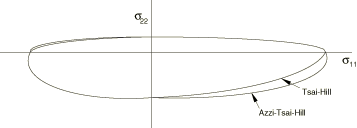

### 基于应变的失效理论

基于应变的理论的输入数据是1方向上的拉伸和压缩应变极限和；2方向上的拉伸和压缩应变极限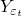和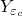；以及*X*–*Y*平面中的剪切应变极限。

| **输入文件用法：** | ``` [*FAIL STRAIN](../key/key-link.md#usb-kws-mefailstrain) ``` |
| --- | --- |

| **Abaqus/CAE用法：** | 属性模块：材料编辑器：****机械****弹性****弹性****：**子选项****Fail Strain**** |
| --- | --- |

#### 最大应变理论

如果，则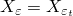；否则，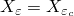。如果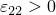，则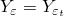；否则，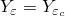。最大应变失效准则要求

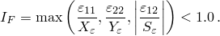

### 单元

平面应力正交各向异性失效度量可用于Abaqus中的任何平面应力、壳或膜单元。

### 输出

如果材料描述中定义了失效度量，Abaqus提供失效指数*R*的输出。失效指数的定义和不同的输出变量在下面描述。

#### 输出失效指数

每种基于应力的失效理论都在三维空间中定义了一个围绕原点的失效曲面。当应力状态处于该曲面之上或之外时，就会发生失效。失效指数*R*用于测量到失效曲面的接近程度。*R*定义为比例因子，使得对于给定的应力状态,


即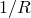是我们需要同时乘以所有应力分量以使其位于失效曲面之上的比例因子。值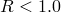表示应力状态在失效曲面内，而值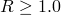表示失效。对于最大应力理论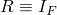。

失效指数*R*对于最大应变失效理论定义类似。*R*是比例因子，使得对于给定的应变状态,


对于最大应变理论。

#### 输出变量

输出变量CFAILURE将提供所有基于应力和应变的失效理论的输出（参见["Abaqus/Standard输出变量标识符，" 第4.2.1节](pt02ch04s02abv01.md)和["Abaqus/Explicit输出变量标识符，" 第4.2.2节](pt02ch04s02xbv01.md)）。在Abaqus/Standard中，还可以为单个应力理论请求历史输出，输出变量为MSTRS、TSAIH、TSAIW和AZZIT，以及为应变理论请求输出变量MSTRN。

基于应力和应变的失效理论的输出变量总是在单元的材料点处计算。在Abaqus/Standard中，可以请求在材料点以外的位置进行单元输出（参见["输出到数据和结果文件，" 第4.1.2节](pt02ch04s01aus39.md)）；在这种情况下，输出变量首先在材料点处计算，然后插值到单元质心或外推到节点。


