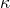
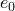
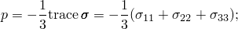
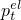
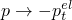
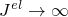
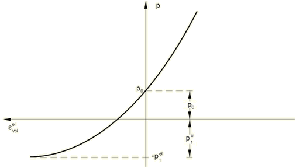
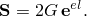

# 22.3.1 多孔材料的弹性行为


**产品：** Abaqus/Standard  Abaqus/CAE

##### **参考文献**

- ["材料库：概述，" 第21.1.1节](pt05ch21s01abo18.md)
- ["弹性行为：概述，" 第22.1.1节](pt05ch22s01abo19.md)
- [*POROUS ELASTIC](../key/key-link.md#usb-kws-mporouselastic)
- [*INITIAL CONDITIONS](../key/key-link.md#usb-kws-minitialcond)
- ["创建多孔弹性材料模型"在"定义弹性，" Abaqus/CAE用户指南第12.9.1节](../usi/usi-link.md#usi-prp-mechanical-elastic-porouselastic)

### 概述

多孔弹性材料模型：
- 适用于小弹性应变（通常小于5%）；
- 是一种非线性各向同性弹性模型，其中压力应力随体积应变成指数函数变化；
- 允许零或非零弹性拉伸应力极限；和
- 可以具有依赖于温度和其他场变量的属性。

### 定义体积行为

通常，多孔材料的体积行为的弹性部分可以通过假设材料体积变化的弹性部分与压力应力的对数成正比来准确建模（图22.3.1-1）：


其中是"对数体积模量"；是初始孔隙比；*p*是等效压力应力，定义为



是等效压力应力的初始值；是当前构型和参考构型之间体积比的弹性部分；且是材料的"弹性拉伸强度"（在意义上，当时）。

**图22.3.1-1** 多孔弹性体积行为。



| **输入文件用法：** | 使用以下所有三个选项来定义多孔弹性材料： |
| --- | --- |
|  | ``` [*POROUS ELASTIC](../key/key-link.md#usb-kws-mporouselastic), SHEAR=G or POISSON 用于定义  和  [*INITIAL CONDITIONS](../key/key-link.md#usb-kws-minitialcond), TYPE=STRESS 用于定义  [*INITIAL CONDITIONS](../key/key-link.md#usb-kws-minitialcond), TYPE=RATIO 用于定义  ``` |

| **Abaqus/CAE用法：** | 使用以下所有三个选项来定义多孔弹性材料： |
| --- | --- |
|  | 属性模块：材料编辑器：****机械****弹性****多孔弹性**** 载荷模块：**创建预定义场**：**步骤：初始**：为**类别**选择**机械**，为**所选步骤的类型**选择**应力** 载荷模块：**创建预定义场**：**步骤：初始**：为**类别**选择**其他**，为**所选步骤的类型**选择**孔隙比** |

### 定义剪切行为

多孔材料的偏量弹性行为可以通过两种方式定义。

#### 通过定义剪切模量

给出剪切模量*G*。偏量应力与总弹性应变的偏量部分的关系为



在这种情况下，剪切行为不受材料压实的影响。

| **输入文件用法：** | ``` [*POROUS ELASTIC](../key/key-link.md#usb-kws-mporouselastic), SHEAR=G ``` |
| --- | --- |

| **Abaqus/CAE用法：** | 属性模块：材料编辑器：****机械****弹性****多孔弹性****：**剪切**：**G** |
| --- | --- |

#### 通过定义泊松比

定义泊松比。瞬时剪切模量随后根据瞬时体积模量和泊松比定义为


其中是弹性体积变化的对数度量。在这种情况下


因此，弹性剪切刚度随材料压实而增加。该方程被积分以给出总应力-总弹性应变关系。

| **输入文件用法：** | ``` [*POROUS ELASTIC](../key/key-link.md#usb-kws-mporouselastic), SHEAR=POISSON ``` |
| --- | --- |

| **Abaqus/CAE用法：** | 属性模块：材料编辑器：****机械****弹性****多孔弹性****：**剪切**：**泊松** |
| --- | --- |

### 材料选项

多孔弹性模型可以单独使用，也可以与以下结合使用：
- ["扩展Drucker-Prager模型，" 第23.3.1节](pt05ch23s03abm30.md)；
- ["改进的Drucker-Prager/帽盖模型，" 第23.3.2节](pt05ch23s03abm31.md)；
- ["临界状态（黏土）塑性模型，" 第23.3.4节](pt05ch23s03abm33.md)；或
- 各向同性膨胀以引入热体积变化（["热膨胀，" 第26.1.2节](pt05ch26s01abm52.md)）。

不能将多孔弹性与率相关塑性或黏弹性结合使用。

多孔弹性不能与多孔金属塑性模型一起使用（["多孔金属塑性，" 第23.2.9节](pt05ch23s02abm25.md)）。

有关更多详细信息，请参见["组合材料行为，" 第21.1.3节](pt05ch21s01aus110.md)。

### 单元

多孔弹性不能与混合单元或平面应力单元（包括壳和膜）一起使用，但可以与Abaqus/Standard中的任何其他纯应力/位移单元一起使用。

如果与具有总刚度沙漏控制的减缩积分单元一起使用，如果通过泊松比定义剪切行为，Abaqus/Standard无法计算单元沙漏刚度的默认值。因此，您必须指定沙漏刚度。有关详细信息，请参见["截面控制，" 第27.1.4节](pt06ch27s01aus113.md)。

如果孔隙流体压力很重要（如在不排水土壤中），可以使用包含孔隙压力的应力/位移单元。


