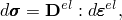
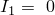

# 22.4.1 次弹性行为


**产品：** Abaqus/Standard  Abaqus/CAE

##### **参考文献**

- ["材料库：概述，" 第21.1.1节](pt05ch21s01abo18.md)
- ["弹性行为：概述，" 第22.1.1节](pt05ch22s01abo19.md)
- [*HYPOELASTIC](../key/key-link.md#usb-kws-mhypoelastic)
- ["创建次弹性材料模型"在"定义弹性，" Abaqus/CAE用户指南第12.9.1节](../usi/usi-link.md#usi-prp-mechanical-elastic-hypoelastic)

### 概述

次弹性材料模型：
- 适用于小弹性应变——应力不应大于材料的弹性模量；
- 用于单调加载路径的情况；和
- 如果要包含温度依赖性，必须通过用户子程序[`UHYPEL`](../sub/sub-link.md#sub-xsl-uhypel)定义。

### 定义次弹性材料行为

在次弹性材料中，应力变化率定义为切线模量矩阵乘以弹性应变变化率：



其中是应力变化率（有限应变问题中的"真实"或Cauchy应力），是切线弹性矩阵，是弹性应变变化率（有限应变问题中的对数应变）。

### 确定次弹性材料参数

中的条目通过给出杨氏模量*E*和泊松比、、和直接定义杨氏模量和泊松比的变化。

| **输入文件用法：** | ``` [*HYPOELASTIC](../key/key-link.md#usb-kws-mhypoelastic) ``` |
| --- | --- |

| **Abaqus/CAE用法：** | 属性模块：材料编辑器：****机械****弹性****次弹性**** |
| --- | --- |

#### 用户子程序

如果将*E*和定义次弹性材料。

| **输入文件用法：** | ``` [*HYPOELASTIC](../key/key-link.md#usb-kws-mhypoelastic), USER ``` |
| --- | --- |

| **Abaqus/CAE用法：** | 属性模块：材料编辑器：****机械****弹性****次弹性****：**使用用户子程序UHYPEL** |
| --- | --- |

### 平面或单轴应力

对于平面应力和单轴应力状态，Abaqus/Standard不计算面外应变分量。为了定义上述不变量，假设；即，假设材料是不可压缩的。例如，在单轴应力情况下（如桁架单元），此假设意味着


### 大位移分析

对于大位移分析，Abaqus中的应变度量是变形率积分。如果主方向相对于材料不旋转，则此应变度量对应于对数应变。应以此方式解释应变不变量定义。

### 材料选项

次弹性材料模型只能在材料定义中单独使用。它不能与黏弹性或任何非弹性响应模型结合使用。有关更多详细信息，请参见["组合材料行为，" 第21.1.3节](pt05ch21s01aus110.md)。

### 单元

次弹性材料模型可用于Abaqus/Standard中的任何应力/位移单元。


