# 22.5.3 各向异性超弹性行为


**产品：** Abaqus/Standard  Abaqus/Explicit  Abaqus/CAE

##### **参考文献**

- ["材料库：概述，" 第21.1.1节](pt05ch21s01abo18.md)
- ["弹性行为：概述，" 第22.1.1节](pt05ch22s01abo19.md)
- ["Mullins效应，" 第22.6.1节](pt05ch22s06abm10.md)
- [*ANISOTROPIC HYPERELASTIC](../key/key-link.md#usb-kws-manisohyperelast)
- [*VISCOELASTIC](../key/key-link.md#usb-kws-mviscoelast)
- [*MULLINS EFFECT](../key/key-link.md#usb-kws-mmullinseffect)
- ["创建各向异性超弹性材料模型"在"定义弹性，" Abaqus/CAE用户指南第12.9.1节](../usi/usi-link.md#usi-prp-mechanical-elastic-hyperelastic-aniso)

### 概述

各向异性超弹性材料模型：
- 为建模表现出高度各向异性和非线性弹性行为的材料（如生物医学软组织、纤维增强弹性体等）提供了通用能力；
- 可与大应变时域黏弹性结合使用（["时域黏弹性，" 第22.7.1节](pt05ch22s07abm12.md)）；但是，黏弹性是各向同性的；
- 可选择允许指定能量耗散和应力软化效应（见["Mullins效应，" 第22.6.1节](pt05ch22s06abm10.md)）；和
- 由于适用于有限应变应用，要求在分析步骤中考虑几何非线性（["通用和线性扰动过程，" 第6.1.3节](pt03ch06s01aus44.md)）。

### 各向异性超弹性公式

许多工业和技术上有趣的材料由于其微观结构中存在优选方向而表现出各向异性弹性行为。这类材料的例子包括常见工程材料（如纤维增强复合材料、增强橡胶、木材等）以及软生物组织（动脉壁、心脏组织等）。当这些材料承受小变形（小于2-5%）时，其力学行为通常可以用常规各向异性线性弹性充分建模（见["定义完全各向异性弹性"在"线性弹性行为，" 第22.2.1节](pt05ch22s02abm02.md#usb-mat-clinearelastic-anisotropic)）。然而，在大变形下，由于微观结构中的重排（如纤维方向随变形的重定向），这些材料表现出高度各向异性和非线性弹性行为。这些非线性大应变效应的模拟需要基于各向异性超弹性框架的更先进本构模型。超弹性材料用"应变能势"来描述，，它定义了单位参考体积（初始配置中的体积）中材料储存的应变能，作为该点材料变形的函数。用于表示各向异性超弹性材料应变能势的两种不同公式：基于应变的和基于不变量的。

#### 基于应变的公式

在这种情况下，应变能函数直接用合适应变张量的分量表示，如Green应变张量（见["应变度量，" Abaqus理论指南第1.4.2节](../stm/stm-link.md#stm-int-strainmeas)）：

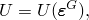

其中是Green应变；是右Cauchy-Green应变张量；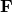是变形梯度；且是单位矩阵。在不丧失一般性的情况下，应变能函数可以写成形式

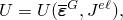

其中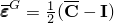是修正Green应变张量；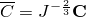是右Cauchy-Green应变的畸变部分；是总体积变化；且是弹性体积比，定义如下（见["热膨胀"]；(pt05ch22s05abm09.md#usb-mat-canisohyperelastic-therm-expan)）。

基于应变公式的模型中的基本假设是，优选材料方向在参考（无应力）配置中最初与正交坐标系对齐。这些方向只有在变形后才可能变得不正交。这种应变能函数形式的例子包括下面描述的广义Fung型形式。

#### 基于不变量的公式

使用纤维增强复合材料的连续理论（Spencer，1984），应变能函数可以直接用变形张量和纤维方向的不变量表示。例如，考虑由各向同性超弹性基体和族纤维增强的复合材料。参考配置中纤维的方向由一组单位向量（(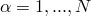）表征。假设应变能不仅依赖于变形，还依赖于纤维方向，提出以下形式

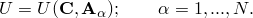

材料的应变能必须在参考配置中基体和纤维都经历刚体旋转时保持不变。然后，按照Spencer（1984），应变能可以用形成和向量完整性基的一组不可约标量不变量表示：

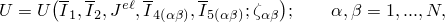

其中和是第一个和第二个偏量应变不变量；是弹性体积比（或第三个应变不变量）；和是、的*伪不变量*；且

项是几何常数（独立于变形），等于参考配置中任意两族纤维方向之间夹角的余弦：


与基于应变公式的情况不同，在基于不变量的公式中，纤维方向在初始配置中不需要是正交的。基于不变量能量函数的一个例子是Holzapfel、Gasser和Ogden（2000）为动脉壁提出的形式（见下文["Holzapfel-Gasser-Ogden形式"]；(pt05ch22s05abm09.md#usb-mat-canisohyperelastic-holzapfel)）。

### 各向异性应变能势

Abaqus中提供了两种形式的应变能势来建模近乎不可压缩的各向异性材料：广义Fung形式（包括完全各向异性和正交各向异性情况）和为动脉壁提出的Holzapfel、Gasser和Ogden形式。两种形式都适合建模软生物组织。然而，Fung形式是纯粹的现象学形式，而Holzapfel-Gasser-Ogden形式是基于微观力学的。

此外，Abaqus提供了通过两组用户子程序支持用户定义的应变能势形式的通用能力：一组用于基于应变的公式，一组用于基于不变量的公式。

#### 广义Fung形式

广义Fung应变能势具有以下形式：


其中*U*是单位参考体积的应变能；和*D*是温度相关的材料参数；是弹性体积比，定义如下（见["热膨胀"]；(pt05ch22s05abm09.md#usb-mat-canisohyperelastic-therm-expan)）；且, FUNG-ANISOTROPIC [*ANISOTROPIC HYPERELASTIC](../key/key-link.md#usb-kws-manisohyperelast), FUNG-ORTHOTROPIC ``` |

| **Abaqus/CAE用法：** | 属性模块：材料编辑器：****机械****弹性****超弹性****；**材料类型**：**各向异性**；**应变能势**：**Fung-各向异性**或**Fung-正交各向异性** |
| --- | --- |

#### Holzapfel-Gasser-Ogden形式

应变能势的形式基于Holzapfel、Gasser和Ogden（2000）以及Gasser、Ogden和Holzapfel（2006）为建模具有分布胶原纤维方向的动脉层而提出的形式：


其中


*U*是单位参考体积的应变能；、*D*、、和是温度相关的材料参数；是纤维族数量（）；是第一个偏量应变不变量；是弹性体积比，定义如下（见["热膨胀"](pt05ch22s05abm09.md#usb-mat-canisohyperelastic-therm-expan)），且是和的*伪不变量*。

该模型假设每族纤维内的胶原纤维方向是分散的（具有旋转对称性），围绕一个平均优选方向。参数（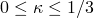）描述了纤维方向分散的程度。如果是表征分布的方向密度函数（它表示相对于平均方向在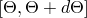范围内具有方向的纤维的标准化数量），参数定义为

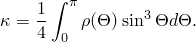

还假设所有纤维族具有相同的力学性能和相同的分散度。当时，纤维完全对齐（无分散）。当时，纤维随机分布，材料变为各向同性；这对应于球形方向密度函数。

类应变数量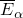表征具有平均方向的纤维族的变形。对于完全对齐的纤维（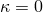），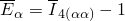；对于随机分布的纤维（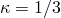），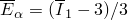。

应变能函数表达式中的前两项代表非胶原各向同性基体物质的畸变和体积贡献，第三项代表不同纤维族的贡献，考虑了分散的影响。该模型的基本假设是胶原纤维只能承受拉伸，因为它们在压缩加载下会屈曲。因此，应变能函数中的各向异性贡献仅在纤维应变为正时出现，或者等价地，当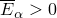时。这一条件通过项是Macauley括号，定义为。

参见["动脉层的各向异性超弹性建模，" Abaqus基准指南第3.1.7节](../bmk/bmk-link.md#bmk-mat-anisohyperelastic)，了解将Holzapfel-Gasser-Ogden能量势应用于建模具有分布胶原纤维方向的动脉层的示例。

初始偏量弹性张量和体积模量由下式给出

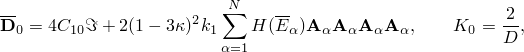

其中是四阶单位张量，且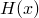是Heaviside单位阶跃函数。

| **输入文件用法：** | ``` [*ANISOTROPIC HYPERELASTIC](../key/key-link.md#usb-kws-manisohyperelast), HOLZAPFEL, LOCAL DIRECTIONS=*N* ``` |
| --- | --- |

| **Abaqus/CAE用法：** | 属性模块：材料编辑器：****机械****弹性****超弹性****；**材料类型**：**各向异性**；**应变能势**：**Holzapfel**；**局部方向数量**：*N* |
| --- | --- |

#### 用户定义形式：基于应变

或者，您可以在Abaqus/Standard中通过用户子程序[`UANISOHYPER_STRAIN`](../sub/sub-link.md#sub-xsl-uanisohyper_strain)或在Abaqus/Explicit中通过[`VUANISOHYPER_STRAIN`](../sub/sub-link.md#sub-xsl-vuanisohyper_strain)直接定义基于应变的应变能势的形式。必须直接通过这些用户子程序提供应变能势对修正Green应变分量和弹性体积比的导数。

在Abaqus/Standard中可以指定可压缩或不可压缩行为；在Abaqus/Explicit中只允许近乎不可压缩行为。

可选，您可以指定用户子程序中所需的数据属性值数量以及解相关变量的数量（参见["用户子程序：概述，" 第18.1.1节](pt04ch18s01aus104.md)）。

| **输入文件用法：** | 在Abaqus/Standard中使用以下选项定义可压缩行为： |
| --- | --- |
|  | ``` [*ANISOTROPIC HYPERELASTIC](../key/key-link.md#usb-kws-manisohyperelast), USER, FORMULATION=STRAIN, TYPE=COMPRESSIBLE, PROPERTIES=*n* ``` 在Abaqus/Standard中使用以下选项定义不可压缩行为： ``` [*ANISOTROPIC HYPERELASTIC](../key/key-link.md#usb-kws-manisohyperelast), USER, FORMULATION=STRAIN, TYPE=INCOMPRESSIBLE, PROPERTIES=*n* ``` 在Abaqus/Explicit中使用以下选项定义近乎不可压缩行为： ``` [*ANISOTROPIC HYPERELASTIC](../key/key-link.md#usb-kws-manisohyperelast), USER, FORMULATION=STRAIN, PROPERTIES=*n* ``` |

| **Abaqus/CAE用法：** | 属性模块：材料编辑器：****机械****弹性****超弹性****；**材料类型**：**各向异性**；**应变能势**：**用户**；**公式**：**应变**；**类型**：**不可压缩**或**可压缩**；**属性值数量**：*n* |
| --- | --- |

#### 用户定义形式：基于不变量

或者，您可以在Abaqus/Standard中通过用户子程序[`UANISOHYPER_INV`](../sub/sub-link.md#sub-xsl-uanisohyper_inv)或在Abaqus/Explicit中通过[`VUANISOHYPER_INV`](../sub/sub-link.md#sub-xsl-vuanisohyper_inv)直接定义基于不变量的应变能势的形式。在Abaqus/Standard中可以指定可压缩或不可压缩行为；在Abaqus/Explicit中只允许近乎不可压缩行为。

可选，您可以指定用户子程序中所需的数据属性值数量以及解相关变量的数量（参见["用户子程序：概述，" 第18.1.1节](pt04ch18s01aus104.md)）。

必须直接通过用户子程序[`UANISOHYPER_INV`](../sub/sub-link.md#sub-xsl-uanisohyper_inv)（在Abaqus/Standard中）和[`VUANISOHYPER_INV`](../sub/sub-link.md#sub-xsl-vuanisohyper_inv)（在Abaqus/Explicit中）提供应变能势对应变不变量的导数。

| **输入文件用法：** | 在Abaqus/Standard中使用以下选项定义可压缩行为： |
| --- | --- |
|  | ``` [*ANISOTROPIC HYPERELASTIC](../key/key-link.md#usb-kws-manisohyperelast), USER, FORMULATION=INVARIANT, LOCAL DIRECTIONS=*N*, TYPE=COMPRESSIBLE, PROPERTIES=*n* ``` 在Abaqus/Standard中使用以下选项定义不可压缩行为： ``` [*ANISOTROPIC HYPERELASTIC](../key/key-link.md#usb-kws-manisohyperelast), USER, FORMULATION=INVARIANT, LOCAL DIRECTIONS=*N*, TYPE=INCOMPRESSIBLE, PROPERTIES=*n* ``` 在Abaqus/Explicit中使用以下选项定义近乎不可压缩行为： ``` [*ANISOTROPIC HYPERELASTIC](../key/key-link.md#usb-kws-manisohyperelast), USER, FORMULATION=INVARIANT, PROPERTIES=*n* ``` |

| **Abaqus/CAE用法：** | 属性模块：材料编辑器：****机械****弹性****超弹性****；**材料类型**：**各向异性**；**应变能势**：**用户**；**公式**：**不变量**；**类型**：**不可压缩**或**可压缩**；**局部方向数量**：*N*；**属性值数量**：*n* |
| --- | --- |

### 优选材料方向的定义

您必须定义各向异性超弹性材料的优选材料方向（或纤维方向）。

对于基于应变的形式（如Fung形式和使用用户子程序[`UANISOHYPER_STRAIN`](../sub/sub-link.md#sub-xsl-uanisohyper_strain)或[`VUANISOHYPER_STRAIN`](../sub/sub-link.md#sub-xsl-vuanisohyper_strain)的用户定义形式），必须指定局部方向系统（["方向，" 第2.2.5节](pt01ch02s02aus15.md)）来定义各向异性方向。修正Green应变张量的分量是相对于这个系统计算的。

对于应变能函数的基于不变量的形式（如Holzapfel形式和使用用户子程序[`UANISOHYPER_INV`](../sub/sub-link.md#sub-xsl-uanisohyper_inv)或[`VUANISOHYPER_INV`](../sub/sub-link.md#sub-xsl-vuanisohyper_inv)的用户定义形式），必须指定局部方向向量来表征每族纤维。这些向量在初始配置中不需要是正交的。最多可以指定三个局部方向作为局部方向系统定义的一部分（["直接定义局部坐标系"在"方向，" 第2.2.5节](pt01ch02s02aus15.md#usb-int-corientation-direct)）；局部方向参照这个系统。

在Abaqus/CAE中，材料的局部方向向量是正交的，并与分配的 材料方向对齐。最佳实践是在Abaqus/CAE中使用离散方向分配方向。

材料方向可以按照如下所述输出到输出数据库（见["输出"]；(pt05ch22s05abm09.md#usb-mat-canisohyperelastic-output)")。

### 可压缩性

与剪切柔性相比，大多数软组织和纤维增强弹性体几乎没有可压缩性。这种行为在平面应力、壳或膜单元中不需要特别处理，但对于三维实体、平面应变和轴对称单元，数值解可能对应可压缩程度相当敏感。在材料高度受限的情况下（如用作密封件的O形圈），必须正确建模可压缩性以获得准确结果。在材料未高度受限的应用中，可压缩程度通常不是关键；例如，在Abaqus/Standard中假设材料完全不可压缩是相当令人满意的：材料的体积不能改变，除非热膨胀。

#### Abaqus/Standard中的可压缩性

在Abaqus/Standard中，混合（混合公式）单元要求用于不可压缩材料。在平面应力、壳和膜单元中，材料可以在厚度方向自由变形。在这种情况下，不需要对体积行为进行特殊处理；使用常规应力/位移单元是令人满意的。

#### Abaqus/Explicit中的可压缩性

除平面应力情况外，在Abaqus/Explicit中不能假设材料是完全不可压缩的，因为程序没有在每个材料计算点施加这种约束的机制。相反，必须对一些可压缩性进行建模。困难在于，在许多情况下，实际材料行为提供的可压缩性太少，算法无法有效工作。因此，除平面应力情况外，您必须提供足够的可压缩性以使代码工作，但要知道这使得模型的体积行为比实际材料更软。未能提供足够的可压缩性可能会向动态解决方案引入高频噪声，并需要使用过小的时间增量。因此，需要一些判断来决定解决方案是否足够准确，或者由于这个数值限制，问题是否可以用Abaqus/Explicit建模。

如果未给出各向异性超弹性模型的材料可压缩性值，默认情况下Abaqus/Explicit假定值，其中是初始剪切模量的最大值（在不同材料方向中）。用户定义形式的情况除外，其中一些可压缩性必须直接在用户子程序[`UANISOHYPER_INV`](../sub/sub-link.md#sub-xsl-uanisohyper_inv)或[`VUANISOHYPER_INV`](../sub/sub-link.md#sub-xsl-vuanisohyper_inv)中定义。

### 热膨胀

各向异性超弹性材料模型允许各向同性和正交各向异性热膨胀。

弹性体积比将总体积比*J*和热体积比

其中是主热膨胀应变，通过温度和热膨胀系数获得（["热膨胀，" 第26.1.2节](pt05ch26s01abm52.md)）。

### 黏弹性

各向异性超弹性模型可以与各向同性黏弹性结合使用来建模率相关材料行为（["时域黏弹性，" 第22.7.1节](pt05ch22s07abm12.md)）。由于黏弹性的各向同性，松弛函数独立于加载方向。这个假设对于建模其率相关行为表现出强烈各向异性的材料可能不可接受；因此，应谨慎使用此选项。

率相关材料（["时域黏弹性，" 第22.7.1节](pt05ch22s07abm12.md)）的各向异性超弹性响应可以通过定义此类材料的瞬时响应或长期响应来指定。

| **输入文件用法：** | 使用以下选项之一： |
| --- | --- |
|  | ``` [*ANISOTROPIC HYPERELASTIC](../key/key-link.md#usb-kws-manisohyperelast), MODULI=INSTANTANEOUS [*ANISOTROPIC HYPERELASTIC](../key/key-link.md#usb-kws-manisohyperelast), MODULI=LONG TERM ``` |

| **Abaqus/CAE用法：** | 属性模块：材料编辑器：****机械****弹性****超弹性****；**材料类型**：**各向异性**；**模量**：**长期**或**瞬时** |
| --- | --- |

### 应力软化

典型各向异性超弹性材料（如增强橡胶和生物组织）在循环加载和卸载下的响应通常在最初几个循环中表现出应力软化效应。经过几个循环后，材料的响应趋于稳定，材料被称为"预调节"。应力软化效应，通常在弹性体文献中称为Mullins效应，可以通过在Abaqus中使用各向异性超弹性模型与Mullins效应的*伪弹性*模型结合来考虑（见["Mullins效应，" 第22.6.1节](pt05ch22s06abm10.md)）。该模型提供的应力软化效应是各向同性的。

### 单元

各向异性超弹性材料模型可用于实体（连续体）单元、有限应变壳（除S4外）、连续壳和膜。当与具有平面应力公式的单元结合使用时，Abaqus假定完全不可压缩行为并忽略为材料指定的任何可压缩量。

#### Abaqus/Standard中的纯位移公式与混合公式

对于Abaqus/Standard中的连续单元，各向异性超弹性可以与纯位移公式单元或"混合"（混合公式）单元一起使用。纯位移公式单元必须与可压缩材料一起使用，"混合"（混合公式）单元必须与不可压缩材料一起使用。

一般来说，使用单个混合元素的分析仅比使用常规基于位移的元素的分析计算成本略高。然而，当波前被优化时，拉格朗日乘子可能不会独立于与单元相关联的常规自由度进行排序。因此，二阶混合四面体非常大网格的波前可能明显大于使用常规二阶四面体的等效网格。这可能导致更高的CPU成本、磁盘空间和内存需求。

#### Abaqus/Standard中的不兼容模式单元

不兼容模式单元应在大应变应用中小心使用。收敛可能很慢，并且在超弹性应用中可能累积不准确。经历过复杂变形历史后卸载的不兼容模式各向异性超弹性单元有时可能会出现错误应力。

### 过程

各向异性超弹性必须始终与几何非线性分析一起使用（["通用和线性扰动过程，" 第6.1.3节](pt03ch06s01aus44.md)）。

### 输出

除了Abaqus中可用的标准输出标识符（["Abaqus/Standard输出变量标识符，" 第4.2.1节](pt02ch04s02abv01.md)和["Abaqus/Explicit输出变量标识符，" 第4.2.2节](pt02ch04s02xbv01.md)）外，只要请求单元场输出到输出数据库，就会输出局部材料方向。局部方向作为场变量（LOCALDIR1、LOCALDIR2、LOCALDIR3）输出，表示方向余弦；这些变量可以在Abaqus/CAE（abaqus/Viewer）的可视化模块中可视化为矢量图。

如果未请求单元场输出，或者您指定不将单元材料方向写入输出数据库（参见["在Abaqus/Standard和Abaqus/Explicit中指定单元输出的方向"在"输出到输出数据库，" 第4.1.3节](pt02ch04s01aus40.md#usb-out-odboutput-element-directions)），则抑制局部材料方向的输出。

#### 附加参考

- Gasser, T. C., R. W. Ogden, and G. A. Holzapfel, "Hyperelastic Modelling of Arterial Layers with Distributed Collagen Fibre Orientations," Journal of the Royal Society Interface, vol. 3, pp. 15--35, 2006.
- Holzapfel, G. A., T. C. Gasser, and R. W. Ogden, "A New Constitutive Framework for Arterial Wall Mechanics and a Comparative Study of Material Models," Journal of Elasticity, vol. 61, pp. 1--48, 2000.
- Spencer, A. J. M., "Constitutive Theory for Strongly Anisotropic Solids," A. J. M. Spencer (ed.), Continuum Theory of the Mechanics of Fibre-Reinforced Composites, CISM Courses and Lectures No. 282, International Centre for Mechanical Sciences, Springer-Verlag, Wien, pp. 1--32, 1984.


