# 22.6.1 Mullins效应


**产品：** Abaqus/Standard  Abaqus/Explicit  Abaqus/CAE

##### **参考文献**

- ["材料库：概述，" 第21.1.1节](pt05ch21s01abo18.md)
- ["组合材料行为，" 第21.1.3节](pt05ch21s01aus110.md)
- ["弹性行为：概述，" 第22.1.1节](pt05ch22s01abo19.md)
- ["类橡胶材料的超弹性行为，" 第22.5.1节](pt05ch22s05abm07.md)
- ["各向异性超弹性行为，" 第22.5.3节](pt05ch22s05abm09.md)
- ["类橡胶材料的永久变形，" 第23.7.1节](pt05ch23s07abm40.md)
- ["弹性泡沫中的能量耗散，" 第22.6.2节](pt05ch22s06abm11.md)
- [*HYPERELASTIC](../key/key-link.md#usb-kws-mhyperelast)
- [*MULLINS EFFECT](../key/key-link.md#usb-kws-mmullinseffect)
- [*PLASTIC](../key/key-link.md#usb-kws-mplastic)
- [*UNIAXIAL TEST DATA](../key/key-link.md#usb-kws-munitestdata)
- [*BIAXIAL TEST DATA](../key/key-link.md#usb-kws-mbitestdata)
- [*PLANAR TEST DATA](../key/key-link.md#usb-kws-mplanartestdata)
- ["Mullins效应"在"定义损伤，" Abaqus/CAE用户指南第12.9.3节](../usi/usi-link.md#usi-prp-mechanical-damage-mullins)

### 概述

Mullins效应模型：
- 旨在模拟填充橡胶弹性体在准静态循环加载下的应力软化，文献中称为Mullins效应；
- 提供了对已知各向同性超弹性模型的扩展；
- 基于不可压缩各向同性弹性理论，通过添加称为损伤变量的单个变量进行修改；
- 假定只有材料响应的偏量部分与损伤相关；
- 旨在模拟模型不同部分经历不同损伤水平导致不同材料响应的材料响应情况；
- 与黏弹性结合时应用于长期模量；和
- 不能与滞后一起使用。

Abaqus提供了一个类似的能力，可应用于弹性泡沫（见["弹性泡沫中的能量耗散，" 第22.6.2节](pt05ch22s06abm11.md)）。

### 材料行为

填充橡胶弹性体在循环加载条件下的真实行为相当复杂。为了建模目的进行了某些理想化。本质上，这些理想化导致材料行为的两个主要组成部分：第一部分描述材料点（从未变形状态）在单调应变下的响应，第二部分与损伤相关，描述卸载-再加载行为。理想化响应和两个组成部分在以下章节中描述。

#### 理想化材料行为

当弹性体试样从原始状态进行简单拉伸，卸载，然后重新加载时，重新加载所需的应力小于初始加载所需的应力，前提是拉伸不超过初始加载期间达到的最大拉伸。这种应力软化现象称为Mullins效应，反映了先前加载期间产生的损伤。这种材料响应的类型如图22.6.1-1所示。

**图22.6.1-1** Mullins效应模型的理想化响应。

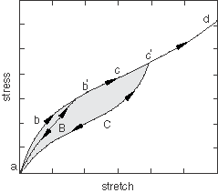

本图及附随描述基于Ogden和Roxburgh（1999）的工作，这构成了Abaqus中实现的模型的基础。考虑先前无应力材料的初始加载路径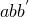，加载到任意点。从卸载时，遵循路径。当材料再次加载时，沿软化路径回溯为。如果然后施加进一步加载，则遵循路径，其中是初始加载路径的延续（这是如果没有卸载将遵循的路径）。如果在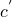处停止加载，卸载时遵循路径，然后重新加载时回溯到。如果不再施加超过的加载，曲线代表后续材料响应，然后是弹性的。对于超过的加载，再次遵循初始路径，并重复所述模式。

这是Mullins效应的理想表示，因为实际上在卸载和/或滞后等黏弹性效应时存在一些永久变形。诸如和之类的点在现实中可能不存在，因为从初始曲线卸载然后重新加载到 earlier 达到的最大应变水平通常会产生略低于初始曲线对应应力的应力。此外，一些填充弹性体的循环响应显示出在从某一最大应变水平卸载和随后重新加载期间进行性损伤的证据。这种进行性损伤通常发生在最初几个循环中，材料行为很快稳定到超过最初几个循环所遵循的加载/卸载循环。更详细的实际行为以及显示此类行为的测试数据如何用于校准Abaqus Mullins效应模型的内容在后面和["带有Mullins效应和永久变形的实心圆盘分析，" Abaqus示例问题指南第3.1.7节](../exa/exa-link.md#exa-veh-mullinstire)中讨论。

加载路径  今后将被称为"初始超弹性行为"。初始超弹性行为通过使用超弹性材料模型来定义。

应力软化被解释为由微观层面的损伤引起。当材料加载时，损伤通过填料颗粒与橡胶分子链之间键的断裂而发生。不同的链环节在不同变形水平断裂，从而导致宏观变形中连续损伤。另一个等效解释是，导致损伤所需的能量是不可回收的。

#### 初始超弹性行为

超弹性材料用"应变能势"函数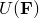来描述，它定义了单位参考体积（初始配置中的体积）中材料储存的应变能。量是变形梯度张量。为了考虑Mullins效应，Ogden和Roxburgh提出了一种基于形式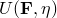的能量函数的材料描述，其中附加的标量变量代表材料中的损伤。损伤变量以这种方式控制材料属性：它使材料响应能够在卸载和随后未达到初始（初始）加载路径的再加载时受到与初始（初始）加载路径不同的能量函数控制。由于对的上述解释，*U*不再适合被认为是储存弹性势能。部分能量储存为应变能，而其余部分因损伤而耗散。图22.6.1-1中的阴影区域代表由于变形直到点的损伤而耗散的能量，而非阴影区域代表可回收的应变能。

以下段落提供了Abaqus中Mullins效应模型的总结。更详细的资料，请参见["Mullins效应，" Abaqus理论指南第4.7.1节](../stm/stm-link.md#stm-mat-mullinseffect)。在编写Mullins效应的本构方程之前，将总应变能密度的偏量部分和体积部分分开是有用的，如


在上述方程中，*U*、

其中符号具有通常的解释。右边第一项代表弹性应变能密度函数的偏量部分，第二项代表体积部分。

#### 修正应变能密度函数

Mullins效应通过使用如下形式的增强能量函数来考虑

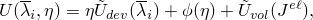

其中是初始超弹性行为应变能密度的偏量部分，例如由上面给出的多项式应变能函数右边的第一项定义；是应变能密度的体积部分，例如由上面给出的多项式应变能函数右边的第二项定义； 代表偏量主拉伸；且代表弹性体积比。函数是损伤变量、、，且增强能量函数简化为初始超弹性行为的应变能密度函数。损伤变量在变形过程中连续变化，始终满足。上述能量函数形式是Ogden和Roxburgh提出的形式的扩展，以考虑材料可压缩性。

#### 应力计算

通过上述对能量函数的修改，应力由下式给出


其中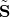是对应于当前偏量变形水平初始超弹性行为的偏量应力，是当前体积变形水平初始超弹性行为的静水压力。因此，Mullins效应的偏量应力通过用损伤变量根据以下关系随变形变化


其中是材料点在其变形历史上的最大值；*r*、是误差函数，定义为


当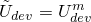时，对应于初始曲线上的一点，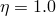。另一方面，达到其最小值，由下式给出


当变形移除时，即。对于在和时，、和（参数和在Abaqus/Explicit中的[`VUMULLINS`](../sub/sub-link.md#sub-xsl-vumullins)定义。

如果参数和参数*m*的值相对于可用于定义原始Ogden-Roxburgh模型。在Abaqus/Standard中，，则在低应变水平有大量损伤。另一方面，*m*为非零导致在低应变水平几乎没有或没有损伤。关于该模型对能量耗散的影响的进一步讨论，请参见["Mullins效应，" Abaqus理论指南第4.7.1节](../stm/stm-link.md#stm-mat-mullinseffect)。在固定其他参数的同时改变参数*r*和偏离1的程度越小。右图显示了从某一最大应变水平对于递增的是和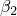）下的渐近响应。对于固定的*r*和*m*值，，


上述关系在远大于*m*时近似成立。

#### 在Abaqus中指定Mullins效应材料模型

初始超弹性行为通过使用超弹性材料模型来定义（见["类橡胶材料的超弹性行为，" 第22.5.1节](pt05ch22s05abm07.md)）。Mullins效应模型可以通过直接指定Mullins效应参数或使用测试数据校准参数来定义。或者，您可以在Abaqus/Standard中通过用户子程序[`UMULLINS`](../sub/sub-link.md#sub-xsl-umullins)和在Abaqus/Explicit中通过[`VUMULLINS`](../sub/sub-link.md#sub-xsl-vumullins)定义Mullins效应模型。

##### 直接指定参数

Mullins效应的参数*r*、*m*和 ``` |
| --- | --- |

| **Abaqus/CAE用法：** | 属性模块：材料编辑器：****机械****弹性体损伤****Mullins效应****：**定义**：**常数** |
| --- | --- |

##### 使用测试数据校准参数

可以从不同应变水平的实验卸载-再加载数据中指定最多三种简单测试：单轴、双轴和平面。然后Abaqus将使用非线性最小二乘曲线拟合算法计算材料参数。通常，最好从涉及实际应用中感兴趣应变范围内不同类型变形的多个实验获取数据，并使用所有这些数据来确定参数。如果初始行为使用测试数据定义，获得初始超弹性行为的良好曲线拟合也很重要。

默认情况下，Abaqus尝试将所有三个参数拟合到给定数据。这通常是可能的，除了测试数据仅对应于从单一值卸载-再加载的情况。在这种情况下，参数*m*和的潜在问题，Abaqus假定在上述情况下。

图22.6.1-4显示了一些来自三个不同应变水平的典型卸载-再加载数据。

**图22.6.1-4** Mullins效应的典型可用测试数据。

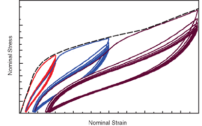

数据包括来自每个应变水平的多次加载和卸载循环。如图22.6.1-4所示，从任何给定应变水平的加载/卸载循环不是沿单一曲线发生的，并且存在一定量的滞后。负载移除时也有一定量的永久变形。数据还显示在任何给定最大应变水平重复循环时进行性损伤的证据。响应似乎在若干循环后稳定。当使用此类数据校准Mullins效应模型时，得到的响应将捕捉整体刚度特性，而忽略滞后、永久变形或进行性损伤等效应。上述数据可以按以下方式提供给Abaqus：
- 初始曲线可以由图22.6.1-4中虚线指示的数据点构成。从本质上讲，这包括到不同应变水平的第一加载曲线的包络。
- 可以通过按原样提供数据点（即如图22.6.1-4所示的重复卸载-再加载循环）来指定来自三个不同应变水平的卸载-再加载曲线。如前所述，需要通过将数据作为不同表提供来区分不同应变水平的数据。例如，假设测试数据对应于单轴拉伸状态，则必须为图22.6.1-4所示的三个不同应变水平定义三张单轴测试数据表。在这种情况下，Abaqus将使用所有数据点（来自所有应变水平）提供最佳拟合。结果得到的拟合将是在任何给定应变水平下所有测试数据的平均响应。虽然可以建模永久变形（见["类橡胶材料的永久变形，" 第23.7.1节](pt05ch23s07abm40.md)），但在此过程中将失去滞后。
- 或者，您可以提供来自每个不同应变水平的任何一次卸载-再加载循环。如果预期组件将经历重复循环加载，后者可能是例如每个应变水平的稳定循环。另一方面，如果预期组件将经历主要是单调加载，可能有少量卸载，则每个应变水平的第一条卸载曲线可能是校准Mullins系数的适当输入数据。

一旦确定了Mullins效应常数，就建立了Abaqus中Mullins效应模型的行为。但是，必须评估这种行为的质量：必须将不同变形模式下材料行为的预测与实验数据进行比较。您必须根据Abaqus预测与实验数据之间的相关性来判断Abaqus确定的Mullins效应常数是否可接受。单元素测试用例可用于推导材料模型的标称应力-标称应变响应。

改善Mullins效应参数拟合质量的步骤本质上与为初始超弹性行为曲线拟合提供的指南相似（详见["类橡胶材料的超弹性行为，" 第22.5.1节](pt05ch22s05abm07.md)）。此外，如果初始行为使用测试数据定义，Mullins效应参数的拟合质量取决于初始超弹性行为的良好拟合。

可以通过使用加载与提供测试数据相同模式的单元素进行数值实验来评估拟合质量。或者，可以通过请求模型定义数据输出（见["输出，" 第4.1.1节](pt02ch04s01aus38.md)）并执行数据检查分析来获得初始和软化行为的数值响应。Abaqus计算出的响应与实验数据一起打印在数据（`.dat`）文件中。可以将此表格数据在Abaqus/CAE中绘图用于比较和评估目的。初始超弹性行为也可以使用Abaqus/CAE中的自动材料评估工具进行评估。

| **输入文件用法：** | ``` [*MULLINS EFFECT](../key/key-link.md#usb-kws-mmullinseffect), TEST DATA INPUT, BETA *和/或* M*和/或* R ``` |
| --- | --- |
|  | 此外，使用以下选项中至少一个至三个来提供卸载-再加载测试数据（见描述超弹性测试数据输入的章节中的"实验测试"；["类橡胶材料的超弹性行为，" 第22.5.1节](pt05ch22s05abm07.md)）： ``` [*UNIAXIAL TEST DATA](../key/key-link.md#usb-kws-munitestdata) [*BIAXIAL TEST DATA](../key/key-link.md#usb-kws-mbitestdata) [*PLANAR TEST DATA](../key/key-link.md#usb-kws-mplanartestdata) ``` 可以通过对适当测试数据选项的重复规范，输入来自任何给定测试类型不同应变水平的多次卸载-再加载曲线。 |

| **Abaqus/CAE用法：** | 属性模块：材料编辑器：****机械****弹性体损伤****Mullins效应****：**定义**：**测试数据输入**：输入最多两个值**r**、**m**和**beta**的值。此外，选择并输入至少以下之一的数据：****添加测试****双轴测试****、**平面测试**或**单轴测试** |
| --- | --- |

##### 用户子程序规范

定义Mullins效应的替代方法涉及在Abaqus/Standard中的用户子程序[`UMULLINS`](../sub/sub-link.md#sub-xsl-umullins)和在Abaqus/Explicit中的[`VUMULLINS`](../sub/sub-link.md#sub-xsl-vumullins)中定义损伤变量。可选，您可以指定用户子程序中所需的数据属性值数量。您必须提供损伤变量及其导数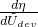。后者对整体方程系统的Jacobian矩阵有贡献，是确保Abaqus/Standard良好收敛特性所必需的。如有需要，您可以指定解相关变量的数量（["用户子程序：概述，" 第18.1.1节](pt04ch18s01aus104.md)）。这些解相关变量可以在用户子程序中更新。损伤耗散能量和能量的可回收部分也可以为输出目的定义。

用户子程序[`UMULLINS`](../sub/sub-link.md#sub-xsl-umullins)和[`VUMULLINS`](../sub/sub-link.md#sub-xsl-vumullins)可以与Abaqus中的所有超弹性势结合使用，包括用户定义的势（通过用户子程序[`UHYPER`](../sub/sub-link.md#sub-xsl-uhyper)、[`UANISOHYPER_INV`](../sub/sub-link.md#sub-xsl-uanisohyper_inv)和[`UANISOHYPER_STRAIN`](../sub/sub-link.md#sub-xsl-uanisohyper_strain)（Abaqus/Standard），以及[`VUANISOHYPER_INV`](../sub/sub-link.md#sub-xsl-vuanisohyper_inv)和[`VUANISOHYPER_STRAIN`](../sub/sub-link.md#sub-xsl-vuanisohyper_strain)（Abaqus/Explicit））。

| **输入文件用法：** | ``` [*MULLINS EFFECT](../key/key-link.md#usb-kws-mmullinseffect), USER, PROPERTIES=*constants* ``` |
| --- | --- |

| **Abaqus/CAE用法：** | 属性模块：材料编辑器：****机械****弹性体损伤****Mullins效应****：**定义**：**用户定义** |
| --- | --- |

##### 黏弹性

当黏弹性与Mullins效应结合使用时，应力软化应用于长期行为。

在这种情况下，应谨慎进行参数（具有能量单位）的规范。如果底层超弹性行为用瞬时模量定义，和["带有Mullins效应和永久变形的实心圆盘分析，" Abaqus示例问题指南第3.1.7节](../exa/exa-link.md#exa-veh-mullinstire)中找到。

### 输出

除了Abaqus中可用的标准输出标识符（["Abaqus/Standard输出变量标识符，" 第4.2.1节](pt02ch04s02abv01.md)和["Abaqus/Explicit输出变量标识符，" 第4.2.2节](pt02ch04s02xbv01.md)），以下变量对Mullins效应材料模型具有特殊含义：

| DMENER | 每单位体积由损伤耗散的能量。 |
| --- | --- |

| ELDMD | 由损伤在单元中耗散的总能量。 |
| --- | --- |

| ALLDMD | 由损伤在整个（或部分）模型中耗散的能量。ALLDMD的贡献包含在总应变能ALLIE中。 |
| --- | --- |

| EDMDDEN | 单元中每单位体积由损伤耗散的能量。 |
| --- | --- |

| SENER | 每单位体积能量的可回收部分。 |
| --- | --- |

| ELSE | 单元中能量的可回收部分。 |
| --- | --- |

| ALLSE | 整个（或部分）模型中能量的可回收部分。 |
| --- | --- |

| ESEDEN | 单元中每单位体积能量的可回收部分。 |
| --- | --- |

损伤能量耗散，由图22.6.1-1中阴影区域表示，针对变形直到，计算如下。当受损材料处于完全卸载状态时，增强能量函数具有残余值。完全卸载时能量函数的残余值代表材料中因损伤而耗散的能量。能量的可回收部分通过从增强能量中减去耗散能量获得，如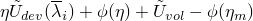。

损伤能量随着沿初始曲线的进行性变形而累积，并在卸载期间保持恒定。在卸载期间，应变能量的可回收部分被释放。当材料点完全卸载时，后者变为零。当从完全卸载状态重新加载时，应变能量的可回收部分从零开始增加。当重新加载超过 earlier 达到的最大应变时，损伤能量的进一步累积发生。

#### 附加参考

- Ogden, R. W., and D. G. Roxburgh, "A Pseudo-Elastic Model for the Mullins Effect in Filled Rubber," Proceedings of the Royal Society of London, Series A, vol. 455 2861--2877, 1999.


