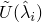
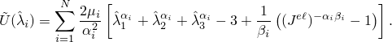
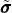
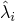
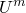
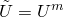
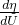

# 22.6.2 弹性泡沫中的能量耗散


**产品：** Abaqus/Standard  Abaqus/Explicit

##### **参考文献**

- ["材料库：概述，" 第21.1.1节](pt05ch21s01abo18.md)
- ["组合材料行为，" 第21.1.3节](pt05ch21s01aus110.md)
- ["弹性行为：概述，" 第22.1.1节](pt05ch22s01abo19.md)
- ["弹性泡沫中的超弹性行为，" 第22.5.2节](pt05ch22s05abm08.md)
- ["Mullins效应，" 第22.6.1节](pt05ch22s06abm10.md)
- [*HYPERFOAM](../key/key-link.md#usb-kws-mhyperfoam)
- [*MULLINS EFFECT](../key/key-link.md#usb-kws-mmullinseffect)
- [*UNIAXIAL TEST DATA](../key/key-link.md#usb-kws-munitestdata)
- [*BIAXIAL TEST DATA](../key/key-link.md#usb-kws-mbitestdata)
- [*PLANAR TEST DATA](../key/key-link.md#usb-kws-mplanartestdata)

### 概述

Abaqus中弹性泡沫的能量耗散：
- 允许对弹性泡沫中的永久能量耗散和应力软化效应进行建模；
- 使用基于Mullins效应的方法来模拟弹性体橡胶中的Mullins效应（["Mullins效应，" 第22.6.1节](pt05ch22s06abm10.md)）；
- 提供了对各向同性弹性泡沫模型（["弹性泡沫中的超弹性行为，" 第22.5.2节](pt05ch22s05abm08.md)）的扩展；
- 旨在模拟泡沫组件在相对于泡沫特征松弛时间较高变形率下的动态加载中的能量吸收；和
- 不能与黏弹性一起使用。

### 弹性泡沫中的能量耗散

Abaqus提供了一种机制来包含弹性泡沫中的永久能量耗散和应力软化效应。该方法类似于用于模拟弹性体橡胶中Mullins效应的方法，详见["Mullins效应，" 第22.6.1节](pt05ch22s06abm10.md)。此功能主要用于模拟泡沫组件在相对于泡沫特征松弛时间较高变形率下的动态加载中的能量吸收；在这种情况下，可以假定泡沫材料永久受损。

材料响应如图22.6.2-1所示。

**图22.6.2-1** 具有能量耗散的弹性泡沫材料的典型应力-拉伸响应。


考虑先前无应力泡沫的初始加载路径，加载到任意点。从卸载时，遵循路径。当材料再次加载时，沿软化路径回溯为。如果然后施加进一步加载，则遵循路径，其中是初始加载路径的延续（这是如果没有卸载将遵循的路径）。如果在处停止加载，卸载时遵循路径，然后重新加载时回溯到。如果不再施加超过的加载，曲线代表后续材料响应，然后是弹性的。对于超过的加载，再次遵循初始路径，并重复所述模式。图22.6.2-1中的阴影区域代表由于变形直到的材料损伤而耗散的能量。

#### 修正应变能密度函数

通过引入如下形式的增强应变能密度函数来考虑能量耗散效应


其中 代表主机械拉伸，是["弹性泡沫中的超弹性行为，" 第22.5.2节](pt05ch22s05abm08.md)中描述的初始泡沫行为的应变能势，由多项式应变能函数定义为



函数是损伤变量，在初始曲线上点时。损伤函数满足条件；因此，当材料的变形状态在代表初始泡沫行为的曲线上时，，且增强能量函数简化为初始泡沫行为的应变能势。

上述增强应变能密度函数的表达式类似于Ogden和Roxburgh提出的用于模拟填充橡胶弹性体Mullins效应的形式（见["Mullins效应，" 第22.6.1节](pt05ch22s06abm10.md)），不同之处在于在弹性泡沫的情况下，考虑了总体应变能（包括体积部分）的增强。需要此修改是为了使模型预测泡沫纯静水加载下的能量吸收。

#### 应力计算

通过上述对能量函数的修改，应力由下式给出


其中是当前变形水平初始泡沫行为对应的应力。因此，应力通过用损伤变量根据以下关系随变形变化


其中是材料点在其变形历史上的最大值；*r*、是误差函数。当时，对应于初始曲线上的一点，。另一方面，当变形移除时，即，损伤变量达到其最小值，由下式给出


对于在、和（参数可以通过在Abaqus/Standard中的用户子程序[`UMULLINS`](../sub/sub-link.md#sub-xsl-umullins)和在Abaqus/Explicit中的[`VUMULLINS`](../sub/sub-link.md#sub-xsl-vumullins)定义。

如果参数和参数*m*的值相对于，则在低应变水平有大量损伤。另一方面，*m*为非零导致在低应变水平几乎没有或没有损伤。关于该模型对能量耗散的影响的进一步讨论，请参见["Mullins效应，" Abaqus理论指南第4.7.1节](../stm/stm-link.md#stm-mat-mullinseffect)。

#### 指定弹性泡沫能量耗散的性能

初始弹性泡沫行为通过使用超泡沫材料模型定义。能量耗散可以通过直接指定损伤变量表达式中的参数或使用测试数据校准参数来定义。或者，您可以在Abaqus/Standard中通过用户子程序[`UMULLINS`](../sub/sub-link.md#sub-xsl-umullins)和在Abaqus/Explicit中通过[`VUMULLINS`](../sub/sub-link.md#sub-xsl-vumullins)定义Mullins效应模型。

##### 直接指定参数

损伤变量表达式中的参数*r*、*m*和可以直接作为温度和/或场变量的函数给出。

| **输入文件用法：** | ``` [*MULLINS EFFECT](../key/key-link.md#usb-kws-mmullinseffect) ``` |
| --- | --- |

| **Abaqus/CAE用法：** | 属性模块：材料编辑器：****机械****弹性体损伤****Mullins效应****：**定义**：**常数** |
| --- | --- |

##### 使用测试数据校准参数

可以从不同应变水平的实验卸载-再加载数据中指定最多三种简单测试：单轴、双轴和平面。然后Abaqus将使用非线性最小二乘曲线拟合算法计算材料参数。关于此方法的详细讨论，请参见["Mullins效应，" 第22.6.1节](pt05ch22s06abm10.md)。

| **输入文件用法：** | ``` [*MULLINS EFFECT](../key/key-link.md#usb-kws-mmullinseffect), TEST DATA INPUT, BETA *和/或* M*和/或* R ``` |
| --- | --- |
|  | 此外，使用以下选项中至少一个至三个来提供卸载-再加载测试数据： ``` [*UNIAXIAL TEST DATA](../key/key-link.md#usb-kws-munitestdata) [*BIAXIAL TEST DATA](../key/key-link.md#usb-kws-mbitestdata) [*PLANAR TEST DATA](../key/key-link.md#usb-kws-mplanartestdata) ``` 可以通过对适当测试数据选项的重复规范，输入来自任何给定测试类型不同应变水平的多次卸载-再加载曲线。 |

| **Abaqus/CAE用法：** | 属性模块：材料编辑器：****机械****弹性体损伤****Mullins效应****：**定义**：**测试数据输入**：输入最多两个值**r**、**m**和**beta**的值。此外，输入至少以下之一的 数据：****子选项****双轴测试****、**平面测试**或**单轴测试** |
| --- | --- |

##### 用户子程序规范

指定能量耗散的替代方法涉及在Abaqus/Standard中的用户子程序[`UMULLINS`](../sub/sub-link.md#sub-xsl-umullins)和在Abaqus/Explicit中的[`VUMULLINS`](../sub/sub-link.md#sub-xsl-vumullins)中定义损伤变量。可选，您可以指定用户子程序中所需的数据属性值数量。您必须提供损伤变量及其导数。后者对整体方程系统的Jacobian矩阵有贡献，是确保Abaqus/Standard良好收敛特性所必需的。如有需要，您可以指定解相关变量的数量（["用户子程序：概述，" 第18.1.1节](pt04ch18s01aus104.md)）。这些解相关变量可以在用户子程序中更新。损伤耗散能量和能量的可回收部分也可以为输出目的定义。

| **输入文件用法：** | ``` [*MULLINS EFFECT](../key/key-link.md#usb-kws-mmullinseffect), USER, PROPERTIES=`constants` ``` |
| --- | --- |

| **Abaqus/CAE用法：** | 属性模块：材料编辑器：****机械****弹性体损伤****Mullins效应****：**定义**：**用户定义** |
| --- | --- |

### 单元

该模型可用于支持弹性泡沫材料模型使用的所有单元类型。

### 过程

该模型可用于支持弹性泡沫材料模型使用的所有过程类型。在Abaqus/Standard中的线性扰动步骤中，当前材料切线刚度用于确定响应。具体来说，当对初始曲线上的一点进行线性扰动时，将使用卸载切线刚度。

在Abaqus/Explicit中，卸载切线刚度始终用于计算稳定时间增量。因此，应力软化效应的包含可能导致分析中更多的增量，即使实际上没有卸载发生。

### 输出

除了Abaqus中可用的标准输出标识符（["Abaqus/Standard输出变量标识符，" 第4.2.1节](pt02ch04s02abv01.md)和["Abaqus/Explicit输出变量标识符，" 第4.2.2节](pt02ch04s02xbv01.md)），以下变量在模型中存在能量耗散时具有特殊含义：

| DMENER | 每单位体积由损伤耗散的能量。 |
| --- | --- |

| ELDMD | 由损伤在单元中耗散的总能量。 |
| --- | --- |

| ALLDMD | 由损伤在整个（或部分）模型中耗散的能量。ALLDMD的贡献包含在总应变能ALLIE中。 |
| --- | --- |

| EDMDDEN | 单元中每单位体积由损伤耗散的能量。 |
| --- | --- |

| SENER | 每单位体积能量的可回收部分。 |
| --- | --- |

| ELSE | 单元中能量的可回收部分。 |
| --- | --- |

| ALLSE | 整个（或部分）模型中能量的可回收部分。 |
| --- | --- |

| ESEDEN | 单元中每单位体积能量的可回收部分。 |
| --- | --- |

损伤能量耗散，由图22.6.2-1中阴影区域表示，针对变形直到，计算如下。当受损材料处于完全卸载状态时，增强能量函数具有残余值。完全卸载时能量函数的残余值代表材料中因损伤而耗散的能量。能量的可回收部分通过从增强能量中减去耗散能量获得，如。

损伤能量随着沿初始曲线的进行性变形而累积，并在卸载期间保持恒定。在卸载期间，应变能量的可回收部分被释放。当材料点完全卸载时，后者变为零。当从完全卸载状态重新加载时，应变能量的可回收部分从零开始增加。当重新加载超过 earlier 达到的最大应变时，损伤能量的进一步累积发生。


