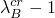
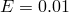

# 22.8.1 弹性体中的滞后


**产品：** Abaqus/Standard  Abaqus/CAE

##### **参考文献**

- ["弹性行为：概述，" 第22.1.1节](pt05ch22s01abo19.md)
- [*HYSTERESIS](../key/key-link.md#usb-kws-mhysteresis)
- ["为各向同性超弹性材料模型定义滞后行为"在"定义弹性，" Abaqus/CAE用户指南第12.9.1节](../usi/usi-link.md#usi-prp-mechanical-elastic-hyperelastic-hysteresis)

### 概述

滞后材料模型：
- 定义经历相当弹性和非弹性应变的材料的率相关、滞后行为；
- 仅对剪切畸变行为提供非弹性响应——对体积变形的响应是纯弹性的；
- 只能与["类橡胶材料的超弹性行为，" 第22.5.1节](pt05ch22s05abm07.md)结合使用来定义材料的弹性响应——弹性可以用瞬时模量或长期模量来定义；
- 在静态分析（["静态应力分析，" 第6.2.2节](pt03ch06s02at01.md)）、准静态分析（["准静态分析，" 第6.2.5节](pt03ch06s02at04.md)）或使用直接积分的瞬态动态分析（["使用直接积分的隐式动态分析，" 第6.3.2节](pt03ch06s03at07.md)）期间激活——它不能用于完全耦合温度-位移分析（["完全耦合热应力分析，" 第6.5.3节](pt03ch06s05at19.md)）、完全耦合热-电-结构分析（["完全耦合热-电-结构分析，" 第6.7.4节](pt03ch06s07at23.md)）或稳态传输分析（["稳态传输分析，" 第6.4.1节](pt03ch06s04at17.md)）；
- 不能用于建模温度相关蠕变材料特性——但是，弹性材料特性可以是温度相关的；和
- 默认使用非对称矩阵存储和求解。

### 弹性体的率相关材料行为

弹性体的非线性率相关性通过将力学响应分解为对应力松弛测试中接近的状态的平衡网络（A）和捕获偏离平衡状态的非线性率相关偏差的随时间变化的网络（B）来建模。总应力假定为两个网络中应力的和。变形梯度

其中是网络B中的有效蠕变应变率，是网络B中的标称蠕变应变，是网络B中的有效应力。网络B中的链拉伸

其中1(MPa)*m*、、和（Bergstrom and Boyce，1998; 2001）。

| **输入文件用法：** | 在同一材料数据块中使用以下两个选项： |
| --- | --- |
|  | ``` [*HYSTERESIS](../key/key-link.md#usb-kws-mhysteresis) [*HYPERELASTIC](../key/key-link.md#usb-kws-mhyperelast) ``` |

| **Abaqus/CAE用法：** | 属性模块：材料编辑器：****机械****弹性****超弹性****：****子选项****滞后**** |
| --- | --- |
|  | 在Abaqus/CAE中不支持参数）一起使用的单元。此外，此模型不能与基于平面应力假设的单元（壳、膜和连续平面应力单元）一起使用。仅当伴随的超弹性定义完全不可压缩时，混合单元才能与此模型一起使用。当此模型与减缩积分单元一起使用时，瞬时弹性模量用于计算默认沙漏刚度。

### 输出

除了Abaqus/Standard中可用的标准输出标识符（["Abaqus/Standard输出变量标识符，" 第4.2.1节](pt02ch04s02abv01.md)），如果定义了滞后行为，以下变量具有特殊含义：

| EE | 对应于时间*t*应力状态和瞬时弹性材料属性的弹性应变。 |
| --- | --- |

| CE | 等效蠕变应变，定义为总应变与弹性应变之间的差值。 |
| --- | --- |

这些应变度量用于近似应变能SENER和黏性耗散CENER。这些近似可能导致应变能的低估和黏性耗散的高估，因为内部应力对这些能量量的影响被忽略。这种不准确在非单调加载情况下可能特别明显。

#### 附加参考

- Bergstrom, J. S., and M. C. Boyce, "Constitutive Modeling of the Large Strain Time-Dependent Behavior of Elastomers," Journal of the Mechanics and Physics of Solids, vol. 46, no.5, pp. 931--954, May 1998.
- Bergstrom, J. S., and M. C. Boyce, "Constitutive Modeling of the Time-Dependent and Cyclic Loading of Elastomers and Application to Soft Biological Tissues," Mechanics of Materials, vol. 33, no.9, pp. 523--530, 2001.


