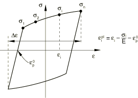

# 23.2.2 承受循环加载的金属模型


**产品：** Abaqus/Standard  Abaqus/Explicit  Abaqus/CAE

##### **参考文献**

- ["材料库：概述，" 第21.1.1节"](pt05ch21s01abo18.md)
- ["非弹性行为，" 第23.1.1节"](pt05ch23s01abo20.md)
- ["各向异性屈服/蠕变，" 第23.2.6节"](pt05ch23s02abm22.md)
- ["UHARD，" Abaqus用户子程序参考指南第1.1.36节](../sub/sub-link.md#sub-rtn-uuhard)
- [*CYCLIC HARDENING](../key/key-link.md#usb-kws-mcyclichardening)
- [*PLASTIC](../key/key-link.md#usb-kws-mplastic)
- [*POTENTIAL](../key/key-link.md#usb-kws-mpotential)
- ["在"定义塑性，" 第12.9.2节的Abaqus/CAE用户指南中定义经典金属塑性"](../usi/usi-link.md#usi-prp-mechanical-plastic-plastic)

### 概述

运动硬化模型：
- 用于模拟承受循环加载的材料非弹性行为；
- 包括线性运动硬化模型和非线性各向同性/运动硬化模型；
- 包括具有多个背应力的非线性各向同性/运动硬化模型；
- 可用于任何使用具有位移自由度的单元的过程；
- 在Abaqus/Standard中不能用于绝热分析，且非线性各向同性/运动硬化模型不能用于耦合温度-位移分析；
- 可用于模拟率相关屈服；
- 可与蠕变和肿胀结合使用（在Abaqus/Standard中）；和
- 需要使用线性弹性材料模型来定义响应的弹性部分。

### 屈服面

用于模拟承受循环加载的金属行为的运动硬化模型是与压力无关的塑性模型；换句话说，金属的屈服与等效压力应力无关。这些模型适用于承受循环加载条件的大多数金属，多孔金属除外。线性运动硬化模型可与Mises或Hill屈服面一起使用。非线性各向同性/运动硬化模型在Abaqus/Standard中只能与Mises屈服面一起使用，在Abaqus/Explicit中可与Mises或Hill屈服面一起使用。与压力无关的屈服面由以下函数定义：

f(σ~ij~ - α~ij~) - σ^0^ = 0

其中σ^0^是屈服应力，α~ij~是背应力，σ¯是相对于背应力α~ij~的等效Mises应力或Hill势。例如，等效Mises应力定义为：

σ¯ = √(3/2 S~ij~ S~ij~)

其中S~ij~是偏应力张量（定义为S~ij~ = σ~ij~ - p δ~ij~，其中σ~ij~是应力张量，p是等效压力应力，δ~ij~是单位张量），α~ij~是背应力张量的偏量部分。

### 流动法则

运动硬化模型假定相关塑性流动：

dε~ij~^p^ = dλ ∂f/∂σ~ij~

其中dλ是塑性流动率，dε¯^p^是等效塑性应变率。等效塑性应变的演化从以下等效塑性功表达式获得：

σ¯ dε¯^p^ = σ~ij~ dε~ij~^p^

对于各向同性Mises塑性，这产生dε¯^p^ = √(2/3 dε~ij~^p^ dε~ij~^p^)。相关塑性流动的假设对于承受循环加载的金属是可接受的，只要微观细节（如金属组件因循环疲劳载荷而断裂时发生的塑性流动局部化）不是关注的重点。

### 硬化

线性运动硬化模型具有恒定的硬化模量，非线性各向同性/运动硬化模型同时具有非线性运动和非线性各向同性硬化分量。

#### 线性运动硬化模型

该模型的演化定律由线性运动硬化分量组成，通过背应力α~ij~描述屈服面在应力空间中的平移。当忽略温度依赖性时，该演化定律是线性Ziegler硬化定律：

dα~ij~ = C dε¯^p^ (σ~ij~ - α~ij~)/σ¯

其中dε¯^p^是等效塑性应变率，C是运动硬化模量。在该模型中，定义屈服面大小的等效应力σ^0^保持恒定，σ^0^ = σ|¯^0^，其中σ|¯^0^是零塑性应变时定义屈服面大小的等效应力。

#### 非线性各向同性/运动硬化模型

该模型的演化定律由两个分量组成：一个非线性运动硬化分量，通过背应力α~ij~描述屈服面在应力空间中的平移；和一个各向同性硬化分量，描述定义屈服面大小的等效应力σ^0^如何随塑性变形而变化。

运动硬化分量被定义为纯运动项（线性Ziegler硬化定律）和松弛项（"回忆"项）的加性组合，这引入了非线性。此外，多个运动硬化分量（背应力）可以叠加，这可能在某些情况下显著改善结果。当忽略温度和场变量依赖性时，每个背应力的硬化定律为：

dα~k~ = (2/3) C~k~ dε¯^p^ n~ij~ - γ~k~ α~k~ dε¯^p^

且总体背应力由以下关系计算：

α~ij~ = Σ α~k~

其中N是背应力的数量，C~k~和γ~k~是必须从循环测试数据中校准的材料参数。C~k~是初始运动硬化模量，γ~k~决定运动硬化模量随塑性变形增加而减小的速率。运动硬化定律可以分为偏量部分和静水压力部分；只有偏量部分对材料行为有影响。当C~k~和γ~k~为零时，模型简化为各向同性硬化模型。当所有γ~k~等于零时，恢复线性Ziegler硬化定律。材料参数的校准在下面讨论（["运动硬化模型的使用和校准"](pt05ch23s02abm18.md#usb-mat-usagecalibration)"）。图23.2.2-1显示了一个具有三个背应力的非线性运动硬化示例。

**图23.2.2-1** 具有三个背应力的运动硬化模型。


每个背应力覆盖不同的应变范围，并且对于大应变保持线性硬化定律。

模型的各向同性硬化行为将屈服面大小σ^0^的演化定义为等效塑性应变ε¯^p^的函数。可以通过以表格形式直接指定σ^0^作为ε¯^p^的函数、在用户子程序[`UHARD`](../sub/sub-link.md#sub-xsl-uhard)中指定σ^0^（仅在Abaqus/Standard中）或使用简单指数定律来引入此演化：

σ^0^ = σ|¯^0^ + Q~∞~ (1 - exp(-b ε¯^p^))

其中σ|¯^0^是零塑性应变时的屈服应力，Q~∞~和b是材料参数。Q~∞~是屈服面大小的最大变化，b定义屈服面大小随塑性应变发展而变化的速率。当定义屈服面大小的等效应力保持恒定（σ^0^ = σ|¯^0^）时，模型简化为非线性运动硬化模型。

图23.2.2-2和图23.2.2-3分别说明了单向加载和多轴加载中运动和各向同性硬化分量的演化。运动硬化分量的演化定律意味着背应力包含在半径为|α|~sat~的圆柱体内，其中|α|~sat~是饱和时（ large plastic strains）背应力α~ij~的大小。它还意味着任何应力点必须位于半径为|α|~max~的圆柱体内（使用图23.2.2-2的符号），因为屈服面保持有界。在大塑性应变时，任何应力点包含在半径为σ^0^~∞~的圆柱体内，其中σ^0^~∞~是大塑性应变时定义屈服面大小的等效应力。如果为各向同性分量提供了表格数据，σ^0^~∞~是用于定义屈服面大小的最后一个值。如果使用了用户子程序[`UHARD`](../sub/sub-link.md#sub-xsl-uhard)，此值将取决于您的实现；否则，σ^0^~∞^ = σ|¯^0^ + Q~∞~。

**图23.2.2-2** 非线性各向同性/运动硬化模型中硬化的 一维表示。


**图23.2.2-3** 非线性各向同性/运动硬化模型中硬化的三维表示。


### 预测的材料行为

在运动硬化模型中，屈服面中心由于运动硬化分量而在应力空间中移动。此外，当使用非线性各向同性/运动硬化模型时，屈服面范围可能由于各向同性分量而扩大或收缩。这些特性允许对承受循环载荷或温度的金属中的非弹性变形进行建模，导致显著的非弹性变形并且可能是低循环疲劳失效。这些模型考虑了以下现象：

**包辛格效应**：这一效应的特征是在初始加载期间发生塑性变形后，在载荷反转时屈服应力降低。这种现象随着持续循环而减少。线性运动硬化分量考虑了这种效应，但非线性分量改善了循环的形状。使用具有多个背应力的非线性模型可以进一步改善循环的形状。

**具有塑性安定的循环硬化**：这一现象是对称应力或应变控制实验的特征。软化或退火金属趋向于硬化到稳定极限，而初始硬化的金属趋向于软化。图23.2.2-4说明了一种在规定的对称应变循环下硬化的金属的行为。

**图23.2.2-4** 塑性安定。


单独使用的模型的运动硬化分量预测一次应力循环后的塑性安定。各向同性分量与非线性运动分量的组合预测几个循环后的安定。

**棘轮效应**：在规定限值之间的不对称应力循环将导致沿平均应力方向的渐进"蠕变"或"棘轮"（图23.2.2-5）。

**图23.2.2-5** 棘轮效应。


通常瞬态棘轮随后对于低平均应力会稳定（零棘轮应变），而对于高平均应力则观察到累积棘轮应变的恒定增加。单独使用而非各向同性硬化分量使用的非线性运动硬化分量预测恒定的棘轮应变。通过添加各向同性硬化来改善棘轮效应的预测，在这种情况下棘轮应变可能减小直至变为恒定。然而，一般来说，具有单个背应力的非线性硬化模型预测了过于显著的棘轮效应。通过叠加几个运动硬化模型（背应力）并选择其中一个模型为线性或近似线性（C~k~ ≈ γ~k~），可以获得建模棘轮效应的显著改善，这将导致不太显著的棘轮效应。

**平均应力松弛**：这一现象是不对称应变实验的特征，如图23.2.2-6所示。

**图23.2.2-6** 平均应力松弛。


随着循环次数的增加，平均应力趋向于零。非线性各向同性/运动硬化模型的非线性运动硬化分量解释了这种行为。

#### 局限性

如上所述，线性运动模型是一个简单模型，只能对承受循环加载的金属行为提供一阶近似。非线性各向同性/运动硬化模型可以在许多涉及循环加载的情况下提供更准确的结果，但它仍然具有以下局限性：
- 各向同性硬化在所有应变范围内是相同的。然而，物理观察表明，各向同性硬化的量取决于应变范围的大小。此外，如果样本在两个不同的应变范围内循环，一个接着另一个，第一个循环中的变形会影响第二个循环中的各向同性硬化。因此，该模型只是实际循环行为的一个粗略近似。它应该根据应用中重要的预期应变循环大小进行校准。
- 对于比例和非比例加载循环，预测的循环硬化行为是相同的。物理观察表明，承受非比例加载的材料循环硬化行为可能与相似应变幅度下的单轴行为非常不同。

示例问题["简单比例和非比例循环测试，" Abaqus基准指南第3.2.8节](../bmk/bmk-link.md#bmk-mat-cyclictests)、["循环加载下的切口梁，" Abaqus示例问题指南第1.1.7节](../exa/exa-link.md#exa-sta-cyclicnotchedbeam)和["拉伸和压缩下的单轴棘轮效应，" Abaqus示例问题指南第1.1.8节](../exa/exa-link.md#exa-sta-ratchetting)说明了具有塑性安定的循环硬化、棘轮效应和平均应力松弛的现象，以及非线性各向同性/运动硬化模型的局限性。

### 运动硬化模型的使用和校准

线性运动模型用恒定的硬化率来近似硬化行为。这个硬化率应该与在对应于应用中预期的应变范围的应变范围内稳定循环中测量的平均硬化率相匹配。稳定循环通过在固定应变范围内循环直到达到稳态条件来获得；即，直到应力-应变曲线不再从一个循环改变到下一个循环。更一般的非线性模型将提供更好的预测，但需要更详细的校准。

#### 线性运动硬化模型

从半循环单向拉伸或压缩实验获得的测试数据必须线性化，因为这个简单模型只能预测线性硬化。数据通常基于在对应于应用中预期发生的应变范围的应变范围内的应变循环中测量的稳定行为。Abaqus期望您只提供两对数据来定义此线性行为：零塑性应变时的屈服应力σ|¯^0^和有限塑性应变值ε¯^p^处的屈服应力σ¯^a^。线性运动硬化模量C由关系式确定：

C = (σ¯^a^ - σ|¯^0^)/ε¯^p^

您可以提供几组两对数据作为温度的函数，以定义线性运动硬化模量随温度的变化。如果该模型需要Hill屈服面，您必须独立指定一组屈服比R~ij~（有关如何指定屈服比的信息，请参见["各向异性屈服/蠕变，" 第23.2.6节"](pt05ch23s02abm22.md)）。

该模型仅在相对较小的应变（小于5%）下给出物理上合理的结果。

| **输入文件用法：** | ``` [*PLASTIC](../key/key-link.md#usb-kws-mplastic), HARDENING=KINEMATIC ``` |
| --- | --- |

| **Abaqus/CAE用法：** | 属性模块：材料编辑器：****机械****塑性****塑性****：****硬化：**运动** |
| --- | --- |

#### 非线性各向同性/运动硬化模型

定义屈服面大小的等效应力σ^0^作为等效塑性应变ε¯^p^的函数的演化定义了模型的各向同性硬化分量。您可以通过指数定律或直接以表格形式定义此各向同性硬化分量。如果屈服面在整个加载过程中保持固定，则不需要定义它。在Abaqus/Explicit中，如果该模型需要Hill屈服面，您必须独立指定一组屈服比R~ij~（有关如何指定屈服比的信息，请参见["各向异性屈服/蠕变，" 第23.2.6节"](pt05ch23s02abm22.md)）。在Abaqus/Standard中，Hill屈服面不能与该模型一起使用。

材料参数C~k~和γ~k~决定模型的运动硬化分量。Abaqus提供了三种不同的方式来提供模型运动硬化分量的数据：可以直接指定参数C~k~和γ~k~，可以给出半循环测试数据，或者可以给出从稳定循环获得的测试数据。以下描述了校准模型所需的实验。

##### 通过指数定律定义各向同性硬化分量

如果已经从测试数据中校准，则直接指定指数定律的材料参数σ|¯^0^、Q~∞~和b。这些参数可以指定为温度和/或场变量的函数。

| **输入文件用法：** | ``` [*CYCLIC HARDENING](../key/key-link.md#usb-kws-mcyclichardening), PARAMETERS ``` |
| --- | --- |

| **Abaqus/CAE用法：** | 属性模块：材料编辑器：****机械****塑性****塑性****：****子选项****循环硬化****：****打开****使用参数****。 |
| --- | --- |

##### 通过表格数据定义各向同性硬化分量

可以通过指定定义屈服面大小的等效应力σ^0^作为等效塑性应变ε¯^p^的表格函数来引入各向同性硬化。获取这些数据最简单的方法是进行具有应变范围Δε的对称应变控制循环实验。由于材料的弹性模量远大于其硬化模量，该实验可以近似解释为在相同的塑性应变范围Δε~p~上重复循环（使用图23.2.2-7的符号，其中E是材料的杨氏模量）。

**图23.2.2-7** 对称应变循环实验。


定义屈服面大小的等效应力在零等效塑性应变时为σ|¯^0^；对于峰值拉伸应力点，通过从屈服应力中分离运动分量获得（见图23.2.2-2）：

σ^0^~i~ = σ^a^~i~ - α^a^~i~

对于每个循环i，其中α^a^~i~ = 2/3 σ¯^a^~i~。由于模型预测在特定应变水平下每个循环的背应力值大致相同，α^a^~i~ = α^a^。对应于σ^a^~i~的等效塑性应变为：

ε¯^p^~i~ = (i - 0.5) Δε~p~ - σ¯^a^~i~/E

数据对(ε¯^p^~i~, σ^0^~i~)，包括零等效塑性应变时的值σ|¯^0^，以表格形式指定。定义屈服面大小的表格值应为材料可能承受的整个等效塑性应变范围提供。数据可以作为温度和/或场变量的函数提供。

为了获得准确的循环硬化数据（如低循环疲劳计算所需的数据），校准实验应在与分析中预期的应变范围相对应的应变范围Δε下进行，因为材料模型不会预测不同应变范围下的不同各向同性硬化行为。这一局限性还意味着，即使组件由相同材料制成，也可能必须将其分为具有不同硬化属性的多个区域，对应于不同的预期应变范围。场变量和这些属性的场变量依赖性也可以用于此目的。

Abaqus允许在非线性各向同性/运动硬化模型的各向同性分量中指定应变率效应。率相关各向同性硬化数据可以通过指定定义屈服面大小的等效应力σ^0^作为不同等效塑性应变率ε¯˙~pl~下的等效塑性应变ε¯^p^的表格函数来定义。

| **输入文件用法：** | 使用以下选项用表格数据定义各向同性硬化： |
| --- | --- |
|  | ``` [*CYCLIC HARDENING](../key/key-link.md#usb-kws-mcyclichardening) ``` 使用以下选项用表格数据定义率相关各向同性硬化： ``` [*CYCLIC HARDENING](../key/key-link.md#usb-kws-mcyclichardening), RATE=ε¯˙~pl~ ``` |

| **Abaqus/CAE用法：** | 属性模块：材料编辑器：****机械****塑性****塑性****：****硬化：**组合****：****子选项****循环硬化**** |
| --- | --- |

##### 在Abaqus/Standard中通过用户子程序定义各向同性硬化分量

在用户子程序[`UHARD`](../sub/sub-link.md#sub-xsl-uhard)中直接指定σ^0^。σ^0^可能依赖于等效塑性应变和温度。如果运动硬化分量是通过使用半循环测试数据指定的，则不能使用此方法。

| **输入文件用法：** | ``` [*CYCLIC HARDENING](../key/key-link.md#usb-kws-mcyclichardening), USER ``` |
| --- | --- |

| **Abaqus/CAE用法：** | 您不能在Abaqus/CAE中的用户子程序[`UHARD`](../sub/sub-link.md#sub-xsl-uhard)中定义各向同性硬化分量。 |
| --- | --- |

##### 通过直接指定材料参数来定义运动硬化分量

如果已经从测试数据中校准，C~k~和γ~k~可以直接指定为温度和/或场变量的函数。当γ~k~依赖于温度和/或场变量时，模型在热机械加载下的响应通常将取决于材料点经历的温度和/或场变量的*历史*。这种对温度历史的依赖性很小，随着塑性变形的增加而消失。然而，如果不希望这种效应，应指定恒定的γ~k~值，使材料响应完全独立于温度和场变量的历史。当前用于积分非线性各向同性/运动硬化模型的算法在γ~k~的值由于温度和/或场变量依赖性而在增量中适度变化时提供准确的解决方案；但是，如果γ~k~的值在增量中突然变化，此算法可能无法提供足够准确的解决方案。

| **输入文件用法：** | ``` [*PLASTIC](../key/key-link.md#usb-kws-mplastic), HARDENING=COMBINED, DATA TYPE=PARAMETERS, NUMBER BACKSTRESSES=*n* ``` |
| --- | --- |

| **Abaqus/CAE用法：** | 属性模块：材料编辑器：****机械****塑性****塑性****：****硬化：**组合****，****数据类型：**参数****，****背应力数量**：*n* |
| --- | --- |

##### 通过指定半循环测试数据来定义运动硬化分量

如果有有限的测试数据可用，C~k~和γ~k~可以基于从单向拉伸或压缩实验的第一个半循环获得的应力-应变数据。这类测试数据的示例如图23.2.2-8所示。当模拟仅涉及几个加载循环时，这种方法通常是足够的。

**图23.2.2-8** 应力-应变数据的半循环。


对于每个数据点(σ^a^, ε^a^)，一个α^a^的值（α^a^是通过在该数据点求和所有背应力获得的总体背应力）从测试数据中获得为：

α^a^ = σ^a^ - σ^0^

其中σ^0^是相应塑性应变处各向同性硬化分量的用户定义屈服面大小，或者如果未定义各向同性硬化分量，则是初始屈服应力。

在半循环上积分背应力演化定律得到表达式：

C~k~ = (γ~k~ Δε^a^ α~k~^a^)/(1 - exp(-γ~k~ Δε^a^))

和

C~k~/γ~k~ = σ~k~^0^

这些表达式用于校准C~k~和γ~k~。

当测试数据作为温度和/或场变量的函数给出时，Abaqus确定几组材料参数(σ~1~^0^, σ~2~^0^,..., σ~N~^0^, C~1~, γ~1~, ..., C~N~, γ~N~)，每个对应于温度和/或场变量的给定组合。通常，这导致温度历史（和/或场变量历史）相关的材料行为，因为γ~k~的值随温度和/或场变量的变化而变化。这种对温度历史的依赖性很小，随着塑性变形的增加而消失。但是，您可以使用恒定的γ~k~值使材料的响应完全独立于温度和场变量的历史。这可以通过首先运行数据检查分析来实现；在数据检查期间可以从数据文件中提供的信息确定适当的γ~k~恒定值。然后可以如上所述直接输入参数C~k~和恒定参数γ~k~的值。

如果使用具有多个背应力的模型，Abaqus获得不同初始猜测值的硬化参数，并选择与提供的实验数据相关性最好的参数。但是，您应该仔细检查获得的参数。在某些情况下，在选择参数集之前，获得不同数量背应力的硬化参数可能是有利的。

| **输入文件用法：** | ``` [*PLASTIC](../key/key-link.md#usb-kws-mplastic), HARDENING=COMBINED, DATA TYPE=HALF CYCLE, NUMBER BACKSTRESSES=*n* ``` |
| --- | --- |

| **Abaqus/CAE用法：** | 属性模块：材料编辑器：****机械****塑性****塑性****：****硬化：**组合****，****数据类型：**半循环****，****背应力数量**：*n* |
| --- | --- |

##### 通过从稳定循环指定测试数据来定义运动硬化分量

应力-应变数据可以从承受对称应变循环的样本的稳定循环中获得。通过在固定应变范围Δε上循环样本直到达到稳态条件来获得稳定循环；即，直到应力-应变曲线不再从一个循环改变到下一个循环。这样的稳定循环如图23.2.2-9所示。每对数据(σ^a^, ε^a^)必须用移动了ε~ref~ = -Δε/2的应变轴指定，使得：

ε^a^~shifted~ = ε^a^ + Δε/2

因此，σ^0^ = σ^a^。

**图23.2.2-9** 稳定循环的应力-应变数据。



对于每对(σ^a^, ε^a^)，α^a^的值（α^a^是通过在该数据点求和所有背应力获得的总体背应力）从测试数据中获得为：

α^a^ = σ^a^ - σ^0^~sat~

其中σ^0^~sat~是稳定循环的屈服面大小。

在这个单轴应变循环上积分背应力演化定律，第一对数据精确匹配，提供表达式：

C~k~ = (γ~k~ (α~k~^a^ - α~k~^0^) Δε)/(exp(-γ~k~ ε~1~^p^) - exp(-γ~k~ ε~2~^p^))

其中α~k~^0^是第一数据点处第k个背应力的大小（α~k~的初始值）。上述方程能够校准参数C~k~和γ~k~。

如果不同应变范围的应力-应变曲线形状显著不同，您可能需要获得几组C~k~和γ~k~的校准值。可以在Abaqus中直接输入在不同应变范围获得的应力-应变曲线的表格数据。相应于每个应变范围的校准值与参数的平均集合一起报告在数据文件中（如果请求了模型定义数据；见["输出，" 第4.1.1节中"控制写入数据文件的分析输入文件处理器信息量""](pt02ch04s01aus38.md#usb-out-ooutput-data-control)）。Abaqus将在分析中使用平均集合。这些参数可能需要调整以改善与分析中预期应变范围的测试数据的匹配。

当测试数据作为温度和/或场变量的函数给出时，Abaqus确定几组材料参数(σ~1~^0^, σ~2~^0^,..., σ~N~^0^, C~1~, γ~1~, ..., C~N~, γ~N~)，每个对应于温度和/或场变量的给定组合。通常，这导致温度历史（和/或场变量历史）相关的材料行为，因为γ~k~的值随温度和/或场变量的变化而变化。这种对温度历史的依赖性很小，随着塑性变形的增加而消失。但是，您可以使用恒定的γ~k~值使材料的响应完全独立于温度和场变量的历史。这可以通过首先运行数据检查分析来实现；在数据检查期间可以从数据文件中提供的信息确定适当的γ~k~恒定值。然后可以如上所述直接输入参数C~k~和恒定参数γ~k~的值。

如果使用具有多个背应力的模型，Abaqus获得不同初始猜测值的硬化参数，并选择与提供的实验数据相关性最好的参数。但是，您应该仔细检查获得的参数。在某些情况下，在选择参数集之前，获得不同数量背应力的硬化参数可能是有利的。

应该通过指定零塑性应变时定义屈服面大小的等效应力以及等效应力作为等效塑性应变函数的演化来定义各向同性硬化分量。如果未定义此分量，Abaqus将假定不发生循环硬化，因此定义屈服面大小的等效应力保持恒定并等于σ^0^~0~（或者当提供多个应变范围时，这些量的平均值）。由于此大小对应于饱和循环的大小，这不太可能提供实际行为的准确预测，特别是在初始循环中。

| **输入文件用法：** | ``` [*PLASTIC](../key/key-link.md#usb-kws-mplastic), HARDENING=COMBINED, DATA TYPE=STABILIZED, NUMBER BACKSTRESSES=*n* ``` |
| --- | --- |

| **Abaqus/CAE用法：** | 属性模块：材料编辑器：****机械****塑性****塑性****：****硬化：**组合****，****数据类型：**稳定****，****背应力数量**：*n* |
| --- | --- |

### 初始条件

当我们需要研究已经经历了一些硬化的材料的行为时，Abaqus允许您为等效塑性应变ε¯^p^和背应力α~k~指定初始条件。当使用非线性各向同性/运动硬化模型时，每个背应力α~k~^0^的初始条件必须满足条件：

|α~k~^0| < σ^0^~0~

以使模型产生运动硬化响应。Abaqus允许指定违反这些条件的初始背应力。然而，在这种情况下，对应于违反条件的背应力的响应产生运动软化响应：背应力的大小随塑性应变从其初始值减小到饱和值。如果任何背应力违反条件，则材料的整体响应不能保证产生运动硬化响应。当使用线性运动硬化模型时，背应力的初始条件没有限制。

您可以直接将ε¯^p^和α~k~^0^的初始值指定为初始条件（见["Abaqus/Standard和Abaqus/Explicit中的初始条件，" 第34.2.1节"](pt07ch34s02aus116.md)）。

| **输入文件用法：** | ``` [*INITIAL CONDITIONS](../key/key-link.md#usb-kws-minitialcond), TYPE=HARDENING, NUMBER BACKSTRESSES=*n* ``` |
| --- | --- |

| **Abaqus/CAE用法：** | 加载模块：****创建预定义场****：****步骤：**初始**，为****类别****选择****机械****，为****所选步骤的类型****选择****硬化****；****背应力数量**：*n* |
| --- | --- |

#### Abaqus/Standard中的用户子程序规范

对于Abaqus/Standard中更复杂的情况，可以通过用户子程序[`HARDINI`](../sub/sub-link.md#sub-xsl-hardini)定义初始条件。

| **输入文件用法：** | ``` [*INITIAL CONDITIONS](../key/key-link.md#usb-kws-minitialcond), TYPE=HARDENING, USER, NUMBER BACKSTRESSES=*n* ``` |
| --- | --- |

| **Abaqus/CAE用法：** | 加载模块：****创建预定义场****：****步骤：**初始**，为****类别****选择****机械****，为****所选步骤的类型****选择****硬化****；****定义：**用户定义****，****背应力数量**：*n* |
| --- | --- |

### 单元

这些模型可用于Abaqus/Standard中包含力学行为（具有位移自由度的单元）的单元，但空间梁单元除外。空间中包含由扭转引起的剪切应力的梁单元（即非薄壁、开截面）且不包含周向应力的梁单元（即非PIPE单元）不能与非线性运动硬化模型一起使用。在Abaqus/Explicit中，运动硬化模型可用于任何包含力学行为的单元，除了当模型与Hill屈服面一起使用时的一维单元（梁、管道和桁架）。

### 输出

除了Abaqus中可用的标准输出标识符（["Abaqus/Standard输出变量标识符，" 第4.2.1节"](pt02ch04s02abv01.md)和["Abaqus/Explicit输出变量标识符，" 第4.2.2节"](pt02ch04s02xbv01.md)），以下变量对运动硬化模型具有特殊含义：

| ALPHA | 总运动硬化偏移张量分量，α~ij~。 |
| --- | --- |

| ALPHA*k* | 第k个运动硬化偏移张量分量（k = 1, 2, ...）。 |
| --- | --- |

| ALPHAN | 除总偏移张量外的所有运动硬化偏移张量的所有张量分量。 |
| --- | --- |

| PEEQ | 等效塑性应变，ε¯^p^ = ε¯^p^~0~ + Δε¯^p^，其中ε¯^p^~0~是初始等效塑性应变（零或用户指定；见["初始条件"](pt05ch23s02abm18.md#usb-mat-chardening-initialcond)"）。 |
| --- | --- |

| PENER | 塑性功，定义为：σ~ij~ α~ij~。对于运动硬化模型，这个量不能保证单调增加。为了获得单调增加的量，需要计算塑性耗散为：σ~ij~ dε~ij~^p^。在Abaqus/Standard中，这个量可以作为用户定义的输出变量在用户子程序[`UVARM`](../sub/sub-link.md#sub-xsl-uvarm)中计算。 |
| --- | --- |

| YIELDS | 屈服应力，σ^0^。 |
| --- | --- |


