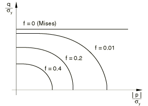
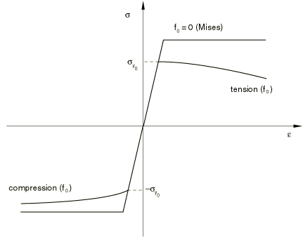
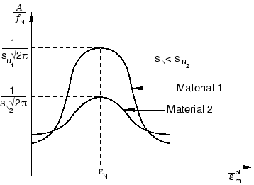
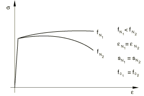

# 23.2.9 多孔金属塑性


**产品：** Abaqus/Standard  Abaqus/Explicit  Abaqus/CAE

##### **参考文献**

- ["材料库：概述，" 第21.1.1节"](pt05ch21s01abo18.md)
- ["非弹性行为，" 第23.1.1节"](pt05ch23s01abo20.md)
- [*POROUS METAL PLASTICITY](../key/key-link.md#usb-kws-mpormetalplas)
- [*POROUS FAILURE CRITERIA](../key/key-link.md#usb-kws-mporfailcriteria)
- [*VOID NUCLEATION](../key/key-link.md#usb-kws-mvoidnucleation)
- ["在"定义塑性，" 第12.9.2节的Abaqus/CAE用户指南中定义多孔金属塑性"](../usi/usi-link.md#usi-prp-mechanical-plastic-porousmetal)

### 概述

多孔金属塑性模型：
- 用于建模相对密度大于0.9的稀孔隙浓度材料；
- 基于Gurson的多孔金属塑性理论（Gurson，1977），包含孔洞形核，在Abaqus/Explicit中还包含失效定义；和
- 基于以单个状态变量（相对密度）表征孔隙率的势函数定义多孔金属的非弹性流动。

### 弹性和塑性行为

您单独指定响应的弹性部分；只能指定线性各向同性弹性（见["线性弹性行为，" 第22.2.1节"](pt05ch22s02abm02.md)）。多孔金属塑性模型不能与多孔弹性结合使用（["多孔材料的弹性行为，" 第22.3.1节"](pt05ch22s03abm05.md)）。

您通过定义金属塑性模型来指定完全致密基体材料的硬化行为（见["经典金属塑性，" 第23.2.1节"](pt05ch23s02abm17.md)）。只能指定各向同性硬化。硬化曲线必须将基体材料的屈服应力描述为基体材料中塑性应变的函数。在有限应变下定义此依赖性时，应给出"真实"（Cauchy）应力和对数应变值。可以对基体材料建模率依赖效应（见["率相关屈服，" 第23.2.3节"](pt05ch23s02abm19.md)）。

### 屈服条件

材料的相对密度r定义为固体材料体积与材料总体积之比。定义模型的关系用孔洞体积分数f表示，定义为孔洞体积与材料总体积之比。因此，f = 1 - r。对于含有稀孔洞浓度的金属，Gurson（1977）提出了以孔洞体积分数为函数的屈服条件。后来被Tvergaard（1981）修改为以下形式：

F = (q¯/σ~m~)^2 + 2 f* q1 cosh(-3/2 q2 p/σ~m~) - (1 + q3 f*^2) = 0

其中 s~ij~ = σ~ij~ + p δ~ij~是Cauchy应力张量的偏量部分；σ¯ = √(3/2 s~ij~ s~ij~)是有效Mises应力；p = -1/3 σ~kk~是静水压力；σ~m~ = σ¯~0~ (ε¯^p^~m~)是完全致密基体材料在基体中等效塑性应变ε¯^p^~m~的函数下的屈服应力；且q1、q2和q3是材料参数。

Cauchy应力定义为每"当前单位面积"上的力，包括孔洞和固体（基体）材料。

f = 0 (r = 1) 意味着材料是完全致密的，Gurson屈服条件简化为Mises屈服条件。f = 1 (r = 0) 意味着材料完全多孔，没有应力承载能力。该模型通常仅在 f* ≤ 0.1 (r ≥ 0.9) 时给出物理上合理的结果。

该模型在["多孔金属塑性，" Abaqus理论指南第4.3.6节](../stm/stm-link.md#stm-mat-pormetalplast)中详细描述，包括其数值实现的讨论。

如果多孔金属塑性模型在孔隙压力分析中使用（见["耦合孔隙流体扩散和应力分析，" 第6.8.1节"](pt03ch06s08at26.md)），相对密度r独立于孔隙比进行跟踪。

#### 指定q1、q2和q3

您直接为多孔金属塑性模型指定参数q1、q2和q3。对于典型金属，文献中报告的参数范围是 q1 = 1.0至1.5，q2 = 1.0，且q3 = q1^2 = 1.0至2.25（见["圆拉伸杆的颈缩，" Abaqus基准指南第1.1.9节](../bmk/bmk-link.md#bmk-anl-neckingtensilebar)）。当q1 = q2 = q3 = 1.0时恢复原始Gurson模型。您可以定义这些参数作为温度和/或场变量的表格函数。

| **输入文件用法：** | ``` [*POROUS METAL PLASTICITY](../key/key-link.md#usb-kws-mpormetalplas) ``` |
| --- | --- |

| **Abaqus/CAE用法：** | 属性模块：材料编辑器：****机械****塑性****多孔金属塑性**** |
| --- | --- |

#### Abaqus/Explicit中的失效准则

Abaqus/Explicit中的多孔金属塑性模型允许失效。在这种情况下，屈服条件写为：

F = (q¯/σ~m~)^2 + 2 f* q1 cosh(-3/2 q2 p/σ~m~) - (1 + q3 f*^2) = 0

其中函数 Φ(f*) 模拟伴随着孔洞聚合的应力承载能力的快速丧失。此函数用孔洞体积分数定义：

Φ(f*) = 1 + (f^N^ - f^N^)/f*c^N^

在上述关系中 f^N^ 是孔洞体积分数的临界值，f*c^是材料完全失去应力承载能力时的孔洞体积分数值。用户指定的参数 f^N^ 和 f*c^ 模拟材料在 f ≥ f^N^ 时由于微骨折和孔洞聚合等机制而发生的失效。当 f = f*c^ 时，材料点发生完全失效。在Abaqus/Explicit中，一旦所有材料点失效，就移除单元。

| **输入文件用法：** | 将以下选项与[*POROUS METAL PLASTICITY*](../key/key-link.md#usb-kws-mpormetalplas)选项结合使用： |
| --- | --- |
|  | ``` [*POROUS FAILURE CRITERIA](../key/key-link.md#usb-kws-mporfailcriteria) ``` |

| **Abaqus/CAE用法：** | 属性模块：材料编辑器：****机械****塑性****多孔金属塑性****：****子选项****多孔失效准则**** |
| --- | --- |

#### 指定初始相对密度

您可以在材料点或节点处指定多孔材料的初始相对密度 r~0~。如果您不指定初始相对密度，Abaqus将为其赋值1.0。

##### 在材料点处

您可以作为多孔金属塑性材料定义的一部分指定初始相对密度。

| **输入文件用法：** | ``` [*POROUS METAL PLASTICITY](../key/key-link.md#usb-kws-mpormetalplas), RELATIVE DENSITY=r~0~ ``` |
| --- | --- |

| **Abaqus/CAE用法：** | 属性模块：材料编辑器：****机械****塑性****多孔金属塑性****：****相对密度：**r~0~ |
| --- | --- |

##### 在节点处

或者，您可以在节点处将初始相对密度指定为初始条件（["Abaqus/Standard和Abaqus/Explicit中的初始条件，" 第34.2.1节"](pt07ch34s02aus116.md)）；这些值被插值到材料点。仅当相对密度未作为多孔金属塑性材料定义的一部分指定时，才应用初始条件。当初始相对密度场在单元边界处出现不连续时，必须使用单独的节点来定义这些边界处的单元，并施加多点约束以使节点位移和旋转等效。

| **输入文件用法：** | ``` [*INITIAL CONDITIONS](../key/key-link.md#usb-kws-minitialcond), TYPE=RELATIVE DENSITY ``` |
| --- | --- |

| **Abaqus/CAE用法：** | Abaqus/CAE不支持初始相对密度。 |
| --- | --- |

### 流动法则和硬化

屈服条件中压力的存在导致非偏量塑性应变。假定塑性流动垂直于屈服面：

dε~ij~^p^ = dλ ∂F/∂σ~ij~

完全致密基体材料的硬化通过 σ~m~ = σ~m~(ε¯^p^~m~) 描述。基体材料中等效塑性应变的演化从以下等效塑性功表达式获得：

σ¯ dε¯^p^ = σ~m~ dε¯^p^~m~

模型在图23.2.9-1中说明，其中显示了p-q平面上不同孔洞体积分数水平的屈服面。

**图23.2.9-1** p-q平面中屈服面的示意图。



图23.2.9-2比较了多孔材料（其初始屈服应力为σ~m~0~）在拉伸和压缩中的行为与理想塑性基体材料的行为。在压缩中，多孔材料由于孔洞闭合而"硬化"，在拉伸中由于孔洞的生长和形核而"软化"。

**图23.2.9-2** 多孔金属单轴行为的示意图（具有初始孔洞体积分数的完美塑性基体材料）。



### 孔洞生长和形核

孔洞体积分数的总变化给出为：

Δf = Δf~growth~ + Δf~nucleation~

其中Δf~growth~是由于现有孔洞生长引起的变化，Δf~nucleation~是由于新孔洞形核引起的变化。现存孔洞的生长基于质量守恒定律，并以孔洞体积分数表示：

Δf~growth~ = (1 - f) Δε~kk~^p^

孔洞的形核由应变控制关系给出：

Δf~nucleation~ = A Δε¯^p^~m~

其中 A = f^N^/(s~N~ √(2π)) exp(-(ε¯^p^~m~ - ε~N~)^2/(2 s~N~^2))

孔洞形核应变具有平均值 ε~N~ 和标准差 s~N~ 的正态分布。f^N^ 是形核孔洞的体积分数，并且孔洞仅在拉伸中形核。

形核函数 A 如图中所示，对于不同的标准差 s~N~ 值具有正态分布。

**图23.2.9-3** 形核函数A。



图23.2.9-4显示了在多孔材料单轴拉伸测试中对于不同的 f^N^ 值的软化程度。

**图23.2.9-4** 软化（在单轴拉伸中）作为 f^N^ 的函数。



文献中报告的典型金属的值范围是：ε~N~ = 0.1至0.3，s~N~ ≈ 0.05至0.1，且 f^N^ = 0.04（见["圆拉伸杆的颈缩，" Abaqus基准指南第1.1.9节](../bmk/bmk-link.md#bmk-anl-neckingtensilebar)）。您指定这些参数，它们可以定义为温度和预定义场变量的表格函数。仅当您在材料定义中包含孔洞形核时，Abaqus才会在拉伸场中包含孔洞形核。

在Abaqus/Standard中，孔洞形核和生长方程隐式积分的准确性通过在自动时间增量方案中规定最大允许时间增量来控制。

| **输入文件用法：** | ``` [*VOID NUCLEATION](../key/key-link.md#usb-kws-mvoidnucleation) ``` |
| --- | --- |

| **Abaqus/CAE用法：** | 属性模块：材料编辑器：****机械****塑性****多孔金属塑性****：****子选项****孔洞形核**** |
| --- | --- |

### 初始条件

当我们需要研究已经经历了一些加工硬化的材料的行为时，Abaqus允许您直接为等效塑性应变ε¯^p^规定初始条件（["Abaqus/Standard和Abaqus/Explicit中的初始条件，" 第34.2.1节"](pt07ch34s02aus116.md)）。

| **输入文件用法：** | ``` [*INITIAL CONDITIONS](../key/key-link.md#usb-kws-minitialcond), TYPE=HARDENING ``` |
| --- | --- |

| **Abaqus/CAE用法：** | 加载模块：****创建预定义场****：****步骤：**初始**，为****类别****选择****机械****，为****所选步骤的类型****选择****硬化**** |
| --- | --- |

#### 在用户子程序中定义初始硬化条件

对于更复杂的情况，可以通过用户子程序[`HARDINI`](../sub/sub-link.md#sub-xsl-hardini)在Abaqus/Standard中定义初始条件。

| **输入文件用法：** | ``` [*INITIAL CONDITIONS](../key/key-link.md#usb-kws-minitialcond), TYPE=HARDENING, USER ``` |
| --- | --- |

| **Abaqus/CAE用法：** | 加载模块：****创建预定义场****：****步骤：**初始**，为****类别****选择****机械****，为****所选步骤的类型****选择****硬化****；****定义：**用户定义**** |
| --- | --- |

### 单元

多孔金属塑性模型可用于除一维单元（梁、管道和桁架单元）或假定应力状态为平面应力的单元（平面应力、壳和膜单元）外的任何应力/位移单元。

### 输出

除了Abaqus中可用的标准输出标识符（["Abaqus/Standard输出变量标识符，" 第4.2.1节"](pt02ch04s02abv01.md)和["Abaqus/Explicit输出变量标识符，" 第4.2.2节"](pt02ch04s02xbv01.md)），以下变量对多孔金属塑性模型具有特殊含义：

| PEEQ | 等效塑性应变，ε¯^p^ = ε¯^p^~0~ + Δε¯^p^，其中ε¯^p^~0~是初始等效塑性应变（零或用户指定；见["初始条件"](pt05ch23s02abm25.md#usb-mat-cpormetalplas-initialcond)"）。 |
| --- | --- |

| VVF | 孔洞体积分数。 |
| --- | --- |

| VVFG | 由于孔洞生长导致的孔洞体积分数。 |
| --- | --- |

| VVFN | 由于孔洞形核导致的孔洞体积分数。 |
| --- | --- |

#### 附加参考

- Gurson, A. L., "Continuum Theory of Ductile Rupture by Void Nucleation and Growth: Part I---Yield Criteria and Flow Rules for Porous Ductile Materials," Journal of Engineering Materials and Technology, vol. 99, pp. 2--15, 1977.
- Tvergaard, V., "Influence of Voids on Shear Band Instabilities under Plane Strain Condition," International Journal of Fracture Mechanics, vol. 17, pp. 389--407, 1981.


