# 23.3.1 扩展Drucker-Prager模型


**产品：** Abaqus/Standard  Abaqus/Explicit  Abaqus/CAE  

##### **参考文献**

- ["材料库：概述，" 第21.1.1节"](pt05ch21s01abo18.md)
- ["非弹性行为，" 第23.1.1节"](pt05ch23s01abo20.md)
- ["率相关屈服，" 第23.2.3节"](pt05ch23s02abm19.md)
- ["率相关塑性：蠕变和肿胀，" 第23.2.4节"](pt05ch23s02abm20.md)
- ["第24章，渐进损伤与失效"](pt05ch24.md)
- [*DRUCKER PRAGER](../key/key-link.md#usb-kws-mdruckerprager)
- [*DRUCKER PRAGER HARDENING](../key/key-link.md#usb-kws-mdruckerhardening)
- [*RATE DEPENDENT](../key/key-link.md#usb-kws-mratedependent)
- [*DRUCKER PRAGER CREEP](../key/key-link.md#usb-kws-mdruckerpragercreep)
- [*TRIAXIAL TEST DATA](../key/key-link.md#usb-kws-mtritestdata)
- ["在"定义塑性，" 第12.9.2节的Abaqus/CAE用户指南中定义Drucker-Prager塑性"](../usi/usi-link.md#usi-prp-mechanical-plastic-druckerprager)

### 概述

扩展Drucker-Prager模型：
- 用于建模摩擦材料，这类材料通常是颗粒状土壤和岩石，表现出压力相关的屈服（材料随压力增加而变强）；
- 用于建模压缩屈服强度大于拉伸屈服强度的材料，如复合材料和聚合物材料中常见的那些；
- 允许材料各向同性硬化和/或软化；
- 通常允许体积变化与非弹性行为：定义非弹性应变增量的流动法则允许同时发生非弹性膨胀和非弹性剪切；
- 如果材料表现出长期非弹性变形，则在Abaqus/Standard中可包含蠕变；
- 可定义为对应变率敏感，这在聚合物材料中很常见；
- 可与弹性材料模型（["线性弹性行为，" 第22.2.1节"](pt05ch22s02abm02.md)）结合使用，或者在Abaqus/Standard中（如果不定义蠕变）与多孔弹性材料模型（["多孔材料的弹性行为，" 第22.3.1节"](pt05ch22s03abm05.md)）结合使用；
- 可与状态方程模型（["状态方程，" 第25.2.1节"](pt05ch25s02abm50.md)）结合使用来描述Abaqus/Explicit中材料的流体动力学响应；
- 可与渐进损伤和失效模型（["韧性金属的损伤与失效：概述，" 第24.2.1节"](pt05ch24s02abm41.md)）结合使用，以指定不同的损伤起始标准和损伤演化定律，从而允许材料刚度的渐进退化以及从网格中移除单元；和
- 旨在模拟基本单调加载条件下的材料响应。

### 屈服条件

这类模型的屈服条件基于屈服面在子午面上的形状。屈服面可以是线性形式、双曲形式或一般指数形式。这些曲面在[图23.3.1-1](pt05ch23s03abm30.md#cdruckprag-yield-merid)中说明。本节后面将定义三种相关屈服条件中的应力不变量和其他项。

**图23.3.1-1** 子午面上的屈服面。


线性模型（[图23.3.1-1](pt05ch23s03abm30.md#cdruckprag-yield-merid)a）在偏量平面（平面）中提供可能非圆形的屈服面，以匹配三轴拉伸和压缩中的不同屈服值、偏量平面中的相关非弹性流动以及单独的膨胀和摩擦角。输入数据参数定义屈服面和流动面在子午面和偏量平面中的形状，以及非弹性行为的其他特征，从而提供一系列简单理论——原始Drucker-Prager模型可在该模型中使用。但是，如本节后面所述，该模型无法提供与Mohr-Coulomb行为的紧密匹配。

双曲和一般指数模型在偏量应力平面中使用von Mises（圆形）截面。在子午面上，两个模型都使用双曲流动势，这通常意味着非关联流动。

模型的选择主要取决于分析类型、材料类型、可用于模型参数校准的实验数据以及材料可能经历的压力应力值范围。通常有两种类型的三角测试数据：不同围压水平下的三角测试数据，或已经用内聚力和摩擦角校准的测试数据，有时还有三轴拉伸强度值。如果有三角测试数据，则必须首先校准材料参数。线性模型拟合这些测试数据的准确性受到其假设偏量应力对压力应力呈线性依赖的限制。虽然双曲模型在高围压下做出类似的假设，但它在低围压下提供偏量应力与压力应力之间的非线性关系，这可能更好地匹配三轴实验数据。双曲模型适用于有可用三轴压缩和三轴拉伸数据的脆性材料，这对于岩石等材料是常见情况。三种屈服条件中最通用的是指数形式。该标准在匹配三轴测试数据方面提供最大的灵活性。Abaqus直接从三轴测试数据确定该模型所需的材料参数。使用最小二乘法最小化应力相对误差来进行此拟合。

对于实验数据已经用内聚力和摩擦角校准的情况，可以使用线性模型。如果为Mohr-Coulomb模型提供了这些参数，则需要将它们转换为Drucker-Prager参数。线性模型主要用于应力主要为压应力的应用。如果拉应力显著，则应提供静水拉力数据（连同内聚力和摩擦角），并应使用双曲模型。

这些模型的校准将在本节后面讨论。

### 硬化和率相关性

对于颗粒材料，这些模型通常用作失效面，因为材料在应力达到屈服时可能表现出无限流动。这种行为称为理想塑性。这些模型还提供各向同性硬化。在这种情况下，塑性流动导致屈服面相对于所有应力方向均匀改变大小。该硬化模型适用于涉及整体塑性应变的情况，或者在分析过程中每个点处的应变在应变空间中基本上沿相同方向进行的情况。虽然该模型被称为各向同性"硬化"模型，但可以定义应变软化，或硬化后跟随软化。

随着应变率的增加，许多材料显示屈服强度增加。当应变率在0.1到1每秒之间时，这种效应在许多聚合物中变得重要；对于应变率在10到100每秒之间的情况，这可能非常重要，这是高能动态事件或制造过程的特征。该效应在颗粒材料中通常不那么重要。屈服面随塑性变形的演化用等效应力 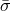 描述，可以选择其作为单轴压缩屈服应力、单轴拉伸屈服应力或剪切（内聚）屈服应力：

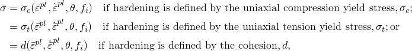

其中


是等效塑性应变率，对于线性Drucker-Prager模型定义为


=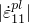 如果硬化以单轴压缩定义；


=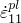 如果硬化以单轴拉伸定义；


=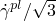 如果硬化以纯剪切定义，

对于双曲和指数Drucker-Prager模型定义为


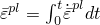

是等效塑性应变；


是温度；和


是其他预定义场变量。

函数依赖性  包括硬化以及率相关效应。材料数据可以直接以表格形式输入，或者基于屈服应力比与静态关系相关联。

此处描述的率相关性最适合Abaqus/Standard中的中高速事件。低变形率下的时间依赖非弹性变形可以用蠕变模型更好地表示。这种非弹性变形可以与率无关塑性变形共存，将在本节后面描述。但是，Abaqus/Standard材料定义中存在蠕变会排除使用此处描述的率相关性。

使用Drucker-Prager材料模型时，Abaqus允许您通过定义初始等效塑性应变值来规定初始硬化，如下面连同有关初始条件使用的其他详细信息所述。

#### 直接表格数据

将测试数据作为不同等效塑性应变率下屈服应力值与等效塑性应变的关系表输入；每个应变率一个表。压缩数据在地材料中更常见，而拉伸数据通常可用于聚合物材料。输入这些数据的指南在["率相关屈服，" 第23.2.3节"](pt05ch23s02abm19.md)中提供。

| **输入文件用法：** | ``` [*DRUCKER PRAGER HARDENING](../key/key-link.md#usb-kws-mdruckerhardening), RATE= ``` |
| --- | --- |

| **Abaqus/CAE用法：** | 属性模块：材料编辑器：****机械****塑性****Drucker Prager****：****子选项****Drucker Prager硬化****：切换打开****使用应变率相关数据** |
| --- | --- |

#### 屈服应力比

或者，假设应变率行为是可分离的，因此应力-应变依赖性在所有应变率下是相似的：


其中  是静态应力-应变行为，且 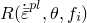 是非零应变率下的屈服应力与静态屈服应力之比（因此 ）。

在Abaqus中提供了两种方法来定义 *R*：指定过应力幂律，或将变量 *R* 直接定义为  的表格函数。

##### 过应力幂律

Cowper-Symonds过应力幂律具有以下形式


其中  和  是材料参数，可以是温度和可能的其他预定义场变量的函数。

| **输入文件用法：** | 使用以下两个选项： |
| --- | --- |
|  | ``` [*DRUCKER PRAGER HARDENING](../key/key-link.md#usb-kws-mdruckerhardening) [*RATE DEPENDENT](../key/key-link.md#usb-kws-mratedependent), TYPE=POWER LAW ``` |

| **Abaqus/CAE用法：** | 属性模块：材料编辑器：****机械****塑性****Drucker Prager****：****子选项****Drucker Prager硬化****；****子选项****率相关****：****硬化：幂律** |
| --- | --- |

##### 表格函数

当 *R* 直接输入时，它作为等效塑性应变率、；温度、；和预定义场变量、 的表格函数输入。

| **输入文件用法：** | 使用以下两个选项： |
| --- | --- |
|  | ``` [*DRUCKER PRAGER HARDENING](../key/key-link.md#usb-kws-mdruckerhardening) [*RATE DEPENDENT](../key/key-link.md#usb-kws-mratedependent), TYPE=YIELD RATIO ``` |

| **Abaqus/CAE用法：** | 属性模块：材料编辑器：****机械****塑性****Drucker Prager****：****子选项****Drucker Prager硬化****；****子选项****率相关****：****硬化：屈服比** |
| --- | --- |

##### Johnson-Cook率相关性

Johnson-Cook率相关性具有以下形式

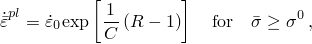

其中  和 *C* 是不依赖于温度的材料常数，并且假设不依赖于预定义场变量。

| **输入文件用法：** | ``` [*DRUCKER PRAGER HARDENING](../key/key-link.md#usb-kws-mdruckerhardening) [*RATE DEPENDENT](../key/key-link.md#usb-kws-mratedependent), TYPE=JOHNSON COOK ``` |
| --- | --- |

| **Abaqus/CAE用法：** | 属性模块：材料编辑器：****机械****塑性****Drucker Prager****：****子选项****Drucker Prager硬化****；****子选项****率相关****：****硬化：Johnson-Cook** |
| --- | --- |

### 应力不变量

屈服应力面利用两个不变量，定义为等效压力应力，


和Mises等效应力，

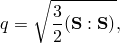

其中  是应力偏量，定义为


此外，线性模型还使用偏量应力的第三个不变量，

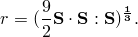

### 线性Drucker-Prager模型

线性模型用所有三个应力不变量表示。它在偏量平面中提供可能非圆形的屈服面，以匹配三轴拉伸和压缩中的不同屈服值、偏量平面中的相关非弹性流动以及单独的膨胀和摩擦角。

#### 屈服条件

线性Drucker-Prager条件（见[图23.3.1-1](pt05ch23s03abm30.md#cdruckprag-yield-merid)a）写为


其中


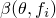

是 *p*–*t* 应力平面上线性屈服面的斜率，通常称为材料的摩擦角；

*d*

是材料的内聚力；和


是三轴拉伸屈服应力与三轴压缩屈服应力之比，从而控制屈服面对中间主应力值的依赖性（见[图23.3.1-2](pt05ch23s03abm30.md#cdruckprag-yield-dev)）。

**图23.3.1-2** 线性模型在偏量平面中的典型屈服/流动面。


在以单轴压缩定义硬化的情况下，线性屈服条件不允许摩擦角  71.5（ 3），这对于实际材料来说不太可能是限制。

当 ，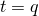 时，这意味着屈服面在偏量主应力平面（平面）中是von Mises圆，其中三轴拉伸和压缩中的屈服应力相同。为了确保屈服面保持凸性，需要 。

材料的内聚力 *d* 与输入数据的关系为


#### 塑性流动

*G* 是流动势，在此模型中选择为

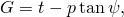

其中  是 *p*–*t* 平面中的膨胀角。 的几何解释在[图23.3.1-3](pt05ch23s03abm30.md#cdruckprag-lin-yield-p-t)的 *p*–*t* 图中显示。在以单轴压缩定义硬化的情况下，此流动规则定义不允许膨胀角  71.5（ 3）。此限制不被视为限制，因为实际材料不太可能出现这种情况。

**图23.3.1-3** 线性Drucker-Prager模型：*p*–*t* 平面中的屈服面和流动方向。


对于颗粒材料，线性模型通常在 *p*–*t* 平面中使用非关联流动，这意味着流动假设在  平面中垂直于屈服面，但在 *p*–*t* 平面中与 *t* 轴成角度 ，如图[图23.3.1-3](pt05ch23s03abm30.md#cdruckprag-lin-yield-p-t)所示。通过设置  得到关联流动。通过设置  和  可以获得原始Drucker-Prager模型。当模型用于聚合物材料时，通常也假设非关联流动。如果 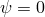，则非弹性变形是不可压缩的；如果 ，则材料膨胀。因此， 被称为膨胀角。

流动势与线性模型增量塑性应变之间的关系在["颗粒或聚合物行为的模型，" Abaqus理论指南第4.4.2节](../stm/stm-link.md#stm-mat-granularpoly)中详细讨论。

| **输入文件用法：** | ``` [*DRUCKER PRAGER](../key/key-link.md#usb-kws-mdruckerprager), SHEAR CRITERION=LINEAR ``` |
| --- | --- |

| **Abaqus/CAE用法：** | 属性模块：材料编辑器：****机械****塑性****Drucker Prager****：****剪切准则：线性** |
| --- | --- |

#### 非关联流动

非关联流动意味着材料刚度矩阵不是对称的；因此，应在Abaqus/Standard中使用非对称矩阵存储和求解方案（见["定义分析，" 第6.1.2节"](pt03ch06s01abo05.md)）。如果  和  之间的差异不大，并且发生非弹性变形的模型区域受到限制，则材料刚度矩阵的对称近似可能给出可接受的收敛速度，可能不需要非对称矩阵方案。

### 双曲和一般指数模型

可用的双曲和一般指数模型仅用前两个应力不变量表示。

#### 双曲屈服条件

双曲屈服条件是Rankine（拉伸截止）的最大拉应力条件与高围压下线性Drucker-Prager条件的连续组合。它写为

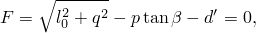

其中  和


是材料的初始静水拉伸强度；

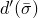

是硬化参数；


是 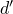 的初始值；和


是在高围压下测量的摩擦角，如图[图23.3.1-1](pt05ch23s03abm30.md#cdruckprag-yield-merid)(b)所示。

硬化参数  可从测试数据中获得，如下所示：


该模型中假设的各向同性硬化将  视为相对于应力为常数，如图[图23.3.1-4](pt05ch23s03abm30.md#cdruckprag-hyper-yield-p-q)所示。

**图23.3.1-4** 双曲模型：*p*–*q* 平面中的屈服面和硬化。


| **输入文件用法：** | ``` [*DRUCKER PRAGER](../key/key-link.md#usb-kws-mdruckerprager), SHEAR CRITERION=HYPERBOLIC ``` |
| --- | --- |

| **Abaqus/CAE用法：** | 属性模块：材料编辑器：****机械****塑性****Drucker Prager****：****剪切准则：双曲** |
| --- | --- |

#### 一般指数屈服条件

一般指数形式提供了此类模型中最通用的屈服条件。屈服函数写为

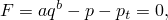

其中

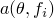 和 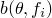

是不依赖于塑性变形的材料参数；和


是硬化参数，表示材料的静水拉伸强度，如图[图23.3.1-1](pt05ch23s03abm30.md#cdruckprag-yield-merid)(c)所示。

 与输入测试数据的关系为

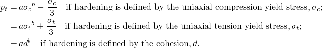

该模型中假设的各向同性硬化将 *a* 和 *b* 视为相对于应力为常数，如图[图23.3.1-5](pt05ch23s03abm30.md#cdruckprag-expon-yield-p-q)所示。

**图23.3.1-5** 一般指数模型：*p*–*q* 平面中的屈服面和硬化。

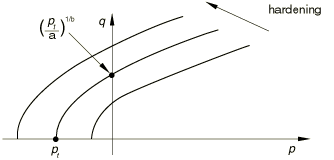

可以直接给出材料参数 *a* 和 *b*。或者，如果有不同围压水平的三轴测试数据，Abaqus将从三轴测试数据中确定材料参数，如下所述。

| **输入文件用法：** | ``` [*DRUCKER PRAGER](../key/key-link.md#usb-kws-mdruckerprager), SHEAR CRITERION=EXPONENT FORM ``` |
| --- | --- |

| **Abaqus/CAE用法：** | 属性模块：材料编辑器：****机械****塑性****Drucker Prager****：****剪切准则：指数形式** |
| --- | --- |

#### 塑性流动

*G* 是流动势，在这些模型中选择为双曲函数：


其中


是在高围压下在 *p*–*q* 平面中测量的膨胀角；


是初始屈服应力，取自用户指定的Drucker-Prager硬化数据；和


是一个参数，称为偏心率，定义函数接近渐近线的速率（当偏心率趋于零时，流动势趋于直线）。

为  提供了合适的默认值，如下所述。 的值将取决于所使用的屈服应力。

此流动势是连续且光滑的，确保流动方向始终被唯一确定。该函数在高围压应力下渐近地接近线性Drucker-Prager流动势，并在90度处与静水压力轴相交。[图23.3.1-6](pt05ch23s03abm30.md#cdruckprag-expon-fam-p-q)显示了子午应力面中的一族双曲势。流动势是偏量应力平面（平面）中的von Mises圆。

**图23.3.1-6** *p*–*q* 平面中的一族双曲流动势。

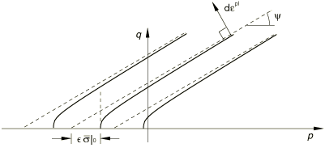

对于双曲模型，如果膨胀角  和材料摩擦角  不同，则在 *p*–*q* 平面中流动是非关联的。仅当  和  时，双曲模型在 *p*–*q* 平面中提供关联流动。如果流动势与双曲模型一起使用，则假定默认值 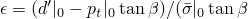，以便当  时恢复关联流动。

对于一般指数模型，在 *p*–*q* 平面中流动始终是非关联的。默认流动势偏心率为 ，这意味着材料在很宽范围的围压应力值下具有几乎相同的膨胀角。增加  的值为流动势提供更多曲率，这意味着随着围压减小，膨胀角增加更快。如果材料在低围压下受到约束，则  值显著小于默认值可能导致收敛问题，这是因为流动势在局部与 *p* 轴相交处非常紧密的曲率。

流动势与双曲和一般指数模型的增量塑性应变之间的关系在["颗粒或聚合物行为的模型，" Abaqus理论指南第4.4.2节](../stm/stm-link.md#stm-mat-granularpoly)中详细讨论。

#### 非关联流动

非关联流动意味着材料刚度矩阵不是对称的；因此，应在Abaqus/Standard中使用非对称矩阵存储和求解方案（见["定义分析，" 第6.1.2节"](pt03ch06s01abo05.md)）。如果双曲模型中  和  之间的差异不大，并且发生非弹性变形的模型区域受到限制，则材料刚度矩阵的对称近似可能给出可接受的收敛速度。在这种情况下，可能不需要非对称矩阵方案。

### 渐进损伤和失效

在Abaqus/Explicit中，扩展Drucker-Prager模型可与["韧性金属的损伤与失效：概述，" 第24.2.1节"](pt05ch24s02abm41.md)中讨论的渐进损伤和失效模型结合使用。该能力允许指定一个或多个损伤起始标准，包括韧性、剪切、成形极限图（FLD）、成形极限应力图（FLSD）和Mschenborn-Sonne成形极限图（MSFLD）标准。损伤起始后，材料刚度根据指定的损伤演化响应逐步退化。该模型提供两种失效选择，包括由于结构撕裂或切割而从网格中移除单元。渐进损伤模型允许材料刚度的平滑退化，使其适用于准静态和动态情况。

| **输入文件用法：** | 使用以下选项： |
| --- | --- |
|  | ``` [*DAMAGE INITIATION](../key/key-link.md#usb-kws-mdamageinitiation) [*DAMAGE EVOLUTION](../key/key-link.md#usb-kws-mdamageevolution) ``` |

| **Abaqus/CAE用法：** | 属性模块：材料编辑器：****机械****韧性金属损伤*****损伤起始类型****：指定损伤起始标准：****子选项****损伤演化****：指定损伤演化参数 |
| --- | --- |

### 匹配实验三轴测试数据

地质材料的数据最通常来自三轴测试。在这样的测试中，样品被压力应力约束，在测试期间保持恒定。加载是沿一个方向施加的额外拉伸或压缩应力。典型结果包括不同围压水平下的应力-应变曲线，如图[图23.3.1-7](pt05ch23s03abm30.md#cdruckprag-triaxial-test)所示。

**图23.3.1-7** 不同围压水平下典型地质材料的三轴测试及应力-应变曲线。


为了校准此类模型的屈服参数，您需要决定将使用每个应力-应变曲线上的哪个点进行校准。例如，如果您希望校准初始屈服面，则应使用每个应力-应变曲线上对应于初始偏离弹性行为的点。或者，如果您希望校准极限屈服面，则应使用每个应力-应变曲线上对应于峰值应力的点。

来自不同围压水平下每个应力-应变曲线的一个应力数据点被绘制在子午应力面中（如果使用线性模型，则为 *p*–*t* 平面；如果使用双曲或一般指数模型，则为 *p*–*q* 平面）。该技术校准屈服面的形状和位置，如图[图23.3.1-8](pt05ch23s03abm30.md#cdruckprag-match-merid)所示，如果将其用作失效面（理想塑性），则足以定义模型。

**图23.3.1-8** 子午面上的屈服面。


这些模型也可用于各向同性硬化，在这种情况下，需要硬化数据来完成校准。在各向同性硬化模型中，塑性流动导致屈服面均匀改变大小；换言之，[图23.3.1-7](pt05ch23s03abm30.md#cdruckprag-triaxial-test)中描绘的应力-应变曲线中只有一条可用于表示硬化。应选择最能准确表示预期加载条件范围的硬化的曲线（通常是平均预期压力应力值的曲线）。

如前所述，地质材料通常有两种类型的三角测试数据。在三轴压缩测试中，样品被压力约束，然后在一个方向上叠加额外的压缩应力。因此，主应力都是负的，（[图23.3.1-9](pt05ch23s03abm30.md#cdruckprag-tri-comp-ten)a）。在前面的不等式中，、 和  分别是最大、中间和最小主应力。

**图23.3.1-9** a) 三轴压缩和 b) 三轴拉伸。


应力不变量的值为

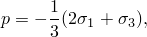


和

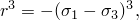

所以

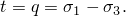

因此，三轴压缩结果可以绘制在[图23.3.1-8](pt05ch23s03abm30.md#cdruckprag-match-merid)所示的子午面中。

#### 线性Drucker-Prager模型

通过三轴压缩结果拟合最佳直线，提供线性Drucker-Prager模型的  和 *d*。

还需要三轴拉伸数据来定义线性Drucker-Prager模型中的 *K*。在三轴拉伸下，样品再次被压力约束，然后在一个方向上降低压力。在这种情况下，主应力为 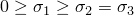（[图23.3.1-9](pt05ch23s03abm30.md#cdruckprag-tri-comp-ten)b）。

应力不变量现在是

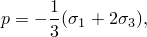


和


所以

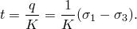

因此，可以通过将这些测试结果绘制为 *q* 对 *p* 的关系，然后再次拟合最佳直线来找到 *K*。三轴压缩和拉伸线必须在 *p* 轴上的同一点处截距，并且在同一 *p* 值下三轴拉伸和压缩的 *q* 值之比给出 *K*（[图23.3.1-10](pt05ch23s03abm30.md#cdruckprag-lin-fit-comp-ten)）。

**图23.3.1-10** 线性模型：拟合三轴压缩和拉伸数据。


#### 双曲模型

通过高围压下的三轴压缩结果拟合最佳直线，提供双曲模型的  和 。该拟合以与获得线性Drucker-Prager模型的  和 *d* 相同的方式进行。此外，需要静水拉伸数据来完成双曲模型的校准，以便可以定义初始静水拉伸强度 。

#### 一般指数模型

给定子午面上的三轴数据，Abaqus提供了一种能力来确定指数模型所需的材料参数 *a*、*b* 和 。这些参数基于不同围压水平下三轴测试数据的"最佳拟合"来确定。使用最小二乘法最小化应力相对误差来获得 *a*、*b* 和  的"最佳拟合"值。该能力允许校准所有三个参数，或者如果某些参数是已知的，则仅校准剩余参数。如果只有很少的数据点可用，这种能力是有用的，在这种情况下，您可能希望拟合数据点的最佳直线（）（有效地将模型简化为线性Drucker-Prager模型）。部分校准在低围压下三轴测试数据不可靠或不可用的情况下也很有用，这对于无内聚力材料通常是情况。在这种情况下，如果指定  的值并且仅校准 *a* 和 *b*，则可以获得更好的拟合。

数据必须以主应力 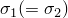 和  的形式提供，其中  是围压，应力  是加载方向的应力。必须遵循Abaqus符号约定，其中拉应力为正，压应力为负。必须从每个三轴测试中输入一对应力。可以从不同围压水平的三轴测试中输入任意数量的数据点。

如果指数模型用作失效面（理想塑性），则不必指定Drucker-Prager硬化行为。然后将从校准获得的静水拉伸强度  用作失效应力。但是，如果与三轴测试数据一起指定了Drucker-Prager硬化行为，则将从校准获得的  值被忽略。在这种情况下，Abaqus将直接从硬化数据中插值 。

| **输入文件用法：** | 使用以下两个选项： |
| --- | --- |
|  | ``` [*DRUCKER PRAGER](../key/key-link.md#usb-kws-mdruckerprager), SHEAR CRITERION=EXPONENT FORM, TEST DATA [*TRIAXIAL TEST DATA](../key/key-link.md#usb-kws-mtritestdata) ``` |

| **Abaqus/CAE用法：** | 属性模块：材料编辑器：****机械****塑性****Drucker Prager****：****剪切准则：指数形式**，切换打开****使用子选项三轴测试数据****，并选择****子选项****三轴测试数据**** |
| --- | --- |

### 将Mohr-Coulomb参数匹配到Drucker-Prager模型

有时实验数据不是直接可用的。相反，您会获得Mohr-Coulomb模型的内聚力和摩擦角值。在这种情况下，最简单的方法是使用Mohr-Coulomb模型（见["Mohr-Coulomb塑性，" 第23.3.3节"](pt05ch23s03abm32.md)）。在某些情况下，可能需要使用Drucker-Prager模型而不是Mohr-Coulomb模型（例如当需要考虑率效应时），在这种情况下，我们需要计算Drucker-Prager模型参数的值以提供与Mohr-Coulomb参数的合理匹配。

Mohr-Coulomb失效模型基于在最大和最小主应力平面中绘制失效时应力状态的Mohr圆。失效线是触及这些Mohr圆的最佳直线（[图23.3.1-11](pt05ch23s03abm30.md#cdruckprag-mohr-coul)）。

**图23.3.1-11** Mohr-Coulomb失效模型。


因此，Mohr-Coulomb模型由下式定义


其中  在压缩中为负。从Mohr圆，


代入  和 ，两边乘以 ，并简化，Mohr-Coulomb模型可以写为


其中


是最大主应力  和最小主应力  之差的一半（因此是最大剪切应力），


是最大和最小主应力的平均值，且  是摩擦角。因此，该模型假设偏量应力和压力应力之间存在线性关系，因此，可以由Abaqus提供的线性或双曲Drucker-Prager模型匹配。

Mohr-Coulomb模型假设失效与中间主应力的值无关，但Drucker-Prager模型则不然。典型土工材料的失效通常包括对中间主应力的一些小依赖，但Mohr-Coulomb模型通常被认为对大多数应用足够准确。该模型在偏量平面中有顶点（见[图23.3.1-12](pt05ch23s03abm30.md#cdruckprag-mohr-coul-dev)）。

**图23.3.1-12** 偏量平面中的Mohr-Coulomb模型。

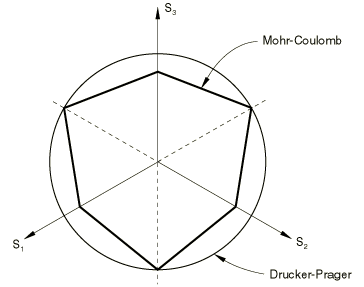

这意味着，每当应力状态有两个相等的主应力值时，流动方向可能会随着应力的微小变化或无变化而显著改变。Abaqus中当前可用的模型都无法提供这种行为；即使在Mohr-Coulomb模型中，流动势也是光滑的。这个限制通常不是涉及类Coulomb材料的大多数设计计算中的关键问题，但它会限制计算的准确性，特别是在流动局部化重要的情况下。

#### 匹配平面应变响应

平面应变问题在土工分析中经常遇到；例如，长隧道、基础和路堤。因此，构型模型参数通常被匹配为在平面应变中提供相同的流动和失效响应。

下面描述的匹配过程是根据线性Drucker-Prager模型进行的，但也适用于高围压水平下的双曲模型。

线性Drucker-Prager流动势将塑性应变增量定义为

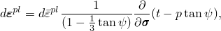

其中 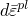 是等效塑性应变增量。因为我们只希望在单一平面中匹配行为，我们可以取 ，这意味着 。因此，


将该表达式写为主应力形式，提供

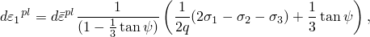

关于 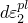 和 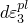 有类似的表达式。假设在1方向为平面应变。在极限载荷下我们必须有 ，这提供了约束


使用此约束，我们可以将 *q* 和 *p* 重写为变形平面中的主应力  和  的函数：


和


利用这些表达式，Drucker-Prager屈服面可以写成  和  的函数：


Mohr-Coulomb屈服面在  平面中为


通过比较，

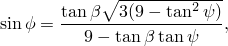

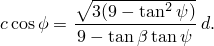

这些关系提供了平面应变中Mohr-Coulomb材料参数与线性Drucker-Prager材料参数之间的匹配。考虑流动定义的两个极端情况：关联流动，，和非膨胀流动，当 。对于关联流动

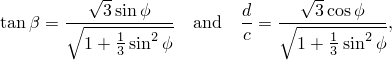

对于非膨胀流动


在任何一种情况下， 可立即获得为

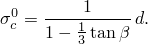

这两种方法之间的差异随着摩擦角的增加而增加；但是，对于典型摩擦角，结果差异不大，如[表23.3.1-1](pt05ch23s03abm30.md#table-drucker-matching)所示。

**表23.3.1-1** 平面应变中Drucker-Prager和Mohr-Coulomb模型的匹配。

| Mohr-Coulomb摩擦角， | 关联流动 | 非膨胀流动 |
| --- | --- | --- |
| Drucker-Prager摩擦角， | 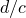 | Drucker-Prager摩擦角， |  |
| 10 | 16.7 | 1.70 | 16.7 | 1.70 |
| 20 | 30.2 | 1.60 | 30.6 | 1.63 |
| 30 | 39.8 | 1.44 | 40.9 | 1.50 |
| 40 | 46.2 | 1.24 | 48.1 | 1.33 |
| 50 | 50.5 | 1.02 | 53.0 | 1.11 |

["颗粒材料的极限载荷计算，" Abaqus基准指南第1.15.4节](../bmk/bmk-link.md#bmk-anl-granularlimitload)，和["颗粒材料的弹性-塑性有限变形，" Abaqus基准指南第1.15.5节](../bmk/bmk-link.md#bmk-anl-deformgranulartmat)，展示了使用Drucker-Prager和Mohr-Coulomb模型对颗粒材料简单加载响应的比较，使用平面应变方法匹配两个模型的参数。

#### 匹配三轴测试响应

将Mohr-Coulomb和Drucker-Prager模型参数与低摩擦角材料匹配的另一种方法是使两个模型在三轴压缩和拉伸中提供相同的失效定义。以下匹配过程仅适用于线性Drucker-Prager模型，因为这是此类模型中唯一允许在三轴压缩和拉伸中不同屈服值的模型。

我们可以将Mohr-Coulomb模型重写为主应力形式：


使用上述三轴压缩和拉伸中应力不变量 *p*、*q* 和 *r* 的结果，允许将线性Drucker-Prager模型写为三轴压缩形式：

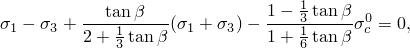

对于三轴拉伸为


我们希望使这些表达式对于所有  值与Mohr-Coulomb模型相同。这可以通过设置

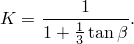

来实现。通过比较Mohr-Coulomb模型与线性Drucker-Prager模型，

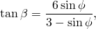


因此，从之前的结果

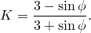

这些 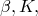 和  的结果提供了在线性和三轴拉伸中匹配Mohr-Coulomb模型的Drucker-Prager参数。

线性Drucker-Prager模型中 *K* 的值被限制为 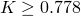，以使屈服面保持凸性。*K* 的结果表明这意味着 。许多实际材料的Mohr-Coulomb摩擦角大于此值。在这种情况下的一种方法是选择 ，然后使用剩余方程来定义  和 。这种方法仅在三轴压缩中匹配模型，同时提供模型能够提供的与中间主应力无关的失效的最接近近似。如果  显著大于22，这种方法可能提供差的Drucker-Prager匹配Mohr-Coulomb参数。因此，通常不建议使用此匹配过程；而是使用Mohr-Coulomb模型。

在使用单元测试验证模型校准时，应注意Abaqus输出变量SP1、SP2和SP3分别对应于主应力 、 和 。

### 线性Drucker-Prager模型的蠕变模型

可以在Abaqus/Standard中定义根据扩展Drucker-Prager模型表现为塑性的材料的经典"蠕变"行为。此类材料中的蠕变行为与塑性行为密切相关（通过蠕变流动势的定义和测试数据定义），因此Drucker-Prager塑性和Drucker-Prager硬化必须包含在材料定义中。

蠕变和塑性可以同时激活，在这种情况下，生成的方程以耦合方式求解。要仅对蠕变进行建模（没有率无关塑性变形），应在Drucker-Prager硬化定义中提供大的屈服应力值：结果是材料在蠕变时遵循Drucker-Prager模型，而永远不会屈服。使用此技术时，还必须为偏心率定义一个值，因为如下所述，初始屈服应力和偏心率都会影响蠕变势。此能力仅限于偏量应力平面中具有von Mises（圆形）截面的线性模型（；即不考虑第三个应力不变量效应），并且只能与线性弹性结合使用。

扩展Drucker-Prager模型定义的蠕变行为仅在土壤固结、耦合温度-位移和瞬态准静态过程中激活。

#### 蠕变公式

蠕变势是双曲的，类似于双曲和一般指数塑性模型中使用的塑性流动势。如果在Abaqus/Standard中定义了蠕变属性，则线性Drucker-Prager塑性模型也使用双曲塑性流动势。因此，如果运行两个分析，一个不激活蠕变，另一个指定蠕变属性但产生几乎为零的蠕变流动，则塑性解决方案不会完全相同：不激活蠕变的解决方案使用线性塑性势，而激活蠕变的解决方案使用双曲塑性势。

##### 等效蠕变面和等效蠕变应力

我们采用存在蠕变等值面的概念，即共享相同蠕变"强度"的应力点，用等效蠕变应力测量。当材料发生塑性化时，希望等效蠕变面与屈服面重合；因此，我们通过均匀缩小屈服面来定义等效蠕变面。在 *p*–*q* 平面中，这转化为屈服面的平行线，如图[图23.3.1-13](pt05ch23s03abm30.md#cdruckprag-equiv-creep)所示。

**图23.3.1-13** 定义为剪切应力的等效蠕变应力。


Abaqus/Standard要求蠕变属性用与定义加工硬化属性相同类型的数据描述。等效蠕变应力  然后按如下方式确定：


[图23.3.1-13](pt05ch23s03abm30.md#cdruckprag-equiv-creep)显示了当材料属性为剪切状态（应力 *d*）时如何确定等效点。这些概念的一个结果是，在 *p*–*q* 空间中有一个锥体，其中蠕变不激活，因为该锥体内的任何点都会有负的等效蠕变应力。

##### 蠕变流动

在Abaqus/Standard中，蠕变应变率假设遵循与塑性应变率相同的双曲势（见[图23.3.1-6](pt05ch23s03abm30.md#cdruckprag-expon-fam-p-q)）：

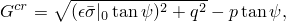

其中


是在高围压下在 *p*–*q* 平面中测量的膨胀角；


是取自用户指定的Drucker-Prager硬化数据的初始屈服应力；和


是一个参数，称为偏心率，定义函数接近渐近线的速率（当偏心率趋于零时，蠕变势趋于直线）。

为  提供了合适的默认值，如下所述。此蠕变势是连续且光滑的，确保蠕变流动方向始终被唯一确定。该函数在高围压应力下渐近地接近线性Drucker-Prager流动势，并在90度处与静水压力轴相交。[图23.3.1-6](pt05ch23s03abm30.md#cdruckprag-expon-fam-p-q)显示了子午应力面中的一族双曲势。蠕变势是偏量应力平面（平面）中的von Mises圆。

默认蠕变势偏心率为 ，这意味着材料在很宽范围的围压应力值下具有几乎相同的膨胀角。增加  的值为蠕变势提供更多曲率，这意味着随着围压减小，膨胀角增加。如果材料在低围压下受到约束，则  值显著小于默认值可能导致收敛问题，这是因为蠕变势在局部与 *p* 轴相交处非常紧密的曲率。有关这些模型行为的详细信息，请参阅["蠕变积分验证，" Abaqus基准指南第3.2.6节](../bmk/bmk-link.md#bmk-mat-creep)。

如果蠕变材料属性是通过压缩测试定义的，则对于非常低的应力值可能会出现数值问题。Abaqus/Standard保护这种情况，如["颗粒或聚合物行为的模型，" Abaqus理论指南第4.4.2节](../stm/stm-link.md#stm-mat-granularpoly)中所述。

##### 非关联流动

使用与等效蠕变面不同的蠕变势意味着材料刚度矩阵不是对称的；因此，应使用非对称矩阵存储和求解方案（见["定义分析，" 第6.1.2节"](pt03ch06s01abo05.md)）。如果  和  之间的差异不大，并且发生非弹性变形的模型区域受到限制，则材料刚度矩阵的对称近似可能给出可接受的收敛速度，可能不需要非对称矩阵方案。

#### 指定蠕变定律

在Abaqus/Standard中，通过指定等效"单轴行为"——蠕变"定律"来完成蠕变行为的定义。在许多实际情况下，蠕变"定律"是通过用户子程序[`CREEP`](../sub/sub-link.md#sub-xsl-creep)定义的，因为蠕变定律通常具有非常复杂的形式来拟合实验数据。为一些简单的情况提供了数据输入方法，包括幂律模型的两种形式和Singh-Mitchell定律的变体。

##### 用户子程序[`CREEP`](../sub/sub-link.md#sub-xsl-creep)

用户子程序[`CREEP`](../sub/sub-link.md#sub-xsl-creep)为在Abaqus/Standard中实现黏塑性模型提供了非常通用的能力，其中应变率势可以写为等效应力和任意数量"解相关状态变量"的函数。当与这些材料模型结合使用时，等效蠕变应力  在例程中可用。解相关状态变量是与构型定义结合使用的任何变量，其值随解而演化。例如是与模型相关的硬化变量。当需要应力势的更一般形式时，可以使用用户子程序[`UMAT`](../sub/sub-link.md#sub-xsl-umat)。

| **输入文件用法：** | ``` [*DRUCKER PRAGER CREEP](../key/key-link.md#usb-kws-mdruckerpragercreep), LAW=USER ``` |
| --- | --- |

| **Abaqus/CAE用法：** | 属性模块：材料编辑器：****机械****塑性****Drucker Prager****：****子选项****Drucker Prager蠕变****：****定律：用户** |
| --- | --- |

##### 幂律模型的"时间硬化"形式

幂律模型的"时间硬化"形式为

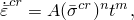

其中


是等效蠕变应变率，定义为如果等效蠕变应力以单轴压缩定义，则 ；如果以单轴拉伸定义，则 ；如果以纯剪切定义，则 ，其中  是工程剪切蠕变应变；


是等效蠕变应力；

*t*

是总时间或蠕变时间；和

*A*、*n* 和 *m*

是用户定义的蠕变材料参数，指定为温度和场变量的函数。

| **输入文件用法：** | ``` [*DRUCKER PRAGER CREEP](../key/key-link.md#usb-kws-mdruckerpragercreep), LAW=TIME ``` |
| --- | --- |

| **Abaqus/CAE用法：** | 属性模块：材料编辑器：****机械****塑性****Drucker Prager****：****子选项****Drucker Prager蠕变****：****定律：时间** |
| --- | --- |

##### 幂律模型的"应变硬化"形式

作为上述幂律"时间硬化"形式的替代，可以使用相应的"应变硬化"形式：


对于物理上合理的行为，*A* 和 *n* 必须为正，且 。

| **输入文件用法：** | ``` [*DRUCKER PRAGER CREEP](../key/key-link.md#usb-kws-mdruckerpragercreep), LAW=STRAIN ``` |
| --- | --- |

| **Abaqus/CAE用法：** | 属性模块：材料编辑器：****机械****塑性****Drucker Prager****：****子选项****Drucker Prager蠕变****：****定律：应变** |
| --- | --- |

##### Singh-Mitchell定律

可作为数据输入的第二蠕变定律是Singh-Mitchell定律的变体：


其中 、*t* 和  如上所定义，*A*、、 和 *m* 是用户定义的蠕变材料参数，指定为温度和场变量的函数。对于物理上合理的行为，*A* 和  必须为正，，且  应与总时间相比很小。

| **输入文件用法：** | ``` [*DRUCKER PRAGER CREEP](../key/key-link.md#usb-kws-mdruckerpragercreep), LAW=SINGHM ``` |
| --- | --- |

| **Abaqus/CAE用法：** | 属性模块：材料编辑器：****机械****塑性****Drucker Prager****：****子选项****Drucker Prager蠕变****：****定律：SinghM** |
| --- | --- |

##### 时间相关行为

在"时间硬化"幂律模型和Singh-Mitchell定律模型中，可以使用总时间或蠕变时间。总时间是所有常规分析步骤累积的时间。蠕变时间是具有时间相关材料行为的过程的时间之和。如果使用总时间，建议对于分析中蠕变未激活的任何步骤使用相对于蠕变时间较小的步骤时间；这是必要的，以避免在后续步骤中硬化行为的变化。

| **输入文件用法：** | 使用以下选项之一： |
| --- | --- |
|  | ``` [*DRUCKER PRAGER CREEP](../key/key-link.md#usb-kws-mdruckerpragercreep), TIME=TOTAL (default) [*DRUCKER PRAGER CREEP](../key/key-link.md#usb-kws-mdruckerpragercreep), TIME=CREEP ``` |

| **Abaqus/CAE用法：** | Abaqus/CAE不支持指定时间类型。 |
| --- | --- |

##### 数值困难

根据上述蠕变定律的单位选择，对于典型蠕变应变率，*A* 的值可能非常小。如果 *A* 小于 ，数值困难可能导致材料计算错误；因此，使用另一单位系统来避免蠕变应变增量计算中的此类困难。

#### 蠕变积分

Abaqus/Standard提供蠕变和肿胀行为的显式和隐式时间积分。时间积分方案的选择取决于过程类型、为过程指定的参数、塑性的存在以及是否请求几何线性或非线性分析，如["率相关塑性：蠕变和肿胀，" 第23.2.4节"](pt05ch23s02abm20.md)中所讨论。

### 初始条件

当我们需要研究已经经历了一些加工硬化的材料的行为时，Abaqus允许您通过直接指定条件来规定等效塑性应变  的初始条件（见["Abaqus/Standard和Abaqus/Explicit中的初始条件，" 第34.2.1节"](pt07ch34s02aus116.md)）。对于更复杂的情况，可以通过用户子程序[`HARDINI`](../sub/sub-link.md#sub-xsl-hardini)在Abaqus/Standard中定义初始条件。

| **输入文件用法：** | 使用以下选项直接指定初始等效塑性应变： |
| --- | --- |
|  | ``` [*INITIAL CONDITIONS](../key/key-link.md#usb-kws-minitialcond), TYPE=HARDENING ``` 在Abaqus/Standard中使用以下选项在用户子程序[`HARDINI`](../sub/sub-link.md#sub-xsl-hardini)中指定初始等效塑性应变： ``` [*INITIAL CONDITIONS](../key/key-link.md#usb-kws-minitialcond), TYPE=HARDENING, USER ``` |

| **Abaqus/CAE用法：** | 使用以下选项直接指定初始等效塑性应变： |
| --- | --- |
|  | 加载模块：****创建预定义场****：****步骤：**初始**，为****类别****选择****机械****，为****所选步骤的类型****选择****硬化**** 在Abaqus/Standard中使用以下选项在用户子程序[`HARDINI`](../sub/sub-link.md#sub-xsl-hardini)中指定初始等效塑性应变：加载模块：****创建预定义场****：****步骤：**初始**，为****类别****选择****机械****，为****所选步骤的类型****选择****硬化****；****定义：**用户定义**** |

### 单元

Drucker-Prager模型可用于以下单元类型：平面应变、广义平面应变、轴对称和三维实体（连续体）单元。所有Drucker-Prager模型也可用于平面应力（平面应力、壳和膜单元），带蠕变的线性Drucker-Prager模型除外。

### 输出

除了Abaqus中可用的标准输出标识符（["Abaqus/Standard输出变量标识符，" 第4.2.1节"](pt02ch04s02abv01.md)和["Abaqus/Explicit输出变量标识符，" 第4.2.2节"](pt02ch04s02xbv01.md)），以下变量对Drucker-Prager塑性/蠕变模型具有特殊含义：

| PEEQ | 等效塑性应变。对于线性Drucker-Prager塑性模型，PEEQ定义为 ；其中  是初始等效塑性应变（零或用户指定；见["初始条件"](pt05ch23s03abm30.md#usb-mat-cdruckerprager-ic)"），且  是等效塑性应变率。对于双曲和指数Drucker-Prager塑性模型，PEEQ定义为 ，其中  是初始等效塑性应变，且  是屈服应力。 |
| --- | --- |

| CEEQ | 等效蠕变应变，。 |
| --- | --- |


