# 23.3.2 修正Drucker-Prager/盖帽模型


**产品：** Abaqus/Standard  Abaqus/Explicit  Abaqus/CAE  

##### **参考文献**

- ["非弹性行为，" 第23.1.1节"](pt05ch23s01abo20.md)
- ["材料库：概述，" 第21.1.1节"](pt05ch21s01abo18.md)
- ["率相关塑性：蠕变和肿胀，" 第23.2.4节"](pt05ch23s02abm20.md)
- ["CREEP，" 第1.1.1节，Abaqus用户子程序参考指南](../sub/sub-link.md#sub-rtn-ucreep)
- [*CAP PLASTICITY](../key/key-link.md#usb-kws-mcapplasticity)
- [*CAP HARDENING](../key/key-link.md#usb-kws-mcaphardening)
- [*CAP CREEP](../key/key-link.md#usb-kws-mcapcreep)
- ["在"定义塑性，" 第12.9.2节的Abaqus/CAE用户指南中定义盖帽塑性"](../usi/usi-link.md#usi-prp-mechanical-plastic-capplastic)

### 概述

修正Drucker-Prager/盖帽塑性/蠕变模型：
- 旨在建模表现出压力相关屈服的黏性地质材料，如土壤和岩石；
- 基于在Drucker-Prager塑性模型（["扩展Drucker-Prager模型，" 第23.3.1节"](pt05ch23s03abm30.md)）上添加盖帽屈服面，这提供了非弹性硬化机制以考虑塑性压实，并帮助控制材料在剪切中屈服时的体积膨胀；
- 可在Abaqus/Standard中用于模拟材料在长期非弹性变形中的蠕变，方法是在剪切失效区域使用内聚蠕变机制，在盖帽区域使用固结蠕变机制；
- 可与弹性材料模型（["线性弹性行为，" 第22.2.1节"](pt05ch22s02abm02.md)）结合使用，或者在Abaqus/Standard中（如果不定义蠕变）与多孔弹性材料模型（["多孔材料的弹性行为，" 第22.3.1节"](pt05ch22s03abm05.md)）结合使用；和
- 对盖帽区域的大应力反转提供合理的响应；但是，在失效面区域，响应仅对基本单调加载是合理的。

### 屈服面

在Drucker-Prager模型上添加盖帽屈服面有两个主要目的：它在静水压缩中限制屈服面，从而提供表示塑性压实的非弹性硬化机制；并且通过提供作为材料在Drucker-Prager剪切失效面上屈服时产生的非弹性体积增加的软化函数，帮助控制材料在剪切中屈服时的体积膨胀。

屈服面有两个主要段：压力相关的Drucker-Prager剪切失效段和压缩盖帽段，如图[图23.3.2-1](pt05ch23s03abm31.md#ccapplas-yield-p-t)所示。Drucker-Prager失效段是理想塑性屈服面（无硬化）。该段上的塑性流动产生非弹性体积增加（膨胀），导致盖帽软化。在盖帽面上，塑性流动导致材料压实。该模型在["地质材料的Drucker-Prager/盖帽模型，" Abaqus理论指南第4.4.4节](../stm/stm-link.md#stm-mat-druckerpragercap)中详细描述。

**图23.3.2-1** 修正Drucker-Prager/盖帽模型：*p*–*t* 平面中的屈服面。


#### 失效面

Drucker-Prager失效面写为


其中  和  分别表示材料的摩擦角和内聚力，并且可以依赖于温度  和其他预定义场 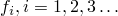。偏量应力度量 *t* 定义为

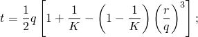

和


是等效压力应力，


是Mises等效应力，


是第三个应力不变量，且

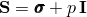

是偏量应力。

 是一个材料参数，控制屈服面对中间主应力值的依赖性，如图[图23.3.2-2](pt05ch23s03abm31.md#cmoddruckprag-yield-dev)所示。

**图23.3.2-2** 偏量平面中的典型屈服/流动面。


定义屈服面使得 *K* 是三轴拉伸屈服应力与三轴压缩屈服应力之比。 意味着屈服面在偏量主应力平面（平面）中是von Mises圆，因此三轴拉伸和压缩中的屈服应力相同；这是Abaqus/Standard中的默认行为，也是Abaqus/Explicit中唯一可用的行为。为了确保屈服面保持凸性，需要 。

#### 盖帽屈服面

盖帽屈服面在子午面（*p*–*t* 平面）中有恒定偏心率的椭圆形状（[图23.3.2-1](pt05ch23s03abm31.md#ccapplas-yield-p-t)），并且在偏量平面中也包含对第三个应力不变量的依赖性（[图23.3.2-2](pt05ch23s03abm31.md#cmoddruckprag-yield-dev)）。盖帽面根据体积非弹性应变硬化或软化：当在盖帽上屈服时（和/或根据固结机制蠕变，如本节后面所述），体积塑性和/或蠕变压实导致硬化，而当在剪切失效面上屈服时（和/或根据内聚机制蠕变，如本节后面所述），体积塑性和/或蠕变膨胀导致软化。盖帽屈服面为

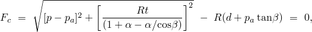

其中 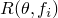 是控制盖帽形状的材料参数，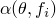 是一个小数字，我们稍后讨论，且  是表示体积非弹性应变驱动硬化/软化的演化参数。硬化/软化定律是用户定义的分段线性函数，联系静水压缩屈服应力  和体积非弹性应变（[图23.3.2-3](pt05ch23s03abm31.md#ccapplas-hard)）：

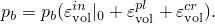

**图23.3.2-3** 典型盖帽硬化。


[图23.3.2-3](pt05ch23s03abm31.md#ccapplas-hard)中的体积非弹性应变轴有任意原点：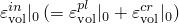 是分析开始时对应于材料初始状态的位置，从而定义分析开始时屈服面（）的位置（[图23.3.2-1](pt05ch23s03abm31.md#ccapplas-yield-p-t)）。演化参数  给定为


参数  是一个小数字（通常为0.01到0.05），用于定义过渡屈服面，

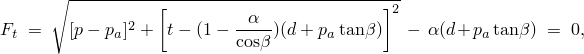

以便模型在盖帽和失效面之间提供平滑的相交。

#### 定义屈服面变量

您提供变量 *d*、、*R*、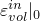、 和 *K* 来定义屈服面的形状。在Abaqus/Standard中 ，而在Abaqus/Explicit中 *K* = 1（）。如果需要，这些变量的组合也可以定义为温度和其他预定义场变量的表格函数。

| **输入文件用法：** | ``` [*CAP PLASTICITY](../key/key-link.md#usb-kws-mcapplasticity) ``` |
| --- | --- |

| **Abaqus/CAE用法：** | 属性模块：材料编辑器：****机械****塑性****盖帽塑性**** |
| --- | --- |

#### 定义硬化参数

为该模型指定的硬化曲线解释为静水压力意义的屈服：静水压力屈服应力定义为体积非弹性应变的表格函数，如果需要，也是温度和其他预定义场变量的函数。定义  的值范围应足以包括材料在分析过程中将承受的所有有效压力应力值。

| **输入文件用法：** | ``` [*CAP HARDENING](../key/key-link.md#usb-kws-mcaphardening) ``` |
| --- | --- |

| **Abaqus/CAE用法：** | 属性模块：材料编辑器：****机械****塑性****盖帽塑性****：****子选项****盖帽硬化**** |
| --- | --- |

### 塑性流动

塑性流动由在偏量平面中关联的流动势定义，在子午面中的盖帽区域关联，在失效面和过渡区域非关联。我们在子午面中使用的流动势面如图[图23.3.2-4](pt05ch23s03abm31.md#ccapplas-flow-p-t)所示：它由盖帽区域中与盖帽屈服面相同的椭圆部分组成，


以及在失效和过渡区域中提供模型非关联流动分量的另一个椭圆部分组成，


两个椭圆部分形成连续且光滑的势面。

**图23.3.2-4** 修正Drucker-Prager/盖帽模型：*p*–*t* 平面中的流动势。


#### 非关联流动

非关联流动意味着材料刚度矩阵不是对称的，应在Abaqus/Standard中使用非对称矩阵存储和求解方案（见["定义分析，" 第6.1.2节"](pt03ch06s01abo05.md)）。如果发生非关联非弹性变形的模型区域受到限制，则材料刚度矩阵的对称近似可能给出可接受的收敛速度；在这种情况下，可能不需要非对称矩阵方案。

### 校准

至少需要进行三个实验来校准最简单版本的盖帽模型：静水压缩测试（也可以接受固结测试）和两个三轴压缩测试或一个三轴压缩测试和一个单轴压缩测试（建议使用两个以上的测试以获得更准确的校准）。

静水压缩测试通过在所有方向上同等加压来进行。记录施加的压力和体积变化。

单轴压缩测试涉及在两个刚性压板之间压缩样品。记录加载方向上的负载和位移。还应记录横向位移，以便可以校准正确的体积变化。

三轴压缩实验使用标准三轴机进行，其中保持固定的围压，同时施加差分应力。通常执行涵盖感兴趣围压范围的几个测试。同样，记录加载方向上的应力和应变，以及横向应变，以便可以校准正确的体积变化。

这些测试中的卸载测量可用于校准弹性，特别是在初始弹性区域定义不明确的情况下。

静水压缩测试应力-应变曲线给出了静水压缩屈服应力 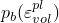 的演化，这是盖帽硬化曲线定义所需的。

定义剪切失效对静水压力依赖性的摩擦角  和内聚力 *d*，通过在压力应力（*p*）对剪切应力（*q*）空间中绘制两个三轴压缩测试（或三轴压缩测试和单轴压缩测试）的失效应力来计算：通过两个点的直线斜率给出角度 ，与 *q* 轴的截距给出 *d*。有关  和 *d* 校准的更多详细信息，请参阅["扩展Drucker-Prager模型，" 第23.3.1节"](pt05ch23s03abm30.md)中的校准讨论。

*R* 表示屈服面盖帽部分的曲率，可以从高围压（盖帽区域）的多个三轴测试中校准。*R* 必须在0.0001和1000.0之间。

### Abaqus/Standard蠕变模型

可以在Abaqus/Standard中定义根据带盖帽Drucker-Prager塑性模型表现为塑性的材料的经典"蠕变"行为。此类材料中的蠕变行为与塑性行为密切相关（通过蠕变流动势的定义和测试数据定义），因此必须将盖帽塑性和盖帽硬化包含在材料定义中。如果不希望模型中有率无关塑性行为，则应在塑性定义中提供大的内聚力 *d* 值，以及大的压缩屈服应力  值：结果是材料在蠕变时遵循带盖帽的Drucker-Prager模型，而永远不会屈服。此能力仅限于屈服面没有第三个应力不变量依赖的情况（）以及屈服面没有过渡区域的情况（）。弹性行为必须使用线性各向同性弹性定义（见["在"线性弹性行为，" 第22.2.1节中定义各向同性弹性"](pt05ch22s02abm02.md#usb-mat-clinearelastic-isotropic)）。

为修正Drucker-Prager/盖帽模型定义的蠕变行为仅在土壤固结、耦合温度-位移和瞬态准静态过程中激活。

#### 蠕变公式

该模型有两个可能的蠕变机制，在不同加载区域激活：一个是内聚机制，遵循剪切失效塑性区域中激活的塑性类型；另一个是固结机制，遵循盖帽塑性区域中激活的塑性类型。[图23.3.2-5](pt05ch23s03abm31.md#ccapplas-active-creep)显示了 *p*–*q* 空间中蠕变机制的适用区域。

**图23.3.2-5** 蠕变机制的激活区域。


##### 内聚蠕变机制的等效蠕变面和等效蠕变应力

首先考虑内聚蠕变机制。我们采用存在蠕变等值面的概念，即共享相同蠕变"强度"的应力点，用等效蠕变应力测量。因为希望等效蠕变面与屈服面重合，我们通过均匀缩小屈服面来定义等效蠕变面。在 *p*–*q* 平面中，等效蠕变面转化为与屈服面平行的面，如图[图23.3.2-6](pt05ch23s03abm31.md#ccapplas-cohesion-creep)所示。

**图23.3.2-6** 内聚蠕变的等效蠕变应力。

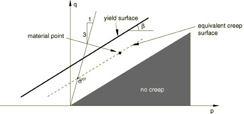

Abaqus/Standard要求内聚蠕变属性通过单轴压缩测试测量。等效蠕变应力  按如下方式确定：

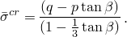

Abaqus/Standard还要求  为正。[图23.3.2-6](pt05ch23s03abm31.md#ccapplas-cohesion-creep)显示了这样的等效蠕变应力。这些概念的一个结果是，在 *p*–*q* 空间中有一个锥体，其中蠕变不激活。该锥体内的任何点都会有负的等效蠕变应力。

##### 固结蠕变机制的等效蠕变面和等效蠕变应力

接下来，考虑固结蠕变机制。在这种情况下，我们希望蠕变依赖于超过阈值  的静水压力，并平滑过渡到机制不活跃的区域（）。因此，我们将等效蠕变面定义为恒定静水压力面（*p*–*q* 平面中的垂直线）。Abaqus/Standard要求固结蠕变属性通过静水压缩测试测量。有效蠕变压力  然后是 *p* 轴上相对压力为  的点。该值用于单轴蠕变定律。由这种定律产生的等效体积蠕变应变率对于正等效压力定义为正。Abaqus/Standard中的内部张量计算考虑了正压力将产生负（即压缩）体积蠕变分量的事实。

##### 蠕变流动

由内聚机制产生的蠕变应变率假设遵循类似于Drucker-Prager蠕变模型中蠕变应变率的势（["扩展Drucker-Prager模型，" 第23.3.1节"](pt05ch23s03abm30.md)）；即双曲函数：

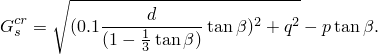

此蠕变流动势是连续且光滑的，确保流动方向始终被唯一确定。该函数在高围压应力下渐近地接近剪切失效屈服面的平行线，并在直角处与静水压力轴相交。[图23.3.2-7](pt05ch23s03abm31.md#ccapplas-cohesion-p-q)显示了子午应力面中的一族双曲势。内聚蠕变势是偏量应力平面（平面）中的von Mises圆。

**图23.3.2-7** *p*–*q* 平面中的内聚蠕变势。

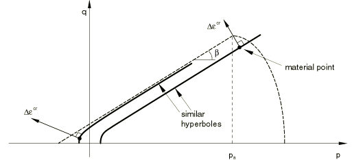

Abaqus/Standard保护可能因非常低的应力值而产生的数值问题。详情请参阅["地质材料的Drucker-Prager/盖帽模型，" Abaqus理论指南第4.4.4节](../stm/stm-link.md#stm-mat-druckerpragercap)。

由固结机制产生的蠕变应变率假设遵循类似于盖帽屈服面塑性应变率的势（[图23.3.2-8](pt05ch23s03abm31.md#ccapplas-consolid-creep)）：


**图23.3.2-8** *p*–*q* 平面中的固结蠕变势。


固结蠕变势是偏量应力平面（平面）中的von Mises圆。来自两种机制的蠕变应变的体积分量都有助于盖帽的硬化/软化，如前所述。有关这些模型行为的详细信息，请参阅["蠕变积分验证，" Abaqus基准指南第3.2.6节](../bmk/bmk-link.md#bmk-mat-creep)。

##### 非关联流动

内聚机制使用与等效蠕变面不同的蠕变势，这意味着材料刚度矩阵不是对称的，应使用非对称矩阵存储和求解方案（见["定义分析，" 第6.1.2节"](pt03ch06s01abo05.md)）。如果发生黏性非弹性变形的模型区域受到限制，则材料刚度矩阵的对称近似可能给出可接受的收敛速度；在这种情况下，可能不需要非对称矩阵方案。

#### 指定蠕变定律

通过指定等效"单轴行为"——蠕变"定律"来完成蠕变行为的定义。在许多实际情况下，蠕变定律是通过用户子程序[`CREEP`](../sub/sub-link.md#sub-xsl-creep)定义的，因为蠕变定律通常具有复杂的形式来拟合实验数据。为一些简单的情况提供了数据输入方法。

##### 用户子程序[`CREEP`](../sub/sub-link.md#sub-xsl-creep)

用户子程序[`CREEP`](../sub/sub-link.md#sub-xsl-creep)提供了实现黏塑性模型的一般能力，其中应变率势可以写为等效应力和任意数量"解相关状态变量"的函数。当与这些材料结合使用时，等效内聚蠕变应力  和有效蠕变压力  在例程中可用。解相关状态变量是与构型定义结合使用的任何变量，其值随解而演化。例如是与模型相关的硬化变量。当需要应力势的更一般形式时，可以使用用户子程序[`UMAT`](../sub/sub-link.md#sub-xsl-umat)。

| **输入文件用法：** | 使用以下一个或两个选项： |
| --- | --- |
|  | ``` [*CAP CREEP](../key/key-link.md#usb-kws-mcapcreep), MECHANISM=COHESION, LAW=USER [*CAP CREEP](../key/key-link.md#usb-kws-mcapcreep), MECHANISM=CONSOLIDATION, LAW=USER ``` |

| **Abaqus/CAE用法：** | 定义以下一项或两项： |
| --- | --- |
|  | 属性模块：材料编辑器：****机械****塑性****盖帽塑性****：****子选项****盖帽蠕变内聚****：****定律：用户****子选项****盖帽蠕变固结****：****定律：用户** |

##### 幂律模型的"时间硬化"形式

关于内聚机制，幂律是可用的


其中


是等效蠕变应变率；


是等效内聚蠕变应力；

*t*

是总时间或蠕变时间；和

*A*、*n* 和 *m*

是用户定义的蠕变材料参数，指定为温度和场变量的函数。

在与固结机制一起使用这种形式的幂律模型时， 可以在上述关系中替换为 ，即有效蠕变压力。

| **输入文件用法：** | 使用以下一个或两个选项： |
| --- | --- |
|  | ``` [*CAP CREEP](../key/key-link.md#usb-kws-mcapcreep), MECHANISM=COHESION, LAW=TIME [*CAP CREEP](../key/key-link.md#usb-kws-mcapcreep), MECHANISM=CONSOLIDATION, LAW=TIME ``` |

| **Abaqus/CAE用法：** | 定义以下一项或两项： |
| --- | --- |
|  | 属性模块：材料编辑器：****机械****塑性****盖帽塑性****：****子选项****盖帽蠕变内聚****：****定律：时间****子选项****盖帽蠕变固结****：****定律：时间** |

##### 幂律模型的"应变硬化"形式

作为上述幂律"时间硬化"形式的替代，可以使用相应的"应变硬化"形式。对于内聚机制，该定律的形式为

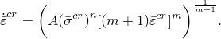

在与固结机制一起使用这种形式的幂律模型时， 可以在上述关系中替换为 ，即有效蠕变压力。

对于物理上合理的行为，*A* 和 *n* 必须为正，且 。

| **输入文件用法：** | 使用以下一个或两个选项： |
| --- | --- |
|  | ``` [*CAP CREEP](../key/key-link.md#usb-kws-mcapcreep), MECHANISM=COHESION, LAW=STRAIN [*CAP CREEP](../key/key-link.md#usb-kws-mcapcreep), MECHANISM=CONSOLIDATION, LAW=STRAIN ``` |

| **Abaqus/CAE用法：** | 定义以下一项或两项： |
| --- | --- |
|  | 属性模块：材料编辑器：****机械****塑性****盖帽塑性****：****子选项****盖帽蠕变内聚****：****定律：应变****子选项****盖帽蠕变固结****：****定律：应变** |

##### Singh-Mitchell定律

可作为数据输入的第二内聚蠕变定律是Singh-Mitchell定律的变体：

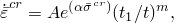

其中 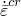、*t* 和  如上所定义，*A*、、 和 *m* 是用户定义的蠕变材料参数，指定为温度和场变量的函数。对于物理上合理的行为，*A* 和  必须为正，，且  应与总时间相比很小。

在与固结机制一起使用这种Singh-Mitchell定律变体时， 可以在上述关系中替换为 ，即有效蠕变压力。

| **输入文件用法：** | 使用以下一个或两个选项： |
| --- | --- |
|  | ``` [*CAP CREEP](../key/key-link.md#usb-kws-mcapcreep), MECHANISM=COHESION, LAW=SINGHM [*CAP CREEP](../key/key-link.md#usb-kws-mcapcreep), MECHANISM=CONSOLIDATION, LAW=SINGHM ``` |

| **Abaqus/CAE用法：** | 定义以下一项或两项： |
| --- | --- |
|  | 属性模块：材料编辑器：****机械****塑性****盖帽塑性****：****子选项****盖帽蠕变内聚****：****定律：SinghM****子选项****盖帽蠕变固结****：****定律：SinghM** |

##### 时间相关行为

在"时间硬化"幂律模型和Singh-Mitchell定律模型中，可以使用总时间或蠕变时间。总时间是所有常规分析步骤累积的时间。蠕变时间是具有时间相关材料行为的过程的时间之和。如果使用总时间，建议对于分析中蠕变未激活的任何步骤使用相对于蠕变时间较小的步骤时间；这是必要的，以避免在后续步骤中硬化行为的变化。

| **输入文件用法：** | 使用以下选项之一： |
| --- | --- |
|  | ``` [*CAP CREEP](../key/key-link.md#usb-kws-mcapcreep), TIME=TOTAL (default) [*CAP CREEP](../key/key-link.md#usb-kws-mcapcreep), TIME=CREEP ``` |

| **Abaqus/CAE用法：** | Abaqus/CAE不支持指定时间类型。 |
| --- | --- |

##### 数值困难

根据上述蠕变定律的单位选择，对于典型蠕变应变率，*A* 的值可能非常小。如果 *A* 小于10^27，数值困难可能导致材料计算错误；因此，使用另一单位系统来避免蠕变应变增量计算中的此类困难。

#### 蠕变积分

Abaqus/Standard提供蠕变和肿胀行为的显式和隐式时间积分。时间积分方案的选择取决于过程类型、为过程指定的参数、塑性的存在以及是否请求几何线性或非线性分析，如["率相关塑性：蠕变和肿胀，" 第23.2.4节"](pt05ch23s02abm20.md)中所讨论。

### 初始条件

可以定义点处的初始应力（见["在Abaqus/Standard和Abaqus/Explicit中的初始条件，" 第34.2.1节中定义初始应力"](pt07ch34s02aus116.md#usb-prc-pinitialcond-stress)）。如果这样的应力点位于最初定义的盖帽或过渡屈服面之外，并且在 *p*–*t* 平面中剪切失效面的投影之下（如图[图23.3.2-1](pt05ch23s03abm31.md#ccapplas-yield-p-t)所示），Abaqus将尝试调整盖帽的初始位置以使应力点位于屈服面上，并将发出警告消息。如果应力点位于Drucker-Prager失效面之外（或其投影之上），则将发出错误消息并终止执行。

### 单元

修正Drucker-Prager/盖帽材料行为可用于平面应变、广义平面应变、轴对称和三维实体（连续体）单元。该模型不能用于假定应力状态为平面应力的单元（平面应力、壳和膜单元）。

### 输出

除了Abaqus中可用的标准输出标识符（["Abaqus/Standard输出变量标识符，" 第4.2.1节"](pt02ch04s02abv01.md)和["Abaqus/Explicit输出变量标识符，" 第4.2.2节"](pt02ch04s02xbv01.md)），以下变量对盖帽塑性/蠕变模型具有特殊含义：

| PEEQ | ，盖帽位置。 |
| --- | --- |

| PEQC | 所有三个可能的屈服/失效面（Drucker-Prager失效面 - PEQC1、盖帽面 - PEQC2和过渡面 - PEQC3）的等效塑性应变，以及总体积非弹性应变（PEQC4）。对于每个屈服/失效面，等效塑性应变为 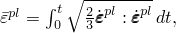，其中 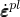 是相应的塑性流动率。总体积非弹性应变定义为 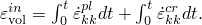 |
| --- | --- |

| CEEQ | 由内聚蠕变机制产生的等效蠕变应变，定义为 ，其中 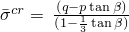 是等效蠕变应力。 |
| --- | --- |

| CESW | 由固结蠕变机制产生的等效蠕变应变，定义为 ，其中 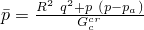 是等效蠕变压力。 |
| --- | --- |


