# 23.3.3 Mohr-Coulomb塑性


**产品：** Abaqus/Standard  Abaqus/Explicit  Abaqus/CAE  

##### **参考文献**

- ["材料库：概述，" 第21.1.1节"](pt05ch21s01abo18.md)
- ["非弹性行为，" 第23.1.1节"](pt05ch23s01abo20.md)
- [*MOHR COULOMB](../key/key-link.md#usb-kws-mmohrcoulomb)
- [*MOHR COULOMB HARDENING](../key/key-link.md#usb-kws-mmohrcoulombhardening)
- [*TENSION CUTOFF](../key/key-link.md#usb-kws-mtensioncutoff)
- ["在"定义塑性，" 第12.9.2节的Abaqus/CAE用户指南中定义Mohr-Coulomb塑性"](../usi/usi-link.md#usi-prp-mechanical-plastic-mohrcoulomb)

### 概述

Mohr-Coulomb塑性模型：
- 用于建模具有经典Mohr-Coulomb屈服准则的材料；
- 允许材料各向同性硬化和/或软化；
- 使用在子午应力平面中具有双曲形状、在偏量应力平面中具有分段椭圆形状的光滑流动势；
- 与线性弹性材料模型结合使用（["线性弹性行为，" 第22.2.1节"](pt05ch22s02abm02.md)）；
- 可与Rankine面（拉伸截止）结合使用以限制拉伸区域附近的承载能力；和
- 可用于土工工程领域的设计应用，以模拟基本单调加载条件下的材料响应。

### 弹性行为

响应的弹性部分如["线性弹性行为，" 第22.2.1节"](pt05ch22s02abm02.md)中所述进行指定。假设线性各向同性弹性。

### 塑性行为：屈服条件

屈服面是两种不同准则的复合：剪切准则（称为Mohr-Coulomb面）和可选的拉伸截止准则（使用Rankine面建模）。

#### Mohr-Coulomb面

Mohr-Coulomb准则假设当材料中任何点的剪切应力达到取决于同一平面中正应力的值时发生屈服。Mohr-Coulomb模型基于在最大和最小主应力平面中绘制屈服时应力状态的Mohr圆。失效线是触及这些Mohr圆的最佳直线（[图23.3.3-1](pt05ch23s03abm32.md#cmohr-coulomb)）。

**图23.3.3-1** Mohr-Coulomb屈服模型。


因此，Mohr-Coulomb模型由下式定义


其中  在压缩中为负。从Mohr圆，


代入  和 ，两边乘以 ，并简化，Mohr-Coulomb模型可以写为

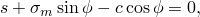

其中

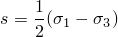

是最大主应力  和最小主应力 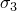 之差的一半（因此是最大剪切应力），


是最大和最小主应力的平均值，且  是摩擦角。

对于一般应力状态，该模型更方便地以三个应力不变量的形式写为

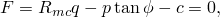

其中

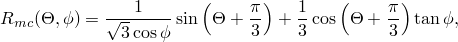


是 *p*– 应力平面上Mohr-Coulomb屈服面的斜率（见[图23.3.3-2](pt05ch23s03abm32.md#cmohrcoulomb-yield)），通常称为材料的摩擦角，可以依赖于温度和预定义场变量；

*c*

是材料的内聚力；和


是偏量极角，定义为

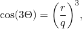

且

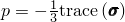

是等效压力应力，


是Mises等效应力，

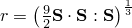

是偏量应力的第三个不变量，且


是偏量应力。

摩擦角  控制偏量平面中屈服面的形状，如图[图23.3.3-2](pt05ch23s03abm32.md#cmohrcoulomb-yield)所示。拉伸截止面显示用于子午角为 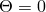 的情况。摩擦角范围为 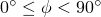。当 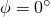 时，Mohr-Coulomb模型简化为具有完美六边形偏量截面的与压力无关的Tresca模型。当  时，Mohr-Coulomb模型简化为具有三角形偏量截面的"拉伸截止"Rankine模型，且 （此极限情况在此描述的Mohr-Coulomb模型中不允许）。

在使用单元测试验证模型校准时，输出变量SP1、SP2和SP3分别对应于主应力 、 和 。

**图23.3.3-2** 子午面和偏量平面中的Mohr-Coulomb和拉伸截止面。


假设Mohr-Coulomb屈服面的硬化行为是各向同性内聚力硬化。硬化曲线必须将内聚力屈服应力描述为塑性应变以及可能温度和预定义场变量的函数。在有限应变下定义此依赖性时，应给出"真实"（Cauchy）应力和对数应变值。可指定可选的拉伸截止硬化（或软化）曲线

此塑性模型不考虑率相关性效应。

| **输入文件用法：** | 使用以下选项指定Mohr-Coulomb屈服面和内聚力硬化： |
| --- | --- |
|  | ``` [*MOHR COULOMB](../key/key-link.md#usb-kws-mmohrcoulomb) ``` ``` [*MOHR COULOMB HARDENING](../key/key-link.md#usb-kws-mmohrcoulombhardening) ``` |

| **Abaqus/CAE用法：** | 使用以下选项指定Mohr-Coulomb屈服面和内聚力硬化： |
| --- | --- |
|  | 属性模块：材料编辑器：****机械****塑性****Mohr Coulomb塑性**** 属性模块：材料编辑器：****机械****塑性****Mohr Coulomb塑性****：****内聚力** |

#### Rankine面

在Abaqus中，拉伸截止使用Rankine面建模，写为


其中 ，且  是拉伸截止值，表示Rankine面的软化（或硬化），作为拉伸等效塑性应变 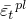 的函数。

| **输入文件用法：** | 使用以下选项为Rankine面指定硬化或软化： |
| --- | --- |
|  | ``` [*TENSION CUTOFF](../key/key-link.md#usb-kws-mtensioncutoff) ``` |

| **Abaqus/CAE用法：** | 使用以下选项为Rankine面指定硬化或软化： |
| --- | --- |
|  | 属性模块：材料编辑器：****机械****塑性****Mohr Coulomb塑性****：切换打开****指定拉伸截止****；****拉伸截止** |

### 塑性行为：流动势

下面描述用于Mohr-Coulomb屈服面和拉伸截止面的流动势。

#### Mohr-Coulomb屈服面上的塑性流动

Mohr-Coulomb屈服面的流动势 *G*，在子午应力平面中选择为双曲函数，在偏量应力平面中选择为Mentrey和Willam（1995）提出的光滑椭圆函数：


其中


和


是在高围压下在 *p*– 平面中测量的膨胀角，可以依赖于温度和预定义场变量；

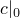

是初始内聚力屈服应力，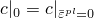；


是如前定义的偏量极角；


是一个参数，称为子午偏心率，定义双曲函数接近渐近线的速率（当子午偏心率趋于零时，流动势在子午应力平面中趋于直线）；和

*e*

是一个参数，称为偏量偏心率，描述偏量截面的"圆度"，用沿拉伸子午线（）的剪切应力与沿压缩子午线（）的剪切应力之比表示。

为子午偏心率  提供了默认值 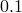。

默认情况下，偏量偏心率 *e* 计算为


其中  是Mohr-Coulomb摩擦角；该计算对应于在偏量平面中的三轴拉伸和压缩中将流动势与屈服面匹配。或者，Abaqus允许您将此偏量偏心率视为独立的材料参数；在这种情况下，您直接提供其值。椭圆函数的凸性和光滑性要求 。上限 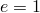（或不指定 *e* 的值时  0）导致 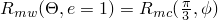，这描述了偏量平面中的Mises圆。下限 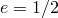（或不指定 *e* 的值时  90）导致 ，将描述偏量平面中的Rankine三角形（此极限情况在此描述的Mohr-Coulomb模型中不允许）。

此流动势是连续且光滑的，确保流动方向始终被唯一确定。[图23.3.3-3](pt05ch23s03abm32.md#cmohrcoulomb-flow-merid)显示了子午应力面中的一族双曲势，[图23.3.3-4](pt05ch23s03abm32.md#cmohrcoulomb-flow-devia)显示了偏量应力平面中的流动势。

**图23.3.3-3** 子午应力面中的一族双曲流动势。

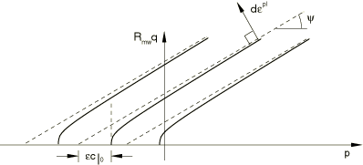

**图23.3.3-4** 偏量应力平面中的Mentrey-Willam流动势。


当摩擦角  和膨胀角  相等且子午偏心率  非常小时，子午应力平面中的流动可能接近关联；然而，该平面中的流动通常是非关联的。偏量应力平面中的流动始终是非关联的。

| **输入文件用法：** | 使用以下选项允许Abaqus计算 *e* 的值（默认）： |
| --- | --- |
|  | ``` [*MOHR COULOMB](../key/key-link.md#usb-kws-mmohrcoulomb) ``` 直接指定 *e* 的值时使用以下选项： ``` [*MOHR COULOMB](../key/key-link.md#usb-kws-mmohrcoulomb), DEVIATORIC ECCENTRICITY=*e* ``` |

| **Abaqus/CAE用法：** | 使用以下选项允许Abaqus计算 *e* 的值（默认）： |
| --- | --- |
|  | 属性模块：材料编辑器：****机械****塑性****Mohr Coulomb塑性****：****塑性****：****偏量偏心率：****计算的默认值**** 直接指定 *e* 的值时使用以下选项：属性模块：材料编辑器：****机械****塑性****Mohr Coulomb塑性****：****塑性****：****偏量偏心率：****指定：**** *e* |

#### Rankine面上的塑性流动

为Rankine面选择了导致近乎关联流动的流动势，并通过修改前面描述的Mentrey-Willam势来构建：

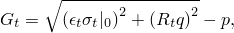

其中


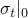

是拉伸截止的初始值；


是子午偏心率，类似于前面定义的 ；和


是偏量偏心率，类似于前面定义的 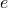。

Abaqus使用值  和 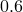，分别作为  和 ）。

### 单元

Mohr-Coulomb塑性模型可用于除一维单元（梁、管道和桁架单元）或假定应力状态为平面应力的单元（平面应力、壳和膜单元）外的任何应力/位移单元。

### 输出

除了Abaqus中可用的标准输出标识符（["Abaqus/Standard输出变量标识符，" 第4.2.1节"](pt02ch04s02abv01.md)和["Abaqus/Explicit输出变量标识符，" 第4.2.2节"](pt02ch04s02xbv01.md)），以下变量可用于Mohr-Coulomb塑性模型：

| PEEQ | 等效塑性应变，，其中 *c* 是内聚力屈服应力。 |
| --- | --- |

| PEEQT | 拉伸截止屈服面上的拉伸等效塑性应变，。 |
| --- | --- |

#### 附加参考

- Mentrey, Ph., and K. J. Willam, "Triaxial Failure Criterion for Concrete and its Generalization," ACI Structural Journal, vol. 92, pp. 311--318, May/June 1995.


