# 23.3.4 临界状态（黏土）塑性模型


**产品：** Abaqus/Standard  Abaqus/Explicit  Abaqus/CAE  

##### **参考文献**

- ["材料库：概述，" 第21.1.1节"](pt05ch21s01abo18.md)
- ["非弹性行为，" 第23.1.1节"](pt05ch23s01abo20.md)
- [*CLAY PLASTICITY](../key/key-link.md#usb-kws-mclayplast)
- [*CLAY HARDENING](../key/key-link.md#usb-kws-mclayhardening)
- ["在"定义塑性，" 第12.9.2节的Abaqus/CAE用户指南中定义黏土塑性"](../usi/usi-link.md#usi-prp-mechanical-plastic-clay)
- ["临界状态模型，" Abaqus理论指南第4.4.3节](../stm/stm-link.md#stm-mat-criticalstate)

### 概述

Abaqus中提供的黏土塑性模型：
- 通过依赖于三个应力不变量的屈服函数、一个用于定义塑性应变率的关联流动假设以及根据非弹性体积应变改变屈服面大小的应变硬化理论来描述材料的非弹性行为；
- 要求使用线性弹性材料模型（["线性弹性行为，" 第22.2.1节"](pt05ch22s02abm02.md)）或Abaqus/Standard中的多孔弹性材料模型（["多孔材料的弹性行为，" 第22.3.1节"](pt05ch22s03abm05.md)）在同一材料定义中定义变形的弹性部分；和
- 允许将硬化定律定义为分段线性形式，或者在Abaqus/Standard中定义为指数形式。

### 屈服面

该模型基于屈服面

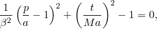

其中


是等效压力应力；

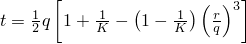

是偏量应力度量；


是Mises等效应力；


是第三个应力不变量；

*M*

是定义临界状态线斜率的常数；


是一个常数，在临界状态线的"干"侧等于1.0（），但在临界状态线的"湿"侧可能不同于1.0（ 在临界状态线的湿侧引入不同的椭圆；即如果 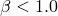，则获得更紧密的"盖帽"，如图[图23.3.4-1](pt05ch23s03abm33.md#cclayplas-yield-p-t)所示）；


是屈服面的大小（[图23.3.4-1](pt05ch23s03abm33.md#cclayplas-yield-p-t)）；和

*K*

是三轴拉伸中的流动应力与三轴压缩中的流动应力之比，并决定主偏量应力平面（"-平面"：见[图23.3.4-2](pt05ch23s03abm33.md#cclay-yield-pi)）中屈服面的形状；Abaqus要求  以确保屈服面保持凸性。

用户定义的参数 *M*、 和 *K* 可以依赖于温度  以及其他预定义场变量 。该模型在["临界状态模型，" Abaqus理论指南第4.4.3节](../stm/stm-link.md#stm-mat-criticalstate)中详细描述。

| **输入文件用法：** | ``` [*CLAY PLASTICITY](../key/key-link.md#usb-kws-mclayplast) ``` |
| --- | --- |

| **Abaqus/CAE用法：** | 属性模块：材料编辑器：****机械****塑性****黏土塑性**** |
| --- | --- |

**图23.3.4-1** *p*–*t* 平面中的黏土屈服面。

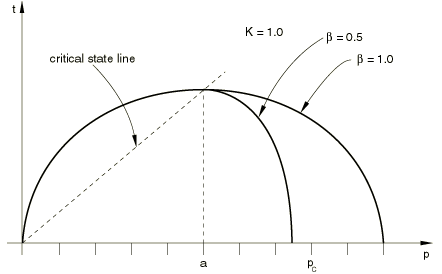

**图23.3.4-2** -平面中的黏土屈服面截面。


### 硬化定律

硬化定律可以具有指数形式（仅Abaqus/Standard）或分段线性形式。

#### Abaqus/Standard中的指数形式

硬化定律的指数形式用一些多孔弹性参数来表示，因此只能与Abaqus/Standard多孔弹性材料模型结合使用。屈服面在任意时刻的大小由硬化参数的初始值  和根据以下方程发生的非弹性体积变化量决定

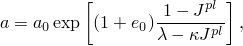

其中


是非弹性体积变化（*J*（当前体积与初始体积之比）中归因于非弹性变形的部分）；

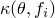

是为多孔弹性材料行为定义的材料的对数体积模量；

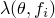

是为黏土塑性材料行为定义的对数硬化常数；和


是用户定义的初始孔隙比（["在多孔介质中定义初始孔隙比" in "Abaqus/Standard和Abaqus/Explicit中的初始条件，" 第34.2.1节"](pt07ch34s02aus116.md#usb-prc-pinitialcond-voidratio)）。

##### 直接指定屈服面的初始大小

屈服面的初始大小通过将硬化参数  定义为表格函数或通过分析定义来为黏土塑性定义。

 可以与 、*M*、 和 *K* 一起定义为温度和其他预定义场变量的表格函数。但是， 仅是初始条件的函数；如果温度和场变量在分析过程中发生变化，它不会改变。

| **输入文件用法：** | 使用以下所有选项： |
| --- | --- |
|  | ``` [*INITIAL CONDITIONS](../key/key-link.md#usb-kws-minitialcond), TYPE=RATIO [*POROUS ELASTIC](../key/key-link.md#usb-kws-mporouselastic) [*CLAY PLASTICITY](../key/key-link.md#usb-kws-mclayplast), HARDENING=EXPONENTIAL ``` |

| **Abaqus/CAE用法：** | 使用以下所有选项： |
| --- | --- |
|  | 属性模块：材料编辑器：****机械****弹性****多孔弹性********机械****塑性****黏土塑性****：****硬化：指数**** 加载模块：****创建预定义场****：****步骤：初始****：为****类别****选择****其他****，为****所选步骤的类型****选择****孔隙比**** |

##### 间接指定屈服面的初始大小

硬化参数  可以通过指定  来间接定义， 是孔隙比-对数有效压力应力图中（[图23.3.4-3](pt05ch23s03abm33.md#cclayplas-pure-comp)），原始固结线与孔隙比轴的截距。

**图23.3.4-3** 黏土模型的纯压缩行为。

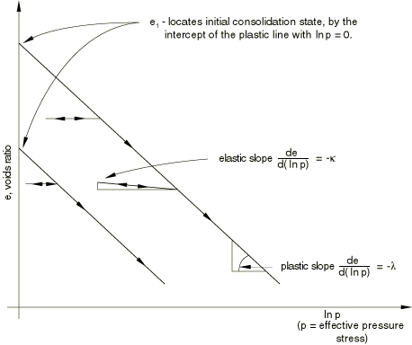

如果使用此方法， 由下式定义

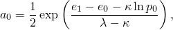

其中  是等效静水压力应力的用户定义初始值（见["在Abaqus/Standard和Abaqus/Explicit中的初始条件，" 第34.2.1节中定义初始应力"](pt07ch34s02aus116.md#usb-prc-pinitialcond-stress)）。您定义 、、*M*、 和 *K*；除 外的所有参数都可以依赖于温度和其他预定义场变量。但是， 仅是初始条件的函数；如果温度和场变量在分析过程中发生变化，它不会改变。

| **输入文件用法：** | 使用以下所有选项： |
| --- | --- |
|  | ``` [*INITIAL CONDITIONS](../key/key-link.md#usb-kws-minitialcond), TYPE=RATIO [*INITIAL CONDITIONS](../key/key-link.md#usb-kws-minitialcond), TYPE=STRESS [*POROUS ELASTIC](../key/key-link.md#usb-kws-mporouselastic) [*CLAY PLASTICITY](../key/key-link.md#usb-kws-mclayplast), HARDENING=EXPONENTIAL, INTERCEPT= ``` |

| **Abaqus/CAE用法：** | 使用以下所有选项： |
| --- | --- |
|  | 属性模块：材料编辑器：****机械****弹性****多孔弹性********机械****塑性****黏土塑性****：****硬化：指数****，****截距：****  加载模块：****创建预定义场****：****步骤：初始****：为****类别****选择****其他****，为****所选步骤的类型****选择****孔隙比**** 加载模块：****创建预定义场****：****步骤：初始****：为****类别****选择****其他****，为****所选步骤的类型****选择****应力**** |

#### 分段线性形式

如果使用硬化规则的分段线性形式，则用户定义的关系将静水压缩中的屈服应力  与相应的体积塑性应变 （[图23.3.4-4](pt05ch23s03abm33.md#cclayplas-hard-soft)）联系起来：


**图23.3.4-4** 典型的分段线性黏土硬化/软化曲线。


演化参数 *a* 然后由下式给出


体积塑性应变轴有任意原点： 是对应于材料初始状态的此轴上的位置，从而定义初始静水压力 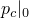，因此定义屈服面的初始大小 。此关系以表格形式定义为黏土硬化数据。定义  的值范围应足以包括材料在分析过程中将承受的所有等效应力值。

这种形式的硬化定律可以与线性弹性或Abaqus/Standard中的多孔弹性材料模型结合使用。这是Abaqus/Explicit中支持的唯一形式的硬化定律

| **输入文件用法：** | 使用以下两个选项： |
| --- | --- |
|  | ``` [*CLAY PLASTICITY](../key/key-link.md#usb-kws-mclayplast), HARDENING=TABULAR [*CLAY HARDENING](../key/key-link.md#usb-kws-mclayhardening) ``` |

| **Abaqus/CAE用法：** | 属性模块：材料编辑器：****机械****塑性****黏土塑性****：****硬化：表格****，****子选项****压缩黏土硬化**** |
| --- | --- |

### 校准

至少需要进行两个实验来校准最简单版本的Cam-clay模型：静水压缩测试（也可以接受固结测试）和三轴压缩测试（建议使用一个以上的三轴测试以获得更准确的校准）。

#### 静水压缩测试

静水压缩测试通过在所有方向上同等加压来进行。记录施加的压力和体积变化。

静水压缩测试中屈服的开始立即提供屈服面的初始位置 。对数体积模量  和  通过绘制压力对数与孔隙比的关系从静水压缩实验数据确定。孔隙比 *e* 与测量的体积变化相关为

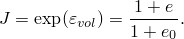

弹性 regime 中直线的斜率是 ，非弹性范围内的斜率是 。对于有效模型 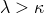。

#### 三轴测试

三轴压缩实验使用标准三轴机进行，其中保持固定的围压，同时施加差分应力。通常执行涵盖感兴趣围压范围的几个测试。同样，记录加载方向上的应力和应变，以及横向应变，以便可以校准正确的体积变化。

三轴压缩测试允许校准屈服参数 *M* 和  表示屈服面盖帽部分的曲率，可以从高围压（临界状态"湿"侧）的多个三轴测试中校准。 必须在0.0和1.0之间。

为了校准参数 *K*（控制对第三个应力不变量的屈服依赖性），需要从真三轴（立方体）测试中获得的实验结果。这些结果通常不可用，您可能需要猜测（*K* 的值通常在0.8到1.0之间）或忽略此效应。

#### 卸载测量

静水和三轴压缩测试中的卸载测量可用于校准弹性，特别是在初始弹性区域定义不明确的情况下。从这些，我们可以确定是使用恒定剪切模量还是恒定泊松比及其值。

### 初始条件

如果在一点给出了初始应力（见["在Abaqus/Standard和Abaqus/Explicit中的初始条件，" 第34.2.1节中定义初始应力"](pt07ch34s02aus116.md#usb-prc-pinitialcond-stress)），使得应力点位于最初定义的屈服面之外，Abaqus将尝试调整表面的初始位置以使应力点位于其上并发出警告。但是，如果应力点使得等效压力应力 *p* 为负，则将发出错误消息并终止执行。

### 单元

黏土塑性模型可用于Abaqus中的平面应变、广义平面应变、轴对称和三维实体（连续体）单元。该模型不能用于假定应力状态为平面应力的单元（平面应力、壳和膜单元）。

### 输出

除了Abaqus中可用的标准输出标识符（["Abaqus/Standard输出变量标识符，" 第4.2.1节"](pt02ch04s02abv01.md)和["Abaqus/Explicit输出变量标识符，" 第4.2.2节"](pt02ch04s02xbv01.md)），以下变量对黏土塑性模型中的材料点具有特殊含义：

| PEEQ | 屈服面的中心 *a*。 |
| --- | --- |


