# 23.3.5 可压碎泡沫塑性模型


**产品：** Abaqus/Standard  Abaqus/Explicit  Abaqus/CAE  

##### **参考文献**

- ["材料库：概述，" 第21.1.1节"](pt05ch21s01abo18.md)
- ["非弹性行为，" 第23.1.1节"](pt05ch23s01abo20.md)
- ["率相关屈服，" 第23.2.3节"](pt05ch23s02abm19.md)
- [*CRUSHABLE FOAM](../key/key-link.md#usb-kws-mcrushfoam)
- [*CRUSHABLE FOAM HARDENING](../key/key-link.md#usb-kws-mcrushfoamhardening)
- [*RATE DEPENDENT](../key/key-link.md#usb-kws-mratedependent)
- ["在"定义塑性，" 第12.9.2节的Abaqus/CAE用户指南中定义可压碎泡沫塑性"](../usi/usi-link.md#usi-prp-mechanical-plastic-crushablefoam)

### 概述

可压碎泡沫塑性模型：
- 旨在用于通常用作能量吸收结构的可压碎泡沫的分析；
- 可用于建模除泡沫外的可压碎材料（如巴尔沙木）；
- 用于建模泡沫材料由于胞元壁屈曲过程而在压缩中变形的增强能力（假设产生的变形不会立即恢复，因此可以理想化为短期事件的塑性）；
- 可用于建模泡沫材料的压缩强度与其由于拉伸中的胞元壁断裂而小得多的拉伸承载能力之间的差异；
- 必须与线性弹性材料模型结合使用（["线性弹性行为，" 第22.2.1节"](pt05ch22s02abm02.md)）；
- 当率相关效应重要时可以使用；和
- 旨在模拟基本单调加载条件下的材料响应。

### 弹性和塑性行为

响应的弹性部分如["线性弹性行为，" 第22.2.1节"](pt05ch22s02abm02.md)中所述进行指定。只能使用线性各向同性弹性。

对于行为的塑性部分，屈服面是偏量应力平面中的Mises圆和子午面（*p*–*q*）应力平面中的椭圆。有两种硬化模型可用：体积硬化模型，其中表示静水拉伸加载的子午面屈服椭圆上的点是固定的，屈服面的演化由体积压实塑性应变驱动；和各向同性硬化模型，其中屈服椭圆在 *p*–*q* 应力平面中以原点为中心，并以几何自相似方式演化。这种现象学各向同性模型最初由Deshpande和Fleck（2000）为金属泡沫开发。

硬化曲线必须将单轴压缩屈服应力描述为相应塑性应变的函数。在有限应变下定义此依赖性时，应给出"真实"（Cauchy）应力和对数应变值。两个模型预测压缩主导加载的类似行为。然而，对于静水拉伸加载，体积硬化模型假设理想塑性行为，而各向同性硬化模型在静水拉伸和静水压缩中预测相同的行为。

### 具有体积硬化的可压碎泡沫模型

具有体积硬化的可压碎泡沫模型使用具有偏量应力对压力应力椭圆依赖性的屈服面。它假设屈服面的演化受材料经历的体积压实塑性应变控制。

#### 屈服面

体积硬化模型的屈服面定义为

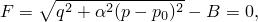

其中


是压力应力，

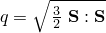

是Mises应力，


是偏量应力，

*A*

是屈服椭圆 *p* 轴（水平）的大小，


是屈服椭圆 *q* 轴（垂直）的大小，


是定义轴相对大小的屈服椭圆形状因子，

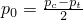

是屈服椭圆在 *p* 轴上的中心，


是材料在静水拉伸中的强度，且


是静水压缩中的屈服应力（ 始终为正）。

屈服面在偏量应力平面中表示Mises圆，在子午应力平面中表示椭圆，如图[图23.3.5-1](pt05ch23s03abm34.md#ccrushfoam-vol)所示。

**图23.3.5-1** 具有体积硬化的可压碎泡沫模型：*p*–*q* 应力平面中的屈服面和流动势。


屈服面以自相似方式演化（恒定 ）；形状因子可以使用单轴压缩中的初始屈服应力 、静水压缩中的初始屈服应力 （ 的初始值）和静水拉伸中的屈服强度  计算：

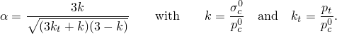

对于有效的屈服面，强度比的选择必须使  和 。如果不是这种情况，Abaqus发出错误消息并终止执行。

要定义屈服面的形状，您提供 *k* 和  的值。如果需要，这些变量可以定义为温度和其他预定义场变量的表格函数。在这种情况下，模型要求硬化曲线（如下所述）也为相同的温度和预定义场变量值指定。

| **输入文件用法：** | ``` [*CRUSHABLE FOAM](../key/key-link.md#usb-kws-mcrushfoam), HARDENING=VOLUMETRIC ``` |
| --- | --- |

| **Abaqus/CAE用法：** | 属性模块：材料编辑器：****机械****塑性****可压碎泡沫****：****硬化：体积** |
| --- | --- |

##### 校准

要使用此模型，需要知道单轴压缩中的初始屈服应力 、静水压缩中的初始屈服应力  和静水拉伸中的屈服强度 。由于泡沫材料很少在拉伸中测试，通常需要猜测泡沫在静水拉伸中的强度大小 。拉伸强度的选择不应对数值结果产生强烈影响，除非泡沫在静水拉伸中受压。常见近似是将  设置为静水压缩初始屈服应力  的5%到10%；因此，= 0.05至0.10。

#### 流动势

体积硬化模型的塑性应变率假设为


其中 *G* 是流动势，在此模型中选择为


且  是等效塑性应变率，定义为

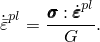

等效塑性应变率与单轴压缩中轴向塑性应变率  的关系为


流动势在 *p*–*q* 应力平面中的几何表示如图[图23.3.5-1](pt05ch23s03abm34.md#ccrushfoam-vol)所示。该势给出的流动方向与径向路径的应力方向相同。这是基于简单的实验室实验，实验表明沿任何主方向加载都会导致其他方向的变形可以忽略不计。因此，对于体积硬化模型，塑性流动是非关联的。有关塑性流动的更多详细信息，请参阅["塑性模型：一般讨论，" Abaqus理论指南第4.2.1节](../stm/stm-link.md#stm-mat-plastoverview)。

##### 非关联流动

非关联塑性流动规则使材料刚度矩阵非对称；因此，应在Abaqus/Standard中使用非对称矩阵存储和求解方案（见["定义分析，" 第6.1.2节"](pt03ch06s01abo05.md)）。当预期模型中有大量区域发生塑性流动时，使用此方案尤其重要。

#### 硬化

屈服面在 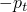 和  处与 *p* 轴相交。我们假设  在任何塑性变形过程中保持固定。相比之下，压缩强度  由于材料的压实（密度增加）或膨胀（密度降低）而演化。屈服面的演化可以通过屈服面在静水应力轴上的大小 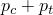 作为体积压实塑性应变  的函数来表达。有了恒定的 ，可以使用以下关系从用户提供的单轴压缩测试数据中获得此关系


以及在单轴压缩中体积硬化模型的 。因此，您通过以通常的表格形式指定单轴压缩屈服应力作为轴向塑性应变绝对值的函数来向硬化定律提供输入。表格必须从零塑性应变开始（对应于材料的原始状态），并且表格条目必须以  的升序给出。如果需要，屈服应力也可以是温度和其他预定义场变量的函数。在这种情况下，模型要求强度比 *k* 和  的值也为相同的温度和预定义场变量值指定。

| **输入文件用法：** | ``` [*CRUSHABLE FOAM HARDENING](../key/key-link.md#usb-kws-mcrushfoamhardening) ``` |
| --- | --- |

| **Abaqus/CAE用法：** | 属性模块：材料编辑器：****机械****塑性****可压碎泡沫****：****子选项****泡沫硬化**** |
| --- | --- |

#### 率相关性

随着应变率的增加，许多材料显示屈服应力增加。对于许多可压碎泡沫材料，当应变率在0.1–1每秒范围内时，这种屈服应力增加变得重要，当应变率在10–100每秒范围内时（这在高能动态事件中很常见）可能非常重要。

Abaqus提供了两种指定应变率相关材料行为的方法，如下所述。两种方法都假设不同应变率下硬化曲线的形状相似，并且都可以用于静态或动态过程。当包含率相关性时，必须如上所述为可压碎泡沫指定静态应力-应变硬化行为。

##### 过应力幂律

您可以指定定义应变率相关性的Cowper-Symonds过应力幂律。该定律的形式为

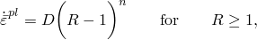

其中


其中 *B* 是静态屈服面的大小， 是非零应变率下屈服面的大小。比率 *R* 可以写为


其中 *r* 是单轴压缩屈服应力比，定义为


（作为可压碎泡沫硬化定义的一部分指定）是在最低应变率实验中给定  值的单轴压缩屈服应力，可以依赖于温度和预定义场变量；*D* 和 *n* 是材料参数，可以是温度和可能其他预定义场变量的函数。

| **输入文件用法：** | 使用以下两个选项： |
| --- | --- |
|  | ``` [*CRUSHABLE FOAM HARDENING](../key/key-link.md#usb-kws-mcrushfoamhardening) [*RATE DEPENDENT](../key/key-link.md#usb-kws-mratedependent), TYPE=POWER LAW ``` |

| **Abaqus/CAE用法：** | 属性模块：材料编辑器：****机械****塑性****可压碎泡沫****：****子选项****泡沫硬化****；****子选项****率相关****：****硬化：幂律** |
| --- | --- |

幂律率相关性可以重写为以下形式


可以遵循以下过程来基于单轴压缩测试数据获取材料参数 *D* 和 *n*。

1. 使用单轴压缩屈服应力比 *r* 计算 *R*。
2. 将轴向塑性应变率  转换为相应的等效塑性应变率 。
3. 绘制  对 。如果曲线可以近似为直线（如图[图23.3.5-2](pt05ch23s03abm34.md#ccrushfoam-power-law-cal)所示），则过应力幂律是合适的。直线的斜率是 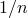， 轴的截距是 。

**图23.3.5-2** 过应力幂律数据的校准。

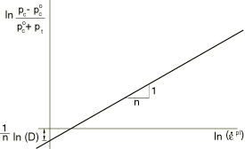

##### 屈服比的表格输入

率相关行为也可以通过给出屈服比  作为轴向塑性应变率绝对值的函数以及可选温度和预定义场变量的表格来指定。

| **输入文件用法：** | 使用以下两个选项： |
| --- | --- |
|  | ``` [*CRUSHABLE FOAM HARDENING](../key/key-link.md#usb-kws-mcrushfoamhardening) [*RATE DEPENDENT](../key/key-link.md#usb-kws-mratedependent), TYPE=YIELD RATIO ``` |

| **Abaqus/CAE用法：** | 属性模块：材料编辑器：****机械****塑性****可压碎泡沫****：****子选项****泡沫硬化****；****子选项****率相关****：****硬化：屈服比** |
| --- | --- |

#### 初始条件

当我们需要研究已经经历了一些硬化的材料的行为时，Abaqus允许您为体积压实塑性应变  规定初始条件（见["在Abaqus/Standard和Abaqus/Explicit中的初始条件，" 第34.2.1节中定义塑性硬化的状态变量初始值"](pt07ch34s02aus116.md#usb-prc-pinitialcond-hardening)）。

| **输入文件用法：** | ``` [*INITIAL CONDITIONS](../key/key-link.md#usb-kws-minitialcond), TYPE=HARDENING ``` |
| --- | --- |

| **Abaqus/CAE用法：** | 加载模块：****创建预定义场****：****步骤：**初始**，为****类别****选择****机械****，为****所选步骤的类型****选择****硬化**** |
| --- | --- |

### 具有各向同性硬化的可压碎泡沫模型

各向同性硬化模型使用在 *p*–*q* 应力平面中以原点为中心的椭圆的屈服面。屈服面以自相似方式演化，演化受等效塑性应变控制（稍后定义）。

#### 屈服面

各向同性硬化模型的屈服面定义为


其中


是压力应力，


是Mises应力，


是偏量应力，


是屈服椭圆 *q* 轴（垂直）的大小，


是定义轴相对大小的屈服椭圆形状因子，


是静水压缩中的屈服应力，且


是单轴压缩屈服应力的绝对值。

屈服面在偏量应力平面中表示Mises圆。屈服面在子午应力平面中的形状如图[图23.3.5-3](pt05ch23s03abm34.md#ccrushfoam-iso)所示。形状因子  可以使用单轴压缩中的初始屈服应力  和静水压缩中的初始屈服应力 （ 的初始值）使用以下关系计算：

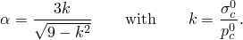

**图23.3.5-3** 具有各向同性硬化的可压碎泡沫模型：*p*–*q* 应力平面中的屈服面和流动势。


要定义屈服椭圆的形状，您提供 *k* 的值。对于有效的屈服面，强度比必须使 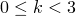。 的特殊情况对应于Mises塑性。通常，单轴压缩和静水压缩中的初始屈服强度  和  可用于计算 *k* 的值。然而，在许多实际情况下，可压碎泡沫材料的应力与应变响应曲线没有显示明确的屈服点，初始屈服应力值无法精确确定。这些响应曲线中的许多具有水平平台——屈服应力在相当大的塑性应变值范围内几乎是恒定的。如果您有单轴压缩和静水压缩两方面的数据，则可以使用两条实验曲线的平台值来计算 *k* 的比值。

| **输入文件用法：** | ``` [*CRUSHABLE FOAM](../key/key-link.md#usb-kws-mcrushfoam), HARDENING=ISOTROPIC ``` |
| --- | --- |

| **Abaqus/CAE用法：** | 属性模块：材料编辑器：****机械****塑性****可压碎泡沫****：****硬化：各向同性** |
| --- | --- |

#### 流动势

各向同性硬化模型的流动势选择为

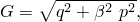

其中  表示 *p*–*q* 应力平面上流动势椭圆的形状。它通过以下关系与塑性泊松比  相关：


塑性泊松比（单轴压缩下横向与纵向塑性应变之比）必须在1和0.5之间；上限（）对应于不可压缩塑性流动的情况（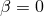）。对于许多低密度泡沫，塑性泊松比几乎为零，这对应于 。

当  的值与  相同时，塑性流动是关联的。默认情况下，塑性流动是非关联的，以允许对屈服面形状和塑性泊松比进行独立校准。如果您只有关于塑性泊松比的信息并选择使用关联塑性流动，则可以从以下公式计算屈服应力比 *k*：


或者，如果只知道屈服面的形状并且您选择使用关联塑性流动，则可以从以下公式获得塑性泊松比：


您提供  的值。

| **输入文件用法：** | ``` [*CRUSHABLE FOAM](../key/key-link.md#usb-kws-mcrushfoam), HARDENING=ISOTROPIC ``` |
| --- | --- |

| **Abaqus/CAE用法：** | 属性模块：材料编辑器：****机械****塑性****可压碎泡沫****：****硬化：各向同性** |
| --- | --- |

#### 硬化

简单的单轴压缩测试足以定义屈服面的演化。硬化定律将单轴压缩中的屈服应力定义为轴向塑性应变绝对值的函数。分段线性关系以表格形式输入。表格必须从零塑性应变开始（对应于材料的原始状态），并且表格条目必须以  的升序给出。对于大于最后用户指定值的塑性应变值，应力-应变关系基于从数据计算的最后一个斜率进行外推。如果需要，屈服应力也可以是温度和其他预定义场变量的函数。

| **输入文件用法：** | ``` [*CRUSHABLE FOAM HARDENING](../key/key-link.md#usb-kws-mcrushfoamhardening) ``` |
| --- | --- |

| **Abaqus/CAE用法：** | 属性模块：材料编辑器：****机械****塑性****可压碎泡沫****：****子选项****泡沫硬化**** |
| --- | --- |

#### 率相关性

随着应变率的增加，许多材料显示屈服应力增加。对于许多可压碎泡沫材料，当应变率在0.1–1每秒范围内时，这种屈服应力增加变得重要，当应变率在10–100每秒范围内时（这在高能动态事件中很常见）可能非常重要。

Abaqus提供了两种指定应变率相关材料行为的方法，如下所述。两种方法都假设不同应变率下硬化曲线的形状相似，并且都可以用于静态或动态过程。当包含率相关性时，必须如上所述为可压碎泡沫指定静态应力-应变硬化行为。

##### 过应力幂律

您可以指定定义应变率相关性的Cowper-Symonds过应力幂律。该定律的形式为


其中

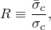

其中 （作为可压碎泡沫硬化定义的一部分指定）是在最低应变率实验中给定  值的静态单轴压缩屈服应力，且  是非零应变率下的屈服应力。 是等效塑性应变率，对于各向同性硬化模型，它等于单轴压缩中的轴向塑性应变率。

幂律率相关性可以重写为以下形式


绘制  对 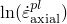。如果曲线可以近似为直线（如图[图23.3.5-2](pt05ch23s03abm34.md#ccrushfoam-power-law-cal)所示），则过应力幂律是合适的。直线的斜率是 ， 轴的截距是 。材料参数 *D* 和 *n* 可以是温度和可能其他预定义场变量的函数。

| **输入文件用法：** | 使用以下两个选项： |
| --- | --- |
|  | ``` [*CRUSHABLE FOAM HARDENING](../key/key-link.md#usb-kws-mcrushfoamhardening) [*RATE DEPENDENT](../key/key-link.md#usb-kws-mratedependent), TYPE=POWER LAW ``` |

| **Abaqus/CAE用法：** | 属性模块：材料编辑器：****机械****塑性****可压碎泡沫****：****子选项****泡沫硬化****；****子选项****率相关****：****硬化：幂律** |
| --- | --- |

##### 屈服比的表格输入

率相关行为也可以通过给出比率 *R* 作为轴向塑性应变率绝对值的函数以及可选温度和预定义场变量的表格来指定。

| **输入文件用法：** | 使用以下两个选项： |
| --- | --- |
|  | ``` [*CRUSHABLE FOAM HARDENING](../key/key-link.md#usb-kws-mcrushfoamhardening) [*RATE DEPENDENT](../key/key-link.md#usb-kws-mratedependent), TYPE=YIELD RATIO ``` |

| **Abaqus/CAE用法：** | 属性模块：材料编辑器：****机械****塑性****可压碎泡沫****：****子选项****泡沫硬化****；****子选项****率相关****：****硬化：屈服比** |
| --- | --- |

### 单元

可压碎泡沫塑性模型可用于平面应变、广义平面应变、轴对称和三维实体（连续体）单元。该模型不能用于假定应力状态为平面的单元（平面应力、壳和膜单元），也不能与梁、管道或桁架单元一起使用。

### 输出

除了Abaqus中可用的标准输出标识符（["Abaqus/Standard输出变量标识符，" 第4.2.1节"](pt02ch04s02abv01.md)和["Abaqus/Explicit输出变量标识符，" 第4.2.2节"](pt02ch04s02xbv01.md)），以下变量对可压碎泡沫塑性模型具有特殊含义：

| PEEQ | 对于体积硬化模型，PEEQ是体积压实塑性应变，定义为 。对于各向同性硬化模型，PEEQ是等效塑性应变，定义为 ，其中  是单轴压缩屈服应力。 |
| --- | --- |

体积塑性应变 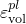 是塑性应变张量的迹；您也可以将其计算为直接塑性应变分量之和。

对于体积硬化模型，可以为使用可压碎泡沫材料模型的单元指定体积压实塑性应变的初始值，如上所述。Abaqus提供的体积压实塑性应变（输出变量PEEQ）然后包含体积压实塑性应变的初始值加上分析过程中塑性应变产生的任何额外体积压实塑性应变。然而，塑性应变张量（输出变量PE）仅包含分析过程中变形导致的应变数量。

#### 附加参考

- Deshpande, V. S., and N. A. Fleck, "Isotropic Constitutive Model for Metallic Foams," Journal of the Mechanics and Physics of Solids, vol. 48, pp. 1253--1276, 2000.


