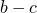
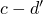
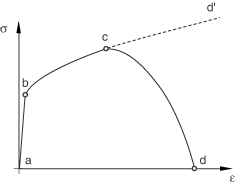

# 24.1.1 渐进损伤与失效

**产品：** Abaqus/Standard  Abaqus/Explicit  

##### **参考文献**

- ["渐进损伤与失效，" 第24.1.1节](pt05ch24s01abo21.md)

### 概述

Abaqus提供了以下模型来预测渐进损伤与失效：

**延性金属的渐进损伤与失效**：Abaqus提供了用于建模延性金属中渐进损伤与失效的通用能力。此功能可与Mises、Johnson-Cook、Hill和Drucker-Prager塑性模型结合使用（["延性金属的损伤与失效：概述，" 第24.2.1节](pt05ch24s02abm41.md)）。该功能支持指定一个或多个损伤起始准则，包括延性、剪切、成形极限图（FLD）、成形极限应力图（FLSD）、Mschenborn-Sonne成形极限图（MSFLD）以及Marciniak-Kuczynski（M-K）准则。损伤起始后，材料刚度根据指定的损伤演化响应逐步降解。渐进损伤模型允许材料刚度的平滑降解，使它们适用于准静态和动态情况，这是相对于动态失效模型的一个很大优势（["动态失效模型，" 第23.2.8节](pt05ch23s02abm24.md)）。Johnson-Cook和Marciniak-Kuczynski（M-K）损伤起始准则在Abaqus/Standard中不可用。

**纤维增强材料的渐进损伤与失效**：Abaqus提供了一种用于建模纤维增强材料中各向异性损伤的能力（["纤维增强复合材料的损伤与失效：概述，" 第24.3.1节](pt05ch24s03abm44.md)）。假定未损伤材料的响应为线弹性，该模型旨在预测可以在没有大量塑性变形的情况下起始损伤的纤维增强材料的行为。Hashin起始准则用于预测损伤起始，损伤演化定律基于损伤过程中消耗的能量和线性材料软化。

**低循环疲劳分析中延性材料的渐进损伤与失效**：Abaqus/Standard提供了一种能力，用于在使用直接循环方法进行低循环疲劳分析时，模拟由应力反转和累积非弹性应变引起的延性材料的渐进损伤与失效（参见["使用直接循环方法的低循环疲劳分析，" 第6.2.7节](pt03ch06s02at06.md)）。损伤起始准则和损伤演化通过每个稳定循环的累积非弹性滞后能量来表征（参见["低循环疲劳分析中延性材料的损伤与失效：概述，" 第24.4.1节](pt05ch24s04abm47.md)）。损伤起始后，材料弹性刚度根据指定的损伤演化响应逐步降解。

此外，Abaqus提供了混凝土损伤模型（["混凝土损伤塑性，" 第23.6.3节](pt05ch23s06abm39.md)）、动态失效模型（["动态失效模型，" 第23.2.8节](pt05ch23s02abm24.md)）以及用于建模内聚单元（["使用牵引-分离描述定义内聚单元的本构响应，" 第32.5.6节](pt06ch32s05alm45.md)）和连接器（["连接器损伤行为，" 第31.2.7节](pt06ch31s02alm33.md)）中损伤与失效的专门能力。

本节提供了渐进损伤与失效能力的概述，以及对损伤起始和演化概念的简要说明。本讨论仅限于延性金属和纤维增强材料的损伤模型。

### 建模损伤与失效的一般框架

Abaqus提供了材料失效建模的一般框架，允许在同一材料上同时组合多种失效机制。材料失效指的是由材料刚度逐步降解导致的完全丧失承载能力。刚度降解过程使用损伤力学建模。

为帮助理解Abaqus中的失效建模能力，考虑典型金属试样在简单拉伸测试期间的响应。应力-应变响应（如图24.1.1-1所示）将显示不同的阶段。材料响应最初是线弹性 followed by plastic yielding with strain hardening, 。 Beyond point *c* there is a marked reduction of load-carrying capacity until rupture, 。在此最后阶段，变形局部化在试样的颈缩区域。点*c*标识损伤起始时刻的材料状态，称为损伤起始准则。超过此点后，应力-应变响应  受应变局部化区域中刚度降解演化的控制。在损伤力学的背景下， 可以被视为材料在无损伤情况下将遵循的曲线  的降解响应。

**图24.1.1-1** 金属试样的典型单轴应力-应变响应。

因此，在Abaqus中，失效机制的规范包括四个不同的部分：
- 有效（或未损伤）材料响应的定义（例如， in [Figure 24.1.1–1](pt05ch24s01abo21.md#failure-uniaxial-test)），
- 损伤起始准则（例如，*c* in [Figure 24.1.1–1](pt05ch24s01abo21.md#failure-uniaxial-test)），
- 损伤演化定律（例如， in [Figure 24.1.1–1](pt05ch24s01abo21.md#failure-uniaxial-test)），和
- 单元删除选择，一旦材料刚度完全降解，可以从计算中删除单元（例如，*d* in [Figure 24.1.1–1](pt05ch24s01abo21.md#failure-uniaxial-test)）。

这些部分将分别为延性金属（["延性金属的损伤与失效：概述，" 第24.2.1节](pt05ch24s02abm41.md)）和纤维增强材料（["纤维增强复合材料的损伤与失效：概述，" 第24.3.1节](pt05ch24s03abm44.md)）单独讨论。

### 网格依赖性

在连续介质力学中，本构模型通常以应力-应变关系的形式表达。当材料表现出应变软化行为导致应变局部化时，这种公式化会导致有限元结果产生强烈的网格依赖性，即当网格细化时消耗的能量会减少。在Abaqus中，所有可用的损伤演化模型都使用旨在缓解网格依赖性的公式化。这是通过在公式中引入特征长度来实现的，在Abaqus中，这与单元大小相关，并将本构定律的软化部分表示为应力-位移关系。在这种情况下，损伤过程中消耗的能量按单位面积指定，而不是按单位体积指定。该能量被视为附加材料参数，用于计算发生完全材料损伤时的位移。这与将临界能量释放率作为断裂力学材料参数的概念一致。这种公式化确保了消耗的正确能量，并大大缓解了网格依赖性。

