# 25.2.1 状态方程


**产品：** Abaqus/Explicit  Abaqus/CAE  

##### **参考文献**

- ["流体力学行为：概述，" 第25.1.1节](pt05ch25s01abo22.md)
- ["材料库：概述，" 第21.1.1节](pt05ch21s01abo18.md)
- ["VUEOS，" Abaqus用户子程序参考指南第1.2.13节](../sub/sub-link.md#sub-rtn-uexpueos)
- [*EOS](../key/key-link.md#usb-kws-meos)
- [*EOS COMPACTION](../key/key-link.md#usb-kws-meoscompaction)
- [*ELASTIC](../key/key-link.md#usb-kws-melastic)
- [*VISCOSITY](../key/key-link.md#usb-kws-mviscosity)
- [*DETONATION POINT](../key/key-link.md#usb-kws-mdetonationpt)
- [*GAS SPECIFIC HEAT](../key/key-link.md#usb-kws-mgasspeccheat)
- [*REACTION RATE](../key/key-link.md#usb-kws-mreactionrate)
- [*TENSILE FAILURE](../key/key-link.md#usb-kws-mtensilefailure)
- ["在Abaqus/CAE用户指南的"定义其他机械模型"中定义状态方程，" 第12.9.4节](../usi/usi-link.md#usi-prp-mechanical-other-eos)

### 概述

状态方程：
- 在流体力学材料模型中提供，其中材料的体积强度由状态方程确定；
- 将压力（压缩中为正）确定为密度， 状态方程，必须与固相的Mie-Grüneisen或表格状态方程结合使用；
- 可用作JWL高能炸药状态方程；
- 可用作点火和生长状态方程；
- 可以理想气体的形式提供；
- 可以用户定义状态方程的形式提供（[`VUEOS`](../sub/sub-link.md#sub-xsl-vueos)）；
- 假定为绝热条件，除非使用动态完全耦合温度-位移分析；
- 可用于建模仅具有体积强度（材料假定无剪切强度）或也具有各向同性弹性或粘性偏量行为的材料；
- 可与Mises（["经典金属塑性，" 第23.2.1节](pt05ch23s02abm17.md)）或Johnson-Cook（["Johnson-Cook塑性，" 第23.2.7节](pt05ch23s02abm23.md)）塑性模型结合使用；
- 可与扩展Drucker-Prager（["扩展Drucker-Prager模型，" 第23.3.1节](pt05ch23s03abm30.md)）塑性模型结合使用（无塑性膨胀）；和
- 可与拉伸失效模型（["动态失效模型，" 第23.2.8节](pt05ch23s02abm24.md)）结合使用以建模动态层裂或压力截止。

### 能量方程和Hugoniot曲线

能量守恒方程将单位质量内能的增加，

其中*p*是定义为压缩中为正的压力应力，）。

**图25.2.1-1** Hugoniot曲线的示意图。


Hugoniot压力，

其中 

其中 

在上述假设下，线性 

其中 

或

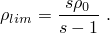

在此极限下存在最小拉伸；此后，为材料计算负声速。

| **输入文件用法：** | 使用以下两个选项： |
| --- | --- |
|  | ``` [*DENSITY](../key/key-link.md#usb-kws-mdensity) *（指定参考密度 * [*EOS](../key/key-link.md#usb-kws-meos), TYPE=USUP *（指定变量 、*s* 和 * ``` |

| **Abaqus/CAE用法：** | 属性模块：材料编辑器：****常规****密度**** *（指定参考密度 ）****机械****Eos****：** 类型：Us - Up** *（指定变量 、*s* 和 ）。状态方程使用的初始压力从指定的应力状态推断。如果未指定初始条件，Abaqus/Explicit将假定材料处于其参考状态：

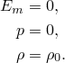

| **输入文件用法：** | 根据需要使用以下一个或两个选项： |
| --- | --- |
|  | ``` [*INITIAL CONDITIONS](../key/key-link.md#usb-kws-minitialcond), TYPE=SPECIFIC ENERGY [*INITIAL CONDITIONS](../key/key-link.md#usb-kws-minitialcond), TYPE=STRESS ``` |

| **Abaqus/CAE用法：** | 载荷模块：****创建预定义场****：** 步骤：** 初始**：为****类别****选择****机械****，为****所选步骤的类型****选择****应力**** |
| --- | --- |
|  | Abaqus/CAE中不支持初始比内能。 |

### 表格状态方程

表格状态方程在建模在压力-密度关系中表现出尖锐相变的材料（如相变引起的）的流体力学响应时提供了灵活性。表格状态方程是能量线性的，假定形式为


其中  *（指定参考密度 * [*EOS](../key/key-link.md#usb-kws-meos), TYPE=TABULAR *（指定 **密度**** *（指定参考密度 ）****机械****Eos****：** 类型：表格** *（指定 ）。状态方程使用的初始压力从指定的应力状态推断。如果未指定初始条件，Abaqus/Explicit假定材料处于其参考状态：


| **输入文件用法：** | 根据需要使用以下一个或两个选项： |
| --- | --- |
|  | ``` [*INITIAL CONDITIONS](../key/key-link.md#usb-kws-minitialcond), TYPE=SPECIFIC ENERGY [*INITIAL CONDITIONS](../key/key-link.md#usb-kws-minitialcond), TYPE=STRESS ``` |

| **Abaqus/CAE用法：** | 载荷模块：****创建预定义场****：** 步骤：** 初始**：为****类别****选择****机械****，为****所选步骤的类型****选择****应力**** |
| --- | --- |
|  | Abaqus/CAE中不支持初始比内能。 |

### 用户定义状态方程

用户定义状态方程通过用户子程序 [`VUEOS`](../sub/sub-link.md#sub-xsl-vueos)（参见["VUEOS，" Abaqus用户子程序参考指南第1.2.13节](../sub/sub-link.md#sub-rtn-uexpueos)）提供了建模材料体积响应的通用能力。状态方程将压力定义为当前密度，提供。后者用于评估有效体积模量，这对于稳定时间增量计算是必要的。

（可选）您还可以指定作为数据在用户子程序中所需的属性值数量以及解相关变量（参见["用户子程序：概述，" 第18.1.1节](pt04ch18s01aus104.md)）的数量。

| **输入文件用法：** | 使用以下选项： |
| --- | --- |
|  | ``` [*EOS](../key/key-link.md#usb-kws-meos), TYPE=USER, PROPERTIES=*n* ``` |

| **Abaqus/CAE用法：** | Abaqus/CAE中不支持用户定义状态方程。 |
| --- | --- |

#### 初始状态

您需要确保初始比内能、初始应力和初始密度满足状态方程。如果未指定初始条件，Abaqus/Explicit假定材料处于其参考状态：


| **输入文件用法：** | 使用以下一个或两个选项定义初始比内能和/或初始压力应力： |
| --- | --- |
|  | ``` [*INITIAL CONDITIONS](../key/key-link.md#usb-kws-minitialcond), TYPE=SPECIFIC ENERGY [*INITIAL CONDITIONS](../key/key-link.md#usb-kws-minitialcond), TYPE=STRESS ``` 使用以下选项定义初始密度： ``` [*DENSITY](../key/key-link.md#usb-kws-mdensity) ``` |

| **Abaqus/CAE用法：** | 载荷模块：****创建预定义场****：** 步骤：** 初始**：为****类别****选择****机械****，为****所选步骤的类型****选择****应力**** |
| --- | --- |
|  | Abaqus/CAE中不支持初始比内能。 |

### *P--α* 状态方程

 状态方程专为建模延性多孔材料的压实而设计。Abaqus/Explicit中的实现基于Hermann（1968）和Carroll and Holt（1972）提出的模型。本构模型在低应力下提供了不可逆压实行为的详细描述，并预测了完全压实固体材料在高压力下的正确热力学行为。在Abaqus/Explicit中，固相假定由Mie-Grüneisen状态方程或表格状态方程控制。将分别指定多孔材料在原始状态下的相关属性以及固相的材料属性。

材料的孔隙率，*n*，定义为孔隙体积，；否则，

假设孔隙不承受压力，从平衡考虑可知，当压力 *p* 作用于多孔材料时，它在固相中产生体积平均压力 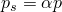。假设多孔材料和固体基质的比内能相同（即忽略孔隙的表面能），多孔材料的状态方程可以表示为


其中  状态方程简化为固相的状态方程，因此在高压下预测正确的热力学行为。

 状态方程必须补充一个描述 

其中 ），将在下文讨论。

**图25.2.1-2** 用于描述延性多孔材料压实的  弹性和塑性曲线。

，一个永远保留的值。因此，函数 ，对应于从部分压实状态的弹性卸载。根据以下规则选择 *A* 的适当分支：


这些表达式可以反演以求解 *p*：

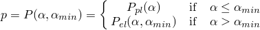

塑性曲线的方程采用以下形式


或替代地，


Hermann（1968）最初提出的弹性曲线由微分方程给出

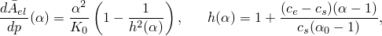

其中  分别是固体和原始（多孔）材料中的参考声速。

如果固相使用Mie-Grüneisen状态方程建模，，上述Abaqus/Explicit中弹性曲线的方程被简化并替换为线性关系


和


| **输入文件用法：** | 使用以下选项指定固相的参考密度， ``` 使用以下选项之一指定固相的其他材料属性： ``` [*EOS](../key/key-link.md#usb-kws-meos), TYPE=USUP *（如果固相使用Mie-Grüneisen状态方程建模）* [*EOS](../key/key-link.md#usb-kws-meos), TYPE=TABULAR *（如果固相使用表格状态方程建模）* ``` 使用以下选项指定多孔材料的属性（参考声速， ``` |

| **Abaqus/CAE用法：** | 属性模块：材料编辑器：****常规****密度**** *（指定参考密度 **Eos****：** 类型：Us - Up** *（如果固相使用Mie-Grüneisen状态方程建模）* ****机械****Eos****：** 类型：表格** *（如果固相使用表格状态方程建模）* 使用以下选项指定多孔材料的属性： ****机械****Eos****：****子选项**** Eos Compaction**** *（指定参考声速，）。如果未给出初始条件，Abaqus/Explicit假定材料处于其原始状态：


如果初始  状态超出允许状态范围（参见[图25.2.1-2](pt05ch25s02abm50.md#ceos-palpha)），Abaqus/Explicit将发出错误消息。当仅为 *p*（或 （或 *p*），假设  状态位于主（单调加载）曲线上。

| **输入文件用法：** | 根据需要使用以下一些或全部选项： |
| --- | --- |
|  | ``` [*INITIAL CONDITIONS](../key/key-link.md#usb-kws-minitialcond), TYPE=SPECIFIC ENERGY [*INITIAL CONDITIONS](../key/key-link.md#usb-kws-minitialcond), TYPE=STRESS [*INITIAL CONDITIONS](../key/key-link.md#usb-kws-minitialcond), TYPE=POROSITY ``` |

| **Abaqus/CAE用法：** | 载荷模块：****创建预定义场****：** 步骤：** 初始**：为****类别****选择****机械****，为****所选步骤的类型****选择****应力**** |
| --- | --- |
|  | Abaqus/CAE中不支持初始比内能和初始孔隙率。 |

### JWL高能炸药状态方程

Jones-Wilkins-Lee（或JWL）状态方程对炸药中化学能释放产生的压力进行建模。此模型以称为编程燃烧的形式实现，这意味着炸药的反应和起始不是由材料中的冲击决定的。相反，起始时间由使用爆轰波速度和距起爆点的距离的几何构造决定。

JWL状态方程可以写成单位质量内能的函数，

其中  *（指定炸药的密度 , TYPE=JWL *（指定材料常数 **密度**** *（指定炸药的密度 **Eos****：** 类型：JWL** *（指定材料常数 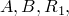 

其中 , TYPE=JWL [*DETONATION POINT](../key/key-link.md#usb-kws-mdetonationpt) ``` |

| **Abaqus/CAE用法：** | 属性模块：材料编辑器：****机械****Eos****：** 类型：JWL**：****子选项****起爆点**** |
| --- | --- |

#### 初始状态

炸药材料在爆轰前通常具有一定的标称体积刚度。当使用JWL状态方程建模的单元在爆轰波到达之前受到应力时，将此刚度结合起来可能是有用的。您可以定义爆轰前体积模量，, TYPE=STRESS ``` （可选）您还可以直接定义初始比内能： ``` [*INITIAL CONDITIONS](../key/key-link.md#usb-kws-minitialcond), TYPE=SPECIFIC ENERGY ``` |

| **Abaqus/CAE用法：** | 载荷模块：****创建预定义场****：** 步骤：** 初始**：为****类别****选择****机械****，为****所选步骤的类型****选择****应力**** |
| --- | --- |
|  | Abaqus/CAE中不支持初始比内能。 |

### 点火和生长状态方程

点火和生长状态方程对固体高能炸药的冲击起始和爆轰波传播进行建模。异质炸药被建模为两相的均匀混合物：未反应固体炸药和反应气体产物。为每相指定了单独的状态方程：

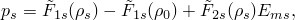


其中

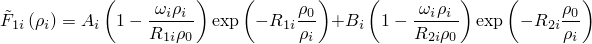

和

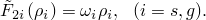

下标*s*指未反应固体炸药，*g*指反应气体产物。*（指定炸药的密度 , TYPE=IGNITION AND GROWTH, DETONATION ENERGY= *（指定未反应固体炸药和反应气体产物的材料常数  **密度**** *（指定炸药的密度 **Eos****：** 类型：点火和生长**：** 爆轰能量**： 

还假定体积是可加的：


类似地，假定内能是可加的：

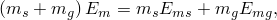

其中

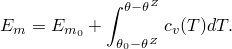

因此，混合物的比热由下式给出

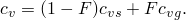

| **输入文件用法：** | 使用以下选项定义未反应固体炸药的比热： |
| --- | --- |
|  | ``` [*EOS](../key/key-link.md#usb-kws-meos), TYPE=IGNITION AND GROWTH [*SPECIFIC HEAT](../key/key-link.md#usb-kws-mspecificheat), DEPENDENCIES=*n* ``` 使用以下选项定义反应气体产物的比热： ``` [*EOS](../key/key-link.md#usb-kws-meos), TYPE=IGNITION AND GROWTH [*GAS SPECIFIC HEAT](../key/key-link.md#usb-kws-mgasspeccheat), DEPENDENCIES=*n* ``` |

| **Abaqus/CAE用法：** | 使用以下选项定义未反应固体炸药的比热： |
| --- | --- |
|  | 属性模块：材料编辑器：****机械****Eos****：** 类型：点火和生长******热****比热**** 使用以下选项定义反应气体产物的比热： 属性模块：材料编辑器：****机械****Eos****：** 类型：点火和生长**：** 气相比热**选项卡页面：****比热**** 您可以切换**使用温度依赖数据**以将比热定义为温度和/或场变量的函数，和/或选择****场变量数量**以将比热定义为场变量的函数。 |

#### 反应速率

未反应固体炸药向反应气体产物的转化由反应速率控制。点火和生长模型中的反应速率方程是压力驱动规则，包括三个项：

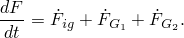

这三个项定义如下：

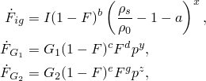

其中 

| **输入文件用法：** | 使用以下两个选项定义反应速率： |
| --- | --- |
|  | ``` [*EOS](../key/key-link.md#usb-kws-meos), TYPE=IGNITION AND GROWTH [*REACTION RATE](../key/key-link.md#usb-kws-mreactionrate) ``` |

| **Abaqus/CAE用法：** | 属性模块：材料编辑器：****机械****Eos****：** 类型：点火和生长**：** 反应速率**选项卡页面 |
| --- | --- |

#### 初始状态

假定未反应固体炸药的初始质量分数为1。点火和生长方程中使用的初始相对密度（, TYPE=SPECIFIC ENERGY ``` |

| **Abaqus/CAE用法：** | Abaqus/CAE中不支持初始比内能。 |
| --- | --- |

### 理想气体状态方程

理想气体状态方程可以写成以下形式


其中 

其中 

一般来说，任何气体的 *R* 值可以通过将  绘制为状态（例如，压力或温度）的函数来估计。理想气体近似在任何此值为常数的区域都是足够的。您必须指定恒容比热，

| **输入文件用法：** | 使用以下两个选项： |
| --- | --- |
|  | ``` [*EOS](../key/key-link.md#usb-kws-meos), TYPE=IDEAL GAS [*SPECIFIC HEAT](../key/key-link.md#usb-kws-mspecificheat), DEPENDENCIES=*n* ``` |

| **Abaqus/CAE用法：** | 属性模块：材料编辑器：****机械****Eos****：** 类型：理想气体******热****比热**** |
| --- | --- |

#### 初始状态

有多种方法可以定义气体的初始状态。您可以指定初始密度，

（可选）您可以通过直接定义理想气体的初始比内能来覆盖此默认行为。

| **输入文件用法：** | 根据需要使用以下一些或全部选项： |
| --- | --- |
|  | ``` [*DENSITY](../key/key-link.md#usb-kws-mdensity), DEPENDENCIES=*n* [*INITIAL CONDITIONS](../key/key-link.md#usb-kws-minitialcond), TYPE=STRESS [*INITIAL CONDITIONS](../key/key-link.md#usb-kws-minitialcond), TYPE=TEMPERATURE ``` 使用以下选项直接指定初始比内能： ``` [*INITIAL CONDITIONS](../key/key-link.md#usb-kws-minitialcond), TYPE=SPECIFIC ENERGY ``` |

| **Abaqus/CAE用法：** | 属性模块：材料编辑器：****常规****密度**** |
| --- | --- |
|  | 载荷模块：****创建预定义场****：** 步骤：** 初始**：选择****其他****作为****类别****，选择****温度****作为****所选步骤的类型**** 载荷模块：****创建预定义场****：** 步骤：** 初始**：选择****机械****作为****类别****，选择****应力****作为****所选步骤的类型**** Abaqus/CAE中不支持初始比内能。 |

#### 绝对零的值

当使用非绝对温度标尺时，必须指定绝对零温度的值。

| **输入文件用法：** | ``` [*PHYSICAL CONSTANTS](../key/key-link.md#usb-kws-mphysicalconsts), ABSOLUTE ZERO= ``` |
| --- | --- |

| **Abaqus/CAE用法：** | 任何模块：****模型****编辑属性*****模型名称****：****绝对零温度**** |
| --- | --- |

#### 一个特殊情况

对于具有恒定比热的绝热分析（

因此，压力应力可以重写为常见形式

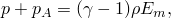

其中 

其中


对于单原子；

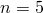

对于双原子；和

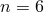

对于多原子气体。

#### 与静水压流体模型的比较

理想气体状态方程可用于对波传播效应和气体区域空间变化状态的动力学进行建模。对于气体惯性效应不重要且可以假定气体状态在整个区域均匀的情况，静水压流体模型（["基于表面的流体腔：概述，" 第11.5.1节](pt04ch11s05aus70.md)）是一种更简单、计算效率更高的替代方案。

### 偏量行为

状态方程仅定义材料的静水压行为。它可以单独使用，在这种情况下，材料仅具有体积强度（假定材料无剪切强度）。或者，Abaqus/Explicit允许您定义偏量行为，假定偏量和体积响应是解耦的。偏量响应有两种模型可用：线性各向同性弹性模型和粘性模型。材料的体积响应由状态方程模型控制，而其偏量响应由线性弹性剪切模型或粘性流体模型控制。

#### 弹性剪切行为

对于弹性剪切行为，偏量应力与偏量应变的关系为


其中 ，了解更多详情。

| **输入文件用法：** | 使用以下两个选项定义弹性剪切行为： |
| --- | --- |
|  | ``` [*EOS](../key/key-link.md#usb-kws-meos) [*ELASTIC](../key/key-link.md#usb-kws-melastic), TYPE=SHEAR ``` |

| **Abaqus/CAE用法：** | 属性模块：材料编辑器：****机械****弹性****弹性****；**** 类型：剪切****；**** 剪切模量**** |
| --- | --- |

#### 粘性剪切行为

对于粘性剪切行为，偏量应力与偏量应变率的关系为


其中 中描述。

| **输入文件用法：** | 使用以下两个选项定义粘性剪切行为： |
| --- | --- |
|  | ``` [*EOS](../key/key-link.md#usb-kws-meos) [*VISCOSITY](../key/key-link.md#usb-kws-mviscosity) ``` |

| **Abaqus/CAE用法：** | 属性模块：材料编辑器：****机械****粘度**** |
| --- | --- |

### 与Mises或Johnson-Cook塑性模型结合使用

状态方程模型可以与Mises（["经典金属塑性，" 第23.2.1节](pt05ch23s02abm17.md)）或Johnson-Cook（["Johnson-Cook塑性，" 第23.2.7节](pt05ch23s02abm23.md)）塑性模型结合使用来建模弹塑性行为。在这种情况下，您必须定义剪切行为的弹性部分。材料的体积响应由状态方程模型控制，而偏量响应由线性弹性剪切和塑性模型控制。

| **输入文件用法：** | 使用以下选项： |
| --- | --- |
|  | ``` [*EOS](../key/key-link.md#usb-kws-meos) [*ELASTIC](../key/key-link.md#usb-kws-melastic), TYPE=SHEAR [*PLASTIC](../key/key-link.md#usb-kws-mplastic) ``` |

| **Abaqus/CAE用法：** | 属性模块：材料编辑器：****机械****弹性****弹性****；**** 类型：剪切******机械****塑性****塑性**** |
| --- | --- |

#### 初始条件

您可以为等效塑性应变，）。

| **输入文件用法：** | ``` [*INITIAL CONDITIONS](../key/key-link.md#usb-kws-minitialcond), TYPE=HARDENING ``` |
| --- | --- |

| **Abaqus/CAE用法：** | 载荷模块：****创建预定义场****：** 步骤：** 初始**，选择****机械****作为****类别****，选择****硬化****作为****所选步骤的类型**** |
| --- | --- |

### 与扩展Drucker-Prager塑性模型结合使用

状态方程模型可以与扩展Drucker-Prager（["扩展Drucker-Prager模型，" 第23.3.1节](pt05ch23s03abm30.md)）塑性模型结合使用来建模压力相关塑性行为。这种方法适用于建模陶瓷和其他脆性材料在高速冲击条件下的响应。在这种情况下，您必须定义剪切行为的弹性部分。材料的偏量响应由线性弹性剪切和压力相关塑性模型控制，而体积响应由状态方程模型控制。特别地，不考虑塑性膨胀效应（如果您指定非零的膨胀角，则该值被忽略，Abaqus/Explicit会发出警告消息）。

["陶瓷靶的高速冲击，" Abaqus示例问题指南第2.1.18节](../exa/exa-link.md#exa-dyn-impactceramictarget)说明了将状态方程模型与扩展Drucker-Prager塑性模型结合使用的示例。

| **输入文件用法：** | 使用以下选项： |
| --- | --- |
|  | ``` [*EOS](../key/key-link.md#usb-kws-meos) [*ELASTIC](../key/key-link.md#usb-kws-melastic), TYPE=SHEAR [*DRUCKER PRAGER](../key/key-link.md#usb-kws-mdruckerprager) [*DRUCKER PRAGER HARDENING](../key/key-link.md#usb-kws-mdruckerhardening) ``` |

| **Abaqus/CAE用法：** | 属性模块：材料编辑器：****机械****弹性****弹性****；**** 类型：剪切******机械****塑性****Drucker Prager****：****子选项****Drucker Prager硬化**** |
| --- | --- |

#### 初始条件

您可以为等效塑性应变，）。

| **输入文件用法：** | ``` [*INITIAL CONDITIONS](../key/key-link.md#usb-kws-minitialcond), TYPE=HARDENING ``` |
| --- | --- |

| **Abaqus/CAE用法：** | 载荷模块：****创建预定义场****：** 步骤：** 初始**，选择****机械****作为****类别****，选择****硬化****作为****所选步骤的类型**** |
| --- | --- |

### 与拉伸失效模型结合使用

状态方程模型（除理想气体状态方程外）也可以与拉伸失效模型（["动态失效模型，" 第23.2.8节](pt05ch23s02abm24.md)）结合使用来建模动态层裂或压力截止。拉伸失效模型使用静水压力应力作为失效度量，并提供多种失效选择。您必须提供静水压截止应力。

您可以指定当满足拉伸失效准则时偏量应力应失效。如果未定义材料的偏量行为，则此规范没有意义，因此被忽略。

Abaqus/Explicit中的拉伸失效模型专为惯性效应重要的高应变率动态问题而设计。因此，应仅用于这种情况。不正确使用拉伸失效模型可能导致不正确的模拟。

| **输入文件用法：** | 使用以下选项： |
| --- | --- |
|  | ``` [*EOS](../key/key-link.md#usb-kws-meos) [*TENSILE FAILURE](../key/key-link.md#usb-kws-mtensilefailure) ``` |

| **Abaqus/CAE用法：** | Abaqus/CAE中不支持拉伸失效模型。 |
| --- | --- |

### 绝热假设

对于用状态方程建模的材料，除非使用动态耦合温度-位移过程，否则始终假定为绝热条件。无论是否为绝热动态应力分析步骤指定了绝热条件，都假定绝热条件。温度升高直接在材料积分点根据机械功引起的绝热热能增加计算

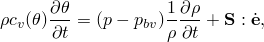

其中  状态方程模型可用于对由Navier-Stokes运动方程支配的不可压缩粘性和无粘性层流进行建模。体积响应由状态方程控制，其中体积模量用作不可压缩约束的惩罚参数。

要对遵循牛顿流体Navier-Poisson定律的粘性层流进行建模，请使用牛顿粘性偏量模型，并将粘度定义为流体的真实线性粘度。要对非牛顿粘性流进行建模，请使用Abaqus/Explicit中可用的一种非线性粘度模型。速度和应力适当的初始条件对于获得此类问题的准确解决方案至关重要。

要在Abaqus/Explicit中对不可压缩无粘性流体（如水）进行建模，定义少量剪切阻力以抑制可能使网格缠结的剪切模式是有用的。这里剪切刚度或剪切粘度用作惩罚参数。剪切模量或粘度应该很小，因为流是无粘性的；高剪切模量或粘度将导致过度刚硬的响应。为避免过度刚硬的响应，由材料偏量响应引起的内力应比由体积响应引起的内力低几个数量级。这可以通过选择比体积模量低几个数量级的弹性剪切模量来实现。如果使用粘性模型，指定的剪切粘度应该在数量级上等于如上计算的剪切模量，按稳定时间增量缩放。预期的稳定时间增量可以从模型的数据检查分析中获得。此方法是近似剪切阻力的方便方式，不会引入过大的材料粘度。

如果定义了剪切模型，则基于材料的剪切阻力计算沙漏控制力。因此，在具有极低或零剪切强度（如无粘性流体）的材料中，基于默认参数计算的沙漏力不足以防止伪沙漏模式。因此，建议使用足够高的沙漏缩放因子来增加对此类模式的阻力。

### 单元

状态方程可用于Abaqus/Explicit中除平面应力单元外的任何固体（连续体）单元。对于表现出高约束的三维应用，建议对减缩积分固体单元使用默认运动学公式（参见["截面控制，" 第27.1.4节](pt06ch27s01aus113.md)）。

### 输出

除了Abaqus中可用的标准输出标识符（["Abaqus/Explicit输出变量标识符，" 第4.2.2节](pt02ch04s02xbv01.md)），以下变量对状态方程模型具有特殊含义：

| PALPH |  多孔材料的分散， 多孔材料塑性压实期间达到的分散最小值，"）。这仅在状态方程模型与Mises、Johnson-Cook或扩展Drucker-Prager塑性模型结合使用时才相关。 |
| --- | --- |

#### 附加参考资料

- Carroll, M., and A. C. Holt, "Suggested Modification of the  Model for Porous Materials," Journal of Applied Physics, vol. 43, no.2, pp. 759--761, 1972.
- Dobratz, B. M., "LLNL Explosives Handbook, Properties of Chemical Explosives and Explosive Simulants," UCRL-52997, Lawrence Livermore National Laboratory, Livermore, California, January 1981.
- Herrmann, W., "Constitutive Equation for the Dynamic Compaction of Ductile Porous Materials," Journal of Applied Physics, vol. 40, no.6, pp. 2490--2499, 1968.
- Lee, E., M. Finger, and W. Collins, "JWL Equation of State Coefficients for High Explosives," UCID-16189, Lawrence Livermore National Laboratory, Livermore, California, January 1973.
- Wardlaw, A. B., R. McKeown, and H. Chen, "Implementation and Application of the  Equation of State in the DYSMAS Code," Naval Surface Warfare Center, Dahlgren Division, Report Number: NSWCDD/TR-95/107, May 1996.

