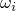
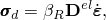
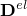
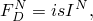
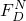
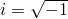
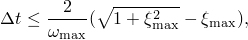
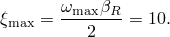
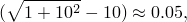
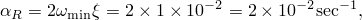

# 26.1.1 材料阻尼

**产品：** Abaqus/Standard  Abaqus/Explicit  Abaqus/CAE

##### **参考资料**

- ["动态分析程序：概述，" 第6.3.1节](pt03ch06s03abo07.md)
- ["材料库：概述，" 第21.1.1节](pt05ch21s01abo18.md)
- [*DAMPING](../key/key-link.md#usb-kws-mdamping)
- ["在"定义其他机械模型"中定义阻尼，" Abaqus/CAE用户指南第12.9.4节](../usi/usi-link.md#usi-prp-mechanical-other-damping)

### 概述

材料阻尼可按以下方式定义：
- 用于直接积分（非线性、隐式或显式）、基于子空间的直接积分、直接解稳态动态和基于子空间的稳态动态分析；或
- 用于Abaqus/Standard中基于模态的（线性）动态分析。

### 瑞利阻尼

在直接积分动态分析中，您通常将能量耗散机制（如粘性阻尼、非弹性材料行为等）作为基本模型的一部分来定义。在这种情况下，通常无需引入额外的阻尼：与这些其他耗散效应相比，它通常不重要。然而，某些模型没有这种耗散源（例如，具有振动接触的线性系统，如地震事件中的管道）。在这种情况下，通常需要引入一些通用阻尼。Abaqus为此目的提供"瑞利"阻尼。它提供了一种方便的抽象方法来阻尼较低（与质量相关）和较高（与刚度相关）频率范围的行为。

瑞利阻尼也可用于直接解稳态动态分析和基于子空间的稳态动态分析，以获得定量的准确结果，特别是在自然频率附近。

要定义材料瑞利阻尼，您需要指定两个瑞利阻尼因子：质量比例阻尼的和刚度比例阻尼的。通常，阻尼是作为材料定义的一部分指定的材料属性。对于旋转惯性、点质量单元和子结构的情况（其中没有材料定义的引用），阻尼可以与属性引用结合定义。任何质量比例阻尼也适用于非结构特征（参见["非结构质量定义，" 第2.7.1节](pt01ch02s07aus25.md)）。

对于给定模式*i*，临界阻尼的分数，，可以按照以下方式用阻尼因子表示：


其中是该模式的自然频率。这个方程意味着，一般来说，质量比例瑞利阻尼，，阻尼较低频率，而刚度比例瑞利阻尼，，阻尼较高频率。

#### 质量比例阻尼

因子引入由模型绝对速度引起的阻尼力，因此模拟了模型穿过粘性"以太"（一种渗透性静止流体，因此模型中任何点的运动都会引起阻尼）的概念。这个阻尼因子定义了质量比例阻尼，就其给出与元素质量矩阵成比例的阻尼贡献而言。如果元素在Abaqus/Standard中包含一种以上材料，则使用的体积平均值乘以元素的质量矩阵来定义该项的阻尼贡献。如果元素在Abaqus/Explicit中包含一种以上材料，则使用的质量平均值乘以元素的集中质量矩阵来定义该项的阻尼贡献。的单位为（1/时间）。

| **输入文件用法：** | ``` [*DAMPING](../key/key-link.md#usb-kws-mdamping), ALPHA= ``` |
| --- | --- |

| **Abaqus/CAE用法：** | 属性模块：材料编辑器：****机械****阻尼****：** Alpha**：  |
| --- | --- |

##### 在Abaqus/Explicit中定义可变质量比例阻尼

在Abaqus/Explicit中，您可以将定义为温度和/或场变量的表格函数。因此，质量比例阻尼可以在Abaqus/Explicit分析过程中变化。

| **输入文件用法：** | ``` [*DAMPING](../key/key-link.md#usb-kws-mdamping), ALPHA=TABULAR ``` |
| --- | --- |

#### 刚度比例阻尼

因子引入与应变率成比例的阻尼，这可以被认为是与材料本身相关的阻尼。定义了与弹性材料刚度成比例的阻尼。由于模型可能具有相当一般的非线性响应，"刚度比例阻尼"的概念必须被推广，因为切线刚度矩阵可能具有负特征值（这意味着负阻尼）。为了克服这个问题，被解释为在Abaqus中定义粘性材料阻尼，它创建一个额外的"阻尼应力"，，与总应变率成比例：



其中是应变率。对于超弹性（["橡胶状材料的超弹性行为，" 第22.5.1节](pt05ch22s05abm07.md)）和超泡沫（["弹性泡沫中的超弹性行为，" 第22.5.2节](pt05ch22s05abm08.md)）材料，被定义为应变自由状态下的弹性刚度。对于Abaqus/Standard中的所有其他线性弹性材料和Abaqus/Explicit中的所有其他材料，是材料当前的弹性刚度。将在分析过程中基于当前温度计算。

这个阻尼应力在形成动态平衡方程时添加到由本构响应在积分点引起的应力中，但它不包含在应力输出中。因此，阻尼可以为任何非线性情况引入，并为线性情况提供标准瑞利阻尼；对于线性情况，刚度比例阻尼与定义阻尼矩阵等于刚度比例阻尼矩阵完全相同。其他对刚度矩阵的贡献（如沙漏、横向剪切和钻孔刚度）在计算刚度比例阻尼时不包括在内。的单位为（时间）。

| **输入文件用法：** | ``` [*DAMPING](../key/key-link.md#usb-kws-mdamping), BETA= ``` |
| --- | --- |

| **Abaqus/CAE用法：** | 属性模块：材料编辑器：****机械****阻尼****：** Beta**：  |
| --- | --- |

##### 在Abaqus/Explicit中定义可变刚度比例阻尼

在Abaqus/Explicit中，您可以将定义为温度和/或场变量的表格函数。因此，刚度比例阻尼可以在Abaqus/Explicit分析过程中变化。

| **输入文件用法：** | ``` [*DAMPING](../key/key-link.md#usb-kws-mdamping), BETA=TABULAR ``` |
| --- | --- |

### 结构阻尼

结构阻尼假设阻尼力与结构应力引起的力成比例，并与速度相反。因此，这种形式的阻尼只能在与位移和速度完全90度相位差的情况下使用。结构阻尼最适合频率域动态程序（参见下面的["模态叠加程序中的阻尼](pt05ch26s01abm51.md#usb-mat-cdampingopt-modal)"）。阻尼力为



其中是阻尼力，，*s*是用户定义的结构阻尼因子，是结构应力引起的力。结构阻尼引起的阻尼力旨在表示摩擦效应（与粘性效应不同）。因此，建议对涉及材料表现出摩擦行为或整个模型存在局部摩擦效应的模型使用结构阻尼，如多连杆结构中关节的干摩擦。

结构阻尼可以作为机械阻尼器（如连接器阻尼）或弹簧元素的复刚度添加到模型中。

结构阻尼可用于允许非对角阻尼的稳态动态程序。

| **输入文件用法：** | 使用以下选项定义结构阻尼： |
| --- | --- |
|  | ``` [*DAMPING](../key/key-link.md#usb-kws-mdamping), STRUCTURAL= ``` |

| **Abaqus/CAE用法：** | 属性模块：材料编辑器：****机械****阻尼****：** Structural**：  |
| --- | --- |

### 直接积分动态分析中的人工阻尼

在Abaqus/Standard中，用于隐式直接时间积分的算子除了瑞利阻尼外还引入了一些人工阻尼。与Hilber-Hughes-Taylor和混合算子相关的人工阻尼通常由Hilber-Hughes-Taylor参数控制，这与控制瑞利阻尼质量比例部分的参数不同。Hilber-Hughes-Taylor和混合算子的和参数也影响数值阻尼。、和参数不适用于后退Euler算子。有关这种其他形式阻尼的更多信息，请参见["使用直接积分的隐式动态分析，" 第6.3.2节](pt03ch06s03at07.md)。

### 显式动态分析中的人工阻尼

瑞利阻尼旨在反映实际材料中的物理阻尼。在Abaqus/Explicit中，默认情况下会引入少量数值阻尼，以体粘性的形式控制高频振荡；有关这种其他形式阻尼的更多信息，请参见["显式动态分析，" 第6.3.3节](pt03ch06s03at08.md)。

### 阻尼对Abaqus/Explicit稳定时间步长的影响

随着最高模式临界阻尼分数（）的增加，Abaqus/Explicit的稳定时间步长根据以下方程减小



其中（通过代入先前给出的方程中的最高频率 1000 rad/sec。这个问题中的最低模式对应于弯曲的悬臂，最高频率与单个元素的膨胀有关。

无阻尼时稳定时间步长为


如果我们使用刚度比例阻尼在最低模式中产生1%的临界阻尼，阻尼因子由下式给出


这对应于最高模式中的临界阻尼因子



因此，有阻尼时的稳定时间步长减少了



变为


因此，在最低模式中引入1%的临界阻尼会使稳定时间步长减少二十倍。

然而，如果我们使用质量比例阻尼来用1%的临界阻尼抑制最低模式，阻尼因子由下式给出



这对应于最高模式中的临界阻尼因子


有阻尼时的稳定时间步长减少了


几乎可以忽略不计。

这个例子表明，通常最好使用质量比例阻尼来抑制低频响应，而不是刚度比例阻尼。然而，质量比例阻尼会显著影响刚体运动，因此大的通常是不可取的。为了避免稳定时间步长急剧下降，刚度比例阻尼因子，，应小于或等于无阻尼时的初始稳定时间步长。有了，稳定时间步长减少约52%。

### 模态叠加程序中的阻尼

阻尼可以作为模态叠加程序的步定义的一部分来指定。[ "动态分析程序：概述"第6.3.1节中的"线性动态分析中的阻尼"](pt03ch06s03abo07.md#usb-anl-adynamicproc-linear)描述了阻尼类型的可用性，这取决于程序类型和用于执行分析的结构，并提供了以下阻尼类型的详细信息：
- 粘性模态阻尼（瑞利阻尼和临界阻尼分数）
- 结构模态阻尼
- 复合模态阻尼

### 材料选项

因子适用于所有使用线性弹性材料定义（["线性弹性行为，" 第22.2.1节](pt05ch22s02abm02.md)）的元素和使用通用截面的Abaqus/Standard梁和壳单元。在后一种情况下，如果提供了非线性梁截面定义，因子乘以零应变或曲率时力-应变（或力矩-曲率）关系的斜率。此外，因子适用于所有使用超弹性材料定义（["橡胶状材料的超弹性行为，" 第22.5.1节](pt05ch22s05abm07.md)）、超泡沫材料定义（["弹性泡沫中的超弹性行为，" 第22.5.2节](pt05ch22s05abm08.md)）或通用壳截面（["使用通用壳截面定义截面行为，" 第29.6.6节](pt06ch29s06alm20.md)）的Abaqus/Explicit元素。

对于无张力弹性材料，因子在张力中不使用，而对于无压力弹性材料，因子在压力中不使用（参见["无压缩或无张力，" 第22.2.2节](pt05ch22s02abm03.md)）。换句话说，这些修改的弹性模型仅在具有刚度时表现出阻尼。

### 单元

因子应用于所有有质量的单元（包括点质量单元；每个全局方向上的离散DASHPOTA元素，每个元素有一个节点固定，也可用于引入这种类型的阻尼）。对于点质量和旋转惯性元素，质量比例或复合模态阻尼作为点质量或旋转惯性定义的一部分来定义（["点质量，" 第30.1.1节](pt06ch30s01alm21.md)，和["旋转惯性，" 第30.2.1节](pt06ch30s02alm22.md)）。

因子不适用于弹簧元素：应使用离散阻尼器元素与弹簧元素并联。

因子也不应用于Abaqus/Standard梁和壳的横向剪切项。

在Abaqus/Standard中，复合模态阻尼不能与子结构一起使用或在其中使用。瑞利阻尼可以引入到子结构中。当在子结构中使用瑞利阻尼时，和在子结构上取平均值，以定义子结构的单一和值。这些是加权平均值，使用质量作为的加权因子，使用体积作为的加权因子。这些平均阻尼值可以通过在第二个阻尼定义中直接提供来覆盖。参见["使用子结构，" 第10.1.1节](pt04ch10s01aus58.md)。
