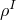

# 26.1.2 热膨胀

**产品：** Abaqus/Standard  Abaqus/Explicit  Abaqus/CFD  Abaqus/CAE

##### **参考资料**

- ["材料库：概述，" 第21.1.1节](pt05ch21s01abo18.md)
- ["UEXPAN，" Abaqus用户子程序参考指南第1.1.30节](../sub/sub-link.md#sub-rtn-uuexpan)
- [*EXPANSION](../key/key-link.md#usb-kws-mexpansion)
- ["定义其他机械模型，" Abaqus/CAE用户指南第12.9.4节](../usi/usi-link.md#usi-prp-mechanical-other)
- ["定义充液多孔材料，" Abaqus/CAE用户指南第12.12.3节](../usi/usi-link.md#usi-prp-other-porefluid)

### 概述

热膨胀效应：
- 可以通过指定热膨胀系数来定义，以便Abaqus可以计算热应变，以及在Abaqus/CFD中计算浮力；
- 可以是各向同性、正交各向异性或完全各向异性；
- 定义为从参考温度起的总膨胀；
- 可以指定为温度和/或场变量的函数；
- 可以在Abaqus/Standard中为固体连续体元素使用分布定义；以及
- 在Abaqus/Standard中可以直接在用户子程序[`UEXPAN`](../sub/sub-link.md#sub-xsl-uexpan)中指定（如果热应变是场变量和状态变量的复杂函数）。

### 定义热膨胀系数

热膨胀是包含在材料定义中的材料属性（参见["材料数据定义，" 第21.1.2节](pt05ch21s01aus109.md)），但当它指的是其材料属性未作为材料定义一部分的垫圈的膨胀时除外。在这种情况下，膨胀必须与垫圈行为定义结合使用（参见["使用垫圈行为模型直接定义垫圈行为，" 第32.6.6节](pt06ch32s06alm51.md)）。

在Abaqus/Standard分析中，可以通过使用分布（["分布定义，" 第2.8.1节](pt01ch02s08aus26.md)）为均质固体连续体元素定义空间变化的热膨胀。分布必须包含热膨胀的默认值。如果使用分布，则不能定义热膨胀对温度和/或场变量的依赖性。

在Abaqus/CFD分析中，可以定义热膨胀系数，，用于计算固体材料中的热应变，并且可以定义体积热膨胀系数，，用于计算流体材料中的浮力。详见下面["热应变计算](pt05ch26s01abm52.md#usb-mat-cthermalstrains)”和["Abaqus/CFD中浮力计算](pt05ch26s01abm52.md#usb-mat-cthermalbuoyancy)”中对每个系数的详细说明。

| **输入文件用法：** | 使用以下选项为大多数材料定义热膨胀： |
| --- | --- |
|  | ``` [*MATERIAL](../key/key-link.md#usb-kws-mmaterial) [*EXPANSION](../key/key-link.md#usb-kws-mexpansion) ``` 使用以下选项为其本构响应直接定义为垫圈行为的垫圈定义热膨胀： ``` [*GASKET BEHAVIOR](../key/key-link.md#usb-kws-mgasketbehavior) [*EXPANSION](../key/key-link.md#usb-kws-mexpansion) ``` |

| **Abaqus/CAE用法：** | 使用以下选项与其他材料行为（包括垫圈行为）结合以包含热膨胀效应： |
| --- | --- |
|  | 属性模块：材料编辑器：****机械****膨胀**** |

#### 热应变计算

Abaqus需要热膨胀系数，，它定义了从参考温度，）。

**图26.1.2-1** 热膨胀系数的定义。


它们根据公式产生热应变


其中


是热膨胀系数；


是当前温度；


是初始温度；


是预定义场变量的当前值；


是场变量的初始值；以及


是热膨胀系数的参考温度。

上述方程中的第二项表示由初始温度，是温度或场变量的函数，则可以定义, ZERO= ``` |
| --- | --- |

| **Abaqus/CAE用法：** | 属性模块：材料编辑器：****机械****膨胀****：** 参考温度：**  |
| --- | --- |

#### Abaqus/CFD中浮力的计算

在Abaqus/CFD流体中驱动自然对流的浮力使用Boussinesq近似计算


其中


是密度；



是初始密度；


是重力加速度；


是温度；


是参考温度；以及


是体积热膨胀系数。

体积热膨胀系数，）。要转换为Abaqus所需的总热膨胀形式，必须从适当选择的参考温度，

Abaqus所需的总膨胀系数随后获得为


### 在用户子程序[`UEXPAN`](../sub/sub-link.md#sub-xsl-uexpan)中定义热应变增量

在Abaqus/Standard用户子程序[`UEXPAN`](../sub/sub-link.md#sub-xsl-uexpan)中，可以将热应变增量指定为温度和/或预定义场变量的函数。如果热应变增量取决于状态变量，则必须使用用户子程序[`UEXPAN`](../sub/sub-link.md#sub-xsl-uexpan)。

| **输入文件用法：** | ``` [*EXPANSION](../key/key-link.md#usb-kws-mexpansion), USER ``` |
| --- | --- |

| **Abaqus/CAE用法：** | 属性模块：材料编辑器：****机械****膨胀****：** 使用用户子程序UEXPAN** |
| --- | --- |

### 定义初始温度和场变量值

如果热膨胀系数，），则在热应变方程中的）。

Abaqus/Explicit中的正交各向异性热膨胀仅允许与各向异性弹性（包括正交各向异性弹性）和各向异性屈服一起使用（参见["各向异性屈服/蠕变，" 第23.2.6节](pt05ch23s02abm22.md)）。

在Abaqus/CFD中、绝热应力分析以及超弹性和超泡沫材料模型中，仅允许各向同性热膨胀。

#### 各向同性膨胀

如果直接定义热膨胀系数，则在每个温度下只需要一个，则只需定义一个各向同性热应变增量（, TYPE=ISO ``` 使用以下选项使用用户子程序[`UEXPAN`](../sub/sub-link.md#sub-xsl-uexpan)定义热膨胀： ``` [*EXPANSION](../key/key-link.md#usb-kws-mexpansion), TYPE=ISO, USER ``` |

| **Abaqus/CAE用法：** | 使用以下输入直接定义热膨胀系数： |
| --- | --- |
|  | 属性模块：材料编辑器：****机械****膨胀****：** 类型：各向同性** 使用以下输入使用用户子程序[`UEXPAN`](../sub/sub-link.md#sub-xsl-uexpan)定义热膨胀：属性模块：材料编辑器：****机械****膨胀****：** 类型：各向同性**，**使用用户子程序UEXPAN** |

#### 正交各向异性膨胀

如果直接定义热膨胀系数，则应将主材料方向上的三个膨胀系数（，则必须定义主材料方向上热应变增量的三个分量（, TYPE=ORTHO ``` 使用以下选项使用用户子程序[`UEXPAN`](../sub/sub-link.md#sub-xsl-uexpan)定义热膨胀： ``` [*EXPANSION](../key/key-link.md#usb-kws-mexpansion), TYPE=ORTHO, USER ``` |

| **Abaqus/CAE用法：** | 使用以下输入直接定义热膨胀系数： |
| --- | --- |
|  | 属性模块：材料编辑器：****机械****膨胀****：** 类型：正交各向异性** 使用以下输入使用用户子程序[`UEXPAN`](../sub/sub-link.md#sub-xsl-uexpan)定义热膨胀：属性模块：材料编辑器：****机械****膨胀****：** 类型：正交各向异性**，**使用用户子程序UEXPAN** |

#### 各向异性膨胀

如果直接定义热膨胀系数，则必须将，则必须定义热应变增量的所有六个分量（）必须与为膨胀行为指定的各向异性水平一致。例如，如果指定了正交各向异性行为，则必须为分布中的每个元素定义三个膨胀系数。

| **输入文件用法：** | 使用以下选项直接定义热膨胀系数： |
| --- | --- |
|  | ``` [*EXPANSION](../key/key-link.md#usb-kws-mexpansion), TYPE=ANISO ``` 使用以下选项使用用户子程序[`UEXPAN`](../sub/sub-link.md#sub-xsl-uexpan)定义热膨胀： ``` [*EXPANSION](../key/key-link.md#usb-kws-mexpansion), TYPE=ANISO, USER ``` |

| **Abaqus/CAE用法：** | 使用以下输入直接定义热膨胀系数： |
| --- | --- |
|  | 属性模块：材料编辑器：****机械****膨胀****：** 类型：各向异性** 使用以下输入使用用户子程序[`UEXPAN`](../sub/sub-link.md#sub-xsl-uexpan)定义热膨胀：属性模块：材料编辑器：****机械****膨胀****：** 类型：各向异性**，**使用用户子程序UEXPAN** |

### 热应力

当结构不能自由膨胀时，温度变化会引起应力。例如，考虑一个长度为L的两节点桁架，两端完全约束。横截面积；杨氏模量，*E*；和热膨胀系数，）结合使用。

#### 将热膨胀与其他材料模型一起使用

对于大多数材料，热膨胀由单个系数或一组正交各向异性或各向异性系数定义，或者在Abaqus/Standard中，通过在用户子程序[`UEXPAN`](../sub/sub-link.md#sub-xsl-uexpan)中定义增量热应变来定义。对于Abaqus/Standard中的多孔介质（如土壤或岩石），可以为固体颗粒和渗透流体定义热膨胀（当使用耦合孔隙流体扩散/应力程序时——参见["耦合孔隙流体扩散和应力分析，" 第6.8.1节](pt03ch06s08at26.md)）。在这种情况下，应重复热膨胀定义以定义不同的热膨胀效应。

#### 将热膨胀与垫圈行为一起使用

热膨胀可以与任何垫圈行为定义结合使用。热膨胀将影响垫圈在膜方向上的膨胀和/或垫圈厚度方向上的膨胀。

### 单元

热膨胀可用于Abaqus中的任何应力/位移或流体单元。
